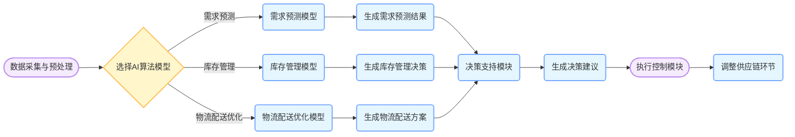

# AI在智能供应链管理中的优化应用

> 关键词：人工智能、智能供应链管理、优化应用、需求预测、库存管理

> 摘要：本文聚焦于AI在智能供应链管理中的优化应用。首先介绍了研究的背景、目的、预期读者等内容，接着阐述了智能供应链管理和AI的核心概念及其联系，详细讲解了相关核心算法原理与操作步骤，给出了数学模型和公式并举例说明。通过项目实战展示了AI在供应链管理中的具体应用，分析了实际应用场景，推荐了相关的学习资源、开发工具框架以及论文著作。最后总结了未来发展趋势与挑战，解答了常见问题并提供了扩展阅读和参考资料，旨在为相关从业者和研究者提供全面深入的技术指导。

## 1. 背景介绍 
### 1.1 目的和范围
在当今全球化的商业环境中，供应链管理面临着诸多挑战，如需求波动、库存积压、物流成本高等。人工智能（AI）技术的发展为解决这些问题提供了新的途径。本文的目的在于深入探讨AI如何在智能供应链管理中发挥优化作用，涵盖从需求预测、库存管理到物流配送等多个环节。通过分析核心算法、数学模型以及实际案例，揭示AI在提升供应链效率、降低成本、增强灵活性等方面的潜力。

### 1.2 预期读者
本文的预期读者包括供应链管理领域的从业者，如物流经理、采购专员、库存管理员等，他们希望了解AI技术如何改进现有的供应链流程；计算机科学和人工智能领域的研究者和开发者，对将AI算法应用于供应链管理问题感兴趣；以及对新兴技术在商业领域应用有研究需求的企业管理人员和学者。

### 1.3 文档结构概述
本文将按照以下结构展开：首先介绍相关核心概念和它们之间的联系，通过文本示意图和Mermaid流程图进行清晰展示；接着详细讲解核心算法原理，并给出Python源代码示例；然后阐述相关的数学模型和公式，并举例说明其应用；通过项目实战展示AI在智能供应链管理中的具体实现，包括开发环境搭建、源代码详细解读和分析；分析AI在智能供应链管理中的实际应用场景；推荐相关的学习资源、开发工具框架和论文著作；最后总结未来发展趋势与挑战，解答常见问题并提供扩展阅读和参考资料。

### 1.4 术语表
#### 1.4.1 核心术语定义
- **人工智能（AI）**：是一门研究如何使计算机系统能够模拟人类智能的学科，包括机器学习、深度学习、自然语言处理等技术。
- **智能供应链管理**：利用先进的信息技术和管理方法，实现供应链各环节的智能化决策和优化，提高供应链的效率和灵活性。
- **需求预测**：通过分析历史数据和相关因素，预测未来一段时间内产品或服务的需求数量。
- **库存管理**：对企业的库存水平进行合理控制，以满足客户需求的同时，降低库存成本。
- **物流配送优化**：通过合理规划物流路线、调度运输资源等方式，提高物流配送的效率和降低成本。

#### 1.4.2 相关概念解释
- **机器学习**：是AI的一个重要分支，通过让计算机从数据中学习模式和规律，从而进行预测和决策。常见的机器学习算法包括线性回归、决策树、神经网络等。
- **深度学习**：是一种基于人工神经网络的机器学习技术，具有强大的特征提取和模式识别能力，在图像识别、语音识别等领域取得了显著成果。
- **大数据**：指海量、多样、高速产生的数据集合，为AI算法提供了丰富的训练数据。

#### 1.4.3 缩略词列表
- **AI**：Artificial Intelligence（人工智能）
- **ML**：Machine Learning（机器学习）
- **DL**：Deep Learning（深度学习）
- **SCM**：Supply Chain Management（供应链管理）

## 2. 核心概念与联系 
### 核心概念原理
智能供应链管理的核心目标是实现供应链的高效运作，包括需求预测的准确性、库存管理的合理性和物流配送的及时性。人工智能技术为实现这些目标提供了强大的工具。

- **需求预测**：传统的需求预测方法往往基于简单的统计模型，难以处理复杂的市场变化和不确定性。AI技术可以通过分析大量的历史数据、市场趋势、社交媒体信息等，建立更准确的需求预测模型。例如，利用机器学习算法可以学习到产品需求与季节、促销活动、竞争对手等因素之间的复杂关系，从而提高预测的准确性。

- **库存管理**：AI可以帮助企业优化库存水平，避免库存积压和缺货现象。通过实时监控库存状态、需求预测和供应链的动态变化，AI算法可以自动调整补货策略，实现库存的动态优化。例如，利用强化学习算法可以在不同的市场环境下，自动学习到最优的库存管理策略。

- **物流配送优化**：AI技术可以用于物流路线规划、车辆调度和运输资源分配等方面。通过分析交通流量、天气条件、货物重量和体积等因素，AI算法可以生成最优的物流配送方案，提高物流效率和降低成本。例如，利用遗传算法可以在多个物流配送方案中找到最优解。

### 架构的文本示意图
智能供应链管理系统可以看作是一个由多个模块组成的架构，各模块之间相互协作，实现供应链的智能化管理。主要模块包括数据采集与预处理模块、AI算法模型模块、决策支持模块和执行控制模块。

- 数据采集与预处理模块：负责收集供应链各环节的数据，如销售数据、库存数据、物流数据等，并对数据进行清洗、转换和特征提取等预处理操作，为后续的AI算法提供高质量的数据。

- AI算法模型模块：根据不同的业务需求，选择合适的AI算法进行建模，如需求预测模型、库存管理模型、物流配送优化模型等。这些模型通过对预处理后的数据进行学习和训练，生成预测结果和决策建议。

- 决策支持模块：将AI算法模型的输出结果进行分析和评估，结合企业的业务规则和目标，为供应链管理人员提供决策支持。例如，根据需求预测结果和库存水平，决定是否进行补货和补货的数量。

- 执行控制模块：根据决策支持模块的决策结果，对供应链各环节进行实时控制和调整。例如，自动生成采购订单、安排物流配送等。

### Mermaid流程图


## 3. 核心算法原理 & 具体操作步骤 
### 需求预测的线性回归算法原理及Python实现
#### 算法原理
线性回归是一种基本的机器学习算法，用于建立自变量和因变量之间的线性关系。在需求预测中，我们可以将产品的需求数量作为因变量，将影响需求的因素（如季节、促销活动等）作为自变量。线性回归模型的一般形式为：

$$y = \beta_0 + \beta_1x_1 + \beta_2x_2 + \cdots + \beta_nx_n + \epsilon$$

其中，$y$ 是因变量（需求数量），$x_1, x_2, \cdots, x_n$ 是自变量，$\beta_0, \beta_1, \cdots, \beta_n$ 是模型的参数，$\epsilon$ 是误差项。

线性回归的目标是通过最小化误差平方和来估计模型的参数，即：

$$\min_{\beta_0, \beta_1, \cdots, \beta_n} \sum_{i=1}^{m} (y_i - (\beta_0 + \beta_1x_{i1} + \beta_2x_{i2} + \cdots + \beta_nx_{in}))^2$$

其中，$m$ 是样本数量。

#### 具体操作步骤
1. **数据收集与预处理**：收集历史需求数据和相关的影响因素数据，并进行清洗、转换和特征提取等预处理操作。
2. **模型训练**：使用训练数据对线性回归模型进行训练，估计模型的参数。
3. **模型评估**：使用测试数据对训练好的模型进行评估，计算评估指标（如均方误差、平均绝对误差等）。
4. **需求预测**：使用训练好的模型对未来的需求进行预测。

#### Python源代码实现
```python
import numpy as np
from sklearn.linear_model import LinearRegression
from sklearn.metrics import mean_squared_error, mean_absolute_error
from sklearn.model_selection import train_test_split

# 生成示例数据
np.random.seed(0)
X = np.random.rand(100, 2)  # 自变量
y = 2 * X[:, 0] + 3 * X[:, 1] + np.random.randn(100)  # 因变量

# 划分训练集和测试集
X_train, X_test, y_train, y_test = train_test_split(X, y, test_size=0.2, random_state=0)

# 创建线性回归模型
model = LinearRegression()

# 模型训练
model.fit(X_train, y_train)

# 模型预测
y_pred = model.predict(X_test)

# 模型评估
mse = mean_squared_error(y_test, y_pred)
mae = mean_absolute_error(y_test, y_pred)

print(f"均方误差: {mse}")
print(f"平均绝对误差: {mae}")

# 未来需求预测示例
new_X = np.array([[0.5, 0.6]])
new_y_pred = model.predict(new_X)
print(f"未来需求预测值: {new_y_pred[0]}")
```

### 库存管理的强化学习算法原理及Python实现
#### 算法原理
强化学习是一种通过智能体与环境进行交互，不断学习最优策略的机器学习方法。在库存管理中，智能体可以看作是库存管理者，环境是供应链系统，智能体的目标是通过选择合适的补货策略，最大化长期的收益（如最小化库存成本和缺货成本）。

强化学习的核心概念包括状态、动作和奖励。状态表示环境的当前状态，如库存水平、需求预测等；动作表示智能体可以采取的行动，如补货数量；奖励表示智能体采取某个动作后，环境给予的反馈，如成本节约或损失。

强化学习的目标是找到一个最优策略，使得智能体在每个状态下都能选择最优的动作，从而最大化累积奖励。常用的强化学习算法包括Q学习、深度Q网络（DQN）等。

#### 具体操作步骤
1. **定义状态、动作和奖励**：根据库存管理的实际问题，定义状态空间、动作空间和奖励函数。
2. **初始化智能体和环境**：初始化强化学习智能体和供应链环境。
3. **训练智能体**：智能体与环境进行交互，不断学习最优策略。
4. **应用最优策略**：使用训练好的智能体进行库存管理决策。

#### Python源代码实现
```python
import numpy as np
import random

# 定义状态空间和动作空间
state_space = range(0, 10)  # 库存水平从0到9
action_space = range(0, 5)  # 补货数量从0到4

# 初始化Q表
Q = np.zeros((len(state_space), len(action_space)))

# 定义超参数
alpha = 0.1  # 学习率
gamma = 0.9  # 折扣因子
epsilon = 0.1  # 探索率
num_episodes = 1000

# 定义奖励函数
def get_reward(state, action, demand):
    new_state = state + action - demand
    if new_state < 0:
        # 缺货惩罚
        return -10
    elif new_state > 5:
        # 库存积压惩罚
        return -5
    else:
        return 1

# 训练智能体
for episode in range(num_episodes):
    state = random.choice(state_space)
    done = False
    while not done:
        if random.uniform(0, 1) < epsilon:
            # 探索：随机选择动作
            action = random.choice(action_space)
        else:
            # 利用：选择Q值最大的动作
            action = np.argmax(Q[state])
        
        # 模拟需求
        demand = random.randint(0, 3)
        
        # 获取奖励
        reward = get_reward(state, action, demand)
        
        # 更新状态
        new_state = state + action - demand
        if new_state < 0:
            new_state = 0
        elif new_state >= len(state_space):
            new_state = len(state_space) - 1
        
        # 更新Q表
        Q[state][action] = (1 - alpha) * Q[state][action] + alpha * (reward + gamma * np.max(Q[new_state]))
        
        state = new_state
        
        if state == 0:
            done = True

# 应用最优策略进行库存管理决策
current_state = 3
action = np.argmax(Q[current_state])
print(f"当前库存水平: {current_state}")
print(f"最优补货数量: {action}")
```

## 4. 数学模型和公式 & 详细讲解 & 举例说明 
### 需求预测的时间序列模型
#### 数学模型和公式
时间序列模型是一种常用的需求预测方法，用于分析和预测随时间变化的数据。常见的时间序列模型包括自回归（AR）模型、移动平均（MA）模型和自回归移动平均（ARMA）模型等。

- **自回归（AR）模型**：假设当前时刻的观测值是过去若干时刻观测值的线性组合，其数学模型为：

$$y_t = c + \sum_{i=1}^{p} \phi_iy_{t - i} + \epsilon_t$$

其中，$y_t$ 是当前时刻的观测值，$c$ 是常数项，$\phi_1, \phi_2, \cdots, \phi_p$ 是自回归系数，$p$ 是自回归阶数，$\epsilon_t$ 是白噪声。

- **移动平均（MA）模型**：假设当前时刻的观测值是过去若干时刻白噪声的线性组合，其数学模型为：

$$y_t = \mu + \epsilon_t + \sum_{i=1}^{q} \theta_i\epsilon_{t - i}$$

其中，$\mu$ 是均值，$\theta_1, \theta_2, \cdots, \theta_q$ 是移动平均系数，$q$ 是移动平均阶数。

- **自回归移动平均（ARMA）模型**：结合了自回归模型和移动平均模型的特点，其数学模型为：

$$y_t = c + \sum_{i=1}^{p} \phi_iy_{t - i} + \epsilon_t + \sum_{i=1}^{q} \theta_i\epsilon_{t - i}$$

#### 详细讲解
AR模型主要考虑了时间序列的自相关性，通过过去的观测值来预测未来的值。MA模型则主要考虑了随机干扰的影响，通过过去的白噪声来预测未来的值。ARMA模型综合了两者的优点，能够更好地拟合时间序列数据。

在实际应用中，需要确定合适的自回归阶数 $p$ 和移动平均阶数 $q$。常用的方法包括信息准则法（如AIC、BIC）和自相关函数（ACF）、偏自相关函数（PACF）分析等。

#### 举例说明
假设我们有一个时间序列数据 $y = [1, 2, 3, 4, 5, 6, 7, 8, 9, 10]$，我们可以使用Python的 `statsmodels` 库来拟合ARMA模型并进行预测。

```python
import numpy as np
import statsmodels.api as sm

# 生成示例时间序列数据
y = np.array([1, 2, 3, 4, 5, 6, 7, 8, 9, 10])

# 拟合ARMA模型
model = sm.tsa.ARMA(y, order=(1, 1))
results = model.fit()

# 进行预测
forecast = results.forecast(steps=3)
print(f"未来3期的预测值: {forecast[0]}")
```

### 库存管理的经济订货批量（EOQ）模型
#### 数学模型和公式
经济订货批量（EOQ）模型是一种经典的库存管理模型，用于确定最优的订货批量，以最小化库存总成本。库存总成本包括采购成本、订货成本和持有成本。

假设：
- $D$ 是年需求量
- $S$ 是每次订货的成本
- $H$ 是单位产品的年持有成本
- $Q$ 是订货批量

则库存总成本 $TC$ 可以表示为：

$$TC = \frac{D}{Q}S + \frac{Q}{2}H$$

为了找到最小的库存总成本，我们对 $TC$ 关于 $Q$ 求导数，并令导数等于0，得到：

$$\frac{dTC}{dQ} = -\frac{DS}{Q^2} + \frac{H}{2} = 0$$

解得最优订货批量 $Q^*$ 为：

$$Q^* = \sqrt{\frac{2DS}{H}}$$

#### 详细讲解
EOQ模型的核心思想是在订货成本和持有成本之间找到一个平衡点。当订货批量较小时，订货成本较高，但持有成本较低；当订货批量较大时，订货成本较低，但持有成本较高。通过求解最优订货批量 $Q^*$，可以使库存总成本最小。

需要注意的是，EOQ模型有一些假设条件，如年需求量稳定、订货提前期固定、不允许缺货等。在实际应用中，需要根据具体情况对模型进行调整。

#### 举例说明
假设某企业的年需求量 $D = 1000$ 件，每次订货的成本 $S = 50$ 元，单位产品的年持有成本 $H = 10$ 元。则根据EOQ模型，最优订货批量为：

$$Q^* = \sqrt{\frac{2 \times 1000 \times 50}{10}} = \sqrt{10000} = 100$$（件）

这意味着该企业每次订货的最优批量为100件，此时库存总成本最小。

## 5. 项目实战：代码实际案例和详细解释说明 
### 5.1  开发环境搭建
#### 安装Python
首先，需要安装Python开发环境。可以从Python官方网站（https://www.python.org/downloads/）下载适合自己操作系统的Python安装包，并按照安装向导进行安装。建议安装Python 3.6及以上版本。

#### 安装必要的库
在智能供应链管理项目中，需要使用一些Python库来实现相关功能。可以使用 `pip` 命令来安装这些库：

```sh
pip install numpy pandas scikit-learn statsmodels matplotlib
```

- `numpy`：用于数值计算和数组操作。
- `pandas`：用于数据处理和分析。
- `scikit-learn`：提供了丰富的机器学习算法和工具。
- `statsmodels`：用于时间序列分析和统计建模。
- `matplotlib`：用于数据可视化。

### 5.2  源代码详细实现和代码解读
#### 需求预测项目
以下是一个使用线性回归模型进行需求预测的完整项目示例：

```python
import numpy as np
import pandas as pd
from sklearn.linear_model import LinearRegression
from sklearn.metrics import mean_squared_error, mean_absolute_error
from sklearn.model_selection import train_test_split
import matplotlib.pyplot as plt

# 读取数据
data = pd.read_csv('demand_data.csv')

# 提取自变量和因变量
X = data[['feature1', 'feature2']].values
y = data['demand'].values

# 划分训练集和测试集
X_train, X_test, y_train, y_test = train_test_split(X, y, test_size=0.2, random_state=0)

# 创建线性回归模型
model = LinearRegression()

# 模型训练
model.fit(X_train, y_train)

# 模型预测
y_pred = model.predict(X_test)

# 模型评估
mse = mean_squared_error(y_test, y_pred)
mae = mean_absolute_error(y_test, y_pred)

print(f"均方误差: {mse}")
print(f"平均绝对误差: {mae}")

# 可视化预测结果
plt.scatter(y_test, y_pred)
plt.xlabel('实际需求')
plt.ylabel('预测需求')
plt.title('需求预测结果')
plt.show()

# 未来需求预测示例
new_X = np.array([[1.5, 2.0]])
new_y_pred = model.predict(new_X)
print(f"未来需求预测值: {new_y_pred[0]}")
```

**代码解读**：
1. **数据读取**：使用 `pandas` 库的 `read_csv` 函数读取包含需求数据的CSV文件。
2. **数据预处理**：提取自变量和因变量，并将其转换为NumPy数组。
3. **数据集划分**：使用 `train_test_split` 函数将数据集划分为训练集和测试集，测试集占比为20%。
4. **模型创建与训练**：创建线性回归模型，并使用训练集数据进行训练。
5. **模型预测与评估**：使用训练好的模型对测试集数据进行预测，并计算均方误差和平均绝对误差来评估模型性能。
6. **可视化**：使用 `matplotlib` 库绘制实际需求和预测需求的散点图，直观展示预测结果。
7. **未来需求预测**：使用训练好的模型对新的自变量数据进行预测，得到未来需求预测值。

#### 库存管理项目
以下是一个使用强化学习进行库存管理的完整项目示例：

```python
import numpy as np
import random
import matplotlib.pyplot as plt

# 定义状态空间和动作空间
state_space = range(0, 10)  # 库存水平从0到9
action_space = range(0, 5)  # 补货数量从0到4

# 初始化Q表
Q = np.zeros((len(state_space), len(action_space)))

# 定义超参数
alpha = 0.1  # 学习率
gamma = 0.9  # 折扣因子
epsilon = 0.1  # 探索率
num_episodes = 1000

# 定义奖励函数
def get_reward(state, action, demand):
    new_state = state + action - demand
    if new_state < 0:
        # 缺货惩罚
        return -10
    elif new_state > 5:
        # 库存积压惩罚
        return -5
    else:
        return 1

# 训练智能体
total_rewards = []
for episode in range(num_episodes):
    state = random.choice(state_space)
    total_reward = 0
    done = False
    while not done:
        if random.uniform(0, 1) < epsilon:
            # 探索：随机选择动作
            action = random.choice(action_space)
        else:
            # 利用：选择Q值最大的动作
            action = np.argmax(Q[state])
        
        # 模拟需求
        demand = random.randint(0, 3)
        
        # 获取奖励
        reward = get_reward(state, action, demand)
        total_reward += reward
        
        # 更新状态
        new_state = state + action - demand
        if new_state < 0:
            new_state = 0
        elif new_state >= len(state_space):
            new_state = len(state_space) - 1
        
        # 更新Q表
        Q[state][action] = (1 - alpha) * Q[state][action] + alpha * (reward + gamma * np.max(Q[new_state]))
        
        state = new_state
        
        if state == 0:
            done = True
    
    total_rewards.append(total_reward)

# 可视化训练过程
plt.plot(total_rewards)
plt.xlabel('训练回合数')
plt.ylabel('总奖励')
plt.title('强化学习训练过程')
plt.show()

# 应用最优策略进行库存管理决策
current_state = 3
action = np.argmax(Q[current_state])
print(f"当前库存水平: {current_state}")
print(f"最优补货数量: {action}")
```

**代码解读**：
1. **状态空间和动作空间定义**：定义库存水平和补货数量的取值范围。
2. **Q表初始化**：初始化Q表，用于存储每个状态-动作对的Q值。
3. **超参数设置**：设置学习率、折扣因子和探索率等超参数。
4. **奖励函数定义**：根据库存水平和补货数量，计算每个动作的奖励。
5. **智能体训练**：通过多个训练回合，智能体与环境进行交互，不断更新Q表，学习最优策略。
6. **训练过程可视化**：使用 `matplotlib` 库绘制总奖励随训练回合数的变化曲线，直观展示训练过程。
7. **库存管理决策**：根据训练好的Q表，选择当前状态下的最优补货数量。

### 5.3  代码解读与分析
#### 需求预测项目分析
- **数据质量**：需求预测的准确性很大程度上依赖于数据的质量。在实际项目中，需要对数据进行仔细的清洗和预处理，去除异常值和缺失值，以提高模型的性能。
- **特征工程**：选择合适的特征对于需求预测至关重要。可以通过相关性分析、特征选择算法等方法，筛选出对需求影响较大的特征，提高模型的预测能力。
- **模型评估**：除了均方误差和平均绝对误差，还可以使用其他评估指标，如决定系数（$R^2$）、均方根误差（RMSE）等，全面评估模型的性能。

#### 库存管理项目分析
- **超参数调整**：强化学习算法的性能对超参数非常敏感。在实际项目中，需要通过实验和调优，找到合适的学习率、折扣因子和探索率等超参数，以提高智能体的学习效率和决策质量。
- **奖励函数设计**：奖励函数的设计直接影响智能体的学习目标和行为。在设计奖励函数时，需要综合考虑库存成本、缺货成本等因素，确保智能体能够学习到最优的库存管理策略。
- **环境模拟**：在训练智能体时，需要对供应链环境进行合理的模拟。可以考虑引入更多的因素，如需求的季节性变化、供应商的交货期波动等，提高模型的真实性和实用性。

## 6. 实际应用场景 
### 需求预测场景
- **零售行业**：零售商可以利用AI技术对不同商品的需求进行预测，以便合理安排采购计划和库存水平。例如，根据历史销售数据、节假日信息、促销活动等因素，预测某款服装在未来一段时间的销量，从而提前做好库存准备，避免缺货和积压。
- **制造业**：制造企业可以通过需求预测来优化生产计划。根据市场需求预测，合理安排原材料采购、生产进度和人员调配，提高生产效率和降低成本。例如，汽车制造企业可以根据市场对不同车型的需求预测，调整生产线的产量和配置。

### 库存管理场景
- **电商行业**：电商平台需要管理大量的商品库存。AI技术可以帮助电商企业实时监控库存状态，自动调整补货策略。例如，当某个商品的库存水平低于一定阈值时，系统自动生成补货订单，并根据供应商的交货期和价格等因素，选择最优的供应商。
- **医药行业**：医药企业的库存管理直接关系到药品的供应和质量安全。通过AI技术，可以对药品的需求进行精准预测，优化库存结构，减少过期药品的损失。同时，实时监控药品的库存状态，确保药品的及时供应。

### 物流配送优化场景
- **快递行业**：快递企业需要处理大量的包裹配送任务。AI技术可以用于优化物流路线规划和车辆调度，提高配送效率和降低成本。例如，通过分析包裹的目的地、重量、体积等信息，结合交通流量和天气条件，生成最优的配送方案，减少配送时间和车辆行驶里程。
- **冷链物流**：冷链物流对温度和时间的要求非常高。AI技术可以实时监控货物的温度和运输状态，优化配送路线和运输方式，确保货物的质量安全。例如，通过预测运输过程中的温度变化，及时调整制冷设备的运行参数，保证货物在适宜的温度环境下运输。

## 7. 工具和资源推荐
### 7.1 学习资源推荐
#### 7.1.1 书籍推荐
- 《Python机器学习》：本书全面介绍了Python在机器学习领域的应用，包括各种机器学习算法的原理和实现，以及如何使用Python库进行数据处理、模型训练和评估。
- 《深度学习》：由深度学习领域的三位顶尖专家撰写，系统地介绍了深度学习的基本概念、算法和应用，是深度学习领域的经典教材。
- 《供应链管理：战略、规划与运营》：本书详细介绍了供应链管理的各个环节，包括需求预测、库存管理、物流配送等，提供了丰富的案例和实践经验。

#### 7.1.2 在线课程
- Coursera上的“机器学习”课程：由斯坦福大学教授Andrew Ng主讲，是机器学习领域最受欢迎的在线课程之一，系统地介绍了机器学习的基本概念、算法和应用。
- edX上的“深度学习”课程：由微软和伯克利大学联合推出，深入介绍了深度学习的原理和应用，包括神经网络、卷积神经网络、循环神经网络等。
- 网易云课堂上的“智能供应链管理”课程：结合实际案例，介绍了AI技术在供应链管理中的应用，包括需求预测、库存管理、物流配送优化等。

#### 7.1.3 技术博客和网站
- Medium：是一个知名的技术博客平台，上面有很多关于AI和供应链管理的文章，涵盖了最新的技术趋势、研究成果和实践经验。
- Kaggle：是一个数据科学竞赛平台，上面有很多关于供应链管理和机器学习的数据集和竞赛项目，可以通过参与竞赛来提高自己的实践能力。
- Supply Chain Dive：是一个专注于供应链管理的新闻和资讯网站，提供了最新的供应链行业动态、技术应用和案例分析。

### 7.2 开发工具框架推荐
#### 7.2.1 IDE和编辑器
- PyCharm：是一款专门为Python开发设计的集成开发环境（IDE），具有代码自动补全、调试、版本控制等功能，适合开发大型的Python项目。
- Jupyter Notebook：是一个交互式的开发环境，支持Python、R等多种编程语言，可以方便地进行数据探索、模型开发和可视化。
- Visual Studio Code：是一款轻量级的代码编辑器，支持多种编程语言和插件扩展，具有丰富的代码编辑和调试功能。

#### 7.2.2 调试和性能分析工具
- Py-Spy：是一个用于Python程序性能分析的工具，可以实时监控Python程序的CPU使用率、函数调用时间等信息，帮助开发者找出性能瓶颈。
- TensorBoard：是TensorFlow提供的一个可视化工具，可以用于可视化深度学习模型的训练过程、网络结构和性能指标等。
- Memory Profiler：是一个用于Python程序内存分析的工具，可以帮助开发者找出内存泄漏和内存占用过高的问题。

#### 7.2.3 相关框架和库
- TensorFlow：是一个开源的深度学习框架，由Google开发，提供了丰富的深度学习模型和工具，支持分布式训练和部署。
- PyTorch：是另一个流行的深度学习框架，由Facebook开发，具有动态计算图、易于使用等特点，广泛应用于学术界和工业界。
- Scikit-learn：是一个用于机器学习的Python库，提供了各种机器学习算法和工具，包括分类、回归、聚类等，简单易用，适合初学者。

### 7.3 相关论文著作推荐
#### 7.3.1 经典论文
- “Supply Chain Coordination under Uncertainty”：该论文探讨了在不确定性环境下供应链协调的问题，提出了一些有效的协调机制和策略。
- “Machine Learning for Demand Forecasting in Supply Chain Management”：介绍了机器学习技术在供应链需求预测中的应用，分析了不同机器学习算法的优缺点和适用场景。
- “Reinforcement Learning in Inventory Management”：研究了强化学习在库存管理中的应用，提出了一种基于强化学习的库存管理策略优化方法。

#### 7.3.2 最新研究成果
- 在IEEE Transactions on Automation Science and Engineering、Manufacturing & Service Operations Management等期刊上，经常发表关于AI在供应链管理中应用的最新研究成果，可以关注这些期刊获取最新的研究动态。
- 参加国际供应链管理会议（如INFORMS Annual Meeting、POMS Annual Conference等），可以了解到最新的研究成果和行业趋势。

#### 7.3.3 应用案例分析
- 一些知名企业（如亚马逊、沃尔玛等）在AI应用于供应链管理方面有很多成功的案例。可以通过查阅企业的官方报告、新闻稿和相关研究论文，了解这些企业的实践经验和应用效果。

## 8. 总结：未来发展趋势与挑战
### 未来发展趋势
- **融合更多技术**：AI将与物联网（IoT）、区块链、大数据等技术深度融合，实现供应链各环节的实时数据共享和协同决策。例如，通过物联网设备实时采集供应链中的物流信息、库存信息等，结合AI算法进行分析和预测，提高供应链的透明度和响应速度。
- **智能化决策**：随着AI技术的不断发展，供应链管理将实现更加智能化的决策。智能体将能够自动感知环境变化，实时调整决策策略，实现供应链的自适应优化。例如，在需求预测方面，智能体可以根据市场动态自动调整预测模型，提高预测的准确性。
- **绿色供应链**：环保和可持续发展已成为全球关注的焦点。AI技术可以帮助企业优化供应链流程，减少能源消耗和环境污染。例如，通过优化物流路线和运输方式，降低碳排放；通过合理控制库存水平，减少资源浪费。

### 挑战
- **数据质量和安全**：AI算法的性能依赖于高质量的数据。在供应链管理中，数据来源广泛，数据质量参差不齐，且涉及企业的商业机密和客户隐私，数据安全问题不容忽视。因此，如何保证数据的准确性、完整性和安全性是一个重要的挑战。
- **技术人才短缺**：AI技术在供应链管理中的应用需要既懂AI技术又懂供应链管理的复合型人才。目前，这类人才相对短缺，企业难以找到合适的人才来推动AI技术在供应链管理中的应用。
- **算法可解释性**：一些复杂的AI算法（如深度学习算法）具有较高的预测准确性，但缺乏可解释性。在供应链管理中，决策者需要了解算法的决策依据，以便做出合理的决策。因此，如何提高AI算法的可解释性是一个亟待解决的问题。

## 9. 附录：常见问题与解答
### 问题1：AI在供应链管理中的应用是否需要大量的数据？
解答：是的，AI算法的性能通常依赖于大量的数据。通过分析大量的历史数据，AI算法可以学习到数据中的模式和规律，从而提高预测和决策的准确性。在实际应用中，需要收集和整理供应链各环节的数据，包括销售数据、库存数据、物流数据等，并进行清洗和预处理，以确保数据的质量。

### 问题2：如何选择适合的AI算法用于供应链管理？
解答：选择适合的AI算法需要考虑多个因素，如问题的类型、数据的特点、算法的复杂度等。对于需求预测问题，可以选择线性回归、时间序列模型、神经网络等算法；对于库存管理问题，可以选择强化学习、动态规划等算法；对于物流配送优化问题，可以选择遗传算法、蚁群算法等算法。在选择算法时，还可以通过实验和比较不同算法的性能，选择最优的算法。

### 问题3：AI技术在供应链管理中的应用是否会导致大量的人员失业？
解答：虽然AI技术的应用可能会对一些传统的供应链管理岗位产生影响，但也会创造新的就业机会。例如，需要专业的AI工程师来开发和维护AI系统，需要供应链分析师来解读AI算法的输出结果并做出决策。此外，AI技术可以帮助企业提高供应链的效率和竞争力，促进企业的发展，从而创造更多的就业机会。因此，AI技术的应用不会导致大量的人员失业，而是会推动供应链管理岗位的升级和转型。

## 10. 扩展阅读 & 参考资料
### 扩展阅读
- 《人工智能时代的供应链创新》：深入探讨了AI技术在供应链管理中的创新应用和发展趋势。
- 《数字化供应链转型》：介绍了企业如何通过数字化技术（包括AI）实现供应链的转型和升级。
- 《智能物流：技术与应用》：详细介绍了AI技术在物流领域的应用，包括物流规划、仓储管理、配送优化等。

### 参考资料
- 相关学术论文和研究报告，如IEEE、ACM等学术组织发表的关于AI和供应链管理的论文。
- 企业的官方网站和报告，如亚马逊、沃尔玛等企业关于供应链管理的实践经验和成果。
- 行业研究机构的报告，如Gartner、Forrester等发布的关于AI在供应链管理中应用的市场研究报告。

作者：AI天才研究院/AI Genius Institute & 禅与计算机程序设计艺术 /Zen And The Art of Computer Programming