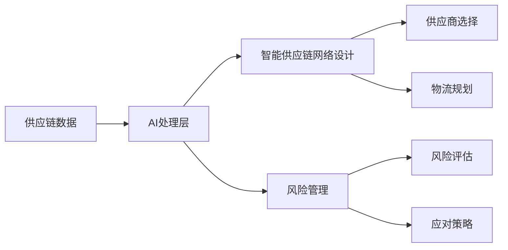

# AI在智能供应链网络设计与风险管理中的应用

> 关键词：人工智能、智能供应链网络设计、风险管理、机器学习、数据分析

> 摘要：本文深入探讨了AI在智能供应链网络设计与风险管理中的应用。首先介绍了相关背景，包括目的、预期读者等。接着阐述了核心概念及联系，通过示意图和流程图展示其架构。详细讲解了核心算法原理及具体操作步骤，结合Python代码进行说明。分析了相关数学模型和公式，并举例说明。通过项目实战，给出代码案例并详细解读。探讨了实际应用场景，推荐了学习资源、开发工具框架以及相关论文著作。最后总结了未来发展趋势与挑战，解答常见问题并提供扩展阅读和参考资料，旨在为相关领域的研究和实践提供全面而深入的指导。

## 1. 背景介绍 
### 1.1 目的和范围
在当今全球化和数字化的商业环境下，供应链网络变得日益复杂。智能供应链网络设计需要综合考虑多个因素，如供应商选择、物流配送、库存管理等，以实现成本最小化和服务水平最大化。同时，供应链面临着各种风险，如自然灾害、市场波动、供应商违约等，有效的风险管理至关重要。本文章的目的在于探讨如何运用AI技术来优化智能供应链网络设计和进行有效的风险管理。范围涵盖了AI在供应链各个环节的应用，包括需求预测、库存优化、运输路线规划以及风险评估和应对等方面。

### 1.2 预期读者
本文预期读者包括供应链管理领域的专业人士，如供应链经理、物流专员等，他们可以从中获取AI技术在实际工作中的应用方法和思路；AI和数据分析领域的开发者和研究人员，能够了解供应链场景下的具体需求和挑战；高校相关专业的师生，可作为学习和研究的参考资料。

### 1.3 文档结构概述
本文将按照以下结构进行阐述：首先介绍背景知识，包括目的、读者和文档结构等；接着讲解核心概念和联系，通过示意图和流程图展示AI与供应链网络设计及风险管理的关系；然后详细说明核心算法原理和具体操作步骤，结合Python代码进行演示；分析相关的数学模型和公式，并举例说明其应用；通过项目实战给出代码案例并进行详细解读；探讨AI在供应链中的实际应用场景；推荐学习资源、开发工具框架和相关论文著作；最后总结未来发展趋势与挑战，解答常见问题并提供扩展阅读和参考资料。

### 1.4 术语表
#### 1.4.1 核心术语定义
- **智能供应链网络设计**：运用先进的技术和方法，综合考虑供应链中的各种因素，对供应链的结构、流程和资源进行优化设计，以实现高效运作和价值最大化。
- **风险管理**：识别、评估和应对供应链中可能出现的风险，降低风险对供应链运营的影响。
- **人工智能（AI）**：让计算机系统模拟人类智能的技术，包括机器学习、深度学习、自然语言处理等。
- **机器学习**：AI的一个分支，通过让计算机从数据中学习模式和规律，从而进行预测和决策。
- **深度学习**：一种基于人工神经网络的机器学习方法，能够处理复杂的非线性关系。

#### 1.4.2 相关概念解释
- **需求预测**：通过分析历史数据和市场趋势，预测未来产品或服务的需求数量和时间。
- **库存优化**：确定最佳的库存水平，以平衡库存成本和客户服务水平。
- **运输路线规划**：选择最优的运输路线，以降低运输成本和时间。
- **风险评估**：对供应链中可能出现的风险进行量化和评估，确定风险的可能性和影响程度。

#### 1.4.3 缩略词列表
- **AI**：Artificial Intelligence（人工智能）
- **ML**：Machine Learning（机器学习）
- **DL**：Deep Learning（深度学习）
- **SCM**：Supply Chain Management（供应链管理）

## 2. 核心概念与联系 
### 核心概念原理
在智能供应链网络设计与风险管理中，AI主要通过数据驱动的方式发挥作用。AI系统首先收集供应链各个环节的数据，包括供应商信息、生产数据、物流数据、销售数据等。然后运用机器学习和深度学习算法对这些数据进行分析和处理，挖掘其中的模式和规律。

在智能供应链网络设计方面，AI可以用于优化供应商选择。通过分析供应商的历史绩效数据，如交货准时率、产品质量等，预测供应商未来的表现，从而选择最合适的供应商。在物流配送方面，AI可以根据实时交通数据、货物重量和体积等信息，优化运输路线，降低运输成本。

在风险管理方面，AI可以通过对大量历史风险事件数据的学习，建立风险评估模型。例如，分析自然灾害、市场波动等因素对供应链的影响，预测可能出现的风险，并提前制定应对策略。

### 架构的文本示意图
```plaintext
+----------------------+
|      供应链数据      |
| （供应商、生产、物流等） |
+----------------------+
          |
          v
+----------------------+
|       AI处理层       |
| （机器学习、深度学习） |
+----------------------+
          |
          v
+----------------------+
| 智能供应链网络设计  |
| （供应商选择、物流规划） |
+----------------------+
          |
          v
+----------------------+
|      风险管理        |
| （风险评估、应对策略） |
+----------------------+
```

### Mermaid流程图


## 3. 核心算法原理 & 具体操作步骤 
### 核心算法原理
在智能供应链网络设计与风险管理中，常用的机器学习算法包括线性回归、决策树、神经网络等。下面以线性回归为例进行详细讲解。

线性回归是一种用于预测连续数值的统计方法。假设我们有一组数据 $(x_1, y_1), (x_2, y_2), \cdots, (x_n, y_n)$，其中 $x_i$ 是输入特征，$y_i$ 是对应的输出值。线性回归的目标是找到一条直线 $y = \theta_0 + \theta_1x$，使得预测值 $\hat{y}_i$ 与真实值 $y_i$ 之间的误差最小。误差通常用均方误差（Mean Squared Error, MSE）来衡量，其公式为：

$$MSE = \frac{1}{n}\sum_{i = 1}^{n}(y_i - \hat{y}_i)^2$$

通过最小化均方误差，可以得到最优的参数 $\theta_0$ 和 $\theta_1$。

### 具体操作步骤
以下是使用Python实现线性回归进行需求预测的具体步骤：

```python
import numpy as np
from sklearn.linear_model import LinearRegression
from sklearn.model_selection import train_test_split
import matplotlib.pyplot as plt

# 生成示例数据
np.random.seed(0)
X = np.linspace(0, 10, 100).reshape(-1, 1)
y = 2 * X + 1 + np.random.randn(100, 1)

# 划分训练集和测试集
X_train, X_test, y_train, y_test = train_test_split(X, y, test_size=0.2, random_state=42)

# 创建线性回归模型
model = LinearRegression()

# 训练模型
model.fit(X_train, y_train)

# 预测
y_pred = model.predict(X_test)

# 计算均方误差
mse = np.mean((y_test - y_pred) ** 2)
print(f"均方误差: {mse}")

# 可视化结果
plt.scatter(X_test, y_test, color='blue', label='真实值')
plt.plot(X_test, y_pred, color='red', linewidth=2, label='预测值')
plt.xlabel('特征')
plt.ylabel('需求')
plt.title('线性回归需求预测')
plt.legend()
plt.show()
```

### 代码解释
1. **数据生成**：使用 `np.linspace` 生成100个在0到10之间的特征值，并通过线性关系加上随机噪声生成对应的需求值。
2. **数据划分**：使用 `train_test_split` 函数将数据划分为训练集和测试集，测试集占比20%。
3. **模型创建**：创建 `LinearRegression` 模型。
4. **模型训练**：使用训练集数据对模型进行训练。
5. **预测**：使用训练好的模型对测试集数据进行预测。
6. **误差计算**：计算预测值与真实值之间的均方误差。
7. **可视化**：使用 `matplotlib` 库将真实值和预测值可视化。

## 4. 数学模型和公式 & 详细讲解 & 举例说明 
### 线性回归模型
线性回归模型的一般形式为：

$$y = \theta_0 + \theta_1x_1 + \theta_2x_2 + \cdots + \theta_nx_n + \epsilon$$

其中，$y$ 是输出值，$x_1, x_2, \cdots, x_n$ 是输入特征，$\theta_0, \theta_1, \cdots, \theta_n$ 是模型的参数，$\epsilon$ 是误差项。

在简单线性回归中，只有一个输入特征 $x$，模型可以简化为：

$$y = \theta_0 + \theta_1x + \epsilon$$

### 最小二乘法求解参数
最小二乘法的目标是最小化误差平方和：

$$J(\theta_0, \theta_1) = \frac{1}{2m}\sum_{i = 1}^{m}(y^{(i)} - (\theta_0 + \theta_1x^{(i)}))^2$$

其中，$m$ 是样本数量，$y^{(i)}$ 是第 $i$ 个样本的真实值，$x^{(i)}$ 是第 $i$ 个样本的输入特征。

为了找到使 $J(\theta_0, \theta_1)$ 最小的 $\theta_0$ 和 $\theta_1$，我们可以分别对 $\theta_0$ 和 $\theta_1$ 求偏导数，并令其等于0：

$$\frac{\partial J(\theta_0, \theta_1)}{\partial \theta_0} = \frac{1}{m}\sum_{i = 1}^{m}(y^{(i)} - (\theta_0 + \theta_1x^{(i)}))(-1) = 0$$

$$\frac{\partial J(\theta_0, \theta_1)}{\partial \theta_1} = \frac{1}{m}\sum_{i = 1}^{m}(y^{(i)} - (\theta_0 + \theta_1x^{(i)}))(-x^{(i)}) = 0$$

解上述方程组，可以得到：

$$\theta_1 = \frac{\sum_{i = 1}^{m}(x^{(i)} - \bar{x})(y^{(i)} - \bar{y})}{\sum_{i = 1}^{m}(x^{(i)} - \bar{x})^2}$$

$$\theta_0 = \bar{y} - \theta_1\bar{x}$$

其中，$\bar{x}$ 和 $\bar{y}$ 分别是 $x$ 和 $y$ 的均值。

### 举例说明
假设我们有以下数据集：

| $x$ | $y$ |
| --- | --- |
| 1 | 3 |
| 2 | 5 |
| 3 | 7 |
| 4 | 9 |

首先计算均值：

$$\bar{x} = \frac{1 + 2 + 3 + 4}{4} = 2.5$$

$$\bar{y} = \frac{3 + 5 + 7 + 9}{4} = 6$$

然后计算 $\theta_1$：

$$\sum_{i = 1}^{4}(x^{(i)} - \bar{x})(y^{(i)} - \bar{y}) = (1 - 2.5)(3 - 6) + (2 - 2.5)(5 - 6) + (3 - 2.5)(7 - 6) + (4 - 2.5)(9 - 6) = 10$$

$$\sum_{i = 1}^{4}(x^{(i)} - \bar{x})^2 = (1 - 2.5)^2 + (2 - 2.5)^2 + (3 - 2.5)^2 + (4 - 2.5)^2 = 5$$

$$\theta_1 = \frac{10}{5} = 2$$

最后计算 $\theta_0$：

$$\theta_0 = 6 - 2 \times 2.5 = 1$$

所以，线性回归模型为 $y = 1 + 2x$。

## 5. 项目实战：代码实际案例和详细解释说明 
### 5.1  开发环境搭建
#### 安装Python
首先需要安装Python，建议使用Python 3.7及以上版本。可以从Python官方网站（https://www.python.org/downloads/）下载安装包，按照安装向导进行安装。

#### 安装必要的库
使用以下命令安装必要的Python库：

```bash
pip install numpy pandas scikit-learn matplotlib
```

### 5.2  源代码详细实现和代码解读
以下是一个使用决策树算法进行供应商风险评估的代码示例：

```python
import pandas as pd
from sklearn.tree import DecisionTreeClassifier
from sklearn.model_selection import train_test_split
from sklearn.metrics import accuracy_score

# 读取数据集
data = pd.read_csv('supplier_risk.csv')

# 分离特征和标签
X = data.drop('risk', axis=1)
y = data['risk']

# 划分训练集和测试集
X_train, X_test, y_train, y_test = train_test_split(X, y, test_size=0.2, random_state=42)

# 创建决策树模型
model = DecisionTreeClassifier()

# 训练模型
model.fit(X_train, y_train)

# 预测
y_pred = model.predict(X_test)

# 计算准确率
accuracy = accuracy_score(y_test, y_pred)
print(f"准确率: {accuracy}")
```

### 代码解读与分析
1. **数据读取**：使用 `pandas` 库的 `read_csv` 函数读取包含供应商风险信息的CSV文件。
2. **特征和标签分离**：将数据集中的特征（如供应商的交货准时率、产品质量等）和标签（风险等级）分离。
3. **数据划分**：使用 `train_test_split` 函数将数据划分为训练集和测试集，测试集占比20%。
4. **模型创建**：创建 `DecisionTreeClassifier` 模型。
5. **模型训练**：使用训练集数据对模型进行训练。
6. **预测**：使用训练好的模型对测试集数据进行预测。
7. **准确率计算**：使用 `accuracy_score` 函数计算预测结果的准确率。

## 6. 实际应用场景 
### 需求预测
AI可以通过分析历史销售数据、市场趋势、季节因素等，准确预测未来产品的需求。例如，电商平台可以根据用户的浏览记录、购买历史等数据，预测不同商品的需求，从而合理安排库存和采购计划。

### 库存优化
通过AI算法，可以实时监控库存水平，根据需求预测和供应情况，自动调整库存策略。例如，当预测到某产品需求将增加时，提前增加库存；当需求下降时，减少库存，降低库存成本。

### 供应商选择
AI可以对供应商的历史绩效数据进行分析，评估供应商的可靠性、质量、价格等因素，帮助企业选择最合适的供应商。例如，分析供应商的交货准时率、产品缺陷率等指标，选择绩效最优的供应商。

### 运输路线规划
AI可以结合实时交通数据、货物重量和体积、运输成本等因素，优化运输路线。例如，物流企业可以使用AI算法选择最优的配送路线，减少运输时间和成本。

### 风险管理
AI可以识别供应链中的潜在风险，如自然灾害、市场波动、供应商违约等，并提前制定应对策略。例如，通过分析历史数据和实时信息，预测某地区可能发生的自然灾害，提前调整供应链布局，降低风险影响。

## 7. 工具和资源推荐
### 7.1 学习资源推荐
#### 7.1.1 书籍推荐
- 《Python机器学习》：介绍了Python在机器学习中的应用，包括各种机器学习算法的原理和实现。
- 《供应链管理：战略、规划与运营》：全面介绍了供应链管理的理论和实践，包括供应链网络设计、库存管理、物流配送等方面。
- 《人工智能：一种现代的方法》：经典的人工智能教材，涵盖了AI的各个领域，包括机器学习、深度学习、自然语言处理等。

#### 7.1.2 在线课程
- Coursera上的“机器学习”课程：由斯坦福大学教授Andrew Ng主讲，是机器学习领域的经典课程。
- edX上的“供应链分析”课程：介绍了数据分析在供应链管理中的应用。
- 阿里云大学的“人工智能基础”课程：提供了AI基础知识的学习资源。

#### 7.1.3 技术博客和网站
- Medium：有很多关于AI和供应链管理的技术博客文章。
- Kaggle：提供了丰富的数据集和机器学习竞赛，可用于实践和学习。
- 供应链管理专业人士协会（CSCMP）网站：提供了供应链管理领域的最新资讯和研究成果。

### 7.2 开发工具框架推荐
#### 7.2.1 IDE和编辑器
- PyCharm：功能强大的Python集成开发环境，适合开发机器学习和数据分析项目。
- Jupyter Notebook：交互式的开发环境，方便进行数据探索和模型调试。
- Visual Studio Code：轻量级的代码编辑器，支持多种编程语言和插件扩展。

#### 7.2.2 调试和性能分析工具
- TensorBoard：用于可视化深度学习模型的训练过程和性能指标。
- Scikit-learn的 `cross_val_score` 函数：用于模型的交叉验证和性能评估。
- Pandas的 `profile_report` 函数：用于生成数据的详细分析报告。

#### 7.2.3 相关框架和库
- Scikit-learn：提供了丰富的机器学习算法和工具，如线性回归、决策树、支持向量机等。
- TensorFlow：开源的深度学习框架，广泛应用于图像识别、自然语言处理等领域。
- PyTorch：另一个流行的深度学习框架，具有动态图和易于使用的特点。

### 7.3 相关论文著作推荐
#### 7.3.1 经典论文
- “Supply Chain Network Design Under Uncertainty: A Review”：对不确定环境下的供应链网络设计进行了综述。
- “Machine Learning in Supply Chain Management: A Review and Future Directions”：介绍了机器学习在供应链管理中的应用和未来发展方向。
- “Risk Management in Supply Chains: A Review of Quantitative Models”：对供应链风险管理的定量模型进行了回顾。

#### 7.3.2 最新研究成果
- 可以关注顶级学术期刊，如《Management Science》、《Operations Research》、《Supply Chain Management: An International Journal》等，获取最新的研究成果。

#### 7.3.3 应用案例分析
- 一些咨询公司和行业协会会发布供应链管理的应用案例分析报告，如麦肯锡、波士顿咨询集团等的报告，可以从中了解实际应用中的经验和教训。

## 8. 总结：未来发展趋势与挑战
### 未来发展趋势
- **融合更多技术**：AI将与物联网（IoT）、区块链等技术深度融合。物联网可以提供更丰富的实时数据，区块链可以保证数据的安全性和可追溯性，从而进一步优化供应链网络设计和风险管理。
- **智能化决策**：AI将实现更高级的智能化决策，不仅可以提供预测和建议，还可以自动执行决策，实现供应链的自动化运营。
- **可持续发展**：随着社会对可持续发展的关注增加，AI将在供应链的可持续性管理中发挥重要作用，如优化能源消耗、减少碳排放等。

### 挑战
- **数据质量和安全**：AI的应用依赖于大量高质量的数据，但供应链数据往往分散在不同的系统和部门中，数据质量参差不齐。同时，数据安全也是一个重要问题，需要采取有效的措施保护供应链数据的安全。
- **人才短缺**：目前，既懂AI技术又懂供应链管理的复合型人才短缺，这限制了AI在供应链领域的广泛应用。需要加强相关人才的培养和引进。
- **技术复杂性**：AI技术本身具有一定的复杂性，如深度学习模型的训练和调优需要大量的计算资源和专业知识。企业在应用AI技术时，需要克服技术复杂性带来的挑战。

## 9. 附录：常见问题与解答
### 问题1：AI在供应链中的应用是否会导致大量员工失业？
解答：AI在供应链中的应用主要是提高效率和优化决策，而不是完全替代人类。虽然一些重复性的工作可能会被自动化，但同时也会创造出一些新的岗位，如数据分析师、AI模型开发工程师等。企业可以通过培训和转岗等方式，让员工适应新的工作需求。

### 问题2：如何评估AI模型在供应链中的性能？
解答：可以使用多种指标来评估AI模型的性能，如准确率、召回率、均方误差等。具体选择哪种指标取决于具体的应用场景。例如，在需求预测中，可以使用均方误差来评估模型的预测精度；在供应商风险评估中，可以使用准确率来评估模型的分类性能。

### 问题3：AI模型的可解释性对供应链管理重要吗？
解答：非常重要。在供应链管理中，决策往往需要考虑多个因素，并且需要向相关人员解释决策的依据。如果AI模型缺乏可解释性，企业可能无法理解模型的决策过程，从而不敢信任和应用模型的结果。因此，提高AI模型的可解释性是非常必要的。

## 10. 扩展阅读 & 参考资料
### 扩展阅读
- 《智能供应链：从数字化转型到智慧运营》
- 《人工智能时代的供应链创新》

### 参考资料
- 供应链管理协会相关报告
- 各大高校和研究机构的学术论文

作者：AI天才研究院/AI Genius Institute & 禅与计算机程序设计艺术 /Zen And The Art of Computer Programming