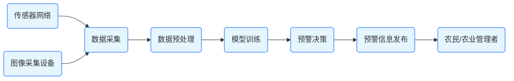

# AI在智能农业病虫害早期预警中的应用与挑战

> 关键词：AI、智能农业、病虫害早期预警、应用、挑战

> 摘要：本文聚焦于AI在智能农业病虫害早期预警中的应用与挑战。首先介绍了相关背景，包括目的范围、预期读者等。接着阐述了核心概念与联系，展示了其原理和架构。详细讲解了核心算法原理及具体操作步骤，并给出Python代码示例。同时给出了数学模型和公式并举例说明。通过项目实战呈现代码实际案例及解读。分析了实际应用场景，推荐了相关工具和资源。最后总结未来发展趋势与挑战，提供常见问题解答和扩展阅读参考资料，旨在为推动AI在智能农业病虫害早期预警领域的发展提供全面的技术和理论支持。

## 1. 背景介绍 
### 1.1 目的和范围
农业作为国家的基础产业，病虫害的侵袭一直是影响农作物产量和质量的重要因素。传统的病虫害监测和预警方式依赖人工经验和定期实地巡查，不仅效率低下，而且难以做到及时准确的预警。随着人工智能（AI）技术的快速发展，将其应用于智能农业病虫害早期预警成为解决这一问题的有效途径。本文的目的在于深入探讨AI在智能农业病虫害早期预警中的具体应用方式、核心技术原理，以及面临的挑战和未来发展方向。范围涵盖了从AI技术在病虫害图像识别、数据分析、模型构建等方面的应用，到实际项目中的代码实现和案例分析，同时涉及相关工具和资源的推荐。

### 1.2 预期读者
本文预期读者包括农业科技领域的科研人员、农业信息化从业者、智能农业系统开发人员、对AI在农业应用感兴趣的技术爱好者，以及相关专业的高校师生。对于科研人员，本文可提供前沿的研究思路和技术方法；对于从业者和开发人员，可作为实际项目开发的参考；对于技术爱好者和高校师生，有助于了解AI在农业领域的应用现状和发展趋势。

### 1.3 文档结构概述
本文首先介绍相关背景知识，让读者了解文章的目的、受众和整体结构。接着阐述核心概念与联系，包括AI在病虫害早期预警中的关键概念、原理和架构，并通过示意图和流程图进行直观展示。然后详细讲解核心算法原理及具体操作步骤，结合Python代码进行说明。随后给出数学模型和公式，并举例说明其在实际中的应用。通过项目实战部分，呈现代码实际案例并进行详细解释。分析实际应用场景，推荐相关的学习资源、开发工具框架和论文著作。最后总结未来发展趋势与挑战，提供常见问题解答和扩展阅读参考资料。

### 1.4 术语表
#### 1.4.1 核心术语定义
- **人工智能（AI）**：研究、开发用于模拟、延伸和扩展人的智能的理论、方法、技术及应用系统的一门新的技术科学。在本文中主要指利用机器学习、深度学习等技术对农业病虫害相关数据进行分析和处理。
- **智能农业**：将物联网、大数据、人工智能等现代信息技术与农业生产、经营、管理和服务全面融合的新型农业发展模式。
- **病虫害早期预警**：在病虫害大规模爆发之前，通过对各种相关数据的监测和分析，提前预测病虫害的发生时间、地点和危害程度，并发出预警信息。
- **机器学习**：一门多领域交叉学科，涉及概率论、统计学、逼近论、凸分析、算法复杂度理论等多门学科。它专门研究计算机怎样模拟或实现人类的学习行为，以获取新的知识或技能，重新组织已有的知识结构使之不断改善自身的性能。
- **深度学习**：机器学习的一个分支领域，它是一种基于对数据进行表征学习的方法。深度学习通过构建具有很多层的神经网络模型，自动从大量数据中学习到复杂的模式和特征。

#### 1.4.2 相关概念解释
- **图像识别**：利用计算机对图像进行处理、分析和理解，以识别各种不同模式的目标和对象的技术。在农业病虫害预警中，用于识别病虫害的种类和危害程度。
- **数据挖掘**：从大量的数据中通过算法搜索隐藏于其中信息的过程。在病虫害预警中，可用于发现病虫害发生的规律和影响因素。
- **传感器网络**：由大量的静止或移动的传感器以自组织和多跳的方式构成的无线网络，其目的是协作地感知、采集和处理网络覆盖区域中被感知对象的信息，并发送给观察者。在农业中，可用于实时监测土壤湿度、温度、光照等环境参数。

#### 1.4.3 缩略词列表
- **AI**：Artificial Intelligence（人工智能）
- **ML**：Machine Learning（机器学习）
- **DL**：Deep Learning（深度学习）
- **CNN**：Convolutional Neural Network（卷积神经网络）
- **RNN**：Recurrent Neural Network（循环神经网络）

## 2. 核心概念与联系 

### 核心概念原理
AI在智能农业病虫害早期预警中的核心原理是利用机器学习和深度学习算法对农业生产过程中的各种数据进行分析和处理，从而实现对病虫害的早期识别和预警。主要涉及以下几个方面：

#### 数据采集
通过各种传感器（如气象传感器、土壤传感器、图像传感器等）和监测设备，实时采集农作物生长环境的相关数据，包括温度、湿度、光照强度、土壤肥力、病虫害图像等。这些数据是进行病虫害预警的基础。

#### 数据预处理
采集到的数据可能存在噪声、缺失值等问题，需要进行预处理。常见的预处理操作包括数据清洗、归一化、特征提取等。数据清洗用于去除噪声和错误数据；归一化将数据转换到相同的尺度，便于后续的分析和处理；特征提取则从原始数据中提取出对病虫害预警有重要意义的特征。

#### 模型训练
利用预处理后的数据对机器学习或深度学习模型进行训练。常见的模型包括卷积神经网络（CNN）用于图像识别，循环神经网络（RNN）用于处理时间序列数据等。在训练过程中，模型通过不断调整参数，学习数据中的模式和规律，以提高对病虫害的识别和预测能力。

#### 预警决策
训练好的模型对新采集的数据进行分析和预测，根据预测结果判断是否存在病虫害风险。如果存在风险，则根据预设的规则发出相应的预警信息，如短信、邮件、APP推送等。

### 架构示意图


该流程图展示了AI在智能农业病虫害早期预警中的整体架构。数据采集环节从传感器网络和图像采集设备获取数据，经过预处理后用于模型训练。训练好的模型进行预警决策，将结果通过预警信息发布系统传达给农民或农业管理者。

## 3. 核心算法原理 & 具体操作步骤 

### 卷积神经网络（CNN）在病虫害图像识别中的应用

#### 算法原理
卷积神经网络（CNN）是一种专门用于处理具有网格结构数据（如图像）的深度学习模型。它通过卷积层、池化层和全连接层的组合，自动从图像中提取特征，并进行分类。

- **卷积层**：通过卷积核在图像上滑动，进行卷积操作，提取图像的局部特征。卷积核可以看作是一个小的滤波器，不同的卷积核可以提取不同类型的特征，如边缘、纹理等。
- **池化层**：对卷积层的输出进行下采样，减少数据的维度，同时保留重要的特征信息。常见的池化操作有最大池化和平均池化。
- **全连接层**：将池化层的输出展平为一维向量，然后通过全连接的方式将特征向量映射到不同的类别上，进行分类预测。

#### 具体操作步骤及Python代码实现

```python
import tensorflow as tf
from tensorflow.keras import layers, models

# 1. 数据准备
# 假设我们已经有了包含病虫害图像的数据集，分为训练集和测试集
# 这里使用ImageDataGenerator进行数据增强和预处理
train_datagen = tf.keras.preprocessing.image.ImageDataGenerator(
    rescale=1./255,
    shear_range=0.2,
    zoom_range=0.2,
    horizontal_flip=True
)

test_datagen = tf.keras.preprocessing.image.ImageDataGenerator(rescale=1./255)

train_generator = train_datagen.flow_from_directory(
    'train_data_directory',
    target_size=(150, 150),
    batch_size=32,
    class_mode='categorical'
)

test_generator = test_datagen.flow_from_directory(
    'test_data_directory',
    target_size=(150, 150),
    batch_size=32,
    class_mode='categorical'
)

# 2. 构建CNN模型
model = models.Sequential()
model.add(layers.Conv2D(32, (3, 3), activation='relu', input_shape=(150, 150, 3)))
model.add(layers.MaxPooling2D((2, 2)))
model.add(layers.Conv2D(64, (3, 3), activation='relu'))
model.add(layers.MaxPooling2D((2, 2)))
model.add(layers.Conv2D(128, (3, 3), activation='relu'))
model.add(layers.MaxPooling2D((2, 2)))
model.add(layers.Flatten())
model.add(layers.Dense(128, activation='relu'))
model.add(layers.Dense(train_generator.num_classes, activation='softmax'))

# 3. 编译模型
model.compile(optimizer='adam',
              loss='categorical_crossentropy',
              metrics=['accuracy'])

# 4. 训练模型
history = model.fit(
    train_generator,
    steps_per_epoch=train_generator.samples // train_generator.batch_size,
    epochs=10,
    validation_data=test_generator,
    validation_steps=test_generator.samples // test_generator.batch_size
)

# 5. 评估模型
test_loss, test_acc = model.evaluate(test_generator)
print(f'Test accuracy: {test_acc}')
```

### 循环神经网络（RNN）在时间序列数据预测中的应用

#### 算法原理
循环神经网络（RNN）是一种专门用于处理序列数据的神经网络模型。它通过在网络中引入循环结构，使得模型能够利用序列中的历史信息进行预测。在病虫害预警中，RNN可以用于处理气象数据、病虫害发生时间序列等数据，预测病虫害的发生趋势。

#### 具体操作步骤及Python代码实现

```python
import numpy as np
import pandas as pd
from tensorflow.keras.models import Sequential
from tensorflow.keras.layers import SimpleRNN, Dense

# 1. 数据准备
# 假设我们有一个包含时间序列数据的CSV文件
data = pd.read_csv('time_series_data.csv')
# 提取特征和目标变量
X = data.iloc[:, :-1].values
y = data.iloc[:, -1].values

# 数据划分
train_size = int(len(X) * 0.8)
X_train, X_test = X[:train_size], X[train_size:]
y_train, y_test = y[:train_size], y[train_size:]

# 数据重塑为RNN输入格式 [样本数, 时间步长, 特征数]
X_train = np.reshape(X_train, (X_train.shape[0], 1, X_train.shape[1]))
X_test = np.reshape(X_test, (X_test.shape[0], 1, X_test.shape[1]))

# 2. 构建RNN模型
model = Sequential()
model.add(SimpleRNN(units=50, input_shape=(1, X_train.shape[2])))
model.add(Dense(1))

# 3. 编译模型
model.compile(optimizer='adam', loss='mse')

# 4. 训练模型
model.fit(X_train, y_train, epochs=50, batch_size=32)

# 5. 预测
y_pred = model.predict(X_test)

# 评估模型
from sklearn.metrics import mean_squared_error
mse = mean_squared_error(y_test, y_pred)
print(f'Mean Squared Error: {mse}')
```

## 4. 数学模型和公式 & 详细讲解 & 举例说明 

### 卷积操作的数学公式
卷积操作是CNN的核心操作之一，其数学公式如下：

设输入图像为 $X$，卷积核为 $W$，输出特征图为 $Y$，则卷积操作可以表示为：

$$Y_{i,j} = \sum_{m=0}^{M-1} \sum_{n=0}^{N-1} X_{i+m,j+n} \cdot W_{m,n} + b$$

其中，$M$ 和 $N$ 分别是卷积核的高度和宽度，$b$ 是偏置项。

**详细讲解**：卷积操作实际上是将卷积核在输入图像上滑动，每次滑动到一个位置时，将卷积核与对应的图像区域进行逐元素相乘，然后将结果相加，再加上偏置项，得到输出特征图上的一个值。通过不断滑动卷积核，可以得到整个输出特征图。

**举例说明**：假设输入图像 $X$ 是一个 $3 \times 3$ 的矩阵：

$$X = \begin{bmatrix}
1 & 2 & 3 \\
4 & 5 & 6 \\
7 & 8 & 9
\end{bmatrix}$$

卷积核 $W$ 是一个 $2 \times 2$ 的矩阵：

$$W = \begin{bmatrix}
1 & 0 \\
0 & 1
\end{bmatrix}$$

偏置项 $b = 1$。

首先，将卷积核放在输入图像的左上角，进行逐元素相乘并求和：

$$Y_{0,0} = X_{0,0} \cdot W_{0,0} + X_{0,1} \cdot W_{0,1} + X_{1,0} \cdot W_{1,0} + X_{1,1} \cdot W_{1,1} + b$$
$$= 1 \cdot 1 + 2 \cdot 0 + 4 \cdot 0 + 5 \cdot 1 + 1 = 7$$

然后，将卷积核向右滑动一个位置，继续计算：

$$Y_{0,1} = X_{0,1} \cdot W_{0,0} + X_{0,2} \cdot W_{0,1} + X_{1,1} \cdot W_{1,0} + X_{1,2} \cdot W_{1,1} + b$$
$$= 2 \cdot 1 + 3 \cdot 0 + 5 \cdot 0 + 6 \cdot 1 + 1 = 9$$

以此类推，最终得到输出特征图 $Y$。

### 循环神经网络的数学公式
简单循环神经网络（Simple RNN）的数学公式如下：

$$h_t = \tanh(W_{hh} h_{t-1} + W_{xh} x_t + b_h)$$
$$y_t = W_{hy} h_t + b_y$$

其中，$x_t$ 是时间步 $t$ 的输入向量，$h_t$ 是时间步 $t$ 的隐藏状态向量，$y_t$ 是时间步 $t$ 的输出向量，$W_{hh}$ 是隐藏状态到隐藏状态的权重矩阵，$W_{xh}$ 是输入到隐藏状态的权重矩阵，$W_{hy}$ 是隐藏状态到输出的权重矩阵，$b_h$ 和 $b_y$ 分别是隐藏状态和输出的偏置向量。

**详细讲解**：在每个时间步 $t$，RNN根据当前输入 $x_t$ 和上一个时间步的隐藏状态 $h_{t-1}$ 计算当前隐藏状态 $h_t$。使用双曲正切函数 $\tanh$ 作为激活函数，将输入和隐藏状态的线性组合映射到 $[-1, 1]$ 的范围内。然后，根据当前隐藏状态 $h_t$ 计算输出 $y_t$。

**举例说明**：假设输入向量 $x_t$ 是一个长度为 2 的向量，隐藏状态向量 $h_t$ 是一个长度为 3 的向量，权重矩阵和偏置向量的维度如下：

$$W_{xh} = \begin{bmatrix}
0.1 & 0.2 \\
0.3 & 0.4 \\
0.5 & 0.6
\end{bmatrix}$$

$$W_{hh} = \begin{bmatrix}
0.7 & 0.8 & 0.9 \\
1.0 & 1.1 & 1.2 \\
1.3 & 1.4 & 1.5
\end{bmatrix}$$

$$b_h = \begin{bmatrix}
0.1 \\
0.2 \\
0.3
\end{bmatrix}$$

$$W_{hy} = \begin{bmatrix}
0.1 & 0.2 & 0.3
\end{bmatrix}$$

$$b_y = [0.1]$$

在时间步 $t = 0$ 时，假设初始隐藏状态 $h_{-1} = [0, 0, 0]$，输入向量 $x_0 = [1, 2]$。

首先，计算 $W_{hh} h_{-1} + W_{xh} x_0 + b_h$：

$$W_{hh} h_{-1} = \begin{bmatrix}
0.7 & 0.8 & 0.9 \\
1.0 & 1.1 & 1.2 \\
1.3 & 1.4 & 1.5
\end{bmatrix} \begin{bmatrix}
0 \\
0 \\
0
\end{bmatrix} = \begin{bmatrix}
0 \\
0 \\
0
\end{bmatrix}$$

$$W_{xh} x_0 = \begin{bmatrix}
0.1 & 0.2 \\
0.3 & 0.4 \\
0.5 & 0.6
\end{bmatrix} \begin{bmatrix}
1 \\
2
\end{bmatrix} = \begin{bmatrix}
0.1 \cdot 1 + 0.2 \cdot 2 \\
0.3 \cdot 1 + 0.4 \cdot 2 \\
0.5 \cdot 1 + 0.6 \cdot 2
\end{bmatrix} = \begin{bmatrix}
0.5 \\
1.1 \\
1.7
\end{bmatrix}$$

$$W_{hh} h_{-1} + W_{xh} x_0 + b_h = \begin{bmatrix}
0 \\
0 \\
0
\end{bmatrix} + \begin{bmatrix}
0.5 \\
1.1 \\
1.7
\end{bmatrix} + \begin{bmatrix}
0.1 \\
0.2 \\
0.3
\end{bmatrix} = \begin{bmatrix}
0.6 \\
1.3 \\
2.0
\end{bmatrix}$$

然后，计算 $h_0 = \tanh(W_{hh} h_{-1} + W_{xh} x_0 + b_h)$：

$$h_0 = \begin{bmatrix}
\tanh(0.6) \\
\tanh(1.3) \\
\tanh(2.0)
\end{bmatrix} \approx \begin{bmatrix}
0.537 \\
0.862 \\
0.964
\end{bmatrix}$$

最后，计算 $y_0 = W_{hy} h_0 + b_y$：

$$y_0 = \begin{bmatrix}
0.1 & 0.2 & 0.3
\end{bmatrix} \begin{bmatrix}
0.537 \\
0.862 \\
0.964
\end{bmatrix} + 0.1 \approx 0.58$$

## 5. 项目实战：代码实际案例和详细解释说明 

### 5.1  开发环境搭建
#### 硬件环境
- **服务器**：可以选择云服务器（如阿里云、腾讯云等），推荐配置为至少 4 核 CPU、8GB 内存、100GB 硬盘空间。
- **传感器设备**：包括气象传感器（如温度传感器、湿度传感器、光照传感器等）、土壤传感器（如土壤湿度传感器、土壤肥力传感器等）和图像采集设备（如高清摄像头）。

#### 软件环境
- **操作系统**：推荐使用 Linux 系统，如 Ubuntu 18.04 或更高版本。
- **编程语言**：Python 3.7 或更高版本。
- **深度学习框架**：TensorFlow 2.x 或 PyTorch。
- **数据处理库**：NumPy、Pandas。
- **图像处理库**：OpenCV。

#### 安装步骤
1. 安装 Python：可以从 Python 官方网站下载安装包进行安装，或者使用系统自带的包管理器进行安装。
2. 安装 TensorFlow：使用 pip 命令进行安装：
```bash
pip install tensorflow
```
3. 安装其他库：
```bash
pip install numpy pandas opencv-python
```

### 5.2  源代码详细实现和代码解读
以下是一个完整的智能农业病虫害早期预警系统的代码示例，结合了图像识别和时间序列数据预测。

```python
import tensorflow as tf
from tensorflow.keras import layers, models
import pandas as pd
import numpy as np
import cv2
import os

# 图像识别部分
# 数据准备
train_datagen = tf.keras.preprocessing.image.ImageDataGenerator(
    rescale=1./255,
    shear_range=0.2,
    zoom_range=0.2,
    horizontal_flip=True
)

test_datagen = tf.keras.preprocessing.image.ImageDataGenerator(rescale=1./255)

train_generator = train_datagen.flow_from_directory(
    'train_data_directory',
    target_size=(150, 150),
    batch_size=32,
    class_mode='categorical'
)

test_generator = test_datagen.flow_from_directory(
    'test_data_directory',
    target_size=(150, 150),
    batch_size=32,
    class_mode='categorical'
)

# 构建CNN模型
image_model = models.Sequential()
image_model.add(layers.Conv2D(32, (3, 3), activation='relu', input_shape=(150, 150, 3)))
image_model.add(layers.MaxPooling2D((2, 2)))
image_model.add(layers.Conv2D(64, (3, 3), activation='relu'))
image_model.add(layers.MaxPooling2D((2, 2)))
image_model.add(layers.Conv2D(128, (3, 3), activation='relu'))
image_model.add(layers.MaxPooling2D((2, 2)))
image_model.add(layers.Flatten())
image_model.add(layers.Dense(128, activation='relu'))
image_model.add(layers.Dense(train_generator.num_classes, activation='softmax'))

# 编译模型
image_model.compile(optimizer='adam',
                    loss='categorical_crossentropy',
                    metrics=['accuracy'])

# 训练模型
image_history = image_model.fit(
    train_generator,
    steps_per_epoch=train_generator.samples // train_generator.batch_size,
    epochs=10,
    validation_data=test_generator,
    validation_steps=test_generator.samples // test_generator.batch_size
)

# 时间序列数据预测部分
# 数据准备
data = pd.read_csv('time_series_data.csv')
X = data.iloc[:, :-1].values
y = data.iloc[:, -1].values

train_size = int(len(X) * 0.8)
X_train, X_test = X[:train_size], X[train_size:]
y_train, y_test = y[:train_size], y[train_size:]

X_train = np.reshape(X_train, (X_train.shape[0], 1, X_train.shape[1]))
X_test = np.reshape(X_test, (X_test.shape[0], 1, X_test.shape[1]))

# 构建RNN模型
time_series_model = models.Sequential()
time_series_model.add(layers.SimpleRNN(units=50, input_shape=(1, X_train.shape[2])))
time_series_model.add(layers.Dense(1))

# 编译模型
time_series_model.compile(optimizer='adam', loss='mse')

# 训练模型
time_series_history = time_series_model.fit(X_train, y_train, epochs=50, batch_size=32)

# 综合预警部分
def early_warning(image_path, time_series_data):
    # 图像识别
    img = cv2.imread(image_path)
    img = cv2.resize(img, (150, 150))
    img = img / 255.0
    img = np.expand_dims(img, axis=0)
    image_pred = image_model.predict(img)
    image_class = np.argmax(image_pred)

    # 时间序列数据预测
    time_series_data = np.reshape(time_series_data, (1, 1, len(time_series_data)))
    time_series_pred = time_series_model.predict(time_series_data)

    # 综合判断
    if image_class > 0 or time_series_pred[0][0] > 0.5:
        return "存在病虫害风险"
    else:
        return "暂无病虫害风险"

# 测试
image_path = 'test_image.jpg'
time_series_data = [1, 2, 3, 4, 5]
result = early_warning(image_path, time_series_data)
print(result)
```

### 5.3  代码解读与分析
#### 图像识别部分
- **数据准备**：使用 `ImageDataGenerator` 对图像数据进行增强和预处理，将图像缩放到 $150 \times 150$ 的大小，并将像素值归一化到 $[0, 1]$ 的范围内。
- **模型构建**：构建一个简单的 CNN 模型，包含卷积层、池化层和全连接层。
- **模型训练**：使用训练集对模型进行训练，设置训练轮数为 10 轮。

#### 时间序列数据预测部分
- **数据准备**：从 CSV 文件中读取时间序列数据，将其划分为训练集和测试集，并将数据重塑为 RNN 输入格式。
- **模型构建**：构建一个简单的 RNN 模型，包含一个简单的 RNN 层和一个全连接层。
- **模型训练**：使用训练集对模型进行训练，设置训练轮数为 50 轮。

#### 综合预警部分
- **图像识别**：读取测试图像，进行预处理后使用训练好的 CNN 模型进行预测，得到图像的分类结果。
- **时间序列数据预测**：将时间序列数据重塑为 RNN 输入格式，使用训练好的 RNN 模型进行预测。
- **综合判断**：根据图像识别和时间序列数据预测的结果进行综合判断，如果图像分类结果大于 0 或者时间序列预测结果大于 0.5，则认为存在病虫害风险。

## 6. 实际应用场景 
### 大规模农场
在大规模农场中，AI 技术可以实现对大面积农田的实时监测和病虫害早期预警。通过安装大量的传感器和图像采集设备，收集农田的气象数据、土壤数据和农作物图像。利用 AI 模型对这些数据进行分析和处理，及时发现病虫害的迹象，并发出预警信息。农场管理者可以根据预警信息采取相应的防治措施，如喷洒农药、调整灌溉等，从而减少病虫害对农作物的危害，提高农作物产量和质量。

### 温室种植
温室种植环境相对封闭，病虫害的传播速度较快。AI 技术可以对温室内部的环境参数进行实时监测，如温度、湿度、光照等，同时对农作物的生长状况进行图像识别。通过分析这些数据，预测病虫害的发生可能性，并提前采取预防措施。例如，当监测到温室内的湿度较高时，AI 系统可以预测可能会发生真菌病害，及时提醒种植者降低湿度或采取其他防治措施。

### 果园管理
果园中果树的生长周期较长，病虫害的种类繁多。AI 技术可以通过图像识别技术识别果树上的病虫害症状，如叶片上的斑点、果实上的虫洞等。同时，结合气象数据和历史病虫害发生记录，预测病虫害的发生趋势。果园管理者可以根据预警信息制定合理的防治计划，减少农药的使用量，提高水果的品质和安全性。

### 精准农业服务
一些农业科技公司可以利用 AI 技术为农民提供精准农业服务。通过收集农民农田的相关数据，利用 AI 模型进行分析和预测，为农民提供个性化的病虫害预警和防治建议。农民可以通过手机 APP 或网页查看预警信息和建议，根据实际情况采取相应的措施。这种服务模式可以提高农民的生产效率和经济效益，促进农业的可持续发展。

## 7. 工具和资源推荐
### 7.1 学习资源推荐
#### 7.1.1 书籍推荐
- 《深度学习》（Deep Learning）：由 Ian Goodfellow、Yoshua Bengio 和 Aaron Courville 所著，是深度学习领域的经典教材，涵盖了深度学习的基本概念、算法和应用。
- 《Python 机器学习》（Python Machine Learning）：由 Sebastian Raschka 所著，介绍了使用 Python 进行机器学习的基本方法和技巧，包括数据预处理、模型选择、评估等内容。
- 《计算机视觉：算法与应用》（Computer Vision: Algorithms and Applications）：由 Richard Szeliski 所著，全面介绍了计算机视觉的基本算法和应用，包括图像识别、目标检测、图像分割等内容。

#### 7.1.2 在线课程
- Coursera 上的《深度学习专项课程》（Deep Learning Specialization）：由 Andrew Ng 教授授课，包括深度学习基础、卷积神经网络、循环神经网络等多个课程，是学习深度学习的优质课程。
- edX 上的《人工智能基础》（Introduction to Artificial Intelligence）：由麻省理工学院（MIT）的教授授课，介绍了人工智能的基本概念、算法和应用。
- Kaggle 上的《计算机视觉微课程》（Computer Vision Micro-Course）：提供了实践项目和代码示例，帮助学习者快速掌握计算机视觉的基本技能。

#### 7.1.3 技术博客和网站
- Medium：一个技术博客平台，上面有很多关于 AI、机器学习和计算机视觉的优质文章。
- Towards Data Science：专注于数据科学和机器学习领域的博客，提供了很多实用的技术文章和案例分析。
- arXiv：一个预印本服务器，提供了最新的学术研究论文，包括 AI 在农业领域的应用研究。

### 7.2 开发工具框架推荐
#### 7.2.1 IDE和编辑器
- PyCharm：一款专门为 Python 开发设计的集成开发环境（IDE），提供了丰富的代码编辑、调试和版本控制功能。
- Jupyter Notebook：一个交互式的笔记本环境，适合进行数据探索、模型实验和代码演示。
- Visual Studio Code：一款轻量级的代码编辑器，支持多种编程语言和插件扩展，适合快速开发和调试。

#### 7.2.2 调试和性能分析工具
- TensorBoard：TensorFlow 提供的可视化工具，可以用于监控模型训练过程、查看模型结构和分析性能指标。
- PyTorch Profiler：PyTorch 提供的性能分析工具，可以帮助开发者找出代码中的性能瓶颈。
- cProfile：Python 内置的性能分析工具，可以统计代码中各个函数的执行时间和调用次数。

#### 7.2.3 相关框架和库
- TensorFlow：一个开源的深度学习框架，提供了丰富的深度学习模型和工具，支持 CPU、GPU 和 TPU 等多种计算设备。
- PyTorch：另一个开源的深度学习框架，具有动态图和易于使用的特点，在学术界和工业界都有广泛的应用。
- Scikit-learn：一个用于机器学习的 Python 库，提供了丰富的机器学习算法和工具，包括分类、回归、聚类等。
- OpenCV：一个开源的计算机视觉库，提供了丰富的图像处理和计算机视觉算法，包括图像滤波、特征提取、目标检测等。

### 7.3 相关论文著作推荐
#### 7.3.1 经典论文
- "ImageNet Classification with Deep Convolutional Neural Networks"：Alex Krizhevsky、Ilya Sutskever 和 Geoffrey E. Hinton 在 2012 年发表的论文，介绍了 AlexNet 卷积神经网络模型，开启了深度学习在图像识别领域的热潮。
- "Long Short-Term Memory"：Sepp Hochreiter 和 Jürgen Schmidhuber 在 1997 年发表的论文，提出了长短期记忆网络（LSTM），解决了传统循环神经网络的梯度消失问题。
- "Gradient-Based Learning Applied to Document Recognition"：Yann LeCun、Léon Bottou、Yoshua Bengio 和 Patrick Haffner 在 1998 年发表的论文，介绍了 LeNet-5 卷积神经网络模型，是早期卷积神经网络的经典之作。

#### 7.3.2 最新研究成果
- 近年来，有很多关于 AI 在农业病虫害预警领域的研究成果发表在国际知名学术期刊上，如《Biosystems Engineering》、《Computers and Electronics in Agriculture》等。这些研究成果涉及到新的算法、模型和应用案例，可以通过 arXiv、IEEE Xplore 等学术数据库进行搜索。

#### 7.3.3 应用案例分析
- 一些农业科技公司和科研机构会发布 AI 在农业病虫害预警领域的应用案例分析报告，这些报告可以帮助读者了解实际项目中的技术应用和解决方案。可以通过公司官网、行业论坛等渠道获取相关报告。

## 8. 总结：未来发展趋势与挑战
### 未来发展趋势
#### 多模态数据融合
未来，AI 在智能农业病虫害早期预警中将更加注重多模态数据的融合。除了现有的图像数据和时间序列数据，还将融合声音、气味等数据，提高预警的准确性和可靠性。例如，通过监测农作物发出的声音变化来判断是否受到病虫害的侵袭，或者通过检测农作物散发的气味来识别病虫害的种类。

#### 边缘计算与云计算结合
随着物联网技术的发展，大量的传感器和设备将产生海量的数据。为了减少数据传输延迟和降低云服务器的计算压力，未来将采用边缘计算与云计算结合的方式。边缘设备可以在本地对数据进行初步处理和分析，只将关键信息上传到云端进行进一步的处理和决策。这样可以提高系统的实时性和响应速度。

#### 智能化决策支持系统
未来的智能农业病虫害早期预警系统将不仅仅是发出预警信息，还将提供智能化的决策支持。系统可以根据病虫害的类型、严重程度和农作物的生长阶段，自动生成防治方案和建议。例如，推荐合适的农药种类、施药时间和剂量，或者提供生物防治的方法和措施。

#### 与区块链技术结合
区块链技术具有去中心化、不可篡改和可追溯的特点，可以用于保证农业数据的真实性和安全性。未来，AI 在智能农业病虫害早期预警中可以与区块链技术结合，建立数据共享和信任机制。例如，农民、农业企业和科研机构可以通过区块链平台共享病虫害数据，同时保证数据的隐私和安全。

### 挑战
#### 数据质量和标注问题
AI 模型的训练需要大量高质量的数据，但是在农业领域，数据的收集和标注存在一定的困难。一方面，农业环境复杂多变，数据的采集容易受到天气、光照等因素的影响，导致数据质量不稳定。另一方面，病虫害的识别和标注需要专业的知识和经验，人工标注的成本较高且容易出现误差。因此，如何提高数据的质量和标注的准确性是一个亟待解决的问题。

#### 模型泛化能力
不同地区的农业环境和病虫害种类存在差异，现有的 AI 模型在不同地区的应用效果可能会受到影响。如何提高模型的泛化能力，使其能够适应不同的农业环境和病虫害特征，是一个挑战。可以通过收集更多不同地区的数据进行训练，或者采用迁移学习等方法来解决这个问题。

#### 技术成本和普及难度
AI 技术的应用需要一定的硬件设备和软件平台支持，对于一些小规模的农场和农民来说，技术成本较高。此外，农民的科技素养和接受能力有限，推广和普及 AI 技术在农业领域的应用存在一定的难度。因此，如何降低技术成本，提高农民的科技素养，是推动 AI 在智能农业病虫害早期预警中广泛应用的关键。

#### 法律法规和伦理问题
随着 AI 技术在农业领域的应用越来越广泛，也会带来一些法律法规和伦理问题。例如，AI 模型的决策结果可能会影响农民的生产决策和经济效益，如果出现错误的预警信息，可能会给农民带来损失。此外，农业数据的隐私和安全问题也需要得到重视。因此，需要建立相应的法律法规和伦理准则，规范 AI 技术在农业领域的应用。

## 9. 附录：常见问题与解答
### 问题 1：AI 在智能农业病虫害早期预警中的准确率如何？
答：AI 在智能农业病虫害早期预警中的准确率受到多种因素的影响，如数据质量、模型选择和训练方法等。一般来说，在合适的数据和模型下，图像识别的准确率可以达到 80% 以上，时间序列数据预测的误差可以控制在一定范围内。但是，在实际应用中，由于农业环境的复杂性和多变性，准确率可能会有所波动。

### 问题 2：如何选择适合的 AI 模型进行病虫害预警？
答：选择适合的 AI 模型需要考虑数据类型和问题的特点。如果是图像识别问题，可以选择卷积神经网络（CNN），如 AlexNet、ResNet 等；如果是时间序列数据预测问题，可以选择循环神经网络（RNN），如 LSTM、GRU 等。此外，还可以根据实际情况进行模型的组合和优化，以提高预警的准确性。

### 问题 3：AI 技术在农业领域的应用是否会取代农民的工作？
答：AI 技术在农业领域的应用不会取代农民的工作，而是会辅助农民提高生产效率和决策的科学性。AI 技术可以帮助农民及时发现病虫害的迹象，提供防治建议，但最终的决策和操作还是需要农民来完成。同时，AI 技术的应用也会创造一些新的就业机会，如数据采集、模型维护和技术支持等。

### 问题 4：如何保证农业数据的安全和隐私？
答：为了保证农业数据的安全和隐私，可以采取以下措施：一是采用加密技术对数据进行加密处理，防止数据在传输和存储过程中被窃取和篡改；二是建立严格的访问控制机制，只有授权人员才能访问和使用数据；三是与可靠的技术供应商合作，确保其具备完善的安全保障措施。

### 问题 5：AI 在智能农业病虫害早期预警中的应用需要哪些专业知识？
答：AI 在智能农业病虫害早期预警中的应用需要涉及多个领域的专业知识，包括农业科学、计算机科学、数学和统计学等。具体来说，需要了解农作物的生长特性和病虫害的发生规律，掌握机器学习和深度学习的基本算法和模型，具备数据处理和分析的能力。

## 10. 扩展阅读 & 参考资料
### 扩展阅读
- 《农业物联网技术与应用》：介绍了农业物联网的基本概念、技术原理和应用案例，与 AI 在智能农业中的应用密切相关。
- 《大数据在农业中的应用》：探讨了大数据技术在农业生产、管理和决策中的应用，为 AI 在农业领域的发展提供了数据支持和分析方法。
- 《人工智能与农业现代化》：分析了人工智能技术对农业现代化的推动作用，以及未来的发展趋势和挑战。

### 参考资料
- 相关学术论文：可以通过学术数据库（如 IEEE Xplore、ACM Digital Library、ScienceDirect 等）搜索关于 AI 在智能农业病虫害早期预警中的研究论文。
- 行业报告：一些市场研究机构和行业协会会发布关于农业科技和 AI 应用的行业报告，可以了解市场动态和发展趋势。
- 开源项目：GitHub 上有很多与 AI 在农业领域应用相关的开源项目，可以参考和学习其中的代码和实现方法。

作者：AI天才研究院/AI Genius Institute & 禅与计算机程序设计艺术 /Zen And The Art of Computer Programming