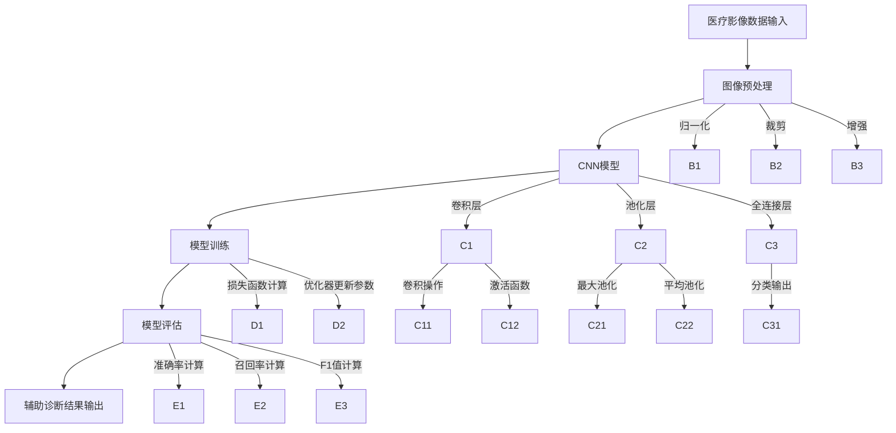

# AI在智能医疗影像辅助诊断中的应用与创新

> 关键词：AI、智能医疗影像、辅助诊断、应用、创新

> 摘要：本文深入探讨了AI在智能医疗影像辅助诊断中的应用与创新。首先介绍了相关背景，包括目的范围、预期读者等内容。接着阐述了核心概念及联系，通过文本示意图和Mermaid流程图展示其架构。详细讲解了核心算法原理和具体操作步骤，并结合Python源代码进行说明。分析了数学模型和公式，给出了实际例子。通过项目实战，展示了代码实现和解读。探讨了AI在智能医疗影像辅助诊断中的实际应用场景，推荐了相关的工具和资源，包括学习资源、开发工具框架、相关论文著作等。最后总结了未来发展趋势与挑战，提供了常见问题解答和扩展阅读参考资料，旨在为该领域的研究和实践提供全面的参考。

## 1. 背景介绍 
### 1.1 目的和范围
本文章的主要目的是全面深入地探讨AI在智能医疗影像辅助诊断中的应用与创新。具体而言，我们将详细分析AI技术如何与医疗影像诊断相结合，提高诊断的准确性、效率和便捷性。范围涵盖了从AI核心算法原理到实际项目应用的各个方面，包括不同类型医疗影像（如X光、CT、MRI等）的诊断应用，以及相关的数学模型、开发工具和未来发展趋势等内容。

### 1.2 预期读者
本文预期读者包括医疗行业的专业人士，如放射科医生、影像科专家等，他们可以通过本文了解AI技术在辅助诊断中的应用，为临床实践提供参考。同时，计算机科学领域的研究人员和开发者也能从文中获取AI在医疗影像领域的算法原理和开发实践经验。此外，对智能医疗感兴趣的投资者、政策制定者以及相关专业的学生也可以通过本文了解该领域的发展动态和趋势。

### 1.3 文档结构概述
本文将按照以下结构进行组织：首先介绍背景信息，包括目的、预期读者和文档结构概述等。接着阐述核心概念与联系，通过文本示意图和Mermaid流程图展示AI在智能医疗影像辅助诊断中的架构。然后详细讲解核心算法原理和具体操作步骤，结合Python源代码进行说明。分析数学模型和公式，并给出实际例子。通过项目实战，展示代码实现和解读。探讨实际应用场景，推荐相关的工具和资源。最后总结未来发展趋势与挑战，提供常见问题解答和扩展阅读参考资料。

### 1.4 术语表
#### 1.4.1 核心术语定义
- **AI（Artificial Intelligence）**：人工智能，是研究、开发用于模拟、延伸和扩展人的智能的理论、方法、技术及应用系统的一门新的技术科学。
- **医疗影像**：指通过各种医学成像技术（如X光、CT、MRI等）获取的人体内部结构的图像，用于疾病的诊断和治疗评估。
- **辅助诊断**：利用计算机技术和相关算法，为医生提供诊断建议和参考信息，帮助医生更准确、快速地做出诊断决策。
- **深度学习**：一种基于人工神经网络的机器学习方法，通过构建多层神经网络模型，自动从大量数据中学习特征和模式。
- **卷积神经网络（Convolutional Neural Network，CNN）**：一种专门用于处理具有网格结构数据（如图像）的深度学习模型，通过卷积层、池化层等操作提取图像特征。

#### 1.4.2 相关概念解释
- **图像预处理**：在将医疗影像输入到AI模型之前，对图像进行的一系列处理操作，如归一化、裁剪、增强等，以提高图像质量和模型的训练效果。
- **模型训练**：使用大量的标注数据对AI模型进行训练，调整模型的参数，使其能够准确地识别和分类医疗影像中的病变信息。
- **模型评估**：使用测试数据对训练好的模型进行评估，计算模型的准确率、召回率、F1值等指标，评估模型的性能。
- **迁移学习**：利用预训练的模型在新的数据集上进行微调，减少模型训练的时间和数据量，提高模型的泛化能力。

#### 1.4.3 缩略词列表
- **AI**：Artificial Intelligence（人工智能）
- **CNN**：Convolutional Neural Network（卷积神经网络）
- **CT**：Computed Tomography（计算机断层扫描）
- **MRI**：Magnetic Resonance Imaging（磁共振成像）

## 2. 核心概念与联系 
### 核心概念原理
在智能医疗影像辅助诊断中，AI的核心原理是利用深度学习算法，特别是卷积神经网络（CNN），对医疗影像进行分析和处理。CNN通过卷积层、池化层和全连接层等结构，自动从医疗影像中提取特征，并进行分类和识别。

具体来说，卷积层通过卷积核在图像上滑动，提取图像的局部特征，如边缘、纹理等。池化层则对卷积层的输出进行下采样，减少数据量，提高计算效率。全连接层将池化层的输出进行整合，输出最终的分类结果。

### 架构的文本示意图
```plaintext
医疗影像数据输入
|
|-- 图像预处理
|   |-- 归一化
|   |-- 裁剪
|   |-- 增强
|
|-- CNN模型
|   |-- 卷积层
|   |   |-- 卷积操作
|   |   |-- 激活函数
|   |-- 池化层
|   |   |-- 最大池化
|   |   |-- 平均池化
|   |-- 全连接层
|       |-- 分类输出
|
|-- 模型训练
|   |-- 损失函数计算
|   |-- 优化器更新参数
|
|-- 模型评估
|   |-- 准确率计算
|   |-- 召回率计算
|   |-- F1值计算
|
|-- 辅助诊断结果输出
```

### Mermaid流程图


## 3. 核心算法原理 & 具体操作步骤 
### 核心算法原理
在智能医疗影像辅助诊断中，最常用的核心算法是卷积神经网络（CNN）。CNN的核心思想是通过卷积操作自动提取图像的特征，减少了人工特征工程的工作量。

卷积操作是指将一个卷积核（也称为滤波器）在输入图像上滑动，计算卷积核与图像局部区域的内积，得到一个特征图。卷积核可以学习到不同的特征，如边缘、纹理等。

激活函数则是在卷积操作之后，对特征图进行非线性变换，增加模型的表达能力。常用的激活函数有ReLU（Rectified Linear Unit）等。

池化层用于对特征图进行下采样，减少数据量，提高计算效率。常用的池化操作有最大池化和平均池化。

全连接层将池化层的输出进行整合，输出最终的分类结果。

### 具体操作步骤
1. **数据准备**：收集大量的医疗影像数据，并进行标注，标注信息包括病变的类型、位置等。
2. **图像预处理**：对收集到的医疗影像数据进行预处理，如归一化、裁剪、增强等，以提高图像质量和模型的训练效果。
3. **模型构建**：构建CNN模型，选择合适的卷积层、池化层和全连接层的结构。
4. **模型训练**：使用标注好的训练数据对CNN模型进行训练，调整模型的参数，使其能够准确地识别和分类医疗影像中的病变信息。
5. **模型评估**：使用测试数据对训练好的模型进行评估，计算模型的准确率、召回率、F1值等指标，评估模型的性能。
6. **辅助诊断**：将待诊断的医疗影像输入到训练好的模型中，得到辅助诊断结果。

### Python源代码详细阐述
```python
import torch
import torch.nn as nn
import torch.optim as optim
from torchvision import transforms, datasets

# 数据预处理
transform = transforms.Compose([
    transforms.Resize((224, 224)),
    transforms.ToTensor(),
    transforms.Normalize(mean=[0.485, 0.456, 0.406], std=[0.229, 0.224, 0.225])
])

# 加载数据集
train_dataset = datasets.ImageFolder(root='train_data', transform=transform)
train_loader = torch.utils.data.DataLoader(train_dataset, batch_size=32, shuffle=True)

test_dataset = datasets.ImageFolder(root='test_data', transform=transform)
test_loader = torch.utils.data.DataLoader(test_dataset, batch_size=32, shuffle=False)

# 定义CNN模型
class SimpleCNN(nn.Module):
    def __init__(self):
        super(SimpleCNN, self).__init__()
        self.conv1 = nn.Conv2d(3, 16, kernel_size=3, padding=1)
        self.relu1 = nn.ReLU()
        self.pool1 = nn.MaxPool2d(2)
        self.conv2 = nn.Conv2d(16, 32, kernel_size=3, padding=1)
        self.relu2 = nn.ReLU()
        self.pool2 = nn.MaxPool2d(2)
        self.fc1 = nn.Linear(32 * 56 * 56, 128)
        self.relu3 = nn.ReLU()
        self.fc2 = nn.Linear(128, 2)

    def forward(self, x):
        x = self.pool1(self.relu1(self.conv1(x)))
        x = self.pool2(self.relu2(self.conv2(x)))
        x = x.view(-1, 32 * 56 * 56)
        x = self.relu3(self.fc1(x))
        x = self.fc2(x)
        return x

model = SimpleCNN()

# 定义损失函数和优化器
criterion = nn.CrossEntropyLoss()
optimizer = optim.Adam(model.parameters(), lr=0.001)

# 模型训练
num_epochs = 10
for epoch in range(num_epochs):
    running_loss = 0.0
    for i, (images, labels) in enumerate(train_loader):
        optimizer.zero_grad()
        outputs = model(images)
        loss = criterion(outputs, labels)
        loss.backward()
        optimizer.step()
        running_loss += loss.item()
    print(f'Epoch {epoch + 1}, Loss: {running_loss / len(train_loader)}')

# 模型评估
correct = 0
total = 0
with torch.no_grad():
    for images, labels in test_loader:
        outputs = model(images)
        _, predicted = torch.max(outputs.data, 1)
        total += labels.size(0)
        correct += (predicted == labels).sum().item()

print(f'Accuracy: {100 * correct / total}%')
```

## 4. 数学模型和公式 & 详细讲解 & 举例说明 
### 卷积操作
卷积操作是CNN的核心操作之一，其数学公式为：
$$
y_{i,j}^k = \sum_{m=0}^{M-1} \sum_{n=0}^{N-1} x_{i+m,j+n} w_{m,n}^k + b^k
$$
其中，$x$ 是输入图像，$y$ 是输出特征图，$w$ 是卷积核，$b$ 是偏置项，$M$ 和 $N$ 是卷积核的大小，$k$ 是卷积核的索引。

例如，假设输入图像 $x$ 是一个 $3\times3$ 的矩阵：
$$
x = \begin{bmatrix}
1 & 2 & 3 \\
4 & 5 & 6 \\
7 & 8 & 9
\end{bmatrix}
$$
卷积核 $w$ 是一个 $2\times2$ 的矩阵：
$$
w = \begin{bmatrix}
1 & 0 \\
0 & 1
\end{bmatrix}
$$
偏置项 $b = 0$。则卷积操作的计算过程如下：
$$
y_{0,0} = x_{0,0} w_{0,0} + x_{0,1} w_{0,1} + x_{1,0} w_{1,0} + x_{1,1} w_{1,1} + b = 1\times1 + 2\times0 + 4\times0 + 5\times1 + 0 = 6
$$
$$
y_{0,1} = x_{0,1} w_{0,0} + x_{0,2} w_{0,1} + x_{1,1} w_{1,0} + x_{1,2} w_{1,1} + b = 2\times1 + 3\times0 + 5\times0 + 6\times1 + 0 = 8
$$
$$
y_{1,0} = x_{1,0} w_{0,0} + x_{1,1} w_{0,1} + x_{2,0} w_{1,0} + x_{2,1} w_{1,1} + b = 4\times1 + 5\times0 + 7\times0 + 8\times1 + 0 = 12
$$
$$
y_{1,1} = x_{1,1} w_{0,0} + x_{1,2} w_{0,1} + x_{2,1} w_{1,0} + x_{2,2} w_{1,1} + b = 5\times1 + 6\times0 + 8\times0 + 9\times1 + 0 = 14
$$
因此，输出特征图 $y$ 为：
$$
y = \begin{bmatrix}
6 & 8 \\
12 & 14
\end{bmatrix}
$$

### 激活函数
激活函数用于对卷积操作的输出进行非线性变换，增加模型的表达能力。常用的激活函数有ReLU（Rectified Linear Unit），其数学公式为：
$$
f(x) = \max(0, x)
$$
例如，对于输入 $x = [-1, 2, -3, 4]$，经过ReLU激活函数处理后，输出为 $f(x) = [0, 2, 0, 4]$。

### 池化操作
池化操作用于对特征图进行下采样，减少数据量，提高计算效率。常用的池化操作有最大池化和平均池化。

最大池化的数学公式为：
$$
y_{i,j}^k = \max_{m=0}^{M-1} \max_{n=0}^{N-1} x_{i\times s + m,j\times s + n}^k
$$
其中，$x$ 是输入特征图，$y$ 是输出特征图，$s$ 是池化步长，$M$ 和 $N$ 是池化窗口的大小，$k$ 是特征图的索引。

平均池化的数学公式为：
$$
y_{i,j}^k = \frac{1}{M\times N} \sum_{m=0}^{M-1} \sum_{n=0}^{N-1} x_{i\times s + m,j\times s + n}^k
$$

例如，假设输入特征图 $x$ 是一个 $4\times4$ 的矩阵：
$$
x = \begin{bmatrix}
1 & 2 & 3 & 4 \\
5 & 6 & 7 & 8 \\
9 & 10 & 11 & 12 \\
13 & 14 & 15 & 16
\end{bmatrix}
$$
池化窗口大小为 $2\times2$，步长为 $2$。则最大池化的计算过程如下：
$$
y_{0,0} = \max(x_{0,0}, x_{0,1}, x_{1,0}, x_{1,1}) = \max(1, 2, 5, 6) = 6
$$
$$
y_{0,1} = \max(x_{0,2}, x_{0,3}, x_{1,2}, x_{1,3}) = \max(3, 4, 7, 8) = 8
$$
$$
y_{1,0} = \max(x_{2,0}, x_{2,1}, x_{3,0}, x_{3,1}) = \max(9, 10, 13, 14) = 14
$$
$$
y_{1,1} = \max(x_{2,2}, x_{2,3}, x_{3,2}, x_{3,3}) = \max(11, 12, 15, 16) = 16
$$
因此，最大池化的输出特征图 $y$ 为：
$$
y = \begin{bmatrix}
6 & 8 \\
14 & 16
\end{bmatrix}
$$

平均池化的计算过程如下：
$$
y_{0,0} = \frac{1 + 2 + 5 + 6}{4} = 3.5
$$
$$
y_{0,1} = \frac{3 + 4 + 7 + 8}{4} = 5.5
$$
$$
y_{1,0} = \frac{9 + 10 + 13 + 14}{4} = 11.5
$$
$$
y_{1,1} = \frac{11 + 12 + 15 + 16}{4} = 13.5
$$
因此，平均池化的输出特征图 $y$ 为：
$$
y = \begin{bmatrix}
3.5 & 5.5 \\
11.5 & 13.5
\end{bmatrix}
$$

### 损失函数
在CNN模型训练中，常用的损失函数是交叉熵损失函数，其数学公式为：
$$
L = -\sum_{i=1}^{N} y_i \log(p_i)
$$
其中，$N$ 是样本数量，$y_i$ 是真实标签，$p_i$ 是模型预测的概率。

例如，假设真实标签 $y = [1, 0]$，模型预测的概率 $p = [0.8, 0.2]$，则交叉熵损失为：
$$
L = -(1\times\log(0.8) + 0\times\log(0.2)) \approx 0.223
$$

### 优化器
优化器用于更新模型的参数，使损失函数最小化。常用的优化器有随机梯度下降（SGD）、Adam等。

随机梯度下降的更新公式为：
$$
\theta_{t+1} = \theta_t - \eta \nabla L(\theta_t)
$$
其中，$\theta$ 是模型的参数，$\eta$ 是学习率，$\nabla L(\theta_t)$ 是损失函数关于参数 $\theta_t$ 的梯度。

Adam优化器结合了动量和自适应学习率的思想，其更新公式为：
$$
m_{t+1} = \beta_1 m_t + (1 - \beta_1) \nabla L(\theta_t)
$$
$$
v_{t+1} = \beta_2 v_t + (1 - \beta_2) (\nabla L(\theta_t))^2
$$
$$
\hat{m}_{t+1} = \frac{m_{t+1}}{1 - \beta_1^{t+1}}
$$
$$
\hat{v}_{t+1} = \frac{v_{t+1}}{1 - \beta_2^{t+1}}
$$
$$
\theta_{t+1} = \theta_t - \frac{\eta}{\sqrt{\hat{v}_{t+1}} + \epsilon} \hat{m}_{t+1}
$$
其中，$m$ 和 $v$ 分别是一阶矩估计和二阶矩估计，$\beta_1$ 和 $\beta_2$ 是衰减率，$\epsilon$ 是一个小的常数。

## 5. 项目实战：代码实际案例和详细解释说明 
### 5.1  开发环境搭建
1. **安装Python**：建议安装Python 3.7及以上版本，可以从Python官方网站（https://www.python.org/downloads/）下载安装包进行安装。
2. **安装深度学习框架**：推荐使用PyTorch作为深度学习框架，可以根据自己的操作系统和CUDA版本选择合适的安装方式，具体安装步骤可以参考PyTorch官方网站（https://pytorch.org/get-started/locally/）。
3. **安装其他依赖库**：安装torchvision、numpy、matplotlib等依赖库，可以使用pip命令进行安装：
```bash
pip install torchvision numpy matplotlib
```

### 5.2  源代码详细实现和代码解读
```python
import torch
import torch.nn as nn
import torch.optim as optim
from torchvision import transforms, datasets

# 数据预处理
transform = transforms.Compose([
    transforms.Resize((224, 224)),  # 将图像调整为224x224大小
    transforms.ToTensor(),  # 将图像转换为张量
    transforms.Normalize(mean=[0.485, 0.456, 0.406], std=[0.229, 0.224, 0.225])  # 归一化处理
])

# 加载数据集
train_dataset = datasets.ImageFolder(root='train_data', transform=transform)  # 加载训练数据集
train_loader = torch.utils.data.DataLoader(train_dataset, batch_size=32, shuffle=True)  # 创建训练数据加载器

test_dataset = datasets.ImageFolder(root='test_data', transform=transform)  # 加载测试数据集
test_loader = torch.utils.data.DataLoader(test_dataset, batch_size=32, shuffle=False)  # 创建测试数据加载器

# 定义CNN模型
class SimpleCNN(nn.Module):
    def __init__(self):
        super(SimpleCNN, self).__init__()
        self.conv1 = nn.Conv2d(3, 16, kernel_size=3, padding=1)  # 第一个卷积层，输入通道数为3，输出通道数为16，卷积核大小为3x3，填充为1
        self.relu1 = nn.ReLU()  # 第一个ReLU激活函数
        self.pool1 = nn.MaxPool2d(2)  # 第一个最大池化层，池化窗口大小为2x2
        self.conv2 = nn.Conv2d(16, 32, kernel_size=3, padding=1)  # 第二个卷积层，输入通道数为16，输出通道数为32，卷积核大小为3x3，填充为1
        self.relu2 = nn.ReLU()  # 第二个ReLU激活函数
        self.pool2 = nn.MaxPool2d(2)  # 第二个最大池化层，池化窗口大小为2x2
        self.fc1 = nn.Linear(32 * 56 * 56, 128)  # 第一个全连接层，输入特征数为32x56x56，输出特征数为128
        self.relu3 = nn.ReLU()  # 第三个ReLU激活函数
        self.fc2 = nn.Linear(128, 2)  # 第二个全连接层，输入特征数为128，输出特征数为2

    def forward(self, x):
        x = self.pool1(self.relu1(self.conv1(x)))  # 第一个卷积层 -> 第一个ReLU激活函数 -> 第一个最大池化层
        x = self.pool2(self.relu2(self.conv2(x)))  # 第二个卷积层 -> 第二个ReLU激活函数 -> 第二个最大池化层
        x = x.view(-1, 32 * 56 * 56)  # 将特征图展平为一维向量
        x = self.relu3(self.fc1(x))  # 第一个全连接层 -> 第三个ReLU激活函数
        x = self.fc2(x)  # 第二个全连接层
        return x

model = SimpleCNN()

# 定义损失函数和优化器
criterion = nn.CrossEntropyLoss()  # 交叉熵损失函数
optimizer = optim.Adam(model.parameters(), lr=0.001)  # Adam优化器，学习率为0.001

# 模型训练
num_epochs = 10
for epoch in range(num_epochs):
    running_loss = 0.0
    for i, (images, labels) in enumerate(train_loader):
        optimizer.zero_grad()  # 梯度清零
        outputs = model(images)  # 前向传播
        loss = criterion(outputs, labels)  # 计算损失
        loss.backward()  # 反向传播
        optimizer.step()  # 更新参数
        running_loss += loss.item()
    print(f'Epoch {epoch + 1}, Loss: {running_loss / len(train_loader)}')

# 模型评估
correct = 0
total = 0
with torch.no_grad():
    for images, labels in test_loader:
        outputs = model(images)
        _, predicted = torch.max(outputs.data, 1)
        total += labels.size(0)
        correct += (predicted == labels).sum().item()

print(f'Accuracy: {100 * correct / total}%')
```

### 5.3  代码解读与分析
1. **数据预处理**：使用`transforms.Compose`将多个数据预处理操作组合在一起，包括调整图像大小、转换为张量和归一化处理。
2. **数据集加载**：使用`datasets.ImageFolder`加载图像数据集，并使用`torch.utils.data.DataLoader`创建数据加载器，方便批量加载数据。
3. **模型定义**：定义一个简单的CNN模型，包括两个卷积层、两个最大池化层和两个全连接层。
4. **损失函数和优化器**：使用交叉熵损失函数和Adam优化器进行模型训练。
5. **模型训练**：通过循环迭代训练数据，进行前向传播、计算损失、反向传播和参数更新。
6. **模型评估**：使用测试数据对训练好的模型进行评估，计算模型的准确率。

## 6. 实际应用场景 
### 疾病筛查
AI在智能医疗影像辅助诊断中可以用于疾病筛查，如肺癌、乳腺癌、结直肠癌等。通过对大量的医疗影像数据进行分析和学习，AI模型可以自动识别出影像中的病变信息，为医生提供筛查建议，提高疾病的早期发现率。

例如，在肺癌筛查中，AI模型可以对胸部CT影像进行分析，检测出肺部的结节，并判断结节的良恶性。这可以帮助医生及时发现肺癌的早期病变，提高患者的生存率。

### 诊断辅助
在疾病诊断过程中，AI可以为医生提供辅助诊断信息。医生在阅读医疗影像时，可能会受到主观因素的影响，而AI模型可以通过客观的分析和计算，为医生提供参考意见，帮助医生更准确地做出诊断决策。

例如，在脑部疾病诊断中，AI模型可以对MRI影像进行分析，识别出脑部的病变区域，并提供病变的类型、位置、大小等信息，为医生的诊断提供帮助。

### 治疗规划
AI还可以在治疗规划中发挥重要作用。通过对医疗影像的分析，AI模型可以帮助医生了解病变的情况，制定个性化的治疗方案。

例如，在肿瘤治疗中，AI模型可以对肿瘤的大小、位置、形态等进行分析，为医生选择合适的治疗方法（如手术、放疗、化疗等）提供参考。同时，AI还可以预测治疗效果，帮助医生调整治疗方案。

### 预后评估
在疾病治疗后，AI可以对患者的预后情况进行评估。通过对治疗前后的医疗影像进行对比分析，AI模型可以判断疾病的复发风险、治疗效果等，为医生提供预后建议。

例如，在心脏病治疗后，AI模型可以对心脏的影像进行分析，评估心脏的功能恢复情况，预测心脏病的复发风险，为患者的康复治疗提供指导。

## 7. 工具和资源推荐
### 7.1 学习资源推荐
#### 7.1.1 书籍推荐
- 《深度学习》（Deep Learning）：由Ian Goodfellow、Yoshua Bengio和Aaron Courville撰写，是深度学习领域的经典教材，涵盖了深度学习的基本原理、算法和应用。
- 《Python深度学习》（Deep Learning with Python）：由Francois Chollet撰写，介绍了如何使用Python和Keras库进行深度学习的实践，包括图像识别、自然语言处理等应用。
- 《医学图像处理》（Medical Image Processing）：由David R. Sweet和Gabor T. Herman撰写，介绍了医学图像处理的基本原理、算法和应用，包括医学影像的获取、处理、分析和可视化等方面。

#### 7.1.2 在线课程
- Coursera上的“深度学习专项课程”（Deep Learning Specialization）：由Andrew Ng教授授课，包括五门课程，涵盖了深度学习的基础、卷积神经网络、循环神经网络等内容。
- edX上的“医学影像分析”（Medical Image Analysis）：由哈佛大学和麻省理工学院联合开设，介绍了医学影像分析的基本原理、算法和应用。
- Udemy上的“Python for Data Science and Machine Learning Bootcamp”：介绍了Python在数据科学和机器学习中的应用，包括数据处理、数据分析、机器学习算法等内容。

#### 7.1.3 技术博客和网站
- Towards Data Science：一个专注于数据科学和机器学习的技术博客，提供了大量的文章和教程，涵盖了深度学习、数据可视化、数据分析等方面。
- Medium上的AI相关博客：Medium上有很多关于AI和机器学习的优秀博客，如AI in Healthcare、Machine Learning Mastery等。
- 丁香园：一个专注于医学领域的网站，提供了医学知识、医学资讯、医学研究等方面的内容，也有关于AI在医疗领域应用的相关文章。

### 7.2 开发工具框架推荐
#### 7.2.1 IDE和编辑器
- PyCharm：一个专业的Python集成开发环境，提供了代码编辑、调试、版本控制等功能，适合Python开发者使用。
- Jupyter Notebook：一个交互式的开发环境，支持Python、R等多种编程语言，适合数据科学和机器学习的开发和实验。
- Visual Studio Code：一个轻量级的代码编辑器，支持多种编程语言，提供了丰富的插件和扩展，适合快速开发和调试。

#### 7.2.2 调试和性能分析工具
- TensorBoard：一个用于可视化深度学习模型训练过程的工具，可以实时监控模型的损失函数、准确率等指标，帮助开发者调试和优化模型。
- PyTorch Profiler：PyTorch提供的性能分析工具，可以帮助开发者分析模型的性能瓶颈，优化模型的运行效率。
- NVIDIA Nsight Systems：一个用于分析GPU应用程序性能的工具，可以帮助开发者优化GPU代码，提高模型的训练速度。

#### 7.2.3 相关框架和库
- PyTorch：一个开源的深度学习框架，提供了丰富的深度学习模型和工具，支持GPU加速，适合快速开发和实验。
- TensorFlow：一个开源的深度学习框架，由Google开发，提供了分布式训练、模型部署等功能，适合大规模的深度学习应用。
- scikit-learn：一个开源的机器学习库，提供了丰富的机器学习算法和工具，适合数据挖掘、数据分析和机器学习的开发。

### 7.3 相关论文著作推荐
#### 7.3.1 经典论文
- “ImageNet Classification with Deep Convolutional Neural Networks”：由Alex Krizhevsky、Ilya Sutskever和Geoffrey E. Hinton撰写，介绍了AlexNet卷积神经网络在ImageNet图像分类任务中的应用，开创了深度学习在计算机视觉领域的先河。
- “U-Net: Convolutional Networks for Biomedical Image Segmentation”：由Olaf Ronneberger、Philipp Fischer和Thomas Brox撰写，介绍了U-Net卷积神经网络在生物医学图像分割任务中的应用，是生物医学图像分割领域的经典论文。
- “Deep Residual Learning for Image Recognition”：由Kaiming He、Xiangyu Zhang、Shaoqing Ren和Jian Sun撰写，介绍了ResNet残差网络在图像识别任务中的应用，解决了深度神经网络训练过程中的梯度消失问题。

#### 7.3.2 最新研究成果
- 关注顶级学术会议（如CVPR、ICCV、MICCAI等）和期刊（如Journal of Medical Imaging、Medical Image Analysis等）上的最新研究成果，了解AI在智能医疗影像辅助诊断领域的最新技术和方法。
- 关注知名研究机构（如斯坦福大学、麻省理工学院、谷歌研究院等）的研究动态，了解他们在该领域的最新研究成果。

#### 7.3.3 应用案例分析
- 阅读相关的应用案例分析文章和报告，了解AI在智能医疗影像辅助诊断领域的实际应用情况和效果。例如，一些医院和科研机构会发布他们在AI辅助诊断方面的应用案例，分析AI技术在实际临床中的应用价值和挑战。

## 8. 总结：未来发展趋势与挑战
### 未来发展趋势
1. **多模态数据融合**：未来的智能医疗影像辅助诊断系统将不仅仅依赖于单一的影像数据，而是会融合多种模态的数据，如影像数据、临床数据、基因数据等。通过多模态数据融合，可以更全面地了解患者的病情，提高诊断的准确性和可靠性。
2. **个性化医疗**：随着AI技术的不断发展，智能医疗影像辅助诊断系统将能够根据患者的个体特征（如年龄、性别、基因等）提供个性化的诊断和治疗建议。这将有助于实现精准医疗，提高治疗效果。
3. **远程医疗**：AI技术将推动远程医疗的发展，使得患者可以在偏远地区通过远程医疗平台获得专业的医疗诊断服务。医生可以通过远程医疗平台对患者的医疗影像进行分析和诊断，提高医疗资源的利用效率。
4. **与机器人技术结合**：AI技术将与机器人技术相结合，实现自动化的医疗影像采集和诊断。例如，机器人可以自动采集医疗影像，并将影像数据传输到AI辅助诊断系统中进行分析和诊断，提高诊断的效率和准确性。

### 挑战
1. **数据质量和隐私问题**：智能医疗影像辅助诊断系统需要大量的高质量数据进行训练和学习。然而，医疗数据的质量和隐私问题是一个严峻的挑战。医疗数据往往存在标注不准确、数据缺失等问题，同时，医疗数据的隐私保护也需要得到重视。
2. **模型可解释性问题**：深度学习模型往往是一个黑盒模型，难以解释模型的决策过程和结果。在医疗领域，模型的可解释性非常重要，医生需要了解模型的决策依据，才能放心地使用模型的诊断结果。
3. **法律法规和伦理问题**：AI在智能医疗影像辅助诊断中的应用涉及到法律法规和伦理问题。例如，模型的诊断结果是否具有法律效力，如何保障患者的权益等问题都需要得到解决。
4. **技术人才短缺**：AI在智能医疗影像辅助诊断领域的应用需要既懂医学又懂AI技术的复合型人才。然而，目前这样的复合型人才非常短缺，这也制约了该领域的发展。

## 9. 附录：常见问题与解答
### 问题1：AI在智能医疗影像辅助诊断中的准确率如何？
解答：AI在智能医疗影像辅助诊断中的准确率取决于多种因素，如数据质量、模型架构、训练方法等。一般来说，在一些特定的疾病诊断任务中，AI模型的准确率可以达到较高的水平，甚至可以与专业医生的诊断准确率相媲美。然而，在实际应用中，AI模型的准确率还需要进一步提高，并且需要与医生的诊断结果相结合，以提高诊断的可靠性。

### 问题2：AI模型可以替代医生进行诊断吗？
解答：目前，AI模型还不能完全替代医生进行诊断。虽然AI模型在某些方面具有优势，如处理大量数据、快速分析等，但医生具有丰富的临床经验和专业知识，能够综合考虑患者的症状、体征、病史等多种因素，做出更准确的诊断决策。因此，AI模型应该作为医生的辅助工具，为医生提供诊断建议和参考信息，帮助医生提高诊断的效率和准确性。

### 问题3：如何保证AI模型的安全性和可靠性？
解答：为了保证AI模型的安全性和可靠性，需要采取以下措施：
1. 使用高质量的训练数据，确保数据的准确性和完整性。
2. 采用合适的模型架构和训练方法，提高模型的泛化能力和稳定性。
3. 对模型进行严格的评估和验证，确保模型的性能符合要求。
4. 建立完善的安全机制，保护患者的隐私和数据安全。
5. 定期对模型进行更新和维护，以适应不断变化的医疗需求。

### 问题4：AI在智能医疗影像辅助诊断中的应用是否会导致医生失业？
解答：AI在智能医疗影像辅助诊断中的应用不会导致医生失业。相反，AI技术可以帮助医生提高工作效率和诊断准确性，减轻医生的工作负担。医生可以将更多的时间和精力放在与患者的沟通和治疗上，提供更优质的医疗服务。同时，AI技术的发展也会创造新的就业机会，如AI算法工程师、数据分析师等。

## 10. 扩展阅读 & 参考资料
### 扩展阅读
- 《人工智能医学影像》：介绍了AI在医学影像领域的应用和发展，包括医学影像的处理、分析和诊断等方面。
- 《智能医疗：AI改变医疗未来》：探讨了AI在医疗领域的应用和影响，包括智能诊断、智能治疗、智能健康管理等方面。
- 《医疗大数据与人工智能》：介绍了医疗大数据和人工智能的基本概念、技术和应用，以及它们在医疗领域的融合和发展。

### 参考资料
- Goodfellow, I., Bengio, Y., & Courville, A. (2016). Deep Learning. MIT Press.
- Chollet, F. (2018). Deep Learning with Python. Manning Publications.
- Sweet, D. R., & Herman, G. T. (2016). Medical Image Processing. Academic Press.
- Krizhevsky, A., Sutskever, I., & Hinton, G. E. (2012). ImageNet Classification with Deep Convolutional Neural Networks. Advances in Neural Information Processing Systems.
- Ronneberger, O., Fischer, P., & Brox, T. (2015). U-Net: Convolutional Networks for Biomedical Image Segmentation. Medical Image Computing and Computer-Assisted Intervention (MICCAI).
- He, K., Zhang, X., Ren, S., & Sun, J. (2016). Deep Residual Learning for Image Recognition. IEEE Conference on Computer Vision and Pattern Recognition (CVPR).

作者：AI天才研究院/AI Genius Institute & 禅与计算机程序设计艺术 /Zen And The Art of Computer Programming