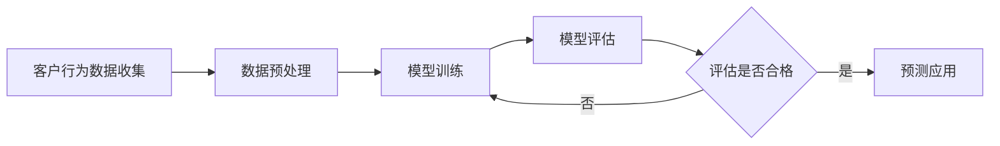

# AI在智能客户行为分析与预测中的应用

> 关键词：AI、智能客户行为分析、客户行为预测、机器学习、深度学习

> 摘要：本文深入探讨了AI在智能客户行为分析与预测中的应用。首先介绍了相关背景，包括目的、预期读者等。接着阐述了核心概念与联系，详细讲解了核心算法原理和具体操作步骤，并给出了相应的Python代码示例。同时，对数学模型和公式进行了详细说明并举例。通过项目实战，展示了代码的实际应用和解读。分析了实际应用场景，推荐了学习、开发工具和相关论文著作。最后总结了未来发展趋势与挑战，提供了常见问题解答和扩展阅读参考资料，旨在为读者全面呈现AI在客户行为分析与预测领域的应用全貌。

## 1. 背景介绍 
### 1.1 目的和范围
在当今数字化时代，企业面临着海量的客户数据。如何从这些数据中提取有价值的信息，了解客户的行为模式和需求，进而进行精准的预测，成为企业提升竞争力的关键。本文章的目的在于详细阐述AI技术在智能客户行为分析与预测中的应用，帮助企业更好地利用AI技术挖掘客户数据价值。

本文的范围涵盖了AI在客户行为分析与预测中的核心概念、算法原理、数学模型、实际项目案例、应用场景以及相关的学习资源和开发工具等方面，力求为读者提供一个全面且深入的了解。

### 1.2 预期读者
本文的预期读者包括企业的市场营销人员、数据分析师、AI工程师、企业管理者等。市场营销人员可以从中了解如何利用AI技术更好地了解客户需求，制定更有效的营销策略；数据分析师可以学习到先进的AI算法在客户数据处理中的应用；AI工程师可以深入研究相关算法的原理和实现；企业管理者可以从宏观层面了解AI在客户行为分析与预测中的价值和应用前景。

### 1.3 文档结构概述
本文将按照以下结构进行阐述：首先介绍背景信息，包括目的、预期读者和文档结构概述；接着阐述核心概念与联系，包括相关概念的原理和架构；然后详细讲解核心算法原理和具体操作步骤，并给出Python代码示例；之后介绍数学模型和公式，并举例说明；通过项目实战展示代码的实际应用和解读；分析实际应用场景；推荐学习、开发工具和相关论文著作；最后总结未来发展趋势与挑战，提供常见问题解答和扩展阅读参考资料。

### 1.4 术语表
#### 1.4.1 核心术语定义
- **AI（Artificial Intelligence）**：人工智能，是一门研究如何使计算机能够模拟人类智能的学科，包括机器学习、深度学习、自然语言处理等多个领域。
- **客户行为分析**：对客户在与企业交互过程中的各种行为数据进行收集、整理、分析，以了解客户的行为模式、偏好和需求。
- **客户行为预测**：基于客户历史行为数据，利用AI技术建立预测模型，对客户未来的行为进行预测，如购买行为、流失行为等。
- **机器学习**：是AI的一个重要分支，通过让计算机从数据中学习模式和规律，从而实现对未知数据的预测和分类。
- **深度学习**：是机器学习的一种，通过构建多层神经网络，自动从数据中提取复杂的特征和模式，在图像识别、语音识别等领域取得了巨大成功。

#### 1.4.2 相关概念解释
- **数据挖掘**：从大量的、不完全的、有噪声的、模糊的、随机的数据中，提取隐含在其中的、人们事先不知道的、但又是潜在有用的信息和知识的过程。在客户行为分析中，数据挖掘可以帮助企业发现客户的潜在需求和行为模式。
- **预测模型**：是一种数学模型，通过对历史数据的学习和分析，建立输入变量（如客户特征、行为数据等）与输出变量（如客户购买概率、流失概率等）之间的关系，从而对未来情况进行预测。

#### 1.4.3 缩略词列表
- **ML（Machine Learning）**：机器学习
- **DL（Deep Learning）**：深度学习
- **NLP（Natural Language Processing）**：自然语言处理
- **PCA（Principal Component Analysis）**：主成分分析
- **SVM（Support Vector Machine）**：支持向量机

## 2. 核心概念与联系 

### 核心概念原理
#### 客户行为数据
客户行为数据是指客户在与企业交互过程中产生的各种数据，包括浏览记录、购买记录、搜索记录、评价信息等。这些数据可以反映客户的兴趣、偏好和需求，是进行客户行为分析与预测的基础。

#### AI技术在客户行为分析与预测中的应用原理
AI技术通过对客户行为数据的收集、整理和分析，利用机器学习和深度学习算法建立预测模型。这些模型可以学习客户行为数据中的模式和规律，从而对客户未来的行为进行预测。例如，通过分析客户的历史购买记录，建立购买预测模型，预测客户未来购买某种产品的概率。

### 架构的文本示意图
客户行为数据收集 -> 数据预处理（清洗、转换、特征提取） -> 模型训练（选择合适的算法，如决策树、神经网络等） -> 模型评估（使用评估指标，如准确率、召回率等） -> 预测应用（将训练好的模型应用于新的数据，进行客户行为预测）

### Mermaid流程图


## 3. 核心算法原理 & 具体操作步骤 

### 核心算法原理
#### 决策树算法
决策树是一种常用的机器学习算法，它通过对数据的特征进行划分，构建一棵决策树，每个内部节点表示一个特征上的测试，每个分支表示一个测试输出，每个叶节点表示一个类别或值。在客户行为分析与预测中，决策树可以用于分类问题，如预测客户是否会购买某种产品。

以下是决策树算法的Python代码示例：
```python
from sklearn.datasets import load_iris
from sklearn.model_selection import train_test_split
from sklearn.tree import DecisionTreeClassifier
from sklearn.metrics import accuracy_score

# 加载数据集
iris = load_iris()
X = iris.data
y = iris.target

# 划分训练集和测试集
X_train, X_test, y_train, y_test = train_test_split(X, y, test_size=0.2, random_state=42)

# 创建决策树分类器
clf = DecisionTreeClassifier()

# 训练模型
clf.fit(X_train, y_train)

# 预测
y_pred = clf.predict(X_test)

# 评估模型
accuracy = accuracy_score(y_test, y_pred)
print(f"Accuracy: {accuracy}")
```

#### 神经网络算法
神经网络是一种模仿人类神经系统的机器学习算法，它由多个神经元组成，通过对数据的学习和训练，调整神经元之间的连接权重，从而实现对数据的分类和预测。在客户行为分析与预测中，神经网络可以用于处理复杂的非线性关系。

以下是一个简单的神经网络算法的Python代码示例：
```python
import tensorflow as tf
from tensorflow.keras.datasets import mnist
from tensorflow.keras.models import Sequential
from tensorflow.keras.layers import Dense, Flatten

# 加载数据集
(x_train, y_train), (x_test, y_test) = mnist.load_data()

# 数据预处理
x_train = x_train / 255.0
x_test = x_test / 255.0

# 创建神经网络模型
model = Sequential([
    Flatten(input_shape=(28, 28)),
    Dense(128, activation='relu'),
    Dense(10, activation='softmax')
])

# 编译模型
model.compile(optimizer='adam',
              loss='sparse_categorical_crossentropy',
              metrics=['accuracy'])

# 训练模型
model.fit(x_train, y_train, epochs=5)

# 评估模型
test_loss, test_acc = model.evaluate(x_test, y_test)
print(f"Test accuracy: {test_acc}")
```

### 具体操作步骤
1. **数据收集**：收集客户的行为数据，包括浏览记录、购买记录、搜索记录等。
2. **数据预处理**：对收集到的数据进行清洗、转换和特征提取，去除噪声数据，将数据转换为适合模型训练的格式。
3. **模型选择**：根据问题的类型和数据的特点，选择合适的算法，如决策树、神经网络等。
4. **模型训练**：使用训练数据对选择的模型进行训练，调整模型的参数，使其能够学习数据中的模式和规律。
5. **模型评估**：使用测试数据对训练好的模型进行评估，使用评估指标（如准确率、召回率等）来衡量模型的性能。
6. **模型优化**：如果模型的性能不理想，可以对模型进行优化，如调整模型的参数、增加数据等。
7. **预测应用**：将训练好的模型应用于新的数据，进行客户行为预测。

## 4. 数学模型和公式 & 详细讲解 & 举例说明 

### 决策树算法的数学模型和公式
决策树算法的核心是信息增益，信息增益是用来衡量一个特征对分类的重要性的指标。信息增益的计算公式如下：
$$IG(S, A) = H(S) - \sum_{v\in Values(A)}\frac{|S_v|}{|S|}H(S_v)$$
其中，$IG(S, A)$ 表示特征 $A$ 对数据集 $S$ 的信息增益，$H(S)$ 表示数据集 $S$ 的熵，$Values(A)$ 表示特征 $A$ 的所有可能取值，$S_v$ 表示数据集 $S$ 中特征 $A$ 取值为 $v$ 的子集。

熵的计算公式如下：
$$H(S) = -\sum_{i=1}^{n}p_i\log_2p_i$$
其中，$p_i$ 表示数据集 $S$ 中第 $i$ 类样本的比例。

举例说明：假设有一个数据集 $S$，包含 10 个样本，其中 6 个属于类别 1，4 个属于类别 2。则数据集 $S$ 的熵为：
$$H(S) = -\frac{6}{10}\log_2\frac{6}{10} - \frac{4}{10}\log_2\frac{4}{10} \approx 0.971$$

假设特征 $A$ 有两个取值 $v_1$ 和 $v_2$，$S_{v_1}$ 包含 4 个样本，其中 3 个属于类别 1，1 个属于类别 2；$S_{v_2}$ 包含 6 个样本，其中 3 个属于类别 1，3 个属于类别 2。则特征 $A$ 对数据集 $S$ 的信息增益为：
$$IG(S, A) = H(S) - (\frac{4}{10}H(S_{v_1}) + \frac{6}{10}H(S_{v_2}))$$
$$H(S_{v_1}) = -\frac{3}{4}\log_2\frac{3}{4} - \frac{1}{4}\log_2\frac{1}{4} \approx 0.811$$
$$H(S_{v_2}) = -\frac{3}{6}\log_2\frac{3}{6} - \frac{3}{6}\log_2\frac{3}{6} = 1$$
$$IG(S, A) = 0.971 - (\frac{4}{10} \times 0.811 + \frac{6}{10} \times 1) \approx 0.106$$

### 神经网络算法的数学模型和公式
神经网络的核心是神经元，神经元的输出可以通过以下公式计算：
$$y = f(\sum_{i=1}^{n}w_ix_i + b)$$
其中，$y$ 表示神经元的输出，$x_i$ 表示输入信号，$w_i$ 表示输入信号的权重，$b$ 表示偏置，$f$ 表示激活函数。

常见的激活函数有 sigmoid 函数、ReLU 函数等。sigmoid 函数的公式如下：
$$\sigma(x) = \frac{1}{1 + e^{-x}}$$
ReLU 函数的公式如下：
$$ReLU(x) = \max(0, x)$$

在神经网络的训练过程中，通常使用反向传播算法来调整神经元的权重和偏置。反向传播算法的核心是计算损失函数对权重和偏置的梯度，然后根据梯度来更新权重和偏置。常见的损失函数有均方误差损失函数、交叉熵损失函数等。

均方误差损失函数的公式如下：
$$MSE = \frac{1}{n}\sum_{i=1}^{n}(y_i - \hat{y}_i)^2$$
其中，$y_i$ 表示真实值，$\hat{y}_i$ 表示预测值，$n$ 表示样本数量。

交叉熵损失函数的公式如下：
$$CE = -\sum_{i=1}^{n}y_i\log(\hat{y}_i)$$

## 5. 项目实战：代码实际案例和详细解释说明 

### 5.1  开发环境搭建
#### 安装Python
首先需要安装Python，建议安装Python 3.7及以上版本。可以从Python官方网站（https://www.python.org/downloads/）下载并安装。

#### 安装必要的库
使用pip安装必要的库，如numpy、pandas、scikit-learn、tensorflow等。可以使用以下命令进行安装：
```sh
pip install numpy pandas scikit-learn tensorflow
```

### 5.2  源代码详细实现和代码解读
以下是一个使用决策树算法进行客户购买行为预测的实际案例：
```python
import pandas as pd
from sklearn.model_selection import train_test_split
from sklearn.tree import DecisionTreeClassifier
from sklearn.metrics import accuracy_score

# 加载数据集
data = pd.read_csv('customer_data.csv')

# 提取特征和标签
X = data.drop('purchase', axis=1)
y = data['purchase']

# 划分训练集和测试集
X_train, X_test, y_train, y_test = train_test_split(X, y, test_size=0.2, random_state=42)

# 创建决策树分类器
clf = DecisionTreeClassifier()

# 训练模型
clf.fit(X_train, y_train)

# 预测
y_pred = clf.predict(X_test)

# 评估模型
accuracy = accuracy_score(y_test, y_pred)
print(f"Accuracy: {accuracy}")
```

### 代码解读与分析
1. **数据加载**：使用`pandas`库的`read_csv`函数加载客户行为数据集。
2. **特征和标签提取**：将数据集中的特征和标签分别提取出来，其中`purchase`列作为标签，其余列作为特征。
3. **数据集划分**：使用`train_test_split`函数将数据集划分为训练集和测试集，测试集占比为20%。
4. **模型创建**：创建一个决策树分类器对象。
5. **模型训练**：使用训练集对决策树分类器进行训练。
6. **预测**：使用训练好的模型对测试集进行预测。
7. **模型评估**：使用`accuracy_score`函数计算模型的准确率。

## 6. 实际应用场景 
### 市场营销
企业可以利用AI技术对客户行为进行分析和预测，了解客户的兴趣和需求，从而制定更精准的市场营销策略。例如，根据客户的购买历史和浏览记录，向客户推荐个性化的产品和服务，提高营销效果。

### 客户流失预测
通过对客户行为数据的分析，建立客户流失预测模型，预测客户流失的概率。企业可以根据预测结果采取相应的措施，如提供个性化的优惠活动、改善客户服务等，降低客户流失率。

### 产品优化
分析客户的反馈和行为数据，了解客户对产品的满意度和需求，从而对产品进行优化。例如，根据客户的评价和建议，改进产品的功能和界面，提高产品的用户体验。

### 客户细分
利用AI技术对客户进行细分，将客户分为不同的群体，每个群体具有相似的行为特征和需求。企业可以针对不同的客户群体制定不同的营销策略，提高营销的针对性和效果。

## 7. 工具和资源推荐
### 7.1 学习资源推荐
#### 7.1.1 书籍推荐
- 《机器学习》（周志华）：全面介绍了机器学习的基本概念、算法和应用，是机器学习领域的经典教材。
- 《深度学习》（Ian Goodfellow、Yoshua Bengio和Aaron Courville）：深入介绍了深度学习的原理、算法和应用，是深度学习领域的权威著作。
- 《Python机器学习实战》（Sebastian Raschka）：通过实际案例介绍了Python在机器学习中的应用，适合初学者。

#### 7.1.2 在线课程
- Coursera上的“机器学习”课程（Andrew Ng）：由斯坦福大学教授Andrew Ng授课，是机器学习领域的经典在线课程。
- edX上的“深度学习”课程（deeplearning.ai）：由深度学习领域的知名专家授课，内容涵盖深度学习的各个方面。
- 中国大学MOOC上的“人工智能基础”课程：由国内知名高校的教授授课，适合初学者了解人工智能的基本概念和技术。

#### 7.1.3 技术博客和网站
- Medium：是一个技术博客平台，上面有很多关于AI、机器学习和深度学习的文章和教程。
- Towards Data Science：专注于数据科学和机器学习领域的技术博客，提供了很多实用的教程和案例。
- Kaggle：是一个数据科学竞赛平台，上面有很多公开的数据集和优秀的解决方案，可以学习到很多实际应用的经验。

### 7.2 开发工具框架推荐
#### 7.2.1 IDE和编辑器
- PyCharm：是一款专门为Python开发设计的集成开发环境，具有强大的代码编辑、调试和分析功能。
- Jupyter Notebook：是一个交互式的开发环境，适合进行数据探索和模型实验。
- Visual Studio Code：是一款轻量级的代码编辑器，支持多种编程语言，具有丰富的插件和扩展功能。

#### 7.2.2 调试和性能分析工具
- TensorBoard：是TensorFlow提供的一个可视化工具，可以用于查看模型的训练过程、性能指标等。
- Py-Spy：是一个用于Python代码性能分析的工具，可以帮助开发者找出代码中的性能瓶颈。
- PDB：是Python自带的调试器，可以用于调试Python代码。

#### 7.2.3 相关框架和库
- Scikit-learn：是一个常用的机器学习库，提供了丰富的机器学习算法和工具，如分类、回归、聚类等。
- TensorFlow：是一个开源的深度学习框架，由Google开发，广泛应用于图像识别、语音识别、自然语言处理等领域。
- PyTorch：是一个开源的深度学习框架，由Facebook开发，具有简洁易用、灵活性高的特点。

### 7.3 相关论文著作推荐
#### 7.3.1 经典论文
- 《A Decision-Theoretic Generalization of On-Line Learning and an Application to Boosting》（Yoav Freund和Robert E. Schapire）：提出了AdaBoost算法，是机器学习领域的经典论文。
- 《ImageNet Classification with Deep Convolutional Neural Networks》（Alex Krizhevsky、Ilya Sutskever和Geoffrey E. Hinton）：提出了AlexNet模型，开创了深度学习在图像识别领域的先河。
- 《Attention Is All You Need》（Ashish Vaswani等）：提出了Transformer模型，在自然语言处理领域取得了巨大成功。

#### 7.3.2 最新研究成果
可以关注顶级学术会议（如NeurIPS、ICML、CVPR等）和学术期刊（如Journal of Machine Learning Research、Artificial Intelligence等）上的最新研究成果。

#### 7.3.3 应用案例分析
可以参考一些知名企业的应用案例分析，如Google、Facebook、Amazon等公司在客户行为分析与预测方面的应用案例。

## 8. 总结：未来发展趋势与挑战
### 未来发展趋势
- **多模态数据融合**：未来AI在客户行为分析与预测中将融合更多类型的数据，如文本、图像、视频等，以更全面地了解客户的行为和需求。
- **实时分析与预测**：随着技术的发展，企业将越来越需要实时的客户行为分析与预测，以便及时做出决策。
- **与其他技术的融合**：AI将与物联网、区块链等技术融合，为客户行为分析与预测带来更多的创新应用。

### 挑战
- **数据隐私和安全**：客户行为数据涉及到大量的个人隐私信息，如何保护数据的隐私和安全是一个重要的挑战。
- **算法可解释性**：一些复杂的AI算法（如深度学习）的可解释性较差，企业难以理解模型的决策过程，这在一定程度上限制了AI在客户行为分析与预测中的应用。
- **数据质量**：客户行为数据的质量直接影响到模型的性能，如何保证数据的准确性、完整性和一致性是一个挑战。

## 9. 附录：常见问题与解答
### 问题1：AI在客户行为分析与预测中的应用需要多少数据？
答：数据量的需求取决于具体的应用场景和算法。一般来说，数据量越大，模型的性能越好。但在实际应用中，也需要考虑数据的质量和特征的选择。

### 问题2：如何选择合适的AI算法进行客户行为分析与预测？
答：选择合适的算法需要考虑问题的类型（如分类、回归、聚类等）、数据的特点（如数据量、特征维度等）和模型的复杂度等因素。可以通过实验和比较不同算法的性能来选择最合适的算法。

### 问题3：AI模型的性能如何评估？
答：可以使用多种评估指标来评估AI模型的性能，如准确率、召回率、F1值、均方误差等。具体选择哪种评估指标需要根据问题的类型和应用场景来确定。

## 10. 扩展阅读 & 参考资料
- 《数据挖掘：概念与技术》（Jiawei Han、Jian Pei和Jianwen Yin）
- 《人工智能：一种现代的方法》（Stuart Russell和Peter Norvig）
- 相关学术论文和研究报告

作者：AI天才研究院/AI Genius Institute & 禅与计算机程序设计艺术 /Zen And The Art of Computer Programming