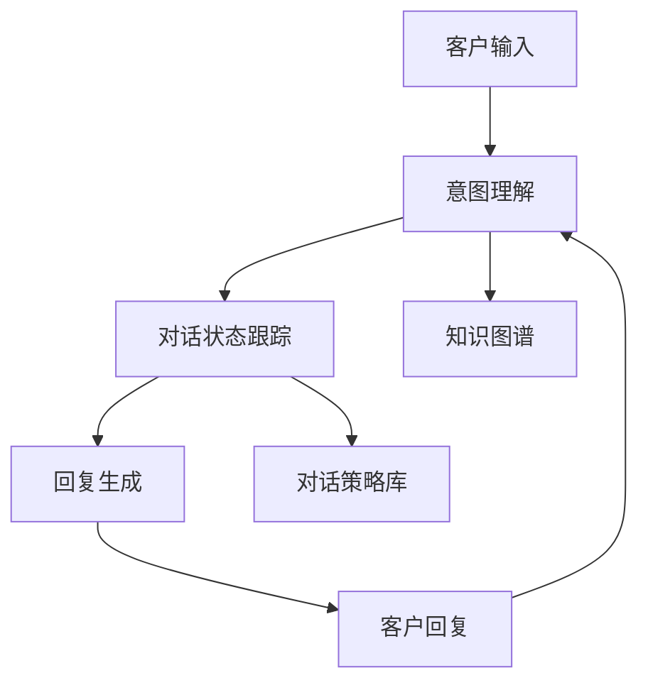

# AI在智能客服多轮对话管理与意图理解中的应用

> 关键词：AI、智能客服、多轮对话管理、意图理解、自然语言处理

> 摘要：本文深入探讨了AI在智能客服多轮对话管理与意图理解中的应用。首先介绍了相关背景，包括目的范围、预期读者等。接着阐述了核心概念及联系，给出了原理和架构的示意图与流程图。详细讲解了核心算法原理和具体操作步骤，结合Python代码进行说明。分析了数学模型和公式，并举例说明。通过项目实战展示了代码的实际案例和详细解释。探讨了实际应用场景，推荐了相关的工具和资源。最后总结了未来发展趋势与挑战，还包含常见问题解答和扩展阅读参考资料，旨在为读者全面呈现AI在智能客服领域的应用全貌。

## 1. 背景介绍 
### 1.1 目的和范围
随着互联网技术的飞速发展，企业面临着越来越多的客户咨询和服务需求。传统的客服模式难以满足大规模、多样化的客户需求，效率低下且成本较高。智能客服系统应运而生，它借助AI技术，能够自动处理客户的咨询，提供快速准确的响应。本文的目的在于深入研究AI在智能客服多轮对话管理与意图理解方面的应用，详细剖析其技术原理、算法实现、实际应用案例等，为相关领域的研究人员和开发者提供全面且深入的参考。范围涵盖了从基础概念到具体算法，再到实际项目应用和未来发展趋势等多个方面。

### 1.2 预期读者
本文预期读者主要包括从事自然语言处理、人工智能、智能客服系统开发等领域的研究人员和开发者，他们希望深入了解AI在智能客服多轮对话管理与意图理解中的具体应用和技术实现细节。同时，也适合对智能客服系统感兴趣的企业管理人员和市场营销人员，帮助他们了解智能客服系统的技术原理和潜在价值，以便更好地推动企业客服服务的智能化升级。此外，对于相关专业的学生和爱好者，本文也能为他们提供一个系统学习和研究的参考资料。

### 1.3 文档结构概述
本文将按照以下结构进行组织：首先介绍相关背景信息，包括目的、预期读者和文档结构等。接着阐述核心概念与联系，通过文本示意图和Mermaid流程图展示其原理和架构。然后详细讲解核心算法原理和具体操作步骤，结合Python代码进行说明。随后分析数学模型和公式，并举例说明。通过项目实战展示代码的实际案例和详细解释。探讨实际应用场景，推荐相关的工具和资源。最后总结未来发展趋势与挑战，包含常见问题解答和扩展阅读参考资料。

### 1.4 术语表
#### 1.4.1 核心术语定义
- **智能客服**：利用人工智能技术，如自然语言处理、机器学习等，实现自动回复客户咨询、解决客户问题的客服系统。
- **多轮对话管理**：在与客户的交互过程中，能够理解客户的多轮对话，根据历史对话信息和当前对话内容，合理引导对话流程，实现连贯、有效的对话。
- **意图理解**：分析客户的话语，准确识别其表达的真实意图，例如查询信息、提出投诉、请求帮助等。
- **自然语言处理（NLP）**：研究如何让计算机理解、处理和生成人类语言的技术领域。
- **机器学习**：让计算机通过数据学习模式和规律，从而实现预测、分类等任务的技术。

#### 1.4.2 相关概念解释
- **对话状态跟踪**：在多轮对话中，记录和更新对话的当前状态，包括客户的意图、提供的信息等，以便系统能够根据状态做出合适的响应。
- **槽填充**：在意图理解中，识别客户话语中与意图相关的关键信息，如时间、地点、产品名称等，将这些信息填充到相应的槽位中。
- **知识图谱**：一种结构化的语义网络，用于表示实体之间的关系和知识，在智能客服中可以为意图理解和对话管理提供丰富的背景知识。

#### 1.4.3 缩略词列表
- **NLP**：Natural Language Processing（自然语言处理）
- **ML**：Machine Learning（机器学习）
- **DNN**：Deep Neural Network（深度神经网络）
- **RNN**：Recurrent Neural Network（循环神经网络）
- **LSTM**：Long Short-Term Memory（长短期记忆网络）

## 2. 核心概念与联系 
### 核心概念原理
智能客服的多轮对话管理与意图理解主要基于自然语言处理和机器学习技术。意图理解的核心是将客户的自然语言文本转化为计算机能够理解的语义表示，识别出客户的意图和相关信息。多轮对话管理则是在意图理解的基础上，根据对话的历史信息和当前状态，合理规划对话流程，引导客户提供更多必要信息，最终解决客户问题。

在意图理解中，通常会使用文本分类、命名实体识别等技术。文本分类用于将客户的话语分类到不同的意图类别中，例如“查询产品信息”、“投诉服务问题”等。命名实体识别则用于识别客户话语中的关键实体，如人名、地名、产品名称等。

多轮对话管理涉及到对话状态的表示和更新。对话状态可以用一个向量或矩阵来表示，包含了当前对话的各种信息，如客户的意图、已经提供的信息、系统的回复等。在每一轮对话中，系统根据当前对话状态和客户的新输入，更新对话状态，并生成合适的回复。

### 架构的文本示意图
```plaintext
客户输入 --> 意图理解模块 --> 对话状态跟踪模块 --> 回复生成模块 --> 客户回复
                          |                      |
                          v                      v
                      知识图谱              对话策略库
```
这个示意图展示了智能客服系统的基本架构。客户输入首先经过意图理解模块，识别出客户的意图和相关信息。对话状态跟踪模块根据意图理解的结果和历史对话信息，更新对话状态。回复生成模块根据对话状态和对话策略库，生成合适的回复发送给客户。知识图谱为意图理解和对话管理提供了丰富的背景知识。

### Mermaid流程图

这个流程图清晰地展示了智能客服系统的工作流程。客户输入经过意图理解后，更新对话状态，然后生成回复发送给客户。客户的回复又作为新的输入进入系统，形成一个循环的对话过程。知识图谱和对话策略库为系统提供了必要的支持。

## 3. 核心算法原理 & 具体操作步骤 
### 意图理解算法原理
在意图理解中，常用的算法是基于深度学习的文本分类算法。这里以基于长短期记忆网络（LSTM）的文本分类为例进行说明。

LSTM是一种特殊的循环神经网络，能够有效地处理序列数据，如自然语言文本。它通过引入门控机制，解决了传统循环神经网络在处理长序列时的梯度消失问题。

#### Python代码实现
```python
import numpy as np
import tensorflow as tf
from tensorflow.keras.preprocessing.text import Tokenizer
from tensorflow.keras.preprocessing.sequence import pad_sequences
from tensorflow.keras.models import Sequential
from tensorflow.keras.layers import Embedding, LSTM, Dense

# 示例数据
texts = ["我想查询一下产品的价格", "我要投诉你们的服务", "帮我预订一个房间"]
labels = [0, 1, 2]

# 分词和编码
tokenizer = Tokenizer()
tokenizer.fit_on_texts(texts)
sequences = tokenizer.texts_to_sequences(texts)

# 填充序列
max_length = max([len(seq) for seq in sequences])
padded_sequences = pad_sequences(sequences, maxlen=max_length)

# 构建模型
model = Sequential()
model.add(Embedding(input_dim=len(tokenizer.word_index) + 1, output_dim=100, input_length=max_length))
model.add(LSTM(100))
model.add(Dense(3, activation='softmax'))

# 编译模型
model.compile(optimizer='adam', loss='sparse_categorical_crossentropy', metrics=['accuracy'])

# 训练模型
model.fit(padded_sequences, np.array(labels), epochs=10, batch_size=1)

# 预测新数据
new_text = ["我想知道这个产品的规格"]
new_sequence = tokenizer.texts_to_sequences(new_text)
new_padded_sequence = pad_sequences(new_sequence, maxlen=max_length)
prediction = model.predict(new_padded_sequence)
predicted_label = np.argmax(prediction)
print("预测的意图标签：", predicted_label)
```
### 具体操作步骤
1. **数据准备**：收集客户的对话数据，并标注每个对话的意图标签。将数据分为训练集和测试集。
2. **文本预处理**：对文本数据进行分词、编码和填充操作，将文本转化为适合模型输入的格式。
3. **模型构建**：构建基于LSTM的文本分类模型，包括嵌入层、LSTM层和全连接层。
4. **模型训练**：使用训练集数据对模型进行训练，调整模型的参数。
5. **模型评估**：使用测试集数据对训练好的模型进行评估，计算模型的准确率、召回率等指标。
6. **模型预测**：使用训练好的模型对新的客户输入进行意图预测。

### 多轮对话管理算法原理
多轮对话管理可以使用基于规则的方法或基于强化学习的方法。这里以基于规则的方法为例进行说明。

基于规则的多轮对话管理通过定义一系列的规则来控制对话的流程。这些规则可以根据对话状态和客户输入来判断应该采取的行动，如询问更多信息、提供解决方案等。

#### Python代码实现
```python
# 定义对话状态
dialogue_state = {
    "intent": None,
    "slots": {}
}

# 定义规则
rules = [
    {
        "condition": lambda state, input: state["intent"] is None,
        "action": lambda state, input: ({"intent": "unknown", "slots": {}}, "请问您有什么问题需要帮助？")
    },
    {
        "condition": lambda state, input: state["intent"] == "unknown" and "查询产品信息" in input,
        "action": lambda state, input: ({"intent": "查询产品信息", "slots": {}}, "请问您想查询哪个产品的信息？")
    },
    {
        "condition": lambda state, input: state["intent"] == "查询产品信息" and "产品名称" not in state["slots"],
        "action": lambda state, input: ({"intent": "查询产品信息", "slots": {"产品名称": input}}, "好的，我将为您查询该产品的信息。")
    }
]

# 处理客户输入
def handle_input(input_text):
    global dialogue_state
    for rule in rules:
        if rule["condition"](dialogue_state, input_text):
            new_state, response = rule["action"](dialogue_state, input_text)
            dialogue_state = new_state
            return response
    return "我不太明白您的意思，请您详细描述一下。"

# 模拟对话
input_text = "我想查询产品信息"
response = handle_input(input_text)
print("系统回复：", response)

input_text = "手机"
response = handle_input(input_text)
print("系统回复：", response)
```
### 具体操作步骤
1. **定义对话状态**：确定对话状态的表示方式，如字典或类对象，包含客户的意图和已填充的槽位信息。
2. **定义规则**：根据业务需求和对话流程，定义一系列的规则。每个规则包含一个条件和一个行动。
3. **处理客户输入**：根据当前对话状态和客户输入，遍历规则列表，找到满足条件的规则，并执行相应的行动。
4. **更新对话状态**：根据规则的行动结果，更新对话状态。
5. **生成回复**：根据规则的行动结果，生成合适的回复发送给客户。

## 4. 数学模型和公式 & 详细讲解 & 举例说明 
### 意图理解的数学模型
在基于深度学习的意图理解中，常用的数学模型是神经网络。以基于LSTM的文本分类模型为例，其数学模型可以表示为以下几个步骤：

#### 嵌入层
嵌入层将输入的文本序列中的每个词转化为一个低维向量表示。假设输入的文本序列为 $x = [x_1, x_2, \cdots, x_T]$，其中 $x_t$ 表示第 $t$ 个词的索引。嵌入层的输出为 $e_t = E[x_t]$，其中 $E$ 是嵌入矩阵。

#### LSTM层
LSTM层通过门控机制处理输入的序列，更新隐藏状态。LSTM单元的计算公式如下：

$$
\begin{align*}
i_t &= \sigma(W_{ii}e_t + W_{hi}h_{t-1} + b_i) \\
f_t &= \sigma(W_{if}e_t + W_{hf}h_{t-1} + b_f) \\
o_t &= \sigma(W_{io}e_t + W_{ho}h_{t-1} + b_o) \\
\tilde{c}_t &= \tanh(W_{ic}e_t + W_{hc}h_{t-1} + b_c) \\
c_t &= f_t \odot c_{t-1} + i_t \odot \tilde{c}_t \\
h_t &= o_t \odot \tanh(c_t)
\end{align*}
$$

其中，$i_t$、$f_t$、$o_t$ 分别是输入门、遗忘门和输出门，$\tilde{c}_t$ 是候选记忆单元，$c_t$ 是记忆单元，$h_t$ 是隐藏状态。$\sigma$ 是 sigmoid 函数，$\tanh$ 是双曲正切函数，$\odot$ 表示逐元素相乘。$W$ 是权重矩阵，$b$ 是偏置向量。

#### 全连接层
全连接层将LSTM层的输出映射到意图类别上。假设LSTM层的输出为 $h_T$，全连接层的输出为 $y = \text{softmax}(W_hh_T + b_y)$，其中 $W_h$ 是权重矩阵，$b_y$ 是偏置向量，$\text{softmax}$ 函数将输出转化为概率分布。

### 举例说明
假设我们有一个简单的文本分类任务，将文本分为“查询信息”、“投诉”和“预订”三类。输入的文本序列为“我想查询一下产品的价格”，经过分词和编码后，得到输入序列 $x = [1, 2, 3, 4, 5]$。

- **嵌入层**：将输入序列中的每个词索引转化为嵌入向量，例如 $e_1 = E[1]$，$e_2 = E[2]$ 等。
- **LSTM层**：根据LSTM单元的计算公式，依次更新隐藏状态 $h_1$，$h_2$，$\cdots$，$h_T$。最终得到 $h_T$。
- **全连接层**：将 $h_T$ 输入到全连接层，计算 $y = \text{softmax}(W_hh_T + b_y)$。假设 $y = [0.8, 0.1, 0.1]$，则预测的意图类别为“查询信息”。

### 多轮对话管理的数学模型
基于规则的多轮对话管理可以用有限状态自动机（FSA）来表示。有限状态自动机由一组状态、一组转移规则和一个初始状态组成。

设 $S$ 是状态集合，$I$ 是输入集合，$\delta: S \times I \to S$ 是转移函数，$s_0$ 是初始状态。在多轮对话管理中，状态 $s \in S$ 表示对话的当前状态，输入 $i \in I$ 表示客户的输入。转移函数 $\delta(s, i)$ 表示在状态 $s$ 下接收到输入 $i$ 后转移到的新状态。

### 举例说明
假设我们有一个简单的多轮对话场景，状态集合 $S = \{s_0, s_1, s_2\}$，输入集合 $I = \{\text{查询产品信息}, \text{手机}\}$。初始状态 $s_0$。

转移规则如下：
- $\delta(s_0, \text{查询产品信息}) = s_1$
- $\delta(s_1, \text{手机}) = s_2$

当客户输入“查询产品信息”时，对话状态从 $s_0$ 转移到 $s_1$。当客户接着输入“手机”时，对话状态从 $s_1$ 转移到 $s_2$。

## 5. 项目实战：代码实际案例和详细解释说明 
### 5.1  开发环境搭建
#### 安装Python
首先需要安装Python环境，建议使用Python 3.6及以上版本。可以从Python官方网站（https://www.python.org/downloads/）下载并安装。

#### 安装必要的库
使用以下命令安装必要的Python库：
```sh
pip install tensorflow numpy scikit-learn
```
- **TensorFlow**：用于构建和训练深度学习模型。
- **NumPy**：用于数值计算。
- **Scikit-learn**：用于数据处理和模型评估。

### 5.2  源代码详细实现和代码解读
#### 意图理解模型实现
```python
import numpy as np
import tensorflow as tf
from tensorflow.keras.preprocessing.text import Tokenizer
from tensorflow.keras.preprocessing.sequence import pad_sequences
from tensorflow.keras.models import Sequential
from tensorflow.keras.layers import Embedding, LSTM, Dense
from sklearn.model_selection import train_test_split

# 示例数据
texts = ["我想查询一下产品的价格", "我要投诉你们的服务", "帮我预订一个房间", "查询产品的规格", "投诉客服态度不好", "预订酒店"]
labels = [0, 1, 2, 0, 1, 2]

# 分词和编码
tokenizer = Tokenizer()
tokenizer.fit_on_texts(texts)
sequences = tokenizer.texts_to_sequences(texts)

# 填充序列
max_length = max([len(seq) for seq in sequences])
padded_sequences = pad_sequences(sequences, maxlen=max_length)

# 划分训练集和测试集
X_train, X_test, y_train, y_test = train_test_split(padded_sequences, np.array(labels), test_size=0.2, random_state=42)

# 构建模型
model = Sequential()
model.add(Embedding(input_dim=len(tokenizer.word_index) + 1, output_dim=100, input_length=max_length))
model.add(LSTM(100))
model.add(Dense(3, activation='softmax'))

# 编译模型
model.compile(optimizer='adam', loss='sparse_categorical_crossentropy', metrics=['accuracy'])

# 训练模型
model.fit(X_train, y_train, epochs=10, batch_size=1, validation_data=(X_test, y_test))

# 评估模型
test_loss, test_acc = model.evaluate(X_test, y_test)
print("测试集准确率：", test_acc)

# 预测新数据
new_text = ["我想知道这个产品的价格"]
new_sequence = tokenizer.texts_to_sequences(new_text)
new_padded_sequence = pad_sequences(new_sequence, maxlen=max_length)
prediction = model.predict(new_padded_sequence)
predicted_label = np.argmax(prediction)
print("预测的意图标签：", predicted_label)
```
#### 代码解读
1. **数据准备**：定义了示例的文本数据和对应的意图标签。使用 `Tokenizer` 对文本进行分词和编码，将文本转化为序列。使用 `pad_sequences` 对序列进行填充，使所有序列长度一致。
2. **数据划分**：使用 `train_test_split` 将数据划分为训练集和测试集，比例为 8:2。
3. **模型构建**：构建了一个基于LSTM的文本分类模型，包括嵌入层、LSTM层和全连接层。
4. **模型编译**：使用 `adam` 优化器和 `sparse_categorical_crossentropy` 损失函数编译模型。
5. **模型训练**：使用训练集数据对模型进行训练，设置训练轮数为 10，批次大小为 1。
6. **模型评估**：使用测试集数据对训练好的模型进行评估，计算测试集的准确率。
7. **模型预测**：对新的文本数据进行意图预测，输出预测的意图标签。

#### 多轮对话管理实现
```python
# 定义对话状态
dialogue_state = {
    "intent": None,
    "slots": {}
}

# 定义规则
rules = [
    {
        "condition": lambda state, input: state["intent"] is None,
        "action": lambda state, input: ({"intent": "unknown", "slots": {}}, "请问您有什么问题需要帮助？")
    },
    {
        "condition": lambda state, input: state["intent"] == "unknown" and "查询产品信息" in input,
        "action": lambda state, input: ({"intent": "查询产品信息", "slots": {}}, "请问您想查询哪个产品的信息？")
    },
    {
        "condition": lambda state, input: state["intent"] == "查询产品信息" and "产品名称" not in state["slots"],
        "action": lambda state, input: ({"intent": "查询产品信息", "slots": {"产品名称": input}}, "好的，我将为您查询该产品的信息。")
    }
]

# 处理客户输入
def handle_input(input_text):
    global dialogue_state
    for rule in rules:
        if rule["condition"](dialogue_state, input_text):
            new_state, response = rule["action"](dialogue_state, input_text)
            dialogue_state = new_state
            return response
    return "我不太明白您的意思，请您详细描述一下。"

# 模拟对话
while True:
    input_text = input("请输入您的问题：")
    if input_text.lower() == "退出":
        break
    response = handle_input(input_text)
    print("系统回复：", response)
```
#### 代码解读
1. **对话状态定义**：定义了对话状态的初始值，包括意图和槽位信息。
2. **规则定义**：定义了一系列的规则，每个规则包含一个条件和一个行动。条件用于判断是否满足规则，行动用于更新对话状态和生成回复。
3. **处理客户输入**：定义了 `handle_input` 函数，用于处理客户的输入。遍历规则列表，找到满足条件的规则，并执行相应的行动。
4. **模拟对话**：使用一个无限循环模拟对话过程，直到用户输入“退出”。每次用户输入后，调用 `handle_input` 函数处理输入，并输出系统的回复。

### 5.3  代码解读与分析
#### 意图理解模型分析
- **优点**：基于深度学习的意图理解模型能够自动学习文本的特征，对于复杂的语义理解具有较好的效果。LSTM能够处理长序列数据，捕捉文本中的上下文信息。
- **缺点**：模型训练需要大量的标注数据，训练时间较长。模型的可解释性较差，难以理解模型是如何做出决策的。

#### 多轮对话管理分析
- **优点**：基于规则的多轮对话管理简单易懂，易于实现和维护。规则可以根据业务需求进行灵活调整。
- **缺点**：规则的编写需要专业的知识和经验，对于复杂的对话场景，规则的数量会急剧增加，导致管理困难。规则的覆盖范围有限，难以处理一些意外的输入。

## 6. 实际应用场景 
### 电商客服
在电商领域，智能客服可以帮助客户查询产品信息、处理订单问题、解决售后投诉等。通过多轮对话管理，客服可以引导客户提供更多必要信息，如产品名称、订单编号等，从而更准确地解决客户问题。例如，客户询问“这个产品有优惠活动吗”，客服可以进一步询问“您指的是哪个产品呢”，通过多轮对话获取产品名称，然后提供相应的优惠信息。

### 金融客服
在金融领域，智能客服可以为客户提供账户查询、贷款咨询、投资建议等服务。意图理解可以帮助客服准确识别客户的需求，如客户输入“我想了解一下贷款的利率”，客服可以快速判断客户的意图是查询贷款利率，并提供相关信息。多轮对话管理可以在客户提供不完整信息时，引导客户补充必要信息，如询问客户的贷款金额、贷款期限等。

### 电信客服
在电信领域，智能客服可以处理客户的套餐咨询、话费查询、故障报修等问题。通过意图理解和多轮对话管理，客服可以更好地与客户沟通，提高服务效率。例如，客户反馈“我的手机没信号了”，客服可以通过多轮对话了解客户的位置、手机型号等信息，然后提供相应的解决方案。

### 政务客服
在政务领域，智能客服可以为市民提供政策咨询、办事指南、投诉建议等服务。意图理解可以帮助客服快速定位市民的问题，多轮对话管理可以引导市民完成办事流程。例如，市民询问“如何办理营业执照”，客服可以通过多轮对话了解市民的具体情况，如企业类型、经营范围等，然后提供详细的办理流程和所需材料。

## 7. 工具和资源推荐
### 7.1 学习资源推荐
#### 7.1.1 书籍推荐
- 《自然语言处理入门》：作者何晗，本书系统地介绍了自然语言处理的基本概念、算法和应用，适合初学者入门。
- 《深度学习》：作者Ian Goodfellow、Yoshua Bengio和Aaron Courville，这是深度学习领域的经典教材，涵盖了深度学习的理论和实践。
- 《Python自然语言处理》：作者Steven Bird、Ewan Klein和Edward Loper，本书介绍了如何使用Python进行自然语言处理，包含了丰富的代码示例。

#### 7.1.2 在线课程
- Coursera上的“自然语言处理专项课程”：由斯坦福大学的教授授课，涵盖了自然语言处理的多个方面，包括文本分类、命名实体识别、机器翻译等。
- edX上的“深度学习基础”：由微软的专家授课，介绍了深度学习的基本概念和算法，为学习自然语言处理打下基础。
- 网易云课堂上的“智能客服系统开发实战”：课程结合实际项目，介绍了智能客服系统的开发流程和技术实现。

#### 7.1.3 技术博客和网站
- 机器之心：提供人工智能领域的最新技术和研究成果，包括自然语言处理、计算机视觉等。
- 开源中国：分享开源技术和项目经验，有很多关于自然语言处理和智能客服的技术文章。
- Hugging Face：一个专注于自然语言处理的开源社区，提供了丰富的预训练模型和工具。

### 7.2 开发工具框架推荐
#### 7.2.1 IDE和编辑器
- PyCharm：一款专业的Python集成开发环境，提供了代码编辑、调试、版本控制等功能，适合Python项目开发。
- Visual Studio Code：一款轻量级的代码编辑器，支持多种编程语言，有丰富的插件扩展，可用于自然语言处理项目的开发。
- Jupyter Notebook：一种交互式的开发环境，适合进行数据探索和模型实验，可直接在浏览器中运行代码并查看结果。

#### 7.2.2 调试和性能分析工具
- TensorBoard：TensorFlow的可视化工具，可用于查看模型的训练过程、损失函数变化、参数分布等信息，帮助调试和优化模型。
- Py-Spy：一个用于Python代码性能分析的工具，可分析代码的CPU使用率、函数调用时间等，找出性能瓶颈。
- Profiler：Python内置的性能分析工具，可用于分析代码的执行时间和内存使用情况。

#### 7.2.3 相关框架和库
- TensorFlow：一个开源的深度学习框架，提供了丰富的工具和接口，可用于构建和训练各种深度学习模型，包括自然语言处理模型。
- PyTorch：另一个流行的深度学习框架，具有动态图的特点，易于使用和调试，在自然语言处理领域也有广泛应用。
- spaCy：一个快速、高效的自然语言处理库，提供了多种语言的处理功能，如分词、词性标注、命名实体识别等。
- NLTK：一个经典的自然语言处理库，提供了丰富的语料库和工具，适合初学者学习和实验。

### 7.3 相关论文著作推荐
#### 7.3.1 经典论文
- “Attention Is All You Need”：提出了Transformer模型，是自然语言处理领域的重要突破，为后续的预训练模型奠定了基础。
- “Long Short-Term Memory”：介绍了长短期记忆网络（LSTM）的原理和应用，解决了传统循环神经网络的梯度消失问题。
- “BERT: Pre-training of Deep Bidirectional Transformers for Language Understanding”：提出了BERT预训练模型，在多个自然语言处理任务上取得了优异的成绩。

#### 7.3.2 最新研究成果
- 关注ACL（Association for Computational Linguistics）、EMNLP（Conference on Empirical Methods in Natural Language Processing）等自然语言处理领域的顶级会议，这些会议上会发布最新的研究成果和技术进展。
- 阅读相关的学术期刊，如Journal of Artificial Intelligence Research、Transactions of the Association for Computational Linguistics等。

#### 7.3.3 应用案例分析
- 可以参考一些大型企业的技术博客，如Google AI Blog、Microsoft Research Blog等，了解他们在智能客服和自然语言处理领域的应用案例和实践经验。
- 一些开源项目的文档和README文件中也会包含应用案例分析，如Rasa（一个开源的对话式AI框架）的官方文档。

## 8. 总结：未来发展趋势与挑战
### 未来发展趋势
#### 更强大的预训练模型
随着计算资源的不断提升和研究的深入，未来会出现更强大的预训练模型。这些模型能够学习到更丰富的语言知识，在意图理解和多轮对话管理中表现更出色。例如，GPT系列模型不断迭代，性能不断提升，为自然语言处理带来了新的突破。

#### 多模态融合
未来的智能客服将不仅仅局限于文本交互，还会融合语音、图像等多种模态信息。例如，客户可以通过语音提问，同时上传相关的图片，客服系统能够综合处理这些信息，提供更准确的回复。多模态融合可以提高客户的交互体验，拓宽智能客服的应用场景。

#### 个性化服务
智能客服将更加注重个性化服务，根据客户的历史对话记录、偏好等信息，为客户提供个性化的解决方案。例如，对于经常购买某类产品的客户，客服可以主动推荐相关的产品信息和优惠活动。个性化服务可以提高客户的满意度和忠诚度。

#### 与业务系统的深度集成
智能客服将与企业的业务系统进行更深度的集成，如与CRM（客户关系管理）系统、ERP（企业资源规划）系统等集成。这样，客服系统可以直接获取客户的相关信息，快速处理客户的问题，提高服务效率。例如，当客户咨询订单状态时，客服系统可以直接从ERP系统中获取订单信息并反馈给客户。

### 挑战
#### 数据质量和标注问题
高质量的数据是训练准确的意图理解和多轮对话管理模型的基础。然而，收集和标注大量的数据是一项艰巨的任务。数据可能存在噪声、不一致性等问题，标注的准确性也会影响模型的性能。如何提高数据质量和标注效率是一个亟待解决的问题。

#### 复杂语义理解
自然语言具有丰富的语义和语境，对于一些复杂的语义理解，如隐喻、双关语等，目前的技术还存在很大的挑战。在多轮对话中，准确理解客户的隐含意图和上下文信息也是一个难题。需要进一步研究和发展语义理解技术，提高模型的语义理解能力。

#### 可解释性和可信度
深度学习模型在意图理解和多轮对话管理中取得了很好的效果，但这些模型通常是黑盒模型，难以解释其决策过程。在一些关键领域，如金融、医疗等，模型的可解释性和可信度非常重要。如何提高模型的可解释性和可信度，让用户信任智能客服系统，是一个重要的挑战。

#### 对抗攻击
随着智能客服系统的广泛应用，也面临着对抗攻击的威胁。攻击者可以通过构造恶意输入，误导智能客服系统做出错误的决策。如何提高智能客服系统的鲁棒性，抵御对抗攻击，是未来需要关注的问题。

## 9. 附录：常见问题与解答
### 问题1：如何提高意图理解模型的准确率？
- **解答**：可以从以下几个方面提高意图理解模型的准确率。首先，收集更多高质量的标注数据，数据的多样性和规模对模型的性能有很大影响。其次，选择合适的模型架构，如基于深度学习的模型在处理复杂语义方面有优势。还可以进行模型调优，如调整超参数、使用正则化方法等。另外，对数据进行预处理，如去除噪声、进行词法分析等，也有助于提高模型的准确率。

### 问题2：基于规则的多轮对话管理有哪些局限性？
- **解答**：基于规则的多轮对话管理的局限性主要包括以下几点。规则的编写需要专业的知识和经验，对于复杂的对话场景，规则的数量会急剧增加，导致管理困难。规则的覆盖范围有限，难以处理一些意外的输入。而且规则的更新和维护比较麻烦，当业务需求发生变化时，需要手动修改规则。

### 问题3：如何处理多轮对话中的上下文信息？
- **解答**：可以使用对话状态跟踪技术来处理多轮对话中的上下文信息。对话状态可以记录客户的意图、已提供的信息等，在每一轮对话中，根据当前对话状态和客户的新输入，更新对话状态。另外，也可以使用一些深度学习模型，如LSTM、Transformer等，这些模型能够捕捉序列数据中的上下文信息，在多轮对话管理中表现较好。

### 问题4：智能客服系统如何与企业的业务系统集成？
- **解答**：智能客服系统与企业业务系统集成可以通过API接口实现。智能客服系统可以调用业务系统的API获取所需的数据，如客户信息、订单信息等。同时，业务系统也可以调用智能客服系统的API将相关信息反馈给客服系统。在集成过程中，需要确保数据的安全性和一致性，遵循相关的接口规范和协议。

### 问题5：如何评估智能客服系统的性能？
- **解答**：可以从多个方面评估智能客服系统的性能。在意图理解方面，可以使用准确率、召回率、F1值等指标来评估模型对客户意图的识别能力。在多轮对话管理方面，可以评估对话的流畅性、解决问题的效率等。还可以通过用户满意度调查来了解客户对智能客服系统的评价，综合考虑这些指标来全面评估智能客服系统的性能。

## 10. 扩展阅读 & 参考资料
### 扩展阅读
- 《对话系统技术原理与应用实践》：本书深入介绍了对话系统的技术原理和应用实践，包括意图理解、对话管理、回复生成等方面的内容，适合进一步深入学习智能客服系统的读者。
- 《人工智能：现代方法》：这是一本经典的人工智能教材，涵盖了人工智能的多个领域，包括自然语言处理、机器学习等，为读者提供了更广泛的知识背景。
- 《自然语言处理：基于预训练模型的方法》：介绍了基于预训练模型的自然语言处理技术，包括BERT、GPT等模型的原理和应用，对于了解最新的自然语言处理技术有很大帮助。

### 参考资料
- TensorFlow官方文档：https://www.tensorflow.org/api_docs
- PyTorch官方文档：https://pytorch.org/docs/stable/index.html
- spaCy官方文档：https://spacy.io/usage
- NLTK官方文档：https://www.nltk.org/

作者：AI天才研究院/AI Genius Institute & 禅与计算机程序设计艺术 /Zen And The Art of Computer Programming