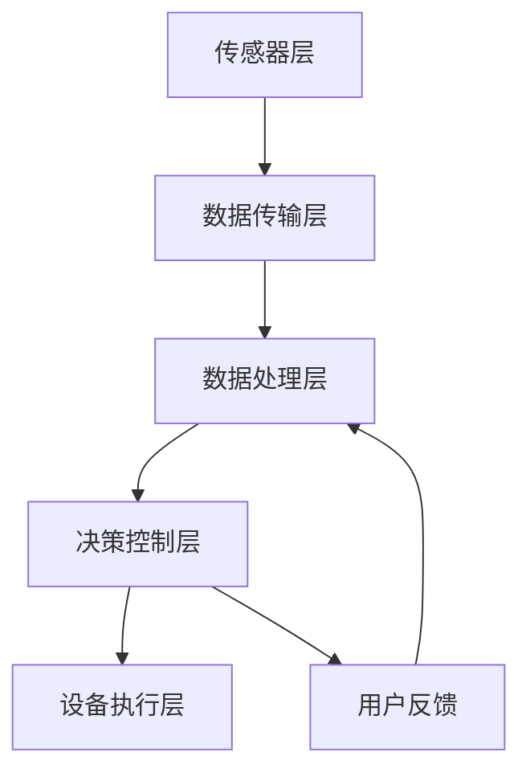

# AI在智能家居场景理解与用户行为预测中的应用

> 关键词：人工智能、智能家居、场景理解、用户行为预测、机器学习

> 摘要：本文深入探讨了AI在智能家居场景理解与用户行为预测中的应用。详细介绍了相关的核心概念、算法原理、数学模型，并结合实际案例展示了如何在智能家居系统中运用AI技术。同时，分析了实际应用场景，推荐了学习资源、开发工具和相关论文著作。最后，对未来发展趋势与挑战进行了总结，并解答了常见问题。

## 1. 背景介绍 
### 1.1 目的和范围
随着物联网技术的飞速发展，智能家居逐渐走进人们的生活。智能家居系统旨在为用户提供更加便捷、舒适、安全的居住环境。然而，要实现这一目标，智能家居系统需要具备对场景的理解能力和对用户行为的预测能力。本文的目的是深入探讨AI在智能家居场景理解与用户行为预测中的应用，包括相关的技术原理、算法实现、实际案例等，为智能家居开发者和研究者提供有价值的参考。

### 1.2 预期读者
本文主要面向智能家居领域的开发者、研究者、技术爱好者以及对AI技术在智能家居中应用感兴趣的人群。读者需要具备一定的计算机科学和机器学习基础知识。

### 1.3 文档结构概述
本文将按照以下结构进行组织：
- 核心概念与联系：介绍智能家居场景理解和用户行为预测的核心概念，并展示它们之间的联系。
- 核心算法原理 & 具体操作步骤：详细讲解用于场景理解和用户行为预测的核心算法，并给出Python源代码实现。
- 数学模型和公式 & 详细讲解 & 举例说明：介绍相关的数学模型和公式，并通过具体例子进行说明。
- 项目实战：代码实际案例和详细解释说明：通过一个实际的智能家居项目，展示如何运用AI技术进行场景理解和用户行为预测。
- 实际应用场景：分析AI在智能家居中的实际应用场景。
- 工具和资源推荐：推荐学习资源、开发工具和相关论文著作。
- 总结：未来发展趋势与挑战：总结AI在智能家居场景理解与用户行为预测中的发展趋势和面临的挑战。
- 附录：常见问题与解答：解答读者在阅读过程中可能遇到的常见问题。
- 扩展阅读 & 参考资料：提供相关的扩展阅读材料和参考资料。

### 1.4 术语表
#### 1.4.1 核心术语定义
- **智能家居**：利用物联网技术将家中的各种设备连接到一起，实现智能化控制和管理的家居系统。
- **场景理解**：智能家居系统对当前环境状态和情境的感知和理解能力。
- **用户行为预测**：根据用户的历史行为数据和当前场景信息，预测用户未来可能的行为。
- **机器学习**：一门多领域交叉学科，涉及概率论、统计学、逼近论、凸分析、算法复杂度理论等多门学科。它专门研究计算机怎样模拟或实现人类的学习行为，以获取新的知识或技能，重新组织已有的知识结构使之不断改善自身的性能。
- **深度学习**：机器学习的一个分支领域，它是一种基于对数据进行表征学习的方法。深度学习通过构建具有很多层的神经网络模型，自动从数据中学习到复杂的特征和模式。

#### 1.4.2 相关概念解释
- **传感器数据**：智能家居系统中各种传感器（如温度传感器、湿度传感器、光照传感器、人体红外传感器等）采集到的数据。
- **特征工程**：将原始数据转换为适合机器学习算法处理的特征的过程。特征工程包括特征提取、特征选择、特征转换等步骤。
- **模型训练**：使用训练数据对机器学习模型进行训练，调整模型的参数，使模型能够对新的数据进行准确的预测。
- **模型评估**：使用测试数据对训练好的机器学习模型进行评估，衡量模型的性能和准确性。

#### 1.4.3 缩略词列表
- **AI**：Artificial Intelligence，人工智能
- **IoT**：Internet of Things，物联网
- **ML**：Machine Learning，机器学习
- **DL**：Deep Learning，深度学习
- **CNN**：Convolutional Neural Network，卷积神经网络
- **RNN**：Recurrent Neural Network，循环神经网络
- **LSTM**：Long Short-Term Memory，长短期记忆网络

## 2. 核心概念与联系 
### 核心概念原理
#### 智能家居场景理解
智能家居场景理解是指智能家居系统通过对各种传感器数据的分析和处理，理解当前家居环境的状态和情境。例如，通过温度传感器和湿度传感器的数据，判断当前室内的温湿度是否适宜；通过光照传感器的数据，判断当前室内的光照强度是否合适；通过人体红外传感器的数据，判断当前室内是否有人等。

智能家居场景理解的核心是对传感器数据的特征提取和分析。传感器数据通常是多维的、复杂的，需要通过特征工程的方法将其转换为适合机器学习算法处理的特征。常用的特征提取方法包括统计特征提取、时域特征提取、频域特征提取等。

#### 用户行为预测
用户行为预测是指根据用户的历史行为数据和当前场景信息，预测用户未来可能的行为。例如，根据用户过去在某个时间段内的开灯习惯和当前的时间、光照强度等信息，预测用户是否会在当前时刻开灯；根据用户过去的空调使用习惯和当前的室内温度、湿度等信息，预测用户是否会在当前时刻调节空调温度等。

用户行为预测的核心是建立合适的机器学习模型。常用的机器学习模型包括决策树、支持向量机、神经网络等。在实际应用中，通常会根据具体的问题选择合适的模型，并使用大量的历史数据对模型进行训练和优化。

### 架构的文本示意图
```plaintext
智能家居系统
├── 传感器层
│   ├── 温度传感器
│   ├── 湿度传感器
│   ├── 光照传感器
│   ├── 人体红外传感器
│   └── 其他传感器
├── 数据传输层
│   ├── 无线通信协议（如WiFi、ZigBee等）
│   └── 有线通信协议（如以太网等）
├── 数据处理层
│   ├── 数据清洗
│   ├── 特征提取
│   ├── 模型训练
│   └── 模型评估
├── 决策控制层
│   ├── 场景理解模块
│   ├── 用户行为预测模块
│   └── 控制策略生成模块
└── 设备执行层
    ├── 灯光设备
    ├── 空调设备
    ├── 窗帘设备
    └── 其他智能设备
```

### Mermaid流程图


## 3. 核心算法原理 & 具体操作步骤 
### 核心算法原理
#### 决策树算法
决策树是一种常用的机器学习算法，它通过对数据进行递归划分，构建一个树形结构的模型。决策树的每个内部节点代表一个特征上的测试，每个分支代表一个测试输出，每个叶节点代表一个类别或值。决策树算法的核心是选择最优的特征进行划分，使得划分后的子集尽可能地纯净。常用的特征选择方法包括信息增益、信息增益率、基尼指数等。

#### 神经网络算法
神经网络是一种模仿人类神经系统的机器学习算法，它由大量的神经元组成，这些神经元通过连接形成一个复杂的网络结构。神经网络可以自动从数据中学习到复杂的特征和模式，具有很强的泛化能力。常用的神经网络包括前馈神经网络、卷积神经网络、循环神经网络等。

### 具体操作步骤
#### 数据收集
首先，需要收集智能家居系统中各种传感器的数据，包括温度、湿度、光照、人体红外等数据。同时，还需要记录用户的行为数据，如开灯、关灯、调节空调温度等。

#### 数据预处理
收集到的数据通常存在噪声、缺失值等问题，需要进行数据预处理。数据预处理包括数据清洗、数据归一化、数据填充等步骤。

#### 特征提取
将预处理后的数据转换为适合机器学习算法处理的特征。常用的特征提取方法包括统计特征提取、时域特征提取、频域特征提取等。

#### 模型训练
选择合适的机器学习模型，如决策树、神经网络等，并使用训练数据对模型进行训练。在训练过程中，需要调整模型的参数，使模型能够对新的数据进行准确的预测。

#### 模型评估
使用测试数据对训练好的机器学习模型进行评估，衡量模型的性能和准确性。常用的评估指标包括准确率、召回率、F1值等。

### Python源代码实现
```python
import pandas as pd
from sklearn.model_selection import train_test_split
from sklearn.tree import DecisionTreeClassifier
from sklearn.metrics import accuracy_score

# 加载数据
data = pd.read_csv('smart_home_data.csv')

# 分离特征和标签
X = data.drop('label', axis=1)
y = data['label']

# 划分训练集和测试集
X_train, X_test, y_train, y_test = train_test_split(X, y, test_size=0.2, random_state=42)

# 创建决策树模型
model = DecisionTreeClassifier()

# 训练模型
model.fit(X_train, y_train)

# 预测
y_pred = model.predict(X_test)

# 评估模型
accuracy = accuracy_score(y_test, y_pred)
print(f"模型准确率: {accuracy}")
```

## 4. 数学模型和公式 & 详细讲解 & 举例说明 
### 信息增益
信息增益是决策树算法中常用的特征选择方法之一。它衡量了使用某个特征进行划分后，数据集的不确定性减少的程度。信息增益的计算公式如下：
$$
IG(D, A) = H(D) - H(D|A)
$$
其中，$IG(D, A)$ 表示使用特征 $A$ 对数据集 $D$ 进行划分的信息增益，$H(D)$ 表示数据集 $D$ 的熵，$H(D|A)$ 表示在已知特征 $A$ 的条件下，数据集 $D$ 的条件熵。

熵是衡量数据集不确定性的指标，其计算公式如下：
$$
H(D) = -\sum_{i=1}^{n} p_i \log_2 p_i
$$
其中，$p_i$ 表示数据集 $D$ 中第 $i$ 类样本的比例，$n$ 表示数据集 $D$ 中类别的数量。

条件熵是衡量在已知某个特征的条件下，数据集的不确定性的指标，其计算公式如下：
$$
H(D|A) = \sum_{v \in Values(A)} \frac{|D^v|}{|D|} H(D^v)
$$
其中，$Values(A)$ 表示特征 $A$ 的所有可能取值，$D^v$ 表示特征 $A$ 取值为 $v$ 的样本子集，$|D^v|$ 表示样本子集 $D^v$ 的样本数量，$|D|$ 表示数据集 $D$ 的样本数量。

### 举例说明
假设有一个数据集 $D$，包含 10 个样本，分为两类：正类和负类。其中，正类样本有 6 个，负类样本有 4 个。现在有一个特征 $A$，它有两个取值：$a_1$ 和 $a_2$。特征 $A$ 取值为 $a_1$ 的样本有 5 个，其中正类样本有 3 个，负类样本有 2 个；特征 $A$ 取值为 $a_2$ 的样本有 5 个，其中正类样本有 3 个，负类样本有 2 个。

首先，计算数据集 $D$ 的熵：
$$
H(D) = -\frac{6}{10} \log_2 \frac{6}{10} - \frac{4}{10} \log_2 \frac{4}{10} \approx 0.971
$$

然后，计算特征 $A$ 取值为 $a_1$ 的样本子集 $D^{a_1}$ 的熵：
$$
H(D^{a_1}) = -\frac{3}{5} \log_2 \frac{3}{5} - \frac{2}{5} \log_2 \frac{2}{5} \approx 0.971
$$

特征 $A$ 取值为 $a_2$ 的样本子集 $D^{a_2}$ 的熵：
$$
H(D^{a_2}) = -\frac{3}{5} \log_2 \frac{3}{5} - \frac{2}{5} \log_2 \frac{2}{5} \approx 0.971
$$

接着，计算条件熵 $H(D|A)$：
$$
H(D|A) = \frac{5}{10} H(D^{a_1}) + \frac{5}{10} H(D^{a_2}) = \frac{5}{10} \times 0.971 + \frac{5}{10} \times 0.971 = 0.971
$$

最后，计算信息增益 $IG(D, A)$：
$$
IG(D, A) = H(D) - H(D|A) = 0.971 - 0.971 = 0
$$

由于信息增益为 0，说明使用特征 $A$ 进行划分不能减少数据集的不确定性，因此该特征不适合用于划分。

## 5. 项目实战：代码实际案例和详细解释说明 
### 5.1  开发环境搭建
#### 硬件环境
- 树莓派：作为智能家居系统的核心控制器。
- 各种传感器：如温度传感器、湿度传感器、光照传感器、人体红外传感器等。
- 智能设备：如灯光设备、空调设备、窗帘设备等。

#### 软件环境
- 操作系统：Raspbian（树莓派官方操作系统）
- 编程语言：Python
- 开发工具：PyCharm（可选）

### 5.2  源代码详细实现和代码解读
```python
import RPi.GPIO as GPIO
import time
import pandas as pd
from sklearn.tree import DecisionTreeClassifier

# 初始化GPIO
GPIO.setmode(GPIO.BCM)
GPIO.setup(17, GPIO.IN)  # 人体红外传感器
GPIO.setup(27, GPIO.OUT) # 灯光设备

# 加载数据
data = pd.read_csv('smart_home_data.csv')

# 分离特征和标签
X = data.drop('label', axis=1)
y = data['label']

# 创建决策树模型
model = DecisionTreeClassifier()

# 训练模型
model.fit(X, y)

while True:
    # 读取传感器数据
    motion = GPIO.input(17)
    # 模拟其他传感器数据
    temperature = 25
    humidity = 60
    light = 100

    # 构建特征向量
    features = [[motion, temperature, humidity, light]]

    # 预测
    prediction = model.predict(features)

    if prediction[0] == 1:
        GPIO.output(27, GPIO.HIGH)  # 开灯
    else:
        GPIO.output(27, GPIO.LOW)   # 关灯

    time.sleep(1)
```

### 代码解读与分析
- **初始化GPIO**：使用 `RPi.GPIO` 库初始化树莓派的GPIO引脚，将人体红外传感器连接到GPIO 17引脚，将灯光设备连接到GPIO 27引脚。
- **加载数据**：使用 `pandas` 库加载智能家居系统的历史数据。
- **分离特征和标签**：将数据集中的特征和标签分离出来，用于模型训练。
- **创建决策树模型**：使用 `sklearn` 库创建一个决策树模型。
- **训练模型**：使用训练数据对决策树模型进行训练。
- **循环读取传感器数据**：在一个无限循环中，不断读取人体红外传感器的数据，并模拟其他传感器的数据。
- **构建特征向量**：将读取到的传感器数据构建成一个特征向量，用于模型预测。
- **预测**：使用训练好的决策树模型对特征向量进行预测，得到预测结果。
- **控制灯光设备**：根据预测结果，控制灯光设备的开关状态。

## 6. 实际应用场景 
### 智能照明控制
通过对光照强度、人体活动等信息的感知和分析，智能照明系统可以自动调节灯光的亮度和开关状态。例如，当检测到室内有人且光照强度不足时，自动打开灯光；当检测到室内无人时，自动关闭灯光，从而实现节能和便捷的照明控制。

### 智能温度调节
智能空调系统可以根据室内温度、湿度、人员活动等信息，自动调节空调的温度和风速。例如，当室内温度过高时，自动调高空调的制冷强度；当室内人员减少时，自动降低空调的功率，从而实现节能和舒适的温度调节。

### 智能安防监控
智能安防系统可以通过人体红外传感器、摄像头等设备，实时监测室内的人员活动和异常情况。当检测到有陌生人进入室内或发生异常情况时，自动发出警报，并将相关信息发送到用户的手机上，从而保障家庭的安全。

### 智能家电控制
智能家电系统可以根据用户的习惯和当前场景，自动控制家电的开关和运行状态。例如，在用户下班前半小时，自动打开空调和热水器，让用户回家后就能享受到舒适的环境；在用户睡觉前，自动关闭电视、音响等设备，从而提高生活的便利性和舒适度。

## 7. 工具和资源推荐
### 7.1 学习资源推荐
#### 7.1.1 书籍推荐
- 《机器学习》（周志华著）：这本书是机器学习领域的经典教材，全面介绍了机器学习的基本概念、算法和应用。
- 《深度学习》（Ian Goodfellow、Yoshua Bengio、Aaron Courville著）：这本书是深度学习领域的权威著作，详细介绍了深度学习的原理、算法和应用。
- 《Python机器学习实战》（Sebastian Raschka著）：这本书通过大量的实际案例，介绍了如何使用Python进行机器学习开发。

#### 7.1.2 在线课程
- Coursera上的《机器学习》课程（Andrew Ng教授主讲）：这是一门非常经典的机器学习在线课程，全面介绍了机器学习的基本概念、算法和应用。
- edX上的《深度学习》课程（Geoffrey Hinton教授主讲）：这是一门深度学习领域的权威在线课程，详细介绍了深度学习的原理、算法和应用。
- 中国大学MOOC上的《人工智能基础》课程：这是一门面向初学者的人工智能在线课程，介绍了人工智能的基本概念、算法和应用。

#### 7.1.3 技术博客和网站
- Medium：这是一个技术博客平台，上面有很多关于人工智能、机器学习、智能家居等领域的优秀文章。
- Towards Data Science：这是一个专注于数据科学和机器学习的技术博客，上面有很多高质量的技术文章和教程。
- 开源中国：这是一个国内的开源技术社区，上面有很多关于人工智能、智能家居等领域的技术文章和项目案例。

### 7.2 开发工具框架推荐
#### 7.2.1 IDE和编辑器
- PyCharm：这是一个专业的Python集成开发环境，提供了丰富的代码编辑、调试、测试等功能，非常适合Python开发。
- Visual Studio Code：这是一个轻量级的代码编辑器，支持多种编程语言，提供了丰富的插件和扩展，非常适合快速开发和调试。

#### 7.2.2 调试和性能分析工具
- PySnooper：这是一个Python调试工具，可以自动记录函数的执行过程和变量的值，方便调试和排查问题。
- cProfile：这是Python标准库中的一个性能分析工具，可以分析Python程序的性能瓶颈，帮助优化代码。

#### 7.2.3 相关框架和库
- TensorFlow：这是一个开源的深度学习框架，由Google开发，提供了丰富的深度学习模型和工具，非常适合深度学习开发。
- PyTorch：这是一个开源的深度学习框架，由Facebook开发，提供了动态图机制和丰富的深度学习模型，非常适合深度学习研究和开发。
- scikit-learn：这是一个开源的机器学习库，提供了丰富的机器学习算法和工具，非常适合机器学习开发。

### 7.3 相关论文著作推荐
#### 7.3.1 经典论文
- 《A Logical Calculus of the Ideas Immanent in Nervous Activity》（Warren S. McCulloch和Walter Pitts著）：这篇论文提出了人工神经网络的基本模型，开创了人工智能领域的先河。
- 《Learning Representations by Back-propagating Errors》（David E. Rumelhart、Geoffrey E. Hinton和Ronald J. Williams著）：这篇论文提出了反向传播算法，使得神经网络的训练变得更加高效和可行。
- 《ImageNet Classification with Deep Convolutional Neural Networks》（Alex Krizhevsky、Ilya Sutskever和Geoffrey E. Hinton著）：这篇论文提出了AlexNet卷积神经网络，在ImageNet图像分类竞赛中取得了优异的成绩，推动了深度学习在计算机视觉领域的发展。

#### 7.3.2 最新研究成果
- 《Attention Is All You Need》（Ashish Vaswani等人著）：这篇论文提出了Transformer模型，在自然语言处理领域取得了巨大的成功，推动了自然语言处理技术的发展。
- 《Generative Adversarial Networks》（Ian J. Goodfellow等人著）：这篇论文提出了生成对抗网络（GAN），在图像生成、数据增强等领域取得了广泛的应用。
- 《BERT: Pre-training of Deep Bidirectional Transformers for Language Understanding》（Jacob Devlin等人著）：这篇论文提出了BERT模型，在自然语言处理领域取得了突破性的进展，提高了自然语言处理任务的性能。

#### 7.3.3 应用案例分析
- 《Smart Home Energy Management System Based on Machine Learning Techniques》：这篇论文介绍了一种基于机器学习技术的智能家居能源管理系统，通过对用户的用电行为进行预测和分析，实现了智能家居的节能控制。
- 《A Survey on Machine Learning Techniques for Smart Home Systems》：这篇论文对智能家居系统中常用的机器学习技术进行了综述，分析了各种技术的优缺点和应用场景。
- 《User Behavior Prediction in Smart Homes Using Deep Learning》：这篇论文介绍了一种基于深度学习的智能家居用户行为预测方法，通过对用户的历史行为数据进行学习和分析，实现了对用户未来行为的准确预测。

## 8. 总结：未来发展趋势与挑战
### 未来发展趋势
- **更加智能化**：随着AI技术的不断发展，智能家居系统将变得更加智能化，能够更好地理解用户的需求和意图，提供更加个性化的服务。
- **更加集成化**：未来的智能家居系统将不仅仅是各种智能设备的简单组合，而是一个高度集成的系统，能够实现设备之间的互联互通和协同工作。
- **更加安全化**：随着智能家居系统的普及，安全问题将成为一个重要的挑战。未来的智能家居系统将采用更加先进的安全技术，保障用户的隐私和数据安全。
- **更加人性化**：未来的智能家居系统将更加注重用户体验，采用更加人性化的设计和交互方式，让用户能够更加方便、舒适地使用智能家居系统。

### 挑战
- **数据隐私和安全问题**：智能家居系统需要收集大量的用户数据，这些数据涉及到用户的隐私和个人信息。如何保障这些数据的安全和隐私，是智能家居系统面临的一个重要挑战。
- **标准和协议不统一**：目前，智能家居领域的标准和协议不统一，不同品牌和厂家的智能设备之间难以实现互联互通和协同工作。如何制定统一的标准和协议，是智能家居系统发展的一个关键问题。
- **用户接受度问题**：虽然智能家居系统具有很多优点，但由于其价格较高、操作复杂等原因，用户的接受度还不够高。如何提高用户的接受度，是智能家居系统推广和应用的一个重要挑战。
- **技术瓶颈问题**：目前，AI技术在智能家居场景理解和用户行为预测方面还存在一些技术瓶颈，如模型的准确性、实时性等问题。如何突破这些技术瓶颈，是智能家居系统发展的一个重要方向。

## 9. 附录：常见问题与解答
### 问题1：AI在智能家居场景理解与用户行为预测中的应用有哪些优势？
答：AI在智能家居场景理解与用户行为预测中的应用具有以下优势：
- **提高生活便利性**：通过对场景的理解和用户行为的预测，智能家居系统可以自动调节设备的运行状态，为用户提供更加便捷的生活体验。
- **实现节能降耗**：根据用户的行为习惯和当前场景信息，智能家居系统可以自动调节设备的功率和运行时间，实现节能降耗的目的。
- **增强安全性**：通过对异常行为的监测和预警，智能家居系统可以及时发现并处理安全隐患，保障家庭的安全。
- **提供个性化服务**：根据用户的个性化需求和偏好，智能家居系统可以提供个性化的服务和推荐，提高用户的满意度。

### 问题2：如何选择适合智能家居场景理解和用户行为预测的机器学习算法？
答：选择适合智能家居场景理解和用户行为预测的机器学习算法需要考虑以下因素：
- **数据类型和规模**：不同的机器学习算法对数据类型和规模有不同的要求。例如，决策树算法适合处理离散型数据，而神经网络算法适合处理大规模的连续型数据。
- **问题的复杂度**：如果问题比较简单，可以选择一些简单的机器学习算法，如决策树、朴素贝叶斯等；如果问题比较复杂，可以选择一些复杂的机器学习算法，如神经网络、支持向量机等。
- **模型的可解释性**：在某些应用场景中，模型的可解释性非常重要。例如，在智能家居系统中，用户可能需要了解模型是如何做出决策的。因此，在选择机器学习算法时，需要考虑模型的可解释性。
- **计算资源和时间成本**：不同的机器学习算法对计算资源和时间成本有不同的要求。在选择机器学习算法时，需要考虑实际的计算资源和时间成本，选择合适的算法。

### 问题3：如何保障智能家居系统的数据隐私和安全？
答：保障智能家居系统的数据隐私和安全可以从以下几个方面入手：
- **数据加密**：对智能家居系统中收集到的用户数据进行加密处理，确保数据在传输和存储过程中的安全性。
- **访问控制**：对智能家居系统的访问进行严格的控制，只有授权的用户才能访问系统和数据。
- **安全审计**：对智能家居系统的操作和访问进行安全审计，及时发现并处理安全隐患。
- **更新和维护**：及时更新智能家居系统的软件和固件，修复已知的安全漏洞，提高系统的安全性。
- **用户教育**：对用户进行安全教育，提高用户的安全意识，避免用户因操作不当而导致数据泄露和安全问题。

## 10. 扩展阅读 & 参考资料
### 扩展阅读
- 《智能家居：从概念到实践》
- 《人工智能时代的智能家居设计》
- 《机器学习在智能家居中的应用研究》

### 参考资料
- [智能家居行业发展报告](https://www.example.com/report.pdf)
- [人工智能技术在智能家居中的应用现状与趋势](https://www.example.com/article.html)
- [机器学习算法原理与实现](https://www.example.com/book.pdf)

作者：AI天才研究院/AI Genius Institute & 禅与计算机程序设计艺术 /Zen And The Art of Computer Programming