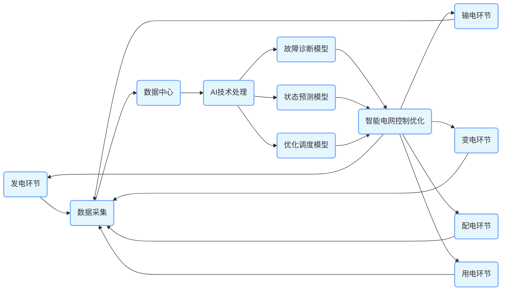

# AI在智能电网故障诊断中的应用与挑战

> 关键词：人工智能、智能电网、故障诊断、机器学习、深度学习、应用、挑战

> 摘要：本文聚焦于AI在智能电网故障诊断中的应用与挑战。首先介绍了智能电网故障诊断的背景和意义，阐述了相关核心概念及联系，包括智能电网和AI技术的原理与架构。接着详细讲解了核心算法原理，用Python代码进行了示例，同时给出了数学模型和公式并举例说明。通过项目实战展示了代码的实际案例及详细解释。探讨了AI在智能电网故障诊断中的实际应用场景，推荐了相关的工具和资源。最后总结了未来发展趋势与挑战，解答了常见问题，并提供了扩展阅读和参考资料，旨在全面深入地探讨AI在智能电网故障诊断领域的相关内容。

## 1. 背景介绍 
### 1.1 目的和范围
随着电力系统的不断发展和智能化升级，智能电网已经成为未来电力系统的发展方向。智能电网具有高度的自动化、信息化和互动化等特点，能够实现电力的高效传输、分配和使用。然而，智能电网的复杂性也使得其故障诊断变得更加困难。传统的故障诊断方法往往依赖于专家经验和简单的阈值判断，难以适应智能电网复杂多变的运行环境。

本文的目的在于探讨AI技术在智能电网故障诊断中的应用，分析其优势和面临的挑战，为智能电网故障诊断技术的发展提供参考。范围涵盖了AI技术的主要类型，如机器学习、深度学习等在智能电网故障诊断中的应用，以及相关的算法原理、实际案例和未来发展趋势等方面。

### 1.2 预期读者
本文预期读者包括电力系统领域的工程师、科研人员，对AI技术在工业领域应用感兴趣的技术爱好者，以及相关专业的高校师生等。对于电力系统工程师和科研人员，本文可以提供新的技术思路和解决方案；对于技术爱好者，可以帮助他们了解AI在智能电网故障诊断中的具体应用；对于高校师生，可作为教学和研究的参考资料。

### 1.3 文档结构概述
本文首先介绍背景信息，包括目的、预期读者和文档结构概述等内容。接着阐述核心概念与联系，介绍智能电网和AI技术的相关原理和架构。然后详细讲解核心算法原理及具体操作步骤，给出数学模型和公式并举例说明。通过项目实战展示代码实际案例和详细解释。探讨实际应用场景，推荐相关工具和资源。最后总结未来发展趋势与挑战，解答常见问题，并提供扩展阅读和参考资料。

### 1.4 术语表
#### 1.4.1 核心术语定义
- **智能电网**：将先进的传感测量技术、通信技术、信息技术、计算机技术和控制技术与物理电网高度集成而形成的新型电网。它能够实现电力系统的智能化运行、管理和控制，提高电网的安全性、可靠性和经济性。
- **故障诊断**：通过对系统运行状态的监测和分析，判断系统是否发生故障，并确定故障的类型、位置和原因的过程。
- **人工智能（AI）**：研究、开发用于模拟、延伸和扩展人的智能的理论、方法、技术及应用系统的一门新的技术科学。在本文中主要涉及机器学习、深度学习等技术在智能电网故障诊断中的应用。
- **机器学习**：一门多领域交叉学科，涉及概率论、统计学、逼近论、凸分析、算法复杂度理论等多门学科。它专门研究计算机怎样模拟或实现人类的学习行为，以获取新的知识或技能，重新组织已有的知识结构使之不断改善自身的性能。
- **深度学习**：机器学习的一个分支领域，它是一种基于对数据进行表征学习的方法。深度学习通过构建具有很多层的神经网络模型，自动从大量数据中学习特征和模式。

#### 1.4.2 相关概念解释
- **数据驱动**：指的是利用大量的数据来驱动决策和模型的构建。在智能电网故障诊断中，通过收集和分析电网运行的历史数据和实时数据，利用AI技术建立故障诊断模型。
- **特征提取**：从原始数据中提取出能够反映数据本质特征的信息。在智能电网故障诊断中，需要从电网的各种监测数据中提取出与故障相关的特征，以便输入到故障诊断模型中。
- **模型训练**：使用训练数据对AI模型进行参数调整，使得模型能够学习到数据中的规律和模式。在智能电网故障诊断中，通过对历史故障数据的训练，使模型能够准确地识别故障类型和位置。

#### 1.4.3 缩略词列表
- **ANN**：Artificial Neural Network，人工神经网络
- **SVM**：Support Vector Machine，支持向量机
- **CNN**：Convolutional Neural Network，卷积神经网络
- **RNN**：Recurrent Neural Network，循环神经网络
- **LSTM**：Long Short - Term Memory，长短期记忆网络

## 2. 核心概念与联系 
### 智能电网原理与架构
智能电网是一个复杂的系统，其架构主要包括发电、输电、变电、配电和用电等环节。在发电环节，智能电网可以实现对多种能源的优化调度，提高能源利用效率；在输电环节，通过智能监测和控制技术，提高输电线路的安全性和可靠性；在变电环节，实现变电站的自动化和智能化管理；在配电环节，实现分布式电源的接入和优化配置；在用电环节，实现用户与电网的互动，提高用户的用电体验。

其原理是通过各种传感器和通信设备，实时采集电网运行的各种数据，如电压、电流、功率等，然后将这些数据传输到数据中心进行处理和分析。根据分析结果，对电网进行实时的控制和优化，以确保电网的安全、稳定和高效运行。

### AI技术原理与架构
AI技术主要包括机器学习和深度学习等。机器学习通过构建模型，从数据中学习规律和模式，然后利用这些模型进行预测和决策。常见的机器学习算法包括决策树、支持向量机、神经网络等。

深度学习是机器学习的一个分支，它通过构建深度神经网络模型，自动从大量数据中学习特征和模式。深度神经网络通常由输入层、隐藏层和输出层组成，隐藏层可以有多个。通过不断调整神经网络的参数，使得模型能够准确地对输入数据进行分类和预测。

### 智能电网与AI的联系
智能电网产生的大量运行数据为AI技术的应用提供了丰富的数据源。AI技术可以对这些数据进行分析和处理，挖掘数据中的潜在信息，从而实现智能电网的故障诊断、状态预测和优化调度等功能。同时，智能电网的复杂运行环境也对AI技术提出了更高的要求，促进了AI技术的不断发展和创新。

### 文本示意图
智能电网由发电、输电、变电、配电、用电等环节组成，各环节通过传感器和通信设备采集数据并传输到数据中心。AI技术对数据中心的数据进行处理和分析，利用机器学习和深度学习算法构建故障诊断模型等，模型的结果反馈到智能电网的控制和优化中，形成一个闭环系统。

### Mermaid流程图


## 3. 核心算法原理 & 具体操作步骤 
### 机器学习算法 - 支持向量机（SVM）
#### 原理
支持向量机是一种二分类模型，其基本思想是在特征空间中找到一个最优的超平面，使得不同类别的样本能够被最大程度地分开。对于线性可分的数据，SVM通过求解一个凸二次规划问题来找到最优超平面。对于线性不可分的数据，SVM通过引入核函数将数据映射到高维空间，使得数据在高维空间中线性可分。

#### Python代码实现
```python
import numpy as np
from sklearn import datasets
from sklearn.model_selection import train_test_split
from sklearn.svm import SVC
from sklearn.metrics import accuracy_score

# 加载数据集
iris = datasets.load_iris()
X = iris.data[:, :2]  # 只取前两个特征
y = iris.target

# 划分训练集和测试集
X_train, X_test, y_train, y_test = train_test_split(X, y, test_size=0.3, random_state=42)

# 创建SVM模型
svm_model = SVC(kernel='linear')

# 训练模型
svm_model.fit(X_train, y_train)

# 预测
y_pred = svm_model.predict(X_test)

# 计算准确率
accuracy = accuracy_score(y_test, y_pred)
print(f"Accuracy: {accuracy}")
```
#### 具体操作步骤
1. **数据准备**：收集和整理智能电网的故障数据，将其分为特征和标签两部分。特征可以是电压、电流、功率等运行参数，标签可以是故障类型。
2. **数据预处理**：对数据进行清洗、归一化等处理，以提高模型的性能。
3. **模型选择**：根据数据的特点和问题的需求，选择合适的SVM核函数，如线性核、多项式核、径向基核等。
4. **模型训练**：使用训练数据对SVM模型进行训练，调整模型的参数。
5. **模型评估**：使用测试数据对训练好的模型进行评估，计算模型的准确率、召回率等指标。
6. **模型应用**：将训练好的模型应用到实际的智能电网故障诊断中。

### 深度学习算法 - 卷积神经网络（CNN）
#### 原理
卷积神经网络是一种专门用于处理具有网格结构数据的深度学习模型，如图像、时间序列等。CNN通过卷积层、池化层和全连接层等组成部分，自动提取数据的特征。卷积层通过卷积核在输入数据上滑动，提取局部特征；池化层对卷积层的输出进行下采样，减少数据的维度；全连接层将提取的特征映射到输出类别。

#### Python代码实现
```python
import tensorflow as tf
from tensorflow.keras import layers, models
from tensorflow.keras.datasets import mnist
from tensorflow.keras.utils import to_categorical

# 加载数据集
(train_images, train_labels), (test_images, test_labels) = mnist.load_data()

# 数据预处理
train_images = train_images.reshape((60000, 28, 28, 1)).astype('float32') / 255
test_images = test_images.reshape((10000, 28, 28, 1)).astype('float32') / 255
train_labels = to_categorical(train_labels)
test_labels = to_categorical(test_labels)

# 构建CNN模型
model = models.Sequential()
model.add(layers.Conv2D(32, (3, 3), activation='relu', input_shape=(28, 28, 1)))
model.add(layers.MaxPooling2D((2, 2)))
model.add(layers.Conv2D(64, (3, 3), activation='relu'))
model.add(layers.MaxPooling2D((2, 2)))
model.add(layers.Flatten())
model.add(layers.Dense(64, activation='relu'))
model.add(layers.Dense(10, activation='softmax'))

# 编译模型
model.compile(optimizer='adam',
              loss='categorical_crossentropy',
              metrics=['accuracy'])

# 训练模型
model.fit(train_images, train_labels, epochs=5, batch_size=64)

# 评估模型
test_loss, test_acc = model.evaluate(test_images, test_labels)
print(f"Test accuracy: {test_acc}")
```
#### 具体操作步骤
1. **数据准备**：收集智能电网的故障数据，将其转换为适合CNN输入的格式，如二维矩阵或三维张量。
2. **数据预处理**：对数据进行归一化、增强等处理，以提高模型的泛化能力。
3. **模型构建**：根据问题的需求，构建CNN模型的结构，包括卷积层、池化层和全连接层的数量和参数。
4. **模型编译**：选择合适的优化器、损失函数和评估指标，对模型进行编译。
5. **模型训练**：使用训练数据对CNN模型进行训练，调整模型的参数。
6. **模型评估**：使用测试数据对训练好的模型进行评估，计算模型的准确率、召回率等指标。
7. **模型应用**：将训练好的模型应用到实际的智能电网故障诊断中。

## 4. 数学模型和公式 & 详细讲解 & 举例说明 
### 支持向量机（SVM）数学模型
#### 线性可分情况
对于线性可分的数据集 $\{(x_1, y_1), (x_2, y_2), \cdots, (x_n, y_n)\}$，其中 $x_i \in \mathbb{R}^d$ 是特征向量，$y_i \in \{-1, +1\}$ 是标签。SVM的目标是找到一个超平面 $w^T x + b = 0$，使得不同类别的样本能够被最大程度地分开。

定义间隔为：
$$\gamma = \frac{2}{\|w\|}$$
SVM的优化问题可以表示为：
$$\min_{w, b} \frac{1}{2}\|w\|^2$$
$$\text{s.t. } y_i(w^T x_i + b) \geq 1, i = 1, 2, \cdots, n$$

#### 线性不可分情况
对于线性不可分的数据集，引入松弛变量 $\xi_i \geq 0$，优化问题变为：
$$\min_{w, b, \xi} \frac{1}{2}\|w\|^2 + C \sum_{i=1}^{n} \xi_i$$
$$\text{s.t. } y_i(w^T x_i + b) \geq 1 - \xi_i, \xi_i \geq 0, i = 1, 2, \cdots, n$$
其中 $C$ 是惩罚参数，用于平衡间隔和误分类的样本数量。

#### 核函数
为了处理非线性可分的数据，引入核函数 $K(x_i, x_j) = \phi(x_i)^T \phi(x_j)$，其中 $\phi(x)$ 是将输入数据 $x$ 映射到高维空间的函数。常见的核函数包括线性核 $K(x_i, x_j) = x_i^T x_j$、多项式核 $K(x_i, x_j) = (x_i^T x_j + r)^d$ 和径向基核 $K(x_i, x_j) = \exp(-\gamma \|x_i - x_j\|^2)$。

### 举例说明
假设有一个二维数据集，包含两类样本，分别用蓝色和红色表示。我们可以使用SVM来找到一个最优的超平面将这两类样本分开。

```python
import numpy as np
import matplotlib.pyplot as plt
from sklearn import svm

# 生成数据集
np.random.seed(0)
X = np.r_[np.random.randn(20, 2) - [2, 2], np.random.randn(20, 2) + [2, 2]]
Y = [0] * 20 + [1] * 20

# 创建SVM模型
clf = svm.SVC(kernel='linear')
clf.fit(X, Y)

# 绘制决策边界
plt.scatter(X[:, 0], X[:, 1], c=Y, cmap=plt.cm.Paired)
ax = plt.gca()
xlim = ax.get_xlim()
ylim = ax.get_ylim()

# 创建网格点
xx = np.linspace(xlim[0], xlim[1], 30)
yy = np.linspace(ylim[0], ylim[1], 30)
YY, XX = np.meshgrid(yy, xx)
xy = np.vstack([XX.ravel(), YY.ravel()]).T
Z = clf.decision_function(xy).reshape(XX.shape)

# 绘制决策边界和间隔边界
ax.contour(XX, YY, Z, colors='k', levels=[-1, 0, 1], alpha=0.5, linestyles=['--', '-', '--'])
plt.show()
```

### 卷积神经网络（CNN）数学模型
#### 卷积层
卷积层的输出 $y_{i,j}^l$ 可以表示为：
$$y_{i,j}^l = \sum_{m=0}^{M - 1} \sum_{n=0}^{N - 1} w_{m,n}^l x_{i + m, j + n}^{l - 1} + b^l$$
其中 $x^{l - 1}$ 是输入特征图，$w^l$ 是卷积核，$b^l$ 是偏置，$M$ 和 $N$ 是卷积核的大小。

#### 池化层
常见的池化操作是最大池化，其输出 $y_{i,j}^l$ 可以表示为：
$$y_{i,j}^l = \max_{m=0}^{M - 1} \max_{n=0}^{N - 1} x_{s \cdot i + m, s \cdot j + n}^{l - 1}$$
其中 $s