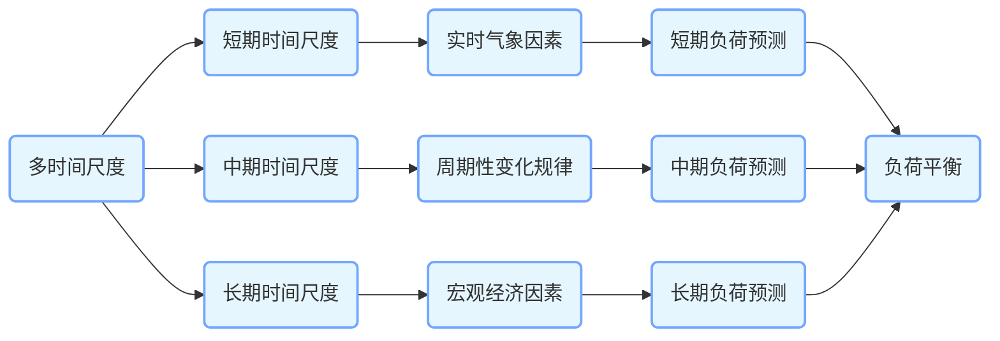

# AI在智能电网负荷预测与平衡中的多时间尺度应用

> 关键词：人工智能、智能电网、负荷预测、负荷平衡、多时间尺度

> 摘要：本文聚焦于AI在智能电网负荷预测与平衡中的多时间尺度应用。首先介绍了智能电网负荷预测与平衡的背景知识，包括目的、范围、预期读者等。详细阐述了核心概念，如多时间尺度的含义及与负荷预测和平衡的联系，并给出了相应的文本示意图和Mermaid流程图。深入讲解了核心算法原理，结合Python源代码进行说明。探讨了相关的数学模型和公式，并举例说明其应用。通过项目实战，展示了代码的实际案例和详细解释。分析了AI在不同实际应用场景中的作用。推荐了学习资源、开发工具框架以及相关论文著作。最后总结了未来发展趋势与挑战，还提供了常见问题与解答以及扩展阅读和参考资料，旨在全面深入地探讨AI在智能电网多时间尺度下的负荷预测与平衡应用。

## 1. 背景介绍 
### 1.1 目的和范围
智能电网作为未来电力系统的发展方向，其高效稳定运行离不开准确的负荷预测与有效的负荷平衡。传统的负荷预测方法在处理复杂多变的电力负荷数据时存在一定的局限性，而人工智能技术的发展为解决这一问题提供了新的思路和方法。本文的目的在于深入探讨AI在智能电网负荷预测与平衡中的多时间尺度应用，分析不同时间尺度下AI技术的优势和适用场景，为智能电网的优化运行提供理论支持和实践指导。

本文的范围涵盖了从短期（如分钟级、小时级）到中期（如日级、周级）再到长期（如月级、年级）等多个时间尺度的负荷预测与平衡问题。同时，涉及到多种人工智能算法，如神经网络、支持向量机、决策树等在智能电网中的应用。

### 1.2 预期读者
本文的预期读者包括电力系统工程师、研究人员、智能电网相关领域的从业者以及对人工智能在能源领域应用感兴趣的技术爱好者。对于电力系统工程师和从业者，本文可以为他们在实际工作中的负荷预测与平衡决策提供参考；对于研究人员，本文可以启发他们在相关领域的进一步研究；对于技术爱好者，本文可以帮助他们了解人工智能在智能电网中的具体应用场景和技术原理。

### 1.3 文档结构概述
本文将按照以下结构进行组织：首先介绍背景知识，包括目的、范围、预期读者等；接着阐述核心概念，包括多时间尺度、负荷预测与平衡的定义以及它们之间的联系，并给出相应的文本示意图和Mermaid流程图；然后详细讲解核心算法原理，结合Python源代码进行说明；再探讨相关的数学模型和公式，并举例说明其应用；通过项目实战，展示代码的实际案例和详细解释；分析AI在不同实际应用场景中的作用；推荐学习资源、开发工具框架以及相关论文著作；最后总结未来发展趋势与挑战，提供常见问题与解答以及扩展阅读和参考资料。

### 1.4 术语表
#### 1.4.1 核心术语定义
- **智能电网**：将先进的传感测量技术、通信技术、信息技术、计算机技术和控制技术与物理电网高度集成而形成的新型电网。它具有高度的自动化、智能化和互动性，能够实现电力系统的高效、可靠、安全运行。
- **负荷预测**：根据电力系统的运行特性、历史数据以及相关的影响因素，对未来某一时刻或某一时间段内的电力负荷进行预先估计和推测的过程。
- **负荷平衡**：在电力系统中，通过调整发电功率和用电负荷，使发电功率与用电负荷在任何时刻都保持基本相等，以保证电力系统的稳定运行和电能质量。
- **多时间尺度**：指在不同的时间维度上对电力负荷进行分析和处理，包括短期（如分钟级、小时级）、中期（如日级、周级）和长期（如月级、年级）等不同的时间尺度。

#### 1.4.2 相关概念解释
- **人工智能（AI）**：是一门研究如何使计算机能够模拟人类智能的学科，包括机器学习、深度学习、自然语言处理等多个领域。在智能电网中，AI技术可以用于负荷预测、故障诊断、优化调度等多个方面。
- **机器学习**：是人工智能的一个重要分支，它通过让计算机从数据中自动学习模式和规律，从而实现对未知数据的预测和分类。常见的机器学习算法包括神经网络、支持向量机、决策树等。
- **深度学习**：是机器学习的一个子集，它基于深度神经网络模型，通过多层神经元的非线性变换，自动学习数据的特征和模式。深度学习在图像识别、语音识别、自然语言处理等领域取得了显著的成果，在智能电网负荷预测中也具有很大的应用潜力。

#### 1.4.3 缩略词列表
- **AI**：Artificial Intelligence（人工智能）
- **ML**：Machine Learning（机器学习）
- **DL**：Deep Learning（深度学习）
- **ANN**：Artificial Neural Network（人工神经网络）
- **SVM**：Support Vector Machine（支持向量机）

## 2. 核心概念与联系 

### 2.1 多时间尺度的含义
多时间尺度在智能电网负荷预测与平衡中具有重要意义。不同的时间尺度反映了电力负荷的不同变化特性和影响因素。

- **短期时间尺度（分钟级 - 小时级）**：在这个时间尺度下，电力负荷的变化通常受到实时的气象条件（如温度、湿度、光照等）、突发事件（如大型设备的启动或停止）以及用户的即时用电行为等因素的影响。短期负荷预测对于电力系统的实时调度和频率控制至关重要，能够帮助电网运营商及时调整发电功率，以应对负荷的快速变化。
- **中期时间尺度（日级 - 周级）**：中期负荷预测主要考虑的是电力负荷的周期性变化规律，如工作日和休息日的负荷差异、季节性变化等。这个时间尺度的预测结果可以用于发电计划的制定、电网设备的检修安排等。
- **长期时间尺度（月级 - 年级）**：长期负荷预测则侧重于分析电力负荷的长期发展趋势，受到经济发展水平、人口增长、产业结构调整等宏观因素的影响。长期负荷预测对于电网的规划和建设具有重要的指导意义，能够帮助电网企业合理安排投资，扩建和升级电网设施。

### 2.2 负荷预测与平衡的关系
负荷预测是实现负荷平衡的基础。准确的负荷预测可以为电网运营商提供未来电力负荷的信息，从而提前制定发电计划和调度策略，合理安排发电资源，使发电功率与用电负荷相匹配，实现负荷平衡。

同时，负荷平衡的结果也会影响负荷预测的准确性。当电网在运行过程中出现负荷不平衡的情况时，如发电功率不足或过剩，会导致电网频率和电压的波动，进而影响用户的用电设备和电力系统的安全稳定运行。这些异常情况会改变电力负荷的实际变化规律，使得基于历史数据的负荷预测模型的准确性受到影响。因此，在进行负荷预测时，需要考虑负荷平衡措施对负荷变化的影响。

### 2.3 核心概念的文本示意图
```plaintext
            多时间尺度
         ┌─────────────┼─────────────┐
         │             │             │
    短期时间尺度    中期时间尺度    长期时间尺度
         │             │             │
         ├─────────────┼─────────────┤
         │             │             │
  实时气象因素  周期性变化规律  宏观经济因素
         │             │             │
         ├─────────────┼─────────────┤
         │             │             │
  短期负荷预测  中期负荷预测  长期负荷预测
         │             │             │
         └─────────────┼─────────────┘
                       │
                 负荷平衡
```

### 2.4 Mermaid流程图


## 3. 核心算法原理 & 具体操作步骤 

### 3.1 人工神经网络（ANN）原理
人工神经网络是一种模仿人类神经系统的计算模型，由大量的神经元组成，这些神经元通过连接形成一个复杂的网络结构。在负荷预测中，常用的人工神经网络类型包括多层感知机（MLP）。

多层感知机由输入层、隐藏层和输出层组成。输入层接收输入数据，如历史负荷数据、气象数据等；隐藏层对输入数据进行非线性变换，提取数据的特征；输出层输出预测结果。

#### 3.1.1 前向传播
前向传播是指输入数据从输入层经过隐藏层传递到输出层的过程。假设输入层有 $n$ 个神经元，隐藏层有 $m$ 个神经元，输出层有 $k$ 个神经元。输入向量 $\mathbf{x} = [x_1, x_2, \cdots, x_n]^T$，隐藏层第 $j$ 个神经元的输入为：

$$z_j = \sum_{i=1}^{n} w_{ij}x_i + b_j$$

其中 $w_{ij}$ 是输入层第 $i$ 个神经元到隐藏层第 $j$ 个神经元的权重，$b_j$ 是隐藏层第 $j$ 个神经元的偏置。

隐藏层第 $j$ 个神经元的输出为：

$$h_j = f(z_j)$$

其中 $f$ 是激活函数，常用的激活函数有 sigmoid 函数、ReLU 函数等。

输出层第 $l$ 个神经元的输入为：

$$o_l = \sum_{j=1}^{m} v_{jl}h_j + c_l$$

其中 $v_{jl}$ 是隐藏层第 $j$ 个神经元到输出层第 $l$ 个神经元的权重，$c_l$ 是输出层第 $l$ 个神经元的偏置。

输出层第 $l$ 个神经元的输出为：

$$y_l = g(o_l)$$

其中 $g$ 是输出层的激活函数，根据具体的问题可以选择不同的激活函数。

#### 3.1.2 反向传播
反向传播是一种用于训练人工神经网络的算法，其目的是通过调整网络的权重和偏置，使得网络的输出与期望输出之间的误差最小。常用的误差函数是均方误差（MSE）：

$$E = \frac{1}{2} \sum_{l=1}^{k} (y_l - t_l)^2$$

其中 $y_l$ 是网络的输出，$t_l$ 是期望输出。

反向传播算法通过链式法则计算误差函数对每个权重和偏置的梯度，并根据梯度下降法更新权重和偏置。

### 3.1.3 Python 代码实现
```python
import numpy as np

# 定义激活函数
def sigmoid(x):
    return 1 / (1 + np.exp(-x))

def sigmoid_derivative(x):
    return x * (1 - x)

# 定义多层感知机类
class MLP:
    def __init__(self, input_size, hidden_size, output_size):
        # 初始化权重和偏置
        self.weights_input_hidden = np.random.rand(input_size, hidden_size)
        self.bias_hidden = np.zeros((1, hidden_size))
        self.weights_hidden_output = np.random.rand(hidden_size, output_size)
        self.bias_output = np.zeros((1, output_size))

    def forward(self, X):
        # 前向传播
        self.input = X
        self.hidden_input = np.dot(self.input, self.weights_input_hidden) + self.bias_hidden
        self.hidden_output = sigmoid(self.hidden_input)
        self.output_input = np.dot(self.hidden_output, self.weights_hidden_output) + self.bias_output
        self.output = sigmoid(self.output_input)
        return self.output

    def backward(self, y):
        # 反向传播
        error = y - self.output
        d_output = error * sigmoid_derivative(self.output)
        error_hidden = np.dot(d_output, self.weights_hidden_output.T)
        d_hidden = error_hidden * sigmoid_derivative(self.hidden_output)

        # 更新权重和偏置
        self.weights_hidden_output += np.dot(self.hidden_output.T, d_output)
        self.bias_output += np.sum(d_output, axis=0, keepdims=True)
        self.weights_input_hidden += np.dot(self.input.T, d_hidden)
        self.bias_hidden += np.sum(d_hidden, axis=0, keepdims=True)

    def train(self, X, y, epochs):
        for epoch in range(epochs):
            output = self.forward(X)
            self.backward(y)
```

### 3.2 支持向量机（SVM）原理
支持向量机是一种基于统计学习理论的机器学习算法，用于分类和回归问题。在负荷预测中，主要使用支持向量回归（SVR）。

支持向量回归的目标是找到一个超平面，使得所有训练数据点到该超平面的距离小于一个给定的误差范围 $\epsilon$，同时使得超平面的间隔最大。

#### 3.2.1 线性支持向量回归
对于线性可分的情况，线性支持向量回归的目标函数可以表示为：

$$\min_{\mathbf{w}, b, \xi, \xi^*} \frac{1}{2} \mathbf{w}^T \mathbf{w} + C \sum_{i=1}^{n} (\xi_i + \xi_i^*)$$

约束条件为：

$$y_i - (\mathbf{w}^T \mathbf{x}_i + b) \leq \epsilon + \xi_i$$

$$(\mathbf{w}^T \mathbf{x}_i + b) - y_i \leq \epsilon + \xi_i^*$$

$$\xi_i, \xi_i^* \geq 0$$

其中 $\mathbf{w}$ 是超平面的法向量，$b$ 是偏置，$\xi_i$ 和 $\xi_i^*$ 是松弛变量，$C$ 是惩罚因子。

#### 3.2.2 核技巧
对于非线性问题，可以使用核技巧将输入数据映射到高维特征空间，使得在高维空间中数据变得线性可分。常用的核函数有径向基函数（RBF）：

$$K(\mathbf{x}_i, \mathbf{x}_j) = \exp(-\gamma \|\mathbf{x}_i - \mathbf{x}_j\|^2)$$

其中 $\gamma$ 是核函数的参数。

#### 3.2.3 Python 代码实现
```python
from sklearn.svm import SVR
import numpy as np

# 生成示例数据
X = np.sort(5 * np.random.rand(80, 1), axis=0)
y = np.sin(X).ravel()

# 创建 SVR 模型
svr_rbf = SVR(kernel='rbf', C=100, gamma=0.1)

# 训练模型
svr_rbf.fit(X, y)

# 进行预测
X_test = np.sort(5 * np.random.rand(20, 1), axis=0)
y_pred = svr_rbf.predict(X_test)
```

## 4. 数学模型和公式 & 详细讲解 & 举例说明 

### 4.1 时间序列模型
时间序列模型是负荷预测中常用的数学模型之一，它假设电力负荷数据是一个随时间变化的序列，并且这个序列具有一定的规律性。常见的时间序列模型包括自回归积分滑动平均模型（ARIMA）。

#### 4.1.1 ARIMA 模型的基本形式
ARIMA 模型的一般形式为 $ARIMA(p, d, q)$，其中 $p$ 是自回归阶数，$d$ 是差分阶数，$q$ 是滑动平均阶数。

自回归部分（AR）表示当前时刻的负荷值与过去 $p$ 个时刻的负荷值之间的线性关系：

$$y_t = c + \sum_{i=1}^{p} \phi_i y_{t - i} + \epsilon_t$$

其中 $y_t$ 是当前时刻的负荷值，$c$ 是常数，$\phi_i$ 是自回归系数，$\epsilon_t$ 是白噪声。

差分部分（I）用于处理非平稳时间序列，通过对原始序列进行 $d$ 阶差分，使其变为平稳序列。

滑动平均部分（MA）表示当前时刻的负荷值与过去 $q$ 个时刻的白噪声之间的线性关系：

$$y_t = \mu + \epsilon_t + \sum_{j=1}^{q} \theta_j \epsilon_{t - j}$$

其中 $\mu$ 是均值，$\theta_j$ 是滑动平均系数。

#### 4.1.2 ARIMA 模型的参数估计
ARIMA 模型的参数 $p$、$d$、$q$ 可以通过自相关函数（ACF）和偏自相关函数（PACF）来确定。例如，当自相关函数呈现拖尾，偏自相关函数在 $p$ 阶后截尾时，可以选择 $p$ 作为自回归阶数；当自相关函数在 $q$ 阶后截尾，偏自相关函数呈现拖尾时，可以选择 $q$ 作为滑动平均阶数。

差分阶数 $d$ 可以通过单位根检验来确定，常用的单位根检验方法有 Augmented Dickey - Fuller（ADF）检验。

#### 4.1.3 举例说明
假设我们有一组日负荷数据 $y = [y_1, y_2, \cdots, y_n]$，我们可以使用 Python 中的 `statsmodels` 库来拟合 ARIMA 模型并进行预测。

```python
import pandas as pd
from statsmodels.tsa.arima.model import ARIMA

# 生成示例数据
data = pd.Series([10, 12, 15, 13, 16, 18, 20, 19, 22, 25])

# 拟合 ARIMA 模型
model = ARIMA(data, order=(1, 0, 1))
model_fit = model.fit()

# 进行预测
forecast = model_fit.forecast(steps=3)
print(forecast)
```

### 4.2 机器学习模型的损失函数
在机器学习模型中，损失函数用于衡量模型预测结果与真实值之间的差异。不同的机器学习模型使用不同的损失函数。

#### 4.2.1 均方误差（MSE）
均方误差是最常用的损失函数之一，用于回归问题。其定义为：

$$MSE = \frac{1}{n} \sum_{i=1}^{n} (y_i - \hat{y}_i)^2$$

其中 $y_i$ 是真实值，$\hat{y}_i$ 是预测值，$n$ 是样本数量。

#### 4.2.2 交叉熵损失
交叉熵损失常用于分类问题，其定义为：

$$H(p, q) = - \sum_{i=1}^{n} p_i \log(q_i)$$

其中 $p$ 是真实概率分布，$q$ 是预测概率分布。

#### 4.2.3 举例说明
在使用神经网络进行负荷预测时，我们可以使用均方误差作为损失函数。以下是一个简单的示例：

```python
import numpy as np

# 真实值
y_true = np.array([10, 12, 15])
# 预测值
y_pred = np.array([9, 13, 14])

# 计算均方误差
mse = np.mean((y_true - y_pred) ** 2)
print("均方误差:", mse)
```

## 5. 项目实战：代码实际案例和详细解释说明 

### 5.1  开发环境搭建
#### 5.1.1 安装 Python
首先需要安装 Python 环境，建议使用 Python 3.7 及以上版本。可以从 Python 官方网站（https://www.python.org/downloads/）下载并安装。

#### 5.1.2 安装必要的库
在项目中，我们需要使用一些常用的 Python 库，如 `numpy`、`pandas`、`scikit-learn`、`tensorflow` 等。可以使用以下命令进行安装：

```sh
pip install numpy pandas scikit-learn tensorflow
```

### 5.2  源代码详细实现和代码解读
#### 5.2.1 数据加载和预处理
```python
import pandas as pd
from sklearn.preprocessing import MinMaxScaler

# 加载数据
data = pd.read_csv('load_data.csv')

# 提取特征和目标变量
X = data.drop('load', axis=1).values
y = data['load'].values

# 数据归一化
scaler_X = MinMaxScaler()
scaler_y = MinMaxScaler()
X_scaled = scaler_X.fit_transform(X)
y_scaled = scaler_y.fit_transform(y.reshape(-1, 1)).flatten()
```

**代码解读**：
- `pd.read_csv('load_data.csv')`：使用 `pandas` 库读取 CSV 格式的负荷数据文件。
- `data.drop('load', axis=1).values`：提取除负荷列之外的特征变量。
- `data['load'].values`：提取负荷列作为目标变量。
- `MinMaxScaler()`：使用 `scikit-learn` 库的 `MinMaxScaler` 类对特征和目标变量进行归一化处理，将数据缩放到 [0, 1] 范围内。

#### 5.2.2 构建和训练神经网络模型
```python
import tensorflow as tf
from tensorflow.keras.models import Sequential
from tensorflow.keras.layers import Dense

# 构建神经网络模型
model = Sequential([
    Dense(64, activation='relu', input_shape=(X_scaled.shape[1],)),
    Dense(32, activation='relu'),
    Dense(1)
])

# 编译模型
model.compile(optimizer='adam', loss='mse')

# 训练模型
model.fit(X_scaled, y_scaled, epochs=100, batch_size=32)
```

**代码解读**：
- `Sequential()`：使用 `tensorflow.keras` 库的 `Sequential` 类构建一个顺序模型。
- `Dense(64, activation='relu', input_shape=(X_scaled.shape[1],))`：添加一个包含 64 个神经元的全连接层，使用 ReLU 激活函数，并指定输入形状。
- `model.compile(optimizer='adam', loss='mse')`：编译模型，使用 Adam 优化器和均方误差损失函数。
- `model.fit(X_scaled, y_scaled, epochs=100, batch_size=32)`：训练模型，设置训练轮数为 100，批次大小为 32。

#### 5.2.3 模型预测和反归一化
```python
# 进行预测
y_pred_scaled = model.predict(X_scaled)

# 反归一化
y_pred = scaler_y.inverse_transform(y_pred_scaled).flatten()
```

**代码解读**：
- `model.predict(X_scaled)`：使用训练好的模型对归一化后的特征数据进行预测。
- `scaler_y.inverse_transform(y_pred_scaled).flatten()`：将预测结果进行反归一化处理，得到原始尺度的预测值。

### 5.3  代码解读与分析
通过上述代码，我们完成了一个简单的智能电网负荷预测项目。首先，我们对原始数据进行了加载和预处理，包括特征提取和数据归一化，这有助于提高模型的训练效果。然后，我们构建了一个简单的神经网络模型，并使用 Adam 优化器和均方误差损失函数进行训练。最后，我们使用训练好的模型进行预测，并将预测结果进行反归一化处理。

在实际应用中，我们可以根据具体情况调整模型的结构和参数，如增加隐藏层的数量、调整神经元的数量、改变优化器和损失函数等，以提高模型的预测准确性。同时，我们还可以使用交叉验证、网格搜索等方法来选择最优的模型参数。

## 6. 实际应用场景 
### 6.1 短期负荷预测在实时调度中的应用
在短期时间尺度（分钟级 - 小时级）下，准确的负荷预测对于电力系统的实时调度至关重要。电网运营商可以根据短期负荷预测结果，及时调整发电功率，以应对负荷的快速变化。例如，当预测到某一时刻的负荷将大幅增加时，电网运营商可以提前启动备用发电机组，增加发电功率；当预测到负荷将下降时，可以减少发电功率，避免发电过剩。

同时，短期负荷预测还可以用于电力市场的实时交易。电力供应商可以根据短期负荷预测结果，合理制定电价策略，提高市场竞争力。

### 6.2 中期负荷预测在发电计划制定中的应用
中期负荷预测（日级 - 周级）主要考虑电力负荷的周期性变化规律，其预测结果可以用于发电计划的制定。电网企业可以根据中期负荷预测结果，合理安排发电机组的启停和检修计划，提高发电效率和设备利用率。例如，在工作日和休息日的负荷差异较大的情况下，电网企业可以根据预测结果调整发电功率，避免不必要的能源浪费。

此外，中期负荷预测还可以为电网的安全运行提供保障。通过预测未来一段时间内的负荷变化趋势，电网企业可以提前采取措施，如调整电网的运行方式、加强设备的监测和维护等，以应对可能出现的负荷高峰和故障情况。

### 6.3 长期负荷预测在电网规划中的应用
长期负荷预测（月级 - 年级）侧重于分析电力负荷的长期发展趋势，对于电网的规划和建设具有重要的指导意义。电网企业可以根据长期负荷预测结果，合理安排投资，扩建和升级电网设施，以满足未来电力需求的增长。例如，当预测到某一地区的电力负荷将在未来几年内大幅增长时，电网企业可以提前规划建设新的变电站和输电线路，提高电网的供电能力。

同时，长期负荷预测还可以为能源政策的制定提供参考。政府部门可以根据长期负荷预测结果，制定合理的能源发展战略，促进能源的可持续发展。

## 7. 工具和资源推荐
### 7.1 学习资源推荐
#### 7.1.1 书籍推荐
- 《深度学习》（Deep Learning）：作者 Ian Goodfellow、Yoshua Bengio 和 Aaron Courville，这本书是深度学习领域的经典著作，系统地介绍了深度学习的基本概念、算法和应用。
- 《Python 机器学习》（Python Machine Learning）：作者 Sebastian Raschka，这本书详细介绍了如何使用 Python 进行机器学习，包括数据预处理、模型选择、评估和优化等方面的内容。
- 《智能电网：技术、应用与市场》（Smart Grid: Technology, Applications, and Markets）：作者 Ali Keyhani，这本书全面介绍了智能电网的技术原理、应用场景和市场发展趋势，对于了解智能电网领域非常有帮助。

#### 7.1.2 在线课程
- Coursera 上的“深度学习专项课程”（Deep Learning Specialization）：由 Andrew Ng 教授授课，涵盖了深度学习的多个方面，如神经网络、卷积神经网络、循环神经网络等。
- edX 上的“人工智能基础”（Introduction to Artificial Intelligence）：由麻省理工学院（MIT）的 Patrick H. Winston 教授授课，系统地介绍了人工智能的基本概念、算法和应用。
- 中国大学 MOOC 上的“智能电网技术”：由国内知名高校的教授授课，介绍了智能电网的关键技术和应用案例。

#### 7.1.3 技术博客和网站
- Towards Data Science：这是一个专注于数据科学和机器学习的技术博客，上面有很多关于人工智能在各个领域应用的文章和教程。
- IEEE Spectrum：这是电气和电子工程师协会（IEEE）的官方杂志网站，提供了关于智能电网、人工智能等领域的最新技术动态和研究成果。
- 中国电力新闻网：这是国内电力行业的权威媒体网站，提供了关于智能电网建设、运行和管理的相关信息和报道。

### 7.2 开发工具框架推荐
#### 7.2.1 IDE和编辑器
- PyCharm：这是一款专门为 Python 开发设计的集成开发环境（IDE），具有代码编辑、调试、版本控制等功能，非常适合 Python 项目的开发。
- Jupyter Notebook：这是一个交互式的开发环境，支持 Python、R 等多种编程语言，非常适合进行数据探索、模型开发和可视化。
- Visual Studio Code：这是一款轻量级的代码编辑器，支持多种编程语言和插件扩展，具有丰富的功能和良好的用户体验。

#### 7.2.2 调试和性能分析工具
- TensorBoard：这是 TensorFlow 提供的一个可视化工具，用于监控模型的训练过程、分析模型的性能和可视化数据。
- Py-Spy：这是一个用于 Python 代码性能分析的工具，可以帮助开发者找出代码中的性能瓶颈。
- Memory Profiler：这是一个用于 Python 代码内存分析的工具，可以帮助开发者监控代码的内存使用情况。

#### 7.2.3 相关框架和库
- TensorFlow：这是一个开源的机器学习框架，由 Google 开发，支持深度学习、机器学习等多种算法，具有高效、灵活和可扩展的特点。
- PyTorch：这是一个开源的深度学习框架，由 Facebook 开发，具有动态图、易于使用和高效的特点，在学术界和工业界都得到了广泛的应用。
- Scikit-learn：这是一个开源的机器学习库，提供了丰富的机器学习算法和工具，如分类、回归、聚类等，非常适合初学者和快速开发。

### 7.3 相关论文著作推荐
#### 7.3.1 经典论文
- “Long Short-Term Memory”：作者 Sepp Hochreiter 和 Jürgen Schmidhuber，这篇论文提出了长短期记忆网络（LSTM），是循环神经网络领域的经典论文。
- “Support-Vector Networks”：作者 Corinna Cortes 和 Vladimir Vapnik，这篇论文介绍了支持向量机的基本原理和算法，是机器学习领域的经典论文。
- “A New Look at the Statistical Model Identification”：作者 Hirotugu Akaike，这篇论文提出了赤池信息准则（AIC），用于模型选择和评估。

#### 7.3.2 最新研究成果
- 可以通过 IEEE Xplore、ACM Digital Library 等学术数据库搜索关于 AI 在智能电网负荷预测与平衡中的最新研究成果。这些研究成果通常涵盖了新的算法、模型和应用场景，对于了解该领域的前沿动态非常有帮助。

#### 7.3.3 应用案例分析
- 一些国际知名的电力公司和研究机构会发布关于智能电网负荷预测与平衡的应用案例分析报告。这些报告通常结合实际项目，介绍了 AI 技术在不同场景下的应用效果和经验教训，对于实际项目的实施具有重要的参考价值。

## 8. 总结：未来发展趋势与挑战
### 8.1 未来发展趋势
#### 8.1.1 多模态数据融合
未来，智能电网负荷预测将不仅仅依赖于历史负荷数据和气象数据，还将融合更多的多模态数据，如用户行为数据、社交媒体数据、地理信息数据等。通过融合多模态数据，可以更全面地了解电力负荷的变化规律，提高负荷预测的准确性。

#### 8.1.2 深度学习技术的进一步应用
深度学习技术在智能电网负荷预测中的应用将越来越广泛。随着深度学习模型的不断发展和改进，如卷积神经网络（CNN）、循环神经网络（RNN）及其变体（如 LSTM、GRU）等，将能够更好地处理复杂的时间序列数据和高维数据，提高负荷预测的性能。

#### 8.1.3 智能电网的分布式协同
未来的智能电网将朝着分布式协同的方向发展。各个分布式电源、储能设备和用户终端将通过智能通信技术实现互联互通，形成一个分布式的智能电网系统。在这种情况下，负荷预测和平衡将需要考虑分布式系统的特点和协同机制，实现更高效的能源管理和优化调度。

### 8.2 挑战
#### 8.2.1 数据质量和安全性
智能电网负荷预测需要大量的高质量数据作为支撑。然而，实际应用中数据可能存在缺失、错误、噪声等问题，影响负荷预测的准确性。同时，随着智能电网的数字化和信息化程度不断提高，数据的安全性也面临着严峻的挑战，如数据泄露、网络攻击等。

#### 8.2.2 模型的可解释性
深度学习模型虽然在负荷预测中取得了较好的效果，但它们通常是黑盒模型，缺乏可解释性。在实际应用中，电网运营商需要了解模型的预测结果是如何得出的，以便做出合理的决策。因此，提高模型的可解释性是一个亟待解决的问题。

#### 8.2.3 计算资源和实时性要求
智能电网负荷预测需要处理大量的数据和复杂的模型，对计算资源的要求较高。同时，在实时调度和控制中，负荷预测需要具有较高的实时性，以满足电网快速响应的需求。如何在有限的计算资源下实现高效的负荷预测和实时决策是一个挑战。

## 9. 附录：常见问题与解答
### 9.1 问题 1：为什么要进行多时间尺度的负荷预测？
答：不同的时间尺度反映了电力负荷的不同变化特性和影响因素。短期负荷预测对于实时调度和频率控制至关重要，能够帮助电网运营商及时调整发电功率；中期负荷预测可以用于发电计划的制定和电网设备的检修安排；长期负荷预测则对于电网的规划和建设具有重要的指导意义。因此，进行多时间尺度的负荷预测可以更全面地了解电力负荷的变化规律，为智能电网的优化运行提供更准确的决策依据。

### 9.2 问题 2：如何选择合适的负荷预测算法？
答：选择合适的负荷预测算法需要考虑多个因素，如数据的特点、预测的时间尺度、预测的精度要求等。对于短期负荷预测，由于负荷变化较快，通常可以选择时间序列模型、神经网络模型等；对于中期和长期负荷预测，由于负荷变化相对较慢，可以选择回归模型、支持向量机等。此外，还可以通过交叉验证、网格搜索等方法来选择最优的模型参数。

### 9.3 问题 3：如何提高负荷预测的准确性？
答：提高负荷预测的准确性可以从以下几个方面入手：
- **数据预处理**：对原始数据进行清洗、缺失值处理、异常值处理和归一化等操作，提高数据的质量。
- **特征工程**：提取与负荷变化相关的特征，如气象因素、时间因素、用户行为因素等，增加模型的输入信息。
- **模型选择和优化**：选择合适的负荷预测算法，并通过调整模型的参数、增加模型的复杂度等方法来优化模型的性能。
- **多模型融合**：将多个不同的负荷预测模型进行融合，综合利用各个模型的优势，提高预测的准确性。

### 9.4 问题 4：负荷平衡的主要方法有哪些？
答：负荷平衡的主要方法包括：
- **发电侧调整**：通过调整发电机组的发电功率，使发电功率与用电负荷相匹配。例如，启动或停止备用发电机组、调整发电机组的出力等。
- **需求侧管理**：通过引导用户调整用电行为，改变用电负荷的分布。例如，实施分时电价政策、推广智能家电等。
- **储能系统应用**：利用储能设备在负荷低谷时储存电能，在负荷高峰时释放电能，起到平衡负荷的作用。例如，电池储能、抽水蓄能等。

## 10. 扩展阅读 & 参考资料
### 10.1 扩展阅读
- 《能源互联网：理念、技术与实践》：本书介绍了能源互联网的基本概念、关键技术和应用案例，对于了解智能电网与能源互联网的融合发展具有重要的参考价值。
- 《人工智能与电力系统》：本书探讨了人工智能技术在电力系统中的应用，包括负荷预测、故障诊断、优化调度等方面，为相关领域的研究和实践提供了有益的思路。
- 《大数据驱动的智能电网运行与控制》：本书介绍了大数据技术在智能电网中的应用，包括数据采集、存储、分析和挖掘等方面，对于提高智能电网的运行效率和可靠性具有重要的意义。

### 10.2 参考资料
- IEEE Transactions on Power Systems：这是电气和电子工程师协会（IEEE）关于电力系统领域的顶级学术期刊，发表了大量关于智能电网负荷预测与平衡的研究论文。
- International Journal of Electrical Power & Energy Systems：这是一本专注于电力系统和能源系统领域的国际学术期刊，涵盖了智能电网、可再生能源、电力市场等多个方面的研究内容。
- 国家电网公司、南方电网公司等电力企业发布的相关技术标准和规范，这些标准和规范对于智能电网的建设和运行具有重要的指导作用。

作者：AI天才研究院/AI Genius Institute & 禅与计算机程序设计艺术 /Zen And The Art of Computer Programming