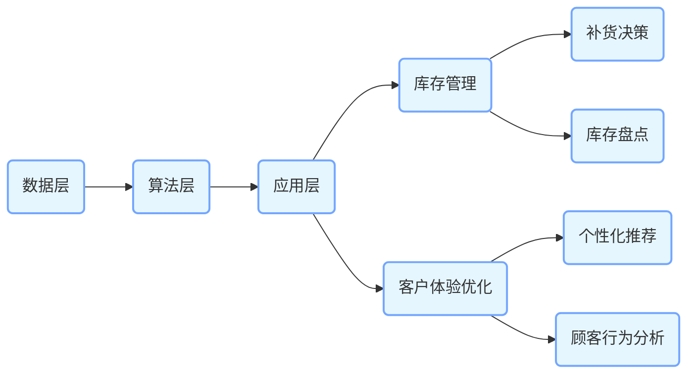

# AI在智能零售中的应用：从库存管理到客户体验

> 关键词：AI、智能零售、库存管理、客户体验、数据分析

> 摘要：本文深入探讨了AI在智能零售领域的广泛应用，从库存管理到客户体验的各个环节。首先介绍了AI在智能零售应用的背景知识，包括目的范围、预期读者等内容。接着阐述了相关核心概念与联系，详细讲解了核心算法原理和具体操作步骤，同时给出了数学模型和公式并举例说明。通过项目实战，展示了AI在智能零售中的代码实现和详细解读。分析了AI在智能零售中的实际应用场景，推荐了相关的工具和资源。最后总结了未来发展趋势与挑战，提供了常见问题解答和扩展阅读参考资料，旨在全面呈现AI在智能零售中的重要作用和发展前景。

## 1. 背景介绍 
### 1.1 目的和范围
随着科技的飞速发展，零售行业正经历着深刻的变革。AI技术的兴起为零售行业带来了前所未有的机遇和挑战。本文的目的在于全面探讨AI在智能零售中的应用，范围涵盖从库存管理到客户体验的各个方面，旨在帮助读者深入了解AI如何提升零售业务的效率和竞争力，以及如何改善消费者的购物体验。

### 1.2 预期读者
本文预期读者包括零售行业的从业者，如零售商、库存管理人员、市场营销人员等，他们可以从本文中获取AI应用的实际操作经验和策略。同时，也适合对AI技术和智能零售领域感兴趣的研究人员、学者以及技术爱好者，为他们提供理论和实践相结合的参考资料。

### 1.3 文档结构概述
本文首先介绍背景知识，让读者对AI在智能零售中的应用有初步了解。接着阐述核心概念与联系，帮助读者掌握相关基础理论。然后详细讲解核心算法原理和具体操作步骤，通过Python代码进行演示。之后给出数学模型和公式并举例说明，为技术实现提供理论支持。通过项目实战展示AI在智能零售中的具体应用和代码实现。分析实际应用场景，让读者了解AI在不同场景下的作用。推荐相关工具和资源，方便读者进一步学习和实践。最后总结未来发展趋势与挑战，提供常见问题解答和扩展阅读参考资料。

### 1.4 术语表
#### 1.4.1 核心术语定义
- **AI（Artificial Intelligence）**：即人工智能，是研究、开发用于模拟、延伸和扩展人的智能的理论、方法、技术及应用系统的一门新的技术科学。
- **智能零售**：利用物联网、大数据、人工智能等先进技术手段，对商品的生产、流通与销售过程进行升级改造，进而重塑业态结构与生态圈，并对线上服务、线下体验以及现代物流进行深度融合的零售新模式。
- **库存管理**：对企业的库存进行计划、组织、控制和协调的过程，以确保库存水平既能满足客户需求，又能降低库存成本。
- **客户体验**：客户在与企业交互过程中所产生的主观感受，包括购物前、购物中、购物后的各个环节。

#### 1.4.2 相关概念解释
- **机器学习**：AI的一个重要分支，它是一门多领域交叉学科，涉及概率论、统计学、逼近论、凸分析、算法复杂度理论等多门学科。它专门研究计算机怎样模拟或实现人类的学习行为，以获取新的知识或技能，重新组织已有的知识结构使之不断改善自身的性能。
- **计算机视觉**：是一门研究如何使机器“看”的科学，更进一步的说，就是指用摄影机和电脑代替人眼对目标进行识别、跟踪和测量等机器视觉，并进一步做图形处理，使电脑处理成为更适合人眼观察或传送给仪器检测的图像。

#### 1.4.3 缩略词列表
- **RFID**：Radio Frequency Identification，射频识别技术。
- **SKU**：Stock Keeping Unit，库存保有单位。

## 2. 核心概念与联系 
### 核心概念原理
在智能零售中，AI的应用基于多个核心概念。机器学习是AI的重要组成部分，通过对大量零售数据的学习和分析，机器学习算法可以发现数据中的模式和规律。例如，通过分析历史销售数据，预测未来的销售趋势，从而优化库存管理。计算机视觉技术可以用于店内监控、商品识别和顾客行为分析。例如，通过摄像头识别顾客的面部表情和动作，了解顾客的兴趣和需求，提升客户体验。

### 架构的文本示意图
智能零售的AI架构可以分为数据层、算法层和应用层。数据层负责收集和存储零售相关的数据，包括销售数据、库存数据、顾客数据等。算法层利用机器学习、深度学习等算法对数据进行处理和分析。应用层将算法层的结果应用到实际的零售业务中，如库存管理、客户体验优化等。

### Mermaid 流程图


## 3. 核心算法原理 & 具体操作步骤 
### 核心算法原理
在智能零售中，常用的核心算法包括预测算法和分类算法。预测算法用于预测未来的销售趋势和需求，常见的预测算法有时间序列分析算法，如ARIMA（Autoregressive Integrated Moving Average）模型。分类算法用于对顾客进行分类，以便进行个性化推荐，常见的分类算法有决策树算法。

### Python源代码详细阐述
以下是一个使用Python实现的简单时间序列预测示例，使用的是ARIMA模型：
```python
import pandas as pd
from statsmodels.tsa.arima.model import ARIMA
import matplotlib.pyplot as plt

# 生成示例数据
data = [10, 20, 30, 40, 50, 60, 70, 80, 90, 100]
index = pd.date_range(start='2023-01-01', periods=len(data), freq='M')
df = pd.DataFrame(data, index=index, columns=['sales'])

# 拟合ARIMA模型
model = ARIMA(df['sales'], order=(1, 1, 1))
model_fit = model.fit()

# 进行预测
forecast_steps = 3
forecast = model_fit.get_forecast(steps=forecast_steps)
forecast_mean = forecast.predicted_mean

# 绘制结果
plt.plot(df.index, df['sales'], label='Historical Sales')
plt.plot(pd.date_range(start=df.index[-1], periods=forecast_steps + 1, freq='M')[1:], forecast_mean, label='Forecasted Sales')
plt.xlabel('Date')
plt.ylabel('Sales')
plt.title('Sales Forecast using ARIMA')
plt.legend()
plt.show()
```
### 具体操作步骤
1. **数据准备**：收集历史销售数据，并将其整理成适合算法处理的格式。
2. **模型选择**：根据数据的特点和业务需求，选择合适的预测算法，如ARIMA模型。
3. **模型训练**：使用历史数据对模型进行训练，调整模型的参数，以提高预测的准确性。
4. **预测**：使用训练好的模型对未来的销售趋势进行预测。
5. **结果评估**：使用评估指标，如均方误差（MSE）、平均绝对误差（MAE）等，评估预测结果的准确性。

## 4. 数学模型和公式 & 详细讲解 & 举例说明 
### ARIMA模型的数学公式
ARIMA模型的数学公式为：
$$
(1 - \sum_{i=1}^{p} \phi_i B^i)(1 - B)^d Y_t = (1 + \sum_{j=1}^{q} \theta_j B^j) \epsilon_t
$$
其中：
- $Y_t$ 是时间序列在时刻 $t$ 的值。
- $B$ 是滞后算子，$B^i Y_t = Y_{t - i}$。
- $p$ 是自回归阶数。
- $d$ 是差分阶数。
- $q$ 是移动平均阶数。
- $\phi_i$ 是自回归系数。
- $\theta_j$ 是移动平均系数。
- $\epsilon_t$ 是白噪声序列。

### 详细讲解
ARIMA模型结合了自回归（AR）、差分（I）和移动平均（MA）三个部分。自回归部分考虑了时间序列的过去值对当前值的影响，差分部分用于处理非平稳时间序列，移动平均部分考虑了过去的误差项对当前值的影响。

### 举例说明
假设我们有一个时间序列 $Y_t$，通过观察数据发现它存在一定的趋势，因此需要进行一阶差分（$d = 1$）。经过分析，我们确定自回归阶数 $p = 1$，移动平均阶数 $q = 1$。则ARIMA(1, 1, 1)模型的具体形式为：
$$
(1 - \phi_1 B)(1 - B) Y_t = (1 + \theta_1 B) \epsilon_t
$$
展开可得：
$$
Y_t - Y_{t - 1} - \phi_1 (Y_{t - 1} - Y_{t - 2}) = \epsilon_t + \theta_1 \epsilon_{t - 1}
$$
这就是ARIMA(1, 1, 1)模型的具体数学表达式，通过估计 $\phi_1$ 和 $\theta_1$ 的值，可以对时间序列进行预测。

## 5. 项目实战：代码实际案例和详细解释说明 
### 5.1  开发环境搭建
1. **安装Python**：从Python官方网站（https://www.python.org/downloads/）下载并安装Python 3.x版本。
2. **安装必要的库**：使用pip命令安装所需的库，如pandas、statsmodels、matplotlib等。
```bash
pip install pandas statsmodels matplotlib
```

### 5.2  源代码详细实现和代码解读
以下是一个完整的智能零售库存管理项目的代码示例：
```python
import pandas as pd
from statsmodels.tsa.arima.model import ARIMA
import numpy as np

# 生成示例销售数据
np.random.seed(0)
data = np.random.randint(10, 100, 36)
index = pd.date_range(start='2020-01-01', periods=len(data), freq='M')
df = pd.DataFrame(data, index=index, columns=['sales'])

# 拟合ARIMA模型
model = ARIMA(df['sales'], order=(1, 1, 1))
model_fit = model.fit()

# 进行预测
forecast_steps = 6
forecast = model_fit.get_forecast(steps=forecast_steps)
forecast_mean = forecast.predicted_mean

# 计算安全库存
safety_stock = 20

# 生成补货建议
reorder_points = forecast_mean + safety_stock

# 输出补货建议
print("补货建议：")
for i in range(forecast_steps):
    print(f"日期：{forecast_mean.index[i]}，补货数量：{reorder_points[i]}")
```
### 代码解读与分析
1. **数据生成**：使用`numpy`库生成随机的销售数据，并使用`pandas`库将其整理成时间序列数据。
2. **模型拟合**：使用ARIMA模型对销售数据进行拟合，确定模型的参数。
3. **预测**：使用训练好的模型对未来6个月的销售趋势进行预测。
4. **安全库存计算**：设定安全库存为20，以应对可能的需求波动。
5. **补货建议生成**：根据预测结果和安全库存，生成补货建议。

## 6. 实际应用场景 
### 库存管理
- **需求预测**：通过分析历史销售数据、季节因素、促销活动等信息，预测未来的需求，帮助企业合理安排库存水平，避免库存积压或缺货。
- **补货决策**：根据需求预测结果和库存水平，自动生成补货建议，提高补货效率，降低库存成本。
- **库存盘点**：利用计算机视觉技术和RFID技术，实现快速准确的库存盘点，减少人工盘点的时间和误差。

### 客户体验
- **个性化推荐**：通过分析顾客的购买历史、浏览记录、偏好等信息，为顾客提供个性化的商品推荐，提高顾客的购买转化率。
- **顾客行为分析**：利用计算机视觉技术和传感器技术，分析顾客在店内的行为，如停留时间、浏览路径、关注商品等，了解顾客的需求和兴趣，优化店铺布局和商品陈列。
- **智能客服**：利用自然语言处理技术，实现智能客服，为顾客提供实时的咨询和帮助，提高顾客的满意度。

## 7. 工具和资源推荐
### 7.1 学习资源推荐
#### 7.1.1 书籍推荐
- 《Python数据分析实战》：介绍了Python在数据分析领域的应用，包括数据处理、数据分析和数据可视化等方面的内容。
- 《机器学习实战》：通过实际案例介绍了机器学习的基本算法和应用，帮助读者快速掌握机器学习的实践技能。
- 《智能零售：重塑未来的购物体验》：深入探讨了智能零售的概念、技术和应用，为读者提供了全面的智能零售知识体系。

#### 7.1.2 在线课程
- Coursera上的“机器学习”课程：由斯坦福大学教授Andrew Ng主讲，是机器学习领域的经典课程。
- edX上的“数据科学与人工智能微硕士学位”课程：提供了系统的数据科学和人工智能学习路径。
- 阿里云大学的“智能零售技术与应用”课程：介绍了智能零售的相关技术和应用案例。

#### 7.1.3 技术博客和网站
- 博客园：有很多技术博主分享AI和智能零售领域的技术文章和实践经验。
- 开源中国：提供了丰富的开源项目和技术资讯，涵盖了AI、智能零售等多个领域。
- 机器之心：专注于AI领域的资讯和技术解读，为读者提供最新的AI技术动态。

### 7.2 开发工具框架推荐
#### 7.2.1 IDE和编辑器
- PyCharm：一款专业的Python集成开发环境，提供了丰富的代码编辑、调试和部署功能。
- Jupyter Notebook：一种交互式的开发环境，适合数据探索和模型实验。
- Visual Studio Code：一款轻量级的代码编辑器，支持多种编程语言和插件扩展。

#### 7.2.2 调试和性能分析工具
- pdb：Python自带的调试工具，用于调试Python代码。
- cProfile：Python的性能分析工具，用于分析代码的性能瓶颈。
- TensorBoard：TensorFlow的可视化工具，用于可视化训练过程和模型性能。

#### 7.2.3 相关框架和库
- TensorFlow：一个开源的机器学习框架，提供了丰富的深度学习模型和工具。
- PyTorch：另一个流行的深度学习框架，具有简洁易用的特点。
- Scikit-learn：一个用于机器学习的Python库，提供了多种机器学习算法和工具。

### 7.3 相关论文著作推荐
#### 7.3.1 经典论文
- “A New Approach to Linear Filtering and Prediction Problems”：由Rudolf E. Kalman发表，提出了卡尔曼滤波算法，在时间序列预测领域具有重要的应用。
- “ImageNet Classification with Deep Convolutional Neural Networks”：由Alex Krizhevsky等人发表，介绍了AlexNet卷积神经网络，开创了深度学习在计算机视觉领域的应用。

#### 7.3.2 最新研究成果
- 关注顶级学术会议，如NeurIPS（神经信息处理系统大会）、ICML（国际机器学习会议）等，了解AI在智能零售领域的最新研究成果。
- 查阅相关学术期刊，如《Journal of Retail》、《International Journal of Retail & Distribution Management》等，获取智能零售领域的最新研究动态。

#### 7.3.3 应用案例分析
- 各大科技公司的官方博客和报告，如阿里巴巴、亚马逊等，分享了他们在智能零售领域的应用案例和实践经验。
- 行业研究机构的报告，如Gartner、IDC等，提供了智能零售市场的分析和应用案例。

## 8. 总结：未来发展趋势与挑战
### 未来发展趋势
- **融合发展**：AI将与物联网、区块链、大数据等技术深度融合，实现智能零售的全面升级。例如，物联网技术可以实现商品的实时监控和管理，区块链技术可以保障数据的安全和可信。
- **个性化定制**：随着消费者需求的日益个性化，智能零售将更加注重为消费者提供个性化的产品和服务。通过AI技术，可以深入了解消费者的需求和偏好，实现个性化的产品推荐、定制和服务。
- **无人零售**：无人零售将成为未来智能零售的重要发展方向。利用AI技术和自动化设备，实现无人值守的购物场景，提高购物效率和便捷性。

### 挑战
- **数据安全和隐私**：智能零售涉及大量的消费者数据，数据安全和隐私保护是一个重要的挑战。企业需要采取有效的措施，保障消费者数据的安全和隐私。
- **技术成本**：AI技术的研发和应用需要大量的资金和技术投入，对于一些中小企业来说，技术成本是一个较大的挑战。
- **人才短缺**：AI领域的专业人才短缺，企业需要加强人才培养和引进，提高自身的技术创新能力。

## 9. 附录：常见问题与解答
### 1. AI在智能零售中的应用需要哪些数据？
AI在智能零售中的应用