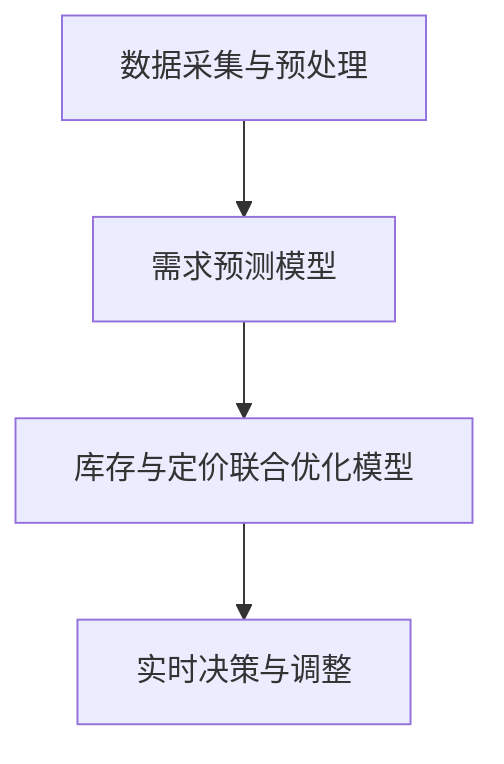

# AI在智能零售库存与定价联合优化中的实时应用

> 关键词：人工智能、智能零售、库存与定价联合优化、实时应用、需求预测

> 摘要：本文聚焦于AI在智能零售库存与定价联合优化中的实时应用。首先介绍了该研究的背景，包括目的、预期读者、文档结构和相关术语。接着阐述了核心概念，如库存管理、定价策略以及它们之间的联系，并给出了相应的示意图和流程图。详细讲解了核心算法原理，通过Python代码进行说明。同时，运用数学模型和公式对库存与定价联合优化问题进行了分析。在项目实战部分，提供了开发环境搭建、源代码实现与解读。探讨了AI在智能零售中的实际应用场景，推荐了相关的学习资源、开发工具框架和论文著作。最后总结了未来发展趋势与挑战，并给出常见问题解答和参考资料。

## 1. 背景介绍 
### 1.1 目的和范围
在智能零售领域，库存管理和定价策略是影响企业利润和竞争力的关键因素。传统的库存管理和定价方法往往基于经验和历史数据，难以适应市场的快速变化。而人工智能技术的发展为解决这一问题提供了新的思路和方法。本文的目的是探讨AI在智能零售库存与定价联合优化中的实时应用，旨在帮助零售企业更好地管理库存、制定合理的价格策略，提高企业的运营效率和盈利能力。

本文的范围主要涵盖了AI在智能零售库存与定价联合优化中的基本概念、核心算法、数学模型、项目实战、实际应用场景等方面。通过对这些内容的详细阐述，为读者提供一个全面、深入的了解。

### 1.2 预期读者
本文的预期读者包括零售企业的管理人员、技术人员、研究人员以及对人工智能和智能零售感兴趣的相关人士。对于零售企业管理人员，本文可以帮助他们了解如何运用AI技术优化库存和定价策略，提高企业的竞争力；对于技术人员，本文提供了详细的算法原理和代码实现，有助于他们在实际项目中应用和开发相关技术；对于研究人员，本文可以为他们的研究提供参考和启发；对于对人工智能和智能零售感兴趣的相关人士，本文可以帮助他们了解这一领域的最新发展动态。

### 1.3 文档结构概述
本文共分为十个部分。第一部分是背景介绍，包括目的和范围、预期读者、文档结构概述和术语表；第二部分介绍核心概念与联系，给出核心概念原理和架构的文本示意图和Mermaid流程图；第三部分详细讲解核心算法原理，并使用Python源代码进行阐述；第四部分介绍数学模型和公式，进行详细讲解并举例说明；第五部分是项目实战，包括开发环境搭建、源代码详细实现和代码解读；第六部分探讨实际应用场景；第七部分推荐相关的工具和资源，包括学习资源、开发工具框架和相关论文著作；第八部分总结未来发展趋势与挑战；第九部分是附录，解答常见问题；第十部分提供扩展阅读和参考资料。

### 1.4 术语表
#### 1.4.1 核心术语定义
- **智能零售**：利用人工智能、物联网、大数据等技术，实现零售业务的智能化运营和管理，包括智能购物、智能库存管理、智能定价等。
- **库存与定价联合优化**：综合考虑库存水平和价格因素，通过优化库存管理和定价策略，实现企业利润最大化的过程。
- **需求预测**：根据历史数据和市场信息，运用统计方法或机器学习算法，对未来一段时间内的产品需求进行预测。
- **实时应用**：在实际业务场景中，能够实时获取数据、进行分析和决策，并及时调整库存和定价策略的应用。

#### 1.4.2 相关概念解释
- **库存管理**：对企业的库存进行规划、控制和管理的过程，包括库存水平的确定、补货策略的制定等。
- **定价策略**：企业根据市场需求、成本、竞争等因素，制定产品价格的策略，常见的定价策略包括成本加成定价、竞争导向定价、需求导向定价等。
- **人工智能**：研究如何使计算机模拟人类的智能行为，包括学习、推理、决策等能力的技术领域。在智能零售中，人工智能可以用于需求预测、库存优化、定价决策等方面。

#### 1.4.3 缩略词列表
- **AI**：Artificial Intelligence，人工智能
- **ML**：Machine Learning，机器学习
- **DL**：Deep Learning，深度学习
- **SKU**：Stock Keeping Unit，库存保有单位

## 2. 核心概念与联系 

### 核心概念原理
在智能零售中，库存管理和定价策略是相互关联的两个核心概念。库存管理的目标是在满足客户需求的前提下，尽可能降低库存成本。而定价策略则直接影响产品的销售量和利润。库存水平的高低会影响产品的供应情况，进而影响价格；而价格的变化又会影响产品的需求，从而影响库存水平。因此，库存与定价联合优化的核心原理就是通过综合考虑库存和价格因素，找到一个最优的库存管理和定价策略组合，以实现企业利润的最大化。

### 架构的文本示意图
以下是AI在智能零售库存与定价联合优化中的架构示意图：

```plaintext
+-----------------------+
| 数据采集与预处理      |
| - 销售数据            |
| - 库存数据            |
| - 市场数据            |
| - 客户数据            |
+-----------------------+
          |
          v
+-----------------------+
| 需求预测模型          |
| - 机器学习算法        |
| - 深度学习算法        |
+-----------------------+
          |
          v
+-----------------------+
| 库存与定价联合优化模型 |
| - 优化算法            |
| - 目标函数            |
+-----------------------+
          |
          v
+-----------------------+
| 实时决策与调整        |
| - 库存补货决策        |
| - 价格调整决策        |
+-----------------------+
```

### Mermaid流程图


## 3. 核心算法原理 & 具体操作步骤 

### 需求预测算法
需求预测是库存与定价联合优化的基础。常用的需求预测算法包括时间序列分析、机器学习算法和深度学习算法。这里以线性回归算法为例，介绍需求预测的原理和具体操作步骤。

线性回归是一种用于建立自变量和因变量之间线性关系的统计方法。在需求预测中，自变量可以是时间、价格、促销活动等因素，因变量是产品的需求量。

#### 算法原理
线性回归的基本模型可以表示为：

$$y = \beta_0 + \beta_1x_1 + \beta_2x_2 + \cdots + \beta_nx_n + \epsilon$$

其中，$y$ 是因变量（需求量），$x_1, x_2, \cdots, x_n$ 是自变量（如时间、价格等），$\beta_0, \beta_1, \cdots, \beta_n$ 是回归系数，$\epsilon$ 是误差项。

#### 具体操作步骤
1. **数据准备**：收集历史销售数据、价格数据等相关数据，并进行预处理，包括数据清洗、特征工程等。
2. **模型训练**：使用训练数据对线性回归模型进行训练，求解回归系数 $\beta_0, \beta_1, \cdots, \beta_n$。
3. **模型评估**：使用测试数据对训练好的模型进行评估，计算评估指标，如均方误差（MSE）、平均绝对误差（MAE）等。
4. **需求预测**：使用训练好的模型对未来的需求量进行预测。

#### Python代码实现
```python
import numpy as np
from sklearn.linear_model import LinearRegression
from sklearn.metrics import mean_squared_error

# 生成示例数据
X_train = np.array([[1], [2], [3], [4], [5]])
y_train = np.array([2, 4, 6, 8, 10])
X_test = np.array([[6], [7], [8]])
y_test = np.array([12, 14, 16])

# 创建线性回归模型
model = LinearRegression()

# 训练模型
model.fit(X_train, y_train)

# 预测
y_pred = model.predict(X_test)

# 评估模型
mse = mean_squared_error(y_test, y_pred)
print(f"均方误差: {mse}")
```

### 库存与定价联合优化算法
库存与定价联合优化的目标是在满足客户需求的前提下，最大化企业的利润。常用的优化算法包括动态规划、遗传算法、模拟退火算法等。这里以动态规划算法为例，介绍库存与定价联合优化的原理和具体操作步骤。

#### 算法原理
动态规划是一种通过将复杂问题分解为子问题，并求解子问题的最优解来得到原问题最优解的算法。在库存与定价联合优化中，我们可以将问题分解为每个时间段的库存管理和定价决策问题。

#### 具体操作步骤
1. **定义状态**：定义每个时间段的库存水平和价格作为状态。
2. **定义决策**：定义每个时间段的补货决策和价格调整决策作为决策。
3. **定义状态转移方程**：根据库存管理和定价策略，定义状态转移方程，描述状态如何从一个时间段转移到下一个时间段。
4. **定义目标函数**：定义目标函数，如企业的利润函数。
5. **求解最优策略**：使用动态规划算法求解最优的库存管理和定价策略。

#### Python代码实现
```python
# 示例代码，简化的动态规划实现库存与定价联合优化
import numpy as np

# 定义参数
T = 5  # 时间段数量
S_max = 10  # 最大库存水平
P_max = 5  # 最大价格
c = 1  # 补货成本
h = 0.1  # 库存持有成本
d = lambda p: 10 - p  # 需求函数

# 初始化价值函数和策略函数
V = np.zeros((T + 1, S_max + 1, P_max + 1))
pi = np.zeros((T, S_max + 1, P_max + 1), dtype=int)

# 动态规划求解
for t in range(T - 1, -1, -1):
    for s in range(S_max + 1):
        for p in range(P_max + 1):
            max_value = -np.inf
            best_action = 0
            for a in range(S_max - s + 1):
                # 计算下一阶段的库存水平
                s_next = s + a - int(d(p))
                if s_next < 0:
                    s_next = 0
                # 计算利润
                revenue = p * min(s + a, int(d(p)))
                cost = c * a + h * s
                value = revenue - cost + V[t + 1, s_next, p]
                if value > max_value:
                    max_value = value
                    best_action = a
            V[t, s, p] = max_value
            pi[t, s, p] = best_action

# 输出最优策略
print("最优补货策略:")
print(pi)
```

## 4. 数学模型和公式 & 详细讲解 & 举例说明 

### 需求预测模型
在需求预测中，我们可以使用线性回归模型来建立价格和需求量之间的关系。假设需求量 $D$ 与价格 $p$ 之间的关系可以表示为：

$$D = \alpha - \beta p + \epsilon$$

其中，$\alpha$ 和 $\beta$ 是回归系数，$\epsilon$ 是误差项。

#### 详细讲解
$\alpha$ 表示当价格为 0 时的需求量，$\beta$ 表示价格每增加 1 单位，需求量的减少量。误差项 $\epsilon$ 表示除价格外其他因素对需求量的影响。

#### 举例说明
假设通过历史数据拟合得到 $\alpha = 100$，$\beta = 2$，则当价格 $p = 10$ 时，预测的需求量为：

$$D = 100 - 2 \times 10 + \epsilon = 80 + \epsilon$$

### 库存与定价联合优化模型
库存与定价联合优化的目标是最大化企业的利润。假设在每个时间段 $t$，企业的库存水平为 $s_t$，价格为 $p_t$，补货量为 $a_t$，则企业的利润函数可以表示为：

$$\pi_t(s_t, p_t, a_t) = p_t \min(s_t + a_t, D_t(p_t)) - c a_t - h s_t$$

其中，$D_t(p_t)$ 是时间段 $t$ 的需求量，$c$ 是补货成本，$h$ 是库存持有成本。

#### 详细讲解
$p_t \min(s_t + a_t, D_t(p_t))$ 表示企业在时间段 $t$ 的销售收入，$c a_t$ 表示补货成本，$h s_t$ 表示库存持有成本。企业的目标是在每个时间段选择最优的补货量 $a_t$ 和价格 $p_t$，使得总利润最大化。

#### 举例说明
假设 $c = 5$，$h = 1$，$D_t(p_t) = 20 - p_t$，$s_t = 10$，$p_t = 15$，$a_t = 5$，则企业在时间段 $t$ 的利润为：

$$\pi_t(10, 15, 5) = 15 \min(10 + 5, 20 - 15) - 5 \times 5 - 1 \times 10$$
$$= 15 \times 5 - 25 - 10 = 75 - 25 - 10 = 40$$

## 5. 项目实战：代码实际案例和详细解释说明 

### 5.1  开发环境搭建
#### 操作系统
建议使用Windows、Linux或macOS操作系统。

#### Python环境
安装Python 3.6及以上版本。可以从Python官方网站（https://www.python.org/downloads/）下载并安装。

#### 第三方库
安装以下第三方库：
- `numpy`：用于数值计算。
- `pandas`：用于数据处理和分析。
- `scikit-learn`：用于机器学习算法。
- `matplotlib`：用于数据可视化。

可以使用以下命令安装这些库：
```sh
pip install numpy pandas scikit-learn matplotlib
```

### 5.2  源代码详细实现和代码解读
以下是一个完整的项目实战代码示例，包括需求预测和库存与定价联合优化：

```python
import numpy as np
import pandas as pd
from sklearn.linear_model import LinearRegression
from sklearn.metrics import mean_squared_error
import matplotlib.pyplot as plt

# 数据准备
data = pd.DataFrame({
    'price': [10, 12, 14, 16, 18, 20],
    'demand': [90, 80, 70, 60, 50, 40]
})

X = data[['price']]
y = data['demand']

# 需求预测模型训练
model = LinearRegression()
model.fit(X, y)

# 预测未来需求
future_prices = np.array([[22], [24]])
future_demands = model.predict(future_prices)

print("未来需求预测:")
for i in range(len(future_prices)):
    print(f"价格: {future_prices[i][0]}, 需求量: {future_demands[i]}")

# 库存与定价联合优化
T = 3  # 时间段数量
S_max = 100  # 最大库存水平
P_max = 30  # 最大价格
c = 5  # 补货成本
h = 1  # 库存持有成本

# 初始化价值函数和策略函数
V = np.zeros((T + 1, S_max + 1, P_max + 1))
pi = np.zeros((T, S_max + 1, P_max + 1), dtype=int)

# 动态规划求解
for t in range(T - 1, -1, -1):
    for s in range(S_max + 1):
        for p in range(P_max + 1):
            max_value = -np.inf
            best_action = 0
            for a in range(S_max - s + 1):
                # 计算下一阶段的库存水平
                s_next = s + a - int(model.predict([[p]])[0])
                if s_next < 0:
                    s_next = 0
                # 计算利润
                revenue = p * min(s + a, int(model.predict([[p]])[0]))
                cost = c * a + h * s
                value = revenue - cost + V[t + 1, s_next, p]
                if value > max_value:
                    max_value = value
                    best_action = a
            V[t, s, p] = max_value
            pi[t, s, p] = best_action

# 输出最优策略
print("最优补货策略:")
for t in range(T):
    print(f"时间段 {t + 1}:")
    for s in range(S_max + 1):
        for p in range(P_max + 1):
            print(f"库存水平: {s}, 价格: {p}, 补货量: {pi[t, s, p]}")

# 数据可视化
plt.scatter(data['price'], data['demand'])
plt.plot(future_prices, future_demands, 'r--')
plt.xlabel('价格')
plt.ylabel('需求量')
plt.title('需求预测')
plt.show()
```

### 5.3  代码解读与分析
#### 需求预测部分
- 首先，我们使用 `pandas` 库创建了一个包含价格和需求量的数据集。
- 然后，使用 `sklearn` 库中的 `LinearRegression` 模型对需求预测模型进行训练。
- 最后，使用训练好的模型对未来的需求量进行预测，并输出预测结果。

#### 库存与定价联合优化部分
- 我们定义了时间段数量、最大库存水平、最大价格、补货成本和库存持有成本等参数。
- 使用动态规划算法求解最优的库存管理和定价策略，并将结果存储在 `pi` 数组中。
- 最后，输出每个时间段、每个库存水平和每个价格下的最优补货量。

#### 数据可视化部分
- 使用 `matplotlib` 库绘制了历史数据的散点图和未来需求预测的折线图，直观地展示了需求预测的结果。

## 6. 实际应用场景 
### 线上零售平台
线上零售平台可以利用AI技术实时监控库存水平和市场需求，根据需求预测和库存情况动态调整商品价格。例如，当某款商品的库存水平较低且需求较高时，平台可以适当提高价格，以增加利润；当库存水平较高且需求较低时，平台可以降低价格，以促进销售，减少库存积压。

### 实体零售店
实体零售店可以使用AI技术优化库存管理和定价策略。通过安装智能传感器和摄像头，实时收集店内的客流量、商品销售情况等数据，利用AI算法进行需求预测和库存与定价联合优化。例如，根据不同时间段的客流量和销售情况，调整商品的陈列位置和价格，提高顾客的购买意愿和店铺的销售额。

### 生鲜零售行业
生鲜产品具有易腐坏、保鲜期短的特点，库存管理和定价策略尤为重要。AI技术可以帮助生鲜零售企业实时监测生鲜产品的库存水平、质量状况和市场需求，根据产品的新鲜度和剩余保质期动态调整价格。例如，当某款生鲜产品的剩余保质期较短时，企业可以降低价格，以尽快销售出去，减少损失。

## 7. 工具和资源推荐
### 7.1 学习资源推荐
#### 7.1.1 书籍推荐
- 《人工智能：一种现代的方法》：这本书是人工智能领域的经典教材，全面介绍了人工智能的基本概念、算法和应用。
- 《Python机器学习》：详细介绍了使用Python进行机器学习的方法和技术，包括数据预处理、模型选择、评估和优化等方面。
- 《深度学习》：由深度学习领域的三位先驱Ian Goodfellow、Yoshua Bengio和Aaron Courville撰写，是深度学习领域的权威著作。

#### 7.1.2 在线课程
- Coursera上的“人工智能基础”课程：由斯坦福大学教授吴恩达主讲，系统地介绍了人工智能的基本概念和算法。
- edX上的“Python数据科学入门”课程：帮助学习者掌握使用Python进行数据科学的基本技能，包括数据处理、分析和可视化等。
- 网易云课堂上的“深度学习实战”课程：通过实际项目案例，介绍了深度学习的应用和开发技巧。

#### 7.1.3 技术博客和网站
- Medium：一个技术博客平台，上面有很多关于人工智能、机器学习和智能零售的优质文章。
- Towards Data Science：专注于数据科学和人工智能领域的技术博客，提供了大量的技术文章和案例分析。
- Kaggle：一个数据科学竞赛平台，上面有很多关于智能零售的数据集和竞赛项目，可以帮助学习者提高实践能力。

### 7.2 开发工具框架推荐
#### 7.2.1 IDE和编辑器
- PyCharm：一款专门为Python开发设计的集成开发环境，提供了丰富的功能和插件，方便开发者进行代码编写、调试和管理。
- Jupyter Notebook：一个交互式的开发环境，支持Python、R等多种编程语言，适合进行数据探索、模型开发和可视化等工作。
- Visual Studio Code：一款轻量级的代码编辑器，支持多种编程语言和插件，具有强大的代码编辑和调试功能。

#### 7.2.2 调试和性能分析工具
- Py-Spy：一个用于Python代码性能分析的工具，可以帮助开发者找出代码中的性能瓶颈。
- TensorBoard：一个用于深度学习模型可视化和调试的工具，可以帮助开发者监控模型的训练过程和性能指标。
- Numba：一个用于加速Python代码的工具，可以将Python代码转换为机器码，提高代码的执行效率。

#### 7.2.3 相关框架和库
- TensorFlow：一个开源的深度学习框架，由Google开发，提供了丰富的深度学习模型和工具，支持多种编程语言。
- PyTorch：一个开源的深度学习框架，由Facebook开发，具有简洁易用的接口和高效的计算性能，受到了很多研究者和开发者的喜爱。
- Scikit-learn：一个用于机器学习的Python库，提供了丰富的机器学习算法和工具，包括分类、回归、聚类等方面。

### 7.3 相关论文著作推荐
#### 7.3.1 经典论文
- “Deep Learning” by Yann LeCun, Yoshua Bengio, and Geoffrey Hinton：这篇论文是深度学习领域的经典之作，介绍了深度学习的基本概念、模型和应用。
- “A Unified Approach to Interpreting Model Predictions” by Scott Lundberg and Su-In Lee：提出了一种统一的方法来解释机器学习模型的预测结果，有助于提高模型的可解释性。
- “Dynamic Pricing and Inventory Control: A Review” by Guillermo Gallego and Garrett van Ryzin：对动态定价和库存控制问题进行了全面的综述，介绍了相关的理论和方法。

#### 7.3.2 最新研究成果
- 关注顶级学术会议，如NeurIPS（神经信息处理系统大会）、ICML（国际机器学习会议）、KDD（知识发现与数据挖掘会议）等，这些会议上会发表很多关于人工智能和智能零售的最新研究成果。
- 查阅相关学术期刊，如Journal of Retail and Consumer Services、Management Science等，这些期刊上也会刊登一些关于智能零售库存与定价联合优化的研究论文。

#### 7.3.3 应用案例分析
- 一些知名企业的官方博客和技术分享会介绍他们在智能零售领域的应用案例，如亚马逊、阿里巴巴等。可以通过关注这些企业的官方渠道，了解他们在库存管理和定价策略方面的实践经验。
- 一些咨询公司和研究机构也会发布关于智能零售的研究报告和应用案例分析，可以通过查阅这些报告，了解行业的最新动态和发展趋势。

## 8. 总结：未来发展趋势与挑战
### 未来发展趋势
- **多模态数据融合**：未来，AI在智能零售库存与定价联合优化中将会融合更多类型的数据，如视频、音频、图像等多模态数据。通过对这些数据的综合分析，可以更准确地了解消费者的需求和行为，从而制定更加精准的库存管理和定价策略。
- **强化学习的应用**：强化学习作为一种能够在动态环境中进行决策优化的算法，将会在智能零售领域得到更广泛的应用。通过强化学习算法，零售企业可以实时调整库存和定价策略，以适应市场的变化，实现长期的利润最大化。
- **边缘计算与物联网的结合**：随着物联网技术的发展，大量的智能设备将会应用于零售场景中，如智能货架、智能摄像头等。边缘计算技术可以将数据处理和分析任务从云端转移到边缘设备上，实现实时的数据处理和决策。未来，边缘计算与物联网的结合将会使智能零售系统更加高效和智能。

### 挑战
- **数据质量和安全问题**：AI在智能零售库存与定价联合优化中依赖大量的数据，数据的质量和安全直接影响模型的性能和决策的准确性。因此，如何保证数据的质量和安全是一个亟待解决的问题。
- **模型的可解释性**：深度学习等复杂模型在智能零售中取得了很好的效果，但这些模型往往具有较高的复杂度，难以解释其决策过程和结果。在实际应用中，零售企业需要了解模型的决策依据，以便做出合理的决策。因此，提高模型的可解释性是一个重要的挑战。
- **技术与业务的融合**：AI技术在智能零售中的应用需要与零售业务紧密结合。如何将技术优势转化为业务价值，需要零售企业具备一定的技术能力和业务理解能力。同时，技术的不断更新换代也需要企业不断学习和适应，这对企业的人才培养和组织架构提出了挑战。

## 9. 附录：常见问题与解答
### 问题1：AI在智能零售库存与定价联合优化中的实时应用需要哪些数据？
解答：通常需要销售数据、库存数据、市场数据、客户数据等。销售数据包括历史销售记录、销售量、销售额等；库存数据包括库存水平、补货记录等；市场数据包括竞争对手的价格、市场需求趋势等；客户数据包括客户的购买行为、偏好等。

### 问题2：如何评估需求预测模型的准确性？
解答：可以使用一些评估指标来评估需求预测模型的准确性，如均方误差（MSE）、平均绝对误差（MAE）、平均绝对百分比误差（MAPE）等。这些指标可以衡量预测值与实际值之间的差异，值越小表示模型的准确性越高。

### 问题3：库存与定价联合优化算法的计算复杂度高吗？
解答：一些复杂的优化算法，如动态规划、遗传算法等，计算复杂度可能较高。特别是在考虑多个时间段、多种商品的情况下，计算量会显著增加。为了降低计算复杂度，可以采用一些近似算法或启发式算法。

### 问题4：AI在智能零售库存与定价联合优化中的应用对企业的技术要求高吗？
解答：对企业的技术要求有一定的挑战。企业需要具备一定的数据处理和分析能力，能够收集、整理和存储相关数据。同时，需要掌握一些机器学习和优化算法的知识，能够开发和应用相应的模型。不过，随着技术的发展，一些现成的AI平台和工具可以帮助企业降低技术门槛。

## 10. 扩展阅读 & 参考资料
### 扩展阅读
- 《智能商业》：介绍了智能商业的发展趋势和商业模式，对智能零售的发展有一定的启示。
- 《大数据时代》：阐述了大数据在各个领域的应用和影响，有助于了解数据在智能零售中的重要性。
- 《创新者的窘境》：探讨了企业在面对技术创新时的挑战和机遇，对零售企业在AI时代的发展有一定的借鉴意义。

### 参考资料
- Goodfellow, I., Bengio, Y., & Courville, A. (2016). Deep Learning. MIT Press.
- James, G., Witten, D., Hastie, T., & Tibshirani, R. (2013). An Introduction to Statistical Learning: with Applications in R. Springer.
- Gallego, G., & van Ryzin, G. (1994). Optimal dynamic pricing of inventories with stochastic demand over finite horizons. Management Science, 40(8), 999-1020.

作者：AI天才研究院/AI Genius Institute & 禅与计算机程序设计艺术 /Zen And The Art of Computer Programming