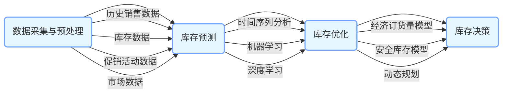

# AI在智能零售库存管理中的预测与优化应用

> 关键词：AI、智能零售、库存管理、预测、优化

> 摘要：本文深入探讨了AI在智能零售库存管理中的预测与优化应用。首先介绍了相关背景，包括目的、预期读者、文档结构和术语表。接着阐述了核心概念与联系，通过文本示意图和Mermaid流程图展示原理架构。详细讲解了核心算法原理及具体操作步骤，并结合Python源代码进行说明。还给出了数学模型和公式，通过举例加深理解。通过项目实战，展示了开发环境搭建、源代码实现及解读。分析了实际应用场景，推荐了学习资源、开发工具框架和相关论文著作。最后总结了未来发展趋势与挑战，提供了常见问题解答和扩展阅读参考资料，旨在为智能零售库存管理领域应用AI技术提供全面的技术指导。

## 1. 背景介绍 
### 1.1 目的和范围
在当今竞争激烈的零售市场中，库存管理是企业运营的关键环节之一。有效的库存管理能够降低成本、提高客户满意度和增加企业利润。传统的库存管理方法往往依赖于经验和简单的统计模型，难以应对复杂多变的市场需求。随着人工智能技术的快速发展，AI在智能零售库存管理中的应用越来越受到关注。

本文的目的是全面介绍AI在智能零售库存管理中的预测与优化应用，包括核心概念、算法原理、数学模型、实际案例等方面。范围涵盖了从数据采集到库存决策的整个库存管理流程，旨在为零售企业和相关技术人员提供理论和实践指导。

### 1.2 预期读者
本文的预期读者包括：
- 零售企业的管理人员和决策者，希望通过了解AI技术在库存管理中的应用，优化企业的库存策略，提高运营效率和竞争力。
- 从事智能零售和库存管理研究的学者和科研人员，为他们的研究提供参考和启示。
- 软件开发人员和数据科学家，对AI技术在零售领域的应用感兴趣，希望学习相关算法和实现方法。

### 1.3 文档结构概述
本文的文档结构如下：
- 核心概念与联系：介绍AI在智能零售库存管理中涉及的核心概念，以及它们之间的联系，通过文本示意图和Mermaid流程图进行展示。
- 核心算法原理 & 具体操作步骤：详细讲解用于库存预测和优化的核心算法原理，并给出具体的操作步骤，结合Python源代码进行说明。
- 数学模型和公式 & 详细讲解 & 举例说明：介绍相关的数学模型和公式，对其进行详细讲解，并通过实际例子加深理解。
- 项目实战：代码实际案例和详细解释说明：通过一个实际的项目案例，展示如何在智能零售库存管理中应用AI技术，包括开发环境搭建、源代码实现和代码解读。
- 实际应用场景：分析AI在智能零售库存管理中的实际应用场景，为读者提供实际应用的参考。
- 工具和资源推荐：推荐相关的学习资源、开发工具框架和论文著作，帮助读者进一步深入学习和研究。
- 总结：未来发展趋势与挑战：总结AI在智能零售库存管理中的应用现状，分析未来的发展趋势和面临的挑战。
- 附录：常见问题与解答：提供常见问题的解答，帮助读者解决遇到的问题。
- 扩展阅读 & 参考资料：提供相关的扩展阅读资料和参考文献，方便读者进一步查阅。

### 1.4 术语表
#### 1.4.1 核心术语定义
- **智能零售**：利用先进的信息技术和人工智能技术，实现零售业务的智能化运营和管理，包括商品销售、库存管理、客户服务等方面。
- **库存管理**：对企业的库存进行规划、控制和优化的过程，旨在确保库存水平既能满足客户需求，又能降低库存成本。
- **库存预测**：根据历史数据和相关因素，预测未来一段时间内的库存需求，为库存决策提供依据。
- **库存优化**：在满足客户需求的前提下，通过合理安排库存水平和补货策略，降低库存成本，提高企业效益。
- **人工智能（AI）**：研究如何使计算机模拟人类的智能行为，包括学习、推理、决策等能力。

#### 1.4.2 相关概念解释
- **数据挖掘**：从大量的数据中提取有价值的信息和知识的过程，常用于库存预测和分析。
- **机器学习**：人工智能的一个分支，通过让计算机从数据中学习模式和规律，实现对未知数据的预测和分类。
- **深度学习**：一种基于神经网络的机器学习方法，具有强大的特征提取和建模能力，在图像识别、语音识别等领域取得了显著的成果。
- **时间序列分析**：用于分析随时间变化的数据序列，预测未来的趋势和变化，常用于库存预测。

#### 1.4.3 缩略词列表
- **AI**：Artificial Intelligence（人工智能）
- **ML**：Machine Learning（机器学习）
- **DL**：Deep Learning（深度学习）
- **SKU**：Stock Keeping Unit（库存保有单位）

## 2. 核心概念与联系 
### 核心概念原理

在智能零售库存管理中，主要涉及以下核心概念：

#### 数据采集与预处理
数据是AI应用的基础，在库存管理中，需要采集各种相关数据，如历史销售数据、库存数据、促销活动数据、市场数据等。采集到的数据往往存在噪声、缺失值等问题，需要进行预处理，包括数据清洗、数据集成、数据转换等操作，以提高数据质量。

#### 库存预测
库存预测是根据历史数据和相关因素，预测未来一段时间内的库存需求。常用的预测方法包括时间序列分析、机器学习和深度学习等。时间序列分析方法通过分析历史数据的趋势、季节性等特征，预测未来的需求；机器学习和深度学习方法则通过学习数据中的模式和规律，对未来需求进行预测。

#### 库存优化
库存优化是在满足客户需求的前提下，通过合理安排库存水平和补货策略，降低库存成本。库存优化需要考虑多个因素，如库存持有成本、缺货成本、补货成本等。常用的优化方法包括经济订货量模型（EOQ）、安全库存模型、动态规划等。

#### 库存决策
库存决策是根据库存预测和优化结果，制定具体的库存管理策略，如补货时间、补货数量、库存分配等。库存决策需要综合考虑企业的实际情况和市场需求，以实现企业的效益最大化。

### 架构的文本示意图

```plaintext
+-------------------+
|    数据采集与预处理   |
|                     |
|  - 历史销售数据       |
|  - 库存数据          |
|  - 促销活动数据       |
|  - 市场数据          |
|  - 数据清洗、集成、转换 |
+-------------------+
         |
         v
+-------------------+
|      库存预测       |
|                     |
|  - 时间序列分析      |
|  - 机器学习         |
|  - 深度学习         |
+-------------------+
         |
         v
+-------------------+
|      库存优化       |
|                     |
|  - 经济订货量模型    |
|  - 安全库存模型      |
|  - 动态规划         |
+-------------------+
         |
         v
+-------------------+
|      库存决策       |
|                     |
|  - 补货时间         |
|  - 补货数量         |
|  - 库存分配         |
+-------------------+
```

### Mermaid流程图



从流程图可以看出，整个智能零售库存管理的过程是一个逐步递进的过程。首先进行数据采集与预处理，为后续的预测和优化提供高质量的数据。然后利用这些数据进行库存预测，得到未来的需求预测结果。接着根据预测结果进行库存优化，确定最优的库存策略。最后根据优化结果进行库存决策，制定具体的补货和库存分配方案。

## 3. 核心算法原理 & 具体操作步骤 

### 时间序列分析算法 - ARIMA模型

#### 算法原理
ARIMA（Autoregressive Integrated Moving Average）模型是一种常用的时间序列预测模型，它结合了自回归（AR）、差分（I）和移动平均（MA）三个部分。

- **自回归（AR）**：指时间序列的当前值与过去值之间存在线性关系，可以表示为：
  $$y_t = c + \sum_{i = 1}^{p} \varphi_i y_{t - i} + \epsilon_t$$
  其中，$y_t$ 是时间序列在 $t$ 时刻的值，$c$ 是常数，$\varphi_i$ 是自回归系数，$p$ 是自回归阶数，$\epsilon_t$ 是白噪声。

- **差分（I）**：用于处理非平稳时间序列，通过对时间序列进行差分运算，使其变为平稳序列。例如，一阶差分可以表示为：
  $$\Delta y_t = y_t - y_{t - 1}$$

- **移动平均（MA）**：指时间序列的当前值与过去的白噪声之间存在线性关系，可以表示为：
  $$y_t = c + \epsilon_t + \sum_{i = 1}^{q} \theta_i \epsilon_{t - i}$$
  其中，$\theta_i$ 是移动平均系数，$q$ 是移动平均阶数。

ARIMA模型的一般形式可以表示为 $ARIMA(p, d, q)$，其中 $p$ 是自回归阶数，$d$ 是差分阶数，$q$ 是移动平均阶数。

#### 具体操作步骤

1. **数据准备**：收集历史销售数据，将其转换为时间序列数据，并进行必要的预处理，如缺失值处理、异常值处理等。

2. **平稳性检验**：使用ADF（Augmented Dickey - Fuller）检验等方法检验时间序列的平稳性。如果时间序列不平稳，则进行差分运算，直到序列变为平稳序列。

3. **确定模型阶数**：可以使用信息准则（如AIC、BIC）等方法确定 $p$ 和 $q$ 的值。

4. **模型拟合**：使用确定好的 $p$、$d$ 和 $q$ 值，对平稳的时间序列进行ARIMA模型拟合。

5. **模型预测**：使用拟合好的模型对未来的库存需求进行预测。

#### Python源代码实现

```python
import pandas as pd
import numpy as np
from statsmodels.tsa.stattools import adfuller
from statsmodels.tsa.arima.model import ARIMA
import matplotlib.pyplot as plt

# 生成示例数据
np.random.seed(0)
dates = pd.date_range(start='2020-01-01', periods=100, freq='D')
sales = np.random.randint(10, 100, size=100)
data = pd.Series(sales, index=dates)

# 平稳性检验
def test_stationarity(timeseries):
    # 执行Dickey-Fuller检验
    result = adfuller(timeseries)
    print('ADF Statistic: {}'.format(result[0]))
    print('p-value: {}'.format(result[1]))
    print('Critical Values:')
    for key, value in result[4].items():
        print('\t{}: {}'.format(key, value))
    if result[1] <= 0.05:
        print("数据平稳")
    else:
        print("数据不平稳")

test_stationarity(data)

# 差分处理
differenced_data = data.diff().dropna()
test_stationarity(differenced_data)

# 确定模型阶数
# 这里简单假设 p=1, d=1, q=1
p, d, q = 1, 1, 1

# 模型拟合
model = ARIMA(data, order=(p, d, q))
model_fit = model.fit()

# 模型预测
forecast_steps = 10
forecast = model_fit.get_forecast(steps=forecast_steps)
forecast_mean = forecast.predicted_mean

# 可视化结果
plt.figure(figsize=(12, 6))
plt.plot(data, label='Historical Sales')
plt.plot(pd.date_range(start=data.index[-1], periods=forecast_steps + 1, freq='D')[1:], forecast_mean, label='Forecasted Sales')
plt.title('Sales Forecast using ARIMA')
plt.xlabel('Date')
plt.ylabel('Sales')
plt.legend()
plt.show()
```

### 机器学习算法 - 随机森林回归

#### 算法原理
随机森林回归是一种基于决策树的集成学习算法，它通过组合多个决策树来提高预测的准确性和稳定性。

随机森林回归的基本思想是：从原始数据集中有放回地随机抽取样本，构建多个决策树。每个决策树在训练时，随机选择一部分特征进行分裂。最后，将所有决策树的预测结果进行平均，得到最终的预测值。

#### 具体操作步骤

1. **数据准备**：收集历史销售数据和相关特征数据，如促销活动、季节因素等，将其转换为适合机器学习模型输入的格式。

2. **特征工程**：对数据进行特征选择和特征转换，如归一化、编码等，以提高模型的性能。

3. **数据集划分**：将数据集划分为训练集和测试集，一般采用80:20或70:30的比例。

4. **模型训练**：使用训练集对随机森林回归模型进行训练。

5. **模型评估**：使用测试集对训练好的模型进行评估，常用的评估指标包括均方误差（MSE）、均方根误差（RMSE）等。

6. **模型预测**：使用训练好的模型对未来的库存需求进行预测。

#### Python源代码实现

```python
import pandas as pd
import numpy as np
from sklearn.ensemble import RandomForestRegressor
from sklearn.model_selection import train_test_split
from sklearn.metrics import mean_squared_error
import matplotlib.pyplot as plt

# 生成示例数据
np.random.seed(0)
n_samples = 100
features = pd.DataFrame({
    'promotion': np.random.randint(0, 2, size=n_samples),
    'season': np.random.randint(1, 5, size=n_samples),
    'price': np.random.uniform(10, 100, size=n_samples)
})
sales = 2 * features['promotion'] + 3 * features['season'] + 0.5 * features['price'] + np.random.normal(0, 10, size=n_samples)

# 数据集划分
X_train, X_test, y_train, y_test = train_test_split(features, sales, test_size=0.2, random_state=42)

# 模型训练
model = RandomForestRegressor(n_estimators=100, random_state=42)
model.fit(X_train, y_train)

# 模型评估
y_pred = model.predict(X_test)
mse = mean_squared_error(y_test, y_pred)
rmse = np.sqrt(mse)
print(f"均方误差 (MSE): {mse}")
print(f"均方根误差 (RMSE): {rmse}")

# 模型预测
new_features = pd.DataFrame({
    'promotion': [1],
    'season': [3],
    'price': [50]
})
predicted_sales = model.predict(new_features)
print(f"预测的销售量: {predicted_sales[0]}")

# 特征重要性可视化
feature_importances = model.feature_importances_
feature_names = features.columns
plt.figure(figsize=(10, 6))
plt.bar(feature_names, feature_importances)
plt.title('Feature Importance in Random Forest Regression')
plt.xlabel('Features')
plt.ylabel('Importance')
plt.show()
```

## 4. 数学模型和公式 & 详细讲解 & 举例说明 

### 经济订货量模型（EOQ）

#### 数学模型和公式
经济订货量模型（Economic Order Quantity，EOQ）是一种经典的库存管理模型，用于确定最优的订货数量，以最小化库存总成本。

库存总成本包括采购成本、库存持有成本和缺货成本。在EOQ模型中，假设需求是固定的，且不考虑缺货成本，只考虑采购成本和库存持有成本。

设 $D$ 为年需求量，$S$ 为每次订货的固定成本，$H$ 为单位商品的年库存持有成本，$Q$ 为订货数量。

- 年采购成本：$C_p=\frac{D}{Q}S$
- 年库存持有成本：$C_h=\frac{Q}{2}H$
- 年库存总成本：$C(Q)=\frac{D}{Q}S+\frac{Q}{2}H$

为了找到使年库存总成本最小的订货数量 $Q$，对 $C(Q)$ 求导，并令导数为0：

$$\frac{dC(Q)}{dQ}=-\frac{DS}{Q^2}+\frac{H}{2}=0$$

解得：

$$Q^*=\sqrt{\frac{2DS}{H}}$$

其中，$Q^*$ 就是经济订货量。

#### 详细讲解
- **年采购成本**：年采购成本与订货次数成正比，订货次数越多，采购成本越高。订货次数等于年需求量除以订货数量，即 $\frac{D}{Q}$，每次订货的固定成本为 $S$，所以年采购成本为 $\frac{D}{Q}S$。
- **年库存持有成本**：年库存持有成本与平均库存水平成正比，平均库存水平等于订货数量的一半，即 $\frac{Q}{2}$，单位商品的年库存持有成本为 $H$，所以年库存持有成本为 $\frac{Q}{2}H$。
- **经济订货量**：通过对年库存总成本求导并令导数为0，可以找到使总成本最小的订货数量。经济订货量的公式表明，它与年需求量和每次订货的固定成本的平方根成正比，与单位商品的年库存持有成本的平方根成反比。

#### 举例说明
假设某商品的年需求量 $D = 1000$ 件，每次订货的固定成本 $S = 50$ 元，单位商品的年库存持有成本 $H = 10$ 元。

根据经济订货量公式：

$$Q^*=\sqrt{\frac{2DS}{H}}=\sqrt{\frac{2\times1000\times50}{10}}=\sqrt{10000}=100$$（件）

即最优的订货数量为100件。此时，年采购成本为 $\frac{1000}{100}\times50 = 500$ 元，年库存持有成本为 $\frac{100}{2}\times10 = 500$ 元，年库存总成本为 $500 + 500 = 1000$ 元。

### 安全库存模型

#### 数学模型和公式
安全库存是为了应对需求的不确定性和供应的不确定性而设置的额外库存。安全库存模型的目的是在满足一定的服务水平下，确定最优的安全库存水平。

设 $\mu$ 为平均需求，$\sigma$ 为需求的标准差，$z$ 为安全系数，$L$ 为提前期。

安全库存 $SS = z\sigma\sqrt{L}$

再订货点 $ROP=\mu L+SS$

其中，服务水平是指在提前期内不发生缺货的概率，安全系数 $z$ 与服务水平相关，可以通过标准正态分布表查得。

#### 详细讲解
- **安全库存**：安全库存的大小与需求的标准差、提前期和安全系数有关。需求的标准差越大，说明需求的波动越大，需要设置的安全库存就越高；提前期越长，供应的不确定性越大，也需要设置更高的安全库存；安全系数则取决于企业对服务水平的要求，服务水平越高，安全系数越大，安全库存也越高。
- **再订货点**：再订货点是指当库存水平下降到该点时，需要进行补货。再订货点等于平均需求在提前期内的需求量加上安全库存。

#### 举例说明
假设某商品的平均日需求 $\mu = 20$ 件，需求的标准差 $\sigma = 5$ 件，提前期 $L = 5$ 天，企业要求的服务水平为95%。

通过标准正态分布表查得，服务水平为95%时，安全系数 $z = 1.645$。

安全库存 $SS = z\sigma\sqrt{L}=1.645\times5\times\sqrt{5}\approx18.4$（件）

平均需求在提前期内的需求量为 $\mu L = 20\times5 = 100$ 件。

再订货点 $ROP=\mu L+SS = 100 + 18.4 = 118.4$ 件。

即当库存水平下降到118.4件时，需要进行补货。

## 5. 项目实战：代码实际案例和详细解释说明 

### 5.1  开发环境搭建
#### 操作系统
本项目可以在Windows、Linux或macOS等主流操作系统上进行开发，建议使用Linux系统，如Ubuntu 20.04，因为Linux系统在数据处理和机器学习开发方面具有较好的稳定性和性能。

#### Python环境
Python是本项目的主要开发语言，建议使用Python 3.7及以上版本。可以通过Anaconda或Miniconda来管理Python环境，以下是使用Anaconda创建虚拟环境的步骤：

1. 下载并安装Anaconda：从Anaconda官方网站（https://www.anaconda.com/products/individual）下载适合自己操作系统的Anaconda安装包，并按照安装向导进行安装。

2. 创建虚拟环境：打开终端或命令提示符，执行以下命令创建一个名为 `retail_inventory` 的虚拟环境，并指定Python版本为3.8：
```bash
conda create -n retail_inventory python=3.8
```

3. 激活虚拟环境：执行以下命令激活虚拟环境：
```bash
conda activate retail_inventory
```

#### 安装必要的库
在激活的虚拟环境中，使用 `pip` 安装项目所需的库，包括 `pandas`、`numpy`、`scikit-learn`、`statsmodels`、`matplotlib` 等：
```bash
pip install pandas numpy scikit-learn statsmodels matplotlib
```

### 5.2  源代码详细实现和代码解读
#### 数据加载和预处理
```python
import pandas as pd
import numpy as np

# 加载数据
data = pd.read_csv('sales_data.csv')

# 数据预处理
# 处理缺失值
data = data.dropna()

# 提取特征和目标变量
features = data[['promotion', 'season', 'price']]
target = data['sales']

# 特征归一化
from sklearn.preprocessing import StandardScaler
scaler = StandardScaler()
features_scaled = scaler.fit_transform(features)
```
**代码解读**：
- 首先使用 `pandas` 的 `read_csv` 函数加载销售数据文件 `sales_data.csv`。
- 然后使用 `dropna` 方法处理数据中的缺失值，确保数据的完整性。
- 接着从数据中提取特征（如促销活动、季节、价格）和目标变量（销售量）。
- 最后使用 `StandardScaler` 对特征进行归一化处理，将特征数据缩放到均值为0，标准差为1的范围，以提高模型的训练效果。

#### 模型训练和评估
```python
from sklearn.model_selection import train_test_split
from sklearn.ensemble import RandomForestRegressor
from sklearn.metrics import mean_squared_error

# 数据集划分
X_train, X_test, y_train, y_test = train_test_split(features_scaled, target, test_size=0.2, random_state=42)

# 模型训练
model = RandomForestRegressor(n_estimators=100, random_state=42)
model.fit(X_train, y_train)

# 模型评估
y_pred = model.predict(X_test)
mse = mean_squared_error(y_test, y_pred)
rmse = np.sqrt(mse)
print(f"均方误差 (MSE): {mse}")
print(f"均方根误差 (RMSE): {rmse}")
```
**代码解读**：
- 使用 `train_test_split` 函数将数据集划分为训练集和测试集，测试集占总数据的20%。
- 创建一个随机森林回归模型，指定树的数量为100，并使用训练集对模型进行训练。
- 使用训练好的模型对测试集进行预测，得到预测结果 `y_pred`。
- 计算预测结果与真实值之间的均方误差（MSE）和均方根误差（RMSE），并打印输出。

#### 库存决策
```python
# 假设新的特征数据
new_features = pd.DataFrame({
    'promotion': [1],
    'season': [3],
    'price': [50]
})

# 特征归一化
new_features_scaled = scaler.transform(new_features)

# 预测销售量
predicted_sales = model.predict(new_features_scaled)
print(f"预测的销售量: {predicted_sales[0]}")

# 经济订货量计算
D = 365 * predicted_sales[0]  # 年需求量
S = 50  # 每次订货的固定成本
H = 10  # 单位商品的年库存持有成本
Q = np.sqrt((2 * D * S) / H)
print(f"经济订货量: {Q}")
```
**代码解读**：
- 定义新的特征数据，模拟未来的销售情况。
- 使用之前训练好的 `StandardScaler` 对新的特征数据进行归一化处理。
- 使用训练好的随机森林回归模型对新的特征数据进行预测，得到预测的销售量。
- 根据预测的销售量计算年需求量，并使用经济订货量公式计算最优的订货数量。

### 5.3  代码解读与分析
#### 数据预处理的重要性
数据预处理是机器学习项目中非常重要的一步，它可以提高数据的质量，减少噪声和异常值的影响，从而提高模型的性能。在本项目中，我们对数据进行了缺失值处理和特征归一化，这些操作可以确保模型能够更好地学习数据中的模式和规律。

#### 模型选择和评估
随机森林回归是一种强大的机器学习算法，它具有较好的泛化能力和抗过拟合能力。在本项目中，我们使用随机森林回归模型对库存需求进行预测，并使用均方误差和均方根误差对模型进行评估。这些评估指标可以帮助我们了解模型的预测准确性，以便对模型进行调整和优化。

#### 库存决策的依据
通过预测销售量和计算经济订货量，我们可以制定合理的库存决策。经济订货量模型可以帮助我们在满足需求的前提下，最小化库存总成本。在实际应用中，还可以结合安全库存模型等其他方法，进一步优化库存管理策略。

## 6. 实际应用场景 
### 精准补货
AI技术可以通过对历史销售数据、市场趋势、季节因素等多方面数据的分析，准确预测未来的库存需求。零售企业可以根据预测结果，及时、精准地进行补货，避免库存积压或缺货现象的发生。例如，某连锁超市通过AI预测系统，提前了解到某款饮料在即将到来的夏季需求将大幅增加，及时增加了该饮料的库存，从而满足了顾客的需求，提高了销售额。

### 促销活动库存管理
在促销活动期间，商品的销售情况往往与平时不同。AI可以分析促销活动的历史数据、促销力度、目标客户群体等因素，预测促销期间的库存需求。零售企业可以根据预测结果，合理安排促销商品的库存，避免因库存不足导致促销活动无法顺利进行，或者因库存过多造成浪费。比如，某电商平台在“双11”促销活动前，利用AI技术预测各商品的销量，提前做好库存准备，确保了活动期间的商品供应。

### 库存分配优化
对于拥有多个门店或仓库的零售企业，AI可以根据各门店的销售情况、地理位置、客户需求等因素，优化库存分配方案。将库存合理地分配到各个门店，提高库存的周转率和利用率。例如，某服装品牌通过AI系统，将畅销款式的服装优先分配到销售业绩好的门店，同时将滞销款式的服装调配到有潜在需求的门店，提高了整体的销售效率。

### 供应商管理
AI可以对供应商的交货时间、产品质量、价格等信息进行分析和预测，帮助零售企业选择合适的供应商，并优化采购计划。通过与供应商建立更紧密的合作关系，确保库存的稳定供应。比如，某零售商利用AI技术评估供应商的可靠性，提前与可靠的供应商签订长期合同，减少了因供应商问题导致的库存短缺风险。

### 库存风险管理
AI可以实时监测库存数据和市场变化，识别潜在的库存风险，如库存积压、缺货、价格波动等。并及时提供预警信息，帮助零售企业采取相应的措施进行风险应对。例如，某电子产品零售商通过AI系统监测到某款手机的市场需求下降，及时调整了库存策略，减少了库存积压带来的损失。

## 7. 工具和资源推荐
### 7.1 学习资源推荐
#### 7.1.1 书籍推荐
- 《Python机器学习》（Sebastian Raschka、Vahid Mirjalili 著）：这本书详细介绍了Python在机器学习领域的应用，包括各种机器学习算法的原理和实现，适合初学者入门。
- 《深度学习》（Ian Goodfellow、Yoshua Bengio、Aaron Courville 著）：深度学习领域的经典著作，全面介绍了深度学习的基本概念、算法和应用，对于深入理解AI技术有很大帮助。
- 《供应链管理：战略、规划与运营》（Sunil Chopra、Peter Meindl 著）：这本书涵盖了供应链管理的各个方面，包括库存管理、物流管理等，对于理解智能零售库存管理的整体框架非常有帮助。

#### 7.1.2 在线课程
- Coursera上的“机器学习”课程（Andrew Ng 教授）：这是一门非常经典的机器学习课程，由斯坦福大学的Andrew Ng教授授课，内容涵盖了机器学习的基本概念、算法和应用，适合初学者。
- edX上的“深度学习”系列课程：由麻省理工学院等知名高校提供，深入介绍了深度学习的原理和实践，对于想要深入学习深度学习的读者非常有帮助。
- Udemy上的“智能零售数据分析”课程：专门针对智能零售领域的数据处理和分析，包括库存管理、销售预测等内容，具有很强的实用性。

#### 7.1.3 技术博客和网站
- Towards Data Science：这是一个专注于数据科学和机器学习的博客平台，上面有很多关于AI在各个领域应用的文章，包括智能零售库存管理。
- KDnuggets：提供了丰富的数据科学和机器学习资源，包括文章、教程、工具等，对于学习和研究AI技术非常有帮助。
- Retail Dive：专注于零售行业的新闻和分析，提供了很多关于智能零售的最新动态和趋势，有助于了解行业的发展方向。

### 7.2 开发工具框架推荐
#### 7.2.1 IDE和编辑器
- PyCharm：一款专业的Python集成开发环境，具有代码编辑、调试、版本控制等功能，适合开发Python项目。
- Jupyter Notebook：一个交互式的开发环境，支持Python、R等多种编程语言，非常适合进行数据探索和模型开发。
- Visual Studio Code：一款轻量级的代码编辑器，支持多种编程语言和插件扩展，具有良好的用户体验。

#### 7.2.2 调试和性能分析工具
- TensorBoard：TensorFlow提供的可视化工具，可以帮助用户可视化模型的训练过程、网络结构等信息，方便调试和优化模型。
- Py-Spy：一个用于分析Python程序性能的工具，可以帮助用户找出程序中的性能瓶颈。
- Scikit-learn的模型评估工具：Scikit-learn提供了丰富的模型评估指标和工具，如交叉验证、混淆矩阵等，可以帮助用户评估模型的性能。

#### 7.2.3 相关框架和库
- TensorFlow：一个开源的机器学习框架，广泛应用于深度学习领域，提供了丰富的工具和库，方便用户进行模型开发和训练。
- PyTorch：另一个流行的深度学习框架，具有动态图机制，易于使用和调试，受到很多研究者和开发者的喜爱。
- Scikit-learn：一个简单易用的机器学习库，提供了各种机器学习算法和工具，适合初学者快速上手。
- Pandas：一个强大的数据处理和分析库，提供了高效的数据结构和数据操作方法，方便用户进行数据清洗、转换和分析。

### 7.3 相关论文著作推荐
#### 7.3.1 经典论文
- “Forecasting sales using the Box - Jenkins methodology”（George E. P. Box、Gwilym M. Jenkins 著）：介绍了Box - Jenkins方法在销售预测中的应用，是时间序列分析领域的经典论文。
- “Random forests”（Leo Breiman 著）：提出了随机森林算法，是集成学习领域的重要论文。
- “Deep Residual Learning for Image Recognition”（Kaiming He、Xiangyu Zhang等 著）：介绍了残差网络（ResNet）在图像识别中的应用，是深度学习领域的经典论文。

#### 7.3.2 最新研究成果
- 可以关注顶级学术会议如NeurIPS（神经信息处理系统大会）、ICML（国际机器学习会议）、KDD（知识发现与数据挖掘会议）等上的相关研究论文，了解AI在智能零售库存管理领域的最新研究成果。
- 一些知名学术期刊如《Journal of Retail》、《Management Science》等也会发表关于智能零售和库存管理的最新研究论文。

#### 7.3.3 应用案例分析
- 可以参考一些商业咨询公司的报告，如麦肯锡、波士顿咨询等，这些报告通常会包含一些智能零售库存管理的实际应用案例和分析。
- 一些企业的官方网站也会分享他们在智能零售库存管理方面的实践经验和成果，例如亚马逊、沃尔玛等公司的技术博客。

## 8. 总结：未来发展趋势与挑战
### 未来发展趋势
#### 融合更多数据源
未来，AI在智能零售库存管理中将融合更多的数据源，除了传统的销售数据、库存数据外，还将包括社交媒体数据、物联网数据、地理信息数据等。通过综合分析这些多源数据，可以更全面地了解市场需求和消费者行为，提高库存预测的准确性。

#### 实时预测和动态优化
随着技术的发展，AI将实现更实时的库存预测和动态优化。通过实时监测市场变化和库存状态，及时调整库存策略，实现库存的精细化管理。例如，在突发的市场事件或促销活动时，能够迅速做出反应，调整库存水平和补货计划。

#### 与供应链协同发展
AI将促进智能零售库存管理与供应链的协同发展。通过与供应商、物流商等供应链合作伙伴的信息共享和协同决策，实现整个供应链的高效运作。例如，通过AI技术实现供应商的自动补货和物流的智能调度，提高供应链的响应速度和灵活性。

#### 智能化决策支持系统
未来将出现更智能化的决策支持系统，结合AI技术和人类专家的经验，为零售企业的库存管理提供更全面、更准确的决策建议。这些系统将能够处理复杂的业务规则和不确定性，帮助企业做出更明智的决策。

### 挑战
#### 数据质量和安全问题
AI的应用依赖于大量高质量的数据，但在实际应用中，数据质量往往存在问题，如数据缺失、错误、不一致等。此外，数据安全也是一个重要的问题，零售企业需要保护客户的隐私和商业机密，防止数据泄露。

#### 算法可解释性
一些复杂的AI算法，如深度学习算法，往往具有较高的黑盒性，难以解释其决策过程和结果。在库存管理中，企业需要了解算法的决策依据，以便做出合理的决策。因此，提高算法的可解释性是一个亟待解决的问题。

#### 技术人才短缺
AI技术的应用需要具备相关专业知识和技能的人才，但目前市场上这类人才相对短缺。零售企业需要加强人才培养和引进，提高企业的技术水平和创新能力。

#### 成本和投资回报
实施AI技术需要一定的成本，包括硬件设备、软件系统、人才培训等方面的投入。零售企业需要评估投资回报，确保AI技术的应用能够带来实际的经济效益。

## 9. 附录：常见问题与解答
### 问题1：AI在库存管理中的预测准确性如何保证？
答：保证AI在库存管理中预测准确性可以从以下几个方面入手：
- **数据质量**：确保采集到的数据准确、完整、一致，对数据进行清洗和预处理，去除噪声和异常值。
- **特征选择**：选择与库存需求相关的重要特征，避免无关特征的干扰。
- **模型选择和调优**：根据数据特点和业务需求选择合适的模型，并对模型进行调优，如调整模型的参数、选择合适的算法等。
- **模型评估和监控**：使用合适的评估指标对模型进行评估，定期监控模型的性能，及时发现问题并进行调整。

### 问题2：如何选择适合的AI算法进行库存预测？
答：选择适合的AI算法进行库存预测需要考虑以下因素：
- **数据特点**：如果数据具有明显的时间序列特征，可以选择时间序列分析算法，如ARIMA模型；如果数据包含多个特征，可以考虑使用机器学习或深度学习算法，如随机森林回归、神经网络等。
- **预测精度要求**：对于预测精度要求较高的场景，可以选择复杂的算法，但需要注意算法的可解释性和计算成本；对于精度要求相对较低的场景，可以选择简单的算法。
- **业务需求**：根据业务的具体需求，如实时性要求、预测周期等，选择合适的算法。

### 问题3：AI在库存管理中的应用是否会取代人工决策？
答：AI在库存管理中的应用不会完全取代人工决策。虽然AI可以提供准确的预测和优化建议，但库存管理涉及到很多复杂的因素，如市场变化、企业战略、人际关系等，这些因素需要人类的经验和判断力来进行综合考虑。AI可以作为一种辅助工具，帮助人类做出更明智的决策，提高决策的效率和准确性。

### 问题4：实施AI在库存管理中的应用需要具备哪些条件？
答：实施AI在库存管理中的应用需要具备以下条件：
- **数据基础**：拥有足够的历史数据和实时数据，包括销售数据、库存数据、促销活动数据等。
- **技术能力**：具备一定的数据分析和AI技术能力，或者与专业的技术团队合作。
- **组织支持**：得到企业高层的支持和认可，确保项目能够顺利推进。
- **人才储备**：拥有具备相关专业知识和技能的人才，如数据分析师、算法工程师等。

## 10. 扩展阅读 & 参考资料
### 扩展阅读
- 《人工智能时代的供应链管理》：深入探讨了AI技术在供应链管理中的应用和挑战，包括库存管理、物流管理等方面。
- 《智能商业》：介绍了智能商业的概念和发展趋势，以及AI技术在商业领域的应用案例。
- 《数据驱动的决策》：强调了数据在决策中的重要性，以及如何通过数据分析和AI技术做出更明智的决策。

### 参考资料
- 相关学术论文和研究报告，如在IEEE、ACM等学术数据库中搜索关于AI在智能零售库存管理中的应用的论文。
- 行业标准和规范，如零售行业的库存管理标准和指南。
- 企业的实践经验和案例，如亚马逊、沃尔玛等公司的技术博客和公开报告。

作者：AI天才研究院/AI Genius Institute & 禅与计算机程序设计艺术 /Zen And The Art of Computer Programming