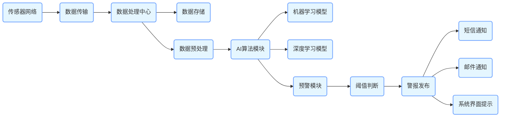

# AI在水质监测与预警系统中的应用创新

> 关键词：AI、水质监测、预警系统、应用创新、数据分析

> 摘要：本文聚焦于AI在水质监测与预警系统中的应用创新。首先介绍了相关背景，包括目的、预期读者、文档结构和术语表。接着阐述了核心概念及联系，通过文本示意图和Mermaid流程图进行清晰展示。详细讲解了核心算法原理及具体操作步骤，使用Python代码进行示例。深入分析了数学模型和公式，并举例说明。通过项目实战，包括开发环境搭建、源代码实现与解读，展示了AI在水质监测与预警中的实际应用。探讨了实际应用场景，推荐了相关工具和资源，最后总结了未来发展趋势与挑战，还设置了常见问题解答和扩展阅读参考资料，旨在为相关领域的研究和实践提供全面且深入的指导。

## 1. 背景介绍 
### 1.1 目的和范围
水质监测与预警系统对于保障水资源安全、维护生态平衡以及支撑社会经济的可持续发展至关重要。传统的水质监测方法往往存在监测频率低、数据处理效率慢、预警不及时等问题。随着人工智能（AI）技术的飞速发展，将其应用于水质监测与预警系统中具有巨大的潜力和价值。本文的目的在于深入探讨AI在水质监测与预警系统中的应用创新，详细介绍相关的技术原理、实现方法和实际应用案例。范围涵盖了从AI核心算法在水质数据处理中的应用，到基于AI的水质预警模型的构建，以及在实际项目中的具体实施和应用场景分析。

### 1.2 预期读者
本文的预期读者主要包括从事环境科学、水利工程、自动化控制等领域的科研人员和工程师，他们希望了解AI技术在水质监测与预警方面的最新应用和创新方法，以提升自身的研究和实践水平。同时，对于相关专业的高校师生，本文可以作为学习和研究的参考资料，帮助他们深入理解AI与水质监测预警系统的结合。此外，对水资源管理和保护感兴趣的政府部门工作人员和企业管理人员，也可以从本文中获取有关水质监测与预警系统智能化升级的思路和建议。

### 1.3 文档结构概述
本文共分为十个部分。第一部分为背景介绍，阐述了文章的目的、预期读者、文档结构和术语表。第二部分介绍核心概念与联系，通过文本示意图和Mermaid流程图展示AI与水质监测预警系统的关键概念和架构。第三部分详细讲解核心算法原理及具体操作步骤，使用Python代码进行示例。第四部分分析数学模型和公式，并举例说明。第五部分进行项目实战，包括开发环境搭建、源代码实现与解读。第六部分探讨实际应用场景。第七部分推荐相关工具和资源，包括学习资源、开发工具框架和相关论文著作。第八部分总结未来发展趋势与挑战。第九部分为附录，解答常见问题。第十部分提供扩展阅读和参考资料。

### 1.4 术语表
#### 1.4.1 核心术语定义
- **人工智能（AI）**：指计算机系统能够执行通常需要人类智能才能完成的任务，如学习、推理、问题解决等。
- **水质监测**：对水体中的各种物理、化学和生物参数进行测量和分析，以评估水质状况。
- **预警系统**：通过对监测数据的分析和处理，及时发现水质异常情况并发出警报的系统。
- **机器学习**：AI的一个分支，让计算机通过数据学习模式和规律，从而进行预测和决策。
- **深度学习**：一种基于神经网络的机器学习方法，能够自动从大量数据中提取特征和模式。

#### 1.4.2 相关概念解释
- **传感器网络**：由多个传感器节点组成的网络，用于实时采集水质数据。
- **数据挖掘**：从大量数据中发现有价值的信息和知识的过程。
- **模型评估**：对建立的机器学习或深度学习模型进行性能评估，以确定其准确性和可靠性。

#### 1.4.3 缩略词列表
- **AI**：Artificial Intelligence（人工智能）
- **ML**：Machine Learning（机器学习）
- **DL**：Deep Learning（深度学习）
- **IoT**：Internet of Things（物联网）

## 2. 核心概念与联系 

### 核心概念原理
在水质监测与预警系统中，AI的应用主要基于数据驱动的方法。传感器网络实时采集水质数据，包括温度、酸碱度（pH值）、溶解氧、化学需氧量等多个参数。这些数据被传输到数据处理中心，AI算法对其进行分析和处理。机器学习和深度学习模型通过对历史数据的学习，建立水质参数之间的关系模型。例如，通过分析大量的水质数据，可以发现某些参数的变化趋势与水质污染事件之间的关联。当新的水质数据输入到模型中时，模型可以根据学习到的模式进行预测和判断，及时发现水质异常情况并发出预警。

### 架构的文本示意图
```plaintext
水质监测与预警系统架构

|-- 传感器网络
|   |-- 温度传感器
|   |-- pH传感器
|   |-- 溶解氧传感器
|   |-- 化学需氧量传感器
|   |--...
|-- 数据传输
|   |-- 有线传输
|   |-- 无线传输
|-- 数据处理中心
|   |-- 数据存储
|   |   |-- 数据库
|   |-- 数据预处理
|   |   |-- 数据清洗
|   |   |-- 特征提取
|   |-- AI算法模块
|   |   |-- 机器学习模型
|   |   |   |-- 决策树
|   |   |   |-- 支持向量机
|   |   |   |--...
|   |   |-- 深度学习模型
|   |   |   |-- 神经网络
|   |   |   |-- 循环神经网络
|   |   |   |--...
|-- 预警模块
|   |-- 阈值判断
|   |-- 警报发布
|   |   |-- 短信通知
|   |   |-- 邮件通知
|   |   |-- 系统界面提示
```

### Mermaid流程图


## 3. 核心算法原理 & 具体操作步骤 

### 核心算法原理
在水质监测与预警系统中，常用的AI算法包括决策树、支持向量机和神经网络等。下面以决策树算法为例进行详细讲解。

决策树是一种基于树结构进行决策的机器学习算法。它通过对数据集的特征进行划分，构建一个树状模型，每个内部节点表示一个特征上的测试，每个分支表示一个测试输出，每个叶节点表示一个类别或值。在水质监测中，决策树可以根据不同的水质参数（如温度、pH值等）来判断水质是否异常。

### 具体操作步骤及Python源代码示例
#### 步骤1：数据准备
首先，我们需要准备水质监测数据。假设我们有一个包含多个水质参数和水质类别（正常或异常）的数据集。以下是一个简单的示例代码，用于生成模拟数据：

```python
import numpy as np
import pandas as pd

# 生成模拟数据
np.random.seed(42)
n_samples = 100
temperature = np.random.normal(25, 5, n_samples)
ph = np.random.normal(7, 1, n_samples)
dissolved_oxygen = np.random.normal(8, 2, n_samples)
water_quality = np.random.choice([0, 1], n_samples)  # 0表示正常，1表示异常

data = {
    'temperature': temperature,
    'ph': ph,
    'dissolved_oxygen': dissolved_oxygen,
    'water_quality': water_quality
}

df = pd.DataFrame(data)
```

#### 步骤2：数据预处理
在使用数据之前，我们需要对其进行预处理，包括划分特征和标签，以及将数据集划分为训练集和测试集。

```python
from sklearn.model_selection import train_test_split

# 划分特征和标签
X = df.drop('water_quality', axis=1)
y = df['water_quality']

# 划分训练集和测试集
X_train, X_test, y_train, y_test = train_test_split(X, y, test_size=0.2, random_state=42)
```

#### 步骤3：模型训练
使用决策树算法对训练集进行训练。

```python
from sklearn.tree import DecisionTreeClassifier

# 创建决策树分类器
clf = DecisionTreeClassifier()

# 训练模型
clf.fit(X_train, y_train)
```

#### 步骤4：模型评估
使用测试集对训练好的模型进行评估。

```python
from sklearn.metrics import accuracy_score

# 预测测试集
y_pred = clf.predict(X_test)

# 计算准确率
accuracy = accuracy_score(y_test, y_pred)
print(f"模型准确率: {accuracy}")
```

#### 步骤5：预警判断
根据模型的预测结果进行预警判断。

```python
# 假设新的水质数据
new_data = np.array([[28, 6.5, 7]])
prediction = clf.predict(new_data)

if prediction[0] == 1:
    print("水质异常，发出预警！")
else:
    print("水质正常。")
```

## 4. 数学模型和公式 & 详细讲解 & 举例说明 

### 决策树算法的数学模型和公式
决策树算法的核心是选择最优的特征进行划分，常用的划分准则有信息增益、信息增益比和基尼指数等。下面以信息增益为例进行详细讲解。

#### 信息熵
信息熵是用来衡量数据集中的不确定性的指标。对于一个包含 $n$ 个类别的数据集 $D$，其信息熵 $H(D)$ 的计算公式为：

$$H(D) = -\sum_{i=1}^{n}p_i\log_2p_i$$

其中，$p_i$ 是第 $i$ 个类别的样本在数据集中所占的比例。

#### 信息增益
信息增益是指在使用某个特征 $A$ 对数据集 $D$ 进行划分后，数据集的信息熵的减少量。信息增益 $g(D, A)$ 的计算公式为：

$$g(D, A) = H(D) - H(D|A)$$

其中，$H(D|A)$ 是在已知特征 $A$ 的条件下，数据集 $D$ 的条件熵，计算公式为：

$$H(D|A) = \sum_{j=1}^{m}\frac{|D_j|}{|D|}H(D_j)$$

这里，$m$ 是特征 $A$ 的取值个数，$D_j$ 是特征 $A$ 取值为第 $j$ 个值的样本子集，$|D|$ 和 $|D_j|$ 分别表示数据集 $D$ 和子集 $D_j$ 的样本数量。

### 举例说明
假设我们有一个简单的水质数据集，包含两个特征：温度（高、低）和pH值（酸性、碱性），以及一个标签：水质类别（正常、异常）。数据集如下表所示：

| 温度 | pH值 | 水质类别 |
| ---- | ---- | ---- |
| 高   | 酸性 | 异常 |
| 高   | 碱性 | 正常 |
| 低   | 酸性 | 异常 |
| 低   | 碱性 | 正常 |

#### 步骤1：计算数据集的信息熵
数据集中正常和异常的样本各有2个，总样本数为4。则 $p_1 = p_2 = \frac{2}{4} = 0.5$。

$$H(D) = - (0.5\log_20.5 + 0.5\log_20.5) = 1$$

#### 步骤2：计算使用温度特征进行划分后的条件熵
- 当温度为高时，有2个样本，其中1个正常，1个异常，$p_{11} = p_{12} = \frac{1}{2} = 0.5$，则 $H(D_1) = - (0.5\log_20.5 + 0.5\log_20.5) = 1$。
- 当温度为低时，同样有2个样本，其中1个正常，1个异常，$p_{21} = p_{22} = \frac{1}{2} = 0.5$，则 $H(D_2) = - (0.5\log_20.5 + 0.5\log_20.5) = 1$。

$|D_1| = |D_2| = 2$，$|D| = 4$，则：

$$H(D|温度) = \frac{2}{4} \times 1 + \frac{2}{4} \times 1 = 1$$

#### 步骤3：计算使用温度特征的信息增益
$$g(D, 温度) = H(D) - H(D|温度) = 1 - 1 = 0$$

同理，可以计算使用pH值特征的信息增益。通过比较不同特征的信息增益，选择信息增益最大的特征作为当前划分的最优特征。

## 5. 项目实战：代码实际案例和详细解释说明 

### 5.1  开发环境搭建
#### 操作系统
建议使用Linux或Windows操作系统。Linux系统具有良好的稳定性和开源性，适合进行数据处理和模型训练；Windows系统则具有友好的用户界面，便于开发和调试。

#### 编程语言和环境
使用Python作为开发语言，Python具有丰富的科学计算和机器学习库，非常适合水质监测与预警系统的开发。可以使用Anaconda来管理Python环境，它包含了许多常用的科学计算库，如NumPy、Pandas、Scikit-learn等。

#### 数据库
选择合适的数据库来存储水质监测数据，如MySQL、PostgreSQL等。这些数据库具有良好的性能和稳定性，能够满足大规模数据的存储和管理需求。

### 5.2  源代码详细实现和代码解读
以下是一个完整的水质监测与预警系统的代码示例，包括数据采集、数据处理、模型训练和预警判断等功能。

```python
import numpy as np
import pandas as pd
from sklearn.model_selection import train_test_split
from sklearn.tree import DecisionTreeClassifier
from sklearn.metrics import accuracy_score
import mysql.connector

# 连接数据库
mydb = mysql.connector.connect(
    host="localhost",
    user="your_username",
    password="your_password",
    database="water_quality_db"
)

# 从数据库中获取水质数据
mycursor = mydb.cursor()
mycursor.execute("SELECT temperature, ph, dissolved_oxygen, water_quality FROM water_quality_data")
data = mycursor.fetchall()

# 将数据转换为DataFrame
columns = ['temperature', 'ph', 'dissolved_oxygen', 'water_quality']
df = pd.DataFrame(data, columns=columns)

# 划分特征和标签
X = df.drop('water_quality', axis=1)
y = df['water_quality']

# 划分训练集和测试集
X_train, X_test, y_train, y_test = train_test_split(X, y, test_size=0.2, random_state=42)

# 创建决策树分类器
clf = DecisionTreeClassifier()

# 训练模型
clf.fit(X_train, y_train)

# 预测测试集
y_pred = clf.predict(X_test)

# 计算准确率
accuracy = accuracy_score(y_test, y_pred)
print(f"模型准确率: {accuracy}")

# 模拟新的水质数据采集
new_temperature = np.random.normal(25, 5, 1)
new_ph = np.random.normal(7, 1, 1)
new_dissolved_oxygen = np.random.normal(8, 2, 1)
new_data = np.array([[new_temperature[0], new_ph[0], new_dissolved_oxygen[0]]])

# 进行预警判断
prediction = clf.predict(new_data)

if prediction[0] == 1:
    print("水质异常，发出预警！")
else:
    print("水质正常。")
```

### 5.3  代码解读与分析
- **数据库连接**：使用`mysql.connector`库连接到MySQL数据库，并从数据库中获取水质数据。
- **数据处理**：将从数据库中获取的数据转换为Pandas的DataFrame格式，方便后续的处理和分析。
- **特征划分和数据集划分**：使用`train_test_split`函数将数据集划分为训练集和测试集，比例为8:2。
- **模型训练**：使用`DecisionTreeClassifier`创建决策树分类器，并使用训练集对模型进行训练。
- **模型评估**：使用测试集对训练好的模型进行评估，计算模型的准确率。
- **预警判断**：模拟新的水质数据采集，使用训练好的模型对新数据进行预测，并根据预测结果进行预警判断。

## 6. 实际应用场景 
### 饮用水水源地监测
AI在饮用水水源地监测中具有重要应用。通过在水源地部署传感器网络，实时采集水质数据，并使用AI算法对数据进行分析和处理。可以及时发现水源地水质的异常变化，如重金属超标、微生物污染等，提前发出预警，保障饮用水的安全。例如，当AI模型检测到水源地的某种重金属含量突然升高时，系统可以立即发出警报，通知相关部门采取措施，如加强水质检测、调整水处理工艺等。

### 工业废水排放监测
对于工业企业的废水排放监测，AI技术可以实现对废水排放的实时监控和预警。通过在企业废水排放口安装传感器，采集废水的各项指标数据，如化学需氧量、氨氮含量等。AI算法可以对这些数据进行分析，判断废水排放是否达标。如果发现废水排放超标，系统可以及时发出预警，提醒企业采取整改措施，避免对环境造成污染。同时，还可以对企业的废水排放历史数据进行分析，预测未来的排放趋势，为企业的节能减排提供决策支持。

### 河流湖泊水质监测
在河流湖泊水质监测中，AI可以结合卫星遥感、无人机监测和地面传感器网络等多种手段，实现对大面积水域的实时监测。卫星遥感可以获取水域的宏观信息，如水体面积、水温分布等；无人机可以对特定区域进行高分辨率的监测；地面传感器网络则可以实时采集水质的具体参数。AI算法可以对这些多源数据进行融合和分析，全面评估河流湖泊的水质状况。例如，通过分析卫星遥感图像和水质传感器数据，发现某条河流的水质在短时间内出现恶化，系统可以及时发出预警，并定位污染源，为水环境治理提供有力支持。

## 7. 工具和资源推荐
### 7.1 学习资源推荐
#### 7.1.1 书籍推荐
- 《机器学习》（周志华著）：全面介绍了机器学习的基本概念、算法和应用，是机器学习领域的经典教材。
- 《深度学习》（Ian Goodfellow、Yoshua Bengio和Aaron Courville著）：深入讲解了深度学习的原理、模型和实践，适合有一定机器学习基础的读者。
- 《Python数据分析实战》（Sebastian Raschka著）：介绍了使用Python进行数据分析的方法和技巧，包括数据处理、可视化和机器学习等方面。

#### 7.1.2 在线课程
- Coursera上的“机器学习”课程（Andrew Ng教授授课）：是一门非常经典的机器学习入门课程，通过视频讲解、编程作业和考试等方式，帮助学习者掌握机器学习的基本概念和算法。
- edX上的“深度学习”课程（由多位知名教授授课）：深入介绍了深度学习的原理和应用，包括神经网络、卷积神经网络、循环神经网络等。
- 中国大学MOOC上的“人工智能基础”课程：适合初学者了解人工智能的基本概念、技术和应用。

#### 7.1.3 技术博客和网站
- 机器之心：提供人工智能领域的最新技术动态、研究成果和应用案例。
- 深度学习技术前沿：专注于深度学习技术的研究和应用，分享最新的学术论文和开源代码。
- Kaggle：是一个数据科学竞赛平台，上面有很多关于水质监测、环境科学等领域的数据集和竞赛项目，可以通过参与竞赛来提升自己的实践能力。

### 7.2 开发工具框架推荐
#### 7.2.1 IDE和编辑器
- PyCharm：是一款专门为Python开发设计的集成开发环境（IDE），具有代码编辑、调试、版本控制等功能，适合开发大型的Python项目。
- Jupyter Notebook：是一个交互式的开发环境，支持Python、R等多种编程语言，非常适合进行数据分析和模型训练的实验和演示。
- Visual Studio Code：是一款轻量级的代码编辑器，支持多种编程语言和插件扩展，具有良好的代码编辑体验和调试功能。

#### 7.2.2 调试和性能分析工具
- Py-Spy：是一个用于Python代码性能分析的工具，可以实时监测Python程序的CPU使用率和函数调用情况，帮助开发者找出性能瓶颈。
- TensorBoard：是TensorFlow框架提供的一个可视化工具，可以用于可视化深度学习模型的训练过程、参数分布等信息，方便开发者进行模型调试和优化。
- cProfile：是Python标准库中的一个性能分析模块，可以统计Python程序中各个函数的执行时间和调用次数，帮助开发者进行性能优化。

#### 7.2.3 相关框架和库
- Scikit-learn：是一个用于机器学习的Python库，提供了丰富的机器学习算法和工具，如分类、回归、聚类等，非常适合初学者和快速开发。
- TensorFlow：是一个开源的深度学习框架，由Google开发，支持多种深度学习模型的构建和训练，具有良好的可扩展性和分布式计算能力。
- PyTorch：是另一个流行的深度学习框架，具有动态图机制，易于使用和调试，在学术界和工业界都有广泛的应用。

### 7.3 相关论文著作推荐
#### 7.3.1 经典论文
- “A Decision-Theoretic Generalization of On-Line Learning and an Application to Boosting”（Yoav Freund和Robert E. Schapire著）：介绍了AdaBoost算法，是机器学习领域的经典论文之一。
- “Gradient-Based Learning Applied to Document Recognition”（Yann LeCun、Léon Bottou、Yoshua Bengio和Patrick Haffner著）：提出了卷积神经网络（CNN）的基本结构和训练方法，对深度学习的发展产生了重要影响。
- “Long Short-Term Memory”（Sepp Hochreiter和Jürgen Schmidhuber著）：介绍了长短期记忆网络（LSTM），解决了循环神经网络（RNN）中的梯度消失问题，在自然语言处理和时间序列分析等领域有广泛应用。

#### 7.3.2 最新研究成果
- 在IEEE Xplore、ACM Digital Library等学术数据库中搜索关于“AI in water quality monitoring”的最新研究论文，了解AI在水质监测领域的最新技术和方法。
- 关注国际知名学术会议，如ACM SIGKDD、IEEE ICML等，这些会议上会发表很多关于人工智能和机器学习的最新研究成果。

#### 7.3.3 应用案例分析
- 《环境智能：从传感器到智能决策》（作者：多个）：书中包含了很多AI在环境监测和决策领域的应用案例，包括水质监测与预警系统的实际应用案例分析。
- 一些环保企业和科研机构的官方网站会发布他们在水质监测与预警系统方面的应用案例和研究成果，可以关注这些网站获取相关信息。

## 8. 总结：未来发展趋势与挑战
### 未来发展趋势
- **多传感器融合与数据共享**：未来的水质监测与预警系统将融合更多类型的传感器，如光学传感器、生物传感器等，获取更全面、准确的水质信息。同时，不同地区、不同部门之间的数据共享将更加频繁，通过整合多方数据，提高水质监测和预警的准确性和及时性。
- **深度学习和强化学习的深入应用**：深度学习模型，如卷积神经网络（CNN）和循环神经网络（RNN），将在水质数据处理和预测中发挥更大的作用。强化学习可以用于优化水质监测与预警系统的决策策略，根据不同的水质情况自动调整监测方案和预警阈值。
- **与物联网和云计算的深度融合**：随着物联网技术的发展，水质监测设备将更加智能化和网络化，实现实时数据传输和远程控制。云计算提供强大的计算能力和存储能力，能够处理大规模的水质数据，支持复杂的AI算法运行。

### 挑战
- **数据质量和标准化问题**：水质监测数据的质量参差不齐，存在数据缺失、错误和不一致等问题。同时，不同地区、不同机构的数据标准不统一，给数据的整合和分析带来了困难。需要建立统一的数据质量标准和数据共享机制，提高数据的可用性和可靠性。
- **模型可解释性和泛化能力**：深度学习模型通常是黑盒模型，其决策过程难以解释。在水质监测与预警系统中，需要模型具有良好的可解释性，以便用户理解模型的决策依据。此外，模型的泛化能力也是一个挑战，不同地区的水质情况差异较大，需要模型能够适应不同的环境和数据分布。
- **隐私和安全问题**：水质监测数据涉及到个人和企业的隐私信息，同时系统的安全性也至关重要。需要采取有效的措施保护数据的隐私和安全，防止数据泄露和恶意攻击。

## 9. 附录：常见问题与解答
### 问题1：AI算法在水质监测中的准确性如何保证？
答：为了保证AI算法在水质监测中的准确性，需要采取以下措施：
- **数据质量控制**：对采集到的水质数据进行清洗和预处理，去除噪声和错误数据，确保数据的准确性和一致性。
- **模型选择和优化**：根据水质数据的特点和监测需求，选择合适的AI算法和模型，并对模型进行调优，如调整模型的参数、选择合适的特征等。
- **模型评估和验证**：使用交叉验证、留出法等方法对模型进行评估和验证，确保模型在不同数据集上都具有良好的性能。
- **持续更新和改进**：随着水质数据的不断积累和环境的变化，需要定期更新和改进模型，以提高模型的准确性和适应性。

### 问题2：如何选择适合的AI算法用于水质监测与预警系统？
答：选择适合的AI算法需要考虑以下因素：
- **数据特点**：分析水质数据的类型（如数值型、类别型）、维度、分布等特点。如果数据具有较强的非线性关系，可以选择深度学习算法；如果数据维度较低且关系相对简单，可以选择传统的机器学习算法，如决策树、支持向量机等。
- **监测需求**：根据水质监测的具体需求，如预测水质变化趋势、判断水质是否异常等，选择合适的算法。例如，对于时间序列数据的预测，可以选择循环神经网络；对于分类问题，可以选择决策树、逻辑回归等算法。
- **计算资源**：考虑系统的计算资源和处理能力。深度学习算法通常需要大量的计算资源和时间，而传统的机器学习算法相对计算量较小。在资源有限的情况下，需要选择合适的算法以确保系统的实时性和效率。

### 问题3：AI在水质监测与预警系统中的应用成本高吗？
答：AI在水质监测与预警系统中的应用成本受多种因素影响。一方面，部署传感器网络、数据传输设备和服务器等硬件设施需要一定的成本；另一方面，开发和维护AI算法模型、进行数据处理和分析也需要投入人力和物力。然而，随着技术的发展和成本的降低，AI应用的成本正在逐渐下降。同时，AI技术可以提高水质监测的效率和准确性，及时发现水质异常情况，避免因水质污染造成的巨大损失，从长远来看，具有较高的性价比。

## 10. 扩展阅读 & 参考资料
### 扩展阅读
- 《人工智能：现代方法》（Stuart Russell和Peter Norvig著）：全面介绍了人工智能的各个领域，包括搜索算法、知识表示、机器学习、自然语言处理等，是人工智能领域的经典著作。
- 《智能传感器与物联网》（作者：多个）：介绍了智能传感器的原理、技术和应用，以及物联网在各个领域的发展和应用，对于了解水质监测与预警系统中的传感器网络和物联网技术有很大帮助。
- 《环境数据科学》（作者：多个）：探讨了数据科学在环境领域的应用，包括环境数据的采集、处理、分析和可视化等方面，为水质监测与预警系统的数据处理和分析提供了理论和方法支持。

### 参考资料
- 相关学术论文和研究报告，如在IEEE、ACM等学术数据库中搜索到的关于AI在水质监测与预警系统中的应用的论文。
- 环保部门和科研机构发布的水质监测标准和规范，如《地表水环境质量标准》、《污水综合排放标准》等。
- 相关开源项目和代码库，如在GitHub上搜索到的与水质监测、机器学习、深度学习相关的开源项目。

作者：AI天才研究院/AI Genius Institute & 禅与计算机程序设计艺术 /Zen And The Art of Computer Programming