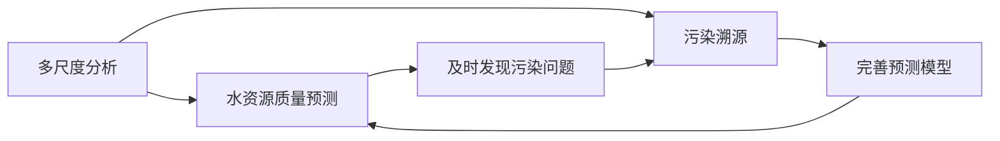

# AI在水资源质量预测与污染溯源中的多尺度应用研究

> 关键词：人工智能、水资源质量预测、污染溯源、多尺度应用、数据驱动模型

> 摘要：本文聚焦于人工智能（AI）在水资源质量预测与污染溯源中的多尺度应用。首先介绍了研究的背景、目的和范围，明确预期读者和文档结构。详细阐述了核心概念，包括多尺度分析、水资源质量预测和污染溯源的原理及联系，并给出相应的文本示意图和Mermaid流程图。深入探讨了核心算法原理，用Python代码进行详细说明。同时给出了相关的数学模型和公式，并举例说明。通过项目实战，展示了代码的实际案例和详细解释。分析了AI在不同场景下的实际应用，推荐了相关的学习资源、开发工具框架和论文著作。最后总结了未来发展趋势与挑战，解答了常见问题，并提供了扩展阅读和参考资料，旨在为相关领域的研究和实践提供全面的技术支持和理论指导。

## 1. 背景介绍 
### 1.1 目的和范围
水资源是人类生存和社会发展的重要基础。然而，随着经济的快速发展和人口的增长，水资源污染问题日益严重。准确预测水资源质量和追溯污染源对于水资源的保护和管理至关重要。本研究的目的是探讨人工智能在水资源质量预测与污染溯源中的多尺度应用，旨在提高预测的准确性和溯源的效率，为水资源管理提供科学依据。

研究范围涵盖了不同尺度的水资源系统，包括河流、湖泊、水库等。研究内容包括人工智能算法在水资源质量预测中的应用、基于多源数据的污染溯源方法，以及如何结合不同尺度的数据进行综合分析。

### 1.2 预期读者
本文预期读者包括从事水资源研究、环境保护、水利工程等领域的科研人员和工程师，以及对人工智能在水资源领域应用感兴趣的技术爱好者。对于希望了解如何利用人工智能技术解决水资源实际问题的人员，本文将提供有价值的参考。

### 1.3 文档结构概述
本文共分为十个部分。第一部分介绍研究的背景、目的、预期读者和文档结构。第二部分阐述核心概念，包括多尺度分析、水资源质量预测和污染溯源的原理及联系。第三部分详细讲解核心算法原理，并使用Python代码进行说明。第四部分给出相关的数学模型和公式，并举例说明。第五部分通过项目实战，展示代码的实际案例和详细解释。第六部分分析AI在不同场景下的实际应用。第七部分推荐相关的学习资源、开发工具框架和论文著作。第八部分总结未来发展趋势与挑战。第九部分解答常见问题。第十部分提供扩展阅读和参考资料。

### 1.4 术语表
#### 1.4.1 核心术语定义
- **人工智能（AI）**：是一门研究如何使计算机系统能够模拟人类智能的学科，包括机器学习、深度学习、自然语言处理等技术。
- **水资源质量预测**：根据历史和实时的水资源数据，预测未来水资源质量的变化趋势。
- **污染溯源**：通过分析水资源中的污染物特征和相关数据，确定污染源的位置和类型。
- **多尺度分析**：对不同空间和时间尺度的数据进行综合分析，以获取更全面的信息。

#### 1.4.2 相关概念解释
- **机器学习**：是人工智能的一个重要分支，通过让计算机从数据中学习模式和规律，从而进行预测和决策。
- **深度学习**：是一种基于神经网络的机器学习方法，能够自动提取数据中的深层次特征。
- **传感器网络**：由多个传感器节点组成的网络，用于实时监测水资源的各种参数。

#### 1.4.3 缩略词列表
- **AI**：Artificial Intelligence
- **ML**：Machine Learning
- **DL**：Deep Learning
- **ANN**：Artificial Neural Network
- **SVM**：Support Vector Machine

## 2. 核心概念与联系 
### 核心概念原理
#### 多尺度分析
多尺度分析是指在不同的空间和时间尺度上对水资源数据进行分析。在空间尺度上，可以从微观的水体局部区域到宏观的流域范围进行分析；在时间尺度上，可以从短期的实时监测到长期的历史数据趋势分析。多尺度分析的原理是不同尺度的数据包含了不同层次的信息，通过综合分析这些信息，可以更全面地了解水资源系统的特征和变化规律。

#### 水资源质量预测
水资源质量预测是利用历史和实时的水资源数据，通过建立合适的模型来预测未来水资源质量的变化趋势。预测的指标包括水质参数（如酸碱度、溶解氧、化学需氧量等）、水量等。预测的原理是基于数据中的模式和规律，通过机器学习或深度学习算法来捕捉这些模式，从而进行预测。

#### 污染溯源
污染溯源是通过分析水资源中的污染物特征和相关数据，确定污染源的位置和类型。溯源的方法包括基于物理模型的方法、基于数据驱动的方法等。基于数据驱动的方法主要是利用机器学习算法对监测数据进行分析，找出与污染源相关的特征和模式，从而实现溯源。

### 核心概念联系
多尺度分析为水资源质量预测和污染溯源提供了更全面的数据支持。通过不同尺度的数据，可以更准确地捕捉水资源系统的变化规律，提高预测和溯源的准确性。水资源质量预测和污染溯源是相互关联的。准确的水资源质量预测可以帮助及时发现潜在的污染问题，为污染溯源提供线索；而污染溯源的结果可以进一步完善水资源质量预测模型，提高预测的准确性。

### 文本示意图
```plaintext
          多尺度分析
         /           \
水资源质量预测     污染溯源
        |             |
  及时发现污染问题   完善预测模型
```

### Mermaid流程图


## 3. 核心算法原理 & 具体操作步骤 
### 核心算法原理
#### 人工神经网络（ANN）
人工神经网络是一种模仿人类神经系统的计算模型，由多个神经元组成。在水资源质量预测中，ANN可以通过学习历史数据中的模式和规律，来预测未来的水质参数。ANN的基本原理是通过输入层接收数据，经过隐藏层的非线性变换，最后在输出层输出预测结果。

#### 支持向量机（SVM）
支持向量机是一种用于分类和回归分析的监督学习算法。在水资源质量预测和污染溯源中，SVM可以通过寻找最优的超平面来对数据进行分类或回归。SVM的优点是在处理高维数据和小样本数据时具有较好的性能。

### 具体操作步骤
#### 数据预处理
首先，收集水资源的历史和实时数据，包括水质参数、水量、气象数据等。然后，对数据进行清洗，去除噪声和异常值。接着，对数据进行归一化处理，将数据缩放到一个合适的范围，以提高算法的性能。

#### 模型训练
将预处理后的数据分为训练集和测试集。使用训练集对ANN或SVM模型进行训练，调整模型的参数，使模型的预测误差最小。

#### 模型评估
使用测试集对训练好的模型进行评估，计算模型的评估指标，如均方误差（MSE）、平均绝对误差（MAE）等。如果评估指标不理想，需要调整模型的参数或选择其他的算法。

#### 预测和溯源
使用训练好的模型对未来的水资源质量进行预测，或对污染源进行溯源。

### Python源代码详细阐述
```python
import numpy as np
from sklearn.neural_network import MLPRegressor
from sklearn.svm import SVR
from sklearn.preprocessing import StandardScaler
from sklearn.model_selection import train_test_split
from sklearn.metrics import mean_squared_error, mean_absolute_error

# 生成示例数据
np.random.seed(0)
X = np.random.rand(100, 5)  # 特征数据
y = np.random.rand(100)  # 目标数据

# 数据预处理
scaler = StandardScaler()
X_scaled = scaler.fit_transform(X)

# 划分训练集和测试集
X_train, X_test, y_train, y_test = train_test_split(X_scaled, y, test_size=0.2, random_state=42)

# 使用人工神经网络进行预测
ann_model = MLPRegressor(hidden_layer_sizes=(10, 10), max_iter=1000)
ann_model.fit(X_train, y_train)
ann_predictions = ann_model.predict(X_test)
ann_mse = mean_squared_error(y_test, ann_predictions)
ann_mae = mean_absolute_error(y_test, ann_predictions)
print(f"ANN MSE: {ann_mse}, ANN MAE: {ann_mae}")

# 使用支持向量机进行预测
svm_model = SVR()
svm_model.fit(X_train, y_train)
svm_predictions = svm_model.predict(X_test)
svm_mse = mean_squared_error(y_test, svm_predictions)
svm_mae = mean_absolute_error(y_test, svm_predictions)
print(f"SVM MSE: {svm_mse}, SVM MAE: {svm_mae}")
```

## 4. 数学模型和公式 & 详细讲解 & 举例说明 
### 人工神经网络（ANN）的数学模型
#### 神经元模型
神经元是ANN的基本单元，其数学模型可以表示为：
$$
y = f\left(\sum_{i=1}^{n} w_{i}x_{i} + b\right)
$$
其中，$x_{i}$ 是输入信号，$w_{i}$ 是连接权重，$b$ 是偏置，$f$ 是激活函数。

#### 多层感知机（MLP）
多层感知机是一种常见的ANN结构，由输入层、隐藏层和输出层组成。对于一个具有 $L$ 层的MLP，第 $l$ 层的输出可以表示为：
$$
\mathbf{a}^{(l)} = f\left(\mathbf{W}^{(l)}\mathbf{a}^{(l - 1)} + \mathbf{b}^{(l)}\right)
$$
其中，$\mathbf{a}^{(l)}$ 是第 $l$ 层的输出向量，$\mathbf{W}^{(l)}$ 是第 $l$ 层的权重矩阵，$\mathbf{b}^{(l)}$ 是第 $l$ 层的偏置向量。

### 支持向量机（SVM）的数学模型
#### 线性可分情况
对于线性可分的数据集，SVM的目标是找到一个最优的超平面 $\mathbf{w}^T\mathbf{x} + b = 0$，使得两类数据点到超平面的间隔最大。这个问题可以转化为以下的优化问题：
$$
\begin{aligned}
\min_{\mathbf{w}, b} &\quad \frac{1}{2}\|\mathbf{w}\|^2 \\
\text{s.t.} &\quad y_i(\mathbf{w}^T\mathbf{x}_i + b) \geq 1, \quad i = 1, 2, \cdots, n
\end{aligned}
$$
其中，$\mathbf{x}_i$ 是数据点，$y_i$ 是数据点的标签。

#### 线性不可分情况
对于线性不可分的数据集，引入松弛变量 $\xi_i$，将优化问题转化为：
$$
\begin{aligned}
\min_{\mathbf{w}, b, \xi} &\quad \frac{1}{2}\|\mathbf{w}\|^2 + C\sum_{i=1}^{n}\xi_i \\
\text{s.t.} &\quad y_i(\mathbf{w}^T\mathbf{x}_i + b) \geq 1 - \xi_i, \quad \xi_i \geq 0, \quad i = 1, 2, \cdots, n
\end{aligned}
$$
其中，$C$ 是惩罚参数。

### 举例说明
假设我们有一个简单的水资源质量预测问题，输入特征为水质参数（如酸碱度、溶解氧等），目标是预测化学需氧量（COD）。我们可以使用ANN或SVM模型进行预测。对于ANN模型，我们可以设置输入层的神经元数量为特征的数量，隐藏层的神经元数量可以根据经验进行调整，输出层的神经元数量为1（即COD的预测值）。对于SVM模型，我们可以选择合适的核函数（如线性核、径向基核等）和惩罚参数 $C$ 进行训练。

## 5. 项目实战：代码实际案例和详细解释说明 
### 5.1  开发环境搭建
#### 安装Python
首先，需要安装Python环境。可以从Python官方网站（https://www.python.org/downloads/）下载适合自己操作系统的Python版本，并按照安装向导进行安装。

#### 安装必要的库
使用pip命令安装必要的库，如NumPy、Pandas、Scikit-learn等。可以在命令行中运行以下命令：
```sh
pip install numpy pandas scikit-learn
```

### 5.2  源代码详细实现和代码解读
```python
import numpy as np
import pandas as pd
from sklearn.neural_network import MLPRegressor
from sklearn.svm import SVR
from sklearn.preprocessing import StandardScaler
from sklearn.model_selection import train_test_split
from sklearn.metrics import mean_squared_error, mean_absolute_error

# 读取数据
data = pd.read_csv('water_quality_data.csv')
X = data.drop('COD', axis=1).values  # 特征数据
y = data['COD'].values  # 目标数据

# 数据预处理
scaler = StandardScaler()
X_scaled = scaler.fit_transform(X)

# 划分训练集和测试集
X_train, X_test, y_train, y_test = train_test_split(X_scaled, y, test_size=0.2, random_state=42)

# 使用人工神经网络进行预测
ann_model = MLPRegressor(hidden_layer_sizes=(10, 10), max_iter=1000)
ann_model.fit(X_train, y_train)
ann_predictions = ann_model.predict(X_test)
ann_mse = mean_squared_error(y_test, ann_predictions)
ann_mae = mean_absolute_error(y_test, ann_predictions)
print(f"ANN MSE: {ann_mse}, ANN MAE: {ann_mae}")

# 使用支持向量机进行预测
svm_model = SVR()
svm_model.fit(X_train, y_train)
svm_predictions = svm_model.predict(X_test)
svm_mse = mean_squared_error(y_test, svm_predictions)
svm_mae = mean_absolute_error(y_test, svm_predictions)
print(f"SVM MSE: {svm_mse}, SVM MAE: {svm_mae}")
```
#### 代码解读
1. **数据读取**：使用Pandas库的`read_csv`函数读取水资源质量数据文件。
2. **数据预处理**：使用`StandardScaler`对特征数据进行归一化处理，将数据缩放到均值为0，标准差为1的范围。
3. **划分训练集和测试集**：使用`train_test_split`函数将数据划分为训练集和测试集，测试集占总数据的20%。
4. **模型训练和预测**：分别使用`MLPRegressor`和`SVR`进行模型训练，并对测试集进行预测。
5. **模型评估**：使用`mean_squared_error`和`mean_absolute_error`计算模型的均方误差和平均绝对误差。

### 5.3  代码解读与分析
#### ANN模型
ANN模型通过多层神经元的非线性变换来学习数据中的模式和规律。在代码中，我们设置了两个隐藏层，每个隐藏层有10个神经元。`max_iter`参数表示最大迭代次数，即模型训练的最大轮数。

#### SVM模型
SVM模型通过寻找最优的超平面来进行分类或回归。在代码中，我们使用了默认的参数进行训练。可以根据实际情况调整核函数和惩罚参数 $C$ 来提高模型的性能。

## 6. 实际应用场景 
### 河流污染监测与管理
在河流污染监测中，AI可以实时分析传感器网络收集的水质数据，预测水质的变化趋势。一旦发现水质异常，系统可以及时发出警报，并通过污染溯源技术确定污染源的位置和类型。这有助于环保部门及时采取措施，减少河流污染的影响。

### 湖泊富营养化预测
湖泊富营养化是一个严重的环境问题，会导致藻类大量繁殖，影响水质和生态系统。AI可以通过分析湖泊的水质、气象、水文等多源数据，预测湖泊富营养化的发生概率和程度。这有助于管理者提前采取措施，如控制污染物排放、增加水体流动等，预防湖泊富营养化的发生。

### 水库水质保障
水库是重要的水资源储备设施，保障水库水质对于供水安全至关重要。AI可以对水库的水质进行实时监测和预测，及时发现潜在的污染问题。同时，通过污染溯源技术，可以确定污染源的来源，采取针对性的措施进行治理。

## 7. 工具和资源推荐
### 7.1 学习资源推荐
#### 7.1.1 书籍推荐
- 《Python机器学习》：介绍了Python在机器学习中的应用，包括各种机器学习算法的原理和实现。
- 《深度学习》：由深度学习领域的三位权威专家撰写，全面介绍了深度学习的理论和实践。
- 《水资源系统分析》：讲解了水资源系统的建模、分析和管理方法，对于理解水资源问题有很大帮助。

#### 7.1.2 在线课程
- Coursera上的“机器学习”课程：由斯坦福大学教授Andrew Ng授课，是机器学习领域的经典课程。
- edX上的“深度学习基础”课程：介绍了深度学习的基本概念和方法，适合初学者。
- 中国大学MOOC上的“水资源规划与管理”课程：讲解了水资源规划和管理的相关知识。

#### 7.1.3 技术博客和网站
- Medium：有很多关于人工智能和水资源领域的技术博客，可以了解最新的研究成果和实践经验。
- Kaggle：是一个数据科学竞赛平台，上面有很多关于水资源数据的竞赛和数据集，可以通过参与竞赛来提高自己的技能。
- 中国环境监测总站网站：提供了大量的水资源监测数据和相关报告，可以作为研究的参考。

### 7.2 开发工具框架推荐
#### 7.2.1 IDE和编辑器
- PyCharm：是一款专业的Python集成开发环境，提供了丰富的代码编辑、调试和部署功能。
- Jupyter Notebook：是一个交互式的编程环境，适合进行数据探索和模型实验。

#### 7.2.2 调试和性能分析工具
- TensorBoard：是TensorFlow提供的可视化工具，可以用于查看模型的训练过程和性能指标。
- Scikit-learn的`GridSearchCV`：可以用于模型的参数调优，提高模型的性能。

#### 7.2.3 相关框架和库
- TensorFlow：是一个开源的深度学习框架，提供了丰富的工具和函数，用于构建和训练深度学习模型。
- PyTorch：是另一个流行的深度学习框架，具有动态图的优势，适合快速开发和实验。
- Scikit-learn：是一个用于机器学习的Python库，提供了各种机器学习算法和工具，方便进行数据处理和模型训练。

### 7.3 相关论文著作推荐
#### 7.3.1 经典论文
- “A Neural Network Approach for River Water Quality Prediction”：介绍了使用神经网络进行河流水质预测的方法。
- “Support Vector Machines for Water Quality Classification”：探讨了支持向量机在水质分类中的应用。

#### 7.3.2 最新研究成果
- 可以通过IEEE Xplore、ACM Digital Library等学术数据库搜索关于AI在水资源领域的最新研究论文。

#### 7.3.3 应用案例分析
- 一些国际知名的环境科学期刊，如《Water Research》、《Environmental Science & Technology》等，会发表关于AI在水资源质量预测和污染溯源方面的应用案例分析。

## 8. 总结：未来发展趋势与挑战
### 未来发展趋势
#### 多模态数据融合
未来，AI在水资源领域的应用将更加注重多模态数据的融合，包括水质监测数据、气象数据、地理信息数据等。通过融合不同类型的数据，可以更全面地了解水资源系统的特征和变化规律，提高预测和溯源的准确性。

#### 深度学习的应用
深度学习在图像识别、自然语言处理等领域取得了巨大的成功，未来将在水资源领域得到更广泛的应用。例如，使用卷积神经网络（CNN）对卫星图像进行分析，监测水资源的分布和变化；使用循环神经网络（RNN）对时间序列数据进行预测，提高水资源质量预测的精度。

#### 智能决策支持系统
结合AI技术和水资源管理的专业知识，开发智能决策支持系统。该系统可以根据实时的水资源数据和预测结果，为水资源管理者提供科学的决策建议，提高水资源管理的效率和科学性。

### 挑战
#### 数据质量和数量
高质量的数据是AI模型训练的基础。然而，目前水资源监测数据存在质量不高、数量不足等问题，这会影响模型的性能。需要加强水资源监测网络的建设，提高数据的质量和数量。

#### 模型可解释性
深度学习模型通常是黑箱模型，难以解释其决策过程。在水资源管理中，模型的可解释性非常重要，因为管理者需要了解模型的决策依据。需要研究如何提高AI模型的可解释性，使其能够为水资源管理提供可靠的支持。

#### 跨学科合作
AI在水资源领域的应用需要计算机科学、水资源科学、环境科学等多个学科的知识。需要加强跨学科合作，培养复合型人才，推动AI技术在水资源领域的应用和发展。

## 9. 附录：常见问题与解答
### 问题1：AI模型在水资源质量预测中的准确性如何？
答：AI模型的准确性受到多种因素的影响，如数据质量、模型选择、参数调优等。在实际应用中，需要通过不断地优化模型和调整参数，提高模型的准确性。同时，可以结合多种模型进行预测，综合考虑不同模型的结果，提高预测的可靠性。

### 问题2：如何选择合适的AI算法进行水资源质量预测和污染溯源？
答：选择合适的AI算法需要考虑数据的特点、问题的复杂度和应用场景等因素。对于线性问题，可以选择线性回归、支持向量机等算法；对于非线性问题，可以选择人工神经网络、决策树等算法。在实际应用中，可以通过实验比较不同算法的性能，选择最优的算法。

### 问题3：AI在水资源质量预测和污染溯源中的应用成本高吗？
答：AI在水资源质量预测和污染溯源中的应用成本主要包括数据采集、模型训练和硬件设备等方面的成本。随着技术的发展和硬件成本的降低，应用成本会逐渐降低。同时，AI技术可以提高水资源管理的效率和科学性，减少因水资源污染带来的损失，从长远来看，具有较高的性价比。

## 10. 扩展阅读 & 参考资料
### 扩展阅读
- 《人工智能导论》：全面介绍了人工智能的基本概念、方法和应用。
- 《水资源保护与管理》：深入探讨了水资源保护和管理的理论和实践。

### 参考资料
- 中国环境监测总站发布的水资源监测报告。
- 相关学术期刊上发表的关于AI在水资源领域应用的研究论文。

作者：AI天才研究院/AI Genius Institute & 禅与计算机程序设计艺术 /Zen And The Art of Computer Programming