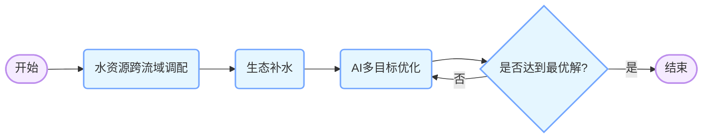

# AI在水资源跨流域调配与生态补水中的多目标优化研究

> 关键词：人工智能、水资源跨流域调配、生态补水、多目标优化、水资源管理

> 摘要：本文聚焦于AI在水资源跨流域调配与生态补水中的多目标优化研究。首先介绍了研究的背景、目的、预期读者和文档结构，阐述了相关术语。接着详细讲解了核心概念，包括水资源跨流域调配和生态补水的原理以及它们与AI的联系，并给出了相应的文本示意图和Mermaid流程图。深入分析了核心算法原理，用Python代码展示具体操作步骤。通过数学模型和公式进一步阐述多目标优化的本质，并举例说明。进行项目实战，从开发环境搭建到源代码实现和解读，详细呈现了AI在该领域的应用过程。探讨了实际应用场景，推荐了相关的学习资源、开发工具框架和论文著作。最后总结了未来发展趋势与挑战，解答常见问题并提供扩展阅读和参考资料，旨在为该领域的研究和实践提供全面而深入的指导。

## 1. 背景介绍 
### 1.1 目的和范围
水资源是人类生存和社会发展的重要基础资源。然而，由于地理、气候等因素的影响，水资源在地域上的分布极不均衡，这就导致了部分地区水资源短缺，而部分地区水资源过剩的现象。水资源跨流域调配作为解决水资源空间分布不均的重要手段，能够将水资源丰富地区的水调配到缺水地区，以满足不同地区的用水需求。同时，生态补水对于维护生态系统的平衡和稳定也至关重要。

本研究的目的在于利用人工智能（AI）技术对水资源跨流域调配与生态补水进行多目标优化。通过AI算法，综合考虑水资源的供需平衡、生态环境的保护、经济成本的控制等多个目标，实现水资源的高效、合理调配和生态补水的科学实施。研究范围涵盖了从数据收集、模型构建、算法优化到实际应用的整个过程，旨在为水资源管理部门和相关决策机构提供科学、有效的决策支持。

### 1.2 预期读者
本文的预期读者主要包括从事水资源管理、水利工程、环境科学等领域的科研人员和专业技术人员，他们可以从本文中获取AI在水资源跨流域调配与生态补水中的最新研究成果和技术方法，为自己的研究和实践提供参考。同时，水资源管理部门的决策者也可以通过阅读本文，了解如何利用AI技术进行多目标优化，从而制定更加科学合理的水资源调配和生态补水政策。此外，对人工智能和水资源领域感兴趣的高校师生也可以从本文中学习到相关的理论知识和实践经验。

### 1.3 文档结构概述
本文共分为十个部分。第一部分为背景介绍，阐述了研究的目的、范围、预期读者和文档结构，并对相关术语进行了定义和解释。第二部分介绍了核心概念与联系，包括水资源跨流域调配、生态补水和AI的原理，以及它们之间的相互关系，并给出了文本示意图和Mermaid流程图。第三部分详细讲解了核心算法原理和具体操作步骤，通过Python代码展示了如何实现多目标优化。第四部分介绍了数学模型和公式，并进行了详细讲解和举例说明。第五部分进行项目实战，包括开发环境搭建、源代码详细实现和代码解读。第六部分探讨了实际应用场景。第七部分推荐了相关的学习资源、开发工具框架和论文著作。第八部分总结了未来发展趋势与挑战。第九部分为附录，解答了常见问题。第十部分提供了扩展阅读和参考资料。

### 1.4 术语表
#### 1.4.1 核心术语定义
- **水资源跨流域调配**：指通过水利工程设施，将水资源从一个流域调配到另一个流域，以缓解水资源空间分布不均的问题。
- **生态补水**：为了维护生态系统的平衡和稳定，向生态环境缺水的区域补充水资源的行为。
- **多目标优化**：在多个相互冲突的目标之间寻求最优解的过程，使得各个目标都能在一定程度上得到满足。
- **人工智能（AI）**：研究、开发用于模拟、延伸和扩展人的智能的理论、方法、技术及应用系统的一门新的技术科学。

#### 1.4.2 相关概念解释
- **水资源供需平衡**：指在一定的时间和空间范围内，水资源的供给量与需求量达到平衡的状态。
- **生态系统服务功能**：指生态系统为人类提供的各种利益和服务，如水源涵养、水质净化、生物多样性保护等。
- **经济成本**：在水资源跨流域调配和生态补水中所涉及的各种费用，包括工程建设成本、运行维护成本等。

#### 1.4.3 缩略词列表
- **AI**：Artificial Intelligence（人工智能）
- **MOO**：Multi - Objective Optimization（多目标优化）
- **GIS**：Geographic Information System（地理信息系统）

## 2. 核心概念与联系 

### 2.1 水资源跨流域调配原理
水资源跨流域调配的基本原理是通过建设水利工程，如输水渠道、泵站、水库等，将水资源从水资源丰富的流域输送到水资源短缺的流域。在调配过程中，需要考虑水源地的水资源状况、受水区的用水需求、工程建设和运行成本、生态环境影响等因素。例如，南水北调工程就是典型的水资源跨流域调配工程，它将长江水调往北方地区，缓解了北方地区的水资源短缺问题。

### 2.2 生态补水原理
生态补水的原理是根据生态系统的需水规律，向生态环境缺水的区域补充适量的水资源，以恢复和维护生态系统的结构和功能。生态补水的对象包括河流、湖泊、湿地等生态系统。例如，通过向干涸的湖泊补水，可以恢复湖泊的水面面积，改善水质，为水生生物提供适宜的生存环境。

### 2.3 AI与水资源跨流域调配和生态补水的联系
AI技术可以为水资源跨流域调配和生态补水提供强大的支持。一方面，AI可以处理大量的水资源数据，包括气象数据、水文数据、用水数据等，通过数据分析和挖掘，准确预测水资源的供需情况和生态系统的需水规律。另一方面，AI可以用于多目标优化，综合考虑水资源调配的经济效益、社会效益和生态效益，制定最优的调配方案。例如，利用机器学习算法可以对水资源调配过程进行建模和预测，利用优化算法可以求解多目标优化问题，找到最佳的调配策略。

### 2.4 文本示意图
```plaintext
+----------------------+
| 水资源跨流域调配     |
|                      |
| - 水源地选择         |
| - 输水工程建设       |
| - 水量分配           |
+----------------------+
           |
           v
+----------------------+
| 生态补水             |
|                      |
| - 生态需水计算       |
| - 补水时机选择       |
| - 补水效果评估       |
+----------------------+
           |
           v
+----------------------+
| AI多目标优化         |
|                      |
| - 数据处理与分析     |
| - 模型构建与训练     |
| - 优化算法求解       |
+----------------------+
```

### 2.5 Mermaid流程图


## 3. 核心算法原理 & 具体操作步骤 

### 3.1 核心算法原理
在水资源跨流域调配与生态补水中的多目标优化问题中，常用的算法有遗传算法（Genetic Algorithm，GA）、粒子群优化算法（Particle Swarm Optimization，PSO）等。这里以遗传算法为例进行介绍。

遗传算法是一种模拟自然选择和遗传机制的优化算法。它通过对一组候选解（个体）进行选择、交叉和变异等操作，不断进化出更优的解。在多目标优化中，每个个体代表一个可能的调配方案，每个方案包含多个目标值，如水资源调配成本、生态效益等。

### 3.2 具体操作步骤

#### 3.2.1 初始化种群
随机生成一组初始的调配方案，每个方案表示为一个染色体。染色体由多个基因组成，每个基因对应一个调配参数，如调配水量、调配时间等。

#### 3.2.2 评估适应度
计算每个个体的适应度值，适应度值反映了该个体在多个目标上的综合表现。可以使用加权求和的方法将多个目标值转化为一个适应度值。

#### 3.2.3 选择操作
根据适应度值选择一部分个体作为父代，用于产生下一代个体。常用的选择方法有轮盘赌选择、锦标赛选择等。

#### 3.2.4 交叉操作
对选中的父代个体进行交叉操作，生成新的子代个体。交叉操作模拟了生物的基因交换过程，通过交换父代个体的部分基因，产生新的调配方案。

#### 3.2.5 变异操作
对子代个体进行变异操作，随机改变某些基因的值，以增加种群的多样性。变异操作可以避免算法陷入局部最优解。

#### 3.2.6 终止条件判断
判断是否满足终止条件，如达到最大迭代次数、适应度值不再提高等。如果满足终止条件，则输出最优解；否则，返回步骤3.2.2继续迭代。

### 3.3 Python源代码实现

```python
import numpy as np
import random

# 定义目标函数
def objective_functions(x):
    # 这里简单假设两个目标函数
    f1 = x[0]**2
    f2 = (x[0] - 2)**2
    return [f1, f2]

# 初始化种群
def initialize_population(pop_size, gene_length):
    population = []
    for _ in range(pop_size):
        individual = [random.uniform(-5, 5) for _ in range(gene_length)]
        population.append(individual)
    return population

# 评估适应度
def evaluate_fitness(population):
    fitness_values = []
    for individual in population:
        objectives = objective_functions(individual)
        # 简单加权求和作为适应度
        fitness = sum(objectives)
        fitness_values.append(fitness)
    return fitness_values

# 选择操作（轮盘赌选择）
def roulette_wheel_selection(population, fitness_values):
    total_fitness = sum(fitness_values)
    selection_probs = [fitness / total_fitness for fitness in fitness_values]
    selected_indices = []
    for _ in range(len(population)):
        r = random.random()
        cumulative_prob = 0
        for i, prob in enumerate(selection_probs):
            cumulative_prob += prob
            if cumulative_prob >= r:
                selected_indices.append(i)
                break
    selected_population = [population[i] for i in selected_indices]
    return selected_population

# 交叉操作
def crossover(parent1, parent2):
    crossover_point = random.randint(1, len(parent1) - 1)
    child1 = parent1[:crossover_point] + parent2[crossover_point:]
    child2 = parent2[:crossover_point] + parent1[crossover_point:]
    return child1, child2

# 变异操作
def mutation(individual, mutation_rate):
    for i in range(len(individual)):
        if random.random() < mutation_rate:
            individual[i] = random.uniform(-5, 5)
    return individual

# 遗传算法主函数
def genetic_algorithm(pop_size, gene_length, max_generations, mutation_rate):
    population = initialize_population(pop_size, gene_length)
    for generation in range(max_generations):
        fitness_values = evaluate_fitness(population)
        selected_population = roulette_wheel_selection(population, fitness_values)
        new_population = []
        for i in range(0, pop_size, 2):
            parent1 = selected_population[i]
            parent2 = selected_population[i + 1]
            child1, child2 = crossover(parent1, parent2)
            child1 = mutation(child1, mutation_rate)
            child2 = mutation(child2, mutation_rate)
            new_population.extend([child1, child2])
        population = new_population
    best_index = np.argmin(evaluate_fitness(population))
    best_solution = population[best_index]
    return best_solution

# 运行遗传算法
pop_size = 50
gene_length = 1
max_generations = 100
mutation_rate = 0.1
best_solution = genetic_algorithm(pop_size, gene_length, max_generations, mutation_rate)
print("最优解:", best_solution)
```

## 4. 数学模型和公式 & 详细讲解 & 举例说明 

### 4.1 多目标优化数学模型
在水资源跨流域调配与生态补水中的多目标优化问题可以表示为以下数学模型：

$$
\begin{align*}
\min &\quad F(x) = [f_1(x), f_2(x), \cdots, f_k(x)]^T\\
\text{s.t.} &\quad g_i(x) \leq 0, \quad i = 1, 2, \cdots, m\\
&\quad h_j(x) = 0, \quad j = 1, 2, \cdots, n\\
&\quad x_{l} \leq x \leq x_{u}
\end{align*}
$$

其中，$x$ 是决策变量向量，代表水资源调配方案；$F(x)$ 是目标函数向量，包含 $k$ 个目标函数，如水资源调配成本、生态效益等；$g_i(x)$ 是不等式约束条件，如水资源供需平衡约束、生态需水约束等；$h_j(x)$ 是等式约束条件；$x_{l}$ 和 $x_{u}$ 分别是决策变量的下界和上界。

### 4.2 详细讲解
- **目标函数**：目标函数反映了我们希望优化的多个目标。例如，$f_1(x)$ 可以表示水资源调配的经济成本，$f_2(x)$ 可以表示生态补水对生态系统服务功能的提升程度。在实际应用中，目标函数的具体形式需要根据问题的特点和需求进行确定。
- **约束条件**：约束条件是为了保证调配方案的可行性。不等式约束 $g_i(x) \leq 0$ 可以表示各种资源限制和条件限制，如水源地的可供水量、受水区的最大用水量等。等式约束 $h_j(x) = 0$ 可以表示一些平衡关系，如水资源的供需平衡。
- **决策变量**：决策变量 $x$ 是我们可以控制的调配参数，如调配水量、调配时间等。决策变量的取值范围由 $x_{l}$ 和 $x_{u}$ 限定。

### 4.3 举例说明
假设我们要解决一个简单的水资源跨流域调配问题，有两个目标：最小化调配成本 $f_1(x)$ 和最大化生态效益 $f_2(x)$。决策变量 $x$ 表示从水源地调配到受水区的水量。

- **目标函数**：
  - 调配成本 $f_1(x) = c \cdot x$，其中 $c$ 是单位水量的调配成本。
  - 生态效益 $f_2(x) = - (x - x_{opt})^2$，其中 $x_{opt}$ 是使生态效益最大的调配水量。

- **约束条件**：
  - 水源地可供水量约束：$x \leq Q_{s}$，其中 $Q_{s}$ 是水源地的可供水量。
  - 受水区最大用水量约束：$x \leq Q_{d}$，其中 $Q_{d}$ 是受水区的最大用水量。

- **数学模型**：
$$
\begin{align*}
\min &\quad F(x) = [c \cdot x, - (x - x_{opt})^2]^T\\
\text{s.t.} &\quad x \leq Q_{s}\\
&\quad x \leq Q_{d}\\
&\quad 0 \leq x
\end{align*}
$$

通过求解这个数学模型，我们可以找到在满足约束条件下，使调配成本最小和生态效益最大的最优调配水量 $x$。

## 5. 项目实战：代码实际案例和详细解释说明 

### 5.1  开发环境搭建
#### 5.1.1 操作系统
可以选择常见的操作系统，如Windows、Linux或macOS。这里以Windows系统为例进行说明。

#### 5.1.2 Python环境安装
首先，从Python官方网站（https://www.python.org/downloads/）下载适合Windows系统的Python安装包。安装过程中，注意勾选“Add Python to PATH”选项，以便在命令行中可以直接使用Python命令。

#### 5.1.3 安装必要的库
在命令行中使用以下命令安装必要的库：
```sh
pip install numpy matplotlib
```
- `numpy`：用于数值计算和数组操作。
- `matplotlib`：用于数据可视化。

### 5.2  源代码详细实现和代码解读
以下是一个更完整的项目实战代码示例，用于解决水资源跨流域调配与生态补水中的多目标优化问题。

```python
import numpy as np
import matplotlib.pyplot as plt
from deap import base, creator, tools, algorithms

# 定义问题参数
num_sources = 2  # 水源地数量
num_destinations = 3  # 受水区数量
num_generations = 100  # 迭代次数
pop_size = 100  # 种群大小

# 定义目标函数
def objective_functions(individual):
    # 重新组织个体为调配矩阵
    allocation_matrix = np.array(individual).reshape(num_sources, num_destinations)
    
    # 目标1：最小化调配成本
    cost_matrix = np.random.rand(num_sources, num_destinations)  # 随机生成成本矩阵
    total_cost = np.sum(allocation_matrix * cost_matrix)
    
    # 目标2：最大化生态效益
    eco_matrix = np.random.rand(num_sources, num_destinations)  # 随机生成生态效益矩阵
    total_eco_benefit = np.sum(allocation_matrix * eco_matrix)
    
    return total_cost, -total_eco_benefit  # 最大化生态效益转换为最小化负生态效益

# 定义适应度和个体类型
creator.create("FitnessMin", base.Fitness, weights=(-1.0, -1.0))
creator.create("Individual", list, fitness=creator.FitnessMin)

# 初始化工具盒
toolbox = base.Toolbox()
toolbox.register("attr_float", np.random.uniform, 0, 10)
toolbox.register("individual", tools.initRepeat, creator.Individual, toolbox.attr_float, n=num_sources * num_destinations)
toolbox.register("population", tools.initRepeat, list, toolbox.individual)

# 注册评估、交叉、变异和选择操作
toolbox.register("evaluate", objective_functions)
toolbox.register("mate", tools.cxTwoPoint)
toolbox.register("mutate", tools.mutGaussian, mu=0, sigma=1, indpb=0.1)
toolbox.register("select", tools.selNSGA2)

def main():
    # 初始化种群
    pop = toolbox.population(n=pop_size)
    
    # 运行NSGA-II算法
    hof = tools.HallOfFame(1)
    stats = tools.Statistics(lambda ind: ind.fitness.values)
    stats.register("avg", np.mean, axis=0)
    stats.register("min", np.min, axis=0)
    
    pop, log = algorithms.eaMuPlusLambda(pop, toolbox, mu=pop_size, lambda_=pop_size,
                                         cxpb=0.7, mutpb=0.2, ngen=num_generations,
                                         stats=stats, halloffame=hof, verbose=True)
    
    # 提取最优解
    best_individuals = hof.items
    best_costs = [ind.fitness.values[0] for ind in best_individuals]
    best_eco_benefits = [-ind.fitness.values[1] for ind in best_individuals]
    
    # 绘制帕累托前沿
    plt.scatter(best_costs, best_eco_benefits)
    plt.xlabel('调配成本')
    plt.ylabel('生态效益')
    plt.title('帕累托前沿')
    plt.show()
    
    return pop, log, hof

if __name__ == "__main__":
    main()
```

### 5.3  代码解读与分析
#### 5.3.1 代码整体功能
这段代码使用Python的`deap`库实现了NSGA-II算法，用于解决水资源跨流域调配与生态补水中的多目标优化问题。目标是在最小化调配成本的同时最大化生态效益。

#### 5.3.2 代码详细解读
- **参数定义**：定义了水源地数量、受水区数量、迭代次数和种群大小等参数。
- **目标函数**：`objective_functions`函数计算了两个目标值：调配成本和生态效益。将最大化生态效益转换为最小化负生态效益，以适应多目标优化算法的要求。
- **适应度和个体类型定义**：使用`deap`库的`creator`模块定义了适应度类型和个体类型。
- **工具盒初始化**：使用`deap`库的`toolbox`模块注册了个体初始化、种群初始化、评估、交叉、变异和选择等操作。
- **主函数**：`main`函数初始化种群，运行NSGA-II算法，记录统计信息，并绘制帕累托前沿。

#### 5.3.3 代码分析
通过运行这段代码，我们可以得到一组最优的调配方案，这些方案构成了帕累托前沿。决策者可以根据实际需求在帕累托前沿上选择合适的方案，以平衡调配成本和生态效益。

## 6. 实际应用场景 
### 6.1 大型跨流域调水工程
在像南水北调这样的大型跨流域调水工程中，AI多目标优化技术可以发挥重要作用。通过综合考虑水源地的水资源状况、输水工程的建设和运行成本、受水区的用水需求以及生态环境影响等多个目标，利用AI算法可以制定出最优的调水方案。例如，根据不同季节和不同地区的用水需求变化，动态调整调水量和调水时间，以提高水资源的利用效率和生态效益。

### 6.2 城市水资源管理
在城市水资源管理中，AI多目标优化可以用于解决城市内部水资源的调配和生态补水问题。城市中的水资源包括地表水、地下水、再生水等多种水源，需要合理调配以满足居民生活、工业生产和生态环境等不同方面的用水需求。同时，城市中的河流、湖泊等生态系统也需要进行生态补水以维护生态平衡。通过AI技术，可以对城市水资源进行实时监测和分析，制定出科学合理的水资源调配和生态补水方案。

### 6.3 生态保护区水资源保障
对于生态保护区，如湿地保护区、自然保护区等，水资源的保障至关重要。AI多目标优化可以根据生态保护区的生态需水规律，合理调配周边水资源进行生态补水。同时，考虑到生态保护区的生态保护要求和经济成本等因素，制定出最优的补水方案，以确保生态保护区的生态系统健康稳定。

## 7. 工具和资源推荐
### 7.1 学习资源推荐
#### 7.1.1 书籍推荐
- 《水资源系统分析》：这本书系统介绍了水资源系统的分析方法和模型，包括水资源规划、调配、管理等方面的内容，对于理解水资源跨流域调配和生态补水的原理和方法有很大帮助。
- 《人工智能：一种现代的方法》：经典的人工智能教材，涵盖了人工智能的各个领域，包括机器学习、优化算法等，对于学习AI在水资源领域的应用有重要的参考价值。
- 《多目标优化》：专门介绍多目标优化的理论和方法，详细讲解了各种多目标优化算法的原理和应用，对于解决水资源跨流域调配与生态补水中的多目标优化问题有很大的指导作用。

#### 7.1.2 在线课程
- Coursera上的“Machine Learning”课程：由Andrew Ng教授讲授，是学习机器学习的经典课程，涵盖了机器学习的基本概念、算法和应用，对于理解AI在水资源领域的应用基础有很大帮助。
- edX上的“Artificial Intelligence”课程：全面介绍了人工智能的各个方面，包括搜索算法、知识表示、机器学习等，对于深入学习AI技术有很大的帮助。
- 中国大学MOOC上的“水资源规划与管理”课程：系统介绍了水资源规划与管理的理论和方法，对于了解水资源跨流域调配和生态补水的实际应用有很大的帮助。

#### 7.1.3 技术博客和网站
- Towards Data Science：一个专注于数据科学和人工智能的技术博客，上面有很多关于机器学习、优化算法等方面的文章，对于学习AI技术和其在水资源领域的应用有很大的启发。
- AI开源社区：提供了丰富的AI开源项目和代码示例，对于学习和实践AI技术有很大的帮助。
- 中国水利网：提供了大量的水资源管理和水利工程方面的信息，对于了解水资源跨流域调配和生态补水的实际情况有很大的帮助。

### 7.2 开发工具框架推荐
#### 7.2.1 IDE和编辑器
- PyCharm：一款专业的Python集成开发环境，具有强大的代码编辑、调试和项目管理功能，适合开发Python项目。
- Jupyter Notebook：一个交互式的开发环境，支持Python等多种编程语言，适合进行数据分析和模型开发。
- Visual Studio Code：一款轻量级的代码编辑器，具有丰富的插件和扩展功能，支持多种编程语言，适合快速开发和调试代码。

#### 7.2.2 调试和性能分析工具
- PySnooper：一个简单易用的Python调试工具，可以自动记录函数的执行过程和变量的值，方便调试代码。
- cProfile：Python标准库中的性能分析工具，可以分析代码的运行时间和函数调用情况，帮助优化代码性能。
- TensorBoard：一个用于可视化深度学习模型训练过程的工具，可以直观地查看模型的训练损失、准确率等指标，方便调试和优化模型。

#### 7.2.3 相关框架和库
- NumPy：一个用于数值计算和数组操作的Python库，提供了高效的数组对象和各种数学函数，是Python科学计算的基础库。
- Pandas：一个用于数据处理和分析的Python库，提供了灵活的数据结构和数据操作方法，适合处理水资源数据。
- Scikit-learn：一个用于机器学习的Python库，提供了各种机器学习算法和工具，如分类、回归、聚类等，适合进行水资源数据的分析和建模。
- DEAP：一个用于进化算法的Python库，提供了各种进化算法的实现，如遗传算法、粒子群优化算法等，适合解决水资源跨流域调配与生态补水中的多目标优化问题。

### 7.3 相关论文著作推荐
#### 7.3.1 经典论文
- "A Fast Elitist Non-dominated Sorting Genetic Algorithm for Multi-objective Optimization: NSGA-II"：这篇论文提出了NSGA-II算法，是多目标优化领域的经典算法之一，对于解决水资源跨流域调配与生态补水中的多目标优化问题有重要的参考价值。
- "Particle Swarm Optimization"：这篇论文提出了粒子群优化算法，是一种高效的优化算法，在水资源领域有广泛的应用。
- "Water Resources Systems Analysis: An Introduction"：这篇论文系统介绍了水资源系统分析的方法和模型，对于理解水资源跨流域调配和生态补水的原理和方法有很大帮助。

#### 7.3.2 最新研究成果
- 近年来，随着AI技术的不断发展，越来越多的研究将AI应用于水资源跨流域调配与生态补水中。可以通过学术数据库，如IEEE Xplore、ACM Digital Library、Web of Science等，搜索相关的最新研究成果。

#### 7.3.3 应用案例分析
- 可以参考一些实际的水资源跨流域调配和生态补水项目的案例分析报告，了解AI技术在实际项目中的应用情况和效果。例如，南水北调工程的相关研究报告和案例分析，对于理解AI在大型跨流域调水工程中的应用有很大的帮助。

## 8. 总结：未来发展趋势与挑战
### 8.1 未来发展趋势
#### 8.1.1 AI技术的不断创新
随着人工智能技术的不断发展，新的算法和模型将不断涌现，如深度学习、强化学习等。这些新技术将为水资源跨流域调配与生态补水中的多目标优化提供更强大的工具和方法。例如，深度学习可以处理更复杂的水资源数据，强化学习可以实现实时动态的调配决策。

#### 8.1.2 数据驱动的决策支持
未来，水资源管理将更加依赖于数据。通过建立完善的水资源数据监测和收集系统，获取更全面、准确的水资源数据。利用AI技术对这些数据进行分析和挖掘，为水资源调配和生态补水决策提供更科学、准确的支持。

#### 8.1.3 多学科融合
水资源跨流域调配与生态补水是一个复杂的系统工程，涉及到水利工程、环境科学、计算机科学等多个学科。未来，将加强多学科的融合，综合运用各学科的知识和技术，解决水资源领域的复杂问题。

### 8.2 挑战
#### 8.2.1 数据质量和共享问题
水资源数据的质量和共享是影响AI应用效果的重要因素。目前，水资源数据存在数据不准确、不完整、不及时等问题，同时数据共享机制也不完善。需要加强数据质量管理和数据共享平台建设，提高数据的可用性和可靠性。

#### 8.2.2 算法复杂度和计算资源需求
一些先进的AI算法，如深度学习算法，具有较高的复杂度和计算资源需求。在实际应用中，可能会面临计算资源不足的问题。需要研究和开发高效的算法和计算方法，降低算法的复杂度和计算资源需求。

#### 8.2.3 社会和政策因素
水资源跨流域调配和生态补水涉及到众多的社会和政策因素，如地区利益协调、公众参与等。在实际应用中，需要充分考虑这些因素，制定合理的政策和措施，确保AI技术的应用能够得到社会的认可和支持。

## 9. 附录：常见问题与解答
### 9.1 如何选择合适的AI算法进行多目标优化？
选择合适的AI算法进行多目标优化需要考虑多个因素，如问题的复杂度、目标函数的特点、约束条件的类型等。一般来说，对于简单的多目标优化问题，可以选择遗传算法、粒子群优化算法等传统算法；对于复杂的多目标优化问题，可以考虑使用深度学习、强化学习等先进算法。同时，还可以参考相关的文献和研究成果，了解不同算法在类似问题中的应用效果。

### 9.2 如何处理水资源数据的不确定性？
水资源数据存在不确定性，如气象数据的预测误差、水文数据的测量误差等。可以采用概率统计方法、模糊数学方法等处理数据的不确定性。例如，使用蒙特卡罗模拟方法对水资源数据进行多次抽样，得到不同情况下的调配方案，然后综合考虑这些方案的结果，制定出更稳健的决策。

### 9.3 如何评估AI多目标优化方案的效果？
可以从多个方面评估AI多目标优化方案的效果，如目标函数值的改善程度、约束条件的满足情况、方案的可行性和稳定性等。同时，可以进行实际案例的应用和验证，比较优化方案与传统方案的效果差异。此外，还可以邀请相关领域的专家进行评估和论证，综合考虑各方面的意见和建议。

## 10. 扩展阅读 & 参考资料
### 10.1 扩展阅读
- 《水资源经济学》：深入介绍了水资源的经济价值和水资源管理的经济手段，对于理解水资源跨流域调配和生态补水的经济因素有很大帮助。
- 《生态水文学》：系统介绍了生态系统与水文过程的相互关系，对于理解生态补水的原理和方法有重要的参考价值。
- 《人工智能在水利工程中的应用》：专门介绍了AI技术在水利工程中的应用案例和方法，对于进一步学习AI在水资源领域的应用有很大的启发。

### 10.2 参考资料
- 相关的学术论文和研究报告：可以通过学术数据库，如IEEE Xplore、ACM Digital Library、Web of Science等，搜索和阅读相关的学术论文和研究报告，了解该领域的最新研究成果和发展动态。
- 行业标准和规范：查阅相关的行业标准和规范，如《水资源规划规范》、《生态补水技术规范》等，了解水资源跨流域调配和生态补水的技术要求和标准。
- 实际项目案例：参考一些实际的水资源跨流域调配和生态补水项目的案例资料，了解项目的实施过程和经验教训。

作者：AI天才研究院/AI Genius Institute & 禅与计算机程序设计艺术 /Zen And The Art of Computer Programming