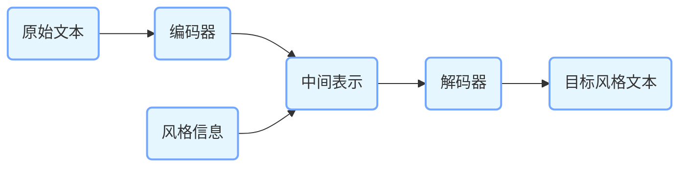

# AI在自然语言生成中的语言风格转换应用

> 关键词：AI、自然语言生成、语言风格转换、深度学习、文本处理

> 摘要：本文深入探讨了AI在自然语言生成中语言风格转换的应用。详细介绍了相关背景知识，包括目的范围、预期读者等。阐述了核心概念与联系，通过示意图和流程图清晰展示原理架构。深入讲解核心算法原理，并给出Python源代码示例。分析了相关数学模型和公式，并举例说明。通过项目实战给出代码案例及详细解读。探讨了实际应用场景，推荐了学习资源、开发工具框架和相关论文著作。最后总结未来发展趋势与挑战，提供常见问题解答和扩展阅读参考资料，旨在为读者全面呈现AI在语言风格转换方面的应用。

## 1. 背景介绍 
### 1.1 目的和范围
自然语言生成（Natural Language Generation，NLG）是人工智能领域的重要研究方向，它致力于将非语言形式的数据转换为自然语言文本。而语言风格转换作为NLG的一个重要分支，旨在将给定文本的语言风格从一种类型转换为另一种类型，例如将正式文本转换为口语化文本，或者将幽默风格的文本转换为严肃风格的文本。本文的目的是全面介绍AI在自然语言生成中语言风格转换的应用，涵盖从核心概念、算法原理到实际应用的各个方面，帮助读者深入理解这一技术，并能够在实际项目中进行应用。

### 1.2 预期读者
本文预期读者包括人工智能、自然语言处理领域的研究人员、开发者，对自然语言生成和语言风格转换技术感兴趣的学生，以及希望将该技术应用于实际业务场景的企业技术人员。

### 1.3 文档结构概述
本文首先介绍相关背景知识，包括目的范围、预期读者和文档结构。接着阐述核心概念与联系，通过示意图和流程图展示语言风格转换的原理架构。然后深入讲解核心算法原理，并给出Python源代码示例。随后分析相关数学模型和公式，并举例说明。通过项目实战给出代码案例及详细解读。探讨实际应用场景，推荐学习资源、开发工具框架和相关论文著作。最后总结未来发展趋势与挑战，提供常见问题解答和扩展阅读参考资料。

### 1.4 术语表
#### 1.4.1 核心术语定义
- **自然语言生成（Natural Language Generation，NLG）**：将非语言形式的数据（如数据库中的数据、算法生成的结果等）转换为自然语言文本的过程。
- **语言风格转换（Language Style Transfer）**：将给定文本的语言风格从一种类型转换为另一种类型的任务。
- **编码器 - 解码器架构（Encoder - Decoder Architecture）**：一种常用于序列到序列任务的神经网络架构，由编码器将输入序列编码为中间表示，解码器根据中间表示生成输出序列。
- **注意力机制（Attention Mechanism）**：一种在神经网络中用于动态分配权重的机制，能够使模型更加关注输入序列中的重要部分。

#### 1.4.2 相关概念解释
- **文本嵌入（Text Embedding）**：将文本转换为向量表示的过程，使得文本可以在向量空间中进行计算和处理。
- **风格特征（Style Features）**：能够体现文本语言风格的特征，如词汇选择、语法结构、语气等。
- **平行语料库（Parallel Corpus）**：包含两种或多种语言风格的对应文本的语料库，用于训练语言风格转换模型。

#### 1.4.3 缩略词列表
- **NLG**：Natural Language Generation
- **LSTM**：Long Short - Term Memory
- **GRU**：Gated Recurrent Unit
- **Transformer**

## 2. 核心概念与联系 

### 语言风格转换的原理
语言风格转换的核心思想是在保留文本语义信息的前提下，改变文本的语言风格。可以将其看作是一个序列到序列的映射问题，输入是原始文本，输出是具有目标风格的文本。

### 架构示意图
下面是一个简单的语言风格转换系统的架构示意图：



在这个架构中，编码器将原始文本编码为中间表示，风格信息被注入到中间表示中，解码器根据包含风格信息的中间表示生成具有目标风格的文本。

### 核心概念联系
编码器、解码器和风格信息是语言风格转换中的核心概念。编码器负责提取原始文本的语义信息，解码器根据中间表示和风格信息生成目标文本。风格信息可以通过多种方式获取，如风格标签、风格向量等。这些概念相互协作，共同完成语言风格转换的任务。

## 3. 核心算法原理 & 具体操作步骤 

### 编码器 - 解码器架构
编码器 - 解码器架构是语言风格转换中常用的模型架构。编码器通常使用循环神经网络（如LSTM、GRU）或Transformer等模型，将输入的原始文本编码为一个固定长度的向量表示。解码器则根据这个向量表示生成目标文本。

以下是一个使用Python和PyTorch实现的简单编码器 - 解码器架构的示例代码：

```python
import torch
import torch.nn as nn

# 编码器
class Encoder(nn.Module):
    def __init__(self, input_size, hidden_size):
        super(Encoder, self).__init__()
        self.hidden_size = hidden_size
        self.embedding = nn.Embedding(input_size, hidden_size)
        self.gru = nn.GRU(hidden_size, hidden_size)

    def forward(self, input, hidden):
        embedded = self.embedding(input).view(1, 1, -1)
        output = embedded
        output, hidden = self.gru(output, hidden)
        return output, hidden

    def initHidden(self):
        return torch.zeros(1, 1, self.hidden_size)

# 解码器
class Decoder(nn.Module):
    def __init__(self, hidden_size, output_size):
        super(Decoder, self).__init__()
        self.hidden_size = hidden_size
        self.embedding = nn.Embedding(output_size, hidden_size)
        self.gru = nn.GRU(hidden_size, hidden_size)
        self.out = nn.Linear(hidden_size, output_size)
        self.softmax = nn.LogSoftmax(dim=1)

    def forward(self, input, hidden):
        output = self.embedding(input).view(1, 1, -1)
        output = torch.relu(output)
        output, hidden = self.gru(output, hidden)
        output = self.softmax(self.out(output[0]))
        return output, hidden

    def initHidden(self):
        return torch.zeros(1, 1, self.hidden_size)


```

### 具体操作步骤
1. **数据预处理**：对原始文本进行分词、去除停用词等处理，并将文本转换为数字序列。
2. **模型训练**：使用平行语料库对编码器 - 解码器模型进行训练，通过最小化预测文本和目标文本之间的损失函数来优化模型参数。
3. **风格注入**：在训练过程中，将风格信息注入到中间表示中，可以通过将风格向量与中间表示拼接或相加的方式实现。
4. **生成目标文本**：使用训练好的模型，输入原始文本和目标风格信息，解码器生成具有目标风格的文本。

## 4. 数学模型和公式 & 详细讲解 & 举例说明 

### 编码器的数学模型
假设输入的原始文本序列为 $x = (x_1, x_2, \cdots, x_T)$，其中 $T$ 是序列的长度。编码器的作用是将输入序列转换为中间表示 $h = (h_1, h_2, \cdots, h_T)$。

对于循环神经网络（如LSTM），其数学模型可以表示为：

$$
\begin{align*}
i_t &= \sigma(W_{ii}x_t + W_{hi}h_{t - 1}+b_i)\\
f_t &= \sigma(W_{if}x_t + W_{hf}h_{t - 1}+b_f)\\
o_t &= \sigma(W_{io}x_t + W_{ho}h_{t - 1}+b_o)\\
\tilde{c}_t &= \tanh(W_{ic}x_t + W_{hc}h_{t - 1}+b_c)\\
c_t &= f_t \odot c_{t - 1}+i_t \odot \tilde{c}_t\\
h_t &= o_t \odot \tanh(c_t)
\end{align*}
$$

其中，$i_t$、$f_t$、$o_t$ 分别是输入门、遗忘门和输出门，$\tilde{c}_t$ 是候选细胞状态，$c_t$ 是细胞状态，$h_t$ 是隐藏状态，$\sigma$ 是 sigmoid 函数，$\odot$ 是逐元素相乘。

### 解码器的数学模型
解码器根据中间表示 $h$ 和上一时刻的输出 $y_{t - 1}$ 生成当前时刻的输出 $y_t$。其数学模型可以表示为：

$$
\begin{align*}
s_t &= f(s_{t - 1}, y_{t - 1}, h)\\
p(y_t|y_{1:t - 1}, x) &= g(s_t)
\end{align*}
$$

其中，$s_t$ 是解码器的隐藏状态，$f$ 是解码器的递归函数，$g$ 是输出层的激活函数，通常使用 softmax 函数。

### 举例说明
假设输入的原始文本是 “I am very happy today.”，目标风格是正式风格。经过编码器处理后，得到中间表示 $h$。解码器根据 $h$ 和风格信息，生成正式风格的文本 “I am extremely delighted today.”。

## 5. 项目实战：代码实际案例和详细解释说明 

### 5.1  开发环境搭建
- **操作系统**：推荐使用Linux或macOS，也可以使用Windows。
- **Python版本**：Python 3.6及以上。
- **深度学习框架**：PyTorch 1.0及以上。
- **其他依赖库**：numpy、torchtext等。

可以使用以下命令安装所需的依赖库：

```bash
pip install torch torchtext numpy
```

### 5.2  源代码详细实现和代码解读
以下是一个完整的语言风格转换项目的代码示例：

```python
import torch
import torch.nn as nn
import torch.optim as optim
from torchtext.legacy.data import Field, BucketIterator
import random

# 定义字段
SRC = Field(tokenize='spacy', tokenizer_language='en_core_web_sm', init_token='<sos>', eos_token='<eos>', lower=True)
TRG = Field(tokenize='spacy', tokenizer_language='en_core_web_sm', init_token='<sos>', eos_token='<eos>', lower=True)

# 加载数据集
from torchtext.legacy.datasets import TranslationDataset

train_data, valid_data, test_data = TranslationDataset.splits(
    path='./data',
    train='train.txt',
    validation='valid.txt',
    test='test.txt',
    exts=('.src', '.trg'),
    fields=(SRC, TRG)
)

# 构建词汇表
SRC.build_vocab(train_data, min_freq=2)
TRG.build_vocab(train_data, min_freq=2)

# 定义编码器
class Encoder(nn.Module):
    def __init__(self, input_dim, emb_dim, hid_dim, n_layers, dropout):
        super().__init__()
        self.hid_dim = hid_dim
        self.n_layers = n_layers
        self.embedding = nn.Embedding(input_dim, emb_dim)
        self.rnn = nn.LSTM(emb_dim, hid_dim, n_layers, dropout=dropout)
        self.dropout = nn.Dropout(dropout)

    def forward(self, src):
        embedded = self.dropout(self.embedding(src))
        outputs, (hidden, cell) = self.rnn(embedded)
        return hidden, cell

# 定义解码器
class Decoder(nn.Module):
    def __init__(self, output_dim, emb_dim, hid_dim, n_layers, dropout):
        super().__init__()
        self.output_dim = output_dim
        self.hid_dim = hid_dim
        self.n_layers = n_layers
        self.embedding = nn.Embedding(output_dim, emb_dim)
        self.rnn = nn.LSTM(emb_dim, hid_dim, n_layers, dropout=dropout)
        self.fc_out = nn.Linear(hid_dim, output_dim)
        self.dropout = nn.Dropout(dropout)

    def forward(self, input, hidden, cell):
        input = input.unsqueeze(0)
        embedded = self.dropout(self.embedding(input))
        output, (hidden, cell) = self.rnn(embedded, (hidden, cell))
        prediction = self.fc_out(output.squeeze(0))
        return prediction, hidden, cell

# 定义Seq2Seq模型
class Seq2Seq(nn.Module):
    def __init__(self, encoder, decoder, device):
        super().__init__()
        self.encoder = encoder
        self.decoder = decoder
        self.device = device

    def forward(self, src, trg, teacher_forcing_ratio=0.5):
        batch_size = trg.shape[1]
        trg_len = trg.shape[0]
        trg_vocab_size = self.decoder.output_dim
        outputs = torch.zeros(trg_len, batch_size, trg_vocab_size).to(self.device)
        hidden, cell = self.encoder(src)
        input = trg[0, :]
        for t in range(1, trg_len):
            output, hidden, cell = self.decoder(input, hidden, cell)
            outputs[t] = output
            teacher_force = random.random() < teacher_forcing_ratio
            top1 = output.argmax(1)
            input = trg[t] if teacher_force else top1
        return outputs

# 初始化模型
device = torch.device('cuda' if torch.cuda.is_available() else 'cpu')
INPUT_DIM = len(SRC.vocab)
OUTPUT_DIM = len(TRG.vocab)
ENC_EMB_DIM = 256
DEC_EMB_DIM = 256
HID_DIM = 512
N_LAYERS = 2
ENC_DROPOUT = 0.5
DEC_DROPOUT = 0.5

enc = Encoder(INPUT_DIM, ENC_EMB_DIM, HID_DIM, N_LAYERS, ENC_DROPOUT)
dec = Decoder(OUTPUT_DIM, DEC_EMB_DIM, HID_DIM, N_LAYERS, DEC_DROPOUT)
model = Seq2Seq(enc, dec, device).to(device)

# 定义优化器和损失函数
optimizer = optim.Adam(model.parameters())
TRG_PAD_IDX = TRG.vocab.stoi[TRG.pad_token]
criterion = nn.CrossEntropyLoss(ignore_index=TRG_PAD_IDX)

# 训练模型
def train(model, iterator, optimizer, criterion, clip):
    model.train()
    epoch_loss = 0
    for i, batch in enumerate(iterator):
        src = batch.src
        trg = batch.trg
        optimizer.zero_grad()
        output = model(src, trg)
        output_dim = output.shape[-1]
        output = output[1:].view(-1, output_dim)
        trg = trg[1:].view(-1)
        loss = criterion(output, trg)
        loss.backward()
        torch.nn.utils.clip_grad_norm_(model.parameters(), clip)
        optimizer.step()
        epoch_loss += loss.item()
    return epoch_loss / len(iterator)

# 评估模型
def evaluate(model, iterator, criterion):
    model.eval()
    epoch_loss = 0
    with torch.no_grad():
        for i, batch in enumerate(iterator):
            src = batch.src
            trg = batch.trg
            output = model(src, trg, 0)
            output_dim = output.shape[-1]
            output = output[1:].view(-1, output_dim)
            trg = trg[1:].view(-1)
            loss = criterion(output, trg)
            epoch_loss += loss.item()
    return epoch_loss / len(iterator)

# 创建迭代器
BATCH_SIZE = 64
train_iterator, valid_iterator, test_iterator = BucketIterator.splits(
    (train_data, valid_data, test_data),
    batch_size=BATCH_SIZE,
    device=device
)

# 训练模型
N_EPOCHS = 10
CLIP = 1
best_valid_loss = float('inf')
for epoch in range(N_EPOCHS):
    train_loss = train(model, train_iterator, optimizer, criterion, CLIP)
    valid_loss = evaluate(model, valid_iterator, criterion)
    if valid_loss < best_valid_loss:
        best_valid_loss = valid_loss
        torch.save(model.state_dict(), 'tut1-model.pt')
    print(f'Epoch: {epoch+1:02} | Train Loss: {train_loss:.3f} | Train PPL: {torch.exp(torch.tensor(train_loss)):.3f} | Val. Loss: {valid_loss:.3f} | Val. PPL: {torch.exp(torch.tensor(valid_loss)):.3f}')

# 测试模型
model.load_state_dict(torch.load('tut1-model.pt'))
test_loss = evaluate(model, test_iterator, criterion)
print(f'| Test Loss: {test_loss:.3f} | Test PPL: {torch.exp(torch.tensor(test_loss)):.3f} |')


```

### 5.3  代码解读与分析
- **数据预处理**：使用 `torchtext` 库进行数据加载和预处理，定义了 `SRC` 和 `TRG` 字段，分别表示原始文本和目标文本。
- **模型定义**：定义了编码器、解码器和 Seq2Seq 模型，编码器使用 LSTM 网络将输入文本编码为中间表示，解码器根据中间表示生成目标文本。
- **训练和评估**：使用 Adam 优化器和交叉熵损失函数进行模型训练，通过 `train` 和 `evaluate` 函数分别进行训练和评估。
- **迭代器创建**：使用 `BucketIterator` 创建训练、验证和测试迭代器，将数据按长度分组，提高训练效率。

## 6. 实际应用场景 
### 内容创作
在内容创作领域，语言风格转换可以帮助作者快速生成不同风格的文章。例如，将一篇学术论文转换为科普文章，使专业知识能够更广泛地传播；将一篇严肃的新闻报道转换为幽默风趣的风格，吸引更多读者。

### 智能客服
智能客服系统可以根据用户的提问风格，自动调整回复的语言风格。如果用户使用口语化的语言提问，客服系统可以使用同样口语化的风格进行回复，增强与用户的沟通效果。

### 翻译和本地化
在翻译过程中，语言风格转换可以使翻译后的文本更符合目标语言的表达习惯和文化背景。例如，将英文的广告文案翻译成中文时，可以将其转换为更具中国特色的营销风格。

### 教育领域
在教育领域，语言风格转换可以帮助学生提高写作能力。教师可以使用该技术将学生的作文转换为不同风格的文本，让学生对比学习，了解不同风格的写作特点。

## 7. 工具和资源推荐
### 7.1 学习资源推荐
#### 7.1.1 书籍推荐
- 《自然语言处理入门》：全面介绍了自然语言处理的基本概念、算法和应用，适合初学者入门。
- 《深度学习》：深度学习领域的经典教材，对神经网络、优化算法等进行了深入讲解。
- 《Python自然语言处理实战》：通过实际案例介绍了如何使用Python进行自然语言处理，包括文本分类、情感分析等任务。

#### 7.1.2 在线课程
- Coursera上的“Natural Language Processing Specialization”：由知名学者授课，涵盖了自然语言处理的各个方面。
- edX上的“Deep Learning for Natural Language Processing”：深入介绍了深度学习在自然语言处理中的应用。
- 中国大学MOOC上的“自然语言处理”：国内高校的优质课程，讲解详细，适合国内学习者。

#### 7.1.3 技术博客和网站
- Medium上的Towards Data Science：发布了大量关于人工智能、自然语言处理的技术文章和案例。
- arXiv.org：提供了最新的学术论文，是了解前沿研究的重要渠道。
- Hugging Face Blog：专注于自然语言处理和深度学习，介绍了许多开源模型和工具的使用方法。

### 7.2 开发工具框架推荐
#### 7.2.1 IDE和编辑器
- PyCharm：功能强大的Python集成开发环境，提供了代码编辑、调试、版本控制等功能。
- Jupyter Notebook：交互式的开发环境，适合进行数据探索和模型实验。
- Visual Studio Code：轻量级的代码编辑器，支持多种编程语言和插件扩展。

#### 7.2.2 调试和性能分析工具
- TensorBoard：用于可视化深度学习模型的训练过程和性能指标。
- Py-Spy：用于分析Python程序的性能瓶颈，找出耗时的代码段。
- Pytorch Profiler：PyTorch自带的性能分析工具，可以帮助开发者优化模型训练和推理过程。

#### 7.2.3 相关框架和库
- PyTorch：开源的深度学习框架，提供了丰富的神经网络层和优化算法，广泛应用于自然语言处理领域。
- TensorFlow：另一个流行的深度学习框架，具有强大的分布式训练和部署能力。
- AllenNLP：专门为自然语言处理任务设计的深度学习框架，提供了许多预训练模型和工具。

### 7.3 相关论文著作推荐
#### 7.3.1 经典论文
- “Sequence to Sequence Learning with Neural Networks”：提出了编码器 - 解码器架构，为序列到序列任务奠定了基础。
- “Attention Is All You Need”：介绍了Transformer模型，在自然语言处理领域取得了巨大成功。
- “Unsupervised Text Style Transfer using Language Models as Discriminators”：提出了一种无监督的语言风格转换方法。

#### 7.3.2 最新研究成果
- 关注arXiv.org上的最新论文，了解语言风格转换领域的最新研究进展。
- 参加自然语言处理领域的学术会议，如ACL、EMNLP等，获取最新的研究成果。

#### 7.3.3 应用案例分析
- 一些企业和研究机构会发布语言风格转换技术的应用案例，可以在他们的官方网站或博客上查找相关资料。

## 8. 总结：未来发展趋势与挑战
### 未来发展趋势
- **多模态融合**：将语言风格转换与图像、音频等多模态信息相结合，实现更丰富的内容创作和交互。
- **无监督和少监督学习**：减少对大规模平行语料库的依赖，通过无监督和少监督学习方法实现更高效的语言风格转换。
- **个性化风格转换**：根据用户的个性化需求和偏好，实现更加精准的语言风格转换。

### 挑战
- **语义保留**：在进行语言风格转换时，如何更好地保留原始文本的语义信息，避免语义丢失或扭曲。
- **风格多样性**：处理更加复杂和多样化的语言风格，包括不同文化背景和领域的风格。
- **计算资源需求**：深度学习模型通常需要大量的计算资源进行训练和推理，如何降低计算成本是一个挑战。

## 9. 附录：常见问题与解答
### 问题1：语言风格转换模型的训练数据需要注意什么？
解答：训练数据应该具有足够的多样性，涵盖不同风格的文本。同时，数据的质量也很重要，要避免噪声数据的影响。如果使用平行语料库，需要确保源文本和目标文本的对应关系准确。

### 问题2：如何评估语言风格转换的效果？
解答：可以使用自动评估指标，如BLEU、ROUGE等，评估生成文本与目标文本的相似度。此外，还可以进行人工评估，让人类评判生成文本的风格和语义是否符合要求。

### 问题3：语言风格转换模型的泛化能力如何提高？
解答：可以通过增加训练数据的多样性、使用正则化方法（如Dropout）、进行数据增强等方式提高模型的泛化能力。

## 10. 扩展阅读 & 参考资料
- 《自然语言处理：基于预训练模型的方法》
- 《深度学习实战：基于TensorFlow和Keras》
- 相关学术论文：“Style Transformer: Unpaired Text Style Transfer without Disentangled Latent Representation”、“Controllable Text Generation with Reinforcement Learning”

作者：AI天才研究院/AI Genius Institute & 禅与计算机程序设计艺术 /Zen And The Art of Computer Programming