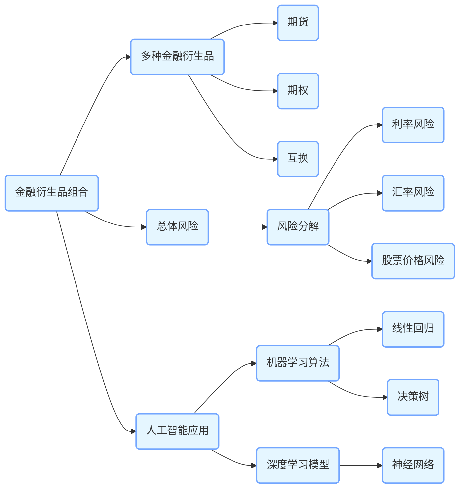

# AI在金融衍生品组合风险分解中的创新应用

> 关键词：人工智能、金融衍生品组合、风险分解、创新应用、机器学习算法

> 摘要：本文聚焦于AI在金融衍生品组合风险分解中的创新应用。随着金融市场的日益复杂，金融衍生品组合的风险评估与管理变得愈发关键。传统的风险分解方法存在一定局限性，而AI技术凭借其强大的数据处理和分析能力为该领域带来了新的突破。文章将深入探讨AI相关核心概念、算法原理，结合数学模型进行详细讲解，并通过项目实战案例展示其应用过程，同时分析实际应用场景、推荐相关工具和资源，最后对未来发展趋势与挑战进行总结。

## 1. 背景介绍 
### 1.1 目的和范围
本研究旨在探索人工智能（AI）在金融衍生品组合风险分解方面的创新应用。金融衍生品市场规模不断扩大，其组合的风险状况也变得更加复杂和难以评估。传统的风险分解方法往往难以应对大量的、高维度的数据以及复杂的市场动态。通过引入AI技术，可以更精准地识别、度量和分解金融衍生品组合中的各种风险因素，为金融机构和投资者提供更有效的风险管理决策依据。本研究的范围涵盖了常见的AI技术在金融衍生品组合风险分解中的应用，包括机器学习算法、深度学习模型等，并结合实际案例进行分析。

### 1.2 预期读者
本文预期读者包括金融行业从业者，如金融分析师、风险管理人员、投资经理等，他们可以从文中了解AI技术在金融衍生品风险分解中的具体应用和优势，从而优化自身的风险管理策略。同时，对于计算机科学和人工智能领域的研究人员和开发者，本文提供了金融领域的实际应用场景和需求，有助于他们将AI技术更好地应用于金融行业。此外，对金融市场和人工智能交叉领域感兴趣的学生和学者也可以从本文中获取相关知识和研究思路。

### 1.3 文档结构概述
本文将按照以下结构进行组织：首先介绍核心概念与联系，包括金融衍生品、风险分解以及人工智能的相关概念和它们之间的关系；接着阐述核心算法原理和具体操作步骤，通过Python代码详细说明；然后给出数学模型和公式，并进行详细讲解和举例；之后进行项目实战，包括开发环境搭建、源代码实现和代码解读；再分析实际应用场景；随后推荐相关的工具和资源；最后总结未来发展趋势与挑战，并提供常见问题与解答以及扩展阅读和参考资料。

### 1.4 术语表
#### 1.4.1 核心术语定义
- **金融衍生品**：是一种金融合约，其价值取决于一种或多种基础资产或指数，常见的金融衍生品包括期货、期权、互换等。
- **风险分解**：将金融衍生品组合的总体风险拆分为不同类型、不同来源的风险因素，以便更好地理解和管理风险。
- **人工智能（AI）**：是一门研究如何使计算机系统能够模拟人类智能的学科，包括机器学习、深度学习、自然语言处理等多个领域。
- **机器学习**：是AI的一个重要分支，它通过让计算机从数据中学习模式和规律，从而实现对未知数据的预测和决策。
- **深度学习**：是一种基于人工神经网络的机器学习方法，它可以自动从大量数据中学习复杂的特征表示。

#### 1.4.2 相关概念解释
- **风险因子**：是影响金融衍生品价值和风险的各种因素，如利率、汇率、股票价格等。
- **风险度量**：是对金融衍生品组合风险大小的量化评估，常见的风险度量指标包括方差、标准差、VaR（Value at Risk）等。
- **数据预处理**：在使用AI算法进行分析之前，对原始数据进行清洗、转换、归一化等操作，以提高数据质量和算法性能。

#### 1.4.3 缩略词列表
- **AI**：Artificial Intelligence（人工智能）
- **ML**：Machine Learning（机器学习）
- **DL**：Deep Learning（深度学习）
- **VaR**：Value at Risk（风险价值）
- **PCA**：Principal Component Analysis（主成分分析）

## 2. 核心概念与联系 

### 金融衍生品组合
金融衍生品组合是由多种金融衍生品构成的投资组合。金融衍生品的价值与基础资产的价格、利率、汇率等因素密切相关。不同的金融衍生品具有不同的风险特征，例如期货合约具有较高的杠杆性，可能带来较大的潜在收益和损失；期权合约则提供了在未来特定时间以特定价格买卖基础资产的权利，其风险和收益特征更为复杂。

### 风险分解
风险分解的目的是将金融衍生品组合的总体风险分解为各个风险因子的贡献。传统的风险分解方法主要基于线性模型，如方差 - 协方差方法，但这种方法在处理复杂的非线性关系和高维度数据时存在局限性。通过风险分解，可以更深入地了解金融衍生品组合的风险结构，识别主要的风险来源，从而采取针对性的风险管理措施。

### 人工智能与风险分解
人工智能技术在金融衍生品组合风险分解中具有重要的应用价值。机器学习算法可以自动从大量的历史数据中学习风险因子与金融衍生品组合价值之间的复杂关系，从而更准确地进行风险分解。深度学习模型，如神经网络，可以处理非线性和高维度的数据，捕捉数据中的潜在模式和特征。

#### 核心概念原理和架构的文本示意图
```plaintext
金融衍生品组合
├── 多种金融衍生品（期货、期权、互换等）
│   ├── 各自的风险特征
│   └── 与基础资产的关联
├── 总体风险
│   └── 分解为多个风险因子贡献
│       ├── 利率风险
│       ├── 汇率风险
│       ├── 股票价格风险等
└── 人工智能应用
    ├── 机器学习算法（线性回归、决策树等）
    │   └── 学习风险因子与组合价值关系
    └── 深度学习模型（神经网络）
        └── 处理非线性和高维数据
```

#### Mermaid流程图


## 3. 核心算法原理 & 具体操作步骤 

### 线性回归算法原理
线性回归是一种基本的机器学习算法，用于建立自变量（风险因子）与因变量（金融衍生品组合价值）之间的线性关系。假设我们有 $n$ 个风险因子 $x_1, x_2, \cdots, x_n$ 和金融衍生品组合价值 $y$，线性回归模型可以表示为：

$$y = \beta_0 + \beta_1x_1 + \beta_2x_2 + \cdots + \beta_nx_n + \epsilon$$

其中，$\beta_0$ 是截距项，$\beta_1, \beta_2, \cdots, \beta_n$ 是回归系数，$\epsilon$ 是误差项。线性回归的目标是找到一组最优的回归系数 $\beta = (\beta_0, \beta_1, \cdots, \beta_n)$，使得误差项的平方和最小，即最小化损失函数：

$$L(\beta) = \sum_{i=1}^{m}(y_i - (\beta_0 + \beta_1x_{i1} + \beta_2x_{i2} + \cdots + \beta_nx_{in}))^2$$

其中，$m$ 是样本数量。

### Python代码实现线性回归进行风险分解
```python
import numpy as np
from sklearn.linear_model import LinearRegression

# 生成示例数据
# 假设我们有3个风险因子，100个样本
np.random.seed(0)
X = np.random.randn(100, 3)  # 风险因子数据
y = 2 * X[:, 0] + 3 * X[:, 1] - 1 * X[:, 2] + np.random.randn(100)  # 金融衍生品组合价值

# 创建线性回归模型
model = LinearRegression()

# 拟合模型
model.fit(X, y)

# 输出回归系数
print("回归系数:", model.coef_)
print("截距项:", model.intercept_)

# 计算每个风险因子的贡献
risk_factor_contributions = model.coef_ * X.mean(axis=0)
print("每个风险因子的贡献:", risk_factor_contributions)
```

### 操作步骤
1. **数据准备**：收集金融衍生品组合的历史数据，包括风险因子和组合价值。对数据进行清洗和预处理，确保数据的质量和一致性。
2. **模型选择**：根据数据的特点和问题的需求，选择合适的机器学习算法，如线性回归、决策树、神经网络等。
3. **模型训练**：使用训练数据对模型进行训练，调整模型的参数，使得模型能够更好地拟合数据。
4. **风险分解**：使用训练好的模型，计算每个风险因子对金融衍生品组合价值的贡献。
5. **结果评估**：对风险分解的结果进行评估，检查结果的合理性和准确性。

## 4. 数学模型和公式 & 详细讲解 & 举例说明 

### 风险价值（VaR）模型
风险价值（VaR）是一种常用的风险度量指标，它表示在一定的置信水平下，金融衍生品组合在未来一段时间内可能遭受的最大损失。假设金融衍生品组合的收益率 $R$ 服从正态分布 $N(\mu, \sigma^2)$，则在置信水平 $c$ 下的 VaR 可以表示为：

$$VaR = -z_c\sigma\sqrt{\Delta t}$$

其中，$z_c$ 是标准正态分布的 $c$ 分位数，$\sigma$ 是收益率的标准差，$\Delta t$ 是时间间隔。

### 详细讲解
VaR 模型的核心思想是通过对金融衍生品组合收益率的分布进行建模，来估计在一定置信水平下的最大损失。正态分布是一种常用的分布假设，在实际应用中，需要根据数据的特点和市场情况选择合适的分布模型。$z_c$ 分位数可以通过标准正态分布表或统计软件进行查询。

### 举例说明
假设某金融衍生品组合的日收益率服从正态分布，标准差为 0.02，时间间隔为 1 天，置信水平为 95%。查标准正态分布表可得，$z_{0.95} = 1.645$。则该组合的日 VaR 为：

$$VaR = -1.645\times0.02\times\sqrt{1} = -0.0329$$

这意味着在 95% 的置信水平下，该金融衍生品组合在未来一天内可能遭受的最大损失为 3.29%。

### 主成分分析（PCA）模型
主成分分析（PCA）是一种常用的数据降维方法，它可以将高维度的数据转换为低维度的主成分，同时保留数据的主要信息。假设我们有 $n$ 个风险因子 $x_1, x_2, \cdots, x_n$，PCA 的目标是找到一组正交的主成分 $z_1, z_2, \cdots, z_n$，使得 $z_i$ 是 $x_1, x_2, \cdots, x_n$ 的线性组合，并且 $z_i$ 的方差最大。

### 数学公式
设 $X$ 是 $m\times n$ 的数据矩阵，其中 $m$ 是样本数量，$n$ 是风险因子数量。PCA 的步骤如下：
1. **数据标准化**：将数据矩阵 $X$ 进行标准化处理，使得每个风险因子的均值为 0，标准差为 1。
2. **计算协方差矩阵**：计算标准化后数据矩阵的协方差矩阵 $S$。
3. **特征值分解**：对协方差矩阵 $S$ 进行特征值分解，得到特征值 $\lambda_1 \geq \lambda_2 \geq \cdots \geq \lambda_n$ 和对应的特征向量 $e_1, e_2, \cdots, e_n$。
4. **选择主成分**：选择前 $k$ 个特征值对应的特征向量作为主成分，其中 $k < n$。

### 详细讲解
PCA 的核心思想是通过线性变换将原始数据投影到新的坐标轴上，使得投影后的数据方差最大。特征值表示主成分的方差大小，特征向量表示主成分的方向。通过选择前 $k$ 个主成分，可以将高维度的数据降维到 $k$ 维，从而减少数据的复杂度。

### 举例说明
假设我们有 4 个风险因子 $x_1, x_2, x_3, x_4$，通过 PCA 分析得到特征值 $\lambda_1 = 2.5, \lambda_2 = 1.2, \lambda_3 = 0.8, \lambda_4 = 0.5$。如果我们选择保留前 2 个主成分，则这 2 个主成分可以解释的总方差比例为：

$$\frac{\lambda_1 + \lambda_2}{\lambda_1 + \lambda_2 + \lambda_3 + \lambda_4} = \frac{2.5 + 1.2}{2.5 + 1.2 + 0.8 + 0.5} = 0.74$$

这意味着前 2 个主成分可以解释原始数据 74% 的方差。

## 5. 项目实战：代码实际案例和详细解释说明 

### 5.1  开发环境搭建
#### 安装Python
首先，需要安装 Python 环境。可以从 Python 官方网站（https://www.python.org/downloads/）下载适合自己操作系统的 Python 安装包，并按照安装向导进行安装。建议安装 Python 3.7 及以上版本。

#### 安装必要的库
使用 pip 包管理器安装以下必要的库：
```bash
pip install numpy pandas scikit-learn matplotlib
```
- **numpy**：用于进行数值计算和数组操作。
- **pandas**：用于数据处理和分析。
- **scikit-learn**：提供了丰富的机器学习算法和工具。
- **matplotlib**：用于数据可视化。

### 5.2  源代码详细实现和代码解读
#### 数据准备
```python
import pandas as pd
import numpy as np

# 模拟金融衍生品组合数据
np.random.seed(0)
n_samples = 100
n_features = 3

# 生成风险因子数据
risk_factors = pd.DataFrame(np.random.randn(n_samples, n_features), columns=['Factor1', 'Factor2', 'Factor3'])

# 生成金融衍生品组合价值数据
portfolio_value = 2 * risk_factors['Factor1'] + 3 * risk_factors['Factor2'] - 1 * risk_factors['Factor3'] + np.random.randn(n_samples)

# 数据标准化
from sklearn.preprocessing import StandardScaler
scaler = StandardScaler()
risk_factors_scaled = scaler.fit_transform(risk_factors)
```
**代码解读**：首先，使用 `numpy` 生成模拟的风险因子数据和金融衍生品组合价值数据。然后，使用 `StandardScaler` 对风险因子数据进行标准化处理，使得每个风险因子的均值为 0，标准差为 1。

#### 线性回归模型训练
```python
from sklearn.linear_model import LinearRegression

# 创建线性回归模型
model = LinearRegression()

# 拟合模型
model.fit(risk_factors_scaled, portfolio_value)

# 输出回归系数
print("回归系数:", model.coef_)
print("截距项:", model.intercept_)
```
**代码解读**：使用 `LinearRegression` 创建线性回归模型，并使用标准化后的风险因子数据和金融衍生品组合价值数据对模型进行训练。最后，输出回归系数和截距项。

#### 风险分解
```python
# 计算每个风险因子的贡献
risk_factor_contributions = model.coef_ * risk_factors_scaled.mean(axis=0)
print("每个风险因子的贡献:", risk_factor_contributions)

# 可视化风险因子贡献
import matplotlib.pyplot as plt
plt.bar(risk_factors.columns, risk_factor_contributions)
plt.xlabel('风险因子')
plt.ylabel('贡献')
plt.title('风险因子对金融衍生品组合价值的贡献')
plt.show()
```
**代码解读**：根据回归系数和标准化后风险因子的均值，计算每个风险因子对金融衍生品组合价值的贡献。然后，使用 `matplotlib` 库将风险因子的贡献进行可视化。

### 5.3  代码解读与分析
- **数据准备阶段**：模拟数据可以帮助我们在没有真实数据的情况下进行实验和验证。数据标准化是为了消除不同风险因子之间量纲的影响，使得模型能够更好地学习数据的特征。
- **模型训练阶段**：线性回归模型通过最小化误差项的平方和来拟合数据，得到回归系数和截距项。回归系数表示每个风险因子对金融衍生品组合价值的影响程度。
- **风险分解阶段**：通过回归系数和风险因子的均值计算每个风险因子的贡献，直观地展示了不同风险因子对组合价值的重要性。可视化结果可以帮助我们更清晰地理解风险分解的结果。

## 6. 实际应用场景 
### 金融机构风险管理
金融机构，如银行、证券公司、保险公司等，持有大量的金融衍生品组合。通过AI技术进行风险分解，可以帮助金融机构更准确地评估组合的风险状况，制定合理的风险管理策略。例如，银行可以根据风险分解的结果，调整贷款组合的结构，降低潜在的信用风险；证券公司可以优化投资组合，提高投资回报率。

### 投资者决策支持
对于个人投资者和机构投资者来说，AI在金融衍生品组合风险分解中的应用可以提供更全面的信息，帮助他们做出更明智的投资决策。投资者可以根据风险分解的结果，了解不同风险因子对投资组合的影响，从而选择合适的投资产品和投资时机。例如，投资者可以根据利率风险的分解结果，调整债券投资的期限结构。

### 监管机构监管
监管机构需要对金融市场进行有效监管，防范系统性金融风险。AI技术可以帮助监管机构更深入地了解金融机构的风险状况，及时发现潜在的风险隐患。通过对金融衍生品组合的风险分解，监管机构可以制定更有针对性的监管政策，加强对金融市场的监管力度。

## 7. 工具和资源推荐
### 7.1 学习资源推荐
#### 7.1.1 书籍推荐
- 《机器学习》（周志华）：这本书全面介绍了机器学习的基本概念、算法和应用，是机器学习领域的经典教材。
- 《深度学习》（Ian Goodfellow、Yoshua Bengio和Aaron Courville）：该书深入探讨了深度学习的原理和方法，适合有一定机器学习基础的读者。
- 《金融风险管理师（FRM）考试教材》：该教材系统地介绍了金融风险管理的理论和实践，包括金融衍生品、风险度量和管理等方面的内容。

#### 7.1.2 在线课程
- Coursera上的“机器学习”课程（Andrew Ng教授）：这是一门非常经典的机器学习入门课程，通过视频讲解、编程作业和测验等方式，帮助学习者掌握机器学习的基本概念和算法。
- edX上的“深度学习微硕士项目”：该项目涵盖了深度学习的多个领域，包括神经网络、卷积神经网络、循环神经网络等，适合想要深入学习深度学习的学习者。
- 中国大学MOOC上的“金融风险管理”课程：该课程由国内知名高校的教授授课，介绍了金融风险管理的基本理论和方法，结合实际案例进行分析。

#### 7.1.3 技术博客和网站
- Medium：这是一个技术博客平台，上面有很多关于人工智能、金融科技等领域的优质文章，可以帮助读者了解最新的技术动态和研究成果。
- Towards Data Science：专注于数据科学和机器学习领域的博客网站，提供了大量的技术文章、案例分析和教程。
- 金融界网站：提供金融市场的实时行情、新闻资讯和研究报告，有助于读者了解金融市场的动态和趋势。

### 7.2 开发工具框架推荐
#### 7.2.1 IDE和编辑器
- PyCharm：是一款专业的Python集成开发环境（IDE），提供了丰富的代码编辑、调试、测试等功能，适合Python开发。
- Jupyter Notebook：是一个交互式的开发环境，可以在浏览器中编写和运行Python代码，支持代码、文本、图表等多种形式的展示，非常适合数据探索和分析。
- Visual Studio Code：是一款轻量级的代码编辑器，支持多种编程语言，通过安装Python扩展可以实现Python代码的开发和调试。

#### 7.2.2 调试和性能分析工具
- PDB：Python自带的调试工具，可以帮助开发者在代码中设置断点、单步执行代码、查看变量值等，进行代码调试。
- cProfile：Python标准库中的性能分析工具，可以分析代码的运行时间和函数调用情况，帮助开发者找出代码中的性能瓶颈。
- TensorBoard：是TensorFlow提供的可视化工具，可以用于可视化深度学习模型的训练过程、网络结构、损失函数等信息。

#### 7.2.3 相关框架和库
- Scikit-learn：是一个常用的机器学习库，提供了丰富的机器学习算法和工具，包括分类、回归、聚类、降维等算法，以及数据预处理、模型评估等功能。
- TensorFlow：是一个开源的深度学习框架，由Google开发，支持构建和训练各种深度学习模型，如神经网络、卷积神经网络、循环神经网络等。
- PyTorch：是另一个流行的深度学习框架，由Facebook开发，具有动态图的特点，易于使用和调试，在学术界和工业界都有广泛的应用。

### 7.3 相关论文著作推荐
#### 7.3.1 经典论文
- “Capital Asset Pricing Model: A Theory of Market Equilibrium under Conditions of Risk”（William F. Sharpe）：该论文提出了资本资产定价模型（CAPM），是现代金融理论的重要基础之一。
- “On the Pricing of Corporate Debt: The Risk Structure of Interest Rates”（Robert C. Merton）：这篇论文提出了基于期权定价理论的公司债务定价模型，为信用风险评估提供了重要的理论依据。
- “Learning Representations by Back-propagating Errors”（David E. Rumelhart、Geoffrey E. Hinton和Ronald J. Williams）：该论文介绍了反向传播算法，是神经网络训练的核心算法之一。

#### 7.3.2 最新研究成果
- 近年来，关于AI在金融风险管理中的应用研究不断涌现。可以通过学术数据库，如IEEE Xplore、ACM Digital Library、ScienceDirect等，搜索相关的最新研究论文，了解该领域的前沿动态。

#### 7.3.3 应用案例分析
- 一些金融机构和研究机构会发布关于AI在金融衍生品组合风险分解中的应用案例分析报告。可以关注这些报告，了解实际应用中的问题和解决方案。

## 8. 总结：未来发展趋势与挑战
### 未来发展趋势
- **多技术融合**：未来，AI技术将与区块链、云计算、大数据等技术进一步融合，为金融衍生品组合风险分解提供更强大的技术支持。例如，区块链技术可以提高数据的安全性和可信度，云计算可以提供强大的计算资源，大数据可以提供更丰富的数据来源。
- **实时风险监测**：随着金融市场的快速变化，实时风险监测将变得越来越重要。AI技术可以实现对金融衍生品组合风险的实时监测和预警，帮助金融机构和投资者及时采取措施应对风险。
- **个性化风险管理**：不同的金融机构和投资者具有不同的风险偏好和需求。未来，AI技术可以根据用户的个性化需求，提供定制化的风险管理方案，提高风险管理的效率和效果。

### 挑战
- **数据质量和隐私问题**：AI技术的应用依赖于大量的高质量数据。然而，金融数据往往存在数据缺失、数据噪声等问题，影响模型的准确性和可靠性。同时，金融数据涉及用户的隐私和商业机密，数据隐私保护也是一个重要的挑战。
- **模型可解释性**：一些复杂的AI模型，如深度学习模型，往往是黑箱模型，难以解释模型的决策过程和结果。在金融领域，模型的可解释性非常重要，因为监管机构和投资者需要了解模型的决策依据。
- **技术人才短缺**：AI技术在金融领域的应用需要既懂金融又懂技术的复合型人才。目前，这类人才相对短缺，制约了AI技术在金融衍生品组合风险分解中的广泛应用。

## 9. 附录：常见问题与解答
### 问题1：AI技术在金融衍生品组合风险分解中的准确性如何保证？
解答：可以通过以下几个方面来保证准确性：一是使用高质量的数据进行模型训练，对数据进行清洗、预处理和特征工程；二是选择合适的模型和算法，根据数据的特点和问题的需求进行模型选择和调优；三是进行模型评估和验证，使用交叉验证、留出法等方法评估模型的性能，并进行模型的稳定性测试。

### 问题2：AI模型的可解释性问题如何解决？
解答：可以采用以下方法解决可解释性问题：一是使用可解释的模型，如线性回归、决策树等，这些模型的决策过程相对容易理解；二是采用模型解释技术，如特征重要性分析、局部可解释模型无关解释（LIME）等，对模型的决策结果进行解释；三是结合领域知识，将模型的结果与金融领域的专业知识相结合，提高结果的可解释性。

### 问题3：如何应对AI技术在金融领域应用中的数据隐私问题？
解答：可以采取以下措施应对数据隐私问题：一是加强数据安全管理，采用加密技术对数据进行加密存储和传输，防止数据泄露；二是遵循相关法律法规和行业规范，如《网络安全法》、《个人信息保护法》等，确保数据的合法使用；三是采用联邦学习等技术，在不共享原始数据的情况下进行模型训练，保护数据隐私。

## 10. 扩展阅读 & 参考资料
### 扩展阅读
- 《智能金融：AI时代金融行业的新趋势》：这本书介绍了AI技术在金融行业的广泛应用，包括风险管理、投资决策、客户服务等方面，对AI在金融领域的发展趋势进行了深入探讨。
- 《金融科技前沿：从理论到实践》：该书涵盖了金融科技的多个领域，如区块链、人工智能、大数据等，通过实际案例分析了金融科技在金融行业的应用和创新。

### 参考资料
- 《Python机器学习实战》（Sebastian Raschka）：这本书通过大量的Python代码示例，介绍了机器学习的基本算法和应用，适合初学者学习。
- 《金融数学基础》（雍炯敏、刘道百）：该书系统地介绍了金融数学的基本理论和方法，包括期权定价、风险度量等内容，为金融衍生品组合风险分解提供了理论基础。

作者：AI天才研究院/AI Genius Institute & 禅与计算机程序设计艺术 /Zen And The Art of Computer Programming