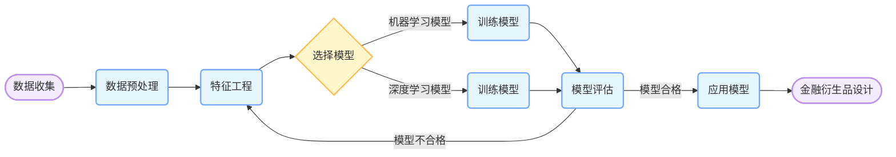

# AI在金融衍生品设计中的创新应用

> 关键词：AI、金融衍生品设计、创新应用、机器学习、深度学习

> 摘要：本文聚焦于AI在金融衍生品设计中的创新应用。随着金融市场的日益复杂和技术的快速发展，AI技术为金融衍生品的设计带来了新的思路和方法。文章详细介绍了AI在金融衍生品设计中的背景知识，包括目的、预期读者、文档结构和相关术语。深入探讨了核心概念、算法原理、数学模型，并通过项目实战案例展示了AI在实际中的应用。同时，分析了实际应用场景，推荐了相关的学习资源、开发工具和论文著作。最后，总结了未来发展趋势与挑战，并对常见问题进行了解答。

## 1. 背景介绍 
### 1.1 目的和范围
金融衍生品是一种金融合约，其价值取决于一种或多种基础资产或指数。传统的金融衍生品设计方法往往依赖于经验和简单的数学模型，难以应对日益复杂的市场环境和投资者需求。而AI技术具有强大的数据处理和分析能力，能够从海量数据中挖掘潜在的规律和模式，为金融衍生品的设计提供更精准的风险评估、定价和创新思路。本文的目的是探讨AI在金融衍生品设计中的创新应用，涵盖了从核心概念到实际应用的各个方面，旨在为金融从业者、技术人员和研究者提供全面的参考。

### 1.2 预期读者
本文预期读者包括金融行业的从业者，如金融分析师、交易员、产品设计师等，他们可以从本文中了解AI技术如何应用于金融衍生品设计，为实际工作提供新的方法和思路。同时，也适合计算机科学领域的技术人员，特别是对金融科技感兴趣的开发者，通过本文可以了解金融业务背景，拓展技术应用场景。此外，高校相关专业的师生和研究人员也可以从本文中获取有价值的研究资料和参考信息。

### 1.3 文档结构概述
本文首先介绍了AI在金融衍生品设计中的背景知识，包括目的、预期读者和文档结构。接着阐述了核心概念与联系，通过文本示意图和Mermaid流程图展示了相关原理和架构。然后详细讲解了核心算法原理和具体操作步骤，并给出了Python源代码示例。之后介绍了数学模型和公式，并进行详细讲解和举例说明。通过项目实战部分展示了代码实际案例和详细解释。分析了实际应用场景，推荐了相关的工具和资源。最后总结了未来发展趋势与挑战，解答了常见问题，并提供了扩展阅读和参考资料。

### 1.4 术语表
#### 1.4.1 核心术语定义
- **AI（Artificial Intelligence）**：人工智能，是一门研究如何使计算机能够模拟人类智能的学科，包括机器学习、深度学习、自然语言处理等技术。
- **金融衍生品（Financial Derivatives）**：一种金融合约，其价值取决于一种或多种基础资产或指数，如股票、债券、商品、利率等。常见的金融衍生品包括期货、期权、互换等。
- **机器学习（Machine Learning）**：人工智能的一个分支，通过让计算机从数据中学习模式和规律，从而实现预测、分类、聚类等任务。
- **深度学习（Deep Learning）**：机器学习的一个子领域，基于神经网络模型，通过多层神经元的组合来学习数据的复杂特征和模式。

#### 1.4.2 相关概念解释
- **风险评估（Risk Assessment）**：对金融衍生品可能面临的各种风险进行评估和量化，包括市场风险、信用风险、流动性风险等。
- **定价模型（Pricing Model）**：用于确定金融衍生品价格的数学模型，常见的定价模型包括Black-Scholes模型、二叉树模型等。
- **数据挖掘（Data Mining）**：从大量数据中发现潜在的模式、关系和知识的过程，常用于金融市场分析和预测。

#### 1.4.3 缩略词列表
- **AI**：Artificial Intelligence
- **ML**：Machine Learning
- **DL**：Deep Learning
- **NLP**：Natural Language Processing
- **BSM**：Black-Scholes Model

## 2. 核心概念与联系 

### 核心概念原理
在金融衍生品设计中，AI技术主要通过以下几个方面发挥作用：
- **数据驱动的决策**：AI可以处理和分析大量的金融数据，包括历史价格数据、宏观经济数据、公司财务数据等，从中发现潜在的规律和模式，为金融衍生品的设计提供决策依据。
- **风险评估与管理**：利用机器学习和深度学习算法，对金融衍生品的风险进行更准确的评估和预测，帮助投资者和金融机构更好地管理风险。
- **定价模型优化**：传统的定价模型往往基于一些假设和简化，而AI可以通过学习大量的数据，优化定价模型，提高定价的准确性。
- **产品创新**：AI可以帮助金融机构发现新的市场需求和投资机会，设计出更符合投资者需求的金融衍生品。

### 架构的文本示意图
```plaintext
金融衍生品设计系统
|-- 数据层
|   |-- 历史价格数据
|   |-- 宏观经济数据
|   |-- 公司财务数据
|   |-- 其他相关数据
|-- 模型层
|   |-- 机器学习模型
|   |   |-- 线性回归模型
|   |   |-- 逻辑回归模型
|   |   |-- 决策树模型
|   |   |-- 随机森林模型
|   |-- 深度学习模型
|   |   |-- 神经网络模型
|   |   |-- 卷积神经网络模型
|   |   |-- 循环神经网络模型
|-- 应用层
|   |-- 风险评估
|   |-- 定价模型
|   |-- 产品创新
```

### Mermaid流程图


## 3. 核心算法原理 & 具体操作步骤 

### 线性回归模型原理
线性回归是一种基本的机器学习算法，用于建立自变量和因变量之间的线性关系。在金融衍生品设计中，线性回归可以用于预测金融资产的价格走势。

线性回归的数学模型可以表示为：
$$y = \theta_0 + \theta_1x_1 + \theta_2x_2 + \cdots + \theta_nx_n + \epsilon$$
其中，$y$ 是因变量，$x_1, x_2, \cdots, x_n$ 是自变量，$\theta_0, \theta_1, \cdots, \theta_n$ 是模型的参数，$\epsilon$ 是误差项。

### Python代码实现
```python
import numpy as np
from sklearn.linear_model import LinearRegression

# 生成示例数据
X = np.array([[1], [2], [3], [4], [5]])
y = np.array([2, 4, 6, 8, 10])

# 创建线性回归模型
model = LinearRegression()

# 训练模型
model.fit(X, y)

# 预测新数据
new_X = np.array([[6]])
prediction = model.predict(new_X)

print("预测结果:", prediction)
```

### 具体操作步骤
1. **数据收集**：收集与金融衍生品相关的历史数据，如基础资产的价格、利率、波动率等。
2. **数据预处理**：对收集到的数据进行清洗、缺失值处理、异常值处理等操作，确保数据的质量。
3. **特征工程**：从原始数据中提取有价值的特征，如计算收益率、波动率等。
4. **模型选择**：根据问题的特点和数据的性质，选择合适的机器学习或深度学习模型。
5. **模型训练**：使用训练数据对模型进行训练，调整模型的参数，使模型能够更好地拟合数据。
6. **模型评估**：使用测试数据对训练好的模型进行评估，计算模型的性能指标，如均方误差、准确率等。
7. **模型应用**：将评估合格的模型应用于金融衍生品的设计中，如风险评估、定价等。

## 4. 数学模型和公式 & 详细讲解 & 举例说明 

### Black-Scholes模型
Black-Scholes模型是一种经典的期权定价模型，用于计算欧式期权的理论价格。该模型基于以下假设：
- 基础资产的价格遵循几何布朗运动。
- 无风险利率是常数。
- 市场无摩擦，即没有交易成本和税收。
- 允许卖空。

Black-Scholes模型的公式如下：
对于看涨期权：
$$C = S_0N(d_1) - Ke^{-rT}N(d_2)$$
对于看跌期权：
$$P = Ke^{-rT}N(-d_2) - S_0N(-d_1)$$
其中：
$$d_1 = \frac{\ln(\frac{S_0}{K}) + (r + \frac{\sigma^2}{2})T}{\sigma\sqrt{T}}$$
$$d_2 = d_1 - \sigma\sqrt{T}$$
$C$ 是看涨期权的价格，$P$ 是看跌期权的价格，$S_0$ 是基础资产的当前价格，$K$ 是期权的执行价格，$r$ 是无风险利率，$T$ 是期权的到期时间，$\sigma$ 是基础资产的波动率，$N(x)$ 是标准正态分布的累积分布函数。

### 详细讲解
Black-Scholes模型的核心思想是通过构建一个无风险的投资组合，使得该组合的收益等于期权的收益。通过对该投资组合进行动态调整，可以消除风险，从而得到期权的理论价格。

### 举例说明
假设某股票的当前价格 $S_0 = 100$ 元，期权的执行价格 $K = 105$ 元，无风险利率 $r = 0.05$，期权的到期时间 $T = 1$ 年，股票的波动率 $\sigma = 0.2$。

首先计算 $d_1$ 和 $d_2$：
$$d_1 = \frac{\ln(\frac{100}{105}) + (0.05 + \frac{0.2^2}{2})\times1}{0.2\sqrt{1}} \approx -0.02$$
$$d_2 = d_1 - 0.2\sqrt{1} \approx -0.22$$

然后计算 $N(d_1)$ 和 $N(d_2)$：
通过查标准正态分布表或使用Python的`scipy.stats.norm.cdf`函数，可以得到 $N(d_1) \approx 0.4920$，$N(d_2) \approx 0.4129$。

最后计算看涨期权的价格：
$$C = 100\times0.4920 - 105\times e^{-0.05\times1}\times0.4129 \approx 7.52$$

因此，该看涨期权的理论价格约为7.52元。

## 5. 项目实战：代码实际案例和详细解释说明 

### 5.1  开发环境搭建
- **操作系统**：Windows、Linux或Mac OS。
- **Python版本**：Python 3.6及以上。
- **开发工具**：推荐使用Jupyter Notebook或PyCharm。
- **所需库**：`numpy`、`pandas`、`scikit-learn`、`tensorflow`或`pytorch`等。

可以使用以下命令安装所需库：
```sh
pip install numpy pandas scikit-learn tensorflow
```

### 5.2  源代码详细实现和代码解读
以下是一个使用Python和`scikit-learn`库实现的简单的金融衍生品风险评估模型的示例代码：

```python
import numpy as np
import pandas as pd
from sklearn.model_selection import train_test_split
from sklearn.linear_model import LogisticRegression
from sklearn.metrics import accuracy_score

# 生成示例数据
data = {
    'asset_price': [100, 102, 105, 103, 108, 110, 106, 104, 107, 109],
    'volatility': [0.1, 0.12, 0.15, 0.13, 0.18, 0.2, 0.16, 0.14, 0.17, 0.19],
    'risk_level': [0, 0, 1, 0, 1, 1, 1, 0, 1, 1]
}
df = pd.DataFrame(data)

# 提取特征和标签
X = df[['asset_price', 'volatility']]
y = df['risk_level']

# 划分训练集和测试集
X_train, X_test, y_train, y_test = train_test_split(X, y, test_size=0.2, random_state=42)

# 创建逻辑回归模型
model = LogisticRegression()

# 训练模型
model.fit(X_train, y_train)

# 预测测试集
y_pred = model.predict(X_test)

# 计算准确率
accuracy = accuracy_score(y_test, y_pred)
print("模型准确率:", accuracy)
```

### 代码解读与分析
1. **数据生成**：使用字典创建一个包含资产价格、波动率和风险水平的示例数据集，并将其转换为`pandas`的`DataFrame`对象。
2. **特征提取**：从`DataFrame`中提取特征（资产价格和波动率）和标签（风险水平）。
3. **数据集划分**：使用`train_test_split`函数将数据集划分为训练集和测试集，测试集占比为20%。
4. **模型创建**：创建一个逻辑回归模型。
5. **模型训练**：使用训练集对模型进行训练。
6. **模型预测**：使用训练好的模型对测试集进行预测。
7. **模型评估**：使用`accuracy_score`函数计算模型的准确率。

通过这个示例，我们可以看到如何使用机器学习算法对金融衍生品的风险进行评估。

## 6. 实际应用场景 
### 风险评估与管理
AI可以帮助金融机构更准确地评估金融衍生品的风险。通过分析大量的历史数据和实时市场信息，AI模型可以预测金融衍生品的价格波动、违约风险等，为金融机构提供更及时、准确的风险预警。例如，银行可以使用AI模型对信贷衍生品的信用风险进行评估，提前采取措施防范风险。

### 定价模型优化
传统的定价模型往往基于一些假设和简化，难以准确反映市场的实际情况。AI可以通过学习大量的数据，优化定价模型，提高定价的准确性。例如，使用深度学习模型对期权进行定价，可以考虑更多的因素，如市场情绪、宏观经济环境等，从而得到更合理的价格。

### 产品创新
AI可以帮助金融机构发现新的市场需求和投资机会，设计出更符合投资者需求的金融衍生品。例如，通过分析投资者的行为数据和偏好，金融机构可以设计出个性化的金融衍生品，满足不同投资者的需求。

### 交易策略制定
AI可以分析市场数据和历史交易记录，发现潜在的交易机会，制定更有效的交易策略。例如，使用机器学习算法对股票期货市场进行分析，预测价格走势，从而制定买卖策略。

## 7. 工具和资源推荐
### 7.1 学习资源推荐
#### 7.1.1 书籍推荐
- 《人工智能：一种现代的方法》：全面介绍了人工智能的基本概念、算法和应用，是人工智能领域的经典教材。
- 《Python机器学习》：详细介绍了使用Python进行机器学习的方法和技巧，适合初学者入门。
- 《金融衍生品定价与风险管理》：深入讲解了金融衍生品的定价模型和风险管理方法，是金融领域的重要参考书。

#### 7.1.2 在线课程
- Coursera上的“机器学习”课程：由斯坦福大学教授Andrew Ng主讲，是机器学习领域最受欢迎的在线课程之一。
- edX上的“人工智能基础”课程：介绍了人工智能的基本概念、算法和应用，适合初学者学习。
- Udemy上的“金融科技实战”课程：结合实际案例，介绍了金融科技的应用和开发方法。

#### 7.1.3 技术博客和网站
- Medium：一个技术博客平台，上面有很多关于AI和金融科技的文章和教程。
- Towards Data Science：专注于数据科学和机器学习领域的博客，提供了很多有价值的技术文章和案例分析。
- QuantNet：一个金融量化分析的社区，提供了金融衍生品设计、交易策略制定等方面的技术讨论和资源分享。

### 7.2 开发工具框架推荐
#### 7.2.1 IDE和编辑器
- Jupyter Notebook：一个交互式的开发环境，适合进行数据分析和模型开发。
- PyCharm：一款专业的Python集成开发环境，提供了丰富的功能和插件，适合大规模项目的开发。
- Visual Studio Code：一款轻量级的代码编辑器，支持多种编程语言和插件，适合快速开发和调试。

#### 7.2.2 调试和性能分析工具
- TensorBoard：TensorFlow提供的可视化工具，用于监控模型的训练过程和性能指标。
- Py-Spy：一个Python性能分析工具，可以帮助开发者找出代码中的性能瓶颈。
- PDB：Python自带的调试工具，用于调试Python代码。

#### 7.2.3 相关框架和库
- TensorFlow：一个开源的深度学习框架，提供了丰富的深度学习模型和工具。
- PyTorch：另一个流行的深度学习框架，具有简洁易用的特点，适合快速开发和研究。
- Scikit-learn：一个简单易用的机器学习库，提供了各种机器学习算法和工具。

### 7.3 相关论文著作推荐
#### 7.3.1 经典论文
- "The Pricing of Options and Corporate Liabilities" by Fischer Black and Myron Scholes：提出了Black-Scholes期权定价模型，是金融衍生品定价领域的经典论文。
- "A Machine Learning Approach to Option Pricing and Hedging" by Marco Avellaneda and Sanjeev Babu：介绍了使用机器学习方法进行期权定价和套期保值的研究。

#### 7.3.2 最新研究成果
可以通过学术数据库如IEEE Xplore、ACM Digital Library、ScienceDirect等查找关于AI在金融衍生品设计中的最新研究成果。

#### 7.3.3 应用案例分析
一些金融机构和研究机构会发布关于AI在金融衍生品设计中的应用案例分析报告，可以关注相关机构的官方网站获取这些资料。

## 8. 总结：未来发展趋势与挑战
### 未来发展趋势
- **融合多种技术**：未来，AI将与区块链、物联网等技术深度融合，为金融衍生品设计带来更多的创新应用。例如，区块链技术可以提高金融衍生品交易的透明度和安全性，物联网技术可以提供更多的实时数据，为AI模型的训练和预测提供支持。
- **个性化定制**：随着投资者需求的日益多样化，金融衍生品将越来越注重个性化定制。AI可以根据投资者的风险偏好、投资目标等因素，为投资者设计出个性化的金融衍生品。
- **智能投顾**：AI将在智能投顾领域发挥越来越重要的作用。智能投顾可以根据投资者的情况，为投资者提供自动化的投资建议和资产配置方案，降低投资门槛和成本。

### 挑战
- **数据质量和隐私问题**：AI的应用依赖于大量的数据，但金融数据往往存在质量不高、隐私保护等问题。如何获取高质量的数据，并确保数据的隐私和安全，是AI在金融衍生品设计中面临的重要挑战。
- **模型解释性**：一些深度学习模型如神经网络模型具有很强的预测能力，但模型的解释性较差。在金融领域，模型的解释性非常重要，因为金融决策需要有明确的依据。如何提高模型的解释性，是AI在金融衍生品设计中需要解决的问题。
- **监管问题**：随着AI在金融领域的广泛应用，监管机构需要制定相应的监管政策和标准，确保AI的应用符合法律法规和道德规范。如何平衡创新和监管的关系，是金融行业面临的挑战之一。

## 9. 附录：常见问题与解答
### 问题1：AI在金融衍生品设计中的应用是否会取代人类分析师？
答：不会。虽然AI具有强大的数据处理和分析能力，但人类分析师具有丰富的经验和专业知识，能够对市场情况进行综合判断和分析。AI在金融衍生品设计中的应用可以辅助人类分析师，提高工作效率和准确性，但不能完全取代人类分析师。

### 问题2：如何选择适合的AI模型用于金融衍生品设计？
答：选择适合的AI模型需要考虑多个因素，如问题的特点、数据的性质、模型的复杂度等。一般来说，可以先从简单的模型开始尝试，如线性回归模型、逻辑回归模型等，然后根据模型的性能和效果，逐步尝试更复杂的模型，如神经网络模型、深度学习模型等。同时，还可以使用交叉验证等方法对不同的模型进行评估和比较，选择最优的模型。

### 问题3：AI在金融衍生品设计中的应用是否存在风险？
答：存在风险。AI模型的预测结果是基于历史数据和统计规律，而金融市场是复杂多变的，未来的市场情况可能与历史数据不同，因此AI模型的预测结果可能存在误差。此外，AI模型的训练和应用过程中还可能存在数据泄露、模型被攻击等风险。因此，在使用AI技术进行金融衍生品设计时，需要对风险进行充分的评估和管理。

## 10. 扩展阅读 & 参考资料
- 《金融科技前沿》：介绍了金融科技的最新发展趋势和应用案例。
- 《人工智能与金融》：探讨了人工智能在金融领域的应用和挑战。
- IEEE Transactions on Computational Intelligence in Finance：一个专注于金融计算智能领域的学术期刊，发表了很多关于AI在金融领域应用的研究论文。

作者：AI天才研究院/AI Genius Institute & 禅与计算机程序设计艺术 /Zen And The Art of Computer Programming