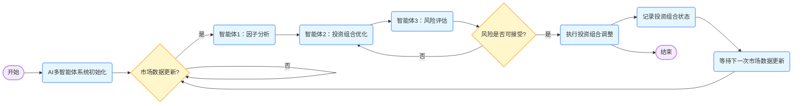

# AI多智能体优化价值投资的动态因子暴露控制

> 关键词：AI多智能体、价值投资、动态因子暴露控制、优化算法、金融市场

> 摘要：本文聚焦于AI多智能体在价值投资的动态因子暴露控制中的应用。首先介绍了相关背景知识，包括目的、预期读者等内容。接着阐述了核心概念与联系，详细说明了AI多智能体、价值投资以及动态因子暴露控制的原理和架构，并通过Mermaid流程图进行直观展示。深入讲解了核心算法原理，使用Python代码进行详细阐述，同时给出了数学模型和公式并举例说明。通过项目实战，展示了开发环境搭建、源代码实现与解读。探讨了实际应用场景，推荐了相关的工具和资源。最后对未来发展趋势与挑战进行总结，并提供了常见问题解答和扩展阅读参考资料，旨在为读者全面深入地理解AI多智能体在价值投资动态因子暴露控制中的应用提供帮助。

## 1. 背景介绍 
### 1.1 目的和范围
在金融投资领域，价值投资一直是投资者所追求的重要策略之一。然而，市场环境复杂多变，各种因子对资产价格的影响不断变化，如何有效控制因子暴露以实现投资组合的优化成为关键问题。本文的目的在于探讨如何利用AI多智能体技术来优化价值投资中的动态因子暴露控制。

范围涵盖了从理论层面的核心概念、算法原理、数学模型，到实践层面的项目实战、实际应用场景等多个方面。通过全面深入的研究，为投资者和金融从业者提供一种新的思路和方法，以提高价值投资的效率和收益。

### 1.2 预期读者
本文预期读者主要包括金融投资领域的专业人士，如基金经理、投资分析师等，他们可以从中获取新的投资策略和方法，提升投资组合的管理水平。同时，也适合计算机科学和人工智能领域的研究人员和开发者，他们可以了解到AI多智能体技术在金融领域的具体应用，为相关技术的研究和开发提供参考。此外，对金融投资和人工智能感兴趣的学生和爱好者也可以通过本文了解到跨学科领域的知识和应用。

### 1.3 文档结构概述
本文将按照以下结构进行阐述：首先介绍背景知识，包括目的、预期读者和文档结构概述等内容；接着详细讲解核心概念与联系，通过文本示意图和Mermaid流程图展示相关原理和架构；然后深入探讨核心算法原理，使用Python代码进行具体操作步骤的说明；给出数学模型和公式，并通过举例进行详细讲解；进行项目实战，包括开发环境搭建、源代码实现与解读；探讨实际应用场景；推荐相关的工具和资源；总结未来发展趋势与挑战；提供常见问题解答和扩展阅读参考资料。

### 1.4 术语表
#### 1.4.1 核心术语定义
- **AI多智能体**：是指由多个智能体组成的系统，每个智能体具有一定的自主性和智能，能够感知环境、做出决策并与其他智能体进行交互，共同完成特定的任务。
- **价值投资**：是一种投资策略，投资者通过分析公司的基本面，寻找被低估的资产进行投资，期望在长期内获得资产价值回归带来的收益。
- **动态因子暴露控制**：是指在投资过程中，根据市场环境和因子的变化，实时调整投资组合对各种因子的暴露程度，以实现投资目标的控制方法。

#### 1.4.2 相关概念解释
- **因子**：在金融领域，因子是指影响资产价格的各种因素，如市场风险、行业因素、公司规模等。
- **因子暴露**：是指投资组合对某个因子的敏感程度，通常用因子载荷来表示。
- **智能体**：是一种具有感知、决策和行动能力的实体，在AI多智能体系统中，智能体可以是软件程序或硬件设备。

#### 1.4.3 缩略词列表
- **AI**：Artificial Intelligence，人工智能
- **MDP**：Markov Decision Process，马尔可夫决策过程

## 2. 核心概念与联系 

### 核心概念原理
#### AI多智能体
AI多智能体系统由多个智能体组成，每个智能体具有自己的目标和行为规则。智能体可以感知周围环境的信息，根据自身的目标和规则做出决策，并与其他智能体进行交互。在价值投资的动态因子暴露控制中，每个智能体可以负责不同的任务，如因子分析、投资组合优化等，通过智能体之间的协作，实现对投资组合的动态调整。

#### 价值投资
价值投资的核心思想是寻找被市场低估的资产。投资者通过对公司的财务报表、行业前景等基本面因素进行分析，评估公司的内在价值。当资产的市场价格低于其内在价值时，投资者认为该资产具有投资价值，从而进行买入操作。在持有过程中，等待资产价值回归，获取投资收益。

#### 动态因子暴露控制
动态因子暴露控制是基于市场环境和因子的变化，实时调整投资组合对各种因子的暴露程度。因子的变化会影响资产的价格，通过控制投资组合对因子的暴露，可以降低投资组合的风险，提高投资收益。例如，当市场风险因子上升时，减少投资组合对市场风险因子的暴露，以降低投资组合的波动性。

### 架构的文本示意图
```plaintext
AI多智能体系统
├── 智能体1：因子分析
│   ├── 收集因子数据
│   ├── 分析因子变化趋势
│   ├── 预测因子未来走势
├── 智能体2：投资组合优化
│   ├── 根据因子分析结果
│   ├── 调整投资组合权重
│   ├── 控制因子暴露程度
├── 智能体3：风险评估
│   ├── 评估投资组合风险
│   ├── 反馈风险信息
│   ├── 协助调整投资组合
└── 环境：金融市场
    ├── 提供资产价格数据
    ├── 提供因子数据
    ├── 影响投资组合收益
```

### Mermaid流程图


## 3. 核心算法原理 & 具体操作步骤 

### 核心算法原理
在AI多智能体优化价值投资的动态因子暴露控制中，核心算法可以基于强化学习中的马尔可夫决策过程（MDP）。MDP是一种用于描述序列决策问题的数学模型，由状态空间、动作空间、状态转移概率、奖励函数等要素组成。

在本问题中，状态可以定义为投资组合的当前因子暴露情况、市场因子的当前状态等；动作可以定义为调整投资组合中各资产的权重；状态转移概率表示在执行某个动作后，系统从一个状态转移到另一个状态的概率；奖励函数可以根据投资组合的收益和风险来定义，如最大化投资组合的夏普比率。

### 具体操作步骤及Python代码实现
```python
import numpy as np
import random

# 定义状态空间
state_space = [(i, j) for i in range(10) for j in range(10)]  # 假设状态空间是一个10x10的网格

# 定义动作空间
action_space = ['up', 'down', 'left', 'right']

# 初始化Q表
Q_table = {}
for state in state_space:
    for action in action_space:
        Q_table[(state, action)] = 0

# 定义超参数
alpha = 0.1  # 学习率
gamma = 0.9  # 折扣因子
epsilon = 0.1  # 探索率

# 定义奖励函数
def reward_function(state, action):
    # 这里简单假设到达特定状态有奖励，其他状态奖励为0
    if state == (8, 8):
        return 100
    else:
        return 0

# 定义状态转移函数
def state_transition(state, action):
    x, y = state
    if action == 'up':
        y = min(y + 1, 9)
    elif action == 'down':
        y = max(y - 1, 0)
    elif action == 'left':
        x = max(x - 1, 0)
    elif action == 'right':
        x = min(x + 1, 9)
    return (x, y)

# 训练过程
num_episodes = 1000
for episode in range(num_episodes):
    state = random.choice(state_space)
    done = False
    while not done:
        # 选择动作
        if random.uniform(0, 1) < epsilon:
            action = random.choice(action_space)
        else:
            q_values = [Q_table[(state, a)] for a in action_space]
            action = action_space[np.argmax(q_values)]
        
        # 执行动作，得到下一个状态和奖励
        next_state = state_transition(state, action)
        reward = reward_function(state, action)
        
        # 更新Q表
        q_values_next = [Q_table[(next_state, a)] for a in action_space]
        max_q_next = np.max(q_values_next)
        Q_table[(state, action)] = (1 - alpha) * Q_table[(state, action)] + alpha * (reward + gamma * max_q_next)
        
        # 判断是否结束
        if state == (8, 8):
            done = True
        state = next_state

# 测试过程
state = random.choice(state_space)
done = False
while not done:
    q_values = [Q_table[(state, a)] for a in action_space]
    action = action_space[np.argmax(q_values)]
    next_state = state_transition(state, action)
    reward = reward_function(state, action)
    print(f"当前状态: {state}, 动作: {action}, 奖励: {reward}")
    if state == (8, 8):
        done = True
    state = next_state
```

### 代码解释
1. **状态空间和动作空间定义**：定义了状态空间为一个10x10的网格，动作空间包括上、下、左、右四个方向。
2. **Q表初始化**：初始化Q表，用于存储每个状态-动作对的Q值。
3. **超参数设置**：设置学习率、折扣因子和探索率。
4. **奖励函数和状态转移函数**：定义了奖励函数和状态转移函数，用于计算奖励和更新状态。
5. **训练过程**：通过多次迭代，使用Q学习算法更新Q表。
6. **测试过程**：使用训练好的Q表进行测试，选择最优动作并输出状态、动作和奖励信息。

## 4. 数学模型和公式 & 详细讲解 & 举例说明 

### 马尔可夫决策过程（MDP）数学模型
马尔可夫决策过程可以用一个五元组 $(S, A, P, R, \gamma)$ 来表示，其中：
- $S$ 是状态空间，表示系统可能处于的所有状态的集合。
- $A$ 是动作空间，表示智能体可以执行的所有动作的集合。
- $P(s'|s, a)$ 是状态转移概率，表示在状态 $s$ 执行动作 $a$ 后，系统转移到状态 $s'$ 的概率。
- $R(s, a, s')$ 是奖励函数，表示在状态 $s$ 执行动作 $a$ 后，系统转移到状态 $s'$ 时获得的奖励。
- $\gamma \in [0, 1]$ 是折扣因子，用于衡量未来奖励的重要性。

### Q学习算法公式
Q学习算法的目标是学习一个最优的动作价值函数 $Q(s, a)$，表示在状态 $s$ 执行动作 $a$ 后，能够获得的最大累积折扣奖励。Q学习算法的更新公式如下：
$$Q(s, a) \leftarrow (1 - \alpha)Q(s, a) + \alpha[R(s, a, s') + \gamma \max_{a'} Q(s', a')]$$
其中，$\alpha$ 是学习率，控制新信息对旧信息的更新程度；$\gamma$ 是折扣因子，用于计算未来奖励的折扣值。

### 详细讲解
在AI多智能体优化价值投资的动态因子暴露控制中，状态 $s$ 可以表示投资组合的当前因子暴露情况和市场因子的当前状态；动作 $a$ 可以表示调整投资组合中各资产的权重；状态转移概率 $P(s'|s, a)$ 表示在调整投资组合权重后，投资组合的因子暴露情况和市场因子状态的变化概率；奖励函数 $R(s, a, s')$ 可以根据投资组合的收益和风险来定义，如最大化投资组合的夏普比率。

### 举例说明
假设投资组合当前的因子暴露情况为 $s = (0.2, 0.3, 0.5)$，表示对三个因子的暴露程度分别为0.2、0.3和0.5。智能体选择的动作 $a$ 是将第一个因子的暴露程度增加0.1，即调整后的投资组合因子暴露情况为 $s' = (0.3, 0.3, 0.5)$。在这个过程中，奖励函数 $R(s, a, s')$ 可以根据投资组合的收益和风险来计算，如投资组合的夏普比率提高了，则奖励为正；反之，则奖励为负。

## 5. 项目实战：代码实际案例和详细解释说明 

### 5.1  开发环境搭建
#### 安装Python
首先需要安装Python环境，建议使用Python 3.7及以上版本。可以从Python官方网站（https://www.python.org/downloads/） 下载安装包，按照安装向导进行安装。

#### 安装必要的库
在项目中，需要使用一些Python库，如`numpy`、`pandas`等。可以使用`pip`命令进行安装：
```sh
pip install numpy pandas
```

### 5.2  源代码详细实现和代码解读
```python
import numpy as np
import pandas as pd

# 模拟市场数据
np.random.seed(0)
num_assets = 5
num_periods = 100
asset_returns = pd.DataFrame(np.random.randn(num_periods, num_assets))
factor_returns = pd.DataFrame(np.random.randn(num_periods, 3))

# 计算因子暴露
factor_loadings = np.linalg.lstsq(factor_returns, asset_returns, rcond=None)[0]

# 定义目标因子暴露
target_factor_exposure = np.array([0.1, 0.2, 0.3])

# 初始化投资组合权重
portfolio_weights = np.ones(num_assets) / num_assets

# 定义优化函数
def optimize_portfolio(weights, factor_loadings, target_exposure):
    current_exposure = np.dot(factor_loadings.T, weights)
    error = np.sum((current_exposure - target_exposure) ** 2)
    return error

# 使用优化算法调整投资组合权重
from scipy.optimize import minimize

constraints = ({'type': 'eq', 'fun': lambda x: np.sum(x) - 1})  # 权重之和为1
bounds = [(0, 1) for _ in range(num_assets)]  # 权重范围在0到1之间

result = minimize(optimize_portfolio, portfolio_weights, args=(factor_loadings, target_factor_exposure),
                  constraints=constraints, bounds=bounds)

optimal_weights = result.x

# 输出结果
print("初始投资组合权重:", portfolio_weights)
print("最优投资组合权重:", optimal_weights)
```

### 5.3  代码解读与分析
1. **模拟市场数据**：使用`numpy`生成模拟的资产收益率和因子收益率数据。
2. **计算因子暴露**：使用最小二乘法计算资产对因子的暴露程度。
3. **定义目标因子暴露**：设定投资组合的目标因子暴露。
4. **初始化投资组合权重**：将投资组合的初始权重设置为平均权重。
5. **定义优化函数**：定义一个优化函数，用于计算当前因子暴露与目标因子暴露之间的误差。
6. **使用优化算法调整投资组合权重**：使用`scipy.optimize.minimize`函数进行优化，约束条件为权重之和为1，权重范围在0到1之间。
7. **输出结果**：输出初始投资组合权重和最优投资组合权重。

## 6. 实际应用场景 
### 基金管理
在基金管理中，基金经理可以使用AI多智能体优化价值投资的动态因子暴露控制方法来调整基金的投资组合。通过实时监测市场因子的变化，动态调整基金对各种因子的暴露程度，以降低基金的风险，提高基金的收益。例如，当市场风险因子上升时，减少基金对市场风险因子的暴露，增加对防御性因子的暴露。

### 个人投资
个人投资者也可以利用这种方法来优化自己的投资组合。通过分析自己的投资目标和风险承受能力，设定目标因子暴露，然后使用AI多智能体技术实时调整投资组合的权重。例如，个人投资者可以根据自己的年龄、收入等因素，确定对不同因子的偏好，如年轻投资者可以更多地暴露于成长因子，而老年投资者可以更多地暴露于价值因子。

### 量化投资策略开发
量化投资机构可以将AI多智能体优化价值投资的动态因子暴露控制方法应用于量化投资策略的开发中。通过构建复杂的多智能体系统，结合机器学习和深度学习算法，开发出更加智能、高效的量化投资策略。例如，利用智能体对市场数据进行实时分析和预测，根据预测结果动态调整投资组合的权重。

## 7. 工具和资源推荐
### 7.1 学习资源推荐
#### 7.1.1 书籍推荐
- 《人工智能：一种现代的方法》：全面介绍了人工智能的基本概念、算法和应用，是学习人工智能的经典教材。
- 《Python机器学习》：详细介绍了Python在机器学习中的应用，包括各种机器学习算法的原理和实现。
- 《金融市场与金融机构》：介绍了金融市场和金融机构的基本概念、运作机制和风险管理等内容，是学习金融投资的重要书籍。

#### 7.1.2 在线课程
- Coursera上的“人工智能基础”课程：由知名高校的教授授课，系统介绍了人工智能的基础知识和算法。
- edX上的“Python数据科学”课程：讲解了Python在数据科学中的应用，包括数据处理、数据分析和机器学习等内容。
- 中国大学MOOC上的“金融投资学”课程：介绍了金融投资的基本理论和方法，适合初学者学习。

#### 7.1.3 技术博客和网站
- Towards Data Science：是一个专注于数据科学和机器学习的技术博客，提供了大量的优质文章和教程。
- Medium：是一个综合性的技术博客平台，有很多关于人工智能和金融投资的文章。
- 金融界网站：提供了丰富的金融市场数据和分析报告，是了解金融市场的重要网站。

### 7.2 开发工具框架推荐
#### 7.2.1 IDE和编辑器
- PyCharm：是一款专业的Python集成开发环境，具有代码编辑、调试、版本控制等功能，适合Python项目的开发。
- Jupyter Notebook：是一个交互式的开发环境，支持Python、R等多种编程语言，适合数据探索和分析。
- Visual Studio Code：是一款轻量级的代码编辑器，支持多种编程语言和插件扩展，适合快速开发和调试。

#### 7.2.2 调试和性能分析工具
- pdb：是Python自带的调试工具，可以帮助开发者定位和解决代码中的问题。
- cProfile：是Python的性能分析工具，可以分析代码的运行时间和函数调用情况，帮助开发者优化代码性能。
- TensorBoard：是TensorFlow的可视化工具，可以用于可视化训练过程和模型性能，帮助开发者调试和优化深度学习模型。

#### 7.2.3 相关框架和库
- TensorFlow：是一个开源的深度学习框架，提供了丰富的深度学习模型和工具，适合开发各种人工智能应用。
- PyTorch：是另一个流行的深度学习框架，具有简洁易用的API和高效的计算性能，受到了很多研究者和开发者的喜爱。
- scikit-learn：是一个开源的机器学习库，提供了各种机器学习算法和工具，适合快速开发机器学习模型。

### 7.3 相关论文著作推荐
#### 7.3.1 经典论文
- “Reinforcement Learning: An Introduction”：是强化学习领域的经典论文，系统介绍了强化学习的基本概念、算法和应用。
- “A New Approach to Linear Filtering and Prediction Problems”：提出了卡尔曼滤波算法，是控制理论和信号处理领域的重要论文。
- “Capital Asset Pricing Model: A Theory of Market Equilibrium Under Conditions of Risk”：提出了资本资产定价模型（CAPM），是金融投资领域的经典论文。

#### 7.3.2 最新研究成果
- 在顶级学术期刊如《Journal of Financial Economics》、《Management Science》等上发表的关于AI在金融投资中的应用的最新研究成果。
- 在人工智能和机器学习领域的顶级会议如NeurIPS、ICML等上发表的关于多智能体系统和强化学习的最新研究成果。

#### 7.3.3 应用案例分析
- 一些知名金融机构如高盛、摩根大通等发布的关于AI在投资组合管理中的应用案例分析报告。
- 一些量化投资公司如文艺复兴科技、Two Sigma等分享的关于使用AI技术进行投资策略开发的案例分析。

## 8. 总结：未来发展趋势与挑战
### 未来发展趋势
#### 融合更多的技术
未来，AI多智能体优化价值投资的动态因子暴露控制将融合更多的技术，如深度学习、区块链等。深度学习可以用于更准确地预测市场因子的变化，区块链可以用于提高数据的安全性和透明度，从而进一步提高投资组合的优化效果。

#### 跨领域应用
这种方法将不仅仅应用于金融投资领域，还将拓展到其他领域，如供应链管理、能源管理等。在这些领域中，也存在着类似的动态优化问题，AI多智能体技术可以为解决这些问题提供新的思路和方法。

#### 智能化决策
随着人工智能技术的不断发展，投资决策将变得更加智能化。AI多智能体系统可以自动分析市场数据、预测市场趋势，并根据投资目标和风险偏好自动调整投资组合的权重，实现真正的智能化投资决策。

### 挑战
#### 数据质量和安全
在使用AI多智能体进行投资决策时，需要大量的市场数据和金融数据。数据的质量和安全将直接影响到投资决策的准确性和可靠性。因此，如何获取高质量的数据，并保证数据的安全，是一个重要的挑战。

#### 模型解释性
AI多智能体系统通常是一个复杂的黑箱模型，其决策过程和结果往往难以解释。在金融投资领域，投资者和监管机构需要了解投资决策的依据和风险，因此如何提高模型的解释性，是一个亟待解决的问题。

#### 市场不确定性
金融市场具有高度的不确定性，市场因子的变化往往难以预测。AI多智能体系统在面对市场不确定性时，可能会出现决策失误的情况。因此，如何提高系统的鲁棒性和适应性，是一个重要的挑战。

## 9. 附录：常见问题与解答
### 问题1：AI多智能体系统中的智能体是如何协作的？
智能体之间的协作可以通过多种方式实现，如消息传递、共享知识等。每个智能体可以根据自己的任务和目标，收集和分析相关的信息，并将结果传递给其他智能体。其他智能体可以根据接收到的信息，做出相应的决策，并与其他智能体进行进一步的协作。

### 问题2：如何确定投资组合的目标因子暴露？
确定投资组合的目标因子暴露需要考虑多个因素，如投资目标、风险承受能力、市场环境等。投资者可以根据自己的投资目标和风险偏好，选择合适的因子，并设定相应的暴露程度。同时，也可以参考市场上的一些基准指数，如沪深300指数等，来确定投资组合的目标因子暴露。

### 问题3：AI多智能体优化价值投资的动态因子暴露控制方法的计算复杂度如何？
该方法的计算复杂度主要取决于智能体的数量、状态空间的大小和算法的复杂度等因素。在实际应用中，可以通过优化算法和数据结构，降低计算复杂度。例如，可以使用并行计算技术，提高计算效率。

## 10. 扩展阅读 & 参考资料
### 扩展阅读
- 《智能投资：人工智能时代的投资革命》：介绍了人工智能在投资领域的应用和发展趋势，适合对智能投资感兴趣的读者阅读。
- 《多智能体系统》：详细介绍了多智能体系统的基本概念、算法和应用，是学习多智能体系统的重要书籍。
- 《金融科技前沿：技术驱动的金融创新》：介绍了金融科技的最新发展和应用，包括AI在金融投资中的应用，适合金融从业者和科技爱好者阅读。

### 参考资料
- 相关学术论文和研究报告，如在《Journal of Financial Economics》、《Management Science》等期刊上发表的论文。
- 金融机构和量化投资公司发布的研究报告和案例分析，如高盛、摩根大通、文艺复兴科技等公司的报告。
- 在线课程和教程，如Coursera、edX、中国大学MOOC等平台上的相关课程。

作者：AI天才研究院/AI Genius Institute & 禅与计算机程序设计艺术 /Zen And The Art of Computer Programming