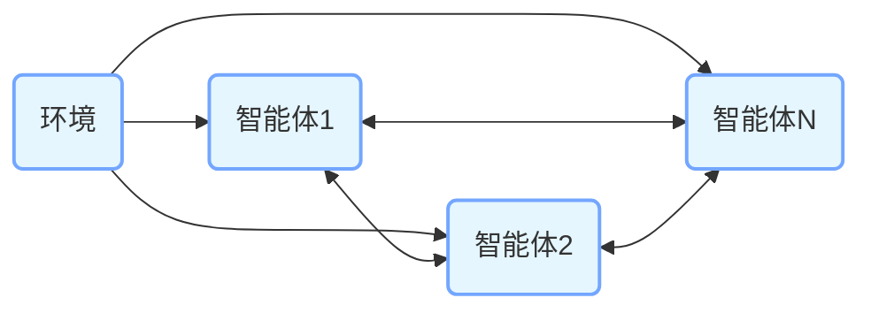

# AI多智能体优化价值投资的动态行业配置策略

> 关键词：AI多智能体、价值投资、动态行业配置、优化策略、金融市场

> 摘要：本文聚焦于AI多智能体优化价值投资的动态行业配置策略。在金融市场不断变化的背景下，传统投资策略面临诸多挑战，而借助AI多智能体技术可以更精准地把握市场动态，实现更有效的行业配置。文章详细介绍了该策略的核心概念、算法原理、数学模型，并通过项目实战展示了具体实现过程，同时探讨了其实际应用场景，推荐了相关的学习资源、开发工具和研究论文，最后对未来发展趋势与挑战进行了总结，旨在为投资者和研究人员提供全面且深入的技术参考。

## 1. 背景介绍 
### 1.1 目的和范围
随着金融市场的日益复杂和全球化，投资者面临着越来越多的挑战，如市场的不确定性、行业轮动的频繁性等。传统的价值投资策略虽然强调基于公司基本面进行投资，但在动态的市场环境中，难以快速适应行业的变化。本文的目的在于探索如何利用AI多智能体技术优化价值投资的动态行业配置策略，以提高投资组合的收益和降低风险。

本文的范围涵盖了从AI多智能体的基本概念到具体的价值投资行业配置策略的实现，包括核心算法原理、数学模型的建立、项目实战案例以及实际应用场景的分析等方面。

### 1.2 预期读者
本文预期读者包括金融领域的投资者、投资分析师、量化投资研究人员，以及对人工智能在金融领域应用感兴趣的计算机科学专业人士。对于想要深入了解如何将AI技术应用于价值投资行业配置的读者来说，本文将提供有价值的参考。

### 1.3 文档结构概述
本文将按照以下结构进行阐述：首先介绍核心概念与联系，明确AI多智能体、价值投资和动态行业配置之间的关系；接着详细讲解核心算法原理和具体操作步骤，并给出Python源代码；然后建立数学模型和公式，并通过举例进行说明；之后通过项目实战展示代码的实际应用和详细解释；再探讨该策略的实际应用场景；推荐相关的工具和资源；最后总结未来发展趋势与挑战，并提供常见问题与解答以及扩展阅读和参考资料。

### 1.4 术语表
#### 1.4.1 核心术语定义
- **AI多智能体**：由多个智能体组成的系统，每个智能体具有一定的自主性和智能，能够感知环境、做出决策并与其他智能体进行交互，以实现共同的目标。
- **价值投资**：一种投资策略，基于对公司基本面的分析，寻找被低估的股票进行投资，期望在长期内获得价值回归带来的收益。
- **动态行业配置**：根据市场环境和行业发展的变化，动态地调整投资组合中不同行业的权重，以实现最优的投资收益。

#### 1.4.2 相关概念解释
- **智能体**：具有感知、决策和行动能力的实体，可以是软件程序、机器人等。在AI多智能体系统中，智能体通过与环境和其他智能体的交互来完成任务。
- **行业轮动**：指在不同的经济周期和市场环境下，不同行业的表现会有所差异，投资者可以通过把握行业轮动的规律来调整投资组合。

#### 1.4.3 缩略词列表
- **AI**：Artificial Intelligence，人工智能
- **MDP**：Markov Decision Process，马尔可夫决策过程

## 2. 核心概念与联系 
### 2.1 AI多智能体系统
AI多智能体系统是由多个智能体组成的分布式系统，每个智能体都有自己的目标和决策能力。智能体之间可以通过通信和协作来实现共同的目标。在价值投资的动态行业配置中，每个智能体可以代表一个投资决策单元，负责对某个行业或一组股票进行分析和决策。

以下是AI多智能体系统的架构示意图：

在这个架构中，智能体可以感知环境中的信息，如市场行情、行业数据等，并根据自身的决策规则做出投资决策。智能体之间可以通过信息共享和协作来优化整个投资组合的配置。

### 2.2 价值投资与动态行业配置
价值投资强调基于公司的内在价值进行投资，而动态行业配置则关注行业的轮动和市场环境的变化。将两者结合起来，可以在价值投资的基础上，通过动态调整行业配置来提高投资组合的收益。

例如，在经济复苏阶段，一些周期性行业如钢铁、汽车等可能会表现较好，此时可以增加这些行业的投资权重；而在经济衰退阶段，防御性行业如医药、消费等可能更具优势，应相应地调整投资组合。

### 2.3 核心概念之间的联系
AI多智能体系统可以为价值投资的动态行业配置提供更智能、更灵活的决策支持。每个智能体可以根据自身的专业知识和经验，对不同行业进行分析和评估，并通过与其他智能体的协作来实现最优的行业配置。

具体来说，智能体可以利用机器学习算法对市场数据进行分析，预测行业的发展趋势；通过强化学习算法来优化投资决策，以适应市场的变化。同时，智能体之间的协作可以避免单一智能体决策的局限性，提高整个投资策略的稳定性和有效性。

## 3. 核心算法原理 & 具体操作步骤 
### 3.1 核心算法原理
在AI多智能体优化价值投资的动态行业配置策略中，我们可以采用强化学习算法来实现智能体的决策过程。强化学习是一种通过智能体与环境进行交互，不断尝试和学习，以最大化累积奖励的算法。

具体来说，我们可以将价值投资的动态行业配置问题建模为一个马尔可夫决策过程（MDP）。在MDP中，智能体在每个时间步 $t$ 观察到环境的状态 $s_t$，并根据策略 $\pi$ 选择一个动作 $a_t$，执行动作后环境会转移到下一个状态 $s_{t+1}$，并给予智能体一个奖励 $r_t$。智能体的目标是学习一个最优策略 $\pi^*$，使得累积奖励最大化。

### 3.2 具体操作步骤
#### 步骤1：定义状态空间
状态空间 $S$ 包含了智能体在每个时间步需要考虑的所有信息，如市场行情、行业数据、投资组合的当前状态等。例如，状态 $s_t$ 可以表示为：
$$s_t = [p_{1,t}, p_{2,t}, \cdots, p_{n,t}, w_{1,t}, w_{2,t}, \cdots, w_{n,t}, m_t]$$
其中，$p_{i,t}$ 表示第 $i$ 个行业在时间 $t$ 的股票价格，$w_{i,t}$ 表示投资组合中第 $i$ 个行业的权重，$m_t$ 表示市场的宏观经济指标。

#### 步骤2：定义动作空间
动作空间 $A$ 包含了智能体可以采取的所有动作，即调整投资组合中不同行业的权重。例如，动作 $a_t$ 可以表示为：
$$a_t = [\Delta w_{1,t}, \Delta w_{2,t}, \cdots, \Delta w_{n,t}]$$
其中，$\Delta w_{i,t}$ 表示在时间 $t$ 对第 $i$ 个行业权重的调整量。

#### 步骤3：定义奖励函数
奖励函数 $r(s_t, a_t)$ 用于衡量智能体在状态 $s_t$ 采取动作 $a_t$ 后所获得的奖励。在价值投资的动态行业配置中，奖励函数可以定义为投资组合的收益率：
$$r(s_t, a_t) = \sum_{i=1}^{n} w_{i,t+1} \frac{p_{i,t+1} - p_{i,t}}{p_{i,t}}$$
其中，$w_{i,t+1} = w_{i,t} + \Delta w_{i,t}$ 表示调整后的第 $i$ 个行业的权重。

#### 步骤4：选择强化学习算法
常用的强化学习算法包括Q-learning、深度Q网络（DQN）等。这里我们选择DQN算法，它结合了深度学习和Q-learning的思想，可以处理高维的状态空间。

#### 步骤5：训练智能体
使用DQN算法对智能体进行训练，让智能体在与环境的交互中不断学习最优策略。训练过程如下：
1. 初始化DQN网络的参数 $\theta$ 和目标网络的参数 $\theta^-$。
2. 初始化经验回放缓冲区 $D$。
3. 对于每个训练回合：
    - 初始化环境状态 $s_1$。
    - 对于每个时间步 $t$：
        - 根据当前状态 $s_t$，使用 $\epsilon$-贪心策略选择动作 $a_t$。
        - 执行动作 $a_t$，得到下一个状态 $s_{t+1}$ 和奖励 $r_t$。
        - 将 $(s_t, a_t, r_t, s_{t+1})$ 存储到经验回放缓冲区 $D$ 中。
        - 从经验回放缓冲区 $D$ 中随机采样一个小批量的数据。
        - 计算目标Q值 $y_j$：
$$y_j = r_j + \gamma \max_{a'} Q(s_{j+1}, a'; \theta^-)$$
其中，$\gamma$ 是折扣因子。
        - 使用均方误差损失函数更新DQN网络的参数 $\theta$：
$$L(\theta) = \frac{1}{N} \sum_{j=1}^{N} (y_j - Q(s_j, a_j; \theta))^2$$
        - 每隔一定的时间步，将目标网络的参数 $\theta^-$ 更新为 $\theta$。
    - 直到达到终止条件。

### 3.3 Python源代码实现
```python
import numpy as np
import torch
import torch.nn as nn
import torch.optim as optim
import random
from collections import deque

# 定义DQN网络
class DQN(nn.Module):
    def __init__(self, state_dim, action_dim):
        super(DQN, self).__init__()
        self.fc1 = nn.Linear(state_dim, 64)
        self.fc2 = nn.Linear(64, 64)
        self.fc3 = nn.Linear(64, action_dim)

    def forward(self, x):
        x = torch.relu(self.fc1(x))
        x = torch.relu(self.fc2(x))
        return self.fc3(x)

# 定义智能体类
class Agent:
    def __init__(self, state_dim, action_dim, learning_rate=0.001, gamma=0.99, epsilon=1.0, epsilon_decay=0.995, epsilon_min=0.01, batch_size=64, memory_size=10000):
        self.state_dim = state_dim
        self.action_dim = action_dim
        self.learning_rate = learning_rate
        self.gamma = gamma
        self.epsilon = epsilon
        self.epsilon_decay = epsilon_decay
        self.epsilon_min = epsilon_min
        self.batch_size = batch_size
        self.memory = deque(maxlen=memory_size)

        self.model = DQN(state_dim, action_dim)
        self.target_model = DQN(state_dim, action_dim)
        self.target_model.load_state_dict(self.model.state_dict())
        self.optimizer = optim.Adam(self.model.parameters(), lr=learning_rate)
        self.criterion = nn.MSELoss()

    def remember(self, state, action, reward, next_state):
        self.memory.append((state, action, reward, next_state))

    def act(self, state):
        if np.random.rand() <= self.epsilon:
            return random.randrange(self.action_dim)
        state = torch.FloatTensor(state).unsqueeze(0)
        q_values = self.model(state)
        action = torch.argmax(q_values).item()
        return action

    def replay(self):
        if len(self.memory) < self.batch_size:
            return
        minibatch = random.sample(self.memory, self.batch_size)
        states, actions, rewards, next_states = zip(*minibatch)

        states = torch.FloatTensor(states)
        actions = torch.LongTensor(actions)
        rewards = torch.FloatTensor(rewards)
        next_states = torch.FloatTensor(next_states)

        q_values = self.model(states)
        q_values = q_values.gather(1, actions.unsqueeze(1)).squeeze(1)

        next_q_values = self.target_model(next_states)
        next_q_values = next_q_values.max(1)[0]
        target_q_values = rewards + self.gamma * next_q_values

        loss = self.criterion(q_values, target_q_values)
        self.optimizer.zero_grad()
        loss.backward()
        self.optimizer.step()

        if self.epsilon > self.epsilon_min:
            self.epsilon *= self.epsilon_decay

    def update_target_model(self):
        self.target_model.load_state_dict(self.model.state_dict())
```

## 4. 数学模型和公式 & 详细讲解 & 举例说明 
### 4.1 马尔可夫决策过程（MDP）模型
在价值投资的动态行业配置问题中，我们将其建模为一个马尔可夫决策过程（MDP）。MDP可以用一个五元组 $(S, A, P, R, \gamma)$ 来表示，其中：
- $S$ 是状态空间，表示智能体在每个时间步可能处于的所有状态。
- $A$ 是动作空间，表示智能体在每个状态下可以采取的所有动作。
- $P(s_{t+1}|s_t, a_t)$ 是状态转移概率，表示在状态 $s_t$ 采取动作 $a_t$ 后，环境转移到状态 $s_{t+1}$ 的概率。
- $R(s_t, a_t)$ 是奖励函数，表示在状态 $s_t$ 采取动作 $a_t$ 后，智能体获得的即时奖励。
- $\gamma \in [0, 1]$ 是折扣因子，用于衡量未来奖励的重要性。

### 4.2 Q值函数和最优策略
Q值函数 $Q(s, a)$ 表示在状态 $s$ 采取动作 $a$ 后，按照最优策略继续执行所能获得的累积折扣奖励的期望值。最优策略 $\pi^*$ 是使得Q值函数最大的策略，即：
$$\pi^*(s) = \arg \max_{a} Q^*(s, a)$$
其中，$Q^*(s, a)$ 是最优Q值函数。

### 4.3 Bellman方程
Q值函数满足Bellman方程：
$$Q(s, a) = R(s, a) + \gamma \sum_{s'} P(s'|s, a) \max_{a'} Q(s', a')$$
这个方程表示，在状态 $s$ 采取动作 $a$ 的Q值等于即时奖励 $R(s, a)$ 加上下一个状态 $s'$ 的最优Q值的折扣期望值。

### 4.4 举例说明
假设我们有两个行业，状态空间 $S$ 包含两个行业的股票价格和投资组合的权重，动作空间 $A$ 包含对两个行业权重的调整。当前状态 $s_t$ 为：
$$s_t = [p_{1,t}, p_{2,t}, w_{1,t}, w_{2,t}] = [100, 200, 0.6, 0.4]$$
智能体选择的动作 $a_t$ 为：
$$a_t = [\Delta w_{1,t}, \Delta w_{2,t}] = [0.1, -0.1]$$
执行动作后，下一个状态 $s_{t+1}$ 为：
$$s_{t+1} = [p_{1,t+1}, p_{2,t+1}, w_{1,t+1}, w_{2,t+1}] = [110, 190, 0.7, 0.3]$$
奖励函数 $r(s_t, a_t)$ 为：
$$r(s_t, a_t) = w_{1,t+1} \frac{p_{1,t+1} - p_{1,t}}{p_{1,t}} + w_{2,t+1} \frac{p_{2,t+1} - p_{2,t}}{p_{2,t}} = 0.7 \times \frac{110 - 100}{100} + 0.3 \times \frac{190 - 200}{200} = 0.07 - 0.015 = 0.055$$
假设折扣因子 $\gamma = 0.9$，根据Bellman方程，我们可以更新Q值函数。

## 5. 项目实战：代码实际案例和详细解释说明 
### 5.1 开发环境搭建
#### 5.1.1 安装Python
首先，确保你已经安装了Python 3.x版本。可以从Python官方网站（https://www.python.org/downloads/） 下载并安装。

#### 5.1.2 安装必要的库
使用以下命令安装必要的Python库：
```sh
pip install numpy torch
```

### 5.2 源代码详细实现和代码解读
```python
# 导入必要的库
import numpy as np
import torch
import torch.nn as nn
import torch.optim as optim
import random
from collections import deque

# 定义DQN网络
class DQN(nn.Module):
    def __init__(self, state_dim, action_dim):
        super(DQN, self).__init__()
        # 输入层到第一个隐藏层
        self.fc1 = nn.Linear(state_dim, 64)
        # 第一个隐藏层到第二个隐藏层
        self.fc2 = nn.Linear(64, 64)
        # 第二个隐藏层到输出层
        self.fc3 = nn.Linear(64, action_dim)

    def forward(self, x):
        # 第一个隐藏层使用ReLU激活函数
        x = torch.relu(self.fc1(x))
        # 第二个隐藏层使用ReLU激活函数
        x = torch.relu(self.fc2(x))
        return self.fc3(x)

# 定义智能体类
class Agent:
    def __init__(self, state_dim, action_dim, learning_rate=0.001, gamma=0.99, epsilon=1.0, epsilon_decay=0.995, epsilon_min=0.01, batch_size=64, memory_size=10000):
        self.state_dim = state_dim
        self.action_dim = action_dim
        self.learning_rate = learning_rate
        self.gamma = gamma
        self.epsilon = epsilon
        self.epsilon_decay = epsilon_decay
        self.epsilon_min = epsilon_min
        self.batch_size = batch_size
        self.memory = deque(maxlen=memory_size)

        # 初始化DQN网络
        self.model = DQN(state_dim, action_dim)
        # 初始化目标网络
        self.target_model = DQN(state_dim, action_dim)
        # 将目标网络的参数初始化为与DQN网络相同
        self.target_model.load_state_dict(self.model.state_dict())
        # 定义优化器
        self.optimizer = optim.Adam(self.model.parameters(), lr=learning_rate)
        # 定义损失函数
        self.criterion = nn.MSELoss()

    def remember(self, state, action, reward, next_state):
        # 将经验存储到经验回放缓冲区中
        self.memory.append((state, action, reward, next_state))

    def act(self, state):
        if np.random.rand() <= self.epsilon:
            # 以epsilon的概率随机选择动作
            return random.randrange(self.action_dim)
        state = torch.FloatTensor(state).unsqueeze(0)
        # 使用DQN网络计算Q值
        q_values = self.model(state)
        # 选择Q值最大的动作
        action = torch.argmax(q_values).item()
        return action

    def replay(self):
        if len(self.memory) < self.batch_size:
            return
        # 从经验回放缓冲区中随机采样一个小批量的数据
        minibatch = random.sample(self.memory, self.batch_size)
        states, actions, rewards, next_states = zip(*minibatch)

        states = torch.FloatTensor(states)
        actions = torch.LongTensor(actions)
        rewards = torch.FloatTensor(rewards)
        next_states = torch.FloatTensor(next_states)

        # 计算当前状态的Q值
        q_values = self.model(states)
        q_values = q_values.gather(1, actions.unsqueeze(1)).squeeze(1)

        # 计算下一个状态的最优Q值
        next_q_values = self.target_model(next_states)
        next_q_values = next_q_values.max(1)[0]
        # 计算目标Q值
        target_q_values = rewards + self.gamma * next_q_values

        # 计算损失
        loss = self.criterion(q_values, target_q_values)
        # 清空梯度
        self.optimizer.zero_grad()
        # 反向传播
        loss.backward()
        # 更新参数
        self.optimizer.step()

        if self.epsilon > self.epsilon_min:
            # 逐渐降低epsilon的值
            self.epsilon *= self.epsilon_decay

    def update_target_model(self):
        # 更新目标网络的参数
        self.target_model.load_state_dict(self.model.state_dict())

# 模拟环境类
class Environment:
    def __init__(self, num_sectors):
        self.num_sectors = num_sectors
        # 初始化行业价格
        self.sector_prices = np.random.uniform(100, 200, num_sectors)
        # 初始化投资组合权重
        self.portfolio_weights = np.ones(num_sectors) / num_sectors

    def step(self, action):
        # 调整投资组合权重
        self.portfolio_weights += action
        self.portfolio_weights = np.clip(self.portfolio_weights, 0, 1)
        self.portfolio_weights /= np.sum(self.portfolio_weights)

        # 模拟行业价格变化
        price_changes = np.random.normal(0, 1, self.num_sectors)
        self.sector_prices += price_changes

        # 计算收益率
        returns = self.portfolio_weights * price_changes / self.sector_prices
        reward = np.sum(returns)

        # 获取下一个状态
        next_state = np.concatenate([self.sector_prices, self.portfolio_weights])

        return next_state, reward

# 主函数
if __name__ == "__main__":
    num_sectors = 3
    state_dim = 2 * num_sectors
    action_dim = num_sectors
    agent = Agent(state_dim, action_dim)
    env = Environment(num_sectors)

    num_episodes = 1000
    for episode in range(num_episodes):
        state = np.concatenate([env.sector_prices, env.portfolio_weights])
        total_reward = 0
        for _ in range(100):
            action = agent.act(state)
            action = np.random.normal(0, 0.1, num_sectors)
            next_state, reward = env.step(action)
            agent.remember(state, action, reward, next_state)
            agent.replay()
            state = next_state
            total_reward += reward
        agent.update_target_model()
        print(f"Episode {episode}: Total Reward = {total_reward}")
```

### 5.3 代码解读与分析
#### 5.3.1 DQN网络
`DQN` 类定义了一个三层的全连接神经网络，用于近似Q值函数。输入层的维度为状态空间的维度，输出层的维度为动作空间的维度。网络使用ReLU激活函数进行非线性变换。

#### 5.3.2 智能体类
`Agent` 类实现了智能体的主要功能，包括经验存储、动作选择、经验回放和目标网络更新。
- `remember` 方法用于将经验 $(s, a, r, s')$ 存储到经验回放缓冲区中。
- `act` 方法根据 $\epsilon$-贪心策略选择动作。
- `replay` 方法从经验回放缓冲区中随机采样一个小批量的数据，计算目标Q值和当前Q值，然后使用均方误差损失函数更新DQN网络的参数。
- `update_target_model` 方法用于更新目标网络的参数。

#### 5.3.3 环境类
`Environment` 类模拟了价值投资的动态行业配置环境，包括行业价格的变化和投资组合权重的调整。`step` 方法根据智能体选择的动作更新投资组合权重，模拟行业价格变化，并计算收益率作为奖励。

#### 5.3.4 主函数
主函数中，我们创建了一个智能体和一个环境，然后进行多个回合的训练。在每个回合中，智能体与环境进行交互，选择动作，获得奖励，并更新自己的策略。

## 6. 实际应用场景 
### 6.1 个人投资者
对于个人投资者来说，AI多智能体优化价值投资的动态行业配置策略可以帮助他们更科学地管理投资组合。个人投资者通常缺乏专业的金融知识和分析工具，难以把握市场的动态和行业的轮动。通过使用该策略，个人投资者可以利用AI多智能体的智能决策能力，动态调整投资组合中不同行业的权重，提高投资收益。

例如，个人投资者可以使用该策略根据市场行情和行业发展趋势，自动调整股票、基金等投资产品的配置比例，避免过度集中投资于某个行业，降低投资风险。

### 6.2 机构投资者
机构投资者如基金公司、保险公司等，管理着大量的资产，对投资组合的收益和风险控制有着更高的要求。AI多智能体优化价值投资的动态行业配置策略可以为机构投资者提供更精准、更高效的投资决策支持。

机构投资者可以利用该策略对不同行业的宏观经济数据、公司基本面数据等进行分析和预测，通过多智能体的协作和优化，实现投资组合的最优配置。同时，该策略还可以实时监控市场变化，及时调整投资组合，提高投资组合的适应性和稳定性。

### 6.3 量化投资公司
量化投资公司主要依靠数学模型和算法进行投资决策，AI多智能体优化价值投资的动态行业配置策略与量化投资的理念高度契合。量化投资公司可以将该策略与其他量化模型相结合，构建更复杂、更有效的投资策略。

例如，量化投资公司可以使用该策略对行业的动量、估值等因素进行分析，结合机器学习算法预测行业的未来表现，从而实现更精准的行业配置。同时，该策略还可以通过多智能体的并行计算和优化，提高投资决策的效率和速度。

## 7. 工具和资源推荐
### 7.1 学习资源推荐
#### 7.1.1 书籍推荐
- 《人工智能：一种现代的方法》（Artificial Intelligence: A Modern Approach）：这是一本经典的人工智能教材，涵盖了人工智能的各个领域，包括多智能体系统、强化学习等内容。
- 《深度学习》（Deep Learning）：由Ian Goodfellow、Yoshua Bengio和Aaron Courville合著，是深度学习领域的权威书籍，介绍了深度学习的基本原理和应用。
- 《金融市场的机器学习》（Machine Learning for Asset Managers）：这本书专门介绍了机器学习在金融市场中的应用，包括投资组合优化、风险评估等方面。

#### 7.1.2 在线课程
- Coursera上的“人工智能基础”（Fundamentals of Artificial Intelligence）课程：该课程由宾夕法尼亚大学的教授授课，介绍了人工智能的基本概念和方法。
- edX上的“强化学习”（Reinforcement Learning）课程：由加州大学伯克利分校的教授授课，深入讲解了强化学习的理论和算法。
- 中国大学MOOC上的“量化投资与金融科技”课程：该课程介绍了量化投资的基本原理和方法，以及金融科技在投资领域的应用。

#### 7.1.3 技术博客和网站
- Medium：Medium上有很多关于人工智能、金融科技的技术博客，作者们会分享自己的研究成果和实践经验。
- arXiv：arXiv是一个预印本数据库，提供了大量的学术论文，包括人工智能、机器学习在金融领域的研究论文。
- Towards Data Science：这是一个专注于数据科学和机器学习的网站，有很多关于金融数据分析和投资策略的文章。

### 7.2 开发工具框架推荐
#### 7.2.1 IDE和编辑器
- PyCharm：是一款专门为Python开发设计的集成开发环境，提供了丰富的代码编辑、调试、版本控制等功能。
- Jupyter Notebook：是一个交互式的开发环境，适合进行数据探索、模型训练和可视化等工作。

#### 7.2.2 调试和性能分析工具
- TensorBoard：是TensorFlow提供的一个可视化工具，可以用于监控模型的训练过程、可视化模型的结构和性能指标等。
- PyTorch Profiler：是PyTorch提供的一个性能分析工具，可以帮助开发者分析模型的运行时间、内存使用等情况，优化模型的性能。

#### 7.2.3 相关框架和库
- PyTorch：是一个开源的深度学习框架，提供了丰富的神经网络模块和优化算法，支持GPU加速，方便开发者进行模型训练和部署。
- NumPy：是Python的一个科学计算库，提供了高效的多维数组对象和各种数学函数，是进行数据处理和数值计算的基础库。
- Pandas：是Python的一个数据处理库，提供了灵活的数据结构和数据操作方法，方便开发者进行数据清洗、分析和可视化。

### 7.3 相关论文著作推荐
#### 7.3.1 经典论文
- “Q-learning”（Watkins, C. J. C. H., & Dayan, P. (1992). Q-learning. Machine learning, 8(3-4), 279-292.）：这是Q-learning算法的经典论文，介绍了Q-learning算法的基本原理和实现方法。
- “Playing Atari with Deep Reinforcement Learning”（Mnih, V., Kavukcuoglu, K., Silver, D., Graves, A., Antonoglou, I., Wierstra, D., & Riedmiller, M. (2013). Playing atari with deep reinforcement learning. arXiv preprint arXiv:1312.5602.）：这篇论文首次提出了深度Q网络（DQN）算法，将深度学习和强化学习相结合，在Atari游戏上取得了很好的效果。

#### 7.3.2 最新研究成果
- 近年来，有很多关于AI多智能体在金融领域应用的研究成果。可以通过arXiv、IEEE Xplore等数据库搜索相关的研究论文，了解最新的研究动态。

#### 7.3.3 应用案例分析
- 一些金融科技公司和研究机构会发布关于AI多智能体在价值投资、行业配置等方面的应用案例分析。可以关注这些案例，学习实际应用中的经验和技巧。

## 8. 总结：未来发展趋势与挑战
### 8.1 未来发展趋势
#### 8.1.1 与其他技术的融合
AI多智能体优化价值投资的动态行业配置策略将与其他技术如区块链、大数据、云计算等进行更深入的融合。例如，区块链技术可以提供更安全、透明的交易环境，大数据技术可以提供更丰富、准确的市场数据，云计算技术可以提供更强大的计算能力，从而进一步提高该策略的性能和效率。

#### 8.1.2 智能化和自动化程度的提高
随着人工智能技术的不断发展，该策略的智能化和自动化程度将不断提高。智能体将具备更强的自主学习和决策能力，能够自动适应市场的变化，实现更精准的行业配置。同时，投资决策过程将更加自动化，减少人工干预，提高投资效率。

#### 8.1.3 应用场景的拓展
除了传统的股票、基金投资领域，AI多智能体优化价值投资的动态行业配置策略还将拓展到其他金融领域，如债券投资、期货投资、外汇投资等。同时，该策略也可以应用于企业的战略投资、风险管理等方面，为企业提供更全面的投资决策支持。

### 8.2 挑战
#### 8.2.1 数据质量和隐私问题
在使用AI多智能体进行投资决策时，需要大量的市场数据和公司基本面数据。数据的质量和准确性直接影响到策略的性能。同时，数据的隐私问题也需要得到重视，如何在保护数据隐私的前提下，充分利用数据进行分析和决策是一个挑战。

#### 8.2.2 模型的可解释性
AI多智能体模型通常是复杂的黑盒模型，难以解释其决策过程和结果。在金融领域，投资者和监管机构通常需要了解模型的决策依据，以评估投资风险。因此，如何提高模型的可解释性是一个亟待解决的问题。

#### 8.2.3 市场的不确定性和复杂性
金融市场具有高度的不确定性和复杂性，受到宏观经济因素、政策因素、突发事件等多种因素的影响。AI多智能体模型难以完全准确地预测市场的变化，如何在不确定的市场环境中提高策略的稳定性和适应性是一个挑战。

## 9. 附录：常见问题与解答
### 9.1 问题1：AI多智能体优化价值投资的动态行业配置策略适用于所有投资者吗？
解答：该策略并不适用于所有投资者。对于缺乏投资经验和风险承受能力较低的投资者来说，可能需要更简单、更稳健的投资策略。同时，该策略需要一定的技术和数据支持，对于不具备相关条件的投资者来说，实施起来可能有一定的难度。

### 9.2 问题2：如何评估AI多智能体优化价值投资的动态行业配置策略的性能？
解答：可以使用多种指标来评估该策略的性能，如收益率、夏普比率、最大回撤等。收益率反映了投资组合的盈利水平，夏普比率反映了投资组合的风险调整后收益，最大回撤反映了投资组合在一段时间内的最大损失。同时，还可以通过回测和模拟交易等方式，评估策略在历史数据和模拟市场环境中的表现。

### 9.3 问题3：AI多智能体模型的训练需要多长时间？
解答：AI多智能体模型的训练时间取决于多种因素，如模型的复杂度、数据的规模、计算资源的配置等。一般来说，简单的模型可能只需要几个小时或几天的训练时间，而复杂的模型可能需要数周或数月的训练时间。

## 10. 扩展阅读 & 参考资料
### 10.1 扩展阅读
- 《智能金融：AI时代金融行业的新图景》：这本书介绍了人工智能在金融行业的应用现状和未来发展趋势，包括投资决策、风险管理、客户服务等方面。
- 《金融科技前沿：技术驱动的金融创新》：该书探讨了金融科技的前沿技术和应用案例，为读者了解金融科技的发展提供了全面的视角。

### 10.2 参考资料
- 文中引用的学术论文和书籍的参考文献。
- 相关金融数据网站，如Wind、东方财富等，提供了丰富的市场数据和金融信息。

作者：AI天才研究院/AI Genius Institute & 禅与计算机程序设计艺术 /Zen And The Art of Computer Programming