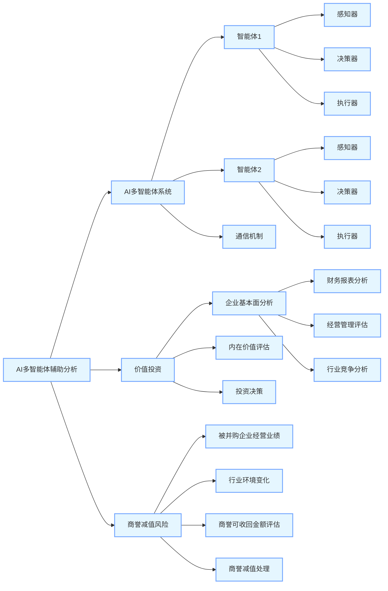

# AI多智能体在价值投资中的商誉减值风险分析

> 关键词：AI多智能体、价值投资、商誉减值风险、风险分析、投资决策

> 摘要：本文聚焦于AI多智能体在价值投资中对商誉减值风险的分析。首先介绍了研究的背景、目的、预期读者等内容，明确了文档范围和相关术语。接着阐述了AI多智能体、价值投资以及商誉减值风险的核心概念与联系，并给出了相应的文本示意图和Mermaid流程图。详细讲解了用于风险分析的核心算法原理，结合Python源代码说明具体操作步骤，同时给出了相关的数学模型和公式，并举例说明。通过项目实战展示了代码的实际案例，包括开发环境搭建、源代码实现和解读。探讨了AI多智能体在价值投资中分析商誉减值风险的实际应用场景，推荐了学习资源、开发工具框架以及相关论文著作。最后总结了未来发展趋势与挑战，提供了常见问题解答和扩展阅读参考资料，旨在为投资者利用AI多智能体进行商誉减值风险分析提供全面的技术指导和理论支持。

## 1. 背景介绍 
### 1.1 目的和范围
在价值投资领域，商誉减值风险是一个关键因素，它可能对企业的财务状况和投资者的收益产生重大影响。传统的商誉减值风险分析方法往往依赖于人工经验和简单的财务指标计算，存在主观性强、效率低等问题。本研究的目的是引入AI多智能体技术，利用其分布式、智能协作的特点，更准确、高效地分析价值投资中的商誉减值风险。

本研究的范围涵盖了AI多智能体的基本原理、相关算法，价值投资的基本概念和商誉减值风险的评估方法。通过建立数学模型和实际项目案例，深入探讨AI多智能体在商誉减值风险分析中的应用。

### 1.2 预期读者
本文预期读者包括金融投资者、金融分析师、AI技术开发者、学术研究人员等。对于投资者和分析师，本文提供了一种新的风险分析方法和工具，有助于他们做出更明智的投资决策；对于AI技术开发者，本文展示了AI多智能体在金融领域的具体应用场景和实现方法；对于学术研究人员，本文可以作为进一步研究的参考。

### 1.3 文档结构概述
本文将按照以下结构进行阐述：首先介绍相关背景知识，包括目的、预期读者和文档结构等；接着阐述AI多智能体、价值投资和商誉减值风险的核心概念与联系；详细讲解核心算法原理和具体操作步骤，并给出Python源代码；介绍相关的数学模型和公式，并举例说明；通过项目实战展示代码的实际应用；探讨实际应用场景；推荐学习资源、开发工具框架和相关论文著作；最后总结未来发展趋势与挑战，提供常见问题解答和扩展阅读参考资料。

### 1.4 术语表
#### 1.4.1 核心术语定义
- **AI多智能体（AI Multi - Agent）**：由多个智能体组成的系统，每个智能体具有一定的自主性、智能性和协作能力，能够在复杂环境中完成特定任务。
- **价值投资（Value Investing）**：一种投资策略，投资者通过分析企业的内在价值，寻找被低估的股票进行投资，以获取长期收益。
- **商誉减值风险（Goodwill Impairment Risk）**：企业在并购过程中形成的商誉，由于被并购企业未来盈利能力下降等原因，可能导致商誉价值减少的风险。

#### 1.4.2 相关概念解释
- **智能体（Agent）**：能够感知环境、做出决策并采取行动的实体。在AI多智能体系统中，智能体可以是软件程序、机器人等。
- **内在价值（Intrinsic Value）**：企业的真实价值，通常通过对企业的财务状况、经营业绩、行业前景等因素进行分析和评估得出。
- **商誉（Goodwill）**：企业在并购过程中，购买方支付的超过被购买方可辨认净资产公允价值的部分。

#### 1.4.3 缩略词列表
- **AI**：Artificial Intelligence，人工智能
- **MAS**：Multi - Agent System，多智能体系统

## 2. 核心概念与联系 
### 核心概念原理
#### AI多智能体
AI多智能体系统由多个智能体组成，每个智能体具有以下特点：
- **自主性**：能够独立地感知环境、做出决策和采取行动，不受其他智能体的直接控制。
- **智能性**：具备一定的知识和推理能力，能够根据环境信息和自身目标做出合理的决策。
- **协作性**：多个智能体可以通过通信和协作，共同完成复杂的任务。

AI多智能体系统的工作原理是：每个智能体根据自身的感知器获取环境信息，然后根据内部的决策规则和知识进行推理，做出决策并通过执行器采取行动。智能体之间通过通信机制进行信息交流和协作，以实现系统的整体目标。

#### 价值投资
价值投资的核心原理是寻找被市场低估的股票。投资者通过对企业的基本面进行分析，包括财务报表、经营管理、行业竞争等方面，评估企业的内在价值。如果股票的市场价格低于其内在价值，投资者认为该股票具有投资价值，会选择买入；当市场价格回归或超过内在价值时，投资者会选择卖出，获取投资收益。

#### 商誉减值风险
商誉减值风险主要源于被并购企业未来盈利能力的不确定性。当被并购企业的实际经营业绩低于预期，或者所处行业环境发生不利变化时，其未来现金流量可能减少，导致商誉的可收回金额低于账面价值，从而需要进行商誉减值处理。商誉减值会直接影响企业的净利润和净资产，对企业的财务状况和市场形象产生负面影响。

### 架构的文本示意图
```plaintext
AI多智能体系统
|-- 智能体1
|   |-- 感知器
|   |-- 决策器
|   |-- 执行器
|-- 智能体2
|   |-- 感知器
|   |-- 决策器
|   |-- 执行器
|--...
|-- 通信机制

价值投资
|-- 企业基本面分析
|   |-- 财务报表分析
|   |-- 经营管理评估
|   |-- 行业竞争分析
|-- 内在价值评估
|-- 投资决策

商誉减值风险
|-- 被并购企业经营业绩
|-- 行业环境变化
|-- 商誉可收回金额评估
|-- 商誉减值处理
```

### Mermaid流程图


## 3. 核心算法原理 & 具体操作步骤 
### 核心算法原理
在AI多智能体用于价值投资中的商誉减值风险分析时，主要使用的算法包括贝叶斯网络算法和强化学习算法。

#### 贝叶斯网络算法
贝叶斯网络是一种概率图模型，用于表示变量之间的依赖关系和条件概率。在商誉减值风险分析中，我们可以将影响商誉减值的因素（如被并购企业的财务指标、行业环境等）作为节点，构建贝叶斯网络。通过已知的历史数据学习节点之间的条件概率分布，然后根据新的观测数据，利用贝叶斯定理计算商誉减值的概率。

贝叶斯定理的公式为：
$$P(A|B)=\frac{P(B|A)P(A)}{P(B)}$$
其中，$P(A|B)$ 表示在事件 $B$ 发生的条件下事件 $A$ 发生的概率，$P(B|A)$ 表示在事件 $A$ 发生的条件下事件 $B$ 发生的概率，$P(A)$ 是事件 $A$ 的先验概率，$P(B)$ 是事件 $B$ 的先验概率。

#### 强化学习算法
强化学习是一种通过智能体与环境进行交互，不断尝试不同的行动以最大化累积奖励的学习方法。在商誉减值风险分析中，智能体可以根据当前的市场环境和企业信息选择不同的分析策略，环境会根据智能体的选择给出相应的奖励（如正确预测商誉减值获得正奖励，错误预测获得负奖励）。智能体通过不断学习，优化自己的策略，以提高对商誉减值风险的预测准确性。

### 具体操作步骤及Python源代码
#### 步骤1：数据收集与预处理
首先，我们需要收集与商誉减值风险相关的数据，包括企业的财务报表、行业数据等。然后对数据进行预处理，如缺失值填充、数据标准化等。

```python
import pandas as pd
import numpy as np
from sklearn.preprocessing import StandardScaler

# 读取数据
data = pd.read_csv('goodwill_data.csv')

# 处理缺失值
data = data.fillna(data.mean())

# 分离特征和标签
X = data.drop('goodwill_impairment', axis=1)
y = data['goodwill_impairment']

# 数据标准化
scaler = StandardScaler()
X_scaled = scaler.fit_transform(X)
```

#### 步骤2：构建贝叶斯网络
使用 `pgmpy` 库构建贝叶斯网络，并学习节点之间的条件概率分布。

```python
from pgmpy.models import BayesianNetwork
from pgmpy.estimators import MaximumLikelihoodEstimator

# 定义贝叶斯网络结构
model = BayesianNetwork([('financial_ratio1', 'goodwill_impairment'),
                         ('financial_ratio2', 'goodwill_impairment'),
                         ('industry_environment', 'goodwill_impairment')])

# 学习条件概率分布
model.fit(data, estimator=MaximumLikelihoodEstimator)
```

#### 步骤3：使用强化学习训练智能体
使用 `stable_baselines3` 库实现强化学习算法，训练智能体进行商誉减值风险分析。

```python
import gym
from gym import spaces
from stable_baselines3 import PPO

# 定义自定义环境
class GoodwillEnv(gym.Env):
    def __init__(self, X, y):
        super(GoodwillEnv, self).__init__()
        self.X = X
        self.y = y
        self.current_step = 0
        self.action_space = spaces.Discrete(2)  # 0: 无减值风险，1: 有减值风险
        self.observation_space = spaces.Box(low=-np.inf, high=np.inf, shape=(X.shape[1],))

    def step(self, action):
        correct_action = self.y[self.current_step]
        if action == correct_action:
            reward = 1
        else:
            reward = -1
        self.current_step += 1
        if self.current_step >= len(self.X):
            done = True
            obs = np.zeros(self.observation_space.shape)
        else:
            done = False
            obs = self.X[self.current_step]
        return obs, reward, done, {}

    def reset(self):
        self.current_step = 0
        return self.X[self.current_step]

# 创建环境
env = GoodwillEnv(X_scaled, y)

# 训练智能体
model = PPO('MlpPolicy', env, verbose=1)
model.learn(total_timesteps=10000)
```

#### 步骤4：风险预测
使用训练好的模型进行商誉减值风险预测。

```python
# 选择一个样本进行预测
sample = X_scaled[0].reshape(1, -1)

# 贝叶斯网络预测
from pgmpy.inference import VariableElimination
infer = VariableElimination(model)
result = infer.query(variables=['goodwill_impairment'], evidence={'financial_ratio1': sample[0][0],
                                                                'financial_ratio2': sample[0][1],
                                                                'industry_environment': sample[0][2]})
print("贝叶斯网络预测结果:", result.values)

# 强化学习智能体预测
action, _states = model.predict(sample)
print("强化学习智能体预测结果:", action)
```

## 4. 数学模型和公式 & 详细讲解 & 举例说明 
### 贝叶斯网络相关数学模型和公式
#### 联合概率分布
贝叶斯网络通过有向无环图（DAG）和条件概率表（CPT）来表示变量之间的联合概率分布。设 $X_1, X_2, \cdots, X_n$ 是贝叶斯网络中的 $n$ 个变量，其联合概率分布可以表示为：
$$P(X_1, X_2, \cdots, X_n)=\prod_{i = 1}^{n}P(X_i|Pa(X_i))$$
其中，$Pa(X_i)$ 表示变量 $X_i$ 的父节点集合。

#### 条件概率计算
根据贝叶斯定理，我们可以计算在已知部分变量取值的情况下，其他变量的条件概率。例如，已知变量 $B$ 的取值为 $b$，求变量 $A$ 的条件概率 $P(A|b)$：
$$P(A|b)=\frac{P(b|A)P(A)}{P(b)}=\frac{P(b|A)P(A)}{\sum_{a}P(b|a)P(a)}$$

### 举例说明
假设我们有一个简单的贝叶斯网络，包含三个变量：$A$（被并购企业的盈利能力）、$B$（行业竞争程度）和 $C$（商誉减值情况）。$A$ 和 $B$ 是 $C$ 的父节点。已知以下条件概率表：

| $A$ | $P(A)$ |
| --- | --- |
| 高 | 0.6 |
| 低 | 0.4 |

| $B$ | $P(B)$ |
| --- | --- |
| 激烈 | 0.7 |
| 缓和 | 0.3 |

| $A$ | $B$ | $P(C = 1|A, B)$ |
| --- | --- | --- |
| 高 | 激烈 | 0.2 |
| 高 | 缓和 | 0.1 |
| 低 | 激烈 | 0.8 |
| 低 | 缓和 | 0.6 |

现在我们想计算在 $A$ 为高、$B$ 为激烈的情况下，$C = 1$（有商誉减值）的概率。

首先，根据联合概率分布公式：
$$P(A = 高, B = 激烈, C = 1)=P(A = 高)P(B = 激烈)P(C = 1|A = 高, B = 激烈)$$
$$=0.6\times0.7\times0.2 = 0.084$$

### 强化学习相关数学模型和公式
#### 策略梯度算法
在强化学习中，策略梯度算法通过优化策略函数 $\pi_{\theta}(a|s)$（在状态 $s$ 下采取行动 $a$ 的概率）来最大化累积奖励。策略梯度的更新公式为：
$$\theta\leftarrow\theta+\alpha\nabla_{\theta}J(\theta)$$
其中，$\alpha$ 是学习率，$J(\theta)$ 是策略的目标函数，通常定义为期望累积奖励：
$$J(\theta)=E_{\tau\sim\pi_{\theta}}[\sum_{t = 0}^{T}\gamma^{t}r_t]$$
其中，$\tau$ 是一个轨迹（状态 - 行动序列），$\gamma$ 是折扣因子，$r_t$ 是在时间步 $t$ 获得的奖励。

#### 举例说明
假设我们有一个简单的强化学习环境，智能体在每个时间步可以选择两个行动：$a_1$ 和 $a_2$。状态空间包含三个状态：$s_1$、$s_2$ 和 $s_3$。策略函数 $\pi_{\theta}(a|s)$ 可以表示为一个神经网络，其参数为 $\theta$。

在某个时间步，智能体处于状态 $s_1$，选择了行动 $a_1$，获得了奖励 $r = 1$。根据策略梯度算法，我们需要计算策略梯度 $\nabla_{\theta}J(\theta)$ 并更新参数 $\theta$。具体计算过程可以通过反向传播算法在神经网络中实现。

## 5. 项目实战：代码实际案例和详细解释说明 
### 5.1  开发环境搭建
#### 安装Python
首先，确保你已经安装了Python 3.6或更高版本。你可以从Python官方网站（https://www.python.org/downloads/）下载并安装Python。

#### 安装必要的库
使用 `pip` 安装项目所需的库：
```sh
pip install pandas numpy scikit-learn pgmpy stable-baselines3 gym
```

### 5.2  源代码详细实现和代码解读
#### 数据收集与预处理
```python
import pandas as pd
import numpy as np
from sklearn.preprocessing import StandardScaler

# 读取数据
data = pd.read_csv('goodwill_data.csv')

# 处理缺失值
data = data.fillna(data.mean())

# 分离特征和标签
X = data.drop('goodwill_impairment', axis=1)
y = data['goodwill_impairment']

# 数据标准化
scaler = StandardScaler()
X_scaled = scaler.fit_transform(X)
```
代码解读：
- `pd.read_csv('goodwill_data.csv')`：使用 `pandas` 库读取存储在 `goodwill_data.csv` 文件中的数据。
- `data.fillna(data.mean())`：使用特征的均值填充数据中的缺失值。
- `data.drop('goodwill_impairment', axis=1)`：从数据中删除 `goodwill_impairment` 列，作为特征数据 $X$。
- `data['goodwill_impairment']`：提取 `goodwill_impairment` 列作为标签数据 $y$。
- `StandardScaler().fit_transform(X)`：使用 `sklearn` 库的 `StandardScaler` 对特征数据进行标准化处理，使每个特征的均值为 0，标准差为 1。

#### 构建贝叶斯网络
```python
from pgmpy.models import BayesianNetwork
from pgmpy.estimators import MaximumLikelihoodEstimator

# 定义贝叶斯网络结构
model = BayesianNetwork([('financial_ratio1', 'goodwill_impairment'),
                         ('financial_ratio2', 'goodwill_impairment'),
                         ('industry_environment', 'goodwill_impairment')])

# 学习条件概率分布
model.fit(data, estimator=MaximumLikelihoodEstimator)
```
代码解读：
- `BayesianNetwork([('financial_ratio1', 'goodwill_impairment'),...])`：使用 `pgmpy` 库定义一个贝叶斯网络，指定节点之间的依赖关系。
- `model.fit(data, estimator=MaximumLikelihoodEstimator)`：使用最大似然估计器从数据中学习节点之间的条件概率分布。

#### 定义自定义环境和训练强化学习智能体
```python
import gym
from gym import spaces
from stable_baselines3 import PPO

# 定义自定义环境
class GoodwillEnv(gym.Env):
    def __init__(self, X, y):
        super(GoodwillEnv, self).__init__()
        self.X = X
        self.y = y
        self.current_step = 0
        self.action_space = spaces.Discrete(2)  # 0: 无减值风险，1: 有减值风险
        self.observation_space = spaces.Box(low=-np.inf, high=np.inf, shape=(X.shape[1],))

    def step(self, action):
        correct_action = self.y[self.current_step]
        if action == correct_action:
            reward = 1
        else:
            reward = -1
        self.current_step += 1
        if self.current_step >= len(self.X):
            done = True
            obs = np.zeros(self.observation_space.shape)
        else:
            done = False
            obs = self.X[self.current_step]
        return obs, reward, done, {}

    def reset(self):
        self.current_step = 0
        return self.X[self.current_step]

# 创建环境
env = GoodwillEnv(X_scaled, y)

# 训练智能体
model = PPO('MlpPolicy', env, verbose=1)
model.learn(total_timesteps=10000)
```
代码解读：
- `class GoodwillEnv(gym.Env)`：定义一个自定义的 `gym` 环境，用于强化学习。
- `__init__` 方法：初始化环境的状态、动作空间和观测空间。
- `step` 方法：根据智能体的行动给出奖励，并更新环境状态。
- `reset` 方法：重置环境状态。
- `PPO('MlpPolicy', env, verbose=1)`：使用近端策略优化（PPO）算法训练一个多层感知机（MLP）策略的智能体。
- `model.learn(total_timesteps=10000)`：训练智能体 10000 个时间步。

#### 风险预测
```python
# 选择一个样本进行预测
sample = X_scaled[0].reshape(1, -1)

# 贝叶斯网络预测
from pgmpy.inference import VariableElimination
infer = VariableElimination(model)
result = infer.query(variables=['goodwill_impairment'], evidence={'financial_ratio1': sample[0][0],
                                                                'financial_ratio2': sample[0][1],
                                                                'industry_environment': sample[0][2]})
print("贝叶斯网络预测结果:", result.values)

# 强化学习智能体预测
action, _states = model.predict(sample)
print("强化学习智能体预测结果:", action)
```
代码解读：
- `X_scaled[0].reshape(1, -1)`：选择一个样本并调整其形状为适合模型输入的格式。
- `VariableElimination(model).query`：使用变量消除算法在贝叶斯网络中进行推理，计算商誉减值的概率。
- `model.predict(sample)`：使用训练好的强化学习智能体对样本进行预测，输出预测的行动。

### 5.3  代码解读与分析
#### 数据预处理的重要性
数据预处理是机器学习项目中非常重要的一步。通过处理缺失值和数据标准化，可以提高模型的训练效果和泛化能力。例如，缺失值可能会导致模型学习到错误的信息，而数据标准化可以使不同特征具有相同的尺度，避免某些特征对模型的影响过大。

#### 贝叶斯网络和强化学习的结合
贝叶斯网络可以用于表示变量之间的概率关系，通过学习历史数据得到条件概率分布，从而进行概率推理。强化学习则可以根据环境的反馈不断优化策略，以适应不同的情况。将两者结合起来，可以充分发挥它们的优势，提高商誉减值风险分析的准确性。

#### 模型评估和改进
在实际应用中，我们需要对模型进行评估和改进。可以使用交叉验证、混淆矩阵等方法评估模型的性能，根据评估结果调整模型的参数或结构，以提高模型的预测准确性和稳定性。

## 6. 实际应用场景 
### 投资者决策支持
对于价值投资者来说，准确评估商誉减值风险是做出投资决策的关键。AI多智能体可以通过分析大量的企业数据和市场信息，快速、准确地评估商誉减值风险，为投资者提供决策支持。例如，当AI多智能体预测某企业存在较高的商誉减值风险时，投资者可以选择避免投资该企业，或者在投资时降低仓位。

### 金融机构风险管理
金融机构在进行信贷、投资等业务时，需要对企业的风险进行评估。商誉减值风险是企业风险的重要组成部分。AI多智能体可以帮助金融机构更全面、深入地评估企业的商誉减值风险，从而制定合理的风险管理策略。例如，银行在审批企业贷款时，可以参考AI多智能体的评估结果，决定是否放贷以及放贷的额度和利率。

### 企业并购评估
在企业并购过程中，收购方需要对被收购方的商誉价值进行评估。AI多智能体可以通过分析被收购方的财务状况、行业前景等因素，评估其商誉减值风险，为收购方提供合理的收购价格建议。同时，在并购完成后，AI多智能体可以持续监测被收购方的经营情况，及时发现商誉减值风险并提醒企业采取相应的措施。

## 7. 工具和资源推荐
### 7.1 学习资源推荐
#### 7.1.1 书籍推荐
- 《人工智能：一种现代的方法》（Artificial Intelligence: A Modern Approach）：这本书是人工智能领域的经典教材，全面介绍了人工智能的基本概念、算法和应用，包括多智能体系统的相关内容。
- 《Python机器学习》（Python Machine Learning）：本书详细介绍了使用Python进行机器学习的方法和技巧，包括数据预处理、模型训练和评估等方面，对于理解和实现AI多智能体算法有很大帮助。
- 《价值投资：从格雷厄姆到巴菲特》（Value Investing: From Graham to Buffett and Beyond）：这本书系统阐述了价值投资的理论和方法，是价值投资者的必读之书。

#### 7.1.2 在线课程
- Coursera上的“人工智能基础”（Foundations of Artificial Intelligence）课程：由知名高校教授授课，涵盖了人工智能的基本概念、算法和应用，包括多智能体系统的相关知识。
- edX上的“机器学习”（Machine Learning）课程：由著名学者吴恩达教授授课，详细介绍了机器学习的基本算法和实践技巧，对于学习AI多智能体算法的实现有很大帮助。
- Udemy上的“价值投资实战”（Value Investing in Practice）课程：该课程结合实际案例，讲解了价值投资的方法和策略，帮助学习者掌握价值投资的核心要点。

#### 7.1.3 技术博客和网站
- Medium：这是一个技术博客平台，上面有很多关于AI多智能体、机器学习和金融投资的优质文章，可以帮助学习者了解最新的技术动态和应用案例。
- Towards Data Science：专注于数据科学和机器学习领域的博客网站，提供了大量的技术文章和教程，对于学习AI多智能体算法的实现和应用有很大帮助。
- Seeking Alpha：是一个金融投资领域的网站，提供了丰富的企业分析报告和投资策略建议，对于了解价值投资和商誉减值风险分析有很大帮助。

### 7.2 开发工具框架推荐
#### 7.2.1 IDE和编辑器
- PyCharm：是一款专业的Python集成开发环境（IDE），提供了丰富的代码编辑、调试和项目管理功能，适合开发AI多智能体和机器学习项目。
- Jupyter Notebook：是一个交互式的开发环境，支持Python代码的实时运行和可视化展示，非常适合进行数据探索和模型实验。
- Visual Studio Code：是一款轻量级的代码编辑器，支持多种编程语言和插件扩展，对于快速开发和调试AI多智能体项目非常方便。

#### 7.2.2 调试和性能分析工具
- TensorBoard：是TensorFlow提供的可视化工具，可以用于监控模型的训练过程、分析模型的性能指标，帮助开发者调试和优化模型。
- Py-Spy：是一个Python性能分析工具，可以实时监控Python程序的CPU使用率、函数调用时间等信息，帮助开发者找出程序中的性能瓶颈。
- cProfile：是Python标准库中的性能分析模块，可以统计程序中各个函数的调用次数和执行时间，帮助开发者进行性能优化。

#### 7.2.3 相关框架和库
- pgmpy：是一个用于构建和推理概率图模型的Python库，支持贝叶斯网络、马尔可夫网络等多种模型，非常适合用于AI多智能体中的概率推理。
- stable-baselines3：是一个基于PyTorch的强化学习库，提供了多种强化学习算法的实现，如PPO、A2C等，方便开发者快速实现强化学习智能体。
- scikit-learn：是一个常用的机器学习库，提供了丰富的机器学习算法和工具，如数据预处理、模型选择、评估等，对于AI多智能体项目的开发有很大帮助。

### 7.3 相关论文著作推荐
#### 7.3.1 经典论文
- "Multiagent Systems: A Modern Approach to Distributed Artificial Intelligence"：该论文全面介绍了多智能体系统的基本概念、理论和应用，是多智能体系统领域的经典之作。
- "Value at Risk: The New Benchmark for Managing Financial Risk"：论文提出了风险价值（VaR）的概念和计算方法，对于金融风险管理具有重要的指导意义，也可以用于商誉减值风险的评估。
- "The Efficient Market Hypothesis and Its Critics"：这篇论文对有效市场假说进行了深入的探讨和批判，对于理解价值投资的理论基础有很大帮助。

#### 7.3.2 最新研究成果
- 近年来，关于AI多智能体在金融领域的应用研究不断涌现。可以通过IEEE Xplore、ACM Digital Library等学术数据库搜索相关的最新研究论文，了解AI多智能体在商誉减值风险分析等方面的最新技术和方法。
- 一些知名学术会议，如AAAI（Association for the Advancement of Artificial Intelligence）、IJCAI（International Joint Conference on Artificial Intelligence）等，也会发表关于AI多智能体的最新研究成果。

#### 7.3.3 应用案例分析
- 可以参考一些金融机构和投资公司的研究报告和案例分析，了解AI多智能体在实际价值投资和商誉减值风险分析中的应用情况和效果。例如，一些大型投资银行会发布关于企业并购和商誉减值的研究报告，其中可能会涉及到AI多智能体技术的应用。

## 8. 总结：未来发展趋势与挑战
### 未来发展趋势
#### 更强大的智能体协作
未来，AI多智能体系统中的智能体将具备更强大的协作能力。不同类型的智能体可以针对商誉减值风险的不同方面进行深入分析，然后通过高效的通信和协作机制整合分析结果，提供更全面、准确的风险评估。例如，财务分析智能体可以专注于企业的财务报表分析，行业研究智能体可以分析行业环境对商誉减值的影响，两者通过协作共同完成风险评估。

#### 与其他技术的融合
AI多智能体将与区块链、物联网等技术深度融合。区块链技术可以提供数据的安全性和不可篡改特性，确保用于商誉减值风险分析的数据的真实性和可靠性。物联网技术可以实时获取企业的生产、销售等数据，为AI多智能体提供更丰富、及时的信息，从而提高风险分析的准确性和及时性。

#### 个性化投资决策支持
随着AI多智能体技术的发展，它将能够根据投资者的个性化需求和风险偏好，提供定制化的商誉减值风险分析和投资决策建议。例如，对于风险偏好较高的投资者，AI多智能体可以重点分析具有一定风险但潜在回报较高的投资项目的商誉减值风险；对于风险偏好较低的投资者，则可以提供更稳健的投资建议。

### 挑战
#### 数据质量和隐私问题
AI多智能体的分析结果高度依赖于数据的质量。在价值投资和商誉减值风险分析中，数据可能存在不准确、不完整等问题，这会影响模型的训练和预测效果。同时，金融数据涉及到企业和投资者的隐私，如何在保证数据安全和隐私的前提下，合理使用数据进行分析是一个亟待解决的问题。

#### 模型可解释性
AI多智能体中的一些算法，如深度学习算法，往往是黑盒模型，其决策过程难以解释。在金融投资领域，投资者和监管机构通常需要了解模型的决策依据，以确保投资决策的合理性和合规性。因此，提高模型的可解释性是AI多智能体在价值投资中应用的一个重要挑战。

#### 技术复杂性和人才短缺
AI多智能体技术涉及到人工智能、机器学习、分布式系统等多个领域的知识，其开发和应用具有较高的技术复杂性。目前，市场上缺乏既懂金融投资又懂AI多智能体技术的复合型人才，这限制了该技术在价值投资中的广泛应用。

## 9. 附录：常见问题与解答
### 问题1：AI多智能体在商誉减值风险分析中的准确性如何保证？
答：可以通过以下几个方面保证准确性：一是使用高质量、丰富的历史数据进行模型训练，确保模型能够学习到足够的特征和规律；二是采用多种算法进行融合，如贝叶斯网络和强化学习相结合，充分发挥不同算法的优势；三是对模型进行不断的评估和优化，使用交叉验证、混淆矩阵等方法评估模型性能，根据评估结果调整模型参数和结构。

### 问题2：AI多智能体系统的开发难度大吗？
答：AI多智能体系统的开发具有一定的难度，它涉及到人工智能、机器学习、分布式系统等多个领域的知识。需要开发者具备扎实的编程基础和相关领域的专业知识。不过，目前有很多开源的框架和库可以使用，如pgmpy、stable-baselines3等，这些工具可以大大降低开发难度。

### 问题3：如何选择适合的学习资源来学习AI多智能体和价值投资？
答：可以根据自己的基础和学习目标选择合适的学习资源。如果是初学者，可以先阅读一些经典的教材和书籍，如《人工智能：一种现代的方法》和《价值投资：从格雷厄姆到巴菲特》，建立起基本的知识体系。然后可以通过在线课程进行系统学习，如Coursera上的“人工智能基础”和edX上的“机器学习”课程。此外，还可以关注技术博客和网站，了解最新的技术动态和应用案例。

### 问题4：AI多智能体在商誉减值风险分析中的应用是否会受到市场波动的影响？
答：市场波动会对商誉减值风险分析产生一定的影响。市场波动可能导致企业的经营环境发生变化，从而影响企业的盈利能力和商誉价值。AI多智能体在分析时会考虑市场环境等因素，但由于市场波动具有不确定性，可能会对分析结果产生一定的误差。因此，在实际应用中，需要结合其他因素进行综合判断。

## 10. 扩展阅读 & 参考资料
### 扩展阅读
- 《智能系统中的概率推理：可信网络》（Probabilistic Reasoning in Intelligent Systems: Networks of Plausible Inference）：深入介绍了概率图模型的理论和应用，对于理解贝叶斯网络在AI多智能体中的应用有很大帮助。
- 《强化学习：原理与Python实现》（Reinforcement Learning: Principles and Python Implementation）：详细讲解了强化学习的基本原理和算法实现，适合进一步学习强化学习在AI多智能体中的应用。
- 《金融科技：变革与监管》：探讨了金融科技在金融领域的应用和发展，包括AI多智能体在金融风险管理中的应用，对于了解金融科技的发展趋势有很大帮助。

### 参考资料
- 相关学术论文：在IEEE Xplore、ACM Digital Library、SSRN等学术数据库中搜索关于AI多智能体、价值投资和商誉减值风险分析的相关论文。
- 金融机构报告：参考一些大型金融机构发布的关于企业并购、商誉减值等方面的研究报告。
- 开源代码库：在GitHub等开源代码平台上搜索相关的开源项目，学习和借鉴他人的代码实现。

作者：AI天才研究院/AI Genius Institute & 禅与计算机程序设计艺术 /Zen And The Art of Computer Programming