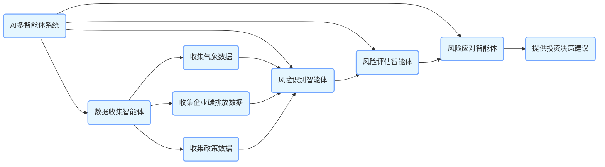

# AI多智能体在价值投资中的气候变化风险分析

> 关键词：AI多智能体、价值投资、气候变化风险分析、金融科技、环境风险评估

> 摘要：本文聚焦于AI多智能体在价值投资领域对气候变化风险的分析。随着全球气候变化问题日益严峻，其对金融市场和投资决策产生的影响愈发显著。传统的风险分析方法在应对复杂多变的气候变化风险时存在一定局限性，而AI多智能体技术凭借其分布式、自适应和协同性等特点，为更精准地评估和管理气候变化风险提供了新的途径。文章将深入探讨AI多智能体的核心概念、算法原理、数学模型，结合实际案例展示其在价值投资中分析气候变化风险的具体应用，并对未来发展趋势与挑战进行展望。

## 1. 背景介绍 
### 1.1 目的和范围
本研究的主要目的是探索如何利用AI多智能体技术对价值投资中的气候变化风险进行有效分析。在当前全球气候变暖的大背景下，气候变化带来的各种风险，如极端天气事件、政策法规变化等，对企业的经营和财务状况产生了深远影响，进而影响到价值投资的决策。通过引入AI多智能体技术，旨在提高气候变化风险分析的准确性和及时性，为投资者提供更科学的决策依据。

研究范围涵盖了AI多智能体技术的基本原理、算法实现，以及在价值投资领域中应用该技术进行气候变化风险分析的各个环节，包括数据收集、风险评估模型构建、决策支持等。同时，还将探讨该技术在实际应用中的挑战和未来发展趋势。

### 1.2 预期读者
本文预期读者包括金融投资领域的专业人士，如基金经理、投资分析师等，他们需要了解如何利用先进技术更好地评估和管理投资风险；计算机科学和人工智能领域的研究人员和开发者，对将AI技术应用于金融领域感兴趣；以及关注气候变化对金融市场影响的政策制定者和监管机构人员。

### 1.3 文档结构概述
本文将按照以下结构进行阐述：首先介绍核心概念与联系，包括AI多智能体和气候变化风险分析的基本概念以及它们之间的关系；接着详细讲解核心算法原理和具体操作步骤，通过Python代码进行示例；然后介绍相关的数学模型和公式，并举例说明；再通过项目实战展示代码的实际应用和详细解释；之后探讨该技术在实际中的应用场景；推荐相关的工具和资源；最后对未来发展趋势与挑战进行总结，并提供常见问题与解答以及扩展阅读和参考资料。

### 1.4 术语表
#### 1.4.1 核心术语定义
- **AI多智能体**：是指由多个智能体组成的系统，每个智能体具有一定的自主决策能力和感知能力，它们通过相互协作和交互来完成共同的任务。在本研究中，这些智能体可以模拟不同的市场参与者、环境因素等，共同进行气候变化风险分析。
- **价值投资**：一种投资策略，投资者通过分析企业的内在价值，寻找被低估的股票进行投资，以期在长期获得稳定的回报。
- **气候变化风险**：由于气候变化导致的各种风险，包括物理风险（如洪水、干旱、飓风等极端天气事件对企业资产和运营的影响）和转型风险（如政府的气候政策、能源转型等对企业业务模式和竞争力的影响）。

#### 1.4.2 相关概念解释
- **智能体**：具有自主性、反应性、社会性和主动性的实体，可以感知环境并根据自身的目标和知识做出决策和行动。
- **分布式系统**：由多个独立的组件或节点组成的系统，这些组件可以在不同的地理位置上运行，通过网络进行通信和协作。AI多智能体系统通常采用分布式架构。
- **风险评估模型**：用于评估风险的数学模型，通过收集和分析相关数据，对风险的可能性和影响程度进行量化。

#### 1.4.3 缩略词列表
- **AI**：Artificial Intelligence，人工智能
- **ESG**：Environmental, Social, and Governance，环境、社会和治理
- **GDP**：Gross Domestic Product，国内生产总值

## 2. 核心概念与联系 

### 2.1 AI多智能体的基本原理
AI多智能体系统由多个智能体组成，每个智能体具有以下特点：
- **自主性**：智能体可以独立地感知环境信息，并根据自身的知识和目标做出决策和行动，不需要外部的直接控制。
- **反应性**：能够及时对环境的变化做出反应，调整自己的行为以适应新的情况。
- **社会性**：智能体之间可以进行通信和协作，通过信息交换和合作来完成共同的任务。
- **主动性**：智能体可以主动地发起行动，追求自己的目标，而不仅仅是对环境的被动响应。

### 2.2 气候变化风险分析的核心要素
气候变化风险分析主要涉及以下几个核心要素：
- **数据收集**：收集与气候变化相关的数据，如气象数据、环境政策数据、企业的碳排放数据等。
- **风险识别**：识别出可能影响企业价值的气候变化风险，包括物理风险和转型风险。
- **风险评估**：对识别出的风险进行量化评估，确定风险的可能性和影响程度。
- **风险应对**：根据风险评估的结果，制定相应的投资策略和风险管理措施。

### 2.3 AI多智能体与气候变化风险分析的联系
AI多智能体技术可以在气候变化风险分析的各个环节发挥重要作用：
- **数据收集**：不同的智能体可以负责收集不同类型的数据，如一个智能体专门收集气象数据，另一个智能体收集企业的碳排放数据等。这些智能体可以分布在不同的数据源处，并行地进行数据收集，提高数据收集的效率和全面性。
- **风险识别**：智能体可以通过分析收集到的数据，识别出潜在的气候变化风险。例如，一个智能体可以分析气象数据，预测未来可能发生的极端天气事件，另一个智能体可以分析政策数据，识别出政策变化带来的转型风险。
- **风险评估**：多个智能体可以通过协作和交互，对识别出的风险进行评估。每个智能体可以根据自己的专业知识和算法，对风险的可能性和影响程度进行初步评估，然后通过智能体之间的信息交换和协商，得出最终的风险评估结果。
- **风险应对**：智能体可以根据风险评估的结果，为投资者提供决策建议。例如，一个智能体可以根据企业面临的气候变化风险，评估其股票的投资价值，另一个智能体可以根据市场情况和投资者的风险偏好，制定相应的投资策略。

### 2.4 核心概念原理和架构的文本示意图
```plaintext
|----------------------|       |----------------------|
|  AI多智能体系统      |       |  气候变化风险分析    |
|----------------------|       |----------------------|
| - 智能体1             |       | - 数据收集           |
| - 智能体2             |       | - 风险识别           |
| -...                 |       | - 风险评估           |
| - 智能体n             |       | - 风险应对           |
|----------------------|       |----------------------|
            |                             |
            |                             |
            |-----------------------------|
                        |
                        |
                相互协作与交互
```

### 2.5 Mermaid流程图


## 3. 核心算法原理 & 具体操作步骤 

### 3.1 智能体的决策算法
智能体的决策算法是AI多智能体系统的核心之一。常见的决策算法包括基于规则的决策算法、基于机器学习的决策算法等。下面以基于规则的决策算法为例进行说明。

```python
# 定义一个简单的基于规则的智能体类
class RuleBasedAgent:
    def __init__(self, rules):
        self.rules = rules

    def make_decision(self, data):
        for rule in self.rules:
            condition, action = rule
            if condition(data):
                return action
        return None

# 示例规则
def condition1(data):
    # 假设数据是一个字典，包含 'temperature' 键
    return data.get('temperature', 0) > 30

def action1():
    return '发出高温风险警报'

rules = [(condition1, action1)]

# 创建智能体实例
agent = RuleBasedAgent(rules)

# 模拟数据
data = {'temperature': 32}

# 智能体做出决策
decision = agent.make_decision(data)
print(decision)
```

### 3.2 智能体之间的通信算法
智能体之间的通信算法用于实现智能体之间的信息交换和协作。常见的通信算法包括消息传递算法、协商算法等。下面是一个简单的消息传递算法示例。

```python
# 定义一个简单的智能体类，支持消息传递
class CommunicatingAgent:
    def __init__(self, name):
        self.name = name
        self.messages = []

    def send_message(self, recipient, message):
        recipient.receive_message(self.name, message)

    def receive_message(self, sender, message):
        self.messages.append((sender, message))
        print(f"{self.name} 收到来自 {sender} 的消息: {message}")

# 创建两个智能体
agent1 = CommunicatingAgent('Agent1')
agent2 = CommunicatingAgent('Agent2')

# 智能体1 向智能体2 发送消息
agent1.send_message(agent2, '你好，最近气候变化风险分析进展如何？')
```

### 3.3 具体操作步骤
1. **智能体初始化**：根据任务需求，创建不同类型的智能体，并为每个智能体分配相应的任务和初始参数。例如，创建数据收集智能体、风险识别智能体等。
2. **数据收集**：数据收集智能体开始收集与气候变化相关的数据，包括气象数据、企业数据、政策数据等。收集到的数据可以存储在数据库中，供其他智能体使用。
3. **风险识别**：风险识别智能体从数据库中获取数据，根据预设的规则或机器学习模型，识别出潜在的气候变化风险。
4. **风险评估**：风险评估智能体接收风险识别智能体的结果，对识别出的风险进行量化评估，确定风险的可能性和影响程度。
5. **风险应对**：风险应对智能体根据风险评估的结果，结合投资者的风险偏好和市场情况，制定相应的投资策略和风险管理措施。
6. **智能体通信与协作**：在整个过程中，智能体之间通过通信算法进行信息交换和协作，确保各个环节的顺利进行。

## 4. 数学模型和公式 & 详细讲解 & 举例说明 

### 4.1 风险评估模型
常见的风险评估模型包括概率模型、模糊数学模型等。下面以概率模型为例进行说明。

假设我们要评估一个企业面临的气候变化风险，可以使用以下概率模型：

设 $R$ 表示企业面临的气候变化风险，$P_i$ 表示第 $i$ 种风险事件发生的概率，$I_i$ 表示第 $i$ 种风险事件发生时对企业造成的影响程度，则企业面临的总风险可以表示为：

$$R = \sum_{i=1}^{n} P_i \times I_i$$

### 4.2 详细讲解
- **概率 $P_i$**：可以通过历史数据统计、专家评估等方法来确定。例如，通过分析过去10年的气象数据，统计出某地区发生洪水的概率。
- **影响程度 $I_i$**：可以通过企业的财务数据、业务分析等方法来确定。例如，评估洪水对企业的生产设施、供应链等造成的损失。

### 4.3 举例说明
假设一个企业面临两种气候变化风险：洪水和高温。洪水发生的概率 $P_1 = 0.1$，发生洪水时对企业造成的影响程度 $I_1 = 100$（假设影响程度用货币损失来衡量）；高温发生的概率 $P_2 = 0.2$，发生高温时对企业造成的影响程度 $I_2 = 50$。

则企业面临的总风险为：

$$R = P_1 \times I_1 + P_2 \times I_2 = 0.1 \times 100 + 0.2 \times 50 = 10 + 10 = 20$$

这意味着该企业面临的气候变化风险综合评估值为20。投资者可以根据这个评估值来判断该企业的投资风险。

## 5. 项目实战：代码实际案例和详细解释说明 

### 5.1 开发环境搭建
#### 5.1.1 安装Python
首先，确保你已经安装了Python 3.x版本。可以从Python官方网站（https://www.python.org/downloads/）下载并安装。

#### 5.1.2 安装必要的库
在本项目中，我们将使用一些常见的Python库，如 `pandas` 用于数据处理，`numpy` 用于数值计算。可以使用以下命令进行安装：

```sh
pip install pandas numpy
```

### 5.2 源代码详细实现和代码解读
```python
import pandas as pd
import numpy as np

# 定义智能体类
class ClimateRiskAgent:
    def __init__(self, name):
        self.name = name

    def collect_data(self):
        # 模拟数据收集
        data = {
            '企业名称': ['企业A', '企业B', '企业C'],
            '洪水发生概率': [0.1, 0.2, 0.05],
            '洪水影响程度': [100, 200, 50],
            '高温发生概率': [0.2, 0.1, 0.15],
            '高温影响程度': [50, 30, 40]
        }
        df = pd.DataFrame(data)
        return df

    def assess_risk(self, data):
        # 计算总风险
        data['总风险'] = data['洪水发生概率'] * data['洪水影响程度'] + data['高温发生概率'] * data['高温影响程度']
        return data

    def make_decision(self, data):
        # 根据总风险做出决策
        decisions = []
        for risk in data['总风险']:
            if risk > 30:
                decisions.append('不建议投资')
            else:
                decisions.append('可以考虑投资')
        data['决策建议'] = decisions
        return data

# 创建智能体实例
agent = ClimateRiskAgent('ClimateRiskAgent')

# 数据收集
data = agent.collect_data()

# 风险评估
risk_assessed_data = agent.assess_risk(data)

# 决策制定
final_data = agent.make_decision(risk_assessed_data)

print(final_data)
```

### 5.3 代码解读与分析
- **数据收集**：`collect_data` 方法模拟了数据收集的过程，创建了一个包含企业名称、洪水和高温的发生概率及影响程度的 `DataFrame`。
- **风险评估**：`assess_risk` 方法根据前面介绍的风险评估公式，计算每个企业的总风险，并将结果添加到 `DataFrame` 中。
- **决策制定**：`make_decision` 方法根据总风险的值，为每个企业提供决策建议，判断是否适合投资。

通过这个示例，我们展示了如何使用AI多智能体的思想，通过一个简单的智能体完成数据收集、风险评估和决策制定的过程。

## 6. 实际应用场景 
### 6.1 投资组合管理
在投资组合管理中，投资者可以使用AI多智能体技术分析气候变化风险，调整投资组合的结构。例如，通过评估不同企业面临的气候变化风险，减少对高风险企业的投资，增加对低风险企业的投资，从而降低整个投资组合的风险。

### 6.2 企业信用评级
金融机构在对企业进行信用评级时，可以考虑气候变化风险因素。AI多智能体系统可以帮助金融机构收集和分析企业的环境数据，评估企业面临的气候变化风险，从而更准确地评估企业的信用状况。

### 6.3 政策制定与监管
政府和监管机构可以利用AI多智能体技术监测气候变化对金融市场的影响，制定相应的政策和监管措施。例如，通过分析企业的碳排放数据和气候变化风险，制定碳排放配额和税收政策，引导企业向低碳经济转型。

## 7. 工具和资源推荐
### 7.1 学习资源推荐
#### 7.1.1 书籍推荐
- 《人工智能：一种现代的方法》：全面介绍了人工智能的基本概念、算法和应用，是学习人工智能的经典教材。
- 《多智能体系统》：详细介绍了多智能体系统的理论、技术和应用，对理解AI多智能体技术有很大帮助。
- 《气候变化经济学》：介绍了气候变化对经济和金融的影响，以及相关的政策和风险管理方法。

#### 7.1.2 在线课程
- Coursera上的“人工智能基础”课程：由知名高校的教授授课，系统地介绍了人工智能的基础知识和算法。
- edX上的“多智能体系统设计与实现”课程：专注于多智能体系统的设计和开发，提供了丰富的实践案例。
- 中国大学MOOC上的“气候变化与可持续发展”课程：讲解了气候变化的科学原理、影响和应对策略。

#### 7.1.3 技术博客和网站
- Medium：上面有很多关于人工智能和金融科技的技术博客文章，涵盖了最新的研究成果和实践经验。
- arXiv：一个预印本服务器，提供了大量的学术论文，包括AI多智能体和气候变化风险分析方面的研究。
- 碳信息披露项目（CDP）网站：提供了企业的碳排放数据和气候变化风险报告，是研究气候变化风险的重要数据来源。

### 7.2 开发工具框架推荐
#### 7.2.1 IDE和编辑器
- PyCharm：一款专业的Python集成开发环境，提供了丰富的代码编辑、调试和分析功能，适合开发Python项目。
- Jupyter Notebook：一种交互式的开发环境，支持Python代码的实时运行和可视化展示，非常适合进行数据分析和模型实验。

#### 7.2.2 调试和性能分析工具
- pdb：Python自带的调试工具，可以帮助开发者定位代码中的问题。
- cProfile：Python的性能分析工具，可以分析代码的运行时间和函数调用情况，帮助优化代码性能。

#### 7.2.3 相关框架和库
- Mesa：一个用于构建多智能体系统的Python框架，提供了丰富的智能体模型和可视化工具。
- Scikit-learn：一个常用的机器学习库，包含了各种机器学习算法和工具，可用于风险评估模型的构建。

### 7.3 相关论文著作推荐
#### 7.3.1 经典论文
- “Multiagent Systems: A Modern Approach to Distributed Artificial Intelligence”：介绍了多智能体系统的基本理论和方法，是该领域的经典论文。
- “Climate Change and Financial Stability”：探讨了气候变化对金融稳定的影响，为研究气候变化风险分析提供了理论基础。

#### 7.3.2 最新研究成果
- 在顶级学术期刊如《Nature》、《Science》、《Journal of Financial Economics》上搜索关于AI多智能体和气候变化风险分析的最新研究论文，了解该领域的前沿动态。

#### 7.3.3 应用案例分析
- 可以参考一些金融机构和企业的实际应用案例，如某银行如何利用AI多智能体技术评估企业的气候变化风险，某投资公司如何调整投资组合以应对气候变化风险等。

## 8. 总结：未来发展趋势与挑战
### 8.1 未来发展趋势
- **技术融合**：AI多智能体技术将与其他先进技术，如区块链、物联网等深度融合，进一步提高气候变化风险分析的准确性和可靠性。例如，通过物联网设备实时收集环境数据，利用区块链技术保证数据的真实性和不可篡改。
- **智能化决策**：随着人工智能技术的不断发展，AI多智能体系统将具备更强的智能化决策能力。能够自动根据市场变化和气候变化情况，实时调整投资策略和风险管理措施。
- **跨领域应用**：AI多智能体在价值投资中的气候变化风险分析将不仅仅局限于金融领域，还将拓展到能源、交通、农业等多个领域，为实现全球可持续发展提供支持。

### 8.2 挑战
- **数据质量和可用性**：气候变化相关的数据往往具有复杂性、不确定性和不完整性，如何获取高质量、可用的数据是一个挑战。同时，不同数据源的数据格式和标准不一致，也增加了数据整合和分析的难度。
- **模型准确性和可解释性**：AI多智能体系统中的风险评估模型和决策算法需要具备较高的准确性，但目前这些模型和算法还存在一定的局限性。此外，模型的可解释性也是一个重要问题，投资者和监管机构需要理解模型的决策过程和依据。
- **法律法规和伦理问题**：随着AI多智能体技术在金融领域的应用，相关的法律法规和伦理问题也日益凸显。例如，如何确保数据的隐私和安全，如何避免算法歧视等问题需要得到解决。

## 9. 附录：常见问题与解答
### 9.1 AI多智能体技术在气候变化风险分析中的优势是什么？
AI多智能体技术具有分布式、自适应和协同性等特点。通过多个智能体的协作和交互，可以更全面、准确地收集和分析数据，提高风险识别和评估的能力。同时，智能体可以根据环境的变化实时调整自己的行为，更好地应对复杂多变的气候变化风险。

### 9.2 如何确保AI多智能体系统的决策可靠性？
可以通过以下几个方面来确保决策可靠性：一是使用高质量的数据进行模型训练和验证；二是采用多种算法和模型进行风险评估，综合考虑不同的因素；三是对智能体的决策过程进行监控和审计，及时发现和纠正错误。

### 9.3 AI多智能体技术在实际应用中面临哪些技术难题？
主要面临数据处理和存储难题，需要处理大量的气候变化相关数据；智能体之间的通信和协作也存在一定的技术挑战，需要确保信息的准确传递和高效处理；此外，如何优化智能体的决策算法，提高系统的性能和效率也是一个关键问题。

## 10. 扩展阅读 & 参考资料
### 扩展阅读
- 《金融科技前沿：人工智能在金融领域的应用》：进一步深入探讨了人工智能在金融领域的各种应用，包括风险分析、投资决策等。
- 《可持续金融：应对气候变化的金融创新》：介绍了可持续金融的概念和实践，以及如何通过金融创新来应对气候变化挑战。

### 参考资料
- 《多智能体系统原理与编程》
- 《气候变化风险管理手册》
- 相关学术期刊文章和研究报告

作者：AI天才研究院/AI Genius Institute & 禅与计算机程序设计艺术 /Zen And The Art of Computer Programming