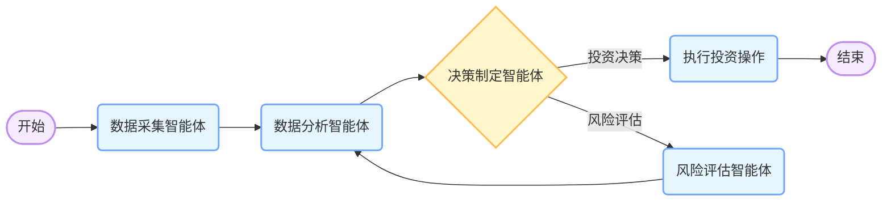

# AI多智能体在价值投资中的知识产权分析

> 关键词：AI多智能体、价值投资、知识产权、智能投资系统、法律保护

> 摘要：本文聚焦于AI多智能体在价值投资领域的应用，深入探讨其中涉及的知识产权问题。首先介绍了AI多智能体和价值投资的背景知识，阐述了研究目的与范围。接着详细剖析了AI多智能体的核心概念、原理和架构，并通过Mermaid流程图展示其工作流程。对于核心算法原理，给出Python源代码进行详细阐述。同时，介绍了相关的数学模型和公式，并举例说明。通过项目实战，展示了开发环境搭建、源代码实现与解读。分析了AI多智能体在价值投资中的实际应用场景，推荐了学习资源、开发工具框架和相关论文著作。最后总结了未来发展趋势与挑战，解答常见问题，并提供扩展阅读与参考资料，旨在为该领域的研究和实践提供全面且深入的知识产权分析。

## 1. 背景介绍 
### 1.1 目的和范围
随着人工智能技术的飞速发展，AI多智能体系统在各个领域的应用日益广泛，价值投资领域也不例外。AI多智能体能够模拟多个智能个体的交互和协作，为价值投资提供更全面、准确的决策支持。然而，这种新兴技术的应用也带来了一系列知识产权问题，如算法的专利保护、数据的版权归属、智能体的创新成果认定等。本研究的目的在于深入分析AI多智能体在价值投资中涉及的知识产权问题，明确权利归属和保护方式，为相关企业和从业者提供法律依据和决策参考。研究范围涵盖AI多智能体技术在价值投资中的各个环节，包括数据采集、分析、决策制定等，以及与之相关的知识产权法律法规和政策。

### 1.2 预期读者
本文预期读者包括人工智能领域的研究人员、价值投资从业者、知识产权律师、法律政策制定者以及对AI多智能体和价值投资感兴趣的人士。研究人员可以从本文中获取关于AI多智能体知识产权保护的最新研究成果和思路；价值投资从业者能够了解如何在实践中保护自身的知识产权；知识产权律师可以为客户提供更专业的法律服务；法律政策制定者可以参考本文的分析制定相关政策；普通读者可以通过本文了解该领域的基本概念和发展趋势。

### 1.3 文档结构概述
本文共分为十个部分。第一部分为背景介绍，阐述研究的目的、范围、预期读者和文档结构，以及相关术语的定义和解释。第二部分介绍AI多智能体的核心概念与联系，包括原理、架构，并通过文本示意图和Mermaid流程图展示其工作流程。第三部分详细讲解核心算法原理，使用Python源代码进行说明，并给出具体操作步骤。第四部分介绍数学模型和公式，进行详细讲解并举例说明。第五部分通过项目实战，展示开发环境搭建、源代码实现与解读。第六部分分析AI多智能体在价值投资中的实际应用场景。第七部分推荐学习资源、开发工具框架和相关论文著作。第八部分总结未来发展趋势与挑战。第九部分为附录，解答常见问题。第十部分提供扩展阅读与参考资料。

### 1.4 术语表
#### 1.4.1 核心术语定义
- **AI多智能体**：是指由多个智能体组成的系统，每个智能体具有一定的自主决策能力和交互能力，能够通过协作完成复杂的任务。在价值投资中，AI多智能体可以模拟不同的投资者角色，进行数据采集、分析和决策制定。
- **价值投资**：是一种基于公司基本面分析的投资策略，通过评估公司的内在价值，选择被低估的股票进行投资，以获取长期的投资回报。
- **知识产权**：是指人们对其智力劳动成果所享有的法定权利，包括专利权、商标权、著作权、商业秘密等。在AI多智能体和价值投资领域，知识产权涉及算法、数据、模型等方面的保护。

#### 1.4.2 相关概念解释
- **智能体**：是指能够感知环境、做出决策并采取行动的实体。在AI多智能体系统中，智能体可以是软件程序、机器人等。
- **协作机制**：是指多个智能体之间通过通信和协调，共同完成任务的方式。在价值投资中，协作机制可以使不同的智能体相互配合，提高决策的准确性和效率。
- **数据挖掘**：是指从大量的数据中提取有价值的信息和知识的过程。在AI多智能体价值投资系统中，数据挖掘可以用于分析市场趋势、公司财务状况等。

#### 1.4.3 缩略词列表
- **AI**：Artificial Intelligence，人工智能
- **API**：Application Programming Interface，应用程序编程接口
- **ML**：Machine Learning，机器学习
- **DL**：Deep Learning，深度学习

## 2. 核心概念与联系 
### 2.1 AI多智能体的原理
AI多智能体系统的核心原理是基于智能体的自主性、交互性和协作性。每个智能体具有自己的目标、知识和决策能力，能够根据环境的变化自主调整行为。智能体之间通过通信机制进行信息交换和协作，共同完成系统的整体目标。在价值投资中，不同的智能体可以分别负责数据采集、分析、风险评估等任务，通过协作提供全面的投资决策支持。

### 2.2 AI多智能体的架构
AI多智能体系统的架构通常包括智能体层、通信层和协作管理层。智能体层由多个智能体组成，每个智能体具有不同的功能和任务。通信层负责智能体之间的信息传递，确保智能体能够及时获取所需的信息。协作管理层负责协调智能体之间的协作，解决冲突和优化资源分配。

以下是AI多智能体系统架构的文本示意图：

```plaintext
----------------------
|    协作管理层      |
|  协调智能体协作    |
|  解决冲突与优化    |
----------------------
         |
         v
----------------------
|    通信层          |
|  智能体信息传递    |
----------------------
         |
         v
----------------------
|    智能体层        |
|  数据采集智能体    |
|  数据分析智能体    |
|  决策制定智能体    |
|  风险评估智能体    |
----------------------
```

### 2.3 Mermaid流程图


这个流程图展示了AI多智能体在价值投资中的工作流程。首先，数据采集智能体收集相关数据，然后数据分析智能体对数据进行处理和分析。决策制定智能体根据分析结果做出投资决策或进行风险评估。如果进行风险评估，结果将反馈给数据分析智能体进行进一步分析。最后，根据投资决策执行投资操作，流程结束。

## 3. 核心算法原理 & 具体操作步骤 
### 3.1 核心算法原理
在AI多智能体价值投资系统中，常用的核心算法包括机器学习算法和优化算法。机器学习算法用于对市场数据进行建模和预测，优化算法用于寻找最优的投资策略。以下以简单的线性回归算法为例进行说明。

线性回归是一种用于建立自变量和因变量之间线性关系的统计方法。在价值投资中，可以使用线性回归算法预测股票价格的变化。假设我们有一组历史股票价格数据 $(x_1, y_1), (x_2, y_2), \cdots, (x_n, y_n)$，其中 $x_i$ 是自变量（如公司财务指标、市场指数等），$y_i$ 是因变量（股票价格）。线性回归的目标是找到一条直线 $y = \theta_0 + \theta_1x$，使得预测值 $\hat{y}_i$ 与实际值 $y_i$ 之间的误差最小。误差通常使用均方误差（Mean Squared Error, MSE）来衡量，其公式为：

$$MSE = \frac{1}{n} \sum_{i=1}^{n} (y_i - \hat{y}_i)^2$$

为了最小化均方误差，我们可以使用梯度下降算法来更新参数 $\theta_0$ 和 $\theta_1$。梯度下降算法的基本思想是沿着误差函数的负梯度方向更新参数，直到达到局部最小值。

### 3.2 Python源代码实现
```python
import numpy as np

# 定义线性回归类
class LinearRegression:
    def __init__(self):
        self.theta0 = 0
        self.theta1 = 0

    def fit(self, X, y, learning_rate=0.01, num_iterations=1000):
        n = len(X)
        for _ in range(num_iterations):
            # 计算预测值
            y_pred = self.theta0 + self.theta1 * X
            # 计算误差
            error = y_pred - y
            # 更新参数
            self.theta0 -= (learning_rate / n) * np.sum(error)
            self.theta1 -= (learning_rate / n) * np.sum(error * X)

    def predict(self, X):
        return self.theta0 + self.theta1 * X

# 示例数据
X = np.array([1, 2, 3, 4, 5])
y = np.array([2, 4, 6, 8, 10])

# 创建线性回归模型
model = LinearRegression()

# 训练模型
model.fit(X, y)

# 预测新数据
new_X = np.array([6])
prediction = model.predict(new_X)
print("预测值:", prediction)
```

### 3.3 具体操作步骤
1. **数据准备**：收集历史股票价格数据和相关的自变量数据，如公司财务指标、市场指数等。对数据进行清洗和预处理，确保数据的质量和一致性。
2. **模型选择**：根据数据的特点和问题的需求，选择合适的机器学习算法，如线性回归、决策树、神经网络等。
3. **模型训练**：将准备好的数据分为训练集和测试集，使用训练集对模型进行训练。在训练过程中，调整模型的参数，使得模型的误差最小。
4. **模型评估**：使用测试集对训练好的模型进行评估，计算模型的准确率、召回率、均方误差等指标，评估模型的性能。
5. **投资决策**：根据模型的预测结果，结合风险评估和投资策略，做出投资决策。

## 4. 数学模型和公式 & 详细讲解 & 举例说明 
### 4.1 线性回归模型
线性回归模型的一般形式为：

$$y = \theta_0 + \theta_1x_1 + \theta_2x_2 + \cdots + \theta_nx_n + \epsilon$$

其中，$y$ 是因变量，$x_1, x_2, \cdots, x_n$ 是自变量，$\theta_0, \theta_1, \cdots, \theta_n$ 是模型的参数，$\epsilon$ 是误差项。在简单线性回归中，只有一个自变量，即 $n = 1$，模型的形式为 $y = \theta_0 + \theta_1x + \epsilon$。

### 4.2 均方误差公式
均方误差（MSE）是衡量线性回归模型性能的常用指标，其公式为：

$$MSE = \frac{1}{n} \sum_{i=1}^{n} (y_i - \hat{y}_i)^2$$

其中，$n$ 是样本数量，$y_i$ 是实际值，$\hat{y}_i$ 是预测值。均方误差越小，说明模型的预测效果越好。

### 4.3 梯度下降公式
梯度下降算法是一种常用的优化算法，用于最小化误差函数。在简单线性回归中，参数 $\theta_0$ 和 $\theta_1$ 的更新公式为：

$$\theta_0 := \theta_0 - \alpha \frac{1}{n} \sum_{i=1}^{n} (y_i - \hat{y}_i)$$

$$\theta_1 := \theta_1 - \alpha \frac{1}{n} \sum_{i=1}^{n} (y_i - \hat{y}_i)x_i$$

其中，$\alpha$ 是学习率，控制参数更新的步长。

### 4.4 举例说明
假设我们有以下历史股票价格数据：

| 自变量 $x$ | 因变量 $y$ |
| --- | --- |
| 1 | 2 |
| 2 | 4 |
| 3 | 6 |
| 4 | 8 |
| 5 | 10 |

我们使用简单线性回归模型进行预测。首先，初始化参数 $\theta_0 = 0$ 和 $\theta_1 = 0$。然后，使用梯度下降算法进行训练，设置学习率 $\alpha = 0.01$，迭代次数为 1000 次。

在每次迭代中，计算预测值 $\hat{y}_i = \theta_0 + \theta_1x_i$，误差 $e_i = y_i - \hat{y}_i$，并更新参数 $\theta_0$ 和 $\theta_1$。经过 1000 次迭代后，得到最终的参数 $\theta_0$ 和 $\theta_1$。

最后，使用训练好的模型预测新的数据。例如，当 $x = 6$ 时，预测值 $\hat{y} = \theta_0 + \theta_1 \times 6$。

## 5. 项目实战：代码实际案例和详细解释说明 
### 5.1  开发环境搭建
#### 5.1.1 安装Python
首先，需要安装Python开发环境。可以从Python官方网站（https://www.python.org/downloads/） 下载适合自己操作系统的Python版本，并按照安装向导进行安装。

#### 5.1.2 安装必要的库
在AI多智能体价值投资项目中，需要使用一些常用的Python库，如NumPy、Pandas、Scikit-learn等。可以使用以下命令进行安装：

```bash
pip install numpy pandas scikit-learn
```

#### 5.1.3 选择开发工具
可以选择适合自己的开发工具，如PyCharm、Jupyter Notebook等。PyCharm是一款功能强大的Python集成开发环境，适合开发大型项目；Jupyter Notebook是一种交互式的开发环境，适合进行数据分析和模型实验。

### 5.2  源代码详细实现和代码解读
```python
import numpy as np
import pandas as pd
from sklearn.model_selection import train_test_split
from sklearn.linear_model import LinearRegression
from sklearn.metrics import mean_squared_error

# 加载数据
data = pd.read_csv('stock_data.csv')

# 分离自变量和因变量
X = data.drop('price', axis=1).values
y = data['price'].values

# 划分训练集和测试集
X_train, X_test, y_train, y_test = train_test_split(X, y, test_size=0.2, random_state=42)

# 创建线性回归模型
model = LinearRegression()

# 训练模型
model.fit(X_train, y_train)

# 预测测试集数据
y_pred = model.predict(X_test)

# 计算均方误差
mse = mean_squared_error(y_test, y_pred)
print("均方误差:", mse)
```

### 5.3  代码解读与分析
1. **数据加载**：使用 `pandas` 库的 `read_csv` 函数加载股票价格数据文件 `stock_data.csv`。
2. **数据预处理**：使用 `drop` 方法分离自变量和因变量，将自变量存储在 `X` 中，因变量存储在 `y` 中。
3. **数据集划分**：使用 `train_test_split` 函数将数据集划分为训练集和测试集，测试集占总数据集的 20%。
4. **模型创建**：使用 `LinearRegression` 类创建线性回归模型。
5. **模型训练**：使用 `fit` 方法对模型进行训练，传入训练集的自变量和因变量。
6. **模型预测**：使用 `predict` 方法对测试集数据进行预测，得到预测值 `y_pred`。
7. **模型评估**：使用 `mean_squared_error` 函数计算预测值和实际值之间的均方误差，评估模型的性能。

## 6. 实际应用场景 
### 6.1 股票投资决策
AI多智能体可以通过对大量的股票市场数据进行分析，包括公司财务报表、行业趋势、宏观经济数据等，预测股票价格的走势。不同的智能体可以分别负责不同类型数据的采集和分析，然后通过协作提供全面的投资决策支持。例如，数据采集智能体可以收集各种数据源的信息，数据分析智能体可以对数据进行清洗、预处理和建模，决策制定智能体可以根据模型的预测结果和风险评估，给出投资建议。

### 6.2 投资组合优化
在价值投资中，投资组合优化是一个重要的问题。AI多智能体可以通过模拟不同的投资策略和市场情景，寻找最优的投资组合。例如，风险评估智能体可以评估不同投资组合的风险水平，决策制定智能体可以根据风险偏好和预期