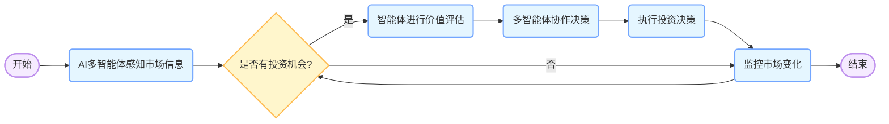

# AI多智能体在价值投资中的竞争优势分析

> 关键词：AI多智能体、价值投资、竞争优势、智能决策、市场预测

> 摘要：本文聚焦于AI多智能体在价值投资领域的应用，深入剖析其竞争优势。首先介绍了相关背景知识，包括目的范围、预期读者等。接着阐述了核心概念及联系，分析了核心算法原理与操作步骤，运用数学模型和公式进行详细讲解。通过项目实战展示了代码实现与解读，探讨了实际应用场景。还推荐了学习资源、开发工具框架和相关论文著作。最后总结了未来发展趋势与挑战，并给出常见问题解答和扩展阅读参考资料，旨在为价值投资领域引入AI多智能体提供全面的理论和实践指导。

## 1. 背景介绍 
### 1.1 目的和范围
本研究的主要目的是深入探究AI多智能体在价值投资中的竞争优势。随着金融市场的日益复杂和数据量的爆炸式增长，传统的投资分析方法面临着诸多挑战。AI多智能体作为一种新兴的技术手段，具有强大的信息处理和决策能力，有望为价值投资带来新的突破。本研究的范围涵盖了AI多智能体的基本原理、在价值投资中的具体应用、与传统投资方法的对比以及未来的发展趋势等方面。

### 1.2 预期读者
本文预期读者主要包括金融投资领域的从业者，如基金经理、投资顾问、分析师等，他们希望通过引入AI多智能体技术提升投资决策的准确性和效率。同时，也适合对人工智能和金融科技交叉领域感兴趣的研究人员和学生，为他们提供深入了解该领域的机会。此外，对于关注金融市场创新发展的普通投资者，本文也能帮助他们了解AI多智能体在价值投资中的作用和潜力。

### 1.3 文档结构概述
本文将按照以下结构进行阐述：首先介绍核心概念与联系，明确AI多智能体和价值投资的相关定义和架构；接着详细讲解核心算法原理和具体操作步骤，通过Python代码进行示例；然后运用数学模型和公式对相关原理进行量化分析，并举例说明；之后通过项目实战展示AI多智能体在价值投资中的实际应用，包括开发环境搭建、源代码实现和代码解读；再探讨实际应用场景，分析其在不同市场环境下的作用；随后推荐相关的学习资源、开发工具框架和论文著作；最后总结未来发展趋势与挑战，给出常见问题解答和扩展阅读参考资料。

### 1.4 术语表
#### 1.4.1 核心术语定义
- **AI多智能体**：由多个具有自主决策能力的智能体组成的系统，这些智能体可以相互协作、竞争，通过信息交互和学习来完成复杂的任务。
- **价值投资**：一种投资策略，投资者通过分析公司的基本面，如财务状况、盈利能力、行业地位等，寻找被低估的股票，并长期持有以获取价值回归带来的收益。
- **智能决策**：基于人工智能技术，利用大量的数据和算法模型，自动分析和评估各种投资选项，做出最优的投资决策。
- **市场预测**：通过对历史数据和市场信息的分析，运用各种预测模型，对未来市场走势进行预测。

#### 1.4.2 相关概念解释
- **智能体的自主性**：智能体能够独立地感知环境、做出决策和采取行动，不受外界的直接干预。
- **多智能体的协作**：多个智能体通过共享信息、协调行动，共同完成一个或多个目标。
- **价值评估模型**：用于评估公司内在价值的数学模型，常见的有现金流折现模型、市盈率模型等。

#### 1.4.3 缩略词列表
- **AI**：Artificial Intelligence，人工智能
- **ML**：Machine Learning，机器学习
- **RL**：Reinforcement Learning，强化学习

## 2. 核心概念与联系 
### 核心概念原理
#### AI多智能体
AI多智能体系统由多个智能体组成，每个智能体都有自己的感知器、决策器和执行器。感知器用于感知环境信息，决策器根据感知到的信息和自身的目标做出决策，执行器则将决策转化为实际行动。智能体之间可以通过通信机制进行信息交换和协作，以实现共同的目标。例如，在价值投资中，不同的智能体可以分别负责分析不同的市场数据、评估不同的投资标的，然后通过协作做出最优的投资决策。

#### 价值投资
价值投资的核心原理是寻找被市场低估的股票。投资者通过对公司的基本面进行深入分析，评估其内在价值，并与当前的市场价格进行比较。如果内在价值高于市场价格，说明股票被低估，具有投资价值。价值投资强调长期投资，认为市场最终会回归到股票的内在价值。

### 架构的文本示意图
```plaintext
AI多智能体系统
├── 智能体1
│   ├── 感知器（市场数据、公司信息等）
│   ├── 决策器（基于算法模型）
│   └── 执行器（买卖决策）
├── 智能体2
│   ├── 感知器（行业动态、宏观经济数据等）
│   ├── 决策器（优化投资组合）
│   └── 执行器（调整仓位）
└── 通信机制（智能体之间信息交换）

价值投资体系
├── 基本面分析
│   ├── 财务报表分析
│   ├── 盈利能力评估
│   └── 行业竞争力分析
├── 价值评估模型
│   ├── 现金流折现模型
│   ├── 市盈率模型
│   └── 市净率模型
└── 投资决策
    ├── 买入被低估股票
    └── 卖出被高估股票
```

### Mermaid流程图


## 3. 核心算法原理 & 具体操作步骤 
### 核心算法原理
在AI多智能体用于价值投资中，常用的算法包括机器学习算法和强化学习算法。

#### 机器学习算法
机器学习算法可以用于对市场数据和公司信息进行分析和预测。例如，使用线性回归算法可以建立股票价格与公司财务指标之间的关系模型，通过输入公司的财务数据预测股票价格。以下是一个简单的线性回归示例代码：

```python
import numpy as np
from sklearn.linear_model import LinearRegression

# 假设我们有一些公司的财务指标数据（自变量X）和对应的股票价格数据（因变量y）
X = np.array([[10], [20], [30], [40], [50]])
y = np.array([200, 400, 600, 800, 1000])

# 创建线性回归模型
model = LinearRegression()

# 训练模型
model.fit(X, y)

# 预测新的股票价格
new_X = np.array([[60]])
predicted_price = model.predict(new_X)
print("预测的股票价格:", predicted_price)
```

#### 强化学习算法
强化学习算法可以用于优化投资决策。智能体在投资过程中通过与环境（市场）进行交互，不断尝试不同的投资策略，并根据获得的奖励（如投资收益）来调整自己的行为，以实现长期的投资收益最大化。以下是一个简单的强化学习示例代码：

```python
import numpy as np

# 定义环境
class StockEnvironment:
    def __init__(self):
        self.stock_price = 100
        self.time_step = 0
        self.max_time_steps = 10

    def reset(self):
        self.stock_price = 100
        self.time_step = 0
        return self.stock_price

    def step(self, action):
        # 0: 卖出，1: 持有，2: 买入
        if action == 0:
            reward = -self.stock_price
        elif action == 2:
            reward = -self.stock_price
        else:
            reward = 0

        # 模拟股票价格变化
        self.stock_price += np.random.randn() * 5
        self.time_step += 1

        done = self.time_step >= self.max_time_steps
        return self.stock_price, reward, done

# 定义智能体
class StockAgent:
    def __init__(self):
        self.q_table = np.zeros((10, 3))  # 假设价格离散化为10个状态，3个动作
        self.learning_rate = 0.1
        self.discount_factor = 0.9
        self.epsilon = 0.1

    def choose_action(self, state):
        if np.random.uniform(0, 1) < self.epsilon:
            return np.random.choice(3)
        else:
            return np.argmax(self.q_table[state])

    def update_q_table(self, state, action, reward, next_state):
        max_q_next = np.max(self.q_table[next_state])
        self.q_table[state, action] += self.learning_rate * (
            reward + self.discount_factor * max_q_next - self.q_table[state, action]
        )

# 训练智能体
env = StockEnvironment()
agent = StockAgent()

for episode in range(100):
    state = env.reset()
    done = False
    while not done:
        action = agent.choose_action(int(state // 10))
        next_state, reward, done = env.step(action)
        agent.update_q_table(int(state // 10), action, reward, int(next_state // 10))
        state = next_state

print("训练完成，Q表:", agent.q_table)
```

### 具体操作步骤
1. **数据收集**：收集市场数据，包括股票价格、成交量、公司财务报表、行业动态等。
2. **数据预处理**：对收集到的数据进行清洗、归一化等处理，以便于后续的分析和建模。
3. **智能体设计**：根据投资目标和需求，设计不同功能的智能体，如市场分析智能体、价值评估智能体、投资决策智能体等。
4. **算法选择与训练**：选择合适的机器学习或强化学习算法，对智能体进行训练，使其能够根据输入的数据做出准确的决策。
5. **多智能体协作**：建立智能体之间的通信机制，实现信息共享和协作，共同完成投资决策任务。
6. **投资执行与监控**：根据智能体的决策执行投资操作，并实时监控市场变化，及时调整投资策略。

## 4. 数学模型和公式 & 详细讲解 & 举例说明 
### 线性回归模型
线性回归模型是一种常用的机器学习模型，用于建立自变量和因变量之间的线性关系。其数学公式为：

$$y = \beta_0 + \beta_1x_1 + \beta_2x_2 + \cdots + \beta_nx_n + \epsilon$$

其中，$y$ 是因变量（如股票价格），$x_1, x_2, \cdots, x_n$ 是自变量（如公司的财务指标），$\beta_0, \beta_1, \cdots, \beta_n$ 是模型的参数，$\epsilon$ 是误差项。

在实际应用中，我们需要通过最小化误差项的平方和来估计模型的参数。最小二乘法是一种常用的参数估计方法，其目标是使以下损失函数最小化：

$$L(\beta) = \sum_{i=1}^{m}(y_i - (\beta_0 + \beta_1x_{i1} + \beta_2x_{i2} + \cdots + \beta_nx_{in}))^2$$

其中，$m$ 是样本数量，$y_i$ 是第 $i$ 个样本的因变量值，$x_{i1}, x_{i2}, \cdots, x_{in}$ 是第 $i$ 个样本的自变量值。

### 举例说明
假设我们有以下公司的财务数据和对应的股票价格数据：

| 营业收入（亿元） | 净利润（亿元） | 股票价格（元） |
| --- | --- | --- |
| 10 | 2 | 200 |
| 20 | 4 | 400 |
| 30 | 6 | 600 |
| 40 | 8 | 800 |
| 50 | 10 | 1000 |

我们可以使用线性回归模型来建立股票价格与营业收入和净利润之间的关系。假设模型为：

$$y = \beta_0 + \beta_1x_1 + \beta_2x_2$$

其中，$y$ 是股票价格，$x_1$ 是营业收入，$x_2$ 是净利润。

使用最小二乘法估计模型的参数，得到：

$$\beta_0 = 0, \beta_1 = 10, \beta_2 = 100$$

则模型为：

$$y = 10x_1 + 100x_2$$

如果一家公司的营业收入为 60 亿元，净利润为 12 亿元，我们可以预测其股票价格为：

$$y = 10\times60 + 100\times12 = 1800$$

### 强化学习中的Q学习算法
Q学习算法是一种常用的强化学习算法，用于学习最优的动作策略。其核心是通过更新Q表来不断优化智能体的行为。Q表是一个二维数组，记录了在每个状态下采取每个动作的预期奖励。

Q学习算法的更新公式为：

$$Q(s_t, a_t) \leftarrow Q(s_t, a_t) + \alpha [r_{t+1} + \gamma \max_{a}Q(s_{t+1}, a) - Q(s_t, a_t)]$$

其中，$s_t$ 是当前状态，$a_t$ 是当前动作，$r_{t+1}$ 是执行动作后获得的奖励，$s_{t+1}$ 是下一个状态，$\alpha$ 是学习率，$\gamma$ 是折扣因子。

### 举例说明
在前面的股票投资强化学习示例中，智能体通过不断与环境交互，更新Q表。假设当前状态为 $s_t = 3$（表示股票价格处于某个区间），采取的动作 $a_t = 2$（买入），获得的奖励 $r_{t+1} = -100$，下一个状态 $s_{t+1} = 4$，学习率 $\alpha = 0.1$，折扣因子 $\gamma = 0.9$。

假设当前 $Q(3, 2) = 10$，$Q(4, 0) = 20$，$Q(4, 1) = 30$，$Q(4, 2) = 40$，则更新后的 $Q(3, 2)$ 为：

$$Q(3, 2) = 10 + 0.1\times(-100 + 0.9\times40 - 10) = 10 + 0.1\times(-100 + 36 - 10) = 10 + 0.1\times(-74) = 2.6$$

通过不断更新Q表，智能体可以学习到在不同状态下采取最优的动作，以实现长期的投资收益最大化。

## 5. 项目实战：代码实际案例和详细解释说明 
### 5.1  开发环境搭建
#### 安装Python
首先需要安装Python编程语言，建议使用Python 3.7及以上版本。可以从Python官方网站（https://www.python.org/downloads/）下载安装包，按照安装向导进行安装。

#### 安装必要的库
在价值投资项目中，需要使用一些Python库来进行数据处理、模型训练和可视化等操作。可以使用以下命令安装必要的库：

```bash
pip install numpy pandas scikit-learn matplotlib
```

### 5.2  源代码详细实现和代码解读
#### 数据收集与预处理
```python
import pandas as pd
import numpy as np

# 假设我们从CSV文件中读取股票数据
data = pd.read_csv('stock_data.csv')

# 数据清洗：去除缺失值
data = data.dropna()

# 特征选择：选择一些与股票价格相关的特征
features = ['revenue', 'net_income', 'roe']
X = data[features].values
y = data['stock_price'].values

# 数据归一化
from sklearn.preprocessing import StandardScaler
scaler = StandardScaler()
X = scaler.fit_transform(X)
```

**代码解读**：
- 首先使用 `pandas` 库读取CSV文件中的股票数据。
- 然后使用 `dropna()` 方法去除数据中的缺失值。
- 选择一些与股票价格相关的特征，如营业收入、净利润和净资产收益率，并将其存储在 `X` 中，将股票价格存储在 `y` 中。
- 最后使用 `StandardScaler` 对特征数据进行归一化处理，以提高模型的训练效果。

#### 模型训练与预测
```python
from sklearn.model_selection import train_test_split
from sklearn.linear_model import LinearRegression

# 划分训练集和测试集
X_train, X_test, y_train, y_test = train_test_split(X, y, test_size=0.2, random_state=42)

# 创建线性回归模型
model = LinearRegression()

# 训练模型
model.fit(X_train, y_train)

# 预测
y_pred = model.predict(X_test)

# 评估模型
from sklearn.metrics import mean_squared_error
mse = mean_squared_error(y_test, y_pred)
print("均方误差:", mse)
```

**代码解读**：
- 使用 `train_test_split` 函数将数据集划分为训练集和测试集，其中测试集占比为 20%。
- 创建一个线性回归模型，并使用训练集数据进行训练。
- 使用训练好的模型对测试集数据进行预测，得到预测结果 `y_pred`。
- 使用 `mean_squared_error` 函数计算预测结果与真实值之间的均方误差，评估模型的性能。

### 5.3  代码解读与分析
通过上述代码，我们完成了一个简单的价值投资预测项目。从数据收集与预处理到模型训练与预测，整个流程清晰明了。在数据预处理阶段，数据清洗和归一化是非常重要的步骤，可以提高数据的质量和模型的训练效果。在模型训练阶段，选择合适的模型和评估指标也是关键。线性回归模型是一种简单而有效的模型，但在实际应用中，可能需要尝试更复杂的模型，如神经网络、随机森林等，以提高预测的准确性。

## 6. 实际应用场景 
### 股票投资组合优化
AI多智能体可以用于优化股票投资组合。不同的智能体可以分别负责分析不同的股票，评估其风险和收益，并根据投资者的风险偏好和投资目标，通过协作确定最优的投资组合。例如，一个智能体可以负责分析宏观经济数据，预测市场趋势；另一个智能体可以负责分析公司的基本面，评估股票的内在价值。通过多智能体的协作，可以更全面地考虑各种因素，提高投资组合的收益和降低风险。

### 量化交易策略制定
在量化交易中，AI多智能体可以根据市场数据和历史交易记录，自动生成交易策略。智能体可以实时监测市场变化，根据预设的规则和算法，及时做出买入或卖出的决策。例如，一个智能体可以根据股票价格的波动情况，制定短期的交易策略；另一个智能体可以根据公司的财务报表，制定长期的投资策略。通过多智能体的协作，可以实现更高效、更准确的量化交易。

### 风险评估与管理
AI多智能体可以用于评估和管理投资风险。智能体可以分析市场数据、公司财务状况、行业竞争等因素，预测投资风险的大小，并根据风险评估结果，及时调整投资策略。例如，当市场风险增加时，智能体可以建议投资者减少股票投资，增加债券等低风险资产的配置；当公司财务状况恶化时，智能体可以建议投资者卖出该公司的股票。通过多智能体的协作，可以实现更全面、更及时的风险评估与管理。

## 7. 工具和资源推荐
### 7.1 学习资源推荐
#### 7.1.1 书籍推荐
- 《人工智能：一种现代的方法》：这本书是人工智能领域的经典教材，全面介绍了人工智能的基本概念、算法和应用。
- 《机器学习》：周志华教授的著作，系统地介绍了机器学习的各种算法和理论。
- 《Python金融数据分析实战》：介绍了如何使用Python进行金融数据分析和建模，对于价值投资领域的从业者非常有帮助。

#### 7.1.2 在线课程
- Coursera上的“机器学习”课程：由斯坦福大学的Andrew Ng教授授课，是机器学习领域最受欢迎的在线课程之一。
- edX上的“人工智能基础”课程：介绍了人工智能的基本概念、算法和应用，适合初学者学习。
- 网易云课堂上的“Python量化交易实战”课程：讲解了如何使用Python进行量化交易策略的开发和实现。

#### 7.1.3 技术博客和网站
- 博客园：有很多技术博主分享人工智能和金融科技领域的经验和心得。
- 知乎：可以关注一些人工智能和金融领域的专家和话题，获取最新的行业动态和技术知识。
- Kaggle：一个数据科学竞赛平台，上面有很多关于金融数据分析和预测的竞赛项目，可以学习到很多实际应用的技巧和方法。

### 7.2 开发工具框架推荐
#### 7.2.1 IDE和编辑器
- PyCharm：一款专业的Python集成开发环境，具有强大的代码编辑、调试和项目管理功能。
- Jupyter Notebook：一个交互式的开发环境，适合进行数据探索和模型实验。
- Visual Studio Code：一款轻量级的代码编辑器，支持多种编程语言和插件扩展。

#### 7.2.2 调试和性能分析工具
- PDB：Python自带的调试工具，可以帮助开发者定位和解决代码中的问题。
- cProfile：Python的性能分析工具，可以分析代码的运行时间和资源消耗情况。
- TensorBoard：TensorFlow的可视化工具，可以帮助开发者可视化模型的训练过程和性能指标。

#### 7.2.3 相关框架和库
- NumPy：Python的数值计算库，提供了高效的数组操作和数学函数。
- Pandas：用于数据处理和分析的库，提供了灵活的数据结构和数据操作方法。
- Scikit-learn：机器学习库，提供了各种机器学习算法和工具，方便开发者进行模型训练和评估。
- TensorFlow和PyTorch：深度学习框架，用于构建和训练神经网络模型。

### 7.3 相关论文著作推荐
#### 7.3.1 经典论文
- “Machine Learning in Automated Trading: Review and Critical Analysis”：对机器学习在自动化交易中的应用进行了全面的综述和分析。
- “Reinforcement Learning for Trading”：介绍了强化学习在交易策略制定中的应用。
- “Value Investing: The Use of Historical Financial Statement Information to Separate Winners from Losers”：探讨了价值投资中如何使用历史财务报表信息来筛选优质股票。

#### 7.3.2 最新研究成果
- 可以关注顶级学术期刊，如《Journal of Financial Economics》、《Review of Financial Studies》等，获取人工智能在价值投资领域的最新研究成果。
- 参加相关的学术会议，如NeurIPS、ICML等，了解最新的技术趋势和研究进展。

#### 7.3.3 应用案例分析
- 可以参考一些金融科技公司的官方博客和报告，了解他们在实际项目中如何应用AI多智能体进行价值投资。
- 一些知名的投资机构也会发布关于投资策略和技术应用的研究报告，可以从中获取实际应用案例和经验。

## 8. 总结：未来发展趋势与挑战
### 未来发展趋势
- **智能化程度不断提高**：随着人工智能技术的不断发展，AI多智能体在价值投资中的智能化程度将不断提高。智能体将能够更好地理解市场信息和投资者需求，做出更加准确和智能的投资决策。
- **与其他技术融合**：AI多智能体将与区块链、大数据、云计算等技术深度融合，实现更高效的数据处理、更安全的交易和更智能的决策。例如，区块链技术可以提供可信的数据存储和交易记录，大数据技术可以提供更丰富的市场信息，云计算技术可以提供强大的计算能力。
- **应用范围不断扩大**：AI多智能体在价值投资中的应用范围将不断扩大，不仅可以应用于股票投资，还可以应用于债券、期货、基金等其他金融领域。同时，也可以应用于企业的投资决策、风险管理等方面。

### 挑战
- **数据质量和隐私问题**：AI多智能体的训练和决策依赖于大量的数据，数据的质量和隐私问题是一个重要的挑战。如何确保数据的准确性、完整性和安全性，以及如何保护投资者的隐私，是需要解决的问题。
- **算法解释性问题**：一些复杂的人工智能算法，如深度学习算法，具有较高的预测准确性，但缺乏解释性。在价值投资中，投资者需要了解算法的决策过程和依据，以便做出合理的投资决策。如何提高算法的解释性，是一个亟待解决的问题。
- **市场不确定性和风险**：金融市场具有高度的不确定性和风险，AI多智能体的决策也可能受到市场波动的影响。如何提高智能体的抗风险能力，以及如何在不确定的市场环境中做出稳健的投资决策，是需要面对的挑战。

## 9. 附录：常见问题与解答
### 问题1：AI多智能体在价值投资中的准确性如何保证？
答：可以通过以下几个方面来保证AI多智能体在价值投资中的准确性：
- 收集高质量的数据，包括市场数据、公司财务数据等，并进行严格的数据清洗和预处理。
- 选择合适的算法和模型，并进行充分的训练和优化。可以使用交叉验证等方法来评估模型的性能，选择最优的模型。
- 建立多智能体之间的协作机制，通过信息共享和协作，综合考虑各种因素，提高决策的准确性。
- 实时监控市场变化，及时调整智能体的参数和策略，以适应市场的动态变化。

### 问题2：AI多智能体与传统投资方法相比有哪些优势？
答：AI多智能体与传统投资方法相比，具有以下优势：
- **高效性**：AI多智能体可以快速处理大量的数据，分析市场信息和公司基本面，做出决策的速度比人工快得多。
- **客观性**：智能体的决策基于算法和数据，不受人类情绪和主观因素的影响，决策更加客观和理性。
- **全面性**：多智能体可以从不同的角度分析市场和投资标的，综合考虑各种因素，做出更加全面的投资决策。
- **适应性**：智能体可以实时监测市场变化，根据市场情况及时调整投资策略，具有更强的适应性。

### 问题3：AI多智能体在价值投资中的应用需要具备哪些技术基础？
答：AI多智能体在价值投资中的应用需要具备以下技术基础：
- **人工智能技术**：包括机器学习、深度学习、强化学习等，用于构建智能体的决策模型和算法。
- **数据分析技术**：掌握数据处理、数据挖掘、数据可视化等技术，用于收集、清洗和分析市场数据和公司信息。
- **编程技能**：熟练掌握Python等编程语言，能够使用相关的库和框架进行开发和实现。
- **金融知识**：了解金融市场的基本原理、投资策略和风险管理等知识，以便更好地将人工智能技术应用于价值投资领域。

## 10. 扩展阅读 & 参考资料
### 扩展阅读
- 《智能投资新范式：人工智能与量化投资》：介绍了人工智能在量化投资中的应用和发展趋势。
- 《金融科技前沿：区块链、人工智能与量化交易》：探讨了区块链、人工智能等新兴技术在金融领域的应用。
- 《机器学习实战》：通过实际案例介绍了机器学习算法的应用和实现。

### 参考资料
- 相关的学术论文和研究报告，如前面推荐的经典论文和最新研究成果。
- 金融科技公司和投资机构的官方网站和博客，获取实际应用案例和经验。
- 行业会议和研讨会的资料和报告，了解最新的技术趋势和研究进展。

作者：AI天才研究院/AI Genius Institute & 禅与计算机程序设计艺术 /Zen And The Art of Computer Programming