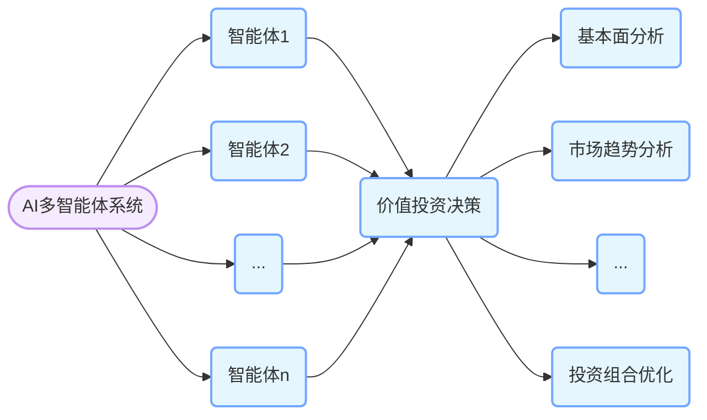

# AI多智能体增强价值投资的跨市场比较分析

> 关键词：AI多智能体、价值投资、跨市场比较、增强学习、投资策略

> 摘要：本文聚焦于AI多智能体增强价值投资在不同市场的应用与比较分析。详细阐述了AI多智能体和价值投资的核心概念及其联系，深入剖析了相关算法原理和数学模型。通过实际项目案例展示了如何运用这些技术进行投资决策，并探讨了其在不同市场中的实际应用场景。同时，推荐了一系列学习资源、开发工具和相关论文著作，最后对该领域的未来发展趋势与挑战进行了总结，旨在为投资者和研究者提供全面的参考。

## 1. 背景介绍 
### 1.1 目的和范围
本研究的主要目的是深入探讨AI多智能体技术在增强价值投资中的应用，并对其在不同市场（如股票市场、期货市场、外汇市场等）的表现进行比较分析。通过分析不同市场的特点和AI多智能体策略的适应性，为投资者提供更有效的投资决策依据，同时为学术界提供关于该领域的前沿研究成果。研究范围涵盖了AI多智能体技术的基本原理、价值投资的理论基础、跨市场数据的收集与分析、投资策略的制定与优化等方面。

### 1.2 预期读者
本文预期读者包括金融投资者、金融分析师、人工智能研究者、金融科技从业者以及对AI在金融领域应用感兴趣的学生和爱好者。投资者可以从本文中获取新的投资思路和策略；分析师可以借鉴文中的分析方法和模型；研究者可以了解该领域的最新研究动态和技术趋势；从业者可以将相关技术应用到实际工作中；学生和爱好者可以通过本文系统地学习AI多智能体增强价值投资的相关知识。

### 1.3 文档结构概述
本文共分为十个部分。第一部分为背景介绍，阐述了研究的目的、范围、预期读者和文档结构。第二部分介绍核心概念与联系，包括AI多智能体和价值投资的原理、架构及其相互关系。第三部分详细讲解核心算法原理和具体操作步骤，并给出Python源代码示例。第四部分介绍数学模型和公式，并通过具体例子进行说明。第五部分通过项目实战，展示代码的实际案例和详细解释。第六部分探讨实际应用场景。第七部分推荐学习资源、开发工具和相关论文著作。第八部分总结未来发展趋势与挑战。第九部分为附录，解答常见问题。第十部分提供扩展阅读和参考资料。

### 1.4 术语表
#### 1.4.1 核心术语定义
- **AI多智能体**：是指由多个自主智能体组成的系统，这些智能体能够感知环境、相互通信、协同工作，以实现共同的目标。在金融投资领域，智能体可以代表不同的投资策略或投资者。
- **价值投资**：是一种基于公司基本面分析的投资策略，投资者通过评估公司的内在价值，选择被低估的股票进行投资，期望在长期内获得超额收益。
- **增强学习**：是一种机器学习方法，智能体通过与环境进行交互，根据环境反馈的奖励信号来学习最优的行为策略。

#### 1.4.2 相关概念解释
- **跨市场**：指在不同的金融市场（如股票市场、期货市场、外汇市场等）之间进行投资和分析。不同市场具有不同的特点和规律，跨市场分析可以帮助投资者发现更多的投资机会。
- **投资组合优化**：是指通过合理配置资产，在风险和收益之间寻求平衡，以实现投资组合的最优绩效。

#### 1.4.3 缩略词列表
- **AI**：Artificial Intelligence，人工智能
- **RL**：Reinforcement Learning，增强学习
- **MDP**：Markov Decision Process，马尔可夫决策过程

## 2. 核心概念与联系 
### 2.1 AI多智能体原理
AI多智能体系统由多个智能体组成，每个智能体都具有一定的自主性和智能性。智能体可以感知环境中的信息，并根据这些信息做出决策。智能体之间可以通过通信机制进行信息交换和协同工作，以实现共同的目标。在金融投资领域，每个智能体可以代表一种投资策略，例如价值投资策略、成长投资策略等。这些智能体可以根据市场情况和其他智能体的行为，动态调整自己的投资策略，以实现投资组合的最优绩效。

### 2.2 价值投资原理
价值投资的核心思想是寻找被低估的股票，即股票的市场价格低于其内在价值。投资者通过对公司的财务报表、行业前景、管理层能力等方面进行分析，评估公司的内在价值。当股票的市场价格低于其内在价值时，投资者认为该股票具有投资价值，会选择买入；当股票的市场价格高于其内在价值时，投资者会选择卖出。价值投资强调长期投资，认为市场最终会回归到股票的内在价值。

### 2.3 AI多智能体与价值投资的联系
AI多智能体技术可以为价值投资提供更强大的分析和决策能力。通过多个智能体的协同工作，可以更全面地分析市场信息，发现更多的投资机会。例如，一个智能体可以专注于公司基本面分析，评估公司的内在价值；另一个智能体可以关注市场情绪和技术指标，分析市场趋势。这些智能体可以相互协作，共同制定投资策略。同时，增强学习可以帮助智能体不断优化投资策略，以适应市场的变化。

### 2.4 核心概念架构的文本示意图
```plaintext
+---------------------+
|  AI多智能体系统     |
| +----------------+  |
| | 智能体1 (价值  |  |
| | 投资策略)      |  |
| +----------------+  |
| +----------------+  |
| | 智能体2 (成长  |  |
| | 投资策略)      |  |
| +----------------+  |
|...                |
| +----------------+  |
| | 智能体n (其他  |  |
| | 投资策略)      |  |
| +----------------+  |
+---------------------+
          |
          v
+---------------------+
| 价值投资决策        |
| +----------------+  |
| | 基本面分析      |  |
| +----------------+  |
| +----------------+  |
| | 市场趋势分析    |  |
| +----------------+  |
|...                |
| +----------------+  |
| | 投资组合优化    |  |
| +----------------+  |
+---------------------+
```

### 2.5 Mermaid流程图


## 3. 核心算法原理 & 具体操作步骤 
### 3.1 增强学习基础
增强学习是一种通过智能体与环境进行交互来学习最优行为策略的机器学习方法。在增强学习中，智能体在每个时间步 $t$ 观察环境的状态 $s_t$，并根据当前策略 $\pi$ 选择一个动作 $a_t$。执行动作后，智能体从环境中获得一个奖励 $r_t$，并转移到下一个状态 $s_{t+1}$。智能体的目标是最大化长期累积奖励。

增强学习通常使用马尔可夫决策过程（MDP）来建模。MDP 由一个四元组 $(S, A, P, R)$ 表示，其中：
- $S$ 是状态空间，表示环境的所有可能状态。
- $A$ 是动作空间，表示智能体可以采取的所有可能动作。
- $P(s_{t+1}|s_t, a_t)$ 是状态转移概率，表示在状态 $s_t$ 执行动作 $a_t$ 后转移到状态 $s_{t+1}$ 的概率。
- $R(s_t, a_t, s_{t+1})$ 是奖励函数，表示在状态 $s_t$ 执行动作 $a_t$ 并转移到状态 $s_{t+1}$ 时获得的奖励。

### 3.2 Q - learning算法原理
Q - learning 是一种无模型的增强学习算法，用于学习最优动作价值函数 $Q(s, a)$。动作价值函数 $Q(s, a)$ 表示在状态 $s$ 执行动作 $a$ 后，遵循最优策略所能获得的期望累积奖励。

Q - learning 算法的更新公式如下：
$$Q(s_t, a_t) \leftarrow Q(s_t, a_t) + \alpha [r_t + \gamma \max_{a} Q(s_{t+1}, a) - Q(s_t, a_t)]$$
其中：
- $\alpha$ 是学习率，控制每次更新的步长。
- $\gamma$ 是折扣因子，用于权衡当前奖励和未来奖励的重要性。

### 3.3 具体操作步骤
1. **初始化**：初始化 Q 表 $Q(s, a)$，将所有的 $Q(s, a)$ 值初始化为 0。
2. **循环执行以下步骤直到满足终止条件**：
    - 观察当前状态 $s_t$。
    - 根据当前的 Q 表和探索策略（如 $\epsilon$-贪心策略）选择动作 $a_t$。
    - 执行动作 $a_t$，并从环境中获得奖励 $r_t$ 和下一个状态 $s_{t+1}$。
    - 根据 Q - learning 更新公式更新 Q 表。
    - 更新当前状态 $s_t = s_{t+1}$。

### 3.4 Python源代码示例
```python
import numpy as np

# 定义状态空间和动作空间
num_states = 10
num_actions = 4

# 初始化Q表
Q = np.zeros((num_states, num_actions))

# 定义超参数
alpha = 0.1  # 学习率
gamma = 0.9  # 折扣因子
epsilon = 0.1  # 探索率
num_episodes = 1000

# 定义环境（简单示例）
def get_reward(state, action):
    # 这里简单定义一个奖励函数，实际应用中需要根据具体情况修改
    if state == 5 and action == 2:
        return 1
    else:
        return 0

def get_next_state(state, action):
    # 这里简单定义一个状态转移函数，实际应用中需要根据具体情况修改
    next_state = (state + action) % num_states
    return next_state

# Q - learning算法
for episode in range(num_episodes):
    state = np.random.randint(0, num_states)  # 随机初始化状态
    done = False
    while not done:
        # 根据epsilon - 贪心策略选择动作
        if np.random.uniform(0, 1) < epsilon:
            action = np.random.randint(0, num_actions)
        else:
            action = np.argmax(Q[state, :])
        
        # 执行动作，获取奖励和下一个状态
        reward = get_reward(state, action)
        next_state = get_next_state(state, action)
        
        # 更新Q表
        Q[state, action] = Q[state, action] + alpha * (reward + gamma * np.max(Q[next_state, :]) - Q[state, action])
        
        # 更新状态
        state = next_state
        
        # 判断是否终止
        if state == 5 and action == 2:
            done = True

print("最终的Q表：")
print(Q)
```

## 4. 数学模型和公式 & 详细讲解 & 举例说明 
### 4.1 马尔可夫决策过程（MDP）
马尔可夫决策过程（MDP）是增强学习中常用的数学模型，用于描述智能体与环境的交互过程。如前所述，MDP 由四元组 $(S, A, P, R)$ 表示。

#### 详细讲解
- **状态空间 $S$**：是一个有限或无限的集合，表示环境的所有可能状态。例如，在股票投资中，状态可以包括股票的价格、成交量、市盈率等信息。
- **动作空间 $A$**：是一个有限或无限的集合，表示智能体可以采取的所有可能动作。在股票投资中，动作可以包括买入、卖出、持有等。
- **状态转移概率 $P(s_{t+1}|s_t, a_t)$**：表示在状态 $s_t$ 执行动作 $a_t$ 后转移到状态 $s_{t+1}$ 的概率。这个概率通常是未知的，需要通过智能体与环境的交互来估计。
- **奖励函数 $R(s_t, a_t, s_{t+1})$**：表示在状态 $s_t$ 执行动作 $a_t$ 并转移到状态 $s_{t+1}$ 时获得的奖励。奖励函数是智能体学习的目标，智能体的目标是最大化长期累积奖励。

#### 举例说明
假设我们有一个简单的股票投资环境，状态空间 $S = \{s_1, s_2, s_3\}$ 表示股票的三种不同价格状态，动作空间 $A = \{买入, 卖出, 持有\}$。状态转移概率可以用一个三维矩阵表示，例如：
$$P(s_{t+1}=s_1|s_t=s_2, a_t=买入) = 0.3$$
表示在状态 $s_2$ 执行买入动作后转移到状态 $s_1$ 的概率为 0.3。

奖励函数可以定义为：
$$R(s_t, s_{t+1}, a_t) = \begin{cases}
1, & \text{如果卖出股票后价格下跌} \\
-1, & \text{如果卖出股票后价格上涨} \\
0, & \text{其他情况}
\end{cases}$$

### 4.2 动作价值函数 $Q(s, a)$
动作价值函数 $Q(s, a)$ 表示在状态 $s$ 执行动作 $a$ 后，遵循最优策略所能获得的期望累积奖励。其数学定义如下：
$$Q^*(s, a) = \mathbb{E} \left[ \sum_{t=0}^{\infty} \gamma^t r_{t} | s_0 = s, a_0 = a, \pi^* \right]$$
其中 $\gamma$ 是折扣因子，$\pi^*$ 是最优策略。

#### 详细讲解
动作价值函数 $Q(s, a)$ 是增强学习中的核心概念之一，它可以帮助智能体选择最优动作。在每个状态 $s$ 下，智能体可以选择使 $Q(s, a)$ 最大的动作 $a$ 作为最优动作。

#### 举例说明
假设我们有一个简单的网格世界环境，智能体在一个 $3 \times 3$ 的网格中移动，目标是到达右上角的格子。状态 $s$ 表示智能体在网格中的位置，动作 $a$ 表示智能体的移动方向（上、下、左、右）。通过训练，我们可以得到每个状态 - 动作对的 $Q$ 值。例如，在状态 $(1, 1)$ 下，$Q((1, 1), 上) = 0.5$，$Q((1, 1), 下) = -0.2$，$Q((1, 1), 左) = -0.1$，$Q((1, 1), 右) = 0.8$。那么智能体在状态 $(1, 1)$ 下应该选择向右移动，因为 $Q((1, 1), 右)$ 的值最大。

### 4.3 Q - learning更新公式
Q - learning 的更新公式为：
$$Q(s_t, a_t) \leftarrow Q(s_t, a_t) + \alpha [r_t + \gamma \max_{a} Q(s_{t+1}, a) - Q(s_t, a_t)]$$

#### 详细讲解
- **$\alpha$ 学习率**：控制每次更新的步长。$\alpha$ 越大，每次更新的幅度越大；$\alpha$ 越小，每次更新的幅度越小。
- **$\gamma$ 折扣因子**：用于权衡当前奖励和未来奖励的重要性。$\gamma$ 越接近 1，表示更看重未来奖励；$\gamma$ 越接近 0，表示更看重当前奖励。
- $r_t + \gamma \max_{a} Q(s_{t+1}, a)$ 是目标值，表示在状态 $s_t$ 执行动作 $a_t$ 后，遵循最优策略所能获得的估计累积奖励。
- $Q(s_t, a_t)$ 是当前的估计值。更新公式的目的是使当前的估计值逐渐接近目标值。

#### 举例说明
假设在某个时间步 $t$，状态 $s_t = s_1$，动作 $a_t = a_1$，当前的 $Q(s_1, a_1) = 0.2$，奖励 $r_t = 0.5$，下一个状态 $s_{t+1} = s_2$，$\max_{a} Q(s_2, a) = 0.8$，学习率 $\alpha = 0.1$，折扣因子 $\gamma = 0.9$。则更新后的 $Q(s_1, a_1)$ 为：
$$Q(s_1, a_1) = 0.2 + 0.1 \times (0.5 + 0.9 \times 0.8 - 0.2) = 0.2 + 0.1 \times (0.5 + 0.72 - 0.2) = 0.2 + 0.1 \times 1.02 = 0.302$$

## 5. 项目实战：代码实际案例和详细解释说明 
### 5.1 开发环境搭建
#### 操作系统
本项目可以在 Windows、Linux 或 macOS 操作系统上进行开发。建议使用 Linux 或 macOS，因为它们在科学计算和机器学习方面具有更好的支持。

#### 编程语言和库
- **Python**：作为主要的编程语言，Python 具有丰富的科学计算和机器学习库，非常适合用于金融数据分析和增强学习算法的实现。
- **NumPy**：用于进行高效的数值计算。
- **Pandas**：用于数据处理和分析。
- **Matplotlib**：用于数据可视化。
- **OpenAI Gym**：一个用于开发和比较增强学习算法的工具包，提供了各种环境和接口。

#### 安装步骤
1. 安装 Python：可以从 Python 官方网站（https://www.python.org/downloads/）下载并安装 Python 3.x 版本。
2. 安装所需的库：打开命令行终端，使用以下命令安装所需的库：
```sh
pip install numpy pandas matplotlib gym
```

### 5.2 源代码详细实现和代码解读
#### 项目需求
我们将实现一个简单的股票投资模拟环境，使用 Q - learning 算法进行投资决策。环境的状态包括股票的价格和持有数量，动作包括买入、卖出和持有。智能体的目标是通过学习最优策略，最大化投资收益。

#### 代码实现
```python
import numpy as np
import gym
from gym import spaces

# 定义股票投资环境
class StockTradingEnv(gym.Env):
    def __init__(self):
        # 定义状态空间和动作空间
        self.observation_space = spaces.Box(low=0, high=np.inf, shape=(2,), dtype=np.float32)
        self.action_space = spaces.Discrete(3)  # 0: 持有, 1: 买入, 2: 卖出
        
        # 初始化环境参数
        self.stock_price = 100
        self.stock_holding = 0
        self.cash = 10000
    
    def step(self, action):
        # 执行动作
        if action == 1:  # 买入
            if self.cash >= self.stock_price:
                self.stock_holding += 1
                self.cash -= self.stock_price
        elif action == 2:  # 卖出
            if self.stock_holding > 0:
                self.stock_holding -= 1
                self.cash += self.stock_price
        
        # 更新股票价格（简单随机波动）
        self.stock_price += np.random.normal(0, 1)
        
        # 计算奖励
        portfolio_value = self.cash + self.stock_holding * self.stock_price
        reward = portfolio_value - (self.cash + self.stock_holding * 100)
        
        # 定义终止条件
        done = False
        if self.cash < 0 or self.stock_holding < 0:
            done = True
        
        # 获取当前状态
        state = np.array([self.stock_price, self.stock_holding], dtype=np.float32)
        
        return state, reward, done, {}
    
    def reset(self):
        # 重置环境
        self.stock_price = 100
        self.stock_holding = 0
        self.cash = 10000
        state = np.array([self.stock_price, self.stock_holding], dtype=np.float32)
        return state
    
    def render(self, mode='human'):
        # 渲染环境（简单打印信息）
        print(f"股票价格: {self.stock_price}, 持有数量: {self.stock_holding}, 现金: {self.cash}")

# Q - learning算法
def q_learning(env, num_episodes=1000, alpha=0.1, gamma=0.9, epsilon=0.1):
    # 初始化Q表
    num_states = 100  # 简单离散化状态空间
    num_actions = env.action_space.n
    Q = np.zeros((num_states, num_actions))
    
    for episode in range(num_episodes):
        state = env.reset()
        state = discretize_state(state)
        done = False
        
        while not done:
            # 根据epsilon - 贪心策略选择动作
            if np.random.uniform(0, 1) < epsilon:
                action = env.action_space.sample()
            else:
                action = np.argmax(Q[state, :])
            
            # 执行动作
            next_state, reward, done, _ = env.step(action)
            next_state = discretize_state(next_state)
            
            # 更新Q表
            Q[state, action] = Q[state, action] + alpha * (reward + gamma * np.max(Q[next_state, :]) - Q[state, action])
            
            # 更新状态
            state = next_state
    
    return Q

# 离散化状态空间
def discretize_state(state):
    price = int(state[0])
    holding = int(state[1])
    index = price * 10 + holding
    index = min(index, 99)  # 防止越界
    return index

# 主程序
if __name__ == "__main__":
    env = StockTradingEnv()
    Q = q_learning(env)
    print("最终的Q表：")
    print(Q)
```

#### 代码解读
1. **StockTradingEnv类**：定义了股票投资环境，继承自 `gym.Env` 类。
    - `__init__` 方法：初始化状态空间、动作空间和环境参数。
    - `step` 方法：执行动作，更新股票价格和环境状态，计算奖励和判断终止条件。
    - `reset` 方法：重置环境。
    - `render` 方法：渲染环境，简单打印环境信息。
2. **q_learning函数**：实现了 Q - learning 算法。
    - 初始化 Q 表。
    - 循环执行多个回合的训练，每个回合中智能体与环境进行交互，根据 epsilon - 贪心策略选择动作，执行动作后更新 Q 表。
3. **discretize_state函数**：将连续的状态空间离散化，以便于使用 Q 表进行学习。

### 5.3 代码解读与分析
#### 状态空间离散化
在实际应用中，状态空间通常是连续的，而 Q - learning 算法需要离散的状态空间。因此，我们需要将连续的状态空间离散化。在本项目中，我们将股票价格和持有数量离散化，通过简单的线性映射将其转换为一个整数索引。

#### 奖励设计
奖励设计是增强学习中的关键问题之一。在本项目中，我们将投资组合的价值变化作为奖励，即当前投资组合的价值减去初始投资组合的价值。这样设计的目的是激励智能体通过合理的投资决策来增加投资收益。

#### 探索与利用平衡
在 Q - learning 算法中，我们使用 epsilon - 贪心策略来平衡探索和利用。epsilon 控制了智能体进行随机探索的概率。在训练初期，我们希望智能体进行更多的探索，以发现更多的状态 - 动作对；在训练后期，我们希望智能体更多地利用已经学习到的知识，选择最优动作。

## 6. 实际应用场景 
### 6.1 股票市场
在股票市场中，AI多智能体增强价值投资可以帮助投资者更准确地评估股票的内在价值，发现被低估的股票。多个智能体可以从不同的角度对股票进行分析，例如基本面分析、技术分析、市场情绪分析等。通过协同工作，智能体可以制定更合理的投资策略，优化投资组合。同时，增强学习可以帮助智能体根据市场的变化动态调整投资策略，提高投资收益。

### 6.2 期货市场
期货市场具有高杠杆、高风险的特点。AI多智能体增强价值投资可以帮助投资者更好地管理风险，把握市场趋势。智能体可以根据期货合约的价格波动、基本面信息和市场情绪等因素，制定交易策略。例如，一个智能体可以负责监测市场风险，当市场风险超过一定阈值时，发出预警信号；另一个智能体可以根据市场趋势进行交易，实现盈利。

### 6.3 外汇市场
外汇市场是全球最大的金融市场之一，具有高度的流动性和波动性。AI多智能体增强价值投资可以帮助投资者在外汇市场中寻找投资机会。智能体可以分析不同国家的经济数据、货币政策、地缘政治等因素，评估货币的价值。通过多智能体的协同工作和增强学习，投资者可以制定更有效的外汇交易策略，降低交易风险。

### 6.4 跨市场投资
跨市场投资可以帮助投资者分散风险，提高投资组合的稳定性。AI多智能体增强价值投资可以在不同市场之间进行比较分析，发现跨市场的投资机会。例如，智能体可以分析股票市场、期货市场和外汇市场之间的相关性，根据市场的变化调整投资组合的配置。同时，增强学习可以帮助智能体适应不同市场的特点和规律，优化跨市场投资策略。

## 7. 工具和资源推荐
### 7.1 学习资源推荐
#### 7.1.1 书籍推荐
- 《人工智能：一种现代的方法》（Artificial Intelligence: A Modern Approach）：这是一本经典的人工智能教材，涵盖了人工智能的各个领域，包括搜索算法、机器学习、自然语言处理等。
- 《深度学习》（Deep Learning）：由 Ian Goodfellow、Yoshua Bengio 和 Aaron Courville 撰写，是深度学习领域的权威著作，详细介绍了深度学习的基本原理和应用。
- 《动手学深度学习》（Dive into Deep Learning）：由 Aston Zhang、Zachary C. Lipton、Mu Li 和 Alexander J. Smola 撰写，是一本实践导向的深度学习教材，提供了丰富的代码示例和实验。
- 《强化学习：原理与Python实现》：介绍了强化学习的基本原理和算法，并提供了Python代码实现，适合初学者学习。

#### 7.1.2 在线课程
- Coursera上的“机器学习”课程：由斯坦福大学的 Andrew Ng 教授授课，是机器学习领域的经典课程，涵盖了机器学习的基本概念、算法和应用。
- edX上的“深度学习微硕士学位项目”：提供了深度学习的系统学习课程，包括神经网络、卷积神经网络、循环神经网络等内容。
- OpenAI Gym官方文档和教程：OpenAI Gym是一个用于开发和比较增强学习算法的工具包，其官方文档和教程提供了丰富的学习资源和示例代码。

#### 7.1.3 技术博客和网站
- Medium：是一个技术博客平台，有很多关于人工智能、机器学习和金融科技的优质文章。
- Towards Data Science：专注于数据科学和机器学习领域的技术博客，提供了大量的技术文章和案例分析。
- ArXiv：是一个预印本服务器，提供了最新的学术研究论文，包括人工智能、机器学习和金融领域的研究成果。

### 7.2 开发工具框架推荐
#### 7.2.1 IDE和编辑器
- PyCharm：是一款专业的Python集成开发环境，提供了丰富的代码编辑、调试和项目管理功能。
- Jupyter Notebook：是一个交互式的开发环境，适合进行数据分析和机器学习实验，支持Python、R等多种编程语言。
- Visual Studio Code：是一款轻量级的代码编辑器，支持多种编程语言和插件，具有丰富的扩展功能。

#### 7.2.2 调试和性能分析工具
- PDB：是Python自带的调试工具，可以帮助开发者在代码中设置断点、查看变量值等。
- TensorBoard：是TensorFlow的可视化工具，可以用于可视化训练过程中的损失函数、准确率等指标，帮助开发者分析模型的性能。
- cProfile：是Python的性能分析工具，可以分析代码的运行时间和函数调用情况，帮助开发者找出性能瓶颈。

#### 7.2.3 相关框架和库
- TensorFlow：是一个开源的机器学习框架，由Google开发，提供了丰富的深度学习模型和工具。
- PyTorch：是一个开源的深度学习框架，由Facebook开发，具有动态图的特点，适合进行研究和开发。
- Scikit - learn：是一个开源的机器学习库，提供了丰富的机器学习算法和工具，包括分类、回归、聚类等算法。
- Gym：是OpenAI开发的用于开发和比较增强学习算法的工具包，提供了各种环境和接口。

### 7.3 相关论文著作推荐
#### 7.3.1 经典论文
- “Reinforcement Learning: An Introduction”：由 Richard S. Sutton 和 Andrew G. Barto 撰写，是强化学习领域的经典著作，系统地介绍了强化学习的基本原理和算法。
- “Playing Atari with Deep Reinforcement Learning”：由 DeepMind 团队发表，提出了深度Q网络（DQN）算法，开创了深度强化学习的先河。
- “Attention Is All You Need”：由 Google 团队发表，提出了Transformer模型，在自然语言处理领域取得了巨大的成功。

#### 7.3.2 最新研究成果
- 在 ArXiv 上搜索“AI multi - agent value investment”可以找到最新的关于AI多智能体增强价值投资的研究论文。
- 顶级学术会议如 NeurIPS（神经信息处理系统大会）、ICML（国际机器学习会议）、IJCAI（国际人工智能联合会议）等会发表该领域的最新研究成果。

#### 7.3.3 应用案例分析
- 一些金融科技公司的官方博客和研究报告会分享AI多智能体增强价值投资的应用案例，例如 Bloomberg、Citadel等公司的相关报告。
- 学术期刊如《Journal of Financial Economics》《Review of Financial Studies》等也会发表相关的应用案例分析。

## 8. 总结：未来发展趋势与挑战
### 8.1 未来发展趋势
#### 多智能体协作的深化
未来，AI多智能体之间的协作将更加深入和复杂。智能体不仅可以在不同的分析任务上进行协作，还可以在决策制定和执行过程中进行协同工作。例如，多个智能体可以共同制定投资组合策略，并根据市场变化实时调整。

#### 与其他技术的融合
AI多智能体增强价值投资将与其他技术如区块链、物联网等进行融合。区块链技术可以提供更安全、透明的交易环境，物联网技术可以提供更多的市场数据和信息，从而进一步提升投资决策的准确性和效率。

#### 个性化投资服务
随着技术的发展，AI多智能体增强价值投资可以为投资者提供更加个性化的投资服务。智能体可以根据投资者的风险偏好、投资目标和财务状况等因素，制定个性化的投资策略，满足不同投资者的需求。

### 8.2 挑战
#### 数据质量和隐私问题
AI多智能体增强价值投资需要大量的市场数据和投资者信息。数据的质量和准确性直接影响到投资决策的效果。同时，数据隐私问题也是一个重要的挑战，如何在保护投资者隐私的前提下，有效地利用数据是需要解决的问题。

#### 模型的可解释性
AI模型通常是复杂的黑盒模型，其决策过程难以解释。在金融投资领域，投资者需要了解投资决策的依据和风险。因此，如何提高AI模型的可解释性是一个重要的挑战。

#### 市场不确定性和复杂性
金融市场具有高度的不确定性和复杂性，市场变化难以预测。AI多智能体增强价值投资需要不断适应市场的变化，提高模型的鲁棒性和适应性。同时，如何处理市场中的突发事件和异常情况也是需要解决的问题。

## 9. 附录：常见问题与解答
### 9.1 什么是AI多智能体？
AI多智能体是指由多个自主智能体组成的系统，这些智能体能够感知环境、相互通信、协同工作，以实现共同的目标。在金融投资领域，智能体可以代表不同的投资策略或投资者。

### 9.2 价值投资的核心是什么？
价值投资的核心是寻找被低估的股票，即股票的市场价格低于其内在价值。投资者通过对公司的基本面进行分析，评估公司的内在价值，并选择被低估的股票进行投资，期望在长期内获得超额收益。

### 9.3 AI多智能体如何增强价值投资？
AI多智能体可以从不同的角度对市场进行分析，例如基本面分析、技术分析、市场情绪分析等。通过多个智能体的协同工作，可以更全面地了解市场信息，发现更多的投资机会。同时，增强学习可以帮助智能体根据市场的变化动态调整投资策略，提高投资收益。

### 9.4 增强学习在AI多智能体增强价值投资中的作用是什么？
增强学习可以帮助智能体通过与环境进行交互，学习最优的投资策略。智能体在每个时间步观察市场状态，选择一个动作（如买入、卖出、持有），并根据环境反馈的奖励信号来调整自己的策略。通过不断的学习和优化，智能体可以逐渐找到最优的投资策略，提高投资收益。

### 9.5 如何评估AI多智能体增强价值投资策略的性能？
可以使用以下指标来评估AI多智能体增强价值投资策略的性能：
- **收益率**：衡量投资策略的盈利能力。
- **夏普比率**：衡量投资策略在承担单位风险下的收益能力。
- **最大回撤**：衡量投资策略在一段时间内的最大亏损幅度。

## 10. 扩展阅读 & 参考资料
### 10.1 扩展阅读
- 《金融科技前沿：技术驱动的金融创新》：介绍了金融科技领域的最新技术和应用，包括人工智能、区块链、大数据等技术在金融领域的应用。
- 《量化投资：策略与技术》：详细介绍了量化投资的基本原理、策略和技术，包括数据处理、模型构建、回测等内容。

### 10.2 参考资料
- Sutton, R. S., & Barto, A. G. (2018). Reinforcement learning: An introduction. MIT press.
- Mnih, V., Kavukcuoglu, K., Silver, D., Rusu, A. A., Veness, J., Bellemare, M. G.,... & Petersen, S. (2015). Human - level control through deep reinforcement learning. Nature, 518(7540), 529 - 533.
- Vaswani, A., Shazeer, N., Parmar, N., Uszkoreit, J., Jones, L., Gomez, A. N.,... & Polosukhin, I. (2017). Attention is all you need. In Advances in neural information processing systems (pp. 5998 - 6008).

作者：AI天才研究院/AI Genius Institute & 禅与计算机程序设计艺术 /Zen And The Art of Computer Programming