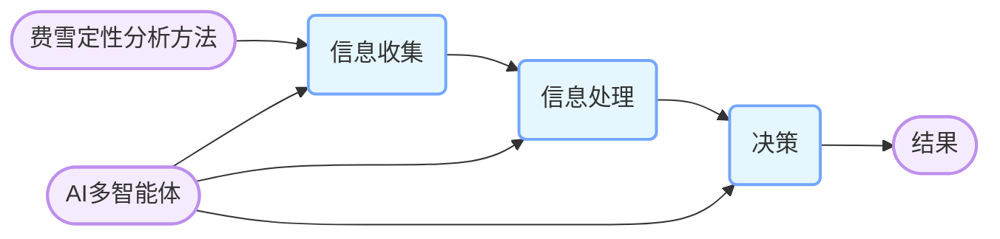

# AI多智能体如何优化费雪的定性分析方法

> 关键词：AI多智能体、费雪定性分析方法、优化策略、信息处理、决策模型

> 摘要：本文聚焦于探讨AI多智能体对费雪定性分析方法的优化。首先介绍费雪定性分析方法的背景与局限性，接着阐述AI多智能体的概念和特性。详细分析AI多智能体在信息收集、处理和决策等方面如何改进费雪定性分析方法，包括利用多智能体的分布式计算、并行处理和智能交互等优势。通过数学模型和实际案例说明优化效果，最后展望该领域的未来发展趋势与挑战。旨在为相关领域的研究者和实践者提供理论和实践参考，推动定性分析方法的创新和应用。

## 1. 背景介绍 
### 1.1 目的和范围
费雪的定性分析方法在经济、金融等多个领域有着广泛的应用，它为研究者和决策者提供了一种基于经验和主观判断的分析框架。然而，随着数据量的爆炸式增长和问题复杂度的不断提高，传统的费雪定性分析方法逐渐暴露出一些局限性。本文章的目的在于研究如何利用AI多智能体技术来优化费雪的定性分析方法，以提高分析的准确性、效率和全面性。文章的范围涵盖了AI多智能体和费雪定性分析方法的基本概念、两者结合的原理和具体实现方式，以及实际应用案例和未来发展趋势。

### 1.2 预期读者
本文预期读者包括经济、金融、管理等领域的研究者和从业者，他们对定性分析方法的改进和创新感兴趣，希望借助先进的技术手段提高分析的质量和效果。同时，计算机科学领域中从事人工智能、多智能体系统研究的学者和工程师也可以从本文中获得跨领域应用的启示。

### 1.3 文档结构概述
本文首先介绍相关的背景知识，包括核心术语的定义和相关概念的解释。接着阐述AI多智能体和费雪定性分析方法的核心概念以及它们之间的联系，并通过示意图和流程图进行直观展示。然后详细讲解利用AI多智能体优化费雪定性分析方法的核心算法原理和具体操作步骤，同时给出相应的数学模型和公式，并举例说明。在项目实战部分，提供代码实际案例和详细的解释说明。之后介绍该优化方法的实际应用场景。再推荐相关的学习资源、开发工具框架和论文著作。最后总结未来发展趋势与挑战，并提供常见问题与解答以及扩展阅读和参考资料。

### 1.4 术语表
#### 1.4.1 核心术语定义
- **AI多智能体**：是由多个智能体组成的系统，每个智能体具有一定的自主决策能力和学习能力，能够感知环境并与其他智能体进行交互，以实现共同的目标。
- **费雪定性分析方法**：是由美国经济学家欧文·费雪提出的一种基于定性因素的分析方法，主要用于评估经济、金融等领域的现象和问题，通过对各种因素的主观判断和综合分析得出结论。
- **优化**：在本文章中，指通过引入AI多智能体技术，改进费雪定性分析方法的性能，包括提高分析的准确性、效率和全面性等方面。

#### 1.4.2 相关概念解释
- **分布式计算**：是一种计算方式，将计算任务分配到多个计算节点上同时进行处理，以提高计算效率和处理能力。AI多智能体系统可以利用分布式计算的原理，让各个智能体并行处理信息，从而加快分析过程。
- **智能交互**：智能体之间通过某种通信机制进行信息交换和协作的过程。在AI多智能体系统中，智能交互可以帮助智能体共享知识、协调行动，提高整体的决策能力。
- **定性分析**：是一种基于非量化信息的分析方法，主要依靠研究者的经验、判断和直觉来评估和解释现象。费雪定性分析方法就是一种典型的定性分析方法。

#### 1.4.3 缩略词列表
- **AI**：Artificial Intelligence，人工智能
- **MAS**：Multi-Agent System，多智能体系统

## 2. 核心概念与联系 

### 2.1 AI多智能体的核心概念
AI多智能体系统由多个智能体组成，每个智能体可以看作是一个具有自主决策能力的个体。智能体通常具有以下几个特点：
- **自主性**：能够在一定程度上独立地感知环境、做出决策和执行行动，不需要外部的直接干预。
- **社会性**：可以与其他智能体进行交互和协作，通过信息共享和协调行动来实现共同的目标。
- **反应性**：能够对环境的变化做出及时的反应，调整自己的行为以适应新的情况。
- **主动性**：不仅仅是被动地对环境做出反应，还能够主动地寻找机会和资源，采取行动来实现自己的目标。

AI多智能体系统的架构可以分为集中式、分布式和混合式三种类型。集中式架构中，有一个中央控制节点负责协调和管理所有智能体的行为；分布式架构中，智能体之间通过平等的通信和协作来完成任务；混合式架构则结合了集中式和分布式的特点。

### 2.2 费雪定性分析方法的核心概念
费雪定性分析方法主要关注影响经济、金融等现象的各种定性因素，如市场趋势、政策环境、企业竞争力等。该方法通过对这些因素进行详细的分析和评估，得出对现象的综合判断。费雪定性分析方法的一般步骤包括：
- **确定分析目标**：明确要分析的问题和期望达到的结果。
- **收集相关信息**：收集与分析目标相关的各种定性信息，如行业报告、专家意见、企业新闻等。
- **因素识别和分类**：识别影响分析目标的各种因素，并将它们进行分类，如分为有利因素和不利因素。
- **因素评估**：对每个因素的重要性和影响程度进行主观评估。
- **综合分析和结论**：综合考虑所有因素的评估结果，得出对分析目标的最终结论。

### 2.3 两者的联系
AI多智能体可以在多个方面对费雪定性分析方法进行优化。首先，在信息收集阶段，AI多智能体可以利用其分布式和并行处理的能力，同时从多个数据源收集信息，提高信息收集的效率和全面性。其次，在信息处理阶段，智能体可以通过智能交互和协作，对收集到的信息进行深入分析和挖掘，发现潜在的关系和模式，从而提高分析的准确性。最后，在决策阶段，多智能体系统可以综合考虑多个智能体的意见和建议，做出更加科学和合理的决策。

### 2.4 文本示意图
```plaintext
            +-------------------+
            | 费雪定性分析方法 |
            +-------------------+
                    |
                    | 信息收集困难、处理效率低、决策主观性强等问题
                    v
            +-------------------+
            | AI多智能体优化   |
            +-------------------+
            | 分布式信息收集    |
            | 智能信息处理      |
            | 多智能体决策      |
            +-------------------+
```

### 2.5 Mermaid流程图


## 3. 核心算法原理 & 具体操作步骤 

### 3.1 核心算法原理
利用AI多智能体优化费雪定性分析方法的核心算法主要基于以下几个方面：
- **分布式信息收集算法**：AI多智能体系统可以将信息收集任务分配到多个智能体上，每个智能体负责从不同的数据源收集信息。智能体可以使用网络爬虫、数据接口等技术来获取信息。为了避免信息的重复收集和冲突，需要设计合理的任务分配和协调算法。例如，可以采用基于任务优先级和资源利用率的分配算法，根据每个智能体的能力和负载情况，将不同的信息收集任务分配给合适的智能体。
- **智能信息处理算法**：收集到的信息可能是杂乱无章的，需要进行清洗、整理和分析。智能体可以使用自然语言处理、机器学习等技术对信息进行处理。例如，使用文本分类算法对信息进行分类，使用情感分析算法评估信息的情感倾向。智能体之间可以通过智能交互共享处理结果，进一步挖掘信息中的潜在价值。
- **多智能体决策算法**：在决策阶段，多个智能体可以根据自己的分析结果和经验，提出各自的建议。然后，通过一定的决策机制综合考虑这些建议，做出最终的决策。常见的决策机制包括投票机制、协商机制等。例如，在投票机制中，每个智能体对不同的决策方案进行投票，得票最多的方案即为最终决策。

### 3.2 具体操作步骤

#### 3.2.1 信息收集阶段
```python
import requests
from bs4 import BeautifulSoup
import threading

# 定义智能体类
class Agent:
    def __init__(self, url):
        self.url = url
        self.data = []

    def collect_info(self):
        try:
            response = requests.get(self.url)
            soup = BeautifulSoup(response.text, 'html.parser')
            # 这里简单假设我们提取所有的文本信息
            info = soup.get_text()
            self.data.append(info)
        except Exception as e:
            print(f"Error collecting info from {self.url}: {e}")

# 定义多个智能体
urls = ['https://example.com/page1', 'https://example.com/page2', 'https://example.com/page3']
agents = [Agent(url) for url in urls]

# 启动多线程进行信息收集
threads = []
for agent in agents:
    thread = threading.Thread(target=agent.collect_info)
    threads.append(thread)
    thread.start()

# 等待所有线程完成
for thread in threads:
    thread.join()

# 汇总信息
all_info = []
for agent in agents:
    all_info.extend(agent.data)

print(all_info)
```
在上述代码中，我们定义了一个`Agent`类，每个智能体负责从一个特定的URL收集信息。使用多线程技术可以实现并行的信息收集，提高收集效率。最后将所有智能体收集到的信息汇总。

#### 3.2.2 信息处理阶段
```python
import nltk
from nltk.corpus import stopwords
from sklearn.feature_extraction.text import TfidfVectorizer
from sklearn.cluster import KMeans

nltk.download('stopwords')
stop_words = set(stopwords.words('english'))

# 文本预处理
def preprocess_text(text):
    # 分词
    tokens = nltk.word_tokenize(text.lower())
    # 去除停用词
    filtered_tokens = [token for token in tokens if token.isalpha() and token not in stop_words]
    return " ".join(filtered_tokens)

preprocessed_info = [preprocess_text(info) for info in all_info]

# 使用TF-IDF向量化
vectorizer = TfidfVectorizer()
X = vectorizer.fit_transform(preprocessed_info)

# 使用K-Means聚类
kmeans = KMeans(n_clusters=3)
kmeans.fit(X)

# 输出聚类结果
labels = kmeans.labels_
for i, label in enumerate(labels):
    print(f"Info {i} belongs to cluster {label}")
```
在信息处理阶段，我们首先对收集到的信息进行预处理，包括分词和去除停用词。然后使用TF-IDF向量化将文本信息转换为向量表示。最后使用K-Means聚类算法对信息进行分类，以便更好地理解信息的结构和主题。

#### 3.2.3 决策阶段
```python
import random

# 定义智能体的建议
agent_suggestions = ['Option A', 'Option B', 'Option A', 'Option C', 'Option B']

# 投票机制
vote_count = {}
for suggestion in agent_suggestions:
    if suggestion in vote_count:
        vote_count[suggestion] += 1
    else:
        vote_count[suggestion] = 1

# 找出得票最多的方案
max_votes = 0
final_decision = None
for option, votes in vote_count.items():
    if votes > max_votes:
        max_votes = votes
        final_decision = option

print(f"Final decision: {final_decision}")
```
在决策阶段，我们模拟了多个智能体提出的建议，并使用投票机制来确定最终的决策。统计每个建议的得票数，得票最多的建议即为最终决策。

## 4. 数学模型和公式 & 详细讲解 & 举例说明 

### 4.1 分布式信息收集的数学模型
假设我们有 $n$ 个智能体 $A_1, A_2, \cdots, A_n$，每个智能体负责从一个数据源收集信息。设 $I_i$ 表示智能体 $A_i$ 收集到的信息集合，$S$ 表示所有信息的汇总集合。则有：

$$S = \bigcup_{i=1}^{n} I_i$$

在实际应用中，为了避免信息的重复收集，我们可以定义一个信息重复度指标。设 $|I_i|$ 表示集合 $I_i$ 的元素个数，$|I_i \cap I_j|$ 表示集合 $I_i$ 和 $I_j$ 的交集元素个数。则智能体 $A_i$ 和 $A_j$ 之间的信息重复度 $r_{ij}$ 可以表示为：

$$r_{ij} = \frac{|I_i \cap I_j|}{\min(|I_i|, |I_j|)}$$

例如，假设智能体 $A_1$ 收集到的信息集合 $I_1 = \{a, b, c\}$，智能体 $A_2$ 收集到的信息集合 $I_2 = \{b, c, d\}$。则 $|I_1| = 3$，$|I_2| = 3$，$|I_1 \cap I_2| = 2$。那么 $r_{12} = \frac{2}{3}$。

### 4.2 智能信息处理的数学模型
在文本信息处理中，常用的TF-IDF（Term Frequency-Inverse Document Frequency）模型可以用来衡量一个词在文档中的重要性。设 $tf_{t,d}$ 表示词 $t$ 在文档 $d$ 中出现的频率，$df_t$ 表示包含词 $t$ 的文档数，$N$ 表示文档总数。则词 $t$ 在文档 $d$ 中的TF-IDF值 $tfidf_{t,d}$ 可以表示为：

$$tfidf_{t,d} = tf_{t,d} \times \log(\frac{N}{df_t + 1})$$

例如，假设有一个文档集合包含 100 个文档，词 $t$ 在文档 $d$ 中出现了 5 次，包含词 $t$ 的文档有 10 个。则 $tf_{t,d} = 5$，$df_t = 10$，$N = 100$。那么 $tfidf_{t,d} = 5 \times \log(\frac{100}{10 + 1}) \approx 5 \times 0.954 = 4.77$。

### 4.3 多智能体决策的数学模型
在投票决策机制中，设 $v_i$ 表示第 $i$ 个决策方案获得的票数，$m$ 表示决策方案的总数。则最终决策方案 $D$ 可以表示为：

$$D = \arg\max_{i=1}^{m} v_i$$

例如，假设有三个决策方案 $A$、$B$、$C$，它们获得的票数分别为 $v_A = 5$，$v_B = 3$，$v_C = 2$。则最终决策方案 $D = A$，因为 $\arg\max_{i \in \{A,B,C\}} v_i = A$。

## 5. 项目实战：代码实际案例和详细解释说明 

### 5.1  开发环境搭建
为了实现利用AI多智能体优化费雪定性分析方法的项目，我们需要搭建相应的开发环境。以下是具体的步骤：

#### 5.1.1 安装Python
Python是一种广泛使用的编程语言，具有丰富的库和工具，非常适合进行数据处理和机器学习。可以从Python官方网站（https://www.python.org/downloads/）下载并安装Python 3.x版本。

#### 5.1.2 安装必要的库
我们需要安装一些Python库来支持项目的开发，包括`requests`用于网络请求，`beautifulsoup4`用于网页解析，`nltk`用于自然语言处理，`scikit-learn`用于机器学习等。可以使用以下命令进行安装：
```sh
pip install requests beautifulsoup4 nltk scikit-learn
```

#### 5.1.3 下载NLTK数据
NLTK库需要一些数据文件来支持其功能，如停用词列表等。可以在Python交互式环境中运行以下代码来下载必要的数据：
```python
import nltk
nltk.download('punkt')
nltk.download('stopwords')
```

### 5.2  源代码详细实现和代码解读
以下是一个完整的项目代码示例，包含信息收集、处理和决策三个阶段：

```python
import requests
from bs4 import BeautifulSoup
import threading
import nltk
from nltk.corpus import stopwords
from sklearn.feature_extraction.text import TfidfVectorizer
from sklearn.cluster import KMeans
import random

# 定义智能体类
class Agent:
    def __init__(self, url):
        self.url = url
        self.data = []

    def collect_info(self):
        try:
            response = requests.get(self.url)
            soup = BeautifulSoup(response.text, 'html.parser')
            # 这里简单假设我们提取所有的文本信息
            info = soup.get_text()
            self.data.append(info)
        except Exception as e:
            print(f"Error collecting info from {self.url}: {e}")

# 定义多个智能体
urls = ['https://example.com/page1', 'https://example.com/page2', 'https://example.com/page3']
agents = [Agent(url) for url in urls]

# 启动多线程进行信息收集
threads = []
for agent in agents:
    thread = threading.Thread(target=agent.collect_info)
    threads.append(thread)
    thread.start()

# 等待所有线程完成
for thread in threads:
    thread.join()

# 汇总信息
all_info = []
for agent in agents:
    all_info.extend(agent.data)

# 文本预处理
stop_words = set(stopwords.words('english'))
def preprocess_text(text):
    # 分词
    tokens = nltk.word_tokenize(text.lower())
    # 去除停用词
    filtered_tokens = [token for token in tokens if token.isalpha() and token not in stop_words]
    return " ".join(filtered_tokens)

preprocessed_info = [preprocess_text(info) for info in all_info]

# 使用TF-IDF向量化
vectorizer = TfidfVectorizer()
X = vectorizer.fit_transform(preprocessed_info)

# 使用K-Means聚类
kmeans = KMeans(n_clusters=3)
kmeans.fit(X)

# 输出聚类结果
labels = kmeans.labels_
for i, label in enumerate(labels):
    print(f"Info {i} belongs to cluster {label}")

# 定义智能体的建议
agent_suggestions = ['Option A', 'Option B', 'Option A', 'Option C', 'Option B']

# 投票机制
vote_count = {}
for suggestion in agent_suggestions:
    if suggestion in vote_count:
        vote_count[suggestion] += 1
    else:
        vote_count[suggestion] = 1

# 找出得票最多的方案
max_votes = 0
final_decision = None
for option, votes in vote_count.items():
    if votes > max_votes:
        max_votes = votes
        final_decision = option

print(f"Final decision: {final_decision}")
```

### 5.3  代码解读与分析
- **信息收集阶段**：定义了一个`Agent`类，每个智能体负责从一个特定的URL收集信息。使用多线程技术可以并行地进行信息收集，提高收集效率。最后将所有智能体收集到的信息汇总。
- **信息处理阶段**：对收集到的信息进行预处理，包括分词和去除停用词。然后使用TF-IDF向量化将文本信息转换为向量表示。最后使用K-Means聚类算法对信息进行分类，以便更好地理解信息的结构和主题。
- **决策阶段**：模拟了多个智能体提出的建议，并使用投票机制来确定最终的决策。统计每个建议的得票数，得票最多的建议即为最终决策。

通过这个项目实战，我们可以看到如何利用AI多智能体技术优化费雪定性分析方法，提高分析的效率和准确性。

## 6. 实际应用场景 
### 6.1 金融市场分析
在金融市场中，费雪定性分析方法常用于评估股票、债券等金融产品的投资价值。传统的分析方法主要依靠分析师的经验和主观判断，容易受到个人知识和视野的限制。利用AI多智能体优化后的费雪定性分析方法，可以同时从多个数据源收集信息，如财经新闻、公司公告、行业报告等。智能体可以对这些信息进行实时分析和处理，发现潜在的投资机会和风险。例如，通过对大量公司新闻的情感分析，判断市场对某家公司的预期；通过对行业报告的聚类分析，了解行业的发展趋势。在决策阶段，多个智能体可以根据自己的分析结果提出投资建议，然后通过投票或协商机制确定最终的投资策略。

### 6.2 企业战略规划
企业在制定战略规划时，需要考虑市场环境、竞争对手、技术发展等多个因素。费雪定性分析方法可以帮助企业对这些因素进行综合评估。AI多智能体可以在信息收集方面发挥重要作用，智能体可以分别收集市场数据、竞争对手信息、技术动态等。在信息处理阶段，智能体可以利用机器学习算法对这些信息进行分析，预测市场趋势和竞争对手的策略。在决策阶段，多智能体系统可以根据不同智能体的建议，制定出更加科学和合理的企业战略。例如，通过对市场数据的分析，确定企业的目标市场和产品定位；通过对竞争对手信息的分析，制定差异化的竞争策略。

### 6.3 政策评估和制定
政府在制定和评估政策时，需要考虑政策的可行性、影响范围和社会效果等因素。费雪定性分析方法可以用于对政策进行定性评估。AI多智能体可以从不同的利益相关者那里收集信息，如企业、居民、专家等。智能体可以对这些信息进行分析，了解各方对政策的看法和需求。在决策阶段，多智能体系统可以综合考虑各方的意见，制定出更加符合社会利益的政策。例如，在制定环保政策时，智能体可以收集企业的环保成本和技术能力信息，居民的环保意识和需求信息，专家的建议等，然后通过多智能体决策机制确定最优的政策方案。

## 7. 工具和资源推荐
### 7.1 学习资源推荐
#### 7.1.1 书籍推荐
- 《人工智能：一种现代的方法》（Artificial Intelligence: A Modern Approach）：这是一本经典的人工智能教材，涵盖了人工智能的各个方面，包括多智能体系统。书中详细介绍了多智能体的概念、算法和应用，适合初学者和有一定基础的研究者阅读。
- 《Python机器学习》（Python Machine Learning）：这本书主要介绍了如何使用Python进行机器学习。书中包含了大量的代码示例和实际案例，对于学习利用Python实现AI多智能体和信息处理非常有帮助。
- 《定性研究方法》：这本书系统地介绍了定性分析方法的理论和实践，包括费雪定性分析方法。通过阅读这本书，可以深入了解定性分析的基本原理和操作步骤。

#### 7.1.2 在线课程
- Coursera上的“人工智能基础”（Fundamentals of Artificial Intelligence）课程：该课程由知名大学的教授授课，内容涵盖了人工智能的基本概念、算法和应用。其中也包括多智能体系统的相关内容，通过在线视频、作业和讨论等方式进行学习。
- edX上的“Python数据科学入门”（Introduction to Data Science in Python）课程：该课程主要介绍了如何使用Python进行数据处理和分析。课程中包含了自然语言处理、机器学习等方面的内容，对于学习AI多智能体的信息处理部分非常有用。
- 中国大学MOOC上的“定性研究方法与应用”课程：该课程由国内高校的教师授课，详细讲解了定性研究的方法和应用，对于理解费雪定性分析方法有很大的帮助。

#### 7.1.3 技术博客和网站
- Medium上的人工智能相关博客：Medium上有很多人工智能领域的专家和从业者分享他们的经验和见解。可以关注一些与多智能体系统、定性分析方法相关的博客，了解最新的技术动态和研究成果。
- arXiv.org：这是一个开放的学术预印本平台，上面有很多关于人工智能、机器学习等领域的最新研究论文。可以在上面搜索与AI多智能体和费雪定性分析方法相关的论文，了解前沿的研究进展。
- 开源中国（OSChina）：这是一个国内知名的开源技术社区，上面有很多关于Python、机器学习等方面的技术文章和代码示例。可以在上面学习和交流相关的技术知识。

### 7.2 开发工具框架推荐
#### 7.2.1 IDE和编辑器
- PyCharm：这是一款专门为Python开发设计的集成开发环境（IDE），具有代码编辑、调试、版本控制等功能。PyCharm提供了丰富的插件和工具，可以提高开发效率。
- Jupyter Notebook：这是一个基于网页的交互式开发环境，适合进行数据分析和机器学习实验。可以在Jupyter Notebook中编写代码、运行代码块、展示结果和可视化数据，非常方便。
- Visual Studio Code：这是一款轻量级的代码编辑器，支持多种编程语言，包括Python。Visual Studio Code具有丰富的插件生态系统，可以根据需要安装各种插件来扩展功能。

#### 7.2.2 调试和性能分析工具
- PDB：这是Python自带的调试工具，可以在代码中设置断点，逐行执行代码，查看变量的值和程序的执行流程。PDB对于调试Python代码非常有用。
- cProfile：这是Python的性能分析工具，可以分析代码的运行时间和函数调用次数。通过使用cProfile，可以找出代码中的性能瓶颈，进行优化。
- TensorBoard：这是TensorFlow提供的可视化工具，可以用于可视化深度学习模型的训练过程和结果。虽然在本项目中不一定会用到深度学习模型，但TensorBoard的可视化功能对于分析数据和模型的性能有一定的帮助。

#### 7.2.3 相关框架和库
- Mesa：这是一个用于构建多智能体系统的Python框架，提供了丰富的工具和接口，方便开发者创建和模拟多智能体系统。
- NLTK：这是一个自然语言处理工具包，包含了大量的语料库和工具，如分词、词性标注、情感分析等。NLTK对于处理文本信息非常有用。
- Scikit-learn：这是一个机器学习库，提供了各种机器学习算法和工具，如分类、聚类、回归等。Scikit-learn对于实现智能信息处理和决策模型非常有帮助。

### 7.3 相关论文著作推荐
#### 7.3.1 经典论文
- “Multiagent Systems: A Modern Approach to Distributed Artificial Intelligence”：这篇论文是多智能体系统领域的经典之作，系统地介绍了多智能体系统的概念、理论和应用。
- “A Quantitative Approach to Qualitative Modeling”：该论文探讨了如何将定量方法应用于定性建模，对于理解费雪定性分析方法的改进有一定的启示。
- “Agent-Based Modeling and Simulation: A Tutorial”：这篇论文详细介绍了基于智能体的建模和仿真方法，对于学习如何使用多智能体系统进行模拟和分析非常有帮助。

#### 7.3.2 最新研究成果
- 可以关注顶级学术会议如AAAI（Association for the Advancement of Artificial Intelligence）、IJCAI（International Joint Conference on Artificial Intelligence）等的会议论文，了解AI多智能体和定性分析方法的最新研究成果。
- 一些知名学术期刊如Artificial Intelligence、Journal of Artificial Intelligence Research等也会发表相关的高质量研究论文。

#### 7.3.3 应用案例分析
- 可以查找一些关于金融市场分析、企业战略规划、政策评估等领域应用AI多智能体和定性分析方法的案例研究。这些案例可以帮助我们更好地理解如何将理论应用于实际问题，学习实际应用中的经验和技巧。

## 8. 总结：未来发展趋势与挑战
### 8.1 未来发展趋势
- **与深度学习的融合**：深度学习在图像识别、语音识别等领域取得了巨大的成功。未来，AI多智能体可以与深度学习技术相结合，进一步提高信息处理和决策的能力。例如，使用深度学习模型对文本信息进行更深入的理解和分析，利用强化学习算法优化多智能体的决策策略。
- **跨领域应用的拓展**：目前AI多智能体优化费雪定性分析方法主要应用于金融、企业管理等领域。未来，该方法有望拓展到更多的领域，如医疗、教育、交通等。在医疗领域，可以利用多智能体系统对患者的病历和症状进行分析，辅助医生进行诊断和治疗决策；在教育领域，可以根据学生的学习情况和反馈，制定个性化的学习方案。
- **智能体的自主进化**：随着技术的发展，智能体将具备更强的自主学习和进化能力。智能体可以根据环境的变化和自身的经验，不断调整自己的行为和策略，提高自身的性能和适应性。例如，智能体可以通过强化学习算法不断优化自己的信息收集和处理策略，以更好地适应不同的分析任务。

### 8.2 挑战
- **信息安全和隐私问题**：在信息收集和处理过程中，需要处理大量的敏感信息，如用户的个人信息、企业的商业机密等。如何保障这些信息的安全和隐私是一个重要的挑战。需要采用加密技术、访问控制等手段来保护信息的安全。
- **智能体的协作和协调**：在多智能体系统中，智能体之间的协作和协调是一个关键问题。不同的智能体可能具有不同的目标和利益，如何让它们有效地协作和协调，避免冲突和矛盾，是一个需要解决的难题。可以采用博弈论、合同网协议等方法来实现智能体之间的协作和协调。
- **模型的可解释性**：随着模型的复杂度不断提高，如深度学习模型，模型的可解释性变得越来越重要。在使用AI多智能体优化费雪定性分析方法时，需要让决策者能够理解模型的决策过程和依据。如何提高模型的可解释性是一个亟待解决的问题。可以采用可视化技术、特征重要性分析等方法来提高模型的可解释性。

## 9. 附录：常见问题与解答
### 9.1 AI多智能体系统的开发难度大吗？
AI多智能体系统的开发难度取决于系统的复杂度和应用场景。对于简单的多智能体系统，使用现有的框架和工具可以相对容易地进行开发。例如，使用Mesa框架可以快速搭建一个基本的多智能体系统。但对于复杂的系统，如需要处理大量数据、进行复杂的决策和协作的系统，开发难度会相对较大。需要具备一定的人工智能、机器学习和编程知识。

### 9.2 如何选择合适的信息收集数据源？
选择合适的信息收集数据源需要考虑多个因素。首先，要根据分析的目标和需求选择相关的数据源。例如，如果是进行金融市场分析，可以选择财经新闻网站、证券交易所公告等数据源。其次，要考虑数据源的可靠性和权威性。尽量选择来自官方机构、知名媒体等可靠的数据源。最后，要考虑数据源的更新频率和数据质量。选择更新及时、数据准确的数据源。

### 9.3 多智能体决策机制有哪些优缺点？
多智能体决策机制的优点包括：可以综合考虑多个智能体的意见和建议，提高决策的科学性和合理性；可以充分利用多个智能体的知识和经验，避免单个决策者的局限性；可以通过智能体之间的协作和竞争，激发创新思维。缺点包括：决策过程可能比较复杂，需要花费更多的时间和资源；智能体之间可能存在利益冲突和矛盾，需要进行有效的协调和管理；决策结果可能受到智能体的数量、质量和分布等因素的影响。

### 9.4 如何评估AI多智能体优化费雪定性分析方法的效果？
可以从多个方面评估AI多智能体优化费雪定性分析方法的效果。在信息收集方面，可以评估信息的全面性、准确性和及时性。在信息处理方面，可以评估信息的分类准确性、特征提取效果等。在决策方面，可以评估决策的正确性、合理性和稳定性。可以通过与传统的费雪定性分析方法进行对比实验，或者使用实际案例进行验证和评估。

## 10. 扩展阅读 & 参考资料
### 10.1 扩展阅读
- 《复杂适应系统：社会生活计算模型引论》（Complex Adaptive Systems: An Introduction to Computational Models of Social Life）：这本书介绍了复杂适应系统的概念和理论，对于理解多智能体系统的行为和演化有很大的帮助。
- 《大数据时代：生活、工作与思维的大变革》（Big Data: A Revolution That Will Transform How We Live, Work, and Think）：该书探讨了大数据时代的挑战和机遇，对于理解如何利用大数据进行定性分析有一定的启示。
- 《决策与判断》（Judgment in Managerial Decision Making）：这本书介绍了决策的理论和方法，对于学习多智能体决策机制有一定的参考价值。

### 10.2 参考资料
- 欧文·费雪的相关著作和论文，如《利息理论》（The Theory of Interest）等，这些资料可以帮助我们深入了解费雪定性分析方法的原始思想和理论基础。
- 相关的学术研究论文和报告，如关于AI多智能体系统、自然语言处理、机器学习等领域的研究成果，可以为我们提供技术支持和理论依据。
- 在线文档和教程，如Python库的官方文档、开源框架的使用教程等，可以帮助我们更好地掌握开发工具和技术。

作者：AI天才研究院/AI Genius Institute & 禅与计算机程序设计艺术 /Zen And The Art of Computer Programming