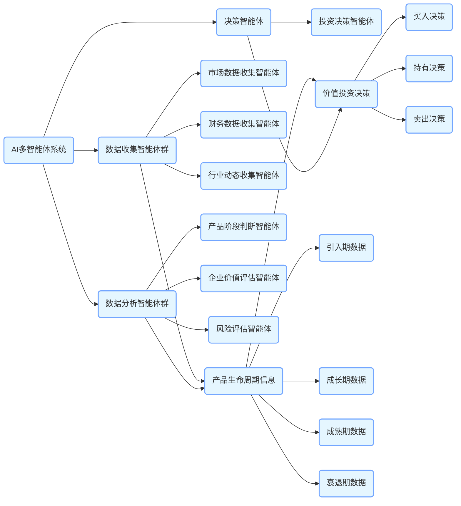

# AI多智能体系统在价值投资中的产品生命周期分析

> 关键词：AI多智能体系统、价值投资、产品生命周期分析、金融科技、投资决策

> 摘要：本文聚焦于AI多智能体系统在价值投资领域针对产品生命周期进行分析的应用。首先介绍了相关背景，包括目的、预期读者等内容。接着详细阐述了核心概念，构建了相应的架构示意图和流程图。深入讲解了核心算法原理，并给出Python源代码示例。通过数学模型和公式进一步剖析原理，并举例说明。以项目实战案例展示了具体的代码实现和解读。探讨了该技术在实际价值投资中的应用场景，推荐了相关的学习资源、开发工具框架以及论文著作。最后总结了未来发展趋势与挑战，提供了常见问题解答和扩展阅读参考资料，旨在为价值投资者和相关研究人员提供全面深入的技术参考。

## 1. 背景介绍 
### 1.1 目的和范围
在当今复杂多变的金融市场中，价值投资需要精准的分析和决策。产品生命周期对企业的业绩和市场价值有着深远影响，准确把握产品生命周期各阶段的特点对于价值投资者至关重要。AI多智能体系统作为一种先进的技术手段，能够模拟多个智能体之间的交互和协作，对产品生命周期进行动态、全面的分析。本文的目的就是深入探讨AI多智能体系统在价值投资中产品生命周期分析的应用，范围涵盖核心概念、算法原理、数学模型、实际案例以及未来发展等方面。

### 1.2 预期读者
本文预期读者包括价值投资者、金融分析师、人工智能研究人员、金融科技开发者以及对金融与人工智能交叉领域感兴趣的学者和学生。价值投资者可以从中获取新的分析思路和工具，以优化投资决策；金融分析师能够提升对产品生命周期的评估能力；人工智能研究人员可探索新的应用场景；金融科技开发者可以借鉴相关技术实现产品创新；学者和学生则能拓宽知识面和研究视野。

### 1.3 文档结构概述
本文将按照以下结构展开：首先介绍核心概念与联系，包括AI多智能体系统和产品生命周期的相关定义、原理以及它们之间的关系，并通过示意图和流程图进行直观展示。接着详细阐述核心算法原理和具体操作步骤，使用Python代码进行说明。然后给出数学模型和公式，并举例解释。通过项目实战部分，展示代码实际案例并进行详细解读。探讨实际应用场景，推荐相关的工具和资源。最后总结未来发展趋势与挑战，提供常见问题解答和扩展阅读参考资料。

### 1.4 术语表
#### 1.4.1 核心术语定义
- **AI多智能体系统（AI Multi - Agent System）**：由多个智能体组成的系统，每个智能体具有一定的自主性和智能，能够感知环境、进行决策并与其他智能体进行交互，共同完成特定的任务。
- **价值投资（Value Investing）**：一种投资策略，投资者通过分析公司的内在价值，寻找被低估的股票或资产进行投资，以期在长期获得超过市场平均水平的回报。
- **产品生命周期（Product Life Cycle）**：产品从投入市场到被市场淘汰的整个过程，通常包括引入期、成长期、成熟期和衰退期四个阶段。

#### 1.4.2 相关概念解释
- **智能体（Agent）**：在AI多智能体系统中，智能体是具有自主决策和行动能力的实体，可以是软件程序、机器人等。智能体能够根据自身的目标和感知到的环境信息，做出相应的决策和行动。
- **内在价值（Intrinsic Value）**：公司或资产的真实价值，基于其基本面因素，如财务状况、盈利能力、市场竞争力等进行评估。

#### 1.4.3 缩略词列表
- **AI**：Artificial Intelligence（人工智能）
- **MAS**：Multi - Agent System（多智能体系统）

## 2. 核心概念与联系 

### 核心概念原理
#### AI多智能体系统原理
AI多智能体系统的核心在于多个智能体之间的交互和协作。每个智能体具有自己的知识、目标和行为规则，它们通过感知环境获取信息，并根据自身的决策机制做出行动。智能体之间可以通过通信机制进行信息交换和协调，以实现共同的目标。例如，在一个股票投资分析的多智能体系统中，可能有负责收集市场数据的智能体、负责分析财务报表的智能体和负责做出投资决策的智能体。这些智能体相互协作，共同完成对股票投资价值的评估。

#### 产品生命周期原理
产品生命周期反映了产品在市场中的发展过程。在引入期，产品刚刚进入市场，销售量较低，需要大量的市场推广和研发投入；成长期，产品逐渐被市场接受，销售量快速增长，利润也开始增加；成熟期，市场需求趋于饱和，销售量增长缓慢，竞争加剧；衰退期，产品逐渐被新产品替代，销售量和利润下降。了解产品生命周期的各个阶段对于企业制定营销策略、投资者评估企业价值具有重要意义。

### 核心概念联系
AI多智能体系统可以在价值投资中对产品生命周期进行分析。不同的智能体可以负责收集和分析与产品生命周期相关的各种信息，如市场数据、财务报表、行业动态等。通过智能体之间的协作和信息共享，可以更准确地判断产品所处的生命周期阶段，从而为价值投资决策提供依据。例如，负责市场数据收集的智能体可以获取产品的销售量、市场份额等信息，负责财务分析的智能体可以评估企业在不同阶段的盈利能力和成本结构，最终由决策智能体根据这些信息判断产品的投资价值。

### 架构的文本示意图
```plaintext
AI多智能体系统在价值投资中产品生命周期分析架构

                ┌─────────────────────────────┐
                │      AI多智能体系统      │
                ├─────────────────────────────┤
                │  数据收集智能体群         │
                │ ┌─────────────────────┐    │
                │ │市场数据收集智能体 │    │
                │ │财务数据收集智能体 │    │
                │ │行业动态收集智能体 │    │
                │ └─────────────────────┘    │
                │  数据分析智能体群         │
                │ ┌─────────────────────┐    │
                │ │产品阶段判断智能体 │    │
                │ │企业价值评估智能体 │    │
                │ │风险评估智能体     │    │
                │ └─────────────────────┘    │
                │  决策智能体               │
                │ ┌─────────────────────┐    │
                │ │投资决策智能体     │    │
                │ └─────────────────────┘    │
                └─────────────────────────────┘
                          │
                          ▼
                ┌─────────────────────────────┐
                │      产品生命周期信息      │
                │ ┌─────────────────────┐    │
                │ │引入期数据             │    │
                │ │成长期数据             │    │
                │ │成熟期数据             │    │
                │ │衰退期数据             │    │
                │ └─────────────────────┘    │
                └─────────────────────────────┘
                          │
                          ▼
                ┌─────────────────────────────┐
                │      价值投资决策          │
                │ ┌─────────────────────┐    │
                │ │买入决策             │    │
                │ │持有决策             │    │
                │ │卖出决策             │    │
                │ └─────────────────────┘    │
                └─────────────────────────────┘
```

### Mermaid流程图


## 3. 核心算法原理 & 具体操作步骤 

### 核心算法原理
#### 产品阶段判断算法
可以使用机器学习中的分类算法，如决策树算法。决策树算法通过对历史产品生命周期数据进行学习，构建决策树模型。决策树的每个内部节点是一个属性上的测试，每个分支是一个测试输出，每个叶节点是一个类别或值。在判断产品所处阶段时，将产品的相关特征（如销售量增长率、利润率等）输入到决策树模型中，模型会根据决策树的规则输出产品所处的生命周期阶段。

#### 企业价值评估算法
可以采用现金流折现法（DCF）。DCF法的核心思想是将企业未来的现金流折现到当前时刻，以评估企业的内在价值。其基本公式为：

$$V = \sum_{t = 1}^{n} \frac{CF_t}{(1 + r)^t}$$

其中，$V$ 是企业的内在价值，$CF_t$ 是第 $t$ 期的现金流，$r$ 是折现率，$n$ 是预测期数。

### 具体操作步骤
#### 数据收集
使用数据收集智能体收集产品的市场数据（如销售量、市场份额）、财务数据（如营业收入、利润）和行业动态（如行业增长率、竞争态势）等信息。

#### 数据预处理
对收集到的数据进行清洗、转换和归一化处理，以提高数据质量和算法的准确性。例如，去除缺失值、异常值，将数据转换为适合算法输入的格式。

#### 模型训练
使用历史数据对产品阶段判断模型和企业价值评估模型进行训练。对于决策树模型，可以使用Python中的`scikit - learn`库进行训练；对于DCF模型，需要根据历史财务数据预测未来现金流和确定折现率。

#### 产品阶段判断和企业价值评估
将待分析产品的相关数据输入到训练好的模型中，得到产品所处的生命周期阶段和企业的内在价值。

#### 投资决策
决策智能体根据产品阶段和企业价值评估结果，结合投资目标和风险偏好，做出投资决策（买入、持有或卖出）。

### Python源代码示例
```python
import pandas as pd
from sklearn.tree import DecisionTreeClassifier
from sklearn.model_selection import train_test_split
from sklearn.preprocessing import StandardScaler

# 数据收集和预处理
def data_preprocessing():
    # 假设数据存储在CSV文件中
    data = pd.read_csv('product_lifecycle_data.csv')
    X = data.drop('stage', axis=1)
    y = data['stage']
    X_train, X_test, y_train, y_test = train_test_split(X, y, test_size=0.2, random_state=42)
    scaler = StandardScaler()
    X_train = scaler.fit_transform(X_train)
    X_test = scaler.transform(X_test)
    return X_train, X_test, y_train, y_test

# 产品阶段判断模型训练
def train_product_stage_model(X_train, y_train):
    model = DecisionTreeClassifier()
    model.fit(X_train, y_train)
    return model

# 产品阶段判断
def predict_product_stage(model, X_test):
    y_pred = model.predict(X_test)
    return y_pred

# 主函数
if __name__ == "__main__":
    X_train, X_test, y_train, y_test = data_preprocessing()
    model = train_product_stage_model(X_train, y_train)
    y_pred = predict_product_stage(model, X_test)
    print("产品阶段预测结果:", y_pred)
```

## 4. 数学模型和公式 & 详细讲解 & 举例说明 

### 产品阶段判断模型
#### 信息熵和基尼不纯度
在决策树算法中，常用信息熵（Entropy）和基尼不纯度（Gini Impurity）来衡量数据集的纯度。

信息熵的计算公式为：

$$H(S) = - \sum_{i = 1}^{n} p_i \log_2 p_i$$

其中，$S$ 是数据集，$p_i$ 是数据集中第 $i$ 类样本的比例，$n$ 是类别数。

基尼不纯度的计算公式为：

$$Gini(S) = 1 - \sum_{i = 1}^{n} p_i^2$$

信息熵和基尼不纯度的值越小，数据集的纯度越高。决策树算法通过选择使划分后子数据集的信息熵或基尼不纯度最小的属性进行划分。

#### 举例说明
假设有一个包含10个样本的数据集，分为两类：A类和B类，其中A类有6个样本，B类有4个样本。

信息熵计算：
$p_A=\frac{6}{10}=0.6$，$p_B=\frac{4}{10}=0.4$

$$H(S)=- (0.6 \log_2 0.6 + 0.4 \log_2 0.4) \approx 0.971$$

基尼不纯度计算：
$$Gini(S)=1-(0.6^2 + 0.4^2)=1 - (0.36 + 0.16)=0.48$$

### 企业价值评估模型
#### 现金流折现法（DCF）
如前文所述，DCF法的基本公式为：

$$V = \sum_{t = 1}^{n} \frac{CF_t}{(1 + r)^t}$$

其中，$V$ 是企业的内在价值，$CF_t$ 是第 $t$ 期的现金流，$r$ 是折现率，$n$ 是预测期数。

#### 详细讲解
现金流 $CF_t$ 可以根据企业的历史财务数据和行业发展趋势进行预测。折现率 $r$ 反映了投资者对资金时间价值和投资风险的要求，通常可以使用加权平均资本成本（WACC）来确定。

#### 举例说明
假设一家企业未来3年的现金流分别为 $CF_1 = 100$ 万元，$CF_2 = 120$ 万元，$CF_3 = 150$ 万元，折现率 $r = 10\%$。

则企业的内在价值为：

$$V=\frac{100}{(1 + 0.1)^1}+\frac{120}{(1 + 0.1)^2}+\frac{150}{(1 + 0.1)^3}$$

$$V=\frac{100}{1.1}+\frac{120}{1.21}+\frac{150}{1.331}$$

$$V\approx90.91 + 99.17+112.69 = 302.77$$（万元）

## 5. 项目实战：代码实际案例和详细解释说明 

### 5.1  开发环境搭建
#### 操作系统
可以选择Windows、Linux或macOS操作系统。这里以Windows 10为例进行说明。

#### 编程语言和库
使用Python 3.8及以上版本，需要安装以下库：
- `pandas`：用于数据处理和分析。
- `scikit - learn`：用于机器学习模型的训练和评估。
- `numpy`：用于数值计算。

可以使用`pip`命令进行安装：
```sh
pip install pandas scikit-learn numpy
```

#### 代码编辑器
推荐使用Visual Studio Code或PyCharm，它们具有丰富的插件和良好的代码编辑体验。

### 5.2  源代码详细实现和代码解读
```python
import pandas as pd
from sklearn.tree import DecisionTreeClassifier
from sklearn.model_selection import train_test_split
from sklearn.preprocessing import StandardScaler
from sklearn.metrics import accuracy_score

# 数据收集和预处理
def data_preprocessing():
    # 读取CSV文件
    data = pd.read_csv('product_lifecycle_data.csv')
    # 分离特征和标签
    X = data.drop('stage', axis=1)
    y = data['stage']
    # 划分训练集和测试集
    X_train, X_test, y_train, y_test = train_test_split(X, y, test_size=0.2, random_state=42)
    # 数据标准化
    scaler = StandardScaler()
    X_train = scaler.fit_transform(X_train)
    X_test = scaler.transform(X_test)
    return X_train, X_test, y_train, y_test

# 产品阶段判断模型训练
def train_product_stage_model(X_train, y_train):
    # 创建决策树分类器
    model = DecisionTreeClassifier()
    # 模型训练
    model.fit(X_train, y_train)
    return model

# 产品阶段判断
def predict_product_stage(model, X_test):
    # 模型预测
    y_pred = model.predict(X_test)
    return y_pred

# 模型评估
def evaluate_model(y_test, y_pred):
    # 计算准确率
    accuracy = accuracy_score(y_test, y_pred)
    print("模型准确率:", accuracy)

# 主函数
if __name__ == "__main__":
    # 数据预处理
    X_train, X_test, y_train, y_test = data_preprocessing()
    # 模型训练
    model = train_product_stage_model(X_train, y_train)
    # 模型预测
    y_pred = predict_product_stage(model, X_test)
    # 模型评估
    evaluate_model(y_test, y_pred)
```

### 5.3  代码解读与分析
#### 数据收集和预处理
`data_preprocessing`函数负责读取CSV文件中的数据，并进行特征和标签的分离。使用`train_test_split`函数将数据划分为训练集和测试集，比例为8:2。使用`StandardScaler`对数据进行标准化处理，使数据具有相同的尺度，提高模型的训练效果。

#### 产品阶段判断模型训练
`train_product_stage_model`函数创建一个决策树分类器，并使用训练集数据进行训练。

#### 产品阶段判断
`predict_product_stage`函数使用训练好的模型对测试集数据进行预测，得到产品阶段的预测结果。

#### 模型评估
`evaluate_model`函数使用`accuracy_score`函数计算模型的准确率，评估模型的性能。

通过以上代码，我们可以实现对产品生命周期阶段的预测，并评估模型的准确性。

## 6. 实际应用场景 
### 股票投资
价值投资者可以使用AI多智能体系统分析上市公司产品的生命周期，判断公司所处的发展阶段。在产品成长期，公司的业绩通常会快速增长，此时可以考虑买入该公司的股票；在成熟期，公司的业绩相对稳定，可以根据市场情况决定是否持有；在衰退期，公司的业绩可能会下滑，此时可以考虑卖出股票。

### 风险投资
风险投资机构在评估创业项目时，可以利用AI多智能体系统分析项目产品的生命周期。对于处于引入期但具有高潜力的产品，可以进行早期投资；对于处于成长期的产品，可以进一步追加投资，以获取更高的回报。

### 企业战略决策
企业管理者可以使用AI多智能体系统分析自身产品的生命周期，制定相应的战略。在引入期，加大市场推广和研发投入；在成长期，扩大生产规模，提高市场份额；在成熟期，优化产品和成本结构，提高竞争力；在衰退期，考虑推出新产品或进行业务转型。

## 7. 工具和资源推荐
### 7.1 学习资源推荐
#### 7.1.1 书籍推荐
- 《人工智能：一种现代的方法》：全面介绍了人工智能的基本概念、算法和应用，是人工智能领域的经典教材。
- 《Python机器学习》：详细讲解了使用Python进行机器学习的方法和技巧，适合初学者和有一定基础的开发者。
- 《价值投资：从格雷厄姆到巴菲特》：深入探讨了价值投资的理论和实践，是价值投资者的必读之书。

#### 7.1.2 在线课程
- Coursera上的“人工智能基础”课程：由知名高校的教授授课，系统介绍了人工智能的基础知识和算法。
- edX上的“Python数据科学”课程：通过实际案例讲解Python在数据科学中的应用，包括数据处理、机器学习等方面。
- Udemy上的“价值投资实战”课程：结合实际案例，讲解价值投资的方法和策略。

#### 7.1.3 技术博客和网站
- Medium：有许多人工智能和金融科技领域的优秀博客文章，提供了最新的技术动态和实践经验。
- Towards Data Science：专注于数据科学和机器学习领域，有大量的技术文章和案例分享。
- Seeking Alpha：是一个金融投资领域的知名网站，提供了丰富的投资分析和研究报告。

### 7.2 开发工具框架推荐
#### 7.2.1 IDE和编辑器
- Visual Studio Code：功能强大的开源代码编辑器，支持多种编程语言和插件，适合Python开发。
- PyCharm：专业的Python集成开发环境，提供了丰富的代码编辑、调试和项目管理功能。

#### 7.2.2 调试和性能分析工具
- PDB：Python自带的调试工具，可以帮助开发者定位和解决代码中的问题。
- cProfile：Python的性能分析工具，可以分析代码的运行时间和函数调用情况，帮助优化代码性能。

#### 7.2.3 相关框架和库
- TensorFlow：开源的机器学习框架，广泛应用于深度学习领域，提供了丰富的工具和模型。
- PyTorch：另一个流行的深度学习框架，具有动态图机制，易于使用和调试。
- scikit - learn：简单易用的机器学习库，提供了各种机器学习算法和工具，适合初学者和快速开发。

### 7.3 相关论文著作推荐
#### 7.3.1 经典论文
- “Multi - Agent Systems: A Modern Approach to Distributed Artificial Intelligence”：介绍了多智能体系统的基本概念、理论和应用，是多智能体系统领域的经典论文。
- “Security Analysis”：由本杰明·格雷厄姆和戴维·多德所著，奠定了价值投资的理论基础。

#### 7.3.2 最新研究成果
- 可以通过IEEE Xplore、ACM Digital Library等学术数据库搜索关于AI多智能体系统在金融领域应用的最新研究论文。

#### 7.3.3 应用案例分析
- 一些知名的金融机构和研究机构会发布关于AI多智能体系统在价值投资中的应用案例分析报告，可以通过相关网站和数据库获取。

## 8. 总结：未来发展趋势与挑战
### 未来发展趋势
#### 智能化程度提高
随着人工智能技术的不断发展，AI多智能体系统的智能化程度将不断提高。智能体将具备更强的学习能力和推理能力，能够更准确地分析产品生命周期和企业价值，为投资决策提供更精准的建议。

#### 与其他技术融合
AI多智能体系统将与区块链、物联网等技术深度融合。区块链技术可以提供安全、可信的数据共享和交易环境，物联网技术可以提供更丰富的产品数据，从而进一步提升AI多智能体系统在价值投资中的应用效果。

#### 应用场景拓展
除了股票投资、风险投资和企业战略决策等领域，AI多智能体系统在其他金融领域和实体经济中的应用场景也将不断拓展，如债券投资、基金管理、供应链金融等。

### 挑战
#### 数据质量和隐私问题
AI多智能体系统需要大量的高质量数据进行训练和分析，但数据质量和隐私问题是当前面临的挑战之一。数据可能存在缺失、错误、不一致等问题，同时数据隐私保护也需要得到重视。

#### 模型解释性和可解释性
深度学习等复杂模型在AI多智能体系统中得到广泛应用，但这些模型的解释性和可解释性较差。投资者和监管机构需要了解模型的决策过程和依据，因此提高模型的解释性和可解释性是一个重要的挑战。

#### 法律法规和监管问题
AI多智能体系统在价值投资中的应用涉及到法律法规和监管问题。如何确保系统的合法合规运行，保护投资者的权益，是需要解决的问题。

## 9. 附录：常见问题与解答
### 问题1：AI多智能体系统在价值投资中的应用是否可靠？
解答：AI多智能体系统在价值投资中的应用具有一定的可靠性，但也存在一定的局限性。其可靠性取决于数据质量、模型选择和训练等因素。通过合理的数据预处理、模型选择和评估，可以提高系统的可靠性。但金融市场具有不确定性和复杂性，系统的预测结果不能保证完全准确。

### 问题2：如何选择合适的智能体算法？
解答：选择合适的智能体算法需要考虑多个因素，如问题的性质、数据特点、计算资源等。对于产品阶段判断问题，可以选择决策树、支持向量机等分类算法；对于企业价值评估问题，可以选择现金流折现法、相对估值法等。在选择算法时，需要进行实验和比较，选择性能最优的算法。

### 问题3：AI多智能体系统的开发难度大吗？
解答：AI多智能体系统的开发难度取决于系统的复杂度和功能需求。对于简单的系统，使用现有的机器学习库和工具可以相对容易地实现；对于复杂的系统，需要深入了解人工智能和多智能体系统的理论和算法，开发难度较大。同时，数据收集和预处理也是开发过程中的重要环节，需要花费一定的时间和精力。

## 10. 扩展阅读 & 参考资料
### 扩展阅读
- 《机器学习实战》：通过实际案例深入讲解机器学习算法的应用，有助于提高编程和实践能力。
- 《人工智能时代的金融科技》：探讨了人工智能在金融科技领域的应用和发展趋势。

### 参考资料
- 相关学术论文和研究报告，如IEEE Xplore、ACM Digital Library等数据库中的文献。
- 金融机构和研究机构发布的行业报告和分析文章。

作者：AI天才研究院/AI Genius Institute & 禅与计算机程序设计艺术 /Zen And The Art of Computer Programming