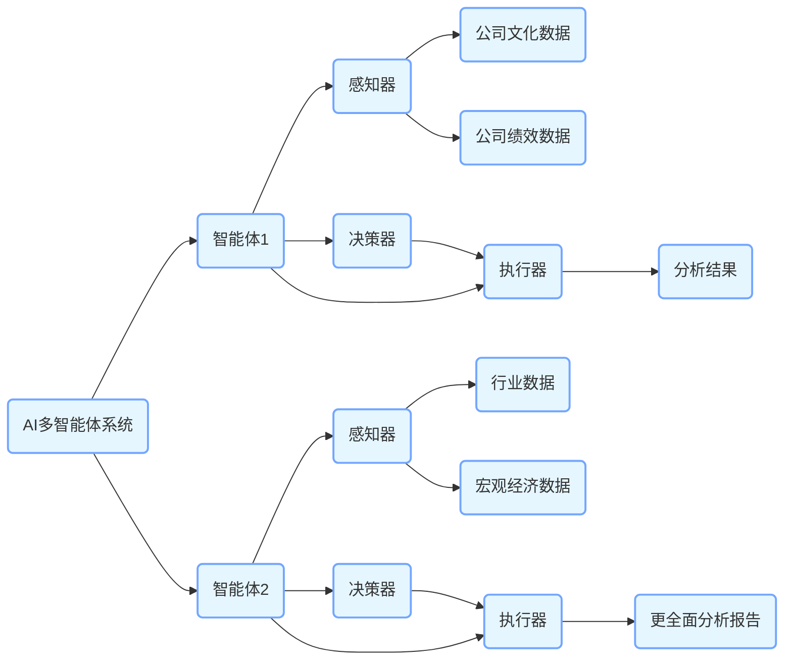

# AI多智能体系统在价值投资中的公司文化与绩效关联分析

> 关键词：AI多智能体系统、价值投资、公司文化、公司绩效、关联分析

> 摘要：本文聚焦于运用AI多智能体系统来深入分析价值投资领域中公司文化与绩效之间的关联。首先介绍了研究的背景、目的、预期读者等信息，接着阐述了核心概念及它们之间的联系，详细讲解了核心算法原理和操作步骤，并给出了相关数学模型和公式。通过项目实战，展示了如何搭建开发环境、实现源代码及对代码进行解读。分析了该研究在实际中的应用场景，推荐了相关的学习资源、开发工具框架以及论文著作。最后对未来发展趋势与挑战进行总结，还设置了附录解答常见问题，并提供了扩展阅读和参考资料，旨在为价值投资中公司文化与绩效关联研究提供全面且深入的技术视角。

## 1. 背景介绍 
### 1.1 目的和范围
在价值投资领域，准确评估公司的真实价值至关重要。公司文化作为一种无形但具有强大影响力的因素，对公司的长期绩效有着潜在的影响。然而，传统的分析方法难以全面、深入地探究公司文化与绩效之间复杂的关联。本研究的目的是借助AI多智能体系统，构建一个能够综合考虑多种因素的分析模型，以更精准地揭示公司文化与绩效之间的内在联系。

本研究的范围涵盖了多个行业的上市公司，通过收集和分析这些公司的文化数据和绩效指标，利用AI多智能体系统进行模拟和分析，从而得出具有普遍性和针对性的结论。

### 1.2 预期读者
本文的预期读者主要包括价值投资者、金融分析师、企业管理者以及对AI技术在金融领域应用感兴趣的研究人员。对于价值投资者来说，了解公司文化与绩效的关联可以帮助他们做出更明智的投资决策；金融分析师可以借助本文的研究方法和结果，提升对公司价值的评估能力；企业管理者可以从公司文化的角度审视企业的发展，优化公司文化以提高绩效；研究人员则可以在本文的基础上进行更深入的学术研究。

### 1.3 文档结构概述
本文将按照以下结构展开：首先介绍核心概念与联系，明确AI多智能体系统、公司文化和公司绩效等关键概念，并通过示意图和流程图展示它们之间的关系；接着详细阐述核心算法原理和具体操作步骤，使用Python代码进行说明；然后给出相关的数学模型和公式，并通过举例进行详细讲解；之后进行项目实战，包括开发环境搭建、源代码实现和代码解读；分析实际应用场景；推荐相关的工具和资源；最后对未来发展趋势与挑战进行总结，设置附录解答常见问题，并提供扩展阅读和参考资料。

### 1.4 术语表
#### 1.4.1 核心术语定义
- **AI多智能体系统（AI Multi - Agent System）**：由多个智能体组成的系统，每个智能体具有一定的自主性和智能，能够感知环境、进行决策并与其他智能体进行交互，共同完成特定的任务。
- **价值投资（Value Investing）**：一种投资策略，投资者通过分析公司的基本面，寻找被低估的股票进行投资，以获取长期的投资回报。
- **公司文化（Corporate Culture）**：企业在长期的发展过程中形成的价值观、信念、行为准则和工作方式等的总和，它影响着企业员工的行为和决策。
- **公司绩效（Corporate Performance）**：反映公司经营成果的一系列指标，如盈利能力、偿债能力、运营能力等。

#### 1.4.2 相关概念解释
- **智能体（Agent）**：在AI多智能体系统中，智能体是具有感知、决策和行动能力的实体。它可以是软件程序、机器人等，能够根据环境的变化自主地调整自己的行为。
- **环境感知（Environmental Perception）**：智能体通过各种传感器或数据接口获取周围环境的信息，以便做出合理的决策。
- **决策制定（Decision - Making）**：智能体根据感知到的环境信息和自身的目标，选择合适的行动方案的过程。

#### 1.4.3 缩略词列表
- **MAS**：Multi - Agent System（多智能体系统）
- **AI**：Artificial Intelligence（人工智能）

## 2. 核心概念与联系 

### 核心概念原理
#### AI多智能体系统
AI多智能体系统由多个智能体组成，这些智能体可以是不同类型的，具有不同的功能和目标。每个智能体都有自己的感知器、决策器和执行器。感知器用于获取环境信息，决策器根据感知到的信息和自身的目标进行决策，执行器则执行决策结果。智能体之间通过通信机制进行交互，共同完成系统的任务。

#### 公司文化
公司文化是企业的灵魂，它包括企业的价值观、使命、愿景、行为准则等。公司文化影响着员工的行为和态度，进而影响公司的运营和绩效。例如，一个强调创新的公司文化会鼓励员工提出新的想法和解决方案，从而促进公司的技术创新和产品升级。

#### 公司绩效
公司绩效是衡量公司经营成果的重要指标，通常包括财务指标和非财务指标。财务指标如净利润、营业收入、资产回报率等，反映了公司的盈利能力和财务状况；非财务指标如市场份额、客户满意度、员工满意度等，反映了公司的市场竞争力和内部管理水平。

### 架构的文本示意图
```plaintext
AI多智能体系统
|-- 智能体1
|   |-- 感知器（获取公司文化数据、绩效数据）
|   |-- 决策器（分析数据，评估文化与绩效关联）
|   |-- 执行器（输出分析结果）
|-- 智能体2
|   |-- 感知器（获取行业数据、宏观经济数据）
|   |-- 决策器（考虑外部因素，优化分析结果）
|   |-- 执行器（提供更全面的分析报告）
|--...

公司文化
|-- 价值观
|-- 使命
|-- 愿景
|-- 行为准则

公司绩效
|-- 财务指标
|   |-- 净利润
|   |-- 营业收入
|   |-- 资产回报率
|-- 非财务指标
|   |-- 市场份额
|   |-- 客户满意度
|   |-- 员工满意度
```

### Mermaid流程图


## 3. 核心算法原理 & 具体操作步骤 

### 核心算法原理
本研究采用强化学习算法作为核心算法，强化学习是一种通过智能体与环境进行交互，不断尝试不同的行动以最大化累积奖励的学习方法。在本研究中，智能体的目标是找到公司文化与绩效之间的最优关联。

智能体通过感知器获取公司文化数据、绩效数据以及外部环境数据，决策器根据这些数据选择合适的行动（如调整分析模型的参数），执行器将行动结果反馈给环境。环境根据智能体的行动给予相应的奖励，智能体根据奖励不断调整自己的决策策略，以提高分析的准确性。

### 具体操作步骤
#### 步骤1：数据收集
收集多个公司的文化数据和绩效数据，文化数据可以通过问卷调查、文本分析等方式获取，绩效数据可以从公司的财务报表、市场调研报告等渠道获取。同时，收集行业数据和宏观经济数据作为外部环境信息。

#### 步骤2：数据预处理
对收集到的数据进行清洗、归一化等预处理操作，以提高数据的质量和可用性。

#### 步骤3：智能体初始化
初始化智能体的感知器、决策器和执行器，设置决策器的初始策略。

#### 步骤4：交互学习
智能体与环境进行交互，不断尝试不同的行动，根据环境给予的奖励调整决策策略。具体过程如下：
1. 智能体通过感知器获取当前环境信息。
2. 决策器根据环境信息选择行动。
3. 执行器执行行动，并将结果反馈给环境。
4. 环境根据行动结果给予奖励。
5. 决策器根据奖励更新策略。

#### 步骤5：分析结果输出
当智能体的学习过程收敛后，输出分析结果，即公司文化与绩效之间的关联模型。

### Python源代码实现
```python
import numpy as np

# 定义智能体类
class Agent:
    def __init__(self, num_actions, learning_rate=0.1, discount_factor=0.9):
        self.num_actions = num_actions
        self.learning_rate = learning_rate
        self.discount_factor = discount_factor
        # 初始化Q表
        self.q_table = np.zeros((100, num_actions))  # 假设状态空间大小为100

    def choose_action(self, state):
        # 基于Q表选择行动
        if np.random.uniform(0, 1) < 0.1:  # 10%的概率随机探索
            action = np.random.choice(self.num_actions)
        else:
            action = np.argmax(self.q_table[state, :])
        return action

    def learn(self, state, action, reward, next_state):
        # 更新Q表
        q_predict = self.q_table[state, action]
        q_target = reward + self.discount_factor * np.max(self.q_table[next_state, :])
        self.q_table[state, action] += self.learning_rate * (q_target - q_predict)

# 模拟环境类
class Environment:
    def __init__(self):
        self.state = 0

    def get_state(self):
        return self.state

    def step(self, action):
        # 模拟环境反馈
        if action == 0:
            reward = 1
        else:
            reward = -1
        next_state = (self.state + 1) % 100
        self.state = next_state
        return next_state, reward

# 主程序
if __name__ == "__main__":
    num_actions = 2
    agent = Agent(num_actions)
    env = Environment()

    num_episodes = 1000
    for episode in range(num_episodes):
        state = env.get_state()
        for _ in range(100):
            action = agent.choose_action(state)
            next_state, reward = env.step(action)
            agent.learn(state, action, reward, next_state)
            state = next_state

    print("训练完成，Q表：")
    print(agent.q_table)
```

## 4. 数学模型和公式 & 详细讲解 & 举例说明 

### 数学模型
本研究采用Q - learning算法作为强化学习的核心算法，Q - learning算法的目标是学习一个最优的动作价值函数 $Q(s, a)$，表示在状态 $s$ 下采取动作 $a$ 的最大期望累积奖励。

### 公式
Q - learning算法的更新公式为：
$$Q(s_t, a_t) \leftarrow Q(s_t, a_t) + \alpha \left[ r_{t+1} + \gamma \max_{a} Q(s_{t+1}, a) - Q(s_t, a_t) \right]$$
其中：
- $Q(s_t, a_t)$ 是在时间步 $t$ 时，状态 $s_t$ 下采取动作 $a_t$ 的动作价值。
- $\alpha$ 是学习率，控制每次更新的步长。
- $r_{t+1}$ 是在时间步 $t$ 采取动作 $a_t$ 后，环境给予的即时奖励。
- $\gamma$ 是折扣因子，用于权衡即时奖励和未来奖励的重要性。
- $\max_{a} Q(s_{t+1}, a)$ 是在时间步 $t + 1$ 时，状态 $s_{t+1}$ 下所有可能动作的最大动作价值。

### 详细讲解
Q - learning算法的核心思想是通过不断地与环境进行交互，更新动作价值函数 $Q(s, a)$，使得智能体能够逐渐找到最优的行动策略。具体来说，智能体在每个时间步根据当前的动作价值函数选择一个动作，执行该动作后，环境会给予一个即时奖励和下一个状态。智能体根据更新公式更新当前状态和动作的动作价值，以反映该动作的实际奖励和未来可能的奖励。

### 举例说明
假设一个简单的环境，状态空间 $S = \{s_1, s_2\}$，动作空间 $A = \{a_1, a_2\}$。初始时，$Q$ 表的值都为 0。

在某一时刻，智能体处于状态 $s_1$，选择动作 $a_1$，执行该动作后，环境给予即时奖励 $r = 1$，并转移到状态 $s_2$。假设学习率 $\alpha = 0.1$，折扣因子 $\gamma = 0.9$。

根据更新公式，$Q(s_1, a_1)$ 的更新过程如下：
1. 计算 $Q$ 目标值：
   - 首先，找到 $s_2$ 状态下所有动作的最大 $Q$ 值，由于初始时 $Q(s_2, a_1) = Q(s_2, a_2) = 0$，所以 $\max_{a} Q(s_2, a) = 0$。
   - 则 $Q$ 目标值为 $r + \gamma \max_{a} Q(s_2, a) = 1 + 0.9 \times 0 = 1$。
2. 计算 $Q$ 预测值：$Q(s_1, a_1) = 0$（初始值）。
3. 更新 $Q(s_1, a_1)$：
   - $Q(s_1, a_1) \leftarrow Q(s_1, a_1) + \alpha \left[ r + \gamma \max_{a} Q(s_2, a) - Q(s_1, a_1) \right]$
   - $Q(s_1, a_1) \leftarrow 0 + 0.1 \times (1 - 0) = 0.1$

经过多次迭代，$Q$ 表的值会逐渐收敛，智能体可以根据收敛后的 $Q$ 表选择最优的行动策略。

## 5. 项目实战：代码实际案例和详细解释说明 

### 5.1  开发环境搭建
#### 操作系统
本项目可以在 Windows、Linux 或 macOS 操作系统上进行开发，建议使用 Linux 系统，如 Ubuntu 18.04 及以上版本，因为 Linux 系统对 Python 开发环境的支持较好，并且有丰富的开源工具和库。

#### Python 版本
使用 Python 3.7 及以上版本，因为较新的 Python 版本包含了更多的新特性和优化。

#### 依赖库安装
本项目主要依赖以下 Python 库：
- `numpy`：用于数值计算和数组操作。
- `pandas`：用于数据处理和分析。
- `scikit - learn`：用于数据预处理和机器学习模型的构建。

可以使用以下命令安装这些库：
```bash
pip install numpy pandas scikit-learn
```

### 5.2  源代码详细实现和代码解读
```python
import numpy as np
import pandas as pd
from sklearn.preprocessing import MinMaxScaler

# 数据加载和预处理函数
def load_and_preprocess_data(file_path):
    # 加载数据
    data = pd.read_csv(file_path)
    # 提取公司文化和绩效相关特征
    culture_features = data[['culture_feature1', 'culture_feature2',...]]
    performance_features = data[['performance_feature1', 'performance_feature2',...]]
    # 数据归一化
    scaler_culture = MinMaxScaler()
    scaler_performance = MinMaxScaler()
    culture_features = scaler_culture.fit_transform(culture_features)
    performance_features = scaler_performance.fit_transform(performance_features)
    return culture_features, performance_features

# 定义智能体类
class Agent:
    def __init__(self, num_states, num_actions, learning_rate=0.1, discount_factor=0.9):
        self.num_states = num_states
        self.num_actions = num_actions
        self.learning_rate = learning_rate
        self.discount_factor = discount_factor
        # 初始化Q表
        self.q_table = np.zeros((num_states, num_actions))

    def choose_action(self, state):
        # 基于Q表选择行动
        if np.random.uniform(0, 1) < 0.1:  # 10%的概率随机探索
            action = np.random.choice(self.num_actions)
        else:
            action = np.argmax(self.q_table[state, :])
        return action

    def learn(self, state, action, reward, next_state):
        # 更新Q表
        q_predict = self.q_table[state, action]
        q_target = reward + self.discount_factor * np.max(self.q_table[next_state, :])
        self.q_table[state, action] += self.learning_rate * (q_target - q_predict)

# 主程序
if __name__ == "__main__":
    file_path = 'company_data.csv'
    culture_features, performance_features = load_and_preprocess_data(file_path)
    num_states = culture_features.shape[0]
    num_actions = 2  # 假设只有两种动作
    agent = Agent(num_states, num_actions)

    num_episodes = 1000
    for episode in range(num_episodes):
        for i in range(num_states):
            state = i
            action = agent.choose_action(state)
            # 计算奖励，这里简单假设奖励为绩效特征值
            reward = performance_features[state, 0]
            next_state = (state + 1) % num_states
            agent.learn(state, action, reward, next_state)

    print("训练完成，Q表：")
    print(agent.q_table)
```

### 5.3  代码解读与分析
#### 数据加载和预处理部分
- `load_and_preprocess_data` 函数用于加载公司文化和绩效数据，并进行归一化处理。归一化可以将不同范围的数据映射到相同的区间，避免某些特征对模型的影响过大。

#### 智能体类部分
- `Agent` 类实现了强化学习中的智能体。`__init__` 方法初始化智能体的参数和 $Q$ 表；`choose_action` 方法根据 $Q$ 表选择行动，同时有一定的概率进行随机探索；`learn` 方法根据 $Q$ - learning 更新公式更新 $Q$ 表。

#### 主程序部分
- 首先调用 `load_and_preprocess_data` 函数加载和预处理数据。
- 初始化智能体，并设置状态数和动作数。
- 进行多次迭代训练，每次迭代中，智能体根据当前状态选择行动，计算奖励并更新 $Q$ 表。

通过上述代码，我们可以训练一个智能体来分析公司文化与绩效之间的关联。

## 6. 实际应用场景 
### 价值投资决策
价值投资者可以利用AI多智能体系统分析公司文化与绩效的关联，选择具有良好公司文化和高绩效潜力的公司进行投资。通过深入了解公司文化对绩效的影响，投资者可以更准确地评估公司的内在价值，降低投资风险，提高投资回报率。

### 企业战略规划
企业管理者可以借助该分析结果优化公司文化，制定更符合公司发展的战略规划。例如，如果分析结果表明创新文化与公司的技术创新绩效密切相关，企业可以加大在创新文化建设方面的投入，鼓励员工创新，从而提升公司的竞争力。

### 行业研究和比较
金融分析师可以使用AI多智能体系统对不同行业的公司文化和绩效进行比较研究。通过分析行业内公司文化与绩效的共性和差异，为行业发展趋势预测和投资建议提供参考。

### 人力资源管理
企业的人力资源部门可以根据公司文化与绩效的关联，制定更有效的人才招聘、培训和激励机制。例如，对于强调团队合作文化的公司，可以招聘具有团队合作精神的员工，并通过团队建设活动和激励措施来强化这种文化，提高员工的工作绩效。

## 7. 工具和资源推荐
### 7.1 学习资源推荐
#### 7.1.1 书籍推荐
- 《人工智能：一种现代的方法》：全面介绍了人工智能的各个领域，包括多智能体系统、强化学习等内容，是人工智能领域的经典教材。
- 《价值投资：从格雷厄姆到巴菲特》：详细阐述了价值投资的理论和方法，对于理解价值投资的理念和实践具有重要的指导意义。
- 《企业文化与经营业绩》：深入探讨了公司文化与企业经营绩效之间的关系，提供了丰富的案例和研究成果。

#### 7.1.2 在线课程
- Coursera 上的“Artificial Intelligence for Robotics”：该课程介绍了人工智能在机器人领域的应用，其中包括多智能体系统的相关知识。
- edX 上的“Machine Learning”：由斯坦福大学教授 Andrew Ng 主讲，是机器学习领域的经典课程，涵盖了强化学习等内容。
- 中国大学MOOC上的“价值投资分析”：系统介绍了价值投资的理论、方法和实践，适合初学者学习。

#### 7.1.3 技术博客和网站
- Towards Data Science：是一个专注于数据科学和人工智能领域的博客平台，提供了大量的技术文章和案例分析。
- AI Time：专注于人工智能领域的前沿技术和研究成果，定期举办线上研讨会和讲座。
- 雪球网：是一个专注于价值投资的社区，汇聚了众多的价值投资者和金融分析师，提供了丰富的投资分析和讨论。

### 7.2 开发工具框架推荐
#### 7.2.1 IDE和编辑器
- PyCharm：是一款专门为 Python 开发设计的集成开发环境，具有强大的代码编辑、调试和项目管理功能。
- Jupyter Notebook：是一个交互式的开发环境，适合进行数据探索、模型实验和代码演示。
- Visual Studio Code：是一款轻量级的代码编辑器，支持多种编程语言，具有丰富的插件生态系统。

#### 7.2.2 调试和性能分析工具
- PDB：是 Python 自带的调试器，可以帮助开发者定位和解决代码中的问题。
- cProfile：是 Python 标准库中的性能分析工具，可以分析代码的运行时间和函数调用情况。
- TensorBoard：是 TensorFlow 提供的可视化工具，可以用于可视化训练过程中的指标和模型结构。

#### 7.2.3 相关框架和库
- OpenAI Gym：是一个用于开发和比较强化学习算法的工具包，提供了多种模拟环境和评估指标。
- Stable - Baselines3：是一个基于 PyTorch 的强化学习库，提供了多种预训练的强化学习算法和模型。
- NetworkX：是一个用于创建、操作和研究复杂网络的 Python 库，可以用于构建和分析多智能体系统中的智能体交互网络。

### 7.3 相关论文著作推荐
#### 7.3.1 经典论文
- “Multi - Agent Systems: A Modern Approach to Distributed Artificial Intelligence”：系统介绍了多智能体系统的基本概念、理论和方法，是多智能体系统领域的经典论文。
- “Value Investing: The Use of Historical Financial Statement Information to Separate Winners from Losers”：详细阐述了价值投资中如何利用历史财务报表信息进行选股，是价值投资领域的重要论文。
- “Corporate Culture and Economic Performance”：研究了公司文化对企业经济绩效的影响，提出了一些重要的理论和实证结果。

#### 7.3.2 最新研究成果
- 通过谷歌学术搜索“AI multi - agent system in value investment”、“Corporate culture and performance analysis”等关键词，可以获取该领域的最新研究论文和成果。
- 参加相关的学术会议，如 AAAI（Association for the Advancement of Artificial Intelligence）、IJCAI（International Joint Conference on Artificial Intelligence）等，了解最新的研究动态。

#### 7.3.3 应用案例分析
- 可以通过查阅金融研究报告、企业案例分析书籍等，了解AI多智能体系统在价值投资和公司文化与绩效分析中的实际应用案例。例如，一些投资机构的研究报告可能会介绍他们如何利用人工智能技术进行投资决策和公司评估。

## 8. 总结：未来发展趋势与挑战
### 未来发展趋势
#### 融合更多数据来源
未来，AI多智能体系统在分析公司文化与绩效关联时，将融合更多的数据来源，如社交媒体数据、员工在线行为数据等。这些数据可以更全面地反映公司文化和员工的工作状态，从而提高分析的准确性和可靠性。

#### 与其他技术的深度融合
AI多智能体系统将与区块链、物联网等技术深度融合。例如，区块链技术可以保证数据的安全性和不可篡改，物联网技术可以实时获取公司的运营数据，为分析提供更及时、准确的信息。

#### 个性化分析和决策支持
随着技术的发展，AI多智能体系统将能够为不同的投资者和企业管理者提供个性化的分析和决策支持。根据用户的需求和偏好，系统可以生成定制化的分析报告和投资建议。

### 挑战
#### 数据质量和隐私问题
数据质量是影响分析结果准确性的关键因素之一。收集到的公司文化和绩效数据可能存在噪声、缺失值等问题，需要进行有效的清洗和预处理。同时，数据隐私问题也需要得到重视，特别是涉及员工个人信息和企业敏感数据时，必须采取严格的安全措施。

#### 模型解释性
AI多智能体系统中的强化学习模型通常具有较高的复杂度，其决策过程难以解释。在价值投资和企业管理等领域，模型的解释性非常重要，投资者和管理者需要了解模型的决策依据，以便做出合理的决策。

#### 技术门槛和人才短缺
开发和应用AI多智能体系统需要具备较高的技术门槛，涉及人工智能、机器学习、多智能体系统等多个领域的知识。目前，相关领域的专业人才短缺，限制了该技术的广泛应用和发展。

## 9. 附录：常见问题与解答
### 问题1：AI多智能体系统在分析公司文化与绩效关联时的准确性如何保证？
解答：为保证分析的准确性，需要从多个方面入手。首先，要确保数据的质量，对收集到的数据进行严格的清洗和预处理，去除噪声和缺失值。其次，选择合适的算法和模型，如本研究中使用的强化学习算法，并对模型进行充分的训练和优化。此外，可以采用交叉验证等方法对模型进行评估和验证，不断调整模型参数，提高分析的准确性。

### 问题2：如何衡量公司文化和绩效数据的有效性？
解答：对于公司文化数据，可以通过问卷调查的信效度分析、文本分析的主题一致性等方法来衡量其有效性。对于绩效数据，可以参考行业标准和历史数据，检查数据的合理性和稳定性。同时，可以采用相关性分析等方法，分析公司文化数据和绩效数据之间的相关性，以判断数据的有效性。

### 问题3：AI多智能体系统在实际应用中需要注意哪些问题？
解答：在实际应用中，需要注意以下几个问题。一是数据安全和隐私保护，特别是涉及企业敏感数据和员工个人信息时，要采取严格的安全措施。二是模型的解释性，要确保投资者和管理者能够理解模型的决策依据。三是系统的可扩展性，随着数据量的增加和业务需求的变化，系统需要能够方便地进行扩展和升级。

## 10. 扩展阅读 & 参考资料
### 扩展阅读
- 《复杂网络：结构、动力学与演化》：深入介绍了复杂网络的理论和方法，对于理解多智能体系统中的智能体交互网络具有重要的参考价值。
- 《大数据时代：生活、工作与思维的大变革》：探讨了大数据对社会和经济的影响，为在价值投资中应用大数据提供了思路。
- 《创新文化：激发企业创新的动力源泉》：详细阐述了创新文化的内涵和建设方法，对于研究公司文化与创新绩效的关联有一定的帮助。

### 参考资料
- 相关的学术论文和研究报告，如在 IEEE Xplore、ACM Digital Library 等数据库中搜索到的关于AI多智能体系统、价值投资、公司文化等方面的论文。
- 企业的财务报表和年度报告，可从证券交易所网站、企业官方网站等渠道获取。
- 行业研究报告和市场调研报告，可从专业的研究机构网站、咨询公司等渠道获取。

作者：AI天才研究院/AI Genius Institute & 禅与计算机程序设计艺术 /Zen And The Art of Computer Programming