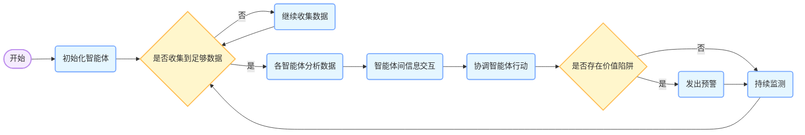

# AI多智能体系统在识别价值陷阱中的作用

> 关键词：AI多智能体系统、价值陷阱识别、智能决策、信息交互、机器学习

> 摘要：本文深入探讨了AI多智能体系统在识别价值陷阱中的作用。首先介绍了相关背景知识，包括研究目的、预期读者和文档结构等。接着阐述了AI多智能体系统和价值陷阱的核心概念及其联系，并给出了相应的原理和架构示意图。详细讲解了核心算法原理和具体操作步骤，结合Python代码进行说明。同时，分析了相关的数学模型和公式，并举例加以解释。通过项目实战，展示了如何利用AI多智能体系统识别价值陷阱，包括开发环境搭建、源代码实现和代码解读。还探讨了该系统在实际中的应用场景，推荐了相关的学习资源、开发工具框架和论文著作。最后总结了未来发展趋势与挑战，并提供了常见问题的解答和扩展阅读的参考资料。

## 1. 背景介绍 
### 1.1 目的和范围
在当今复杂多变的经济和商业环境中，价值陷阱无处不在。价值陷阱是指那些看似具有投资价值，但实际上由于各种潜在因素，如公司基本面恶化、行业竞争加剧、宏观经济环境不利等，导致投资回报率远低于预期甚至遭受重大损失的情况。传统的价值评估方法往往难以全面、准确地识别这些价值陷阱，因为它们通常依赖于单一的数据源和分析模型，缺乏对复杂信息的综合处理能力。

AI多智能体系统作为一种新兴的技术手段，具有分布式、并行处理和智能交互等特点，能够模拟多个智能个体在环境中的协作和决策过程。本研究的目的是探讨AI多智能体系统在识别价值陷阱中的应用，通过多智能体之间的信息交互和协作，充分挖掘各种潜在的价值陷阱因素，提高价值评估的准确性和可靠性。

本研究的范围涵盖了AI多智能体系统的基本原理、核心算法、数学模型，以及在不同领域（如金融投资、商业决策等）中识别价值陷阱的具体应用。同时，还将通过实际案例分析，验证AI多智能体系统在识别价值陷阱中的有效性和实用性。

### 1.2 预期读者
本文的预期读者包括以下几类人群：
- **金融投资领域从业者**：如基金经理、投资分析师、风险评估师等，他们可以借助AI多智能体系统的方法和技术，提高投资决策的准确性，避免陷入价值陷阱。
- **商业决策者**：企业的高层管理人员、战略规划师等，在进行商业决策时，能够利用该系统对市场机会和潜在风险进行更全面的评估，从而做出更明智的决策。
- **人工智能和计算机科学领域的研究人员**：对AI多智能体系统的理论和应用感兴趣，希望了解其在价值陷阱识别中的具体应用和发展趋势。
- **相关专业的学生**：如金融、计算机科学、管理学等专业的本科生和研究生，通过阅读本文，可以拓宽知识面，了解跨学科领域的研究方法和应用案例。

### 1.3 文档结构概述
本文将按照以下结构进行组织：
- **核心概念与联系**：介绍AI多智能体系统和价值陷阱的核心概念，以及它们之间的联系，并给出相应的原理和架构示意图。
- **核心算法原理 & 具体操作步骤**：详细讲解AI多智能体系统在识别价值陷阱中所使用的核心算法原理，并结合Python代码给出具体的操作步骤。
- **数学模型和公式 & 详细讲解 & 举例说明**：分析相关的数学模型和公式，对其进行详细讲解，并通过实际例子进行说明。
- **项目实战：代码实际案例和详细解释说明**：通过一个具体的项目实战，展示如何利用AI多智能体系统识别价值陷阱，包括开发环境搭建、源代码实现和代码解读。
- **实际应用场景**：探讨AI多智能体系统在不同领域中识别价值陷阱的实际应用场景。
- **工具和资源推荐**：推荐相关的学习资源、开发工具框架和论文著作，帮助读者进一步深入学习和研究。
- **总结：未来发展趋势与挑战**：总结AI多智能体系统在识别价值陷阱中的应用现状，分析未来的发展趋势和面临的挑战。
- **附录：常见问题与解答**：提供一些常见问题的解答，帮助读者更好地理解本文的内容。
- **扩展阅读 & 参考资料**：列出相关的扩展阅读材料和参考资料，方便读者进一步查阅。

### 1.4 术语表
#### 1.4.1 核心术语定义
- **AI多智能体系统（AI Multi - Agent System）**：由多个智能体组成的系统，每个智能体具有一定的自主性、智能性和交互能力，它们通过相互协作和通信，共同完成特定的任务。
- **价值陷阱（Value Trap）**：指那些表面上看起来具有投资价值，但实际上由于各种潜在因素，导致投资回报率远低于预期甚至遭受重大损失的情况。
- **智能体（Agent）**：在AI多智能体系统中，智能体是具有感知、决策和行动能力的个体，能够根据自身的知识和经验，对环境做出响应。
- **信息交互（Information Interaction）**：智能体之间通过某种通信机制，交换信息和知识的过程。
- **协作决策（Collaborative Decision - Making）**：多个智能体通过合作和协商，共同做出决策的过程。

#### 1.4.2 相关概念解释
- **分布式系统（Distributed System）**：由多个独立的计算单元组成的系统，这些计算单元通过网络连接，共同完成一个或多个任务。AI多智能体系统通常具有分布式的特点，每个智能体可以在不同的计算节点上运行。
- **机器学习（Machine Learning）**：让计算机通过数据和经验自动学习模式和规律的技术。在AI多智能体系统中，智能体可以利用机器学习算法进行决策和学习。
- **数据挖掘（Data Mining）**：从大量的数据中发现有价值的信息和知识的过程。在识别价值陷阱中，数据挖掘技术可以用于挖掘潜在的价值陷阱因素。

#### 1.4.3 缩略词列表
- **AI**：Artificial Intelligence，人工智能
- **MAS**：Multi - Agent System，多智能体系统
- **ML**：Machine Learning，机器学习

## 2. 核心概念与联系 

### 2.1 AI多智能体系统核心概念
AI多智能体系统是由多个智能体组成的分布式系统。每个智能体具有以下特点：
- **自主性**：智能体能够独立地感知环境、做出决策和采取行动，不需要外部的直接干预。
- **智能性**：智能体具有一定的知识和推理能力，能够根据环境的变化和自身的目标，选择合适的行动策略。
- **交互性**：智能体可以与其他智能体进行通信和协作，交换信息和知识，共同完成任务。

AI多智能体系统的架构通常包括以下几个部分：
- **智能体集合**：由多个智能体组成，每个智能体负责不同的任务或功能。
- **通信机制**：用于智能体之间的信息交换和通信，常见的通信方式包括消息传递、共享内存等。
- **环境**：智能体所处的外部环境，包括各种数据、资源和其他智能体。
- **协调机制**：用于协调智能体之间的行动，避免冲突和重复工作，提高系统的整体效率。

### 2.2 价值陷阱核心概念
价值陷阱是投资领域中的一个重要概念。在股票投资中，一家公司的股价可能看起来很便宜，市盈率、市净率等估值指标都很低，但实际上该公司可能面临着各种问题，如市场份额下降、产品竞争力减弱、财务造假等，这些问题可能导致公司的业绩持续下滑，股价也会随之下跌，投资者就陷入了价值陷阱。

在商业决策中，价值陷阱也可能表现为对某个项目或市场机会的错误评估。例如，企业可能认为某个新兴市场具有巨大的潜力，但实际上该市场存在着激烈的竞争、政策风险等因素，导致企业投入大量资源后无法获得预期的回报。

### 2.3 两者联系
AI多智能体系统与价值陷阱识别之间存在着密切的联系。通过多个智能体的协作和信息交互，可以从不同的角度对目标对象进行分析和评估，充分挖掘各种潜在的价值陷阱因素。

例如，一个智能体可以负责收集和分析公司的财务数据，另一个智能体可以关注行业的竞争态势和市场趋势，还有一个智能体可以监测宏观经济环境的变化。这些智能体通过相互通信和协作，将各自获得的信息进行整合和分析，从而更全面、准确地识别价值陷阱。

### 2.4 原理和架构的文本示意图
以下是AI多智能体系统在识别价值陷阱中的原理和架构的文本示意图：

智能体集合包括财务分析智能体、行业分析智能体、宏观经济分析智能体等。每个智能体都有自己的感知模块、决策模块和行动模块。感知模块用于收集相关的数据和信息，决策模块根据收集到的信息进行分析和推理，行动模块根据决策结果采取相应的行动。

智能体之间通过通信机制进行信息交互，将各自的分析结果传递给其他智能体。协调机制负责协调智能体之间的行动，避免冲突和重复工作。最终，通过多个智能体的协作和信息整合，得出关于目标对象是否存在价值陷阱的判断。

### 2.5 Mermaid流程图


## 3. 核心算法原理 & 具体操作步骤 

### 3.1 核心算法原理
在AI多智能体系统识别价值陷阱中，常用的核心算法包括机器学习算法和博弈论算法。

#### 3.1.1 机器学习算法
机器学习算法可以帮助智能体从大量的数据中学习模式和规律，从而对目标对象的价值进行评估。常见的机器学习算法包括决策树、支持向量机、神经网络等。

以决策树算法为例，决策树是一种基于树结构进行决策的算法。每个内部节点表示一个属性上的测试，每个分支表示一个测试输出，每个叶节点表示一种类别或值。在价值陷阱识别中，决策树可以根据公司的财务指标、行业数据等属性，构建决策模型，判断该公司是否存在价值陷阱。

#### 3.1.2 博弈论算法
博弈论算法用于处理智能体之间的协作和竞争关系。在AI多智能体系统中，智能体之间需要通过协作来共同完成价值陷阱识别的任务，但同时也可能存在利益冲突。博弈论算法可以帮助智能体在这种情况下做出最优的决策。

例如，在信息交互过程中，智能体可能会面临是否分享自己的信息的决策。博弈论算法可以通过分析不同决策的收益和成本，帮助智能体选择最优的策略。

### 3.2 具体操作步骤

#### 3.2.1 数据收集
智能体首先需要收集与目标对象相关的数据，包括财务数据、行业数据、宏观经济数据等。这些数据可以从各种数据源获取，如财务报表、行业报告、政府统计数据等。

#### 3.2.2 数据预处理
收集到的数据可能存在噪声、缺失值等问题，需要进行预处理。数据预处理的步骤包括数据清洗、数据归一化、特征选择等。

#### 3.2.3 模型训练
使用机器学习算法对预处理后的数据进行训练，构建价值评估模型。在训练过程中，需要将数据分为训练集和测试集，通过训练集来学习模型的参数，通过测试集来评估模型的性能。

#### 3.2.4 智能体协作
多个智能体通过通信机制进行信息交互和协作。每个智能体将自己的分析结果传递给其他智能体，同时接收其他智能体的信息。通过信息整合和分析，共同判断目标对象是否存在价值陷阱。

#### 3.2.5 决策与预警
根据智能体的协作结果，做出关于目标对象是否存在价值陷阱的决策。如果判断存在价值陷阱，及时发出预警信息。

### 3.3 Python源代码实现
以下是一个简单的Python代码示例，演示了如何使用决策树算法进行价值陷阱识别：

```python
import pandas as pd
from sklearn.model_selection import train_test_split
from sklearn.tree import DecisionTreeClassifier
from sklearn.metrics import accuracy_score

# 加载数据
data = pd.read_csv('value_trap_data.csv')

# 分离特征和标签
X = data.drop('is_value_trap', axis=1)
y = data['is_value_trap']

# 划分训练集和测试集
X_train, X_test, y_train, y_test = train_test_split(X, y, test_size=0.2, random_state=42)

# 创建决策树分类器
clf = DecisionTreeClassifier()

# 训练模型
clf.fit(X_train, y_train)

# 预测
y_pred = clf.predict(X_test)

# 评估模型性能
accuracy = accuracy_score(y_test, y_pred)
print(f"模型准确率: {accuracy}")
```

### 3.4 代码解释
- **数据加载**：使用`pandas`库的`read_csv`函数加载存储在`value_trap_data.csv`文件中的数据。
- **特征和标签分离**：将数据集中的特征和标签分离，`is_value_trap`列作为标签，其余列作为特征。
- **数据集划分**：使用`train_test_split`函数将数据集划分为训练集和测试集，测试集占比为20%。
- **模型创建与训练**：创建一个决策树分类器对象`clf`，并使用训练集对其进行训练。
- **预测与评估**：使用训练好的模型对测试集进行预测，并使用`accuracy_score`函数计算模型的准确率。

## 4. 数学模型和公式 & 详细讲解 & 举例说明 

### 4.1 决策树算法的数学模型
决策树算法的核心是信息增益的计算。信息增益用于衡量在某个属性上进行划分所带来的信息纯度的提升。

#### 4.1.1 信息熵
信息熵是衡量数据集中不确定性的指标。对于一个包含 $n$ 个类别的数据集 $D$，其信息熵 $H(D)$ 的计算公式为：

$$H(D)=-\sum_{i = 1}^{n}p_i\log_2p_i$$

其中，$p_i$ 是第 $i$ 个类别的样本在数据集中所占的比例。

#### 4.1.2 条件熵
条件熵是在给定某个属性 $A$ 的条件下，数据集 $D$ 的信息熵。对于属性 $A$ 有 $v$ 个不同的取值 $\{a_1,a_2,\cdots,a_v\}$，将数据集 $D$ 划分为 $v$ 个子集 $\{D_1,D_2,\cdots,D_v\}$，则条件熵 $H(D|A)$ 的计算公式为：

$$H(D|A)=\sum_{i = 1}^{v}\frac{|D_i|}{|D|}H(D_i)$$

其中，$|D_i|$ 是子集 $D_i$ 的样本数量，$|D|$ 是数据集 $D$ 的样本数量。

#### 4.1.3 信息增益
信息增益是信息熵与条件熵的差值，用于衡量在属性 $A$ 上进行划分所带来的信息纯度的提升。信息增益 $Gain(D,A)$ 的计算公式为：

$$Gain(D,A)=H(D)-H(D|A)$$

### 4.2 详细讲解
在决策树的构建过程中，每次选择信息增益最大的属性作为划分属性。具体步骤如下：
1. 计算数据集 $D$ 的信息熵 $H(D)$。
2. 对于每个属性 $A$，计算其条件熵 $H(D|A)$ 和信息增益 $Gain(D,A)$。
3. 选择信息增益最大的属性作为当前节点的划分属性。
4. 根据该属性的不同取值，将数据集 $D$ 划分为多个子集。
5. 对每个子集重复上述步骤，直到满足终止条件（如子集的样本数量小于某个阈值、所有样本属于同一类别等）。

### 4.3 举例说明
假设我们有一个包含以下数据的数据集：

| 年龄 | 收入 | 是否购买 |
| ---- | ---- | ---- |
| 青年 | 高 | 否 |
| 青年 | 高 | 否 |
| 中年 | 高 | 是 |
| 中年 | 低 | 是 |
| 老年 | 低 | 是 |
| 老年 | 低 | 否 |

#### 4.3.1 计算信息熵
数据集中共有6个样本，其中购买的样本有3个，不购买的样本有3个。则信息熵 $H(D)$ 为：

$$H(D)=-\frac{3}{6}\log_2\frac{3}{6}-\frac{3}{6}\log_2\frac{3}{6}=1$$

#### 4.3.2 计算条件熵和信息增益
以“年龄”属性为例，“年龄”属性有3个不同的取值：青年、中年、老年。将数据集划分为3个子集：
- 青年子集：有2个样本，都不购买。
- 中年子集：有2个样本，都购买。
- 老年子集：有2个样本，1个购买，1个不购买。

计算条件熵 $H(D|年龄)$：

$$H(D|年龄)=\frac{2}{6}H(青年子集)+\frac{2}{6}H(中年子集)+\frac{2}{6}H(老年子集)$$

$$H(青年子集)=-\frac{0}{2}\log_2\frac{0}{2}-\frac{2}{2}\log_2\frac{2}{2}=0$$

$$H(中年子集)=-\frac{2}{2}\log_2\frac{2}{2}-\frac{0}{2}\log_2\frac{0}{2}=0$$

$$H(老年子集)=-\frac{1}{2}\log_2\frac{1}{2}-\frac{1}{2}\log_2\frac{1}{2}=1$$

$$H(D|年龄)=\frac{2}{6}\times0+\frac{2}{6}\times0+\frac{2}{6}\times1=\frac{1}{3}$$

信息增益 $Gain(D,年龄)$ 为：

$$Gain(D,年龄)=H(D)-H(D|年龄)=1-\frac{1}{3}=\frac{2}{3}$$

同理，可以计算“收入”属性的信息增益。比较两个属性的信息增益，选择信息增益最大的属性作为根节点的划分属性。

## 5. 项目实战：代码实际案例和详细解释说明 

### 5.1  开发环境搭建
#### 5.1.1 安装Python
首先需要安装Python编程语言。可以从Python官方网站（https://www.python.org/downloads/）下载适合自己操作系统的Python版本，并按照安装向导进行安装。

#### 5.1.2 安装必要的库
在识别价值陷阱的项目中，需要使用一些Python库，如`pandas`、`scikit - learn`等。可以使用`pip`命令进行安装：

```bash
pip install pandas scikit-learn
```

### 5.2  源代码详细实现和代码解读
以下是一个完整的Python代码示例，演示了如何使用AI多智能体系统（简化版）进行价值陷阱识别：

```python
import pandas as pd
from sklearn.model_selection import train_test_split
from sklearn.tree import DecisionTreeClassifier
from sklearn.metrics import accuracy_score

# 智能体类
class Agent:
    def __init__(self, data, target):
        self.data = data
        self.target = target
        self.model = DecisionTreeClassifier()

    def train(self):
        X_train, X_test, y_train, y_test = train_test_split(self.data, self.target, test_size=0.2, random_state=42)
        self.model.fit(X_train, y_train)
        y_pred = self.model.predict(X_test)
        accuracy = accuracy_score(y_test, y_pred)
        print(f"智能体模型准确率: {accuracy}")

    def predict(self, new_data):
        return self.model.predict(new_data)

# 数据加载和预处理
def load_and_preprocess_data(file_path):
    data = pd.read_csv(file_path)
    X = data.drop('is_value_trap', axis=1)
    y = data['is_value_trap']
    return X, y

# 主函数
def main():
    file_path = 'value_trap_data.csv'
    X, y = load_and_preprocess_data(file_path)

    # 创建智能体
    agent = Agent(X, y)

    # 训练智能体
    agent.train()

    # 模拟新数据进行预测
    new_data = X.sample(5)
    predictions = agent.predict(new_data)
    print("预测结果:", predictions)

if __name__ == "__main__":
    main()
```

### 5.3  代码解读与分析
#### 5.3.1 智能体类
定义了一个`Agent`类，用于表示一个智能体。该类包含以下方法：
- `__init__`：初始化智能体，接收数据集和目标标签作为参数，并创建一个决策树分类器模型。
- `train`：对智能体的模型进行训练，并计算模型的准确率。
- `predict`：使用训练好的模型对新数据进行预测。

#### 5.3.2 数据加载和预处理函数
`load_and_preprocess_data`函数用于加载存储在CSV文件中的数据，并将特征和标签分离。

#### 5.3.3 主函数
`main`函数是程序的入口，主要完成以下任务：
- 调用`load_and_preprocess_data`函数加载和预处理数据。
- 创建一个智能体对象。
- 调用智能体的`train`方法进行训练。
- 从数据集中随机抽取5个样本作为新数据，调用智能体的`predict`方法进行预测，并输出预测结果。

通过这个项目实战，我们可以看到如何使用AI多智能体系统（简化版）进行价值陷阱识别。在实际应用中，可以扩展智能体的功能，增加智能体之间的信息交互和协作，以提高识别的准确性和可靠性。

## 6. 实际应用场景 
### 6.1 金融投资领域
在金融投资领域，AI多智能体系统可以帮助投资者识别股票、债券等投资产品中的价值陷阱。例如，财务分析智能体可以对公司的财务报表进行深入分析，识别潜在的财务风险；行业分析智能体可以关注行业的竞争态势和发展趋势，判断公司在行业中的竞争力；宏观经济分析智能体可以监测宏观经济环境的变化，评估其对公司业绩的影响。通过多个智能体的协作和信息整合，投资者可以更全面、准确地评估投资产品的价值，避免陷入价值陷阱。

### 6.2 商业决策领域
在商业决策中，企业需要对市场机会和潜在风险进行评估。AI多智能体系统可以在这方面发挥重要作用。市场分析智能体可以收集和分析市场数据，了解市场需求和竞争情况；技术分析智能体可以关注行业的技术发展趋势，评估企业的技术竞争力；战略规划智能体可以根据前两个智能体的分析结果，制定企业的战略规划。通过多个智能体的协作，企业可以更准确地识别商业决策中的价值陷阱，做出更明智的决策。

### 6.3 项目投资评估领域
在项目投资评估中，AI多智能体系统可以帮助评估项目的可行性和潜在风险。财务评估智能体可以对项目的财务状况进行分析，预测项目的收益和成本；风险评估智能体可以识别项目可能面临的各种风险，如市场风险、技术风险、政策风险等；项目管理智能体可以根据前两个智能体的分析结果，制定项目的管理策略。通过多个智能体的协作，投资者可以更全面、准确地评估项目的投资价值，避免投资到存在价值陷阱的项目中。

## 7. 工具和资源推荐
### 7.1 学习资源推荐
#### 7.1.1 书籍推荐
- 《人工智能：一种现代的方法》：这本书是人工智能领域的经典教材，全面介绍了人工智能的基本概念、算法和应用，对于理解AI多智能体系统的原理和技术有很大的帮助。
- 《多智能体系统导论》：专门介绍多智能体系统的理论和应用，包括智能体的设计、通信、协作等方面的内容。
- 《机器学习》：周志华著，这本书系统地介绍了机器学习的基本概念、算法和应用，对于掌握AI多智能体系统中常用的机器学习算法有很大的帮助。

#### 7.1.2 在线课程
- Coursera上的“人工智能基础”课程：由知名高校的教授授课，系统地介绍了人工智能的基本概念、算法和应用。
- edX上的“多智能体系统”课程：专门讲解多智能体系统的理论和实践，包括智能体的建模、通信、协作等方面的内容。
- 吴恩达的“机器学习”课程：在网上非常受欢迎，详细介绍了机器学习的基本算法和应用，对于理解AI多智能体系统中的机器学习部分有很大的帮助。

#### 7.1.3 技术博客和网站
- 机器之心：专注于人工智能领域的技术博客，提供最新的技术动态、研究成果和应用案例。
- 开源中国：提供丰富的开源项目和技术文章，对于学习AI多智能体系统的开发和应用有很大的帮助。
- arXiv：一个预印本平台，提供大量的学术论文，包括AI多智能体系统领域的最新研究成果。

### 7.2 开发工具框架推荐
#### 7.2.1 IDE和编辑器
- PyCharm：一款专门为Python开发设计的集成开发环境，提供丰富的功能和插件，方便开发和调试AI多智能体系统。
- Jupyter Notebook：一个交互式的开发环境，适合进行数据探索、模型训练和可视化，对于AI多智能体系统的研究和开发非常有用。
- Visual Studio Code：一款轻量级的代码编辑器，支持多种编程语言和插件，具有良好的扩展性和用户体验。

#### 7.2.2 调试和性能分析工具
- PDB：Python自带的调试工具，可以帮助开发者调试代码，查找问题。
- cProfile：Python的性能分析工具，可以分析代码的运行时间和内存使用情况，帮助开发者优化代码性能。
- TensorBoard：一个可视化工具，主要用于深度学习模型的训练过程可视化，对于AI多智能体系统中的机器学习部分的调试和分析有很大的帮助。

#### 7.2.3 相关框架和库
- Mesa：一个用于构建基于智能体的模型的Python框架，提供了丰富的智能体建模和模拟功能，适合开发AI多智能体系统。
- JADE：一个用Java实现的多智能体开发框架，提供了智能体的创建、通信、协作等功能，广泛应用于多智能体系统的开发。
- scikit - learn：一个常用的机器学习库，提供了各种机器学习算法和工具，对于AI多智能体系统中的机器学习部分的开发非常有用。

### 7.3 相关论文著作推荐
#### 7.3.1 经典论文
- “Multi - Agent Systems: A Modern Approach to Distributed Artificial Intelligence”：这篇论文系统地介绍了多智能体系统的基本概念、理论和应用，是多智能体系统领域的经典之作。
- “Reinforcement Learning in Multi - Agent Systems: A Critical Survey”：对多智能体系统中的强化学习方法进行了全面的综述和分析，对于理解多智能体系统中的决策和学习机制有很大的帮助。
- “Game Theory and Multi - Agent Systems”：探讨了博弈论在多智能体系统中的应用，包括智能体之间的协作、竞争和决策等方面的内容。

#### 7.3.2 最新研究成果
可以通过arXiv、IEEE Xplore等学术平台搜索AI多智能体系统在识别价值陷阱方面的最新研究成果。这些研究成果通常涉及到新的算法、模型和应用案例，对于了解该领域的前沿动态有很大的帮助。

#### 7.3.3 应用案例分析
一些商业和金融领域的研究报告和案例分析可以提供AI多智能体系统在识别价值陷阱方面的实际应用案例。例如，一些投资银行的研究报告可能会介绍如何使用AI多智能体系统进行股票投资分析和风险评估。通过分析这些应用案例，可以更好地理解AI多智能体系统在实际中的应用效果和局限性。

## 8. 总结：未来发展趋势与挑战
### 8.1 未来发展趋势
#### 8.1.1 与其他技术的融合
AI多智能体系统将与区块链、物联网等技术进行更深入的融合。区块链技术可以提供可信的信息共享和交互环境，物联网技术可以提供更丰富的感知数据，这些技术的融合将进一步提高AI多智能体系统在识别价值陷阱中的能力和效率。

#### 8.1.2 智能体的自主学习和进化
未来的智能体将具有更强的自主学习和进化能力。它们可以根据环境的变化和自身的经验，不断调整自己的决策策略和行为模式，从而更好地适应复杂多变的环境，提高识别价值陷阱的准确性。

#### 8.1.3 应用领域的拓展
AI多智能体系统在识别价值陷阱方面的应用领域将不断拓展。除了金融投资、商业决策等领域，还将应用于医疗、教育、交通等更多领域，为这些领域的决策和风险管理提供支持。

### 8.2 挑战
#### 8.2.1 数据质量和隐私问题
AI多智能体系统的性能很大程度上依赖于数据的质量。然而，现实中的数据往往存在噪声、缺失值等问题，影响系统的准确性。同时，数据隐私也是一个重要的问题，在信息交互过程中，需要保证数据的安全性和隐私性。

#### 8.2.2 智能体之间的协作和协调
多个智能体之间的协作和协调是一个复杂的问题。智能体可能具有不同的目标和利益，如何解决它们之间的冲突，实现有效的协作，是需要进一步研究的问题。

#### 8.2.3 模型的可解释性
在识别价值陷阱的过程中，模型的可解释性非常重要。决策者需要了解模型的决策依据和过程，以便做出合理的决策。然而，一些复杂的机器学习模型（如深度学习模型）往往缺乏可解释性，这给实际应用带来了一定的困难。

## 9. 附录：常见问题与解答
### 9.1 什么是AI多智能体系统？
AI多智能体系统是由多个智能体组成的分布式系统，每个智能体具有自主性、智能性和交互性，它们通过相互协作和通信，共同完成特定的任务。

### 9.2 价值陷阱有哪些常见的表现形式？
在金融投资领域，价值陷阱常见的表现形式包括公司财务造假、业绩持续下滑、行业竞争加剧等。在商业决策领域，价值陷阱可能表现为对市场机会的错误评估、项目投资回报率低等。

### 9.3 AI多智能体系统如何识别价值陷阱？
AI多智能体系统通过多个智能体的协作和信息交互，从不同的角度对目标对象进行分析和评估。每个智能体负责收集和分析不同类型的数据，如财务数据、行业数据、宏观经济数据等。通过信息整合和分析，系统可以更全面、准确地识别价值陷阱。

### 9.4 如何选择适合的机器学习算法用于价值陷阱识别？
选择适合的机器学习算法需要考虑数据的特点、问题的复杂度和应用场景等因素。对于数据量较小、特征较少的问题，可以选择决策树、支持向量机等简单的算法；对于数据量较大、特征复杂的问题，可以选择神经网络等复杂的算法。同时，还需要通过实验和评估，选择性能最优的算法。

### 9.5 AI多智能体系统在实际应用中存在哪些局限性？
AI多智能体系统在实际应用中存在一些局限性，如数据质量和隐私问题、智能体之间的协作和协调问题、模型的可解释性问题等。这些问题需要进一步研究和解决，以提高系统的性能和可靠性。

## 10. 扩展阅读 & 参考资料
### 10.1 扩展阅读
- 《智能系统中的概率推理：可信网的应用》：介绍了概率推理在智能系统中的应用，对于理解AI多智能体系统中的不确定性推理有很大的帮助。
- 《复杂适应系统：社会生活计算模型引论》：探讨了复杂适应系统的理论和应用，对于理解AI多智能体系统的复杂性和适应性有很大的启发。

### 10.2 参考资料
- 论文：“An Overview of Multi - Agent Systems for Financial Forecasting”，该论文介绍了多智能体系统在金融预测中的应用，为本文的研究提供了一定的参考。
- 报告：“AI in Finance: Transforming the Industry”，该报告分析了人工智能在金融领域的应用现状和发展趋势，对于了解AI多智能体系统在金融投资领域的应用有很大的帮助。

作者：AI天才研究院/AI Genius Institute & 禅与计算机程序设计艺术 /Zen And The Art of Computer Programming