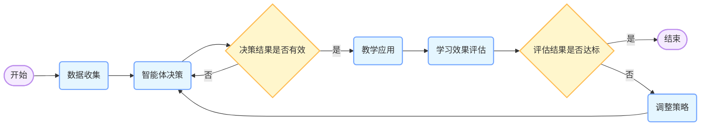

# AI多智能体系统如何改进传统的价值投资师资培养模式

> 关键词：AI多智能体系统、价值投资师资培养、传统模式改进、智能协作、数据分析

> 摘要：本文聚焦于探讨AI多智能体系统对传统价值投资师资培养模式的改进。首先介绍了研究的背景、目的、预期读者等信息，阐述了AI多智能体系统和价值投资师资培养的核心概念及联系。接着详细讲解了相关核心算法原理、数学模型和公式，并通过项目实战展示了如何利用AI多智能体系统辅助培养师资。分析了其在实际应用场景中的表现，推荐了学习资源、开发工具框架以及相关论文著作。最后总结了未来发展趋势与挑战，解答常见问题并提供扩展阅读和参考资料，旨在为提升价值投资师资培养质量提供新的思路和方法。

## 1. 背景介绍 
### 1.1 目的和范围
随着金融市场的不断发展和复杂化，价值投资作为一种重要的投资策略，对专业师资的需求日益增长。传统的价值投资师资培养模式存在着教学方法单一、缺乏实践模拟、难以适应市场快速变化等问题。本研究旨在探讨AI多智能体系统如何改进传统的价值投资师资培养模式，提高师资的专业素养和教学能力，使其能够更好地应对市场挑战。研究范围涵盖了AI多智能体系统的基本原理、价值投资师资培养的关键环节以及两者结合的具体方式和效果。

### 1.2 预期读者
本文的预期读者主要包括金融教育机构的教师和管理人员、从事价值投资研究和实践的专业人士、对AI技术在金融教育领域应用感兴趣的科研人员以及相关专业的学生。这些读者希望通过了解AI多智能体系统在价值投资师资培养中的应用，获取新的教学理念和方法，提升自身的专业水平和竞争力。

### 1.3 文档结构概述
本文将按照以下结构展开：首先介绍AI多智能体系统和价值投资师资培养的核心概念与联系，为后续讨论奠定基础；接着详细阐述核心算法原理和具体操作步骤，通过Python代码进行说明；然后介绍相关的数学模型和公式，并举例说明其应用；通过项目实战展示AI多智能体系统在价值投资师资培养中的具体实现和效果；分析其实际应用场景；推荐学习资源、开发工具框架和相关论文著作；总结未来发展趋势与挑战；解答常见问题并提供扩展阅读和参考资料。

### 1.4 术语表
#### 1.4.1 核心术语定义
- **AI多智能体系统（AI Multi - Agent System）**：由多个智能体组成的系统，每个智能体具有一定的自主性和智能，能够感知环境、进行决策并与其他智能体进行交互，以实现共同的目标。
- **价值投资（Value Investing）**：一种投资策略，投资者通过分析公司的基本面，寻找被低估的股票，长期持有以获取价值回归带来的收益。
- **师资培养（Teacher Training）**：通过各种教育和培训手段，提高教师的专业知识、教学技能和综合素质，使其能够胜任教学工作。

#### 1.4.2 相关概念解释
- **智能体（Agent）**：在AI多智能体系统中，智能体是具有感知、决策和行动能力的实体。它可以是软件程序、机器人或其他具有智能的设备。
- **协作学习（Collaborative Learning）**：学习者通过合作的方式共同完成学习任务，促进知识共享和技能提升。
- **模拟交易（Simulated Trading）**：在虚拟的交易环境中进行股票买卖操作，用于练习和验证投资策略，而不涉及实际资金的交易。

#### 1.4.3 缩略词列表
- **AI**：Artificial Intelligence（人工智能）
- **MAS**：Multi - Agent System（多智能体系统）

## 2. 核心概念与联系 
### 核心概念原理
#### AI多智能体系统原理
AI多智能体系统的核心原理是基于智能体的自主性和交互性。每个智能体都有自己的目标和决策机制，能够根据感知到的环境信息做出决策并采取行动。智能体之间通过通信和协作来实现共同的目标。例如，在一个金融市场模拟的多智能体系统中，每个智能体可以代表一个投资者，它们可以根据市场行情、公司财务数据等信息进行投资决策，并与其他智能体进行交易。

#### 价值投资师资培养原理
价值投资师资培养的原理是通过系统的教育和培训，使教师掌握价值投资的理论知识、分析方法和实践技能。培养过程通常包括课堂教学、案例分析、实践操作等环节，旨在提高教师的专业素养和教学能力，使其能够将价值投资的理念和方法传授给学生。

### 架构的文本示意图
AI多智能体系统改进传统价值投资师资培养模式的架构可以描述如下：

1. **数据层**：收集和存储金融市场数据、公司财务数据、宏观经济数据等，为智能体的决策提供信息支持。
2. **智能体层**：由多个智能体组成，每个智能体负责不同的任务，如市场分析、投资决策、风险评估等。智能体之间通过通信机制进行交互和协作。
3. **教学层**：将智能体系统的分析结果和决策过程融入到教学中，通过模拟交易、案例分析等方式，让教师和学生更好地理解价值投资的原理和方法。
4. **评估层**：对教师和学生的学习效果进行评估，根据评估结果调整教学策略和智能体系统的参数。

### Mermaid流程图


## 3. 核心算法原理 & 具体操作步骤 
### 核心算法原理
在AI多智能体系统用于价值投资师资培养中，常用的算法包括强化学习算法和遗传算法。

#### 强化学习算法
强化学习是一种通过智能体与环境进行交互，不断尝试和学习，以最大化累积奖励的算法。在价值投资中，智能体可以根据市场行情和投资组合的表现，采取不同的投资策略，通过不断调整策略来获取最大的收益。以Q - learning算法为例，其核心思想是通过更新Q值表来选择最优的行动。

Python代码示例：
```python
import numpy as np

# 定义Q - learning类
class QLearningAgent:
    def __init__(self, state_size, action_size, learning_rate=0.1, discount_factor=0.9):
        self.state_size = state_size
        self.action_size = action_size
        self.learning_rate = learning_rate
        self.discount_factor = discount_factor
        self.q_table = np.zeros((state_size, action_size))

    def choose_action(self, state):
        if np.random.uniform(0, 1) < 0.1:
            return np.random.choice(self.action_size)
        else:
            return np.argmax(self.q_table[state, :])

    def update_q_table(self, state, action, reward, next_state):
        predict = self.q_table[state, action]
        target = reward + self.discount_factor * np.max(self.q_table[next_state, :])
        self.q_table[state, action] = (1 - self.learning_rate) * predict + self.learning_rate * target


# 示例使用
state_size = 10
action_size = 3
agent = QLearningAgent(state_size, action_size)

# 模拟一次交互
state = 2
action = agent.choose_action(state)
reward = 1
next_state = 3
agent.update_q_table(state, action, reward, next_state)
```

#### 遗传算法
遗传算法是一种模拟自然选择和遗传机制的优化算法。在价值投资中，可以使用遗传算法来优化投资组合的权重。遗传算法通过对种群中的个体进行选择、交叉和变异操作，不断进化出更优的个体。

Python代码示例：
```python
import numpy as np

# 定义适应度函数
def fitness_function(weights, returns):
    portfolio_return = np.dot(weights, returns)
    return portfolio_return

# 遗传算法类
class GeneticAlgorithm:
    def __init__(self, population_size, chromosome_length, generations, mutation_rate):
        self.population_size = population_size
        self.chromosome_length = chromosome_length
        self.generations = generations
        self.mutation_rate = mutation_rate
        self.population = np.random.rand(population_size, chromosome_length)
        self.population = self.population / np.sum(self.population, axis=1, keepdims=True)

    def selection(self, returns):
        fitness = np.array([fitness_function(weights, returns) for weights in self.population])
        fitness = fitness / np.sum(fitness)
        selected_indices = np.random.choice(self.population_size, self.population_size, p=fitness)
        selected_population = self.population[selected_indices]
        return selected_population

    def crossover(self, parent1, parent2):
        crossover_point = np.random.randint(1, self.chromosome_length)
        child1 = np.concatenate((parent1[:crossover_point], parent2[crossover_point:]))
        child2 = np.concatenate((parent2[:crossover_point], parent1[crossover_point:]))
        return child1, child2

    def mutation(self, chromosome):
        for i in range(self.chromosome_length):
            if np.random.uniform(0, 1) < self.mutation_rate:
                chromosome[i] = np.random.rand()
        chromosome = chromosome / np.sum(chromosome)
        return chromosome

    def evolve(self, returns):
        for _ in range(self.generations):
            selected_population = self.selection(returns)
            new_population = []
            for i in range(0, self.population_size, 2):
                parent1 = selected_population[i]
                parent2 = selected_population[i + 1]
                child1, child2 = self.crossover(parent1, parent2)
                child1 = self.mutation(child1)
                child2 = self.mutation(child2)
                new_population.extend([child1, child2])
            self.population = np.array(new_population)
        best_index = np.argmax([fitness_function(weights, returns) for weights in self.population])
        best_weights = self.population[best_index]
        return best_weights


# 示例使用
population_size = 50
chromosome_length = 5
generations = 100
mutation_rate = 0.01
returns = np.random.rand(chromosome_length)
ga = GeneticAlgorithm(population_size, chromosome_length, generations, mutation_rate)
best_weights = ga.evolve(returns)
```

### 具体操作步骤
1. **数据准备**：收集金融市场数据、公司财务数据等，并进行预处理，将数据转换为适合智能体处理的格式。
2. **智能体设计**：根据不同的任务和目标，设计多个智能体，如市场分析智能体、投资决策智能体等。每个智能体需要定义其感知、决策和行动机制。
3. **算法实现**：选择合适的算法，如强化学习算法或遗传算法，实现智能体的决策过程。
4. **教学应用**：将智能体的分析结果和决策过程融入到教学中，设计模拟交易、案例分析等教学活动。
5. **评估和调整**：对教师和学生的学习效果进行评估，根据评估结果调整智能体系统的参数和教学策略。

## 4. 数学模型和公式 & 详细讲解 & 举例说明 
### 强化学习的数学模型和公式
#### Q - learning算法
Q - learning算法的核心是Q值函数 $Q(s, a)$，表示在状态 $s$ 下采取行动 $a$ 的预期累积奖励。Q值函数的更新公式为：

$$Q(s_t, a_t) \leftarrow (1 - \alpha)Q(s_t, a_t)+\alpha\left[r_t+\gamma\max_{a}Q(s_{t + 1}, a)\right]$$

其中，$s_t$ 是当前状态，$a_t$ 是当前采取的行动，$r_t$ 是当前获得的奖励，$s_{t + 1}$ 是下一个状态，$\alpha$ 是学习率，$\gamma$ 是折扣因子。

详细讲解：学习率 $\alpha$ 控制了新的经验对Q值更新的影响程度，$\alpha$ 越大，新的经验对Q值的影响越大；折扣因子 $\gamma$ 表示未来奖励的重要性，$\gamma$ 越接近1，智能体越关注未来的奖励。

举例说明：假设在一个简单的股票交易环境中，状态 $s$ 表示股票的价格区间，行动 $a$ 表示买入、卖出或持有。智能体在状态 $s_1$ 采取行动 $a_1$ 后获得奖励 $r_1$，进入状态 $s_2$。根据Q - learning算法，更新 $Q(s_1, a_1)$ 的值，以指导未来的决策。

### 遗传算法的数学模型和公式
#### 适应度函数
适应度函数 $f(x)$ 用于评估个体 $x$ 的优劣程度。在价值投资中，适应度函数可以定义为投资组合的收益率：

$$f(w)=\sum_{i = 1}^{n}w_ir_i$$

其中，$w_i$ 是第 $i$ 只股票的权重，$r_i$ 是第 $i$ 只股票的收益率，$n$ 是股票的数量。

详细讲解：适应度函数的值越大，说明个体的性能越好。通过最大化适应度函数，可以找到最优的投资组合权重。

举例说明：假设有三只股票，收益率分别为 $r_1 = 0.1$，$r_2 = 0.2$，$r_3 = 0.15$，投资组合的权重为 $w = [0.2, 0.5, 0.3]$，则适应度函数的值为 $f(w)=0.2\times0.1 + 0.5\times0.2+0.3\times0.15 = 0.165$。

#### 选择操作
选择操作是根据个体的适应度值来选择下一代的个体。常用的选择方法是轮盘赌选择，每个个体被选中的概率为：

$$P(x_i)=\frac{f(x_i)}{\sum_{j = 1}^{m}f(x_j)}$$

其中，$x_i$ 是第 $i$ 个个体，$f(x_i)$ 是其适应度值，$m$ 是种群的大小。

详细讲解：适应度值越高的个体，被选中的概率越大，从而保证了优秀的个体能够有更多的机会传递到下一代。

举例说明：假设有四个个体，适应度值分别为 $f(x_1)=0.2$，$f(x_2)=0.3$，$f(x_3)=0.1$，$f(x_4)=0.4$，则个体 $x_1$ 被选中的概率为 $P(x_1)=\frac{0.2}{0.2 + 0.3+0.1 + 0.4}=0.2$。

#### 交叉操作
交叉操作是将两个父代个体的染色体进行交换，生成子代个体。假设父代个体 $x_1$ 和 $x_2$ 的染色体分别为 $[x_{11}, x_{12}, \cdots, x_{1n}]$ 和 $[x_{21}, x_{22}, \cdots, x_{2n}]$，交叉点为 $k$，则子代个体 $y_1$ 和 $y_2$ 的染色体为：

$$y_1=[x_{11}, \cdots, x_{1k}, x_{2(k + 1)}, \cdots, x_{2n}]$$
$$y_2=[x_{21}, \cdots, x_{2k}, x_{1(k + 1)}, \cdots, x_{1n}]$$

详细讲解：交叉操作可以增加种群的多样性，有助于找到更优的解。

举例说明：假设父代个体 $x_1 = [0.2, 0.3, 0.5]$ 和 $x_2 = [0.4, 0.1, 0.5]$，交叉点 $k = 1$，则子代个体 $y_1 = [0.2, 0.1, 0.5]$，$y_2 = [0.4, 0.3, 0.5]$。

#### 变异操作
变异操作是对个体的染色体进行随机改变，以避免算法陷入局部最优。假设个体 $x$ 的染色体为 $[x_1, x_2, \cdots, x_n]$，变异率为 $p_m$，则对于每个基因 $x_i$，以概率 $p_m$ 进行变异。

详细讲解：变异操作可以引入新的基因，增加种群的多样性，提高算法的全局搜索能力。

举例说明：假设个体 $x = [0.2, 0.3, 0.5]$，变异率 $p_m = 0.1$，如果随机数小于 $0.1$，则对某个基因进行变异，如将 $x_2$ 变为 $0.4$，得到新的个体 $[0.2, 0.4, 0.5]$。

## 5. 项目实战：代码实际案例和详细解释说明 
### 5.1  开发环境搭建
#### 安装Python
首先需要安装Python，建议使用Python 3.7及以上版本。可以从Python官方网站（https://www.python.org/downloads/）下载安装包，按照安装向导进行安装。

#### 安装必要的库
在命令行中使用以下命令安装必要的库：
```bash
pip install numpy pandas matplotlib
```

### 5.2  源代码详细实现和代码解读
以下是一个使用强化学习算法实现股票交易模拟的完整代码示例：
```python
import numpy as np
import pandas as pd
import matplotlib.pyplot as plt


# 定义环境类
class StockTradingEnv:
    def __init__(self, stock_prices, initial_balance=10000, transaction_cost=0.001):
        self.stock_prices = stock_prices
        self.initial_balance = initial_balance
        self.transaction_cost = transaction_cost
        self.reset()

    def reset(self):
        self.balance = self.initial_balance
        self.shares_held = 0
        self.current_step = 0
        return self._get_state()

    def _get_state(self):
        return [self.balance, self.shares_held, self.stock_prices[self.current_step]]

    def step(self, action):
        current_price = self.stock_prices[self.current_step]
        if action == 0:  # 买入
            if self.balance > 0:
                num_shares = self.balance / current_price * (1 - self.transaction_cost)
                self.shares_held += num_shares
                self.balance = 0
        elif action == 1:  # 卖出
            if self.shares_held > 0:
                self.balance += self.shares_held * current_price * (1 - self.transaction_cost)
                self.shares_held = 0
        elif action == 2:  # 持有
            pass

        self.current_step += 1
        done = self.current_step == len(self.stock_prices) - 1
        reward = self.balance + self.shares_held * self.stock_prices[self.current_step] - self.initial_balance
        next_state = self._get_state()
        return next_state, reward, done


# 定义Q - learning类
class QLearningAgent:
    def __init__(self, state_size, action_size, learning_rate=0.1, discount_factor=0.9):
        self.state_size = state_size
        self.action_size = action_size
        self.learning_rate = learning_rate
        self.discount_factor = discount_factor
        self.q_table = np.zeros((state_size, action_size))

    def choose_action(self, state):
        if np.random.uniform(0, 1) < 0.1:
            return np.random.choice(self.action_size)
        else:
            state_index = hash(tuple(state)) % self.state_size
            return np.argmax(self.q_table[state_index, :])

    def update_q_table(self, state, action, reward, next_state):
        state_index = hash(tuple(state)) % self.state_size
        next_state_index = hash(tuple(next_state)) % self.state_size
        predict = self.q_table[state_index, action]
        target = reward + self.discount_factor * np.max(self.q_table[next_state_index, :])
        self.q_table[state_index, action] = (1 - self.learning_rate) * predict + self.learning_rate * target


# 主函数
def main():
    # 加载股票数据
    stock_prices = pd.read_csv('stock_prices.csv')['Close'].values

    # 创建环境和智能体
    env = StockTradingEnv(stock_prices)
    state_size = 1000
    action_size = 3
    agent = QLearningAgent(state_size, action_size)

    num_episodes = 100
    rewards = []

    for episode in range(num_episodes):
        state = env.reset()
        total_reward = 0
        done = False

        while not done:
            action = agent.choose_action(state)
            next_state, reward, done = env.step(action)
            agent.update_q_table(state, action, reward, next_state)
            state = next_state
            total_reward += reward

        rewards.append(total_reward)
        print(f"Episode {episode + 1}: Total Reward = {total_reward}")

    # 绘制奖励曲线
    plt.plot(rewards)
    plt.xlabel('Episode')
    plt.ylabel('Total Reward')
    plt.title('Training Rewards')
    plt.show()


if __name__ == "__main__":
    main()
```

### 5.3  代码解读与分析
#### 环境类 `StockTradingEnv`
- `__init__` 方法：初始化环境，包括股票价格数据、初始资金和交易成本。
- `reset` 方法：重置环境，将资金和持股数量恢复到初始状态，并返回当前状态。
- `_get_state` 方法：获取当前状态，包括资金、持股数量和当前股票价格。
- `step` 方法：根据智能体的行动更新环境状态，计算奖励，并返回下一个状态、奖励和是否结束的标志。

#### Q - learning类 `QLearningAgent`
- `__init__` 方法：初始化Q值表、学习率和折扣因子。
- `choose_action` 方法：根据当前状态选择行动，采用 $\epsilon$-贪心策略，以一定概率随机选择行动，否则选择Q值最大的行动。
- `update_q_table` 方法：根据Q - learning算法更新Q值表。

#### 主函数 `main`
- 加载股票数据。
- 创建环境和智能体。
- 进行多轮训练，每轮训练中智能体与环境进行交互，更新Q值表。
- 记录每轮训练的总奖励，并绘制奖励曲线。

通过这个项目实战，我们可以看到如何使用强化学习算法实现股票交易模拟，并且可以将这个模拟过程应用到价值投资师资培养中，让教师和学生更好地理解投资决策的过程。

## 6. 实际应用场景 
### 教学模拟
AI多智能体系统可以用于构建价值投资教学模拟平台，教师可以在平台上设置不同的市场场景和投资任务，让学生通过与智能体进行交互，学习价值投资的理论和实践技能。例如，在模拟平台上，学生可以扮演投资者，根据智能体提供的市场分析和投资建议进行股票交易，通过不断尝试和总结经验，提高自己的投资决策能力。

### 师资培训
对于价值投资师资的培训，AI多智能体系统可以提供更加真实和复杂的市场环境，让教师在实践中学习和掌握价值投资的最新理念和方法。通过与智能体的协作和交流，教师可以更好地理解市场动态和投资策略的应用，从而提高自己的教学水平。

### 投资研究
在投资研究领域，AI多智能体系统可以用于模拟不同投资者的行为和决策过程，分析市场的动态变化和趋势。教师可以引导学生使用多智能体系统进行投资研究，培养学生的研究能力和创新思维。

## 7. 工具和资源推荐
### 7.1 学习资源推荐
#### 7.1.1 书籍推荐
- 《人工智能：一种现代的方法》：这本书全面介绍了人工智能的基本概念、算法和应用，是学习人工智能的经典教材。
- 《价值投资：从格雷厄姆到巴菲特》：详细阐述了价值投资的理论和实践，对于理解价值投资的理念和方法非常有帮助。
- 《强化学习：原理与Python实现》：以Python代码为例，介绍了强化学习的基本算法和应用，适合初学者学习。

#### 7.1.2 在线课程
- Coursera上的“人工智能基础”课程：由知名高校的教授授课，系统介绍了人工智能的基础知识和算法。
- edX上的“价值投资原理”课程：讲解了价值投资的核心概念和分析方法，提供了丰富的案例和实践项目。
- Udemy上的“强化学习实战”课程：通过实际项目，让学员掌握强化学习的应用技巧。

#### 7.1.3 技术博客和网站
- Medium：上面有很多关于人工智能和金融科技的技术博客，作者们分享了自己的研究成果和实践经验。
- Towards Data Science：专注于数据科学和人工智能领域的技术文章，内容丰富且具有深度。
- 金融界网站：提供了大量的金融市场数据和分析报告，对于价值投资研究非常有帮助。

### 7.2 开发工具框架推荐
#### 7.2.1 IDE和编辑器
- PyCharm：一款功能强大的Python集成开发环境，提供了代码编辑、调试、版本控制等功能，适合Python项目的开发。
- Jupyter Notebook：一种交互式的开发环境，支持代码、文本、图表等多种形式的展示，非常适合数据科学和机器学习项目的开发和演示。

#### 7.2.2 调试和性能分析工具
- pdb：Python自带的调试工具，可以帮助开发者定位代码中的错误和问题。
- cProfile：用于分析Python代码的性能，找出代码中的瓶颈和耗时操作。

#### 7.2.3 相关框架和库
- TensorFlow：一个开源的机器学习框架，提供了丰富的工具和算法，用于构建和训练深度学习模型。
- PyTorch：另一个流行的深度学习框架，具有简洁易用的接口和高效的计算性能。
- Stable Baselines：一个用于强化学习的开源库，提供了多种强化学习算法的实现，方便开发者进行快速实验和开发。

### 7.3 相关论文著作推荐
#### 7.3.1 经典论文
- “Reinforcement Learning: An Introduction”：强化学习领域的经典论文，系统介绍了强化学习的基本理论和算法。
- “The Intelligent Investor”：价值投资领域的经典著作，作者本杰明·格雷厄姆提出了价值投资的核心原则和方法。

#### 7.3.2 最新研究成果
- 在ACM、IEEE等学术会议和期刊上搜索关于AI多智能体系统在金融领域应用的最新研究论文，了解该领域的前沿动态。

#### 7.3.3 应用案例分析
- 一些知名金融机构和研究机构会发布关于价值投资和人工智能应用的案例分析报告，可以通过他们的官方网站获取相关资料。

## 8. 总结：未来发展趋势与挑战
### 未来发展趋势
#### 智能化程度不断提高
随着人工智能技术的不断发展，AI多智能体系统的智能化程度将不断提高。智能体将能够更加准确地感知市场环境，做出更加合理的投资决策，并与其他智能体进行更加高效的协作。

#### 与其他技术融合
AI多智能体系统将与大数据、区块链、云计算等技术进行深度融合，为价值投资师资培养提供更加丰富和强大的工具和平台。例如，大数据技术可以提供更全面和准确的市场数据，区块链技术可以保证数据的安全性和可信度。

#### 个性化教学
利用AI多智能体系统可以实现个性化的价值投资师资培养。根据教师和学生的不同特点和需求，智能体可以提供定制化的教学方案和学习建议，提高教学效果和质量。

### 挑战
#### 数据质量和安全问题
AI多智能体系统的运行依赖于大量的金融市场数据，数据的质量和安全直接影响系统的性能和决策的准确性。如何获取高质量的数据，并保证数据的安全和隐私是一个重要的挑战。

#### 算法复杂度和可解释性
随着AI多智能体系统的复杂度不断增加，算法的复杂度也会相应提高。同时，一些深度学习算法的可解释性较差，难以让教师和学生理解智能体的决策过程。如何在保证算法性能的前提下，提高算法的可解释性是一个亟待解决的问题。

#### 伦理和法律问题
AI多智能体系统在价值投资师资培养中的应用可能会带来一些伦理和法律问题。例如，智能体的决策可能会受到数据偏差和算法漏洞的影响，导致不公平的结果。如何制定相应的伦理和法律规范，保证系统的公平性和合法性是一个重要的挑战。

## 9. 附录：常见问题与解答
### 问题1：AI多智能体系统对硬件有什么要求？
解答：AI多智能体系统的硬件要求取决于系统的规模和复杂度。对于简单的模拟系统，普通的个人电脑就可以满足要求。但对于大规模的多智能体系统，可能需要使用服务器集群或云计算平台来提供足够的计算资源。

### 问题2：如何评估AI多智能体系统在价值投资师资培养中的效果？
解答：可以从多个方面评估AI多智能体系统的效果，包括教师和学生的学习成绩、实践操作能力、对价值投资理念的理解程度等。还可以通过模拟交易的收益情况、市场分析的准确性等指标来评估系统的性能。

### 问题3：AI多智能体系统能否完全替代传统的教学方法？
解答：虽然AI多智能体系统具有很多优势，但它不能完全替代传统的教学方法。传统的教学方法可以提供面对面的交流和互动，培养学生的沟通能力和团队合作精神。AI多智能体系统可以作为传统教学方法的补充，为教师和学生提供更加丰富和多样化的学习资源和工具。

## 10. 扩展阅读 & 参考资料
### 扩展阅读
- 《人工智能与金融科技》：深入探讨了人工智能在金融领域的应用和发展趋势。
- 《机器学习实战》：通过实际案例介绍了机器学习的算法和应用，有助于进一步理解AI多智能体系统的实现原理。

### 参考资料
- 相关学术论文和研究报告，如ACM、IEEE等学术会议和期刊上发表的关于AI多智能体系统和价值投资的论文。
- 金融市场数据提供商的官方网站，如雅虎财经、东方财富等，获取金融市场数据和分析报告。

作者：AI天才研究院/AI Genius Institute & 禅与计算机程序设计艺术 /Zen And The Art of Computer Programming