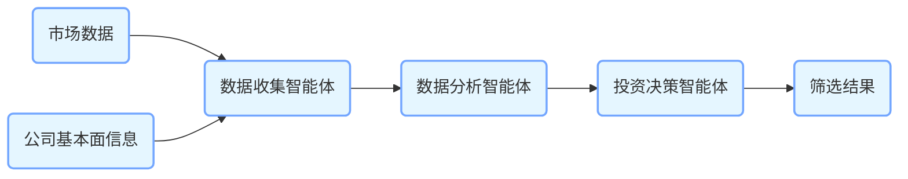

# AI多智能体系统如何改进传统的价值投资筛选方法

> 关键词：AI多智能体系统、传统价值投资筛选方法、改进策略、智能决策、市场分析

> 摘要：本文深入探讨了AI多智能体系统对传统价值投资筛选方法的改进。首先介绍了研究的背景、目的、预期读者和文档结构等内容。接着阐述了AI多智能体系统和传统价值投资筛选方法的核心概念及联系，通过Mermaid流程图展示其架构。详细讲解了核心算法原理并给出Python源代码，同时给出相关数学模型和公式及具体例子。在项目实战部分，介绍了开发环境搭建、源代码实现和代码解读。分析了该系统在实际中的应用场景，推荐了学习资源、开发工具框架和相关论文著作。最后总结了未来发展趋势与挑战，提供了常见问题解答和扩展阅读参考资料。

## 1. 背景介绍 
### 1.1 目的和范围
传统的价值投资筛选方法主要基于财务指标、行业地位等有限的信息源，依靠人工分析和经验判断。然而，随着金融市场的日益复杂和信息的爆炸式增长，这种方法在处理海量数据、捕捉市场动态变化以及应对不确定性方面显得力不从心。本研究的目的在于探讨如何利用AI多智能体系统改进传统的价值投资筛选方法，提高筛选的准确性、效率和适应性。研究范围涵盖了AI多智能体系统的基本原理、算法实现，传统价值投资筛选方法的特点和局限性，以及两者结合的具体方式和应用场景。

### 1.2 预期读者
本文预期读者包括金融投资领域的从业者，如投资经理、分析师等，他们希望借助先进的技术手段优化投资决策流程；计算机科学领域的研究者和开发者，对AI多智能体系统在金融领域的应用感兴趣；以及对金融科技和价值投资有学习需求的学生和爱好者。

### 1.3 文档结构概述
本文首先介绍背景信息，为后续内容奠定基础。接着阐述核心概念与联系，让读者了解相关技术和方法的基本原理。然后详细讲解核心算法原理和具体操作步骤，并给出数学模型和公式。通过项目实战部分展示实际应用中的代码实现和解读。分析实际应用场景，为读者提供实际参考。推荐相关的工具和资源，方便读者进一步学习和研究。最后总结未来发展趋势与挑战，提供常见问题解答和扩展阅读参考资料。

### 1.4 术语表
#### 1.4.1 核心术语定义
- **AI多智能体系统**：由多个智能体组成的系统，每个智能体具有自主决策能力，能够感知环境、与其他智能体交互，并根据一定的规则和目标进行行动，以实现系统的整体目标。
- **传统价值投资筛选方法**：基于公司的基本面分析，如财务报表、行业竞争地位等，通过设定一系列的筛选指标和标准，从众多股票中挑选出具有投资价值的股票的方法。
- **智能体**：在AI多智能体系统中，具有感知、决策和行动能力的实体，可以是软件程序或硬件设备。
- **价值投资**：一种投资策略，强调通过分析公司的内在价值，选择被低估的股票进行投资，以获取长期的投资回报。

#### 1.4.2 相关概念解释
- **市场效率**：指市场价格反映所有可用信息的程度。在有效市场中，股票价格能够迅速反映公司的基本面信息，因此价值投资筛选方法的有效性会受到一定影响。
- **信息不对称**：指市场参与者之间掌握的信息存在差异。在金融市场中，一些投资者可能拥有更多的内幕信息或专业知识，从而在投资决策中具有优势。
- **投资组合优化**：指通过合理配置不同的资产，以达到在一定风险水平下最大化投资回报或在一定回报水平下最小化风险的目的。

#### 1.4.3 缩略词列表
- **AI**：Artificial Intelligence，人工智能
- **MAS**：Multi-Agent System，多智能体系统
- **ROE**：Return on Equity，净资产收益率
- **PE**：Price-to-Earnings Ratio，市盈率

## 2. 核心概念与联系 
### 2.1 AI多智能体系统原理
AI多智能体系统由多个智能体组成，每个智能体具有一定的自主性和智能性。智能体可以感知周围环境的信息，根据自身的目标和规则进行决策，并采取相应的行动。智能体之间可以通过通信机制进行信息交换和协作，以实现系统的整体目标。例如，在一个股票投资决策的多智能体系统中，每个智能体可以负责不同的任务，如市场数据收集、财务指标分析、风险评估等。智能体之间通过共享信息和协作，共同完成投资决策的过程。

### 2.2 传统价值投资筛选方法原理
传统价值投资筛选方法主要基于公司的基本面分析。投资者通过研究公司的财务报表，如资产负债表、利润表和现金流量表，计算各种财务指标，如市盈率、市净率、净资产收益率等。同时，考虑公司的行业竞争地位、市场份额、管理层能力等因素，综合评估公司的内在价值。然后，根据设定的筛选标准，从众多股票中挑选出具有投资价值的股票。例如，投资者可能会选择市盈率低于行业平均水平、净资产收益率较高的股票进行投资。

### 2.3 两者的联系和架构示意图
AI多智能体系统可以与传统价值投资筛选方法相结合，改进其筛选过程。智能体可以利用其强大的信息处理和分析能力，收集和处理海量的市场数据和公司信息，为价值投资筛选提供更全面、准确的信息支持。同时，智能体之间的协作和交互可以提高筛选的效率和准确性。例如，一个智能体可以负责收集市场数据，另一个智能体可以对这些数据进行分析和建模，第三个智能体可以根据分析结果进行投资决策。

下面是一个简单的Mermaid流程图，展示了AI多智能体系统改进传统价值投资筛选方法的架构：



## 3. 核心算法原理 & 具体操作步骤 
### 3.1 核心算法原理
在AI多智能体系统改进传统价值投资筛选方法中，常用的算法包括机器学习算法和优化算法。机器学习算法可以用于对市场数据和公司信息进行分析和建模，预测股票的未来表现。例如，使用决策树算法可以根据不同的财务指标和市场因素，构建决策模型，判断股票是否具有投资价值。优化算法可以用于投资组合的优化，即在满足一定约束条件下，寻找最优的投资组合，以实现投资回报的最大化或风险的最小化。例如，使用遗传算法可以在众多可能的投资组合中搜索最优解。

### 3.2 Python源代码实现
以下是一个简单的Python代码示例，展示了如何使用决策树算法进行股票投资价值的预测：

```python
import pandas as pd
from sklearn.tree import DecisionTreeClassifier
from sklearn.model_selection import train_test_split
from sklearn.metrics import accuracy_score

# 读取数据
data = pd.read_csv('stock_data.csv')

# 分离特征和标签
X = data.drop('investment_value', axis=1)
y = data['investment_value']

# 划分训练集和测试集
X_train, X_test, y_train, y_test = train_test_split(X, y, test_size=0.2, random_state=42)

# 创建决策树分类器
clf = DecisionTreeClassifier()

# 训练模型
clf.fit(X_train, y_train)

# 预测
y_pred = clf.predict(X_test)

# 计算准确率
accuracy = accuracy_score(y_test, y_pred)
print(f"Accuracy: {accuracy}")
```

### 3.3 具体操作步骤
1. **数据收集**：智能体负责收集市场数据和公司基本面信息，包括股票价格、财务指标、行业数据等。
2. **数据预处理**：对收集到的数据进行清洗、转换和归一化处理，以提高数据的质量和可用性。
3. **特征选择**：从众多的特征中选择与投资价值相关性较高的特征，减少数据维度，提高模型的效率和准确性。
4. **模型训练**：使用机器学习算法对训练数据进行训练，构建投资价值预测模型。
5. **模型评估**：使用测试数据对训练好的模型进行评估，计算模型的准确率、召回率等指标，评估模型的性能。
6. **投资决策**：根据模型的预测结果，结合投资目标和风险偏好，进行投资决策，筛选出具有投资价值的股票。

## 4. 数学模型和公式 & 详细讲解 & 举例说明 
### 4.1 决策树算法的数学模型
决策树算法是一种基于树结构进行决策的机器学习算法。决策树由节点和边组成，每个内部节点表示一个特征上的测试，每个分支表示一个测试输出，每个叶节点表示一个类别或值。决策树的构建过程可以通过信息增益、基尼不纯度等指标来选择最优的特征进行划分。

信息增益的计算公式为：

$$IG(D, A) = H(D) - H(D|A)$$

其中，$IG(D, A)$ 表示特征 $A$ 对数据集 $D$ 的信息增益，$H(D)$ 表示数据集 $D$ 的熵，$H(D|A)$ 表示在特征 $A$ 给定的条件下数据集 $D$ 的条件熵。

熵的计算公式为：

$$H(D) = -\sum_{i=1}^{n}p_i\log_2p_i$$

其中，$p_i$ 表示数据集 $D$ 中第 $i$ 个类别的概率。

条件熵的计算公式为：

$$H(D|A) = \sum_{v\in Values(A)}\frac{|D^v|}{|D|}H(D^v)$$

其中，$Values(A)$ 表示特征 $A$ 的所有可能取值，$D^v$ 表示特征 $A$ 取值为 $v$ 时的数据集。

### 4.2 举例说明
假设有一个数据集 $D$ 包含 10 个样本，分为两个类别：正类和负类，其中正类有 6 个样本，负类有 4 个样本。则数据集 $D$ 的熵为：

$$H(D) = -\frac{6}{10}\log_2\frac{6}{10} - \frac{4}{10}\log_2\frac{4}{10} \approx 0.971$$

假设我们有一个特征 $A$，它有两个取值：$A_1$ 和 $A_2$。在特征 $A$ 取值为 $A_1$ 的子数据集中，有 3 个正类样本和 1 个负类样本；在特征 $A$ 取值为 $A_2$ 的子数据集中，有 3 个正类样本和 3 个负类样本。则特征 $A$ 对数据集 $D$ 的条件熵为：

$$H(D|A) = \frac{4}{10}(-\frac{3}{4}\log_2\frac{3}{4} - \frac{1}{4}\log_2\frac{1}{4}) + \frac{6}{10}(-\frac{3}{6}\log_2\frac{3}{6} - \frac{3}{6}\log_2\frac{3}{6}) \approx 0.871$$

特征 $A$ 对数据集 $D$ 的信息增益为：

$$IG(D, A) = H(D) - H(D|A) \approx 0.971 - 0.871 = 0.1$$

### 4.3 投资组合优化的数学模型
投资组合优化的目标是在满足一定约束条件下，寻找最优的投资组合，以实现投资回报的最大化或风险的最小化。常用的投资组合优化模型是马科维茨的均值 - 方差模型。

设 $x_i$ 表示投资于第 $i$ 种资产的比例，$\mu_i$ 表示第 $i$ 种资产的预期收益率，$\sigma_{ij}$ 表示第 $i$ 种资产和第 $j$ 种资产的协方差。则投资组合的预期收益率 $E(R_p)$ 和方差 $\sigma_p^2$ 分别为：

$$E(R_p) = \sum_{i=1}^{n}x_i\mu_i$$

$$\sigma_p^2 = \sum_{i=1}^{n}\sum_{j=1}^{n}x_ix_j\sigma_{ij}$$

投资组合优化问题可以表示为以下的优化模型：

$$\max E(R_p)$$

$$s.t. \quad \sigma_p^2 \leq \sigma_{max}^2$$

$$\sum_{i=1}^{n}x_i = 1$$

$$x_i \geq 0, \quad i = 1, 2, \cdots, n$$

其中，$\sigma_{max}^2$ 表示投资者能够承受的最大风险。

## 5. 项目实战：代码实际案例和详细解释说明 
### 5.1  开发环境搭建
1. **安装Python**：从Python官方网站（https://www.python.org/downloads/）下载并安装Python 3.x版本。
2. **安装必要的库**：使用pip命令安装所需的库，如pandas、scikit-learn等。
```bash
pip install pandas scikit-learn
```
3. **准备数据**：收集市场数据和公司基本面信息，并保存为CSV文件。

### 5.2  源代码详细实现和代码解读
```python
import pandas as pd
from sklearn.tree import DecisionTreeClassifier
from sklearn.model_selection import train_test_split
from sklearn.metrics import accuracy_score

# 读取数据
data = pd.read_csv('stock_data.csv')

# 代码解读：使用pandas库的read_csv函数读取CSV文件，将数据存储在DataFrame对象中。

# 分离特征和标签
X = data.drop('investment_value', axis=1)
y = data['investment_value']

# 代码解读：将数据集中的特征列（除了投资价值列）存储在X中，将投资价值列存储在y中。

# 划分训练集和测试集
X_train, X_test, y_train, y_test = train_test_split(X, y, test_size=0.2, random_state=42)

# 代码解读：使用train_test_split函数将数据集划分为训练集和测试集，测试集占总数据集的20%。

# 创建决策树分类器
clf = DecisionTreeClassifier()

# 代码解读：创建一个决策树分类器对象。

# 训练模型
clf.fit(X_train, y_train)

# 代码解读：使用训练集数据对决策树分类器进行训练。

# 预测
y_pred = clf.predict(X_test)

# 代码解读：使用训练好的模型对测试集数据进行预测。

# 计算准确率
accuracy = accuracy_score(y_test, y_pred)
print(f"Accuracy: {accuracy}")

# 代码解读：使用accuracy_score函数计算模型的准确率，并将结果打印输出。
```

### 5.3  代码解读与分析
通过上述代码，我们可以看到如何使用Python和scikit-learn库实现一个简单的股票投资价值预测模型。首先，我们读取数据并进行预处理，然后将数据集划分为训练集和测试集。接着，我们创建一个决策树分类器并使用训练集数据进行训练。最后，我们使用测试集数据进行预测，并计算模型的准确率。

从代码分析的角度来看，决策树算法具有简单易懂、可解释性强的优点，但也存在容易过拟合的问题。为了提高模型的性能，可以采用剪枝、集成学习等方法。

## 6. 实际应用场景 
### 6.1 股票筛选
AI多智能体系统可以帮助投资者从众多股票中筛选出具有投资价值的股票。智能体可以收集和分析海量的市场数据和公司信息，根据设定的筛选标准，快速准确地筛选出符合条件的股票。例如，智能体可以根据市盈率、市净率、净资产收益率等财务指标，以及行业前景、管理层能力等因素，筛选出被低估的优质股票。

### 6.2 投资组合优化
在构建投资组合时，AI多智能体系统可以根据投资者的风险偏好和投资目标，优化投资组合的配置。智能体可以通过分析不同资产之间的相关性和预期收益率，寻找最优的投资组合，以实现风险和回报的平衡。例如，智能体可以使用马科维茨的均值 - 方差模型，在满足投资者风险约束的条件下，最大化投资组合的预期收益率。

### 6.3 市场趋势预测
AI多智能体系统可以对市场趋势进行预测，帮助投资者做出更明智的投资决策。智能体可以收集和分析各种市场数据，如股票价格、成交量、宏观经济指标等，使用机器学习算法构建预测模型，预测市场的未来走势。例如，智能体可以使用时间序列分析方法，预测股票价格的短期和长期走势。

## 7. 工具和资源推荐
### 7.1 学习资源推荐
#### 7.1.1 书籍推荐
- 《人工智能：一种现代的方法》：全面介绍了人工智能的基本概念、算法和应用，是学习人工智能的经典教材。
- 《Python机器学习》：详细介绍了Python在机器学习领域的应用，包括各种机器学习算法的原理和实现。
- 《价值投资：从格雷厄姆到巴菲特》：深入探讨了价值投资的理论和实践，是价值投资领域的经典著作。

#### 7.1.2 在线课程
- Coursera上的“机器学习”课程：由斯坦福大学教授Andrew Ng主讲，是学习机器学习的经典在线课程。
- edX上的“人工智能基础”课程：介绍了人工智能的基本概念、算法和应用，适合初学者学习。
- 中国大学MOOC上的“金融投资学”课程：系统介绍了金融投资的基本理论和方法，包括价值投资、投资组合管理等内容。

#### 7.1.3 技术博客和网站
- Medium：是一个技术博客平台，上面有很多关于人工智能、机器学习和金融科技的优质文章。
- Towards Data Science：专注于数据科学和机器学习领域的技术博客，提供了很多实用的教程和案例。
- Seeking Alpha：是一个金融投资领域的网站，提供了大量的股票分析、投资策略和市场评论。

### 7.2 开发工具框架推荐
#### 7.2.1 IDE和编辑器
- PyCharm：是一款专业的Python集成开发环境，提供了丰富的功能和插件，适合Python开发。
- Jupyter Notebook：是一个交互式的开发环境，支持Python、R等多种编程语言，适合数据分析和机器学习项目的开发。
- Visual Studio Code：是一款轻量级的代码编辑器，支持多种编程语言和插件，具有强大的代码编辑和调试功能。

#### 7.2.2 调试和性能分析工具
- PDB：是Python自带的调试工具，可以帮助开发者调试Python代码。
- cProfile：是Python的性能分析工具，可以分析代码的运行时间和函数调用次数，帮助开发者优化代码性能。
- TensorBoard：是TensorFlow的可视化工具，可以帮助开发者可视化模型的训练过程和性能指标。

#### 7.2.3 相关框架和库
- scikit-learn：是一个简单易用的机器学习库，提供了各种机器学习算法的实现，如分类、回归、聚类等。
- TensorFlow：是一个开源的深度学习框架，广泛应用于图像识别、自然语言处理等领域。
- PyTorch：是另一个流行的深度学习框架，具有动态图和易于使用的特点。

### 7.3 相关论文著作推荐
#### 7.3.1 经典论文
- “A Machine Learning Approach to Stock Price Prediction”：提出了一种使用机器学习算法预测股票价格的方法。
- “Multi-Agent Systems for Financial Markets”：探讨了多智能体系统在金融市场中的应用。
- “The Intelligent Investor”：是价值投资领域的经典论文，由本杰明·格雷厄姆撰写，阐述了价值投资的基本理念和方法。

#### 7.3.2 最新研究成果
- 关注顶级学术会议和期刊，如NeurIPS、ICML、Journal of Financial Economics等，了解AI多智能体系统和价值投资领域的最新研究成果。

#### 7.3.3 应用案例分析
- 一些金融科技公司和投资机构会发布他们在AI多智能体系统和价值投资方面的应用案例，可以通过他们的官方网站或行业报告了解相关信息。

## 8. 总结：未来发展趋势与挑战
### 8.1 未来发展趋势
- **智能化程度不断提高**：随着人工智能技术的不断发展，AI多智能体系统的智能化程度将不断提高。智能体将具备更强的学习能力、推理能力和决策能力，能够更好地适应复杂多变的金融市场环境。
- **与其他技术融合**：AI多智能体系统将与区块链、物联网等技术深度融合，为价值投资筛选提供更全面、准确的信息支持。例如，区块链技术可以提供可信的交易记录和数据共享平台，物联网技术可以实时收集市场数据和公司运营信息。
- **个性化投资服务**：根据投资者的风险偏好、投资目标和财务状况，提供个性化的投资服务将成为未来的发展趋势。AI多智能体系统可以通过对投资者的行为数据和偏好进行分析，为投资者量身定制投资策略和筛选方案。

### 8.2 挑战
- **数据质量和隐私问题**：AI多智能体系统需要大量的高质量数据进行训练和决策。然而，金融市场数据往往存在噪声、缺失值和异常值等问题，影响模型的准确性和可靠性。同时，数据隐私和安全问题也是一个重要的挑战，需要采取有效的措施保护投资者的个人信息和交易数据。
- **模型解释性和可解释性**：一些复杂的机器学习模型，如深度学习模型，往往具有较高的预测准确率，但缺乏解释性。在金融投资领域，投资者需要了解模型的决策过程和依据，以便做出合理的投资决策。因此，提高模型的解释性和可解释性是一个亟待解决的问题。
- **法律法规和监管挑战**：AI多智能体系统在金融投资领域的应用涉及到法律法规和监管问题。如何确保系统的合规性，避免潜在的风险和违法行为，是需要解决的重要问题。同时，监管机构也需要制定相应的政策和标准，引导和规范AI多智能体系统在金融领域的应用。

## 9. 附录：常见问题与解答
### 9.1 AI多智能体系统的实现难度大吗？
实现AI多智能体系统需要一定的技术基础和专业知识，包括人工智能、机器学习、分布式系统等方面的知识。对于初学者来说，可能会有一定的难度。但是，随着开源框架和工具的不断发展，实现一个简单的AI多智能体系统已经变得相对容易。可以通过学习相关的教程和案例，逐步掌握AI多智能体系统的实现方法。

### 9.2 如何评估AI多智能体系统改进传统价值投资筛选方法的效果？
可以从多个方面评估AI多智能体系统改进传统价值投资筛选方法的效果。例如，可以比较改进前后筛选出的股票的投资回报率、风险指标等；可以评估模型的预测准确率、召回率等指标；还可以通过模拟交易和实际投资实验，观察系统的实际表现。

### 9.3 AI多智能体系统会完全取代传统的价值投资筛选方法吗？
虽然AI多智能体系统具有很多优势，但它不会完全取代传统的价值投资筛选方法。传统的价值投资筛选方法基于基本面分析，具有一定的理论基础和实践经验，仍然是价值投资的重要方法之一。AI多智能体系统可以作为传统方法的补充和改进，帮助投资者更好地进行投资决策。

## 10. 扩展阅读 & 参考资料
### 10.1 扩展阅读
- 《人工智能与金融科技》：深入探讨了人工智能在金融科技领域的应用和发展趋势。
- 《金融大数据分析》：介绍了金融大数据的特点、处理方法和应用案例。
- 《智能投资组合管理》：详细介绍了智能投资组合管理的理论和方法。

### 10.2 参考资料
- 相关的学术论文和研究报告，可以通过学术数据库如IEEE Xplore、ACM Digital Library等获取。
- 金融市场数据提供商的网站，如雅虎财经、东方财富网等，可以获取股票价格、财务报表等市场数据。
- 开源代码库如GitHub上的相关项目，可以参考和学习他人的代码实现。

作者：AI天才研究院/AI Genius Institute & 禅与计算机程序设计艺术 /Zen And The Art of Computer Programming