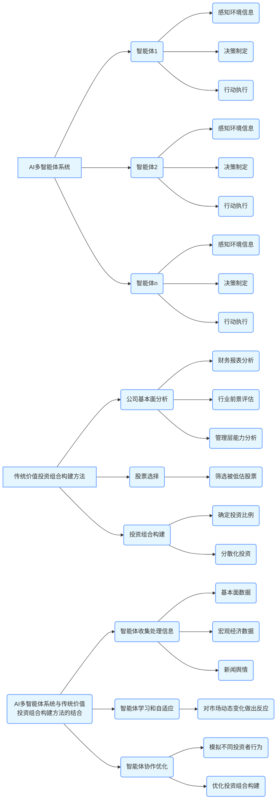

# AI多智能体系统如何改进传统的价值投资组合构建方法

> 关键词：AI多智能体系统、传统价值投资组合、构建方法改进、投资决策、市场动态

> 摘要：本文旨在探讨AI多智能体系统对传统价值投资组合构建方法的改进。首先介绍了研究的背景，包括目的、预期读者、文档结构和相关术语。接着阐述了AI多智能体系统和传统价值投资组合的核心概念及联系，并给出了相应的示意图和流程图。详细讲解了核心算法原理和具体操作步骤，同时结合数学模型和公式进行深入分析。通过项目实战展示了如何利用AI多智能体系统改进投资组合构建，包括开发环境搭建、源代码实现和解读。分析了该方法在实际中的应用场景，推荐了相关的学习资源、开发工具框架和论文著作。最后总结了未来发展趋势与挑战，解答了常见问题，并提供了扩展阅读和参考资料，以期为投资者和研究人员提供有价值的参考。

## 1. 背景介绍 
### 1.1 目的和范围
传统的价值投资组合构建方法主要基于对公司基本面的分析，如财务报表、行业前景等，通过评估股票的内在价值来选择投资标的并构建投资组合。然而，这种方法在面对复杂多变的市场环境时存在一定的局限性，如难以实时处理大量信息、对市场动态变化的反应不够灵敏等。本研究的目的是探讨如何利用AI多智能体系统改进传统的价值投资组合构建方法，提高投资组合的绩效和适应性。研究范围涵盖了AI多智能体系统的基本原理、传统价值投资组合构建方法的特点，以及两者结合的具体实现和应用。

### 1.2 预期读者
本文的预期读者包括金融投资者、金融分析师、人工智能研究人员、金融科技从业者以及对投资组合理论和人工智能应用感兴趣的学者和学生。对于投资者和分析师，本文可以提供新的投资组合构建思路和方法；对于人工智能研究人员和金融科技从业者，有助于他们了解AI在金融领域的具体应用场景；对于学者和学生，可作为相关研究和学习的参考资料。

### 1.3 文档结构概述
本文首先介绍了研究的背景信息，包括目的、预期读者和文档结构。接着阐述了AI多智能体系统和传统价值投资组合的核心概念及联系，为后续的分析奠定基础。然后详细讲解了核心算法原理和具体操作步骤，结合数学模型和公式进行深入分析。通过项目实战展示了如何利用AI多智能体系统改进投资组合构建，包括开发环境搭建、源代码实现和解读。分析了该方法在实际中的应用场景，推荐了相关的学习资源、开发工具框架和论文著作。最后总结了未来发展趋势与挑战，解答了常见问题，并提供了扩展阅读和参考资料。

### 1.4 术语表
#### 1.4.1 核心术语定义
- **AI多智能体系统**：由多个智能体组成的系统，每个智能体具有一定的自主决策能力和智能行为，能够感知环境并与其他智能体进行交互，共同完成特定的任务。
- **传统价值投资组合**：基于价值投资理念构建的投资组合，通过对公司基本面的分析，选择被低估的股票进行投资，以获取长期的投资回报。
- **投资组合绩效**：衡量投资组合表现的指标，通常包括收益率、风险等方面。

#### 1.4.2 相关概念解释
- **智能体**：具有感知、决策和行动能力的实体，可以是软件程序、机器人等。在AI多智能体系统中，智能体能够根据自身的目标和环境信息做出决策，并采取相应的行动。
- **价值投资**：一种投资策略，强调通过分析公司的内在价值来选择投资标的，认为股票价格会围绕其内在价值波动，投资者可以通过购买被低估的股票获得长期收益。
- **市场动态**：指市场价格、交易量、投资者情绪等因素随时间的变化情况，反映了市场的不确定性和复杂性。

#### 1.4.3 缩略词列表
- **AI**：Artificial Intelligence，人工智能
- **MDP**：Markov Decision Process，马尔可夫决策过程

## 2. 核心概念与联系 
### 2.1 AI多智能体系统原理
AI多智能体系统由多个智能体组成，每个智能体具有一定的自主性和智能性。智能体可以感知环境信息，根据自身的目标和知识进行决策，并采取相应的行动。智能体之间可以通过通信和协作来完成共同的任务。在AI多智能体系统中，智能体的行为通常基于一定的算法和规则，如强化学习、遗传算法等。

### 2.2 传统价值投资组合构建方法原理
传统价值投资组合构建方法主要基于对公司基本面的分析。投资者通过研究公司的财务报表、行业前景、管理层能力等因素，评估公司的内在价值。然后选择被低估的股票，按照一定的比例构建投资组合。在构建过程中，通常会考虑投资组合的分散化，以降低风险。

### 2.3 两者的联系
AI多智能体系统可以为传统价值投资组合构建方法带来多方面的改进。首先，智能体可以实时收集和处理大量的市场信息，包括公司基本面数据、宏观经济数据、新闻舆情等，提高信息处理的效率和准确性。其次，智能体可以通过学习和自适应机制，对市场动态变化做出快速反应，及时调整投资组合。此外，多个智能体之间的协作可以模拟不同投资者的行为和决策过程，提供更全面的投资视角，从而优化投资组合的构建。

### 2.4 文本示意图
```plaintext
AI多智能体系统
|-- 智能体1
|   |-- 感知环境信息
|   |-- 决策制定
|   |-- 行动执行
|-- 智能体2
|   |-- 感知环境信息
|   |-- 决策制定
|   |-- 行动执行
|--...
|-- 智能体n
|   |-- 感知环境信息
|   |-- 决策制定
|   |-- 行动执行

传统价值投资组合构建方法
|-- 公司基本面分析
|   |-- 财务报表分析
|   |-- 行业前景评估
|   |-- 管理层能力分析
|-- 股票选择
|   |-- 筛选被低估股票
|-- 投资组合构建
|   |-- 确定投资比例
|   |-- 分散化投资

AI多智能体系统与传统价值投资组合构建方法的结合
|-- 智能体收集处理信息
|   |-- 基本面数据
|   |-- 宏观经济数据
|   |-- 新闻舆情
|-- 智能体学习和自适应
|   |-- 对市场动态变化做出反应
|-- 智能体协作优化
|   |-- 模拟不同投资者行为
|   |-- 优化投资组合构建
```

### 2.5 Mermaid流程图


## 3. 核心算法原理 & 具体操作步骤 
### 3.1 核心算法原理
在AI多智能体系统改进传统价值投资组合构建方法中，常用的核心算法包括强化学习算法和多智能体协作算法。

#### 3.1.1 强化学习算法
强化学习是一种通过智能体与环境进行交互，不断尝试不同的行动并根据环境反馈的奖励信号来学习最优策略的算法。在投资组合构建中，智能体可以将投资组合的调整作为行动，将投资组合的绩效（如收益率、风险等）作为奖励信号。智能体通过不断尝试不同的投资组合调整策略，学习到能够最大化奖励的最优投资组合调整策略。

常用的强化学习算法有Q - learning算法和深度Q网络（DQN）算法。以Q - learning算法为例，其核心思想是通过一个Q表来存储每个状态 - 行动对的价值。智能体在每个时间步根据当前状态选择一个行动，执行该行动后观察环境的反馈（奖励和下一个状态），然后更新Q表中的值。Q表的更新公式为：

$$Q(s_t, a_t) \leftarrow Q(s_t, a_t) + \alpha \left[r_{t+1} + \gamma \max_{a} Q(s_{t+1}, a) - Q(s_t, a_t)\right]$$

其中，$s_t$ 是当前状态，$a_t$ 是当前行动，$r_{t+1}$ 是执行行动后获得的奖励，$s_{t+1}$ 是下一个状态，$\alpha$ 是学习率，$\gamma$ 是折扣因子。

#### 3.1.2 多智能体协作算法
多智能体协作算法用于协调多个智能体之间的行为，以实现共同的目标。在投资组合构建中，多个智能体可以分别负责不同的任务，如基本面分析、市场趋势预测、风险评估等。智能体之间通过通信和协作，共享信息和决策结果，共同优化投资组合的构建。

常用的多智能体协作算法有合同网协议（Contract Net Protocol）和分布式约束优化算法（Distributed Constraint Optimization Algorithm）。合同网协议通过招标 - 投标 - 中标机制，实现任务的分配和协作。

### 3.2 具体操作步骤
#### 3.2.1 数据收集与预处理
- **数据收集**：收集公司的基本面数据（如财务报表数据、市盈率、市净率等）、宏观经济数据（如GDP增长率、通货膨胀率等）、市场交易数据（如股票价格、交易量等）以及新闻舆情数据。
- **数据预处理**：对收集到的数据进行清洗、归一化和特征提取等操作。清洗数据是指去除噪声和异常值；归一化是将数据缩放到一个合适的范围，以便于算法处理；特征提取是从原始数据中提取出有价值的特征，如计算技术指标、文本情感分析等。

#### 3.2.2 智能体初始化
- **定义智能体的状态空间**：状态空间包括公司基本面特征、市场环境特征等。例如，公司的市盈率、市净率、行业排名，市场的整体收益率、波动率等。
- **定义智能体的行动空间**：行动空间包括投资组合的调整操作，如买入、卖出、持有不同比例的股票。
- **初始化智能体的策略**：可以采用随机策略或基于经验的策略作为初始策略。

#### 3.2.3 智能体学习与决策
- **智能体与环境交互**：智能体根据当前状态选择一个行动，执行该行动后观察环境的反馈（奖励和下一个状态）。
- **更新智能体的策略**：根据强化学习算法（如Q - learning算法）更新智能体的Q表或神经网络参数，以提高策略的性能。
- **多智能体协作**：多个智能体之间通过通信和协作，共享信息和决策结果，共同优化投资组合的构建。

#### 3.2.4 投资组合构建与调整
- **根据智能体的决策构建投资组合**：根据智能体选择的行动，确定投资组合中各个股票的投资比例。
- **定期评估和调整投资组合**：根据市场动态变化和投资组合的绩效，定期对投资组合进行评估和调整，以保证投资组合的适应性和绩效。

### 3.3 Python源代码实现
```python
import numpy as np

# 定义Q - learning智能体类
class QLearningAgent:
    def __init__(self, state_size, action_size, learning_rate=0.1, discount_factor=0.9):
        self.state_size = state_size
        self.action_size = action_size
        self.learning_rate = learning_rate
        self.discount_factor = discount_factor
        # 初始化Q表
        self.q_table = np.zeros((state_size, action_size))

    def choose_action(self, state, epsilon=0.1):
        if np.random.uniform(0, 1) < epsilon:
            # 探索：随机选择一个行动
            action = np.random.choice(self.action_size)
        else:
            # 利用：选择Q值最大的行动
            action = np.argmax(self.q_table[state, :])
        return action

    def update_q_table(self, state, action, reward, next_state):
        # 根据Q - learning公式更新Q表
        self.q_table[state, action] += self.learning_rate * (
            reward + self.discount_factor * np.max(self.q_table[next_state, :]) - self.q_table[state, action]
        )


# 模拟投资环境类
class InvestmentEnvironment:
    def __init__(self, num_states, num_actions):
        self.num_states = num_states
        self.num_actions = num_actions
        self.current_state = np.random.randint(0, num_states)

    def step(self, action):
        # 模拟环境反馈
        next_state = np.random.randint(0, self.num_states)
        # 简单示例：奖励为随机值
        reward = np.random.randint(-10, 10)
        return next_state, reward


# 主程序
if __name__ == "__main__":
    num_states = 10
    num_actions = 3
    agent = QLearningAgent(num_states, num_actions)
    env = InvestmentEnvironment(num_states, num_actions)

    num_episodes = 1000
    for episode in range(num_episodes):
        state = env.current_state
        done = False
        while not done:
            action = agent.choose_action(state)
            next_state, reward = env.step(action)
            agent.update_q_table(state, action, reward, next_state)
            state = next_state
            # 简单示例：达到一定步数结束当前回合
            if np.random.rand() < 0.1:
                done = True
        print(f"Episode {episode} finished.")
```

### 3.4 代码解释
- **QLearningAgent类**：实现了Q - learning智能体的核心功能。`__init__` 方法初始化智能体的状态空间、行动空间、学习率、折扣因子和Q表；`choose_action` 方法根据当前状态选择一个行动，采用了 $\epsilon$-贪心策略；`update_q_table` 方法根据Q - learning公式更新Q表。
- **InvestmentEnvironment类**：模拟了投资环境的反馈。`__init__` 方法初始化环境的状态空间和行动空间，并随机选择一个初始状态；`step` 方法根据智能体的行动返回下一个状态和奖励。
- **主程序**：创建了一个Q - learning智能体和一个投资环境，进行了1000个回合的训练。在每个回合中，智能体与环境进行交互，选择行动，观察反馈，并更新Q表。

## 4. 数学模型和公式 & 详细讲解 & 举例说明 
### 4.1 传统价值投资组合构建的数学模型
#### 4.1.1 均值 - 方差模型
均值 - 方差模型是由哈里·马科维茨（Harry Markowitz）提出的经典投资组合理论模型。该模型的目标是在给定预期收益率的情况下，最小化投资组合的风险（方差）；或者在给定风险水平的情况下，最大化投资组合的预期收益率。

设投资组合中包含 $n$ 种资产，$w_i$ 表示第 $i$ 种资产的投资比例，$\mu_i$ 表示第 $i$ 种资产的预期收益率，$\sigma_{ij}$ 表示第 $i$ 种资产和第 $j$ 种资产的协方差。投资组合的预期收益率 $\mu_p$ 和方差 $\sigma_p^2$ 分别为：

$$\mu_p = \sum_{i = 1}^{n} w_i \mu_i$$

$$\sigma_p^2 = \sum_{i = 1}^{n} \sum_{j = 1}^{n} w_i w_j \sigma_{ij}$$

均值 - 方差模型的优化问题可以表示为：

$$\min_{w_1, w_2, \cdots, w_n} \sigma_p^2 = \sum_{i = 1}^{n} \sum_{j = 1}^{n} w_i w_j \sigma_{ij}$$

$$\text{s.t.} \quad \sum_{i = 1}^{n} w_i \mu_i = \mu_d$$

$$\sum_{i = 1}^{n} w_i = 1$$

$$w_i \geq 0, \quad i = 1, 2, \cdots, n$$

其中，$\mu_d$ 是给定的预期收益率。

#### 4.1.2 举例说明
假设有两种资产 $A$ 和 $B$，资产 $A$ 的预期收益率 $\mu_A = 0.1$，方差 $\sigma_A^2 = 0.04$，资产 $B$ 的预期收益率 $\mu_B = 0.15$，方差 $\sigma_B^2 = 0.09$，两种资产的协方差 $\sigma_{AB} = 0.02$。设投资组合中资产 $A$ 的投资比例为 $w_A$，资产 $B$ 的投资比例为 $w_B = 1 - w_A$。

投资组合的预期收益率为：

$$\mu_p = w_A \mu_A + w_B \mu_B = w_A \times 0.1 + (1 - w_A) \times 0.15 = 0.15 - 0.05 w_A$$

投资组合的方差为：

$$\sigma_p^2 = w_A^2 \sigma_A^2 + w_B^2 \sigma_B^2 + 2 w_A w_B \sigma_{AB}$$

$$= w_A^2 \times 0.04 + (1 - w_A)^2 \times 0.09 + 2 w_A (1 - w_A) \times 0.02$$

假设给定的预期收益率 $\mu_d = 0.12$，则有：

$$0.15 - 0.05 w_A = 0.12$$

解得 $w_A = 0.6$，$w_B = 1 - w_A = 0.4$。

将 $w_A = 0.6$ 和 $w_B = 0.4$ 代入方差公式，可得投资组合的方差为：

$$\sigma_p^2 = 0.6^2 \times 0.04 + 0.4^2 \times 0.09 + 2 \times 0.6 \times 0.4 \times 0.02 = 0.0336$$

### 4.2 AI多智能体系统改进的数学模型
#### 4.2.1 基于强化学习的模型
在基于强化学习的投资组合构建模型中，智能体的目标是最大化长期累积奖励。设 $r_t$ 表示在时间步 $t$ 获得的奖励，$\gamma$ 是折扣因子（$0 < \gamma < 1$），则长期累积奖励 $G_t$ 为：

$$G_t = \sum_{k = 0}^{\infty} \gamma^k r_{t + k}$$

智能体的策略 $\pi$ 定义了在每个状态 $s$ 下选择行动 $a$ 的概率 $\pi(a|s)$。智能体的目标是找到最优策略 $\pi^*$，使得在每个状态下的长期累积奖励期望最大，即：

$$\pi^* = \arg \max_{\pi} \mathbb{E}[G_t | s_t = s, \pi]$$

在Q - learning算法中，智能体通过学习Q值函数 $Q(s, a)$ 来逼近最优策略。Q值函数表示在状态 $s$ 下选择行动 $a$ 并遵循最优策略的长期累积奖励期望。

#### 4.2.2 举例说明
假设智能体在一个简单的投资环境中，状态空间 $S = \{s_1, s_2\}$，行动空间 $A = \{a_1, a_2\}$。初始时，Q表的值都为0。

在某一回合中，智能体从状态 $s_1$ 开始，选择行动 $a_1$，执行该行动后获得奖励 $r = 5$，并转移到状态 $s_2$。假设学习率 $\alpha = 0.1$，折扣因子 $\gamma = 0.9$。

根据Q - learning公式更新Q表：

$$Q(s_1, a_1) \leftarrow Q(s_1, a_1) + \alpha \left[r + \gamma \max_{a} Q(s_2, a) - Q(s_1, a_1)\right]$$

由于初始时 $Q(s_1, a_1) = 0$，$Q(s_2, a_1) = 0$，$Q(s_2, a_2) = 0$，则：

$$Q(s_1, a_1) = 0 + 0.1 \times (5 + 0.9 \times \max\{0, 0\} - 0) = 0.5$$

### 4.3 多智能体协作的数学模型
#### 4.3.1 基于合同网协议的模型
合同网协议的核心是任务分配和协作。设 $T$ 是任务集合，$A$ 是智能体集合。每个任务 $t \in T$ 有一个任务描述 $d_t$，每个智能体 $a \in A$ 有一个能力描述 $c_a$。

当一个智能体发布一个任务时，其他智能体根据自己的能力和任务描述进行投标。投标的智能体 $a$ 会给出一个投标价值 $v_{a,t}$，表示该智能体完成任务 $t$ 的代价或收益。发布任务的智能体根据投标价值选择中标者。

#### 4.3.2 举例说明
假设有三个智能体 $A_1$，$A_2$，$A_3$ 和一个任务 $T$。任务 $T$ 的描述是对某只股票进行基本面分析。

智能体 $A_1$ 的能力是擅长财务报表分析，投标价值 $v_{A_1,T} = 10$；智能体 $A_2$ 的能力是擅长行业前景评估，投标价值 $v_{A_2,T} = 12$；智能体 $A_3$ 的能力是擅长管理层能力分析，投标价值 $v_{A_3,T} = 8$。

发布任务的智能体选择投标价值最小的智能体 $A_3$ 作为中标者，让其完成任务 $T$。

## 5. 项目实战：代码实际案例和详细解释说明 
### 5.1  开发环境搭建
#### 5.1.1 操作系统
建议使用Windows、Linux（如Ubuntu）或macOS操作系统。这些操作系统都支持Python开发环境的搭建。

#### 5.1.2 Python环境
安装Python 3.7及以上版本。可以从Python官方网站（https://www.python.org/downloads/）下载安装包进行安装。安装完成后，建议使用虚拟环境来管理项目的依赖。可以使用 `venv` 或 `conda` 来创建虚拟环境。

使用 `venv` 创建虚拟环境的命令如下：

```bash
python -m venv myenv
source myenv/bin/activate  # Linux/MacOS
myenv\Scripts\activate  # Windows
```

#### 5.1.3 依赖库安装
在虚拟环境中安装所需的依赖库，主要包括 `numpy`、`pandas`、`scikit - learn` 等。可以使用 `pip` 进行安装：

```bash
pip install numpy pandas scikit-learn
```

### 5.2  源代码详细实现和代码解读
```python
import numpy as np
import pandas as pd
from sklearn.preprocessing import MinMaxScaler

# 定义智能体类
class PortfolioAgent:
    def __init__(self, num_stocks, learning_rate=0.1, discount_factor=0.9):
        self.num_stocks = num_stocks
        self.learning_rate = learning_rate
        self.discount_factor = discount_factor
        # 初始化Q表
        self.q_table = np.zeros((100, 2**num_stocks))

    def choose_action(self, state, epsilon=0.1):
        if np.random.uniform(0, 1) < epsilon:
            # 探索：随机选择一个行动
            action = np.random.randint(0, 2**self.num_stocks)
        else:
            # 利用：选择Q值最大的行动
            action = np.argmax(self.q_table[state, :])
        return action

    def update_q_table(self, state, action, reward, next_state):
        # 根据Q - learning公式更新Q表
        self.q_table[state, action] += self.learning_rate * (
            reward + self.discount_factor * np.max(self.q_table[next_state, :]) - self.q_table[state, action]
        )


# 模拟投资环境类
class InvestmentEnv:
    def __init__(self, stock_prices):
        self.stock_prices = stock_prices
        self.num_stocks = stock_prices.shape[1]
        self.current_step = 0
        self.state_size = 100
        self.scaler = MinMaxScaler()
        self.normalized_prices = self.scaler.fit_transform(stock_prices)

    def get_state(self):
        # 根据当前步骤和股票价格计算状态
        state = int(np.sum(self.normalized_prices[self.current_step, :]) * 100) % self.state_size
        return state

    def step(self, action):
        # 将行动转换为投资组合比例
        portfolio = []
        for i in range(self.num_stocks):
            portfolio.append((action >> i) & 1)
        portfolio = np.array(portfolio) / np.sum(portfolio)

        # 计算当前投资组合的收益率
        current_prices = self.stock_prices[self.current_step, :]
        next_prices = self.stock_prices[self.current_step + 1, :]
        returns = (next_prices - current_prices) / current_prices
        portfolio_return = np.dot(portfolio, returns)

        # 更新当前步骤
        self.current_step += 1
        next_state = self.get_state()
        done = self.current_step == len(self.stock_prices) - 1
        reward = portfolio_return

        return next_state, reward, done


# 主程序
if __name__ == "__main__":
    # 模拟股票价格数据
    num_stocks = 3
    num_steps = 100
    stock_prices = np.random.rand(num_steps, num_stocks) * 100

    agent = PortfolioAgent(num_stocks)
    env = InvestmentEnv(stock_prices)

    num_episodes = 100
    for episode in range(num_episodes):
        state = env.get_state()
        done = False
        while not done:
            action = agent.choose_action(state)
            next_state, reward, done = env.step(action)
            agent.update_q_table(state, action, reward, next_state)
            state = next_state
        print(f"Episode {episode} finished.")
```

### 5.3  代码解读与分析
#### 5.3.1 PortfolioAgent类
- **初始化**：`__init__` 方法初始化智能体的股票数量、学习率、折扣因子和Q表。Q表的行数为状态空间的大小（这里设为100），列数为行动空间的大小（$2^{num\_stocks}$ 表示所有可能的投资组合组合）。
- **选择行动**：`choose_action` 方法根据 $\epsilon$-贪心策略选择行动。当随机数小于 $\epsilon$ 时，随机选择一个行动；否则，选择Q值最大的行动。
- **更新Q表**：`update_q_table` 方法根据Q - learning公式更新Q表。

#### 5.3.2 InvestmentEnv类
- **初始化**：`__init__` 方法初始化投资环境的股票价格数据、股票数量、当前步骤、状态空间大小和归一化器。对股票价格数据进行归一化处理。
- **获取状态**：`get_state` 方法根据当前步骤和归一化后的股票价格计算状态。
- **执行步骤**：`step` 方法根据智能体的行动计算投资组合比例，计算当前投资组合的收益率作为奖励，更新当前步骤，获取下一个状态，并判断是否结束当前回合。

#### 5.3.3 主程序
- 模拟股票价格数据：生成一个 $100 \times 3$ 的随机矩阵作为股票价格数据。
- 创建智能体和环境：创建一个 `PortfolioAgent` 实例和一个 `InvestmentEnv` 实例。
- 进行训练：进行100个回合的训练，每个回合中智能体与环境进行交互，选择行动，观察反馈，并更新Q表。

## 6. 实际应用场景 
### 6.1 个人投资者
对于个人投资者来说，AI多智能体系统改进的投资组合构建方法可以帮助他们更好地管理自己的投资。个人投资者通常缺乏专业的投资知识和分析能力，难以实时跟踪和分析大量的市场信息。通过使用AI多智能体系统，个人投资者可以利用智能体的信息处理和决策能力，构建更优化的投资组合。例如，智能体可以根据个人投资者的风险偏好和投资目标，自动筛选出符合条件的股票，并动态调整投资组合，以适应市场变化。

### 6.2 金融机构
金融机构，如银行、基金公司、证券公司等，管理着大量的资产，需要构建高效的投资组合来实现资产的保值增值。AI多智能体系统可以为金融机构提供更全面、准确的投资分析和决策支持。多个智能体可以分别负责不同的任务，如宏观经济分析、行业研究、公司基本面评估等，通过协作和信息共享，为金融机构提供更深入的市场洞察。同时，智能体可以实时监测市场动态，及时调整投资组合，降低风险，提高投资绩效。

### 6.3 量化投资
量化投资是利用数学模型和计算机算法进行投资决策的一种投资方式。AI多智能体系统与量化投资相结合，可以进一步提升量化投资策略的性能。智能体可以通过学习和自适应机制，不断优化量化投资策略，提高策略的适应性和盈利能力。例如，智能体可以根据市场的不同阶段和行情，自动调整量化模型的参数，选择更合适的投资标的和交易时机。

### 6.4 风险管理
在投资过程中，风险管理是至关重要的。AI多智能体系统可以帮助投资者更好地进行风险管理。智能体可以实时监测投资组合的风险状况，如市场风险、信用风险、流动性风险等，并根据风险评估结果及时调整投资组合。例如，当市场出现大幅波动时，智能体可以自动减少高风险资产的持仓比例，增加低风险资产的持仓比例，以降低投资组合的风险。

## 7. 工具和资源推荐
### 7.1 学习资源推荐
#### 7.1.1 书籍推荐
- 《智能系统中的概率推理：似然网络》（Probabilistic Reasoning in Intelligent Systems: Networks of Plausible Inference）：这本书介绍了概率图模型的基本原理和算法，对于理解多智能体系统中的不确定性推理和决策有很大帮助。
- 《强化学习：原理与Python实现》（Reinforcement Learning: An Introduction）：这是强化学习领域的经典教材，详细介绍了强化学习的基本概念、算法和应用，对于学习基于强化学习的投资组合构建方法非常有用。
- 《金融市场的数学模型》（Mathematical Models of Financial Markets）：该书介绍了金融市场的数学模型和分析方法，包括投资组合理论、期权定价模型等，有助于深入理解传统价值投资组合构建的数学原理。

#### 7.1.2 在线课程
- Coursera上的“人工智能基础”（Fundamentals of Artificial Intelligence）课程：该课程介绍了人工智能的基本概念、算法和应用，包括多智能体系统的相关内容。
- edX上的“强化学习”（Reinforcement Learning）课程：由伯克利大学开设，深入讲解了强化学习的理论和实践，提供了丰富的案例和代码实现。
- Udemy上的“量化投资实战”（Quantitative Investment Practical Combat）课程：该课程结合实际案例，介绍了量化投资的策略和方法，以及如何使用Python进行量化投资分析。

#### 7.1.3 技术博客和网站
- Towards Data Science：这是一个专注于数据科学和人工智能的技术博客平台，上面有很多关于AI多智能体系统和金融投资的文章和案例分享。
- arXiv：一个预印本服务器，提供了大量的学术论文，包括人工智能、金融领域的最新研究成果。
- QuantNet：一个量化投资社区，汇集了众多量化投资从业者和研究者，提供了丰富的量化投资资源和讨论。

### 7.2 开发工具框架推荐
#### 7.2.1 IDE和编辑器
- PyCharm：一款专业的Python集成开发环境，提供了丰富的代码编辑、调试、代码分析等功能，适合Python项目的开发。
- Jupyter Notebook：一种交互式的开发环境，支持Python代码的编写、运行和可视化，非常适合数据探索和模型实验。
- Visual Studio Code：一款轻量级的代码编辑器，支持多种编程语言，通过安装Python扩展可以方便地进行Python开发。

#### 7.2.2 调试和性能分析工具
- pdb：Python自带的调试工具，可以帮助开发者定位和解决代码中的问题。
- cProfile：Python的性能分析工具，可以分析代码的运行时间和函数调用情况，帮助开发者优化代码性能。
- TensorBoard：TensorFlow提供的可视化工具，可以用于可视化神经网络的训练过程和性能指标。

#### 7.2.3 相关框架和库
- NumPy：Python的数值计算库，提供了高效的多维数组对象和数学函数，是Python科学计算的基础库。
- Pandas：用于数据处理和分析的Python库，提供了DataFrame和Series等数据结构，方便进行数据清洗、转换和分析。
- Scikit - learn：一个机器学习库，提供了丰富的机器学习算法和工具，如分类、回归、聚类等，可用于数据预处理和模型训练。
- TensorFlow和PyTorch：深度学习框架，提供了强大的神经网络构建和训练功能，可用于实现基于深度学习的智能体模型。

### 7.3 相关论文著作推荐
#### 7.3.1 经典论文
- “Portfolio Selection”（Harry Markowitz, 1952）：这篇论文提出了均值 - 方差模型，奠定了现代投资组合理论的基础。
- “Reinforcement Learning: A Survey”（Richard S. Sutton and Andrew G. Barto, 1998）：这是强化学习领域的经典综述论文，系统介绍了强化学习的基本概念、算法和应用。
- “Multiagent Systems: A Modern Approach to Distributed Artificial Intelligence”（Gerhard Weiss, 1999）：该书是多智能体系统领域的经典著作，介绍了多智能体系统的基本原理、算法和应用。

#### 7.3.2 最新研究成果
- 关注顶级学术会议如NeurIPS（神经信息处理系统大会）、ICML（国际机器学习会议）、AAAI（美国人工智能协会年会）上发表的关于AI多智能体系统和金融投资的论文，了解最新的研究进展。
- 查阅《Journal of Financial Economics》《Journal of Financial and Quantitative Analysis》等金融领域的顶级期刊，获取关于投资组合理论和实践的最新研究成果。

#### 7.3.3 应用案例分析
- 一些金融科技公司和研究机构会发布关于AI多智能体系统在金融投资领域的应用案例报告。可以关注这些报告，了解实际应用中的经验和挑战。
- 参考一些知名投资机构的研究报告和投资策略，学习他们如何应用先进的技术和方法改进投资组合构建。

## 8. 总结：未来发展趋势与挑战
### 8.1 未来发展趋势
#### 8.1.1 与深度学习的深度融合
随着深度学习技术的不断发展，AI多智能体系统将与深度学习进行更深度的融合。深度学习可以帮助智能体更好地处理复杂的非结构化数据，如图像、文本等，从而提高智能体对市场信息的理解和分析能力。例如，通过使用卷积神经网络（CNN）处理新闻图片和视频，使用循环神经网络（RNN）处理新闻文本，智能体可以获取更全面的市场舆情信息，为投资决策提供更有力的支持。

#### 8.1.2 多模态信息处理
未来的AI多智能体系统将能够处理多模态信息，包括文本、图像、音频、视频等。通过融合多种模态的信息，智能体可以更全面地了解市场情况和公司基本面，提高投资决策的准确性。例如，结合公司的财务报表文本信息、产品图片信息和管理层演讲音频信息，智能体可以更深入地评估公司的价值和发展潜力。

#### 8.1.3 跨领域应用拓展
AI多智能体系统在投资组合构建领域的成功应用将推动其向其他金融领域和非金融领域拓展。在金融领域，可应用于风险管理、资产定价、交易策略优化等方面；在非金融领域，可应用于供应链管理、交通调度、能源管理等领域。通过跨领域应用，AI多智能体系统将发挥更大的价值。

#### 8.1.4 自主进化和自适应能力提升
未来的智能体将具有更强的自主进化和自适应能力。智能体可以根据市场环境的变化和自身的经验，自动调整学习策略和决策规则，不断优化自身的性能。例如，当市场出现新的趋势或模式时，智能体可以快速学习并适应，调整投资组合策略，以获取更好的投资回报。

### 8.2 挑战
#### 8.2.1 数据质量和隐私问题
AI多智能体系统的性能高度依赖于数据的质量。在金融领域，数据可能存在噪声、缺失值和错误等问题，需要进行有效的数据清洗和预处理。同时，金融数据涉及大量的个人隐私和商业机密，数据的收集、存储和使用需要遵守严格的法律法规和隐私政策，如何在保护数据隐私的前提下充分利用数据是一个挑战。

#### 8.2.2 模型可解释性
深度学习和强化学习等模型通常具有较高的复杂度，其决策过程难以解释。在金融投资领域，投资者和监管机构通常需要了解投资决策的依据和风险。因此，如何提高AI多智能体系统模型的可解释性，让投资者和监管机构能够理解和信任模型的决策，是一个亟待解决的问题。

#### 8.2.3 智能体协作和协调
在多智能体系统中，多个智能体之间的协作和协调是一个复杂的问题。智能体可能具有不同的目标、策略和知识，如何确保智能体之间能够有效地通信和协作，避免冲突和矛盾，实现共同的目标，是一个挑战。

#### 8.2.4 市场不确定性和黑天鹅事件
金融市场具有高度的不确定性，经常会出现黑天鹅事件（如金融危机、重大政策变化等）。这些事件往往超出了智能体的学习经验和预期，可能导致智能体的决策失效。如何让智能体在面对市场不确定性和黑天鹅事件时具有足够的鲁棒性和适应性，是一个重要的挑战。

## 9. 附录：常见问题与解答
### 9.1 AI多智能体系统的计算复杂度高吗？
AI多智能体系统的计算复杂度取决于多个因素，如智能体的数量、状态空间和行动空间的大小、算法的复杂度等。一般来说，随着智能体数量和状态空间、行动空间的增大，计算复杂度会显著增加。例如，在基于强化学习的多智能体系统中，Q表的大小与状态空间和行动空间的乘积成正比，当状态空间和行动空间较大时，Q表的存储和更新会带来较高的计算开销。然而，通过采用一些优化算法和技术，如函数逼近、并行计算等，可以在一定程度上降低计算复杂度。

### 9.2 AI多智能体系统能完全替代人类投资者吗？
目前来看，AI多智能体系统不能完全替代人类投资者。虽然AI多智能体系统具有强大的信息处理和决策能力，可以快速分析大量的数据和市场信息，提供优化的投资组合建议，但人类投资者具有独特的优势。人类投资者具有直觉、创造力和情感理解能力，能够在复杂的市场环境中做出灵活的决策。同时，人类投资者可以考虑到一些非量化的因素，如政治、文化、社会等因素对市场的影响。因此，AI多智能体系统更适合作为人类投资者的辅助工具，与人类投资者相互协作，共同做出更明智的投资决策。

### 9.3 如何评估AI多智能体系统改进的投资组合构建方法的性能？
评估AI多智能体系统改进的投资组合构建方法的性能可以从多个方面进行。常用的评估指标包括收益率、风险（如标准差、夏普比率等）、最大回撤等。收益率反映了投资组合的盈利水平，风险指标衡量了投资组合的波动程度，最大回撤表示投资组合在一段时间内的最大损失。此外，还可以通过与传统投资组合构建方法进行对比实验，评估改进方法的优势和效果。在实际应用中，还需要考虑投资组合的稳定性、适应性等因素。

### 9.4 AI多智能体系统在投资组合构建中的应用是否存在法律和监管风险？
AI多智能体系统在投资组合构建中的应用可能存在一定的法律和监管风险。一方面，智能体的决策过程可能难以解释，这可能不符合监管机构对投资决策透明度的要求。另一方面，智能体的决策可能受到数据质量和算法偏差的影响，导致不公平的投资结果，从而引发法律纠纷。因此，在应用AI多智能体系统进行投资组合构建时，需要遵守相关的法律法规和监管要求，确保投资决策的合法性、公平性和透明度。

## 10. 扩展阅读 & 参考资料
### 10.1 扩展阅读
- 《人工智能：一种现代方法》（Artificial Intelligence: A Modern Approach）：这本书全面介绍了人工智能的各个领域，包括多智能体系统、机器学习、自然语言处理等，是人工智能领域的经典教材。
- 《金融科技：应用与创新》（Fintech: Applications and Innovations）：该书介绍了金融科技的最新发展和应用，包括AI在金融投资领域的应用案例和实践经验。
- 《算法交易与量化投资：原理、策略与技术》（Algorithmic Trading and Quantitative Investing: Principles, Strategies, and Techniques）：详细介绍了算法交易和量化投资的原理、策略和技术，对于理解AI多智能体系统在投资组合构建中的应用有很大帮助。

### 10.2 参考资料
- Markowitz, H. (1952). Portfolio Selection. The Journal of Finance, 7(1), 77 - 91.
- Sutton, R. S., & Barto, A. G. (1998). Reinforcement Learning: An Introduction. MIT Press.
- Weiss, G.