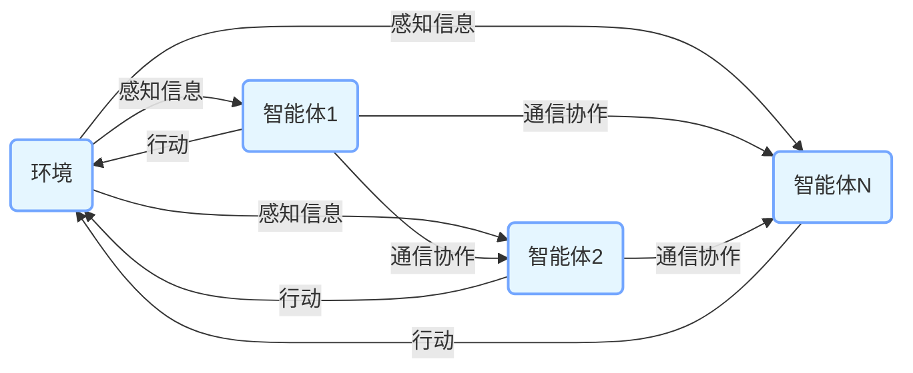

# AI多智能体系统如何改进传统的价值投资风险管理方法

> 关键词：AI多智能体系统、价值投资、风险管理、传统方法改进、智能决策

> 摘要：本文聚焦于探讨AI多智能体系统对传统价值投资风险管理方法的改进。首先介绍了相关背景，包括研究目的、预期读者等内容。接着阐述了核心概念，如AI多智能体系统、价值投资风险管理等，并给出了相应的原理和架构示意图。详细讲解了核心算法原理，通过Python代码进行具体说明，同时给出了数学模型和公式并举例。在项目实战部分，展示了开发环境搭建、源代码实现及解读。还分析了实际应用场景，推荐了相关工具和资源。最后总结了未来发展趋势与挑战，解答了常见问题并提供了扩展阅读和参考资料，旨在全面揭示AI多智能体系统在改进传统价值投资风险管理方法上的作用和潜力。

## 1. 背景介绍 
### 1.1 目的和范围
在当今复杂多变的金融市场环境下，价值投资作为一种重要的投资策略，其风险管理至关重要。传统的价值投资风险管理方法虽然有一定的成效，但在处理海量数据、快速变化的市场动态以及复杂的投资决策等方面存在明显的局限性。本研究的目的在于深入探讨AI多智能体系统如何对传统的价值投资风险管理方法进行改进，以提高风险管理的效率和准确性，为投资者提供更科学、更有效的投资决策支持。

研究范围涵盖了AI多智能体系统的基本概念、原理和架构，传统价值投资风险管理方法的特点和不足，以及AI多智能体系统在价值投资风险管理中的具体应用和改进方式。同时，通过实际案例分析和代码实现，验证AI多智能体系统在改进风险管理方法方面的有效性。

### 1.2 预期读者
本文的预期读者主要包括金融领域的投资者、投资经理、风险管理专家，以及对人工智能在金融领域应用感兴趣的研究人员和技术人员。对于投资者和投资经理来说，了解AI多智能体系统如何改进传统的价值投资风险管理方法，有助于他们优化投资决策，降低投资风险；对于风险管理专家，本文可以为他们提供新的风险管理思路和方法；对于研究人员和技术人员，本文可以为他们在相关领域的研究和开发提供参考。

### 1.3 文档结构概述
本文将按照以下结构进行组织：首先介绍背景信息，包括研究目的、预期读者和文档结构概述；接着阐述核心概念，包括AI多智能体系统和价值投资风险管理的相关概念及它们之间的联系，并给出原理和架构示意图；然后详细讲解核心算法原理和具体操作步骤，通过Python代码进行说明；随后介绍数学模型和公式，并举例说明；在项目实战部分，展示开发环境搭建、源代码实现和代码解读；接着分析实际应用场景；推荐相关的工具和资源；最后总结未来发展趋势与挑战，解答常见问题并提供扩展阅读和参考资料。

### 1.4 术语表
#### 1.4.1 核心术语定义
- **AI多智能体系统（AI Multi - Agent System）**：由多个智能体组成的系统，每个智能体具有一定的自主性、学习能力和决策能力，它们之间可以通过通信和协作来完成复杂的任务。
- **价值投资（Value Investing）**：一种投资策略，投资者通过分析股票的内在价值，寻找被低估的股票进行投资，以期在长期获得超过市场平均水平的回报。
- **风险管理（Risk Management）**：识别、评估和应对投资过程中可能面临的风险的过程，旨在降低风险对投资收益的影响。

#### 1.4.2 相关概念解释
- **智能体（Agent）**：在AI多智能体系统中，智能体是一个具有感知、决策和行动能力的实体。它可以感知环境信息，根据自身的目标和知识进行决策，并采取相应的行动。
- **内在价值（Intrinsic Value）**：股票的内在价值是指股票所代表的公司的真实价值，它基于公司的基本面因素，如财务状况、盈利能力、行业前景等进行评估。
- **风险评估（Risk Assessment）**：对投资过程中可能面临的风险进行识别、分析和量化的过程，以确定风险的大小和可能性。

#### 1.4.3 缩略词列表
- **AI**：Artificial Intelligence（人工智能）
- **MAS**：Multi - Agent System（多智能体系统）
- **VAR**：Value at Risk（风险价值）

## 2. 核心概念与联系 

### 2.1 AI多智能体系统的原理和架构
AI多智能体系统由多个智能体组成，每个智能体可以独立地感知环境、进行决策和行动，同时也可以与其他智能体进行通信和协作。智能体的基本结构包括感知模块、决策模块和行动模块。感知模块负责收集环境信息，决策模块根据感知到的信息和自身的目标进行决策，行动模块则根据决策结果采取相应的行动。

智能体之间的通信和协作可以通过多种方式实现，如消息传递、共享知识库等。在AI多智能体系统中，智能体可以通过协作来完成单个智能体无法完成的复杂任务，提高系统的整体性能。

以下是AI多智能体系统的架构示意图：



### 2.2 价值投资风险管理的原理和方法
价值投资风险管理的核心是通过对投资组合的风险进行评估和控制，确保投资组合的收益与风险相匹配。传统的价值投资风险管理方法主要包括风险评估、资产配置和止损策略等。

风险评估是价值投资风险管理的基础，通过对股票的基本面因素、市场波动等进行分析，评估投资组合的风险水平。常用的风险评估指标包括风险价值（VAR）、标准差等。

资产配置是指根据投资者的风险偏好和投资目标，将资金分配到不同的资产类别中，以降低投资组合的风险。常见的资产配置方法包括分散投资、动态资产配置等。

止损策略是指在投资过程中，当股票价格下跌到一定程度时，及时卖出股票，以避免进一步的损失。

### 2.3 AI多智能体系统与价值投资风险管理的联系
AI多智能体系统可以为价值投资风险管理提供更强大的分析和决策能力。智能体可以通过感知市场信息，实时评估投资组合的风险水平，并根据风险评估结果进行决策。多个智能体之间可以通过协作，共同完成复杂的投资决策任务，如资产配置、止损策略制定等。

例如，一个智能体可以负责收集和分析市场数据，另一个智能体可以负责评估投资组合的风险，还有一个智能体可以负责制定资产配置策略。这些智能体之间通过通信和协作，形成一个有机的整体，提高价值投资风险管理的效率和准确性。

## 3. 核心算法原理 & 具体操作步骤 

### 3.1 核心算法原理
在AI多智能体系统中，常用的算法包括强化学习算法、遗传算法等。这里以强化学习算法为例，介绍其在价值投资风险管理中的应用原理。

强化学习是一种通过智能体与环境进行交互，不断学习最优策略的机器学习方法。在价值投资风险管理中，智能体可以将投资组合的风险水平作为环境反馈，通过不断调整投资决策，使得投资组合的风险最小化，收益最大化。

强化学习算法的核心是策略网络和价值网络。策略网络用于生成智能体的行动策略，价值网络用于评估智能体在某个状态下的价值。智能体通过与环境进行交互，不断更新策略网络和价值网络的参数，以学习最优策略。

### 3.2 具体操作步骤
以下是使用强化学习算法进行价值投资风险管理的具体操作步骤：

#### 步骤1：定义环境和状态空间
环境包括股票市场的各种信息，如股票价格、成交量等。状态空间是指智能体在某个时刻可以感知到的环境信息的集合。例如，状态空间可以包括当前投资组合的价值、股票的价格、市场的波动率等。

#### 步骤2：定义行动空间
行动空间是指智能体在某个状态下可以采取的行动的集合。在价值投资风险管理中，行动空间可以包括买入、卖出、持有等操作。

#### 步骤3：定义奖励函数
奖励函数用于评估智能体在某个状态下采取某个行动的好坏。在价值投资风险管理中，奖励函数可以根据投资组合的收益和风险进行定义。例如，奖励函数可以设置为投资组合的收益率减去风险调整后的损失。

#### 步骤4：初始化策略网络和价值网络
使用随机参数初始化策略网络和价值网络。

#### 步骤5：智能体与环境进行交互
智能体根据当前状态，通过策略网络生成行动，并将行动应用到环境中。环境根据智能体的行动，返回下一个状态和奖励。

#### 步骤6：更新策略网络和价值网络
根据智能体与环境的交互结果，使用强化学习算法更新策略网络和价值网络的参数，以提高智能体的决策能力。

#### 步骤7：重复步骤5和步骤6
不断重复步骤5和步骤6，直到智能体学习到最优策略。

### 3.3 Python代码实现
以下是一个简单的使用Python和PyTorch实现的强化学习算法进行价值投资风险管理的示例代码：

```python
import torch
import torch.nn as nn
import torch.optim as optim
import numpy as np

# 定义策略网络
class PolicyNetwork(nn.Module):
    def __init__(self, input_size, output_size):
        super(PolicyNetwork, self).__init__()
        self.fc1 = nn.Linear(input_size, 64)
        self.fc2 = nn.Linear(64, output_size)
        self.softmax = nn.Softmax(dim=1)

    def forward(self, x):
        x = torch.relu(self.fc1(x))
        x = self.fc2(x)
        x = self.softmax(x)
        return x

# 定义价值网络
class ValueNetwork(nn.Module):
    def __init__(self, input_size):
        super(ValueNetwork, self).__init__()
        self.fc1 = nn.Linear(input_size, 64)
        self.fc2 = nn.Linear(64, 1)

    def forward(self, x):
        x = torch.relu(self.fc1(x))
        x = self.fc2(x)
        return x

# 定义环境
class InvestmentEnvironment:
    def __init__(self):
        # 初始化环境参数
        self.state = np.random.rand(10)  # 初始状态
        self.reward = 0
        self.done = False

    def step(self, action):
        # 模拟环境的状态转移和奖励计算
        # 这里简单假设状态和奖励的更新
        self.state = self.state + np.random.rand(10) * 0.1
        if action == 0:  # 买入
            self.reward = np.sum(self.state) * 0.1
        elif action == 1:  # 卖出
            self.reward = -np.sum(self.state) * 0.1
        else:  # 持有
            self.reward = 0
        if np.sum(self.state) > 20:
            self.done = True
        return self.state, self.reward, self.done

    def reset(self):
        # 重置环境
        self.state = np.random.rand(10)
        self.reward = 0
        self.done = False
        return self.state

# 超参数设置
input_size = 10
output_size = 3
learning_rate = 0.001
gamma = 0.9

# 初始化网络和优化器
policy_network = PolicyNetwork(input_size, output_size)
value_network = ValueNetwork(input_size)
policy_optimizer = optim.Adam(policy_network.parameters(), lr=learning_rate)
value_optimizer = optim.Adam(value_network.parameters(), lr=learning_rate)

# 初始化环境
env = InvestmentEnvironment()

# 训练循环
num_episodes = 1000
for episode in range(num_episodes):
    state = env.reset()
    state = torch.FloatTensor(state).unsqueeze(0)
    done = False
    while not done:
        # 生成行动
        action_probs = policy_network(state)
        action = torch.multinomial(action_probs, 1).item()

        # 与环境交互
        next_state, reward, done = env.step(action)
        next_state = torch.FloatTensor(next_state).unsqueeze(0)
        reward = torch.FloatTensor([reward])

        # 计算优势函数
        value = value_network(state)
        next_value = value_network(next_state)
        advantage = reward + gamma * next_value * (1 - done) - value

        # 更新价值网络
        value_loss = advantage.pow(2).mean()
        value_optimizer.zero_grad()
        value_loss.backward(retain_graph=True)
        value_optimizer.step()

        # 更新策略网络
        log_prob = torch.log(action_probs.squeeze(0)[action])
        policy_loss = -log_prob * advantage.detach()
        policy_optimizer.zero_grad()
        policy_loss.backward()
        policy_optimizer.step()

        state = next_state

    if episode % 100 == 0:
        print(f"Episode {episode}: Reward = {reward.item()}")
```

## 4. 数学模型和公式 & 详细讲解 & 举例说明 

### 4.1 强化学习的数学模型
强化学习可以用马尔可夫决策过程（MDP）来描述。马尔可夫决策过程由一个四元组 $(S, A, P, R)$ 组成，其中：
- $S$ 是状态空间，表示智能体可以处于的所有状态的集合。
- $A$ 是行动空间，表示智能体可以采取的所有行动的集合。
- $P$ 是状态转移概率函数，表示在状态 $s$ 采取行动 $a$ 后转移到状态 $s'$ 的概率，即 $P(s'|s, a)$。
- $R$ 是奖励函数，表示在状态 $s$ 采取行动 $a$ 后获得的奖励，即 $R(s, a)$。

智能体的目标是在每个状态下选择最优的行动，使得长期累积奖励最大化。长期累积奖励可以用折扣累积奖励来表示：

$$G_t = \sum_{k=0}^{\infty} \gamma^k R_{t + k + 1}$$

其中，$G_t$ 是从时间步 $t$ 开始的折扣累积奖励，$\gamma$ 是折扣因子，$0 \leq \gamma \leq 1$，用于权衡当前奖励和未来奖励的重要性。

### 4.2 策略网络和价值网络的数学公式
#### 策略网络
策略网络 $\pi_{\theta}(a|s)$ 表示在状态 $s$ 下采取行动 $a$ 的概率，其中 $\theta$ 是策略网络的参数。策略网络通常使用神经网络来实现，其输出是一个概率分布。

#### 价值网络
价值网络 $V_{\phi}(s)$ 表示在状态 $s$ 下的价值，其中 $\phi$ 是价值网络的参数。价值网络可以通过估计折扣累积奖励来评估状态的好坏。

### 4.3 强化学习算法的更新公式
#### 策略梯度算法
策略梯度算法通过更新策略网络的参数 $\theta$ 来最大化折扣累积奖励的期望。策略梯度的计算公式为：

$$\nabla_{\theta} J(\theta) = \mathbb{E}_{\pi_{\theta}} \left[ \nabla_{\theta} \log \pi_{\theta}(a|s) Q_{\pi_{\theta}}(s, a) \right]$$

其中，$J(\theta)$ 是策略网络的目标函数，$Q_{\pi_{\theta}}(s, a)$ 是状态 - 行动价值函数，表示在状态 $s$ 采取行动 $a$ 后的期望折扣累积奖励。

在实际应用中，通常使用蒙特卡罗方法来估计策略梯度，即：

$$\nabla_{\theta} J(\theta) \approx \frac{1}{N} \sum_{i=1}^{N} \nabla_{\theta} \log \pi_{\theta}(a_i|s_i) G_i$$

其中，$N$ 是样本数量，$(s_i, a_i, G_i)$ 是第 $i$ 个样本的状态、行动和折扣累积奖励。

#### 价值网络的更新公式
价值网络的更新通常使用均方误差损失函数，即：

$$L(\phi) = \frac{1}{N} \sum_{i=1}^{N} \left( V_{\phi}(s_i) - \hat{V}_i \right)^2$$

其中，$\hat{V}_i$ 是折扣累积奖励的估计值。

### 4.4 举例说明
假设一个简单的投资场景，状态空间 $S$ 包括股票的价格和市场的波动率，行动空间 $A$ 包括买入、卖出和持有。智能体的目标是通过不断学习，在不同的状态下选择最优的行动，使得投资组合的收益最大化。

在每个时间步，智能体根据当前状态 $s$，通过策略网络生成行动 $a$，并将行动应用到环境中。环境根据智能体的行动，返回下一个状态 $s'$ 和奖励 $r$。智能体根据奖励和下一个状态，更新策略网络和价值网络的参数。

例如，在某个时间步，智能体处于状态 $s$，通过策略网络生成行动 $a$ 为买入。环境返回下一个状态 $s'$ 和奖励 $r$。智能体根据奖励 $r$ 和下一个状态 $s'$，计算折扣累积奖励 $G$，并使用策略梯度算法更新策略网络的参数，使用均方误差损失函数更新价值网络的参数。

## 5. 项目实战：代码实际案例和详细解释说明 

### 5.1  开发环境搭建
#### 操作系统
可以选择Windows、Linux或macOS操作系统。这里以Ubuntu 20.04为例进行说明。

#### Python环境
安装Python 3.7或以上版本。可以使用以下命令安装Python：

```bash
sudo apt update
sudo apt install python3 python3-pip
```

#### 依赖库安装
安装项目所需的依赖库，包括PyTorch、NumPy等。可以使用以下命令安装：

```bash
pip install torch numpy
```

### 5.2  源代码详细实现和代码解读
以下是上述强化学习算法进行价值投资风险管理的代码的详细解读：

```python
import torch
import torch.nn as nn
import torch.optim as optim
import numpy as np

# 定义策略网络
class PolicyNetwork(nn.Module):
    def __init__(self, input_size, output_size):
        super(PolicyNetwork, self).__init__()
        self.fc1 = nn.Linear(input_size, 64)
        self.fc2 = nn.Linear(64, output_size)
        self.softmax = nn.Softmax(dim=1)

    def forward(self, x):
        x = torch.relu(self.fc1(x))
        x = self.fc2(x)
        x = self.softmax(x)
        return x

```
- 这段代码定义了策略网络 `PolicyNetwork`，它是一个两层的全连接神经网络。输入层的大小为 `input_size`，隐藏层的大小为64，输出层的大小为 `output_size`。`softmax` 函数用于将输出转换为概率分布。

```python
# 定义价值网络
class ValueNetwork(nn.Module):
    def __init__(self, input_size):
        super(ValueNetwork, self).__init__()
        self.fc1 = nn.Linear(input_size, 64)
        self.fc2 = nn.Linear(64, 1)

    def forward(self, x):
        x = torch.relu(self.fc1(x))
        x = self.fc2(x)
        return x

```
- 这段代码定义了价值网络 `ValueNetwork`，它也是一个两层的全连接神经网络。输入层的大小为 `input_size`，隐藏层的大小为64，输出层的大小为1，用于输出状态的价值。

```python
# 定义环境
class InvestmentEnvironment:
    def __init__(self):
        # 初始化环境参数
        self.state = np.random.rand(10)  # 初始状态
        self.reward = 0
        self.done = False

    def step(self, action):
        # 模拟环境的状态转移和奖励计算
        # 这里简单假设状态和奖励的更新
        self.state = self.state + np.random.rand(10) * 0.1
        if action == 0:  # 买入
            self.reward = np.sum(self.state) * 0.1
        elif action == 1:  # 卖出
            self.reward = -np.sum(self.state) * 0.1
        else:  # 持有
            self.reward = 0
        if np.sum(self.state) > 20:
            self.done = True
        return self.state, self.reward, self.done

    def reset(self):
        # 重置环境
        self.state = np.random.rand(10)
        self.reward = 0
        self.done = False
        return self.state

```
- 这段代码定义了投资环境 `InvestmentEnvironment`，包括环境的初始化、状态转移和奖励计算。`step` 方法根据智能体的行动更新环境的状态和奖励，`reset` 方法用于重置环境。

```python
# 超参数设置
input_size = 10
output_size = 3
learning_rate = 0.001
gamma = 0.9

# 初始化网络和优化器
policy_network = PolicyNetwork(input_size, output_size)
value_network = ValueNetwork(input_size)
policy_optimizer = optim.Adam(policy_network.parameters(), lr=learning_rate)
value_optimizer = optim.Adam(value_network.parameters(), lr=learning_rate)

# 初始化环境
env = InvestmentEnvironment()

```
- 这段代码设置了超参数，包括输入层大小、输出层大小、学习率和折扣因子。初始化了策略网络、价值网络和优化器，并创建了投资环境的实例。

```python
# 训练循环
num_episodes = 1000
for episode in range(num_episodes):
    state = env.reset()
    state = torch.FloatTensor(state).unsqueeze(0)
    done = False
    while not done:
        # 生成行动
        action_probs = policy_network(state)
        action = torch.multinomial(action_probs, 1).item()

        # 与环境交互
        next_state, reward, done = env.step(action)
        next_state = torch.FloatTensor(next_state).unsqueeze(0)
        reward = torch.FloatTensor([reward])

        # 计算优势函数
        value = value_network(state)
        next_value = value_network(next_state)
        advantage = reward + gamma * next_value * (1 - done) - value

        # 更新价值网络
        value_loss = advantage.pow(2).mean()
        value_optimizer.zero_grad()
        value_loss.backward(retain_graph=True)
        value_optimizer.step()

        # 更新策略网络
        log_prob = torch.log(action_probs.squeeze(0)[action])
        policy_loss = -log_prob * advantage.detach()
        policy_optimizer.zero_grad()
        policy_loss.backward()
        policy_optimizer.step()

        state = next_state

    if episode % 100 == 0:
        print(f"Episode {episode}: Reward = {reward.item()}")

```
- 这段代码是训练循环，共进行 `num_episodes` 个回合的训练。在每个回合中，智能体与环境进行交互，根据策略网络生成行动，与环境交互得到下一个状态和奖励。计算优势函数，更新价值网络和策略网络的参数。每100个回合打印一次奖励信息。

### 5.3  代码解读与分析
#### 策略网络和价值网络的作用
策略网络用于生成智能体的行动策略，通过学习不同状态下的最优行动，使得智能体能够在不同的市场环境下做出合理的投资决策。价值网络用于评估状态的价值，通过学习状态的价值，帮助智能体更好地理解不同状态下的收益和风险。

#### 优势函数的作用
优势函数用于衡量在某个状态下采取某个行动相对于平均行动的优势。通过计算优势函数，智能体可以更准确地更新策略网络和价值网络的参数，提高学习效率。

#### 训练过程的分析
在训练过程中，智能体通过不断与环境进行交互，学习到最优的投资策略。随着训练的进行，智能体的决策能力逐渐提高，投资组合的收益也会逐渐增加。通过打印奖励信息，可以观察到智能体的学习效果。

## 6. 实际应用场景 
### 6.1 投资组合优化
AI多智能体系统可以用于投资组合优化，通过多个智能体的协作，分析不同资产的风险和收益特征，根据投资者的风险偏好和投资目标，制定最优的资产配置策略。例如，一个智能体可以负责分析股票市场的走势，另一个智能体可以负责评估债券市场的风险，还有一个智能体可以负责根据投资者的风险偏好进行资产配置。

### 6.2 风险预警
AI多智能体系统可以实时监测市场信息，当市场出现异常波动或投资组合的风险超过预设阈值时，及时发出风险预警。例如，一个智能体可以负责收集和分析市场数据，另一个智能体可以负责评估投资组合的风险，当风险超过阈值时，发出预警信号。

### 6.3 动态风险管理
在投资过程中，市场环境不断变化，投资组合的风险也会随之变化。AI多智能体系统可以根据市场环境的变化，动态调整投资组合的风险水平。例如，当市场行情向好时，智能体可以适当增加投资组合的风险暴露；当市场行情向坏时，智能体可以及时降低投资组合的风险暴露。

### 6.4 量化投资策略制定
AI多智能体系统可以用于量化投资策略的制定，通过对历史数据的分析和学习，发现市场中的规律和趋势，制定出有效的量化投资策略。例如，一个智能体可以负责数据挖掘和特征提取，另一个智能体可以负责模型训练和策略优化。

## 7. 工具和资源推荐
### 7.1 学习资源推荐
#### 7.1.1 书籍推荐
- 《人工智能：一种现代的方法》：全面介绍了人工智能的基本概念、算法和应用，是人工智能领域的经典教材。
- 《强化学习：原理与Python实现》：详细介绍了强化学习的基本原理和算法，并通过Python代码进行实现，适合初学者学习。
- 《价值投资：从格雷厄姆到巴菲特》：系统介绍了价值投资的理论和方法，是价值投资领域的经典著作。

#### 7.1.2 在线课程
- Coursera上的“人工智能基础”课程：由知名教授授课，全面介绍了人工智能的基本概念和算法。
- edX上的“强化学习”课程：深入讲解了强化学习的原理和应用，提供了丰富的实践案例。
- 中国大学MOOC上的“金融风险管理”课程：系统介绍了金融风险管理的理论和方法，结合实际案例进行讲解。

#### 7.1.3 技术博客和网站
- Medium：上面有很多关于人工智能和金融科技的技术博客，提供了最新的技术动态和实践经验。
- arXiv：一个开放的学术预印本平台，上面有很多关于人工智能和金融领域的研究论文。
- 集思录：一个专注于金融数据和投资策略的网站，提供了丰富的金融数据和分析工具。

### 7.2 开发工具框架推荐
#### 7.2.1 IDE和编辑器
- PyCharm：一款专业的Python集成开发环境，提供了丰富的代码编辑、调试和分析功能。
- Jupyter Notebook：一个交互式的编程环境，适合进行数据探索和模型实验。
- Visual Studio Code：一款轻量级的代码编辑器，支持多种编程语言，提供了丰富的插件和扩展。

#### 7.2.2 调试和性能分析工具
- PyTorch Profiler：PyTorch提供的性能分析工具，可以帮助开发者分析模型的性能瓶颈。
- TensorBoard：TensorFlow提供的可视化工具，可以用于可视化模型的训练过程和性能指标。
- cProfile：Python内置的性能分析工具，可以用于分析Python代码的性能。

#### 7.2.3 相关框架和库
- PyTorch：一个开源的深度学习框架，提供了丰富的神经网络模型和优化算法。
- NumPy：一个用于科学计算的Python库，提供了高效的数组操作和数学函数。
- Pandas：一个用于数据处理和分析的Python库，提供了丰富的数据结构和数据处理方法。

### 7.3 相关论文著作推荐
#### 7.3.1 经典论文
- “Reinforcement Learning: An Introduction”：强化学习领域的经典论文，系统介绍了强化学习的基本概念和算法。
- “A Markovian Decision Process”：马尔可夫决策过程的经典论文，为强化学习的理论基础奠定了基础。
- “Security Analysis”：价值投资领域的经典论文，由本杰明·格雷厄姆和大卫·多德撰写，提出了价值投资的基本理论和方法。

#### 7.3.2 最新研究成果
- 近年来，关于AI多智能体系统在金融领域应用的研究成果不断涌现。可以通过学术数据库，如IEEE Xplore、ACM Digital Library等，搜索相关的研究论文。

#### 7.3.3 应用案例分析
- 一些金融机构和科技公司会发布关于AI多智能体系统在价值投资风险管理中的应用案例。可以通过它们的官方网站、博客等渠道获取相关信息。

## 8. 总结：未来发展趋势与挑战
### 8.1 未来发展趋势
#### 智能化程度不断提高
随着人工智能技术的不断发展，AI多智能体系统的智能化程度将不断提高。智能体将具备更强的学习能力、决策能力和自适应能力，能够更好地应对复杂多变的市场环境。

#### 与其他技术的融合
AI多智能体系统将与其他技术，如区块链、大数据、云计算等深度融合。例如，区块链技术可以提供更安全、透明的交易环境，大数据技术可以提供更丰富的市场信息，云计算技术可以提供更强大的计算能力。

#### 应用场景不断拓展
AI多智能体系统在价值投资风险管理中的应用场景将不断拓展。除了投资组合优化、风险预警、动态风险管理和量化投资策略制定等应用场景外，还可能应用于投资咨询、金融监管等领域。

### 8.2 挑战
#### 数据质量和隐私问题
AI多智能体系统需要大量的高质量数据进行训练和决策。然而，金融数据的质量和隐私问题一直是困扰金融行业的难题。如何获取高质量的数据，并保护数据的隐私和安全，是AI多智能体系统面临的重要挑战。

#### 模型可解释性问题
AI多智能体系统中的模型通常是复杂的神经网络模型，其决策过程难以解释。在金融领域，模型的可解释性至关重要，因为投资者和监管机构需要了解模型的决策依据。如何提高模型的可解释性，是AI多智能体系统需要解决的问题。

#### 算法复杂度和计算资源问题
AI多智能体系统中的算法通常具有较高的复杂度，需要大量的计算资源进行训练和运行。如何降低算法的复杂度，提高计算效率，是AI多智能体系统面临的挑战之一。

## 9. 附录：常见问题与解答
### 问题1：AI多智能体系统在价值投资风险管理中的应用是否可靠？
解答：AI多智能体系统在价值投资风险管理中的应用具有一定的可靠性。通过多个智能体的协作和学习，系统可以对市场信息进行全面、深入的分析，制定出更科学、更有效的投资决策。然而，由于金融市场的复杂性和不确定性，AI多智能体系统也不能完全消除投资风险，其决策结果仍然存在一定的误差。

### 问题2：如何评估AI多智能体系统在价值投资风险管理中的效果？
解答：可以从多个方面评估AI多智能体系统在价值投资风险管理中的效果，如投资组合的收益率、风险指标（如VAR、标准差等）、夏普比率等。同时，还可以通过与传统的价值投资风险管理方法进行对比，评估AI多智能体系统的优势和不足。

### 问题3：AI多智能体系统的开发和应用需要具备哪些技术和知识？
解答：开发和应用AI多智能体系统需要具备人工智能、机器学习、金融等方面的技术和知识。具体包括强化学习算法、神经网络模型、金融市场分析、风险管理等方面的知识。同时，还需要掌握相关的编程语言和开发工具，如Python、PyTorch等。

## 10. 扩展阅读 & 参考资料
### 扩展阅读
- 《深度学习》：由Ian Goodfellow、Yoshua Bengio和Aaron Courville撰写，深入介绍了深度学习的理论和应用。
- 《金融科技前沿：技术驱动的金融创新》：介绍了金融科技领域的最新技术和应用，包括人工智能、区块链、大数据等。
- 《智能金融：科技重塑金融未来》：探讨了人工智能、区块链等技术在金融领域的应用前景和挑战。

### 参考资料
- Sutton, R. S., & Barto, A. G. (2018). Reinforcement learning: An introduction. MIT press.
- Graham, B., & Dodd, D. (1934). Security analysis. McGraw - Hill.
- 相关学术论文和研究报告，如IEEE Xplore、ACM Digital Library等数据库中的相关文献。

作者：AI天才研究院/AI Genius Institute & 禅与计算机程序设计艺术 /Zen And The Art of Computer Programming