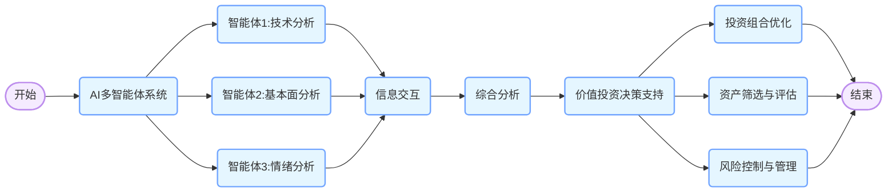

# AI多智能体系统革新价值投资：传统与科技的完美融合

> 关键词：AI多智能体系统、价值投资、传统投资、科技融合、投资革新

> 摘要：本文深入探讨了AI多智能体系统如何革新价值投资，实现传统投资与科技的完美融合。首先介绍了研究的背景、目的、预期读者和文档结构，明确相关术语。接着阐述了AI多智能体系统和价值投资的核心概念及它们之间的联系，并给出了相应的文本示意图和Mermaid流程图。详细讲解了核心算法原理和具体操作步骤，运用Python源代码进行说明。同时，给出了相关的数学模型和公式，并举例分析。通过项目实战展示了代码的实际案例及详细解释。探讨了该融合在实际中的应用场景，推荐了学习、开发工具框架和相关论文著作等资源。最后总结了未来发展趋势与挑战，解答了常见问题，并提供了扩展阅读和参考资料。

## 1. 背景介绍 
### 1.1 目的和范围
随着金融市场的日益复杂和信息技术的飞速发展，传统的价值投资方法面临着诸多挑战。价值投资强调通过对公司基本面的分析来寻找被低估的资产，但在海量数据和快速变化的市场环境下，传统方法的效率和准确性受到限制。本研究的目的在于探索如何利用AI多智能体系统革新价值投资，实现传统投资理念与先进科技的完美融合。具体范围涵盖了AI多智能体系统的原理、价值投资的核心要素、两者融合的算法和模型、实际应用案例以及相关工具和资源等方面。

### 1.2 预期读者
本文预期读者包括金融投资领域的专业人士，如基金经理、投资分析师等，他们希望借助新技术提升投资决策的效率和准确性；计算机科学和人工智能领域的研究者和开发者，对将AI技术应用于金融领域感兴趣；以及对价值投资和人工智能融合发展有兴趣的学者和爱好者，希望了解相关的理论和实践知识。

### 1.3 文档结构概述
本文将按照以下结构展开：首先介绍背景信息，包括目的、预期读者和文档结构概述，明确相关术语；接着阐述AI多智能体系统和价值投资的核心概念及它们之间的联系，并给出可视化的示意图和流程图；详细讲解核心算法原理和具体操作步骤，使用Python代码进行说明；给出相关的数学模型和公式，并举例分析；通过项目实战展示代码的实际案例及详细解释；探讨该融合在实际中的应用场景；推荐学习、开发工具框架和相关论文著作等资源；最后总结未来发展趋势与挑战，解答常见问题，并提供扩展阅读和参考资料。

### 1.4 术语表
#### 1.4.1 核心术语定义
- **AI多智能体系统（AI Multi - Agent System）**：由多个智能体组成的系统，每个智能体具有自主决策和行动的能力，它们之间通过交互和协作来完成复杂的任务。在金融投资领域，智能体可以代表不同的投资策略、市场参与者或信息源。
- **价值投资（Value Investing）**：一种投资策略，基于对公司基本面的分析，如财务状况、盈利能力、行业地位等，寻找被市场低估的资产，以长期持有为目标，期望资产价格回归其内在价值从而获得收益。
- **智能体（Agent）**：具有感知环境、自主决策和行动能力的实体，可以是软件程序、机器人等。在AI多智能体系统中，智能体能够根据自身的目标和规则与其他智能体进行交互。

#### 1.4.2 相关概念解释
- **投资组合优化**：通过合理分配资金到不同的资产上，以达到在一定风险水平下最大化预期收益或在一定预期收益水平下最小化风险的目的。
- **市场情绪分析**：对市场参与者的情绪和心理状态进行分析，以预测市场的走势和资产价格的波动。
- **协同进化**：在AI多智能体系统中，智能体之间通过相互作用和竞争，不断进化和优化自身的策略和行为。

#### 1.4.3 缩略词列表
- **AI**：Artificial Intelligence（人工智能）
- **MAS**：Multi - Agent System（多智能体系统）
- **MVO**：Mean - Variance Optimization（均值 - 方差优化）

## 2. 核心概念与联系 
### 核心概念原理
#### AI多智能体系统原理
AI多智能体系统由多个智能体组成，每个智能体具有以下几个关键特性：
- **自主性**：智能体能够独立地感知环境信息，并根据自身的目标和规则做出决策和行动，无需外部的直接干预。
- **交互性**：智能体之间可以通过某种通信机制进行信息交换和协作，以实现共同的目标或解决复杂的问题。
- **适应性**：智能体能够根据环境的变化和与其他智能体的交互结果，调整自己的策略和行为，以提高自身的性能和适应性。

在金融投资领域，AI多智能体系统可以模拟不同的市场参与者，如投资者、分析师、交易员等，每个智能体代表一种投资策略或信息源。这些智能体通过交互和协作，共同分析市场信息，做出投资决策，从而实现投资组合的优化。

#### 价值投资原理
价值投资的核心思想是寻找被市场低估的资产。其基本原理基于以下几个方面：
- **基本面分析**：通过对公司的财务报表、经营业绩、行业前景等基本面因素进行深入分析，评估公司的内在价值。
- **安全边际**：在购买资产时，要求资产的价格低于其内在价值，以提供一定的安全保障，降低投资风险。
- **长期投资**：价值投资者通常采取长期持有的策略，相信随着时间的推移，资产价格会回归其内在价值，从而获得长期的投资收益。

### 核心概念架构的文本示意图
```plaintext
                          AI多智能体系统
                          ┌──────────────────┐
                          │ 多个智能体       │
                          │ ┌────────────┐ │
                          │ │ 智能体1       │ │
                          │ │ 策略：技术分析 │ │
                          │ │ 信息源：行情数据 │ │
                          │ ├────────────┤ │
                          │ │ 智能体2       │ │
                          │ │ 策略：基本面分析 │ │
                          │ │ 信息源：财务报表 │ │
                          │ ├────────────┤ │
                          │ │ 智能体3       │ │
                          │ │ 策略：情绪分析 │ │
                          │ │ 信息源：社交媒体 │ │
                          │ └────────────┘ │
                          └──────────────────┘
                                      │
                                      │ 交互与协作
                                      ▼
                          价值投资决策支持
                          ┌──────────────────┐
                          │ 投资组合优化       │
                          │ 资产筛选与评估     │
                          │ 风险控制与管理     │
                          └──────────────────┘
```

### Mermaid流程图


## 3. 核心算法原理 & 具体操作步骤 
### 核心算法原理
在AI多智能体系统革新价值投资中，一个重要的算法是基于遗传算法的投资组合优化算法。遗传算法是一种模拟自然选择和遗传机制的优化算法，它通过模拟生物进化过程中的选择、交叉和变异操作，不断搜索最优的投资组合。

遗传算法的基本步骤如下：
1. **编码**：将投资组合表示为一个染色体，每个基因代表一种资产的投资比例。例如，假设有三种资产 $A$、$B$、$C$，一个染色体可以表示为 $[0.2, 0.3, 0.5]$，表示投资资产 $A$ 的比例为 $20\%$，资产 $B$ 的比例为 $30\%$，资产 $C$ 的比例为 $50\%$。
2. **初始化种群**：随机生成一组染色体作为初始种群。
3. **适应度评估**：根据投资组合的预期收益和风险等指标，计算每个染色体的适应度值。适应度值越高，表示该投资组合越优。
4. **选择操作**：根据适应度值选择一定数量的染色体作为父代，用于产生下一代。
5. **交叉操作**：对选中的父代染色体进行交叉操作，生成子代染色体。交叉操作模拟了生物的基因交换过程。
6. **变异操作**：对子代染色体进行变异操作，以引入新的基因组合。变异操作模拟了生物的基因突变过程。
7. **更新种群**：用子代染色体替换部分父代染色体，更新种群。
8. **终止条件判断**：如果满足终止条件（如达到最大迭代次数或适应度值不再提高），则停止算法，输出最优的投资组合；否则，返回步骤 3 继续迭代。

### 具体操作步骤及Python代码实现
```python
import numpy as np
import random

# 定义资产数量和种群大小
num_assets = 3
population_size = 10
max_generations = 50
mutation_rate = 0.1

# 初始化种群
def initialize_population(num_assets, population_size):
    population = []
    for _ in range(population_size):
        # 随机生成投资比例，确保总和为 1
        weights = np.random.rand(num_assets)
        weights = weights / np.sum(weights)
        population.append(weights)
    return population

# 适应度评估函数（简单示例：假设预期收益和风险已知）
def fitness_function(weights, expected_returns, cov_matrix):
    # 计算投资组合的预期收益
    portfolio_return = np.dot(weights, expected_returns)
    # 计算投资组合的风险（方差）
    portfolio_risk = np.dot(weights.T, np.dot(cov_matrix, weights))
    # 简单的适应度函数：收益越高、风险越低，适应度越高
    fitness = portfolio_return - portfolio_risk
    return fitness

# 选择操作（轮盘赌选择）
def selection(population, fitness_values):
    total_fitness = sum(fitness_values)
    selection_probs = [fitness / total_fitness for fitness in fitness_values]
    selected_indices = np.random.choice(len(population), size=len(population), p=selection_probs)
    selected_population = [population[i] for i in selected_indices]
    return selected_population

# 交叉操作（单点交叉）
def crossover(parent1, parent2):
    crossover_point = random.randint(1, len(parent1) - 1)
    child1 = np.concatenate((parent1[:crossover_point], parent2[crossover_point:]))
    child2 = np.concatenate((parent2[:crossover_point], parent1[crossover_point:]))
    # 重新归一化
    child1 = child1 / np.sum(child1)
    child2 = child2 / np.sum(child2)
    return child1, child2

# 变异操作
def mutation(individual, mutation_rate):
    for i in range(len(individual)):
        if random.random() < mutation_rate:
            individual[i] = np.random.rand()
    # 重新归一化
    individual = individual / np.sum(individual)
    return individual

# 遗传算法主函数
def genetic_algorithm(expected_returns, cov_matrix):
    population = initialize_population(num_assets, population_size)
    for generation in range(max_generations):
        fitness_values = [fitness_function(weights, expected_returns, cov_matrix) for weights in population]
        selected_population = selection(population, fitness_values)
        new_population = []
        for i in range(0, len(selected_population), 2):
            parent1 = selected_population[i]
            parent2 = selected_population[i + 1]
            child1, child2 = crossover(parent1, parent2)
            child1 = mutation(child1, mutation_rate)
            child2 = mutation(child2, mutation_rate)
            new_population.extend([child1, child2])
        population = new_population
    # 找到最优个体
    final_fitness_values = [fitness_function(weights, expected_returns, cov_matrix) for weights in population]
    best_index = np.argmax(final_fitness_values)
    best_weights = population[best_index]
    return best_weights

# 示例数据
expected_returns = np.array([0.1, 0.15, 0.2])
cov_matrix = np.array([[0.01, 0.005, 0.003],
                       [0.005, 0.02, 0.006],
                       [0.003, 0.006, 0.03]])

# 运行遗传算法
best_weights = genetic_algorithm(expected_returns, cov_matrix)
print("最优投资组合权重:", best_weights)
```

## 4. 数学模型和公式 & 详细讲解 & 举例说明 
### 投资组合的预期收益
投资组合的预期收益是指投资组合在未来一段时间内的平均收益。假设投资组合包含 $n$ 种资产，每种资产的预期收益率为 $r_i$，投资比例为 $w_i$，则投资组合的预期收益 $R_p$ 可以表示为：
$$R_p = \sum_{i = 1}^{n} w_i r_i$$
其中，$\sum_{i = 1}^{n} w_i = 1$，且 $w_i \geq 0$。

**举例说明**：假设有三种资产 $A$、$B$、$C$，预期收益率分别为 $r_A = 0.1$、$r_B = 0.15$、$r_C = 0.2$，投资比例分别为 $w_A = 0.2$、$w_B = 0.3$、$w_C = 0.5$，则投资组合的预期收益为：
$$R_p = 0.2\times0.1 + 0.3\times0.15 + 0.5\times0.2 = 0.165$$

### 投资组合的风险（方差）
投资组合的风险通常用方差来衡量，它反映了投资组合收益的波动程度。投资组合的方差 $\sigma_p^2$ 可以表示为：
$$\sigma_p^2 = \sum_{i = 1}^{n} \sum_{j = 1}^{n} w_i w_j \sigma_{ij}$$
其中，$\sigma_{ij}$ 是资产 $i$ 和资产 $j$ 的协方差。当 $i = j$ 时，$\sigma_{ii} = \sigma_i^2$，即资产 $i$ 的方差。

**举例说明**：假设三种资产 $A$、$B$、$C$ 的协方差矩阵为：
$$\Sigma = \begin{bmatrix}
0.01 & 0.005 & 0.003 \\
0.005 & 0.02 & 0.006 \\
0.003 & 0.006 & 0.03
\end{bmatrix}$$
投资比例为 $w = [0.2, 0.3, 0.5]$，则投资组合的方差为：
$$\sigma_p^2 = \begin{bmatrix}0.2 & 0.3 & 0.5\end{bmatrix} \begin{bmatrix}
0.01 & 0.005 & 0.003 \\
0.005 & 0.02 & 0.006 \\
0.003 & 0.006 & 0.03
\end{bmatrix} \begin{bmatrix}0.2 \\ 0.3 \\ 0.5\end{bmatrix} = 0.0113$$

### 均值 - 方差优化模型
均值 - 方差优化模型（MVO）是一种经典的投资组合优化模型，其目标是在一定的风险水平下最大化预期收益，或者在一定的预期收益水平下最小化风险。该模型可以表示为以下两个优化问题：

#### 风险最小化问题
$$\min_{w} \sigma_p^2 = \sum_{i = 1}^{n} \sum_{j = 1}^{n} w_i w_j \sigma_{ij}$$
$$\text{s.t.} \quad \sum_{i = 1}^{n} w_i r_i = R_t$$
$$\sum_{i = 1}^{n} w_i = 1$$
$$w_i \geq 0, \quad i = 1, 2, \cdots, n$$
其中，$R_t$ 是目标预期收益。

#### 收益最大化问题
$$\max_{w} R_p = \sum_{i = 1}^{n} w_i r_i$$
$$\text{s.t.} \quad \sum_{i = 1}^{n} \sum_{j = 1}^{n} w_i w_j \sigma_{ij} = \sigma_t^2$$
$$\sum_{i = 1}^{n} w_i = 1$$
$$w_i \geq 0, \quad i = 1, 2, \cdots, n$$
其中，$\sigma_t^2$ 是目标风险水平。

**举例说明**：假设目标预期收益 $R_t = 0.15$，使用拉格朗日乘数法求解风险最小化问题。设拉格朗日函数为：
$$L(w, \lambda_1, \lambda_2) = \sum_{i = 1}^{n} \sum_{j = 1}^{n} w_i w_j \sigma_{ij} - \lambda_1 (\sum_{i = 1}^{n} w_i r_i - R_t) - \lambda_2 (\sum_{i = 1}^{n} w_i - 1)$$
对 $w_i$、$\lambda_1$、$\lambda_2$ 求偏导数并令其为 0，得到一组线性方程组，求解该方程组即可得到最优投资组合权重。

## 5. 项目实战：代码实际案例和详细解释说明 
### 5.1  开发环境搭建
#### 操作系统
本项目可以在 Windows、Linux 或 macOS 操作系统上进行开发。建议使用最新版本的操作系统以确保兼容性和稳定性。

#### Python 环境
本项目使用 Python 进行开发，建议使用 Python 3.7 及以上版本。可以从 Python 官方网站（https://www.python.org/downloads/） 下载并安装 Python。

#### 依赖库安装
本项目需要使用以下 Python 库：
- `numpy`：用于数值计算和数组操作。
- `pandas`：用于数据处理和分析。
- `matplotlib`：用于数据可视化。

可以使用以下命令安装这些库：
```sh
pip install numpy pandas matplotlib
```

### 5.2  源代码详细实现和代码解读
```python
import numpy as np
import pandas as pd
import matplotlib.pyplot as plt

# 读取历史数据
def read_data(file_path):
    data = pd.read_csv(file_path)
    returns = data.pct_change().dropna()
    return returns

# 计算预期收益率和协方差矩阵
def calculate_stats(returns):
    expected_returns = returns.mean()
    cov_matrix = returns.cov()
    return expected_returns, cov_matrix

# 随机生成投资组合
def generate_portfolios(num_portfolios, expected_returns, cov_matrix):
    num_assets = len(expected_returns)
    portfolios = []
    for _ in range(num_portfolios):
        weights = np.random.rand(num_assets)
        weights = weights / np.sum(weights)
        portfolio_return = np.dot(weights, expected_returns)
        portfolio_risk = np.sqrt(np.dot(weights.T, np.dot(cov_matrix, weights)))
        portfolios.append([portfolio_return, portfolio_risk, weights])
    return portfolios

# 找到最优投资组合（最大夏普比率）
def find_optimal_portfolio(portfolios, risk_free_rate=0.02):
    sharpe_ratios = [(portfolio[0] - risk_free_rate) / portfolio[1] for portfolio in portfolios]
    optimal_index = np.argmax(sharpe_ratios)
    optimal_portfolio = portfolios[optimal_index]
    return optimal_portfolio

# 主函数
def main():
    file_path = 'historical_data.csv'
    returns = read_data(file_path)
    expected_returns, cov_matrix = calculate_stats(returns)
    num_portfolios = 1000
    portfolios = generate_portfolios(num_portfolios, expected_returns, cov_matrix)
    optimal_portfolio = find_optimal_portfolio(portfolios)
    print("最优投资组合预期收益:", optimal_portfolio[0])
    print("最优投资组合风险:", optimal_portfolio[1])
    print("最优投资组合权重:", optimal_portfolio[2])

    # 可视化
    returns = [portfolio[0] for portfolio in portfolios]
    risks = [portfolio[1] for portfolio in portfolios]
    plt.scatter(risks, returns, marker='o', s=10, alpha=0.3)
    plt.scatter(optimal_portfolio[1], optimal_portfolio[0], color='r', marker='*', s=200)
    plt.xlabel('风险 (标准差)')
    plt.ylabel('预期收益')
    plt.title('投资组合优化')
    plt.show()

if __name__ == "__main__":
    main()
```

### 5.3  代码解读与分析
#### 读取历史数据
`read_data` 函数用于读取历史数据文件（假设为 CSV 格式），并计算资产的收益率。使用 `pandas` 库的 `pct_change` 方法计算收益率，并使用 `dropna` 方法去除缺失值。

#### 计算预期收益率和协方差矩阵
`calculate_stats` 函数根据资产的收益率计算预期收益率和协方差矩阵。使用 `pandas` 库的 `mean` 方法计算预期收益率，使用 `cov` 方法计算协方差矩阵。

#### 随机生成投资组合
`generate_portfolios` 函数随机生成一定数量的投资组合，并计算每个投资组合的预期收益和风险。使用 `numpy` 库生成随机权重，并进行归一化处理。

#### 找到最优投资组合
`find_optimal_portfolio` 函数根据夏普比率（Sharpe Ratio）找到最优投资组合。夏普比率是衡量投资组合风险调整后收益的指标，计算公式为：
$$Sharpe Ratio = \frac{R_p - R_f}{\sigma_p}$$
其中，$R_p$ 是投资组合的预期收益，$R_f$ 是无风险利率，$\sigma_p$ 是投资组合的风险。

#### 可视化
使用 `matplotlib` 库将所有投资组合的预期收益和风险绘制成散点图，并标记出最优投资组合。

## 6. 实际应用场景 
### 资产管理公司
资产管理公司可以利用AI多智能体系统革新价值投资方法，提高投资组合的绩效。通过不同智能体代表不同的投资策略和信息源，对市场进行全面的分析和监测。例如，技术分析智能体可以根据历史价格数据预测市场趋势，基本面分析智能体可以评估公司的财务状况和盈利能力，情绪分析智能体可以分析市场参与者的情绪和心理状态。这些智能体通过交互和协作，为资产管理公司提供更准确的投资决策支持，优化投资组合的配置，降低风险，提高收益。

### 个人投资者
对于个人投资者来说，AI多智能体系统可以帮助他们更好地进行价值投资。个人投资者通常缺乏专业的投资知识和分析工具，难以对市场进行全面的研究和判断。AI多智能体系统可以根据个人投资者的风险偏好和投资目标，为他们提供个性化的投资建议。例如，系统可以根据投资者的年龄、收入、资产状况等因素，为其推荐适合的投资组合，并实时监测市场变化，及时调整投资策略。

### 金融研究机构
金融研究机构可以利用AI多智能体系统进行金融市场的研究和分析。通过模拟不同的市场参与者和投资策略，研究机构可以深入了解市场的运行机制和规律，预测市场的走势和风险。例如，研究机构可以使用AI多智能体系统模拟金融危机的发生过程，分析不同因素对市场的影响，为政策制定者提供参考依据。

### 银行和保险公司
银行和保险公司在资产配置和风险管理方面面临着巨大的挑战。AI多智能体系统可以帮助银行和保险公司优化资产配置，降低风险。例如，银行可以使用AI多智能体系统对贷款组合进行管理，根据不同的风险评估模型和投资策略，合理分配贷款资金，提高贷款的安全性和收益性。保险公司可以利用AI多智能体系统对保险资产进行投资管理，确保资产的保值增值，同时满足保险赔付的需求。

## 7. 工具和资源推荐
### 7.1 学习资源推荐
#### 7.1.1 书籍推荐
- 《人工智能：一种现代的方法》（Artificial Intelligence: A Modern Approach）：这是一本经典的人工智能教材，涵盖了人工智能的各个领域，包括多智能体系统、机器学习、自然语言处理等。
- 《价值投资：从格雷厄姆到巴菲特》（Value Investing: From Graham to Buffett and Beyond）：详细介绍了价值投资的理论和实践，包括基本面分析、估值方法、投资组合管理等内容。
- 《Python金融数据分析实战》（Python for Finance: Analyze Big Financial Data）：介绍了如何使用Python进行金融数据分析和投资决策，包括数据获取、处理、可视化和建模等方面。

#### 7.1.2 在线课程
- Coursera上的“人工智能基础”（Foundations of Artificial Intelligence）课程：由知名大学的教授授课，系统介绍了人工智能的基本概念、算法和应用。
- edX上的“金融市场与投资策略”（Financial Markets and Investment Strategies）课程：讲解了金融市场的基本原理、投资策略和风险管理等内容。
- Udemy上的“Python金融编程实战”（Python for Financial Programming）课程：通过实际案例，教授如何使用Python进行金融数据处理、分析和建模。

#### 7.1.3 技术博客和网站
- Towards Data Science：一个专注于数据科学和人工智能的技术博客，提供了大量的技术文章和案例分析。
- Seeking Alpha：一个金融投资领域的网站，提供了股票分析、投资策略、市场评论等内容。
- QuantNet：一个量化投资社区，讨论了量化投资的理论、算法和实践，以及相关的技术和工具。

### 7.2 开发工具框架推荐
#### 7.2.1 IDE和编辑器
- PyCharm：一款专业的Python集成开发环境（IDE），提供了丰富的代码编辑、调试、测试等功能，适合大型项目的开发。
- Jupyter Notebook：一个交互式的开发环境，支持Python、R等多种编程语言，适合数据探索、分析和可视化。
- Visual Studio Code：一款轻量级的代码编辑器，支持多种编程语言和插件，具有丰富的扩展功能。

#### 7.2.2 调试和性能分析工具
- pdb：Python自带的调试器，可以帮助开发者定位和解决代码中的问题。
- cProfile：Python的性能分析工具，可以分析代码的运行时间和函数调用情况，帮助开发者优化代码性能。
- Py-Spy：一个用于分析Python程序性能的工具，可以实时监控程序的CPU使用率和函数调用情况。

#### 7.2.3 相关框架和库
- NumPy：一个用于数值计算的Python库，提供了高效的数组操作和数学函数。
- Pandas：一个用于数据处理和分析的Python库，提供了数据结构和数据操作方法，方便进行数据清洗、转换和分析。
- Scikit-learn：一个用于机器学习的Python库，提供了各种机器学习算法和工具，如分类、回归、聚类等。
- TensorFlow：一个开源的深度学习框架，可用于构建和训练各种深度学习模型，如神经网络、卷积神经网络等。

### 7.3 相关论文著作推荐
#### 7.3.1 经典论文
- "Multiagent Systems: A Modern Approach to Distributed Artificial Intelligence"：介绍了多智能体系统的基本概念、理论和方法，是多智能体系统领域的经典论文。
- "The Intelligent Investor" by Benjamin Graham：本杰明·格雷厄姆的经典著作，阐述了价值投资的核心思想和方法，对价值投资领域产生了深远的影响。
- "Portfolio Selection" by Harry Markowitz：提出了均值 - 方差优化模型，奠定了现代投资组合理论的基础。

#### 7.3.2 最新研究成果
- 关注顶级学术会议和期刊，如AAAI（Association for the Advancement of Artificial Intelligence）、IJCAI（International Joint Conference on Artificial Intelligence）、Journal of Financial Economics等，了解AI多智能体系统和价值投资领域的最新研究成果。

#### 7.3.3 应用案例分析
- 一些金融科技公司和研究机构会发布关于AI多智能体系统在价值投资中的应用案例分析报告，可以通过他们的官方网站或相关媒体获取这些报告，学习实际应用中的经验和方法。

## 8. 总结：未来发展趋势与挑战
### 未来发展趋势
#### 智能化程度不断提高
随着人工智能技术的不断发展，AI多智能体系统在价值投资中的智能化程度将不断提高。智能体将具备更强的学习能力和自适应能力，能够更好地理解和应对复杂多变的市场环境。例如，智能体可以通过深度学习算法自动提取市场信息中的特征，优化投资策略，提高投资决策的准确性和效率。

#### 与其他技术的融合加深
AI多智能体系统将与区块链、物联网、大数据等技术深度融合，为价值投资带来更多的创新和发展机遇。例如，区块链技术可以提供安全、透明、不可篡改的交易记录，为智能体之间的交互和协作提供信任基础；物联网技术可以实时获取市场和企业的各种数据，为智能体的决策提供更丰富的信息；大数据技术可以对海量的市场数据进行存储、管理和分析，为智能体的学习和优化提供支持。

#### 应用范围不断扩大
AI多智能体系统在价值投资中的应用范围将不断扩大，不仅可以应用于股票、债券等传统金融市场，还可以应用于加密货币、大宗商品、房地产等新兴市场。同时，AI多智能体系统还可以应用于风险管理、资产定价、投资顾问等领域，为金融行业的发展带来更多的变革和创新。

### 挑战
#### 数据质量和隐私问题
AI多智能体系统的运行依赖于大量的市场数据和企业信息，数据的质量和准确性直接影响到智能体的决策效果。然而，目前金融市场的数据存在着噪声、缺失值、错误等问题，需要进行有效的清洗和预处理。此外，数据隐私问题也是一个重要的挑战，如何在保护用户隐私的前提下，合理地使用和共享数据，是需要解决的关键问题。

#### 算法的可解释性和可靠性
AI多智能体系统中的一些算法，如深度学习算法，具有较高的复杂性和黑盒性，其决策过程难以解释和理解。在价值投资领域，投资者需要了解投资决策的依据和风险，因此算法的可解释性至关重要。此外，算法的可靠性也是一个挑战，如何确保算法在不同的市场环境下都能稳定运行，避免出现过拟合和欠拟合等问题，是需要研究和解决的问题。

#### 法律法规和监管问题
随着AI多智能体系统在价值投资中的应用越来越广泛，相关的法律法规和监管问题也日益凸显。例如，如何规范智能体的行为和决策过程，避免出现操纵市场、内幕交易等违法行为；如何对智能体的投资策略和风险进行评估和监管，保护投资者的合法权益。这些问题需要政府、监管机构和金融行业共同努力，制定相应的法律法规和监管政策。

## 9. 附录：常见问题与解答
### 1. AI多智能体系统在价值投资中的优势是什么？
AI多智能体系统在价值投资中的优势主要体现在以下几个方面：
- **全面分析**：多个智能体可以从不同的角度和层面分析市场信息，包括技术分析、基本面分析、情绪分析等，提供更全面的投资决策支持。
- **实时监测**：智能体可以实时监测市场变化，及时调整投资策略，适应市场的动态变化。
- **自适应优化**：智能体具有自适应能力，可以根据市场反馈和历史数据不断优化自身的策略和行为，提高投资绩效。
- **协同合作**：智能体之间可以通过交互和协作，实现信息共享和资源整合，共同解决复杂的投资问题。

### 2. 如何评估AI多智能体系统在价值投资中的效果？
评估AI多智能体系统在价值投资中的效果可以从以下几个方面进行：
- **投资绩效**：比较使用AI多智能体系统前后的投资收益率、风险水平等指标，评估系统对投资绩效的提升作用。
- **决策准确性**：分析智能体的投资决策与市场实际走势的符合程度，评估决策的准确性和可靠性。
- **适应性**：观察系统在不同市场环境下的表现，评估系统的适应性和稳定性。
- **用户满意度**：收集用户的反馈意见，了解用户对系统的满意度和使用体验。

### 3. AI多智能体系统是否会完全取代人类投资者？
虽然AI多智能体系统在价值投资中具有很多优势，但它不会完全取代人类投资者。人类投资者具有独特的直觉、判断力和创造力，能够理解和处理复杂的社会、政治和经济因素，这些是AI多智能体系统目前难以具备的。此外，投资决策不仅仅是基于数据和算法，还涉及到投资者的风险偏好、投资目标和价值观等因素，这些都需要人类投资者进行主观判断和决策。因此，AI多智能体系统更像是人类投资者的辅助工具，帮助他们提高投资决策的效率和准确性。

### 4. 如何选择适合的AI多智能体系统用于价值投资？
选择适合的AI多智能体系统用于价值投资可以考虑以下几个因素：
- **功能和性能**：评估系统的功能是否满足自己的投资需求，如是否支持多种投资策略、是否具备实时监测和预警功能等；同时，考察系统的性能指标，如计算速度、稳定性等。
- **数据质量和来源**：了解系统所使用的数据质量和来源，确保数据的准确性和可靠性；同时，考察系统是否能够提供多样化的数据来源，以支持更全面的分析。
- **算法和模型**：了解系统所采用的算法和模型，评估其科学性和合理性；同时，考察系统是否具备可解释性和透明度，以便投资者了解决策的依据和风险。
- **用户评价和口碑**：参考其他用户的评价和口碑，了解系统的实际使用效果和用户体验；同时，考察系统提供商的信誉和服务质量。

## 10. 扩展阅读 & 参考资料
### 扩展阅读
- 《人工智能时代的金融科技》：探讨了人工智能技术在金融领域的应用和发展趋势，包括AI多智能体系统、区块链、大数据等技术。
- 《量化投资：策略与技术》：介绍了量化投资的基本概念、策略和技术，包括投资组合优化、风险管理、算法交易等内容。
- 《金融机器学习》：讲解了如何使用机器学习算法解决金融领域的问题，如股票预测、风险评估、投资组合优化等。

### 参考资料
- [1] Russell, S. J., & Norvig, P. (2009). Artificial Intelligence: A Modern Approach. Pearson Education.
- [2] Graham, B. (1949). The Intelligent Investor. HarperBusiness.
- [3] Markowitz, H. M. (1952). Portfolio Selection. The Journal of Finance, 7(1), 77 - 91.
- [4] Wooldridge, M. (2009). An Introduction to MultiAgent Systems. John Wiley & Sons.

作者：AI天才研究院/AI Genius Institute & 禅与计算机程序设计艺术 /Zen And The Art of Computer Programming