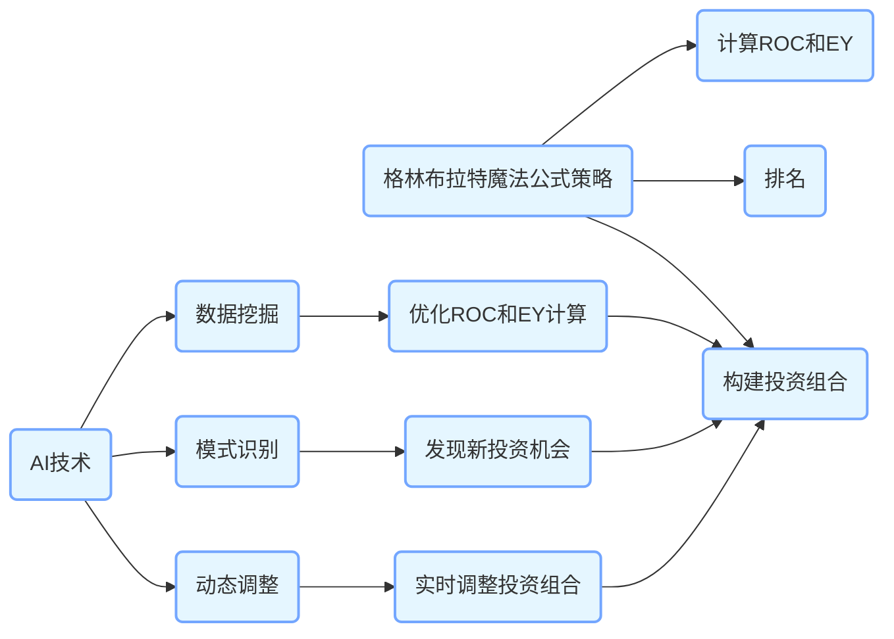

# AI如何优化格林布拉特的魔法公式策略

> 关键词：AI、格林布拉特魔法公式策略、量化投资、机器学习、优化策略

> 摘要：本文深入探讨了如何利用AI技术对格林布拉特的魔法公式策略进行优化。首先介绍了格林布拉特魔法公式策略的背景和核心概念，接着详细阐述了AI在该策略优化中的核心算法原理、数学模型及具体操作步骤。通过项目实战案例展示了如何在实际中运用AI优化后的策略，分析了其在不同实际应用场景中的表现。同时推荐了相关的学习资源、开发工具框架以及论文著作，最后总结了该领域未来的发展趋势与挑战，并提供了常见问题的解答和扩展阅读参考资料，旨在为投资者和技术人员提供全面且深入的技术指引。

## 1. 背景介绍 
### 1.1 目的和范围
本文章的目的在于研究如何借助人工智能（AI）技术来提升格林布拉特魔法公式策略的投资绩效。格林布拉特魔法公式是一种基于价值投资理念的量化选股策略，在过去取得了显著的成绩，但也存在一定的局限性。AI技术具有强大的数据分析和模式识别能力，有望通过挖掘更多潜在信息来优化该策略。本文将涵盖从AI核心算法原理、数学模型构建到实际项目应用的全过程，探讨AI在策略优化中的具体应用方式和效果。

### 1.2 预期读者
本文的预期读者包括量化投资领域的从业者、对AI在金融领域应用感兴趣的技术人员、研究价值投资策略的学者以及有一定编程基础且希望探索智能投资策略的个人投资者。

### 1.3 文档结构概述
本文将按照以下结构展开：首先介绍核心概念，明确格林布拉特魔法公式策略和相关AI技术的基本原理；接着详细阐述核心算法原理和具体操作步骤，并给出相应的Python代码示例；然后介绍相关的数学模型和公式，并举例说明其应用；通过项目实战展示如何在实际中运用AI优化后的策略；分析该优化策略的实际应用场景；推荐学习资源、开发工具框架和相关论文著作；最后总结未来发展趋势与挑战，提供常见问题解答和扩展阅读参考资料。

### 1.4 术语表
#### 1.4.1 核心术语定义
- **格林布拉特魔法公式策略**：由乔尔·格林布拉特提出的一种量化选股策略，通过计算股票的资本回报率（ROC）和股票收益率（EY），对股票进行排名，选取排名靠前的股票构建投资组合。
- **人工智能（AI）**：研究、开发用于模拟、延伸和扩展人的智能的理论、方法、技术及应用系统的一门新的技术科学，在本文中主要指机器学习和深度学习技术在投资策略优化中的应用。
- **量化投资**：利用数学、统计学、计算机技术等方法，从海量数据中挖掘投资机会，制定投资策略的一种投资方式。
- **机器学习**：一门多领域交叉学科，涉及概率论、统计学、逼近论、凸分析、算法复杂度理论等多门学科。它专门研究计算机怎样模拟或实现人类的学习行为，以获取新的知识或技能，重新组织已有的知识结构使之不断改善自身的性能。
- **深度学习**：机器学习的一个分支领域，它是一种基于对数据进行表征学习的方法。深度学习通过构建具有很多层的神经网络模型，自动从大量数据中学习复杂的模式和特征。

#### 1.4.2 相关概念解释
- **资本回报率（ROC）**：衡量公司运用自有资本的效率，计算公式为息税前利润（EBIT）除以净营运资本与固定资产之和。ROC越高，说明公司利用资本创造利润的能力越强。
- **股票收益率（EY）**：息税前利润（EBIT）除以企业价值（EV），反映了股票的盈利能力。EY越高，说明股票的投资价值越高。
- **企业价值（EV）**：公司的市场价值加上净负债，是衡量公司整体价值的指标。

#### 1.4.3 缩略词列表
- **ROC**：Return on Capital，资本回报率
- **EY**：Earnings Yield，股票收益率
- **EBIT**：Earnings Before Interest and Taxes，息税前利润
- **EV**：Enterprise Value，企业价值
- **AI**：Artificial Intelligence，人工智能
- **ML**：Machine Learning，机器学习
- **DL**：Deep Learning，深度学习

## 2. 核心概念与联系 
### 格林布拉特魔法公式策略原理
格林布拉特魔法公式的核心思想是通过两个关键指标——资本回报率（ROC）和股票收益率（EY）来筛选具有投资价值的股票。具体步骤如下：
1. 计算每只股票的ROC和EY。
2. 分别对所有股票的ROC和EY进行排名。
3. 将每只股票的ROC排名和EY排名相加，得到综合排名。
4. 选取综合排名靠前的股票构建投资组合。

### AI在策略优化中的作用
AI技术可以从多个方面优化格林布拉特魔法公式策略：
1. **数据挖掘**：AI可以处理更广泛的数据来源，除了传统的财务数据，还可以包括新闻舆情、社交媒体数据等，挖掘更多影响股票价格的潜在因素。
2. **模式识别**：通过机器学习和深度学习算法，AI可以识别数据中的复杂模式和规律，发现传统方法难以发现的投资机会。
3. **动态调整**：AI可以实时监测市场变化，根据新的数据动态调整投资组合，提高策略的适应性和灵活性。

### 核心概念架构示意图


## 3. 核心算法原理 & 具体操作步骤 
### 格林布拉特魔法公式策略的Python实现
```python
import pandas as pd

# 示例数据：假设已经获取到了股票的EBIT、净营运资本、固定资产和企业价值
data = {
    'stock_code': ['000001', '000002', '000003'],
    'EBIT': [100, 200, 300],
    'net_working_capital': [50, 100, 150],
    'fixed_assets': [20, 40, 60],
    'EV': [800, 1200, 1500]
}
df = pd.DataFrame(data)

# 计算ROC和EY
df['ROC'] = df['EBIT'] / (df['net_working_capital'] + df['fixed_assets'])
df['EY'] = df['EBIT'] / df['EV']

# 排名
df['ROC_rank'] = df['ROC'].rank(ascending=False)
df['EY_rank'] = df['EY'].rank(ascending=False)

# 综合排名
df['total_rank'] = df['ROC_rank'] + df['EY_rank']

# 选取排名靠前的股票
top_stocks = df.nsmallest(2, 'total_rank')

print(top_stocks)
```
### 代码解释
1. **数据准备**：使用`pandas`库创建一个包含股票基本信息的DataFrame，包括股票代码、EBIT、净营运资本、固定资产和企业价值。
2. **计算ROC和EY**：根据公式计算每只股票的ROC和EY。
3. **排名**：使用`rank`方法对ROC和EY进行排名，`ascending=False`表示降序排名。
4. **综合排名**：将ROC排名和EY排名相加得到综合排名。
5. **选取股票**：使用`nsmallest`方法选取综合排名靠前的股票。

### AI优化策略的核心算法
#### 特征工程
AI优化策略的第一步是进行特征工程，除了ROC和EY，还可以引入其他特征，如市盈率（PE）、市净率（PB）、营业收入增长率等。以下是一个简单的特征工程示例：
```python
# 假设已经获取到了股票的净利润和市值
df['PE'] = df['market_value'] / df['net_profit']
df['PB'] = df['market_value'] / df['book_value']
df['revenue_growth_rate'] = (df['current_revenue'] - df['previous_revenue']) / df['previous_revenue']
```

#### 机器学习模型训练
选择合适的机器学习模型，如随机森林、支持向量机等，对特征进行训练，预测股票的未来表现。以下是一个使用随机森林进行训练的示例：
```python
from sklearn.ensemble import RandomForestRegressor
from sklearn.model_selection import train_test_split
from sklearn.metrics import mean_squared_error

# 选取特征和目标变量
features = ['ROC', 'EY', 'PE', 'PB', 'revenue_growth_rate']
target = 'future_return'

X = df[features]
y = df[target]

# 划分训练集和测试集
X_train, X_test, y_train, y_test = train_test_split(X, y, test_size=0.2, random_state=42)

# 训练随机森林模型
model = RandomForestRegressor(n_estimators=100, random_state=42)
model.fit(X_train, y_train)

# 预测
y_pred = model.predict(X_test)

# 评估模型
mse = mean_squared_error(y_test, y_pred)
print(f"Mean Squared Error: {mse}")
```

### 具体操作步骤
1. **数据收集**：收集股票的财务数据、市场数据等，并进行清洗和预处理。
2. **特征工程**：根据业务知识和数据分析，选择和构建合适的特征。
3. **模型训练**：选择合适的机器学习模型，使用训练数据进行模型训练。
4. **模型评估**：使用测试数据评估模型的性能，根据评估结果调整模型参数。
5. **策略实施**：根据模型预测结果，调整投资组合。

## 4. 数学模型和公式 & 详细讲解 & 举例说明 
### 格林布拉特魔法公式相关公式
#### 资本回报率（ROC）
$$ROC = \frac{EBIT}{Net Working Capital + Fixed Assets}$$
其中，$EBIT$ 表示息税前利润，$Net Working Capital$ 表示净营运资本，$Fixed Assets$ 表示固定资产。

**举例说明**：假设某公司的EBIT为100万元，净营运资本为50万元，固定资产为20万元，则该公司的ROC为：
$$ROC = \frac{100}{50 + 20} \approx 1.43$$

#### 股票收益率（EY）
$$EY = \frac{EBIT}{EV}$$
其中，$EV$ 表示企业价值。

**举例说明**：假设某公司的EBIT为100万元，企业价值为800万元，则该公司的EY为：
$$EY = \frac{100}{800} = 0.125$$

### AI优化策略中的数学模型
#### 随机森林模型
随机森林是一种集成学习方法，它由多个决策树组成。每个决策树在训练时使用不同的样本子集和特征子集，最终通过投票或平均的方式得出预测结果。

决策树的节点分裂规则基于信息增益或基尼不纯度等指标。以信息增益为例，信息增益的计算公式为：
$$IG(S, A) = H(S) - \sum_{v \in Values(A)} \frac{|S_v|}{|S|} H(S_v)$$
其中，$S$ 表示样本集合，$A$ 表示特征，$H(S)$ 表示样本集合 $S$ 的熵，$S_v$ 表示特征 $A$ 取值为 $v$ 的样本子集。

**举例说明**：假设有一个样本集合 $S$ 包含10个样本，其中正样本6个，负样本4个。特征 $A$ 有两个取值 $v_1$ 和 $v_2$，$S_{v_1}$ 包含5个样本，其中正样本3个，负样本2个；$S_{v_2}$ 包含5个样本，其中正样本3个，负样本2个。

首先计算样本集合 $S$ 的熵：
$$H(S) = - \frac{6}{10} \log_2 \frac{6}{10} - \frac{4}{10} \log_2 \frac{4}{10} \approx 0.971$$

然后计算 $S_{v_1}$ 和 $S_{v_2}$ 的熵：
$$H(S_{v_1}) = - \frac{3}{5} \log_2 \frac{3}{5} - \frac{2}{5} \log_2 \frac{2}{5} \approx 0.971$$
$$H(S_{v_2}) = - \frac{3}{5} \log_2 \frac{3}{5} - \frac{2}{5} \log_2 \frac{2}{5} \approx 0.971$$

最后计算信息增益：
$$IG(S, A) = 0.971 - (\frac{5}{10} \times 0.971 + \frac{5}{10} \times 0.971) = 0$$

## 5. 项目实战：代码实际案例和详细解释说明 
### 5.1  开发环境搭建
#### 安装Python
首先需要安装Python，建议使用Python 3.7及以上版本。可以从Python官方网站（https://www.python.org/downloads/）下载并安装。

#### 安装必要的库
使用`pip`命令安装以下必要的库：
```bash
pip install pandas numpy scikit-learn
```

### 5.2  源代码详细实现和代码解读
```python
import pandas as pd
import numpy as np
from sklearn.ensemble import RandomForestRegressor
from sklearn.model_selection import train_test_split
from sklearn.metrics import mean_squared_error

# 模拟数据生成
np.random.seed(42)
n_samples = 100
data = {
    'EBIT': np.random.randint(10, 100, n_samples),
    'net_working_capital': np.random.randint(5, 50, n_samples),
    'fixed_assets': np.random.randint(2, 20, n_samples),
    'EV': np.random.randint(50, 500, n_samples),
    'market_value': np.random.randint(100, 1000, n_samples),
    'net_profit': np.random.randint(5, 50, n_samples),
    'book_value': np.random.randint(20, 200, n_samples),
    'current_revenue': np.random.randint(100, 1000, n_samples),
    'previous_revenue': np.random.randint(50, 800, n_samples),
    'future_return': np.random.randn(n_samples)
}
df = pd.DataFrame(data)

# 计算ROC和EY
df['ROC'] = df['EBIT'] / (df['net_working_capital'] + df['fixed_assets'])
df['EY'] = df['EBIT'] / df['EV']

# 特征工程
df['PE'] = df['market_value'] / df['net_profit']
df['PB'] = df['market_value'] / df['book_value']
df['revenue_growth_rate'] = (df['current_revenue'] - df['previous_revenue']) / df['previous_revenue']

# 选取特征和目标变量
features = ['ROC', 'EY', 'PE', 'PB', 'revenue_growth_rate']
target = 'future_return'

X = df[features]
y = df[target]

# 划分训练集和测试集
X_train, X_test, y_train, y_test = train_test_split(X, y, test_size=0.2, random_state=42)

# 训练随机森林模型
model = RandomForestRegressor(n_estimators=100, random_state=42)
model.fit(X_train, y_train)

# 预测
y_pred = model.predict(X_test)

# 评估模型
mse = mean_squared_error(y_test, y_pred)
print(f"Mean Squared Error: {mse}")

# 根据预测结果选取股票
df_test = pd.DataFrame(X_test)
df_test['future_return_pred'] = y_pred
top_stocks = df_test.nlargest(10, 'future_return_pred')

print(top_stocks)
```
### 代码解读与分析
1. **数据生成**：使用`numpy`生成模拟数据，包括EBIT、净营运资本、固定资产、企业价值等信息。
2. **计算ROC和EY**：根据格林布拉特魔法公式计算ROC和EY。
3. **特征工程**：计算PE、PB和营业收入增长率等特征。
4. **数据划分**：使用`train_test_split`方法将数据划分为训练集和测试集。
5. **模型训练**：使用随机森林模型进行训练。
6. **模型评估**：使用均方误差（MSE）评估模型的性能。
7. **选取股票**：根据模型预测的未来收益率，选取排名靠前的股票。

## 6. 实际应用场景 
### 个人投资者
个人投资者可以使用AI优化后的格林布拉特魔法公式策略进行股票投资。通过自动化的选股和投资组合调整，降低投资决策的主观性，提高投资效率和收益。

### 机构投资者
机构投资者可以将该策略应用于大规模的资产配置中。AI技术可以处理海量的数据，发现更多的投资机会，同时可以实时监测市场变化，及时调整投资组合，降低风险。

### 量化投资公司
量化投资公司可以将该策略作为核心策略之一，结合其他量化策略，构建多元化的投资组合。通过不断优化模型和策略，提高公司的竞争力和盈利能力。

## 7. 工具和资源推荐
### 7.1 学习资源推荐
#### 7.1.1 书籍推荐
- 《聪明的投资者》（The Intelligent Investor）：本杰明·格雷厄姆著，价值投资的经典之作，介绍了价值投资的基本理念和方法。
- 《机器学习》（Machine Learning）：周志华著，全面介绍了机器学习的基本概念、算法和应用。
- 《深度学习》（Deep Learning）：伊恩·古德费洛等著，深度学习领域的权威教材，介绍了深度学习的基本原理和应用。

#### 7.1.2 在线课程
- Coursera上的“机器学习”课程：由斯坦福大学教授吴恩达主讲，是机器学习领域的经典课程。
- edX上的“深度学习”课程：由深度学习领域的知名学者授课，介绍了深度学习的最新进展和应用。

#### 7.1.3 技术博客和网站
- Medium：有很多关于AI和量化投资的优质文章。
- Towards Data Science：专注于数据科学和机器学习领域的技术博客。
- QuantNet：量化投资领域的专业论坛，有很多关于量化策略和技术的讨论。

### 7.2 开发工具框架推荐
#### 7.2.1 IDE和编辑器
- PyCharm：功能强大的Python集成开发环境，适合开发Python项目。
- Jupyter Notebook：交互式的开发环境，适合进行数据分析和模型训练。

#### 7.2.2 调试和性能分析工具
- Py-Spy：用于分析Python代码的性能，找出性能瓶颈。
- PDB：Python自带的调试工具，用于调试Python代码。

#### 7.2.3 相关框架和库
- Pandas：用于数据处理和分析的Python库。
- Numpy：用于科学计算的Python库。
- Scikit-learn：用于机器学习的Python库，提供了丰富的机器学习算法和工具。
- TensorFlow：开源的深度学习框架，由Google开发。
- PyTorch：开源的深度学习框架，由Facebook开发。

### 7.3 相关论文著作推荐
#### 7.3.1 经典论文
- 《The Magic Formula: A Simple Way to Beat the Market》：乔尔·格林布拉特著，介绍了格林布拉特魔法公式策略的原理和应用。
- 《A Machine Learning Approach to Portfolio Optimization》：提出了一种使用机器学习方法进行投资组合优化的策略。

#### 7.3.2 最新研究成果
- 关注顶级学术会议，如NeurIPS、ICML等，了解AI在金融领域的最新研究成果。

#### 7.3.3 应用案例分析
- 一些量化投资公司会发布他们的研究报告和应用案例，可以从中学习到实际应用中的经验和技巧。

## 8. 总结：未来发展趋势与挑战
### 未来发展趋势
- **多模态数据融合**：除了财务数据和市场数据，未来将融合更多的多模态数据，如文本数据、图像数据等，挖掘更多的投资信息。
- **强化学习应用**：强化学习可以在动态的市场环境中进行决策优化，未来将更多地应用于投资策略的优化。
- **人工智能与区块链结合**：区块链技术可以提供更安全、透明的交易环境，与AI技术结合可以构建更加智能的投资生态系统。

### 挑战
- **数据质量和隐私问题**：数据质量直接影响模型的性能，同时数据隐私问题也是一个重要的挑战。
- **模型可解释性**：AI模型通常是黑盒模型，缺乏可解释性，这在金融领域可能会带来一定的风险。
- **市场不确定性**：金融市场具有高度的不确定性，AI模型难以完全准确地预测市场变化。

## 9. 附录：常见问题与解答
### 问题1：AI优化后的格林布拉特魔法公式策略一定能获得更高的收益吗？
答：不一定。虽然AI技术可以挖掘更多的信息和模式，但金融市场具有高度的不确定性，模型的预测结果也存在一定的误差。AI优化后的策略只是在理论上有可能提高收益，但实际效果还受到多种因素的影响。

### 问题2：如何选择合适的机器学习模型？
答：选择合适的机器学习模型需要考虑多个因素，如数据的特点、问题的类型、模型的复杂度等。可以通过交叉验证等方法比较不同模型的性能，选择性能最优的模型。

### 问题3：如何处理数据中的缺失值和异常值？
答：对于缺失值，可以采用删除、填充等方法进行处理。对于异常值，可以采用统计方法进行识别和处理，如Z-score方法、箱线图方法等。

## 10. 扩展阅读 & 参考资料
- 《金融炼金术》（The Alchemy of Finance）：乔治·索罗斯著，介绍了金融市场的运行规律和投资哲学。
- 《金融机器学习》（Advances in Financial Machine Learning）：德米特里·诺维科夫著，介绍了机器学习在金融领域的应用。
- 相关学术期刊，如《Journal of Financial Economics》、《Review of Financial Studies》等。

作者：AI天才研究院/AI Genius Institute & 禅与计算机程序设计艺术 /Zen And The Art of Computer Programming