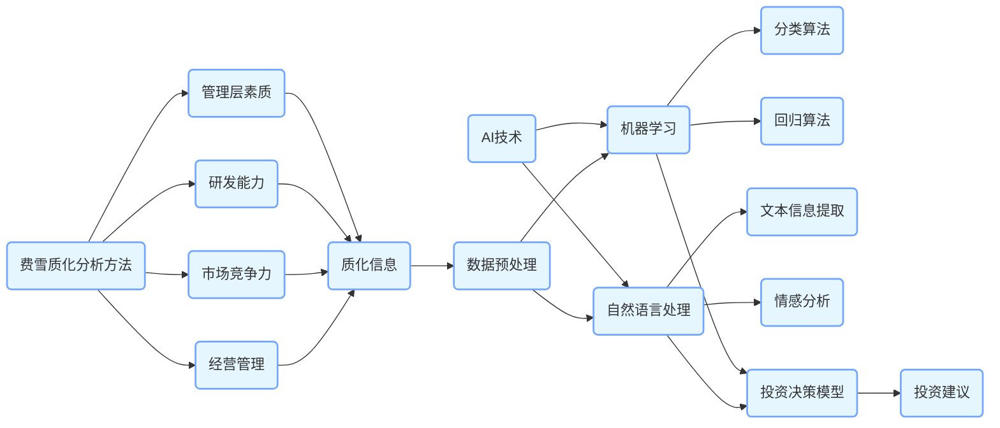

# AI如何实现费雪的质化分析方法

> 关键词：AI、费雪质化分析方法、量化投资、数据分析、机器学习

> 摘要：本文深入探讨了如何利用AI技术实现费雪的质化分析方法。首先介绍了费雪质化分析方法的背景和重要性，接着阐述了相关核心概念及其联系，详细讲解了实现该方法的核心算法原理与具体操作步骤，包括使用Python代码进行说明。同时给出了相应的数学模型和公式，并举例进行解释。通过项目实战展示了代码的实际应用和详细解读，探讨了该方法在实际中的应用场景。最后推荐了相关的工具和资源，总结了未来发展趋势与挑战，还提供了常见问题解答和扩展阅读参考资料，旨在为读者全面呈现AI实现费雪质化分析方法的技术路径和应用前景。

## 1. 背景介绍 
### 1.1 目的和范围
费雪的质化分析方法是投资领域中一种重要的分析手段，它侧重于从企业的经营管理、研发能力、市场竞争力等非量化的角度评估企业的投资价值。随着人工智能技术的发展，利用AI实现费雪的质化分析方法具有重要的现实意义。本文章的目的在于深入探讨如何借助AI技术，将费雪的质化分析方法进行有效实现，以提高投资决策的准确性和效率。范围涵盖了从核心概念的介绍、算法原理的讲解、实际案例的分析到相关工具和资源的推荐等多个方面。

### 1.2 预期读者
本文预期读者包括金融投资领域的专业人士，如投资经理、分析师等，他们希望借助AI技术提升费雪质化分析方法的应用效果；计算机科学领域的开发者和研究人员，对将AI技术应用于金融分析感兴趣；以及对量化投资和人工智能交叉领域有学习需求的学生和爱好者。

### 1.3 文档结构概述
本文将按照以下结构进行阐述：首先介绍核心概念与联系，明确费雪质化分析方法和AI相关概念的原理和架构；接着详细讲解核心算法原理及具体操作步骤，并用Python代码进行说明；然后给出数学模型和公式，并举例解释；通过项目实战展示代码的实际应用和详细解读；探讨实际应用场景；推荐相关的工具和资源；最后总结未来发展趋势与挑战，提供常见问题解答和扩展阅读参考资料。

### 1.4 术语表
#### 1.4.1 核心术语定义
- **费雪的质化分析方法**：由菲利普·费雪提出的一种投资分析方法，主要从企业的经营管理、研发能力、市场竞争力、管理层素质等非量化的方面评估企业的长期投资价值。
- **人工智能（AI）**：是研究、开发用于模拟、延伸和扩展人的智能的理论、方法、技术及应用系统的一门新的技术科学，在本文中主要涉及机器学习、自然语言处理等技术在费雪质化分析中的应用。
- **量化投资**：是指通过数量化方式及计算机程序化发出买卖指令，以获取稳定收益为目的的交易方式。在实现费雪质化分析方法中，量化投资的思想用于将质化信息转化为可操作的投资策略。

#### 1.4.2 相关概念解释
- **机器学习**：是一门多领域交叉学科，涉及概率论、统计学、逼近论、凸分析、算法复杂度理论等多门学科。它专门研究计算机怎样模拟或实现人类的学习行为，以获取新的知识或技能，重新组织已有的知识结构使之不断改善自身的性能。在实现费雪质化分析方法中，机器学习算法可用于对企业的各种质化信息进行分类、预测和评估。
- **自然语言处理（NLP）**：是计算机科学、人工智能、语言学关注计算机和人类（自然）语言之间的相互作用的领域。在费雪质化分析中，NLP技术可用于处理企业的年报、新闻报道等文本信息，提取其中的关键信息和情感倾向。

#### 1.4.3 缩略词列表
- **AI**：Artificial Intelligence（人工智能）
- **NLP**：Natural Language Processing（自然语言处理）
- **ML**：Machine Learning（机器学习）

## 2. 核心概念与联系 

### 费雪质化分析方法的核心原理
费雪的质化分析方法强调从多个维度对企业进行深入分析，以评估其内在价值和成长潜力。主要包括以下几个方面：
- **管理层素质**：优秀的管理层应具备卓越的领导能力、战略眼光、创新精神和良好的道德品质。他们能够制定合理的企业发展战略，有效管理企业资源，应对各种挑战。
- **研发能力**：具有强大研发能力的企业能够不断推出新产品和新技术，满足市场需求，提高市场竞争力。研发能力的评估可以从研发投入、研发团队实力、专利数量等方面进行。
- **市场竞争力**：企业在市场中的竞争力取决于其产品或服务的质量、价格、品牌影响力等因素。具有较强市场竞争力的企业能够占据更大的市场份额，获得更高的利润。
- **经营管理**：良好的经营管理包括高效的生产运营、合理的成本控制、完善的市场营销策略等。通过对企业经营管理的分析，可以了解企业的运营效率和盈利能力。

### AI技术在费雪质化分析中的应用原理
AI技术主要通过机器学习和自然语言处理等手段，对企业的各种质化信息进行处理和分析。具体如下：
- **机器学习**：利用机器学习算法对企业的历史数据和质化信息进行学习和建模，以预测企业的未来发展趋势和投资价值。例如，使用分类算法对企业的竞争力进行分类，使用回归算法预测企业的盈利水平。
- **自然语言处理**：通过自然语言处理技术对企业的年报、新闻报道、社交媒体等文本信息进行处理，提取其中的关键信息和情感倾向。例如，分析企业年报中的管理层讨论与分析部分，了解管理层对企业未来发展的展望和信心。

### 核心概念的架构示意图


该架构示意图展示了费雪质化分析方法和AI技术之间的联系。费雪质化分析方法的各个维度产生质化信息，这些信息经过数据预处理后，分别输入到机器学习和自然语言处理模块中进行分析。机器学习模块使用分类算法和回归算法等进行建模，自然语言处理模块进行文本信息提取和情感分析。最终，这些分析结果用于构建投资决策模型，生成投资建议。

## 3. 核心算法原理 & 具体操作步骤 

### 核心算法原理
在实现费雪的质化分析方法中，我们主要使用机器学习中的分类算法和回归算法，以及自然语言处理中的文本分类和情感分析算法。

#### 分类算法（以决策树为例）
决策树是一种基于树结构进行决策的算法，它通过对数据的特征进行划分，构建一个树形结构，每个内部节点是一个特征上的测试，每个分支是测试输出，每个叶节点是一个类别。决策树的构建过程主要包括特征选择、树的生成和树的剪枝。

#### 回归算法（以线性回归为例）
线性回归是一种用于建立自变量和因变量之间线性关系的算法。它的目标是找到一条直线或超平面，使得所有数据点到该直线或超平面的距离之和最小。线性回归的模型可以表示为 $y = \theta_0 + \theta_1x_1 + \theta_2x_2 + \cdots + \theta_nx_n$，其中 $y$ 是因变量，$x_1, x_2, \cdots, x_n$ 是自变量，$\theta_0, \theta_1, \theta_2, \cdots, \theta_n$ 是模型的参数。

#### 文本分类算法（以朴素贝叶斯为例）
朴素贝叶斯是一种基于贝叶斯定理和特征条件独立假设的分类算法。它通过计算文本属于各个类别的概率，选择概率最大的类别作为文本的分类结果。朴素贝叶斯的核心公式是 $P(C|D) = \frac{P(D|C)P(C)}{P(D)}$，其中 $C$ 是类别，$D$ 是文本。

#### 情感分析算法（以基于词典的方法为例）
基于词典的情感分析方法通过构建情感词典，统计文本中积极词和消极词的数量，根据积极词和消极词的数量对比来判断文本的情感倾向。

### 具体操作步骤

#### 数据收集
收集企业的各种质化信息，包括年报、新闻报道、社交媒体评论等文本信息，以及企业的财务数据、市场数据等结构化数据。

#### 数据预处理
- 对于文本信息，进行清洗、分词、去除停用词等操作。
- 对于结构化数据，进行缺失值处理、异常值处理、标准化等操作。

#### 特征提取
- 对于文本信息，提取关键词、词频、TF-IDF等特征。
- 对于结构化数据，选择相关的特征作为输入。

#### 模型训练
- 使用分类算法对企业的竞争力进行分类。
- 使用回归算法预测企业的盈利水平。
- 使用文本分类算法对文本信息进行分类。
- 使用情感分析算法分析文本的情感倾向。

#### 模型评估
使用交叉验证等方法对训练好的模型进行评估，评估指标包括准确率、召回率、F1值等。

#### 投资决策
根据模型的预测结果，结合费雪的质化分析方法，制定投资决策。

### Python代码实现

```python
import pandas as pd
from sklearn.model_selection import train_test_split
from sklearn.tree import DecisionTreeClassifier
from sklearn.linear_model import LinearRegression
from sklearn.feature_extraction.text import TfidfVectorizer
from sklearn.naive_bayes import MultinomialNB
from sklearn.metrics import accuracy_score

# 数据收集和预处理
# 假设我们有一个包含企业文本信息和竞争力标签的数据集
data = pd.read_csv('company_data.csv')
X_text = data['text']
y = data['competitiveness']

# 文本特征提取
vectorizer = TfidfVectorizer()
X_text_features = vectorizer.fit_transform(X_text)

# 划分训练集和测试集
X_train_text, X_test_text, y_train, y_test = train_test_split(X_text_features, y, test_size=0.2, random_state=42)

# 训练分类模型（决策树）
clf = DecisionTreeClassifier()
clf.fit(X_train_text, y_train)

# 模型评估
y_pred = clf.predict(X_test_text)
accuracy = accuracy_score(y_test, y_pred)
print(f"分类模型准确率: {accuracy}")

# 假设我们还有一个包含企业财务数据和盈利水平的数据集
financial_data = pd.read_csv('financial_data.csv')
X_financial = financial_data.drop('profit', axis=1)
y_financial = financial_data['profit']

# 划分训练集和测试集
X_train_financial, X_test_financial, y_train_financial, y_test_financial = train_test_split(X_financial, y_financial, test_size=0.2, random_state=42)

# 训练回归模型（线性回归）
reg = LinearRegression()
reg.fit(X_train_financial, y_train_financial)

# 模型评估
y_pred_financial = reg.predict(X_test_financial)
# 可以使用均方误差等指标评估回归模型
```

## 4. 数学模型和公式 & 详细讲解 & 举例说明 

### 决策树算法的数学模型和公式
决策树的构建过程中，常用的特征选择方法是信息增益。信息增益的计算公式为：

$$IG(D, A) = H(D) - H(D|A)$$

其中，$IG(D, A)$ 表示特征 $A$ 对数据集 $D$ 的信息增益，$H(D)$ 表示数据集 $D$ 的信息熵，$H(D|A)$ 表示在特征 $A$ 给定的条件下数据集 $D$ 的条件熵。

信息熵的计算公式为：

$$H(D) = -\sum_{k=1}^{|y|}p_k\log_2p_k$$

其中，$|y|$ 表示数据集 $D$ 中类别的数量，$p_k$ 表示第 $k$ 个类别的样本在数据集 $D$ 中所占的比例。

条件熵的计算公式为：

$$H(D|A) = \sum_{i=1}^{|A|}\frac{|D_i|}{|D|}H(D_i)$$

其中，$|A|$ 表示特征 $A$ 的取值数量，$D_i$ 表示特征 $A$ 取值为第 $i$ 个值的样本子集。

**举例说明**：假设有一个数据集 $D$ 包含 10 个样本，分为 2 个类别，类别 1 有 6 个样本，类别 2 有 4 个样本。则数据集 $D$ 的信息熵为：

$$H(D) = -\frac{6}{10}\log_2\frac{6}{10} - \frac{4}{10}\log_2\frac{4}{10} \approx 0.971$$

假设特征 $A$ 有 2 个取值，取值 1 的样本子集 $D_1$ 包含 5 个样本，其中类别 1 有 3 个样本，类别 2 有 2 个样本；取值 2 的样本子集 $D_2$ 包含 5 个样本，其中类别 1 有 3 个样本，类别 2 有 2 个样本。则特征 $A$ 给定条件下数据集 $D$ 的条件熵为：

$$H(D|A) = \frac{5}{10}(-\frac{3}{5}\log_2\frac{3}{5} - \frac{2}{5}\log_2\frac{2}{5}) + \frac{5}{10}(-\frac{3}{5}\log_2\frac{3}{5} - \frac{2}{5}\log_2\frac{2}{5}) \approx 0.951$$

特征 $A$ 对数据集 $D$ 的信息增益为：

$$IG(D, A) = H(D) - H(D|A) \approx 0.971 - 0.951 = 0.02$$

### 线性回归算法的数学模型和公式
线性回归的模型可以表示为：

$$y = \theta_0 + \theta_1x_1 + \theta_2x_2 + \cdots + \theta_nx_n$$

其中，$y$ 是因变量，$x_1, x_2, \cdots, x_n$ 是自变量，$\theta_0, \theta_1, \theta_2, \cdots, \theta_n$ 是模型的参数。

线性回归的目标是找到一组参数 $\theta$，使得预测值 $\hat{y}$ 与真实值 $y$ 之间的误差最小。常用的误差度量方法是均方误差（MSE），其计算公式为：

$$MSE = \frac{1}{m}\sum_{i=1}^{m}(y^{(i)} - \hat{y}^{(i)})^2$$

其中，$m$ 是样本数量，$y^{(i)}$ 是第 $i$ 个样本的真实值，$\hat{y}^{(i)}$ 是第 $i$ 个样本的预测值。

为了最小化均方误差，可以使用最小二乘法求解参数 $\theta$。最小二乘法的解为：

$$\theta = (X^TX)^{-1}X^Ty$$

其中，$X$ 是特征矩阵，$y$ 是真实值向量。

**举例说明**：假设有一个简单的线性回归问题，数据集包含 3 个样本，特征向量为 $x = [1, 2, 3]$，真实值向量为 $y = [2, 4, 6]$。则特征矩阵 $X$ 为：

$$X = \begin{bmatrix}
1 & 1 \\
1 & 2 \\
1 & 3
\end{bmatrix}$$

真实值向量 $y$ 为：

$$y = \begin{bmatrix}
2 \\
4 \\
6
\end{bmatrix}$$

根据最小二乘法的公式，计算参数 $\theta$：

$$\theta = (X^TX)^{-1}X^Ty = \begin{bmatrix}
0 \\
2
\end{bmatrix}$$

则线性回归模型为 $y = 0 + 2x$。

### 朴素贝叶斯算法的数学模型和公式
朴素贝叶斯的核心公式是贝叶斯定理：

$$P(C|D) = \frac{P(D|C)P(C)}{P(D)}$$

其中，$C$ 是类别，$D$ 是文本。

在朴素贝叶斯算法中，假设文本中的每个词是相互独立的，则 $P(D|C)$ 可以表示为：

$$P(D|C) = \prod_{i=1}^{n}P(w_i|C)$$

其中，$w_i$ 是文本 $D$ 中的第 $i$ 个词，$n$ 是文本 $D$ 中词的数量。

由于 $P(D)$ 对于所有类别都是相同的，因此在分类时可以忽略 $P(D)$，只需要比较 $P(D|C)P(C)$ 的大小即可。

**举例说明**：假设有一个文本分类问题，有 2 个类别 $C_1$ 和 $C_2$，文本 $D$ 包含 3 个词 $w_1, w_2, w_3$。已知 $P(C_1) = 0.6$，$P(C_2) = 0.4$，$P(w_1|C_1) = 0.2$，$P(w_2|C_1) = 0.3$，$P(w_3|C_1) = 0.5$，$P(w_1|C_2) = 0.3$，$P(w_2|C_2) = 0.2$，$P(w_3|C_2) = 0.4$。则：

$$P(D|C_1)P(C_1) = 0.2 \times 0.3 \times 0.5 \times 0.6 = 0.018$$

$$P(D|C_2)P(C_2) = 0.3 \times 0.2 \times 0.4 \times 0.4 = 0.0096$$

由于 $P(D|C_1)P(C_1) > P(D|C_2)P(C_2)$，因此文本 $D$ 属于类别 $C_1$。

## 5. 项目实战：代码实际案例和详细解释说明 

### 5.1  开发环境搭建
#### 安装Python
首先需要安装Python环境，建议使用Python 3.7及以上版本。可以从Python官方网站（https://www.python.org/downloads/）下载安装包，按照安装向导进行安装。

#### 安装必要的库
使用pip命令安装以下必要的库：
```bash
pip install pandas scikit-learn numpy
```

### 5.2  源代码详细实现和代码解读
以下是一个完整的项目实战代码示例，用于实现费雪质化分析方法中的企业竞争力分类和盈利水平预测：

```python
import pandas as pd
from sklearn.model_selection import train_test_split
from sklearn.tree import DecisionTreeClassifier
from sklearn.linear_model import LinearRegression
from sklearn.feature_extraction.text import TfidfVectorizer
from sklearn.metrics import accuracy_score, mean_squared_error

# 数据收集和预处理
# 假设我们有一个包含企业文本信息和竞争力标签的数据集
text_data = pd.read_csv('company_text_data.csv')
X_text = text_data['text']
y_text = text_data['competitiveness']

# 文本特征提取
vectorizer = TfidfVectorizer()
X_text_features = vectorizer.fit_transform(X_text)

# 划分训练集和测试集
X_train_text, X_test_text, y_train_text, y_test_text = train_test_split(X_text_features, y_text, test_size=0.2, random_state=42)

# 训练分类模型（决策树）
clf = DecisionTreeClassifier()
clf.fit(X_train_text, y_train_text)

# 模型评估
y_pred_text = clf.predict(X_test_text)
accuracy = accuracy_score(y_test_text, y_pred_text)
print(f"企业竞争力分类模型准确率: {accuracy}")

# 假设我们还有一个包含企业财务数据和盈利水平的数据集
financial_data = pd.read_csv('company_financial_data.csv')
X_financial = financial_data.drop('profit', axis=1)
y_financial = financial_data['profit']

# 划分训练集和测试集
X_train_financial, X_test_financial, y_train_financial, y_test_financial = train_test_split(X_financial, y_financial, test_size=0.2, random_state=42)

# 训练回归模型（线性回归）
reg = LinearRegression()
reg.fit(X_train_financial, y_train_financial)

# 模型评估
y_pred_financial = reg.predict(X_test_financial)
mse = mean_squared_error(y_test_financial, y_pred_financial)
print(f"企业盈利水平预测模型均方误差: {mse}")
```

### 5.3  代码解读与分析
#### 数据收集和预处理
- 使用 `pandas` 库读取包含企业文本信息和竞争力标签的数据集 `company_text_data.csv`，以及包含企业财务数据和盈利水平的数据集 `company_financial_data.csv`。
- 提取文本信息和竞争力标签，以及财务数据和盈利水平。

#### 文本特征提取
- 使用 `TfidfVectorizer` 对文本信息进行特征提取，将文本转换为数值特征矩阵。

#### 划分训练集和测试集
- 使用 `train_test_split` 函数将数据集划分为训练集和测试集，测试集占比为 20%。

#### 训练分类模型
- 使用 `DecisionTreeClassifier` 训练企业竞争力分类模型。
- 使用 `fit` 方法对模型进行训练。

#### 模型评估
- 使用 `predict` 方法对测试集进行预测。
- 使用 `accuracy_score` 计算分类模型的准确率。

#### 训练回归模型
- 使用 `LinearRegression` 训练企业盈利水平预测模型。
- 使用 `fit` 方法对模型进行训练。

#### 模型评估
- 使用 `predict` 方法对测试集进行预测。
- 使用 `mean_squared_error` 计算回归模型的均方误差。

## 6. 实际应用场景 
### 投资决策
在投资决策中，投资者可以利用AI实现的费雪质化分析方法，对企业进行全面评估，从而选择具有投资价值的企业。通过分析企业的管理层素质、研发能力、市场竞争力等质化因素，结合机器学习模型的预测结果，投资者可以更准确地判断企业的未来发展趋势和投资潜力，制定合理的投资策略。

### 企业战略规划
企业管理者可以利用该方法对自身企业和竞争对手进行分析，了解企业在市场中的优势和劣势，制定合理的企业战略规划。例如，通过分析竞争对手的研发能力和市场竞争力，企业可以调整自身的研发方向和市场营销策略，提高企业的市场竞争力。

### 风险管理
金融机构可以利用该方法对企业的信用风险进行评估，从而更好地管理风险。通过分析企业的经营管理、财务状况等质化因素，结合机器学习模型的预测结果，金融机构可以更准确地评估企业的信用风险，制定合理的信贷政策。

## 7. 工具和资源推荐
### 7.1 学习资源推荐
#### 7.1.1 书籍推荐
- 《聪明的投资者》：作者是本杰明·格雷厄姆，这本书是投资领域的经典之作，介绍了价值投资的基本理念和方法，对理解费雪的质化分析方法有很大的帮助。
- 《机器学习》：作者是周志华，这本书是机器学习领域的经典教材，详细介绍了机器学习的各种算法和理论，对于学习如何使用AI技术实现费雪质化分析方法非常有帮助。
- 《自然语言处理入门》：作者是何晗，这本书是自然语言处理领域的入门书籍，介绍了自然语言处理的基本概念、算法和应用，对于处理企业的文本信息非常有帮助。

#### 7.1.2 在线课程
- Coursera上的“机器学习”课程：由斯坦福大学教授吴恩达讲授，是机器学习领域最受欢迎的在线课程之一，课程内容丰富，讲解详细，适合初学者学习。
- edX上的“自然语言处理”课程：由哥伦比亚大学教授授课，课程介绍了自然语言处理的各种技术和应用，对于学习如何使用自然语言处理技术处理企业的文本信息非常有帮助。

#### 7.1.3 技术博客和网站
- Medium：是一个技术博客平台，上面有很多关于机器学习、自然语言处理等领域的优秀文章，可以帮助读者了解最新的技术动态和应用案例。
- Kaggle：是一个数据科学竞赛平台，上面有很多关于金融分析、投资决策等领域的数据集和竞赛项目，可以帮助读者实践和提高自己的技术能力。

### 7.2 开发工具框架推荐
#### 7.2.1 IDE和编辑器
- PyCharm：是一款专门为Python开发设计的集成开发环境，具有代码编辑、调试、版本控制等功能，非常适合Python开发者使用。
- Jupyter Notebook：是一个交互式的开发环境，可以在浏览器中编写和运行Python代码，支持代码、文本、图像等多种形式的展示，非常适合数据分析和机器学习项目的开发。

#### 7.2.2 调试和性能分析工具
- Py-Spy：是一个轻量级的Python性能分析工具，可以实时监测Python程序的性能，找出性能瓶颈。
- PDB：是Python自带的调试工具，可以在代码中设置断点，逐步执行代码，帮助开发者调试程序。

#### 7.2.3 相关框架和库
- Scikit-learn：是一个常用的机器学习库，提供了各种机器学习算法和工具，如分类、回归、聚类等，非常适合实现费雪质化分析方法中的机器学习模型。
- NLTK：是一个自然语言处理库，提供了各种自然语言处理工具和数据集，如分词、词性标注、命名实体识别等，非常适合处理企业的文本信息。

### 7.3 相关论文著作推荐
#### 7.3.1 经典论文
- “A Machine Learning Approach to Stock Price Prediction”：该论文介绍了如何使用机器学习算法预测股票价格，对于将AI技术应用于投资决策有很大的启发。
- “Natural Language Processing for Financial News Analysis”：该论文介绍了如何使用自然语言处理技术分析金融新闻，对于处理企业的文本信息非常有帮助。

#### 7.3.2 最新研究成果
- 关注顶级学术会议如NeurIPS、ICML、ACL等上关于机器学习和自然语言处理在金融领域应用的最新研究成果，了解该领域的前沿技术和发展趋势。

#### 7.3.3 应用案例分析
- 研究一些知名金融机构和投资公司在实际应用中使用AI技术实现费雪质化分析方法的案例，学习他们的经验和方法。

## 8. 总结：未来发展趋势与挑战
### 未来发展趋势
- **多模态数据融合**：未来，AI实现费雪质化分析方法将不仅仅局限于文本信息和结构化数据，还将融合图像、视频等多模态数据，以更全面地评估企业的投资价值。
- **深度学习的应用**：深度学习技术在自然语言处理和图像识别等领域取得了巨大的成功，未来将更多地应用于费雪质化分析方法中，提高模型的预测精度和性能。
- **智能化投资决策系统**：随着AI技术的不断发展，将出现更加智能化的投资决策系统，能够自动收集、分析和处理企业的各种信息，为投资者提供更加准确和个性化的投资建议。

### 挑战
- **数据质量和隐私问题**：实现费雪质化分析方法需要大量的高质量数据，但数据的收集、清洗和标注是一个非常耗时和费力的过程。同时，数据的隐私和安全问题也是一个需要关注的重要问题。
- **模型可解释性**：机器学习模型尤其是深度学习模型通常是黑盒模型，难以解释模型的决策过程和结果。在投资决策中，模型的可解释性非常重要，因此需要研究如何提高模型的可解释性。
- **市场不确定性**：金融市场具有高度的不确定性，企业的发展也受到多种因素的影响，因此如何在不确定的市场环境中准确地评估企业的投资价值是一个挑战。

## 9. 附录：常见问题与解答
### 问题1：如何选择合适的机器学习算法实现费雪质化分析方法？
解答：选择合适的机器学习算法需要考虑数据的特点和问题的类型。如果是分类问题，可以选择决策树、朴素贝叶斯、支持向量机等算法；如果是回归问题，可以选择线性回归、岭回归、Lasso回归等算法。同时，还可以使用交叉验证等方法对不同的算法进行评估，选择性能最优的算法。

### 问题2：如何处理企业文本信息中的噪声和歧义？
解答：可以使用文本预处理技术，如清洗、分词、去除停用词等，去除文本中的噪声。对于歧义问题，可以使用上下文信息和语义分析技术进行解决。例如，使用命名实体识别技术识别文本中的实体，使用语义角色标注技术分析文本中的语义关系。

### 问题3：如何评估模型的性能？
解答：对于分类模型，可以使用准确率、召回率、F1值等指标进行评估；对于回归模型，可以使用均方误差、均方根误差、平均绝对误差等指标进行评估。同时，还可以使用交叉验证等方法对模型进行评估，以确保模型的泛化能力。

## 10. 扩展阅读 & 参考资料
### 扩展阅读
- 《金融科技：人工智能与机器学习在金融领域的应用》：这本书介绍了人工智能和机器学习在金融领域的各种应用，包括投资决策、风险管理等，对于深入了解AI在金融领域的应用有很大的帮助。
- 《量化投资：策略与技术》：这本书介绍了量化投资的基本概念、策略和技术，对于将费雪质化分析方法与量化投资相结合有很大的启发。

### 参考资料
- 菲利普·费雪. 《怎样选择成长股》. 海南出版社.
- 周志华. 《机器学习》. 清华大学出版社.
- 何晗. 《自然语言处理入门》. 人民邮电出版社.

作者：AI天才研究院/AI Genius Institute & 禅与计算机程序设计艺术 /Zen And The Art of Computer Programming