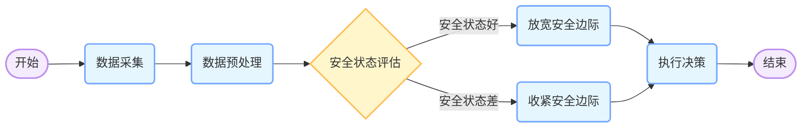

# AI实现的自适应安全边际计算模型

> 关键词：AI、自适应安全边际、计算模型、安全分析、风险评估

> 摘要：本文聚焦于AI实现的自适应安全边际计算模型，旨在深入探讨该模型的原理、算法、实际应用等方面。首先介绍了模型的背景，包括目的、预期读者、文档结构等内容。接着阐述核心概念，给出原理和架构的文本示意图与Mermaid流程图。详细讲解核心算法原理，并使用Python代码进行说明。分析数学模型和公式，辅以举例。通过项目实战展示代码案例并详细解读。探讨实际应用场景，推荐相关工具和资源。最后总结未来发展趋势与挑战，提供常见问题解答和扩展阅读参考资料，帮助读者全面理解和掌握该自适应安全边际计算模型。

## 1. 背景介绍 
### 1.1 目的和范围
在当今复杂多变的网络环境和各种业务场景中，安全问题日益突出。传统的安全边际计算方法往往是静态的，难以适应动态变化的环境和攻击模式。本模型的目的在于利用人工智能技术，构建一个能够自适应调整安全边际的计算模型，以更好地应对不断变化的安全威胁。

本模型的范围涵盖了多个领域，包括网络安全、金融安全、工业控制系统安全等。通过收集和分析相关数据，模型可以动态地评估系统的安全状态，并实时调整安全边际，以确保系统的安全性和稳定性。

### 1.2 预期读者
本文的预期读者包括从事安全领域研究和实践的专业人员，如安全分析师、网络工程师、数据科学家等。同时，也适合对人工智能和安全领域感兴趣的学生和研究人员阅读，帮助他们了解如何将人工智能技术应用于安全边际计算。

### 1.3 文档结构概述
本文将按照以下结构进行组织：首先介绍模型的背景信息，包括目的、预期读者和文档结构。然后阐述核心概念，给出模型的原理和架构。接着详细讲解核心算法原理，并使用Python代码进行实现。分析数学模型和公式，并通过举例进行说明。通过项目实战展示代码案例并进行详细解读。探讨模型的实际应用场景，推荐相关的工具和资源。最后总结模型的未来发展趋势与挑战，提供常见问题解答和扩展阅读参考资料。

### 1.4 术语表
#### 1.4.1 核心术语定义
- **自适应安全边际**：指模型能够根据系统的实时状态和环境变化，自动调整安全边界，以适应不同的安全需求。
- **计算模型**：是对安全边际进行计算的数学模型和算法的集合。
- **安全状态评估**：通过收集和分析系统的相关数据，对系统的安全状态进行量化评估。
- **风险评估**：对系统面临的各种安全风险进行分析和评估，确定风险的等级和可能性。

#### 1.4.2 相关概念解释
- **人工智能**：是一门研究如何使计算机能够模拟人类智能的学科，包括机器学习、深度学习、自然语言处理等技术。
- **机器学习**：是人工智能的一个重要分支，通过让计算机从数据中学习模式和规律，以实现预测和决策等任务。
- **深度学习**：是机器学习的一种特殊形式，使用多层神经网络来学习数据的复杂特征和表示。

#### 1.4.3 缩略词列表
- **AI**：Artificial Intelligence，人工智能
- **ML**：Machine Learning，机器学习
- **DL**：Deep Learning，深度学习

## 2. 核心概念与联系 

### 核心概念原理
自适应安全边际计算模型的核心原理是利用人工智能技术，特别是机器学习和深度学习算法，对系统的安全状态进行实时监测和评估。模型通过收集系统的各种数据，如网络流量、用户行为、系统日志等，对这些数据进行特征提取和分析，以确定系统的安全状态。

根据安全状态的评估结果，模型会动态地调整安全边际。当系统面临较高的安全风险时，模型会收紧安全边际，采取更加严格的安全措施；当系统的安全状态较好时，模型会适当放宽安全边际，以提高系统的性能和可用性。

### 架构的文本示意图
本模型主要由以下几个部分组成：
1. **数据采集模块**：负责收集系统的各种数据，包括网络流量、用户行为、系统日志等。
2. **数据预处理模块**：对采集到的数据进行清洗、归一化、特征提取等处理，以提高数据的质量和可用性。
3. **安全状态评估模块**：使用机器学习和深度学习算法对预处理后的数据进行分析，评估系统的安全状态。
4. **安全边际调整模块**：根据安全状态评估结果，动态地调整安全边际。
5. **决策执行模块**：根据调整后的安全边际，执行相应的安全决策，如防火墙规则调整、访问控制等。

### Mermaid 流程图


## 3. 核心算法原理 & 具体操作步骤 

### 核心算法原理
本模型主要使用机器学习中的监督学习算法，如支持向量机（SVM）、决策树、神经网络等，对系统的安全状态进行评估。以支持向量机为例，其基本原理是在特征空间中找到一个最优的超平面，将不同类别的数据分开。

在安全状态评估中，我们将正常数据和异常数据分别作为不同的类别，通过训练支持向量机模型，使其能够准确地识别正常数据和异常数据。根据识别结果，我们可以评估系统的安全状态。

### 具体操作步骤
1. **数据收集**：收集系统的各种数据，如网络流量、用户行为、系统日志等。
2. **数据预处理**：对收集到的数据进行清洗、归一化、特征提取等处理，以提高数据的质量和可用性。
3. **数据划分**：将预处理后的数据划分为训练集和测试集，一般按照 70% - 30% 或 80% - 20% 的比例进行划分。
4. **模型训练**：使用训练集对支持向量机模型进行训练，调整模型的参数，使其能够准确地识别正常数据和异常数据。
5. **模型评估**：使用测试集对训练好的模型进行评估，计算模型的准确率、召回率、F1 值等指标，评估模型的性能。
6. **安全状态评估**：将实时收集到的数据输入到训练好的模型中，根据模型的输出结果评估系统的安全状态。
7. **安全边际调整**：根据安全状态评估结果，动态地调整安全边际。

### Python源代码实现
```python
import numpy as np
from sklearn import svm
from sklearn.model_selection import train_test_split
from sklearn.metrics import accuracy_score

# 生成示例数据
np.random.seed(0)
X = np.r_[np.random.randn(20, 2) - [2, 2], np.random.randn(20, 2) + [2, 2]]
y = [0] * 20 + [1] * 20

# 划分训练集和测试集
X_train, X_test, y_train, y_test = train_test_split(X, y, test_size=0.3, random_state=42)

# 创建支持向量机模型
clf = svm.SVC(kernel='linear')

# 训练模型
clf.fit(X_train, y_train)

# 预测测试集
y_pred = clf.predict(X_test)

# 计算准确率
accuracy = accuracy_score(y_test, y_pred)
print(f"模型准确率: {accuracy}")

# 模拟实时数据
new_data = np.array([[1, 1], [-1, -1]])
prediction = clf.predict(new_data)
print(f"实时数据预测结果: {prediction}")
```

## 4. 数学模型和公式 & 详细讲解 & 举例说明 

### 支持向量机数学模型
支持向量机的目标是在特征空间中找到一个最优的超平面，使得不同类别的数据能够被最大程度地分开。对于线性可分的情况，超平面的方程可以表示为：

$$w^T x + b = 0$$

其中，$w$ 是超平面的法向量，$b$ 是偏置项，$x$ 是数据点。

为了找到最优的超平面，我们需要最大化间隔，即两个不同类别的数据点到超平面的最小距离。这个问题可以转化为以下的优化问题：

$$\min_{w, b} \frac{1}{2} \|w\|^2$$

$$s.t. \quad y_i (w^T x_i + b) \geq 1, \quad i = 1, 2, \cdots, n$$

其中，$y_i$ 是数据点 $x_i$ 的类别标签，$n$ 是数据点的数量。

### 详细讲解
上述优化问题是一个凸二次规划问题，可以使用拉格朗日乘子法求解。引入拉格朗日乘子 $\alpha_i \geq 0$，构造拉格朗日函数：

$$L(w, b, \alpha) = \frac{1}{2} \|w\|^2 - \sum_{i=1}^{n} \alpha_i (y_i (w^T x_i + b) - 1)$$

对 $w$ 和 $b$ 求偏导数并令其为 0，得到：

$$\frac{\partial L}{\partial w} = w - \sum_{i=1}^{n} \alpha_i y_i x_i = 0$$

$$\frac{\partial L}{\partial b} = -\sum_{i=1}^{n} \alpha_i y_i = 0$$

将上述结果代入拉格朗日函数，得到对偶问题：

$$\max_{\alpha} \sum_{i=1}^{n} \alpha_i - \frac{1}{2} \sum_{i=1}^{n} \sum_{j=1}^{n} \alpha_i \alpha_j y_i y_j x_i^T x_j$$

$$s.t. \quad \sum_{i=1}^{n} \alpha_i y_i = 0, \quad \alpha_i \geq 0, \quad i = 1, 2, \cdots, n$$

求解对偶问题得到最优的拉格朗日乘子 $\alpha^*$，然后可以计算出最优的 $w^*$ 和 $b^*$：

$$w^* = \sum_{i=1}^{n} \alpha_i^* y_i x_i$$

$$b^* = y_j - w^{*T} x_j$$

其中，$j$ 是任意一个满足 $0 < \alpha_j^* < C$ 的支持向量的索引。

### 举例说明
假设有以下两个类别的数据点：
- 类别 0：$x_1 = [1, 1], x_2 = [2, 2]$
- 类别 1：$x_3 = [-1, -1], x_4 = [-2, -2]$

我们可以将这些数据点代入上述公式，求解最优的超平面。具体步骤如下：
1. 初始化拉格朗日乘子 $\alpha_i$。
2. 求解对偶问题，得到最优的拉格朗日乘子 $\alpha^*$。
3. 计算最优的 $w^*$ 和 $b^*$。
4. 根据 $w^*$ 和 $b^*$ 确定最优的超平面。

在实际应用中，我们可以使用 Python 的 `scikit-learn` 库来实现支持向量机，避免手动求解复杂的优化问题。

## 5. 项目实战：代码实际案例和详细解释说明 

### 5.1  开发环境搭建
为了实现自适应安全边际计算模型，我们需要搭建以下开发环境：
1. **Python 环境**：建议使用 Python 3.7 及以上版本。
2. **必要的库**：安装 `numpy`、`pandas`、`scikit-learn`、`tensorflow` 等库。可以使用以下命令进行安装：
```bash
pip install numpy pandas scikit-learn tensorflow
```
3. **开发工具**：可以使用 PyCharm、Jupyter Notebook 等开发工具。

### 5.2  源代码详细实现和代码解读
```python
import numpy as np
import pandas as pd
from sklearn.model_selection import train_test_split
from sklearn.svm import SVC
from sklearn.metrics import accuracy_score

# 数据加载和预处理
def load_and_preprocess_data(file_path):
    data = pd.read_csv(file_path)
    X = data.drop('label', axis=1).values
    y = data['label'].values
    # 数据归一化
    X = (X - np.mean(X, axis=0)) / np.std(X, axis=0)
    return X, y

# 模型训练和评估
def train_and_evaluate_model(X, y):
    X_train, X_test, y_train, y_test = train_test_split(X, y, test_size=0.3, random_state=42)
    model = SVC(kernel='linear')
    model.fit(X_train, y_train)
    y_pred = model.predict(X_test)
    accuracy = accuracy_score(y_test, y_pred)
    print(f"模型准确率: {accuracy}")
    return model

# 安全状态评估和安全边际调整
def evaluate_security_status(model, new_data):
    prediction = model.predict(new_data)
    if np.all(prediction == 0):
        print("系统安全状态良好，适当放宽安全边际")
    else:
        print("系统存在安全风险，收紧安全边际")

# 主函数
def main():
    file_path = 'security_data.csv'
    X, y = load_and_preprocess_data(file_path)
    model = train_and_evaluate_model(X, y)
    # 模拟实时数据
    new_data = np.random.randn(10, X.shape[1])
    evaluate_security_status(model, new_data)

if __name__ == "__main__":
    main()
```

### 代码解读与分析
1. **数据加载和预处理**：`load_and_preprocess_data` 函数负责加载数据集，并对数据进行归一化处理，以提高模型的训练效果。
2. **模型训练和评估**：`train_and_evaluate_model` 函数将数据集划分为训练集和测试集，使用支持向量机模型进行训练，并评估模型的准确率。
3. **安全状态评估和安全边际调整**：`evaluate_security_status` 函数根据模型的预测结果，评估系统的安全状态，并根据安全状态调整安全边际。
4. **主函数**：`main` 函数调用上述函数，完成数据加载、模型训练、安全状态评估等任务。

## 6. 实际应用场景 
### 网络安全
在网络安全领域，自适应安全边际计算模型可以用于实时监测网络流量，识别异常的网络行为，如网络攻击、恶意软件感染等。通过动态调整安全边际，模型可以及时发现并阻止潜在的安全威胁，保护网络系统的安全。

### 金融安全
在金融领域，该模型可以用于风险评估和欺诈检测。通过分析用户的交易行为、信用记录等数据，模型可以评估用户的风险等级，并根据风险等级动态调整安全边际。例如，对于高风险用户，采取更加严格的身份验证和交易限制措施。

### 工业控制系统安全
在工业控制系统中，自适应安全边际计算模型可以用于监测系统的运行状态，识别潜在的安全隐患。通过实时调整安全边际，模型可以确保工业控制系统的稳定性和可靠性，防止因安全事件导致的生产中断和设备损坏。

## 7. 工具和资源推荐
### 7.1 学习资源推荐
#### 7.1.1 书籍推荐
- 《机器学习》（周志华）：全面介绍了机器学习的基本概念、算法和应用。
- 《深度学习》（Ian Goodfellow、Yoshua Bengio 和 Aaron Courville）：深度学习领域的经典著作，深入讲解了深度学习的原理和技术。
- 《Python 机器学习》（Sebastian Raschka）：结合 Python 语言，介绍了机器学习的算法和实践。

#### 7.1.2 在线课程
- Coursera 上的《机器学习》课程（Andrew Ng 教授）：经典的机器学习入门课程，涵盖了机器学习的基本概念和算法。
- edX 上的《深度学习》课程：由多位知名学者授课，深入讲解了深度学习的原理和应用。
- 网易云课堂上的《Python 数据分析与机器学习实战》：结合实际案例，介绍了 Python 在数据分析和机器学习中的应用。

#### 7.1.3 技术博客和网站
- Medium：有许多关于人工智能和机器学习的技术博客，提供了最新的研究成果和实践经验。
- Kaggle：一个数据科学竞赛平台，上面有许多关于机器学习和数据分析的案例和教程。
- 机器之心：专注于人工智能领域的资讯和技术分享，提供了丰富的学习资源。

### 7.2 开发工具框架推荐
#### 7.2.1 IDE和编辑器
- PyCharm：一款专业的 Python 集成开发环境，提供了丰富的代码编辑、调试和版本控制功能。
- Jupyter Notebook：一个交互式的开发环境，适合进行数据探索和模型实验。
- Visual Studio Code：一款轻量级的代码编辑器，支持多种编程语言和插件扩展。

#### 7.2.2 调试和性能分析工具
- PySnooper：一个简单易用的 Python 调试工具，可以实时查看函数的执行过程和变量的值。
- TensorBoard：TensorFlow 提供的可视化工具，可以用于查看模型的训练过程和性能指标。
- cProfile：Python 标准库中的性能分析工具，可以分析代码的运行时间和函数调用情况。

#### 7.2.3 相关框架和库
- scikit-learn：一个简单易用的机器学习库，提供了各种机器学习算法和工具。
- TensorFlow：一个开源的深度学习框架，广泛应用于图像识别、自然语言处理等领域。
- PyTorch：另一个流行的深度学习框架，具有动态图和易于使用的特点。

### 7.3 相关论文著作推荐
#### 7.3.1 经典论文
- 《Support-Vector Networks》（Cortes 和 Vapnik）：支持向量机领域的经典论文，介绍了支持向量机的基本原理和算法。
- 《ImageNet Classification with Deep Convolutional Neural Networks》（Krizhevsky 等人）：深度学习在图像识别领域的开创性论文，提出了 AlexNet 模型。
- 《Long Short-Term Memory》（Hochreiter 和 Schmidhuber）：介绍了长短期记忆网络（LSTM）的原理和应用。

#### 7.3.2 最新研究成果
- 可以关注顶级学术会议如 NeurIPS、ICML、CVPR 等的论文，了解人工智能和机器学习领域的最新研究成果。
- 也可以关注知名学术期刊如 Journal of Artificial Intelligence Research（JAIR）、Artificial Intelligence 等的文章。

#### 7.3.3 应用案例分析
- 可以查阅各大公司和研究机构发布的技术报告和案例分析，了解自适应安全边际计算模型在实际应用中的效果和经验。

## 8. 总结：未来发展趋势与挑战
### 未来发展趋势
- **与其他技术的融合**：自适应安全边际计算模型将与区块链、物联网、大数据等技术深度融合，为不同领域提供更加全面和高效的安全解决方案。
- **智能化程度的提高**：随着人工智能技术的不断发展，模型的智能化程度将不断提高，能够更加准确地识别安全威胁，自动调整安全策略。
- **应用领域的拓展**：该模型将在更多的领域得到应用，如医疗安全、能源安全等，为社会的安全和稳定提供保障。

### 挑战
- **数据隐私和安全**：在收集和处理大量数据的过程中，如何保护数据的隐私和安全是一个重要的挑战。
- **模型的可解释性**：人工智能模型往往是黑盒模型，难以解释其决策过程和结果。如何提高模型的可解释性，是一个需要解决的问题。
- **对抗攻击**：攻击者可能会采用对抗攻击的手段，试图欺骗模型，使其做出错误的决策。如何提高模型的抗攻击能力，是一个重要的研究方向。

## 9. 附录：常见问题与解答
### 问题 1：自适应安全边际计算模型与传统安全模型有什么区别？
传统安全模型往往是静态的，采用固定的安全策略和规则。而自适应安全边际计算模型能够根据系统的实时状态和环境变化，动态地调整安全边际，具有更强的适应性和灵活性。

### 问题 2：模型的训练数据从哪里获取？
模型的训练数据可以从多个来源获取，如网络日志、系统监控数据、用户行为数据等。在实际应用中，需要根据具体的场景和需求，选择合适的数据来源，并对数据进行清洗和预处理。

### 问题 3：如何评估模型的性能？
可以使用多种指标来评估模型的性能，如准确率、召回率、F1 值、ROC 曲线等。在实际应用中，需要根据具体的场景和需求，选择合适的评估指标。

### 问题 4：模型的训练时间和计算资源需求如何？
模型的训练时间和计算资源需求取决于数据的规模、模型的复杂度等因素。一般来说，数据规模越大、模型越复杂，训练时间和计算资源需求就越高。可以采用分布式计算、模型压缩等技术来减少训练时间和计算资源需求。

## 10. 扩展阅读 & 参考资料
- 《人工智能安全》（李开复等）
- 《网络安全技术与应用》杂志
- https://www.cs.cornell.edu/
- https://www.aaai.org/

作者：AI天才研究院/AI Genius Institute & 禅与计算机程序设计艺术 /Zen And The Art of Computer Programming