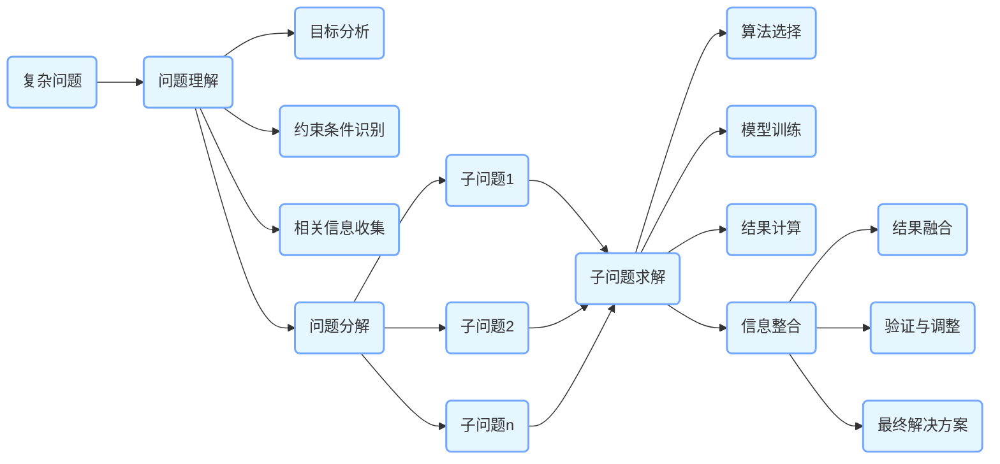

# AI思维链在复杂问题求解中的应用

> 关键词：AI思维链、复杂问题求解、推理机制、数学模型、实际应用

> 摘要：本文深入探讨了AI思维链在复杂问题求解中的应用。首先介绍了相关背景，包括目的范围、预期读者等。接着阐述了AI思维链的核心概念与联系，详细讲解了其核心算法原理及具体操作步骤，并给出了数学模型和公式。通过项目实战案例，展示了AI思维链在实际代码中的实现和应用。分析了其实际应用场景，推荐了学习、开发工具及相关论文著作。最后总结了未来发展趋势与挑战，并提供了常见问题解答和扩展阅读参考资料，旨在为读者全面呈现AI思维链在复杂问题求解方面的技术内涵和应用价值。

## 1. 背景介绍 
### 1.1 目的和范围
在当今数字化时代，我们面临着各种各样的复杂问题，如金融市场的风险预测、医疗领域的疾病诊断、交通系统的优化调度等。这些问题往往涉及多个因素，具有高度的不确定性和动态性，传统的问题求解方法难以满足需求。本文章的目的是深入研究AI思维链在复杂问题求解中的应用，探讨其原理、算法、实际应用等方面，为解决复杂问题提供新的思路和方法。

本文的范围涵盖了AI思维链的基本概念、核心算法、数学模型，以及在不同领域的实际应用案例。同时，还会介绍相关的学习资源、开发工具和最新研究成果，为读者提供全面的技术参考。

### 1.2 预期读者
本文预期读者包括人工智能领域的研究人员、开发者、技术爱好者，以及对复杂问题求解感兴趣的专业人士。对于初学者，本文可以作为入门教程，帮助他们了解AI思维链的基本原理和应用；对于有一定经验的从业者，本文可以提供深入的技术分析和实际案例，启发他们在实际项目中的应用。

### 1.3 文档结构概述
本文将按照以下结构进行组织：
- 核心概念与联系：介绍AI思维链的基本概念、原理和架构，通过文本示意图和Mermaid流程图进行直观展示。
- 核心算法原理 & 具体操作步骤：详细讲解AI思维链的核心算法原理，使用Python源代码进行阐述，并给出具体的操作步骤。
- 数学模型和公式 & 详细讲解 & 举例说明：介绍AI思维链的数学模型和公式，进行详细讲解，并通过实际例子进行说明。
- 项目实战：代码实际案例和详细解释说明：通过一个具体的项目实战案例，展示AI思维链在实际代码中的实现和应用，包括开发环境搭建、源代码详细实现和代码解读。
- 实际应用场景：分析AI思维链在不同领域的实际应用场景，如金融、医疗、交通等。
- 工具和资源推荐：推荐相关的学习资源、开发工具和论文著作，帮助读者进一步深入学习和研究。
- 总结：未来发展趋势与挑战：总结AI思维链在复杂问题求解中的应用现状，分析未来发展趋势和面临的挑战。
- 附录：常见问题与解答：提供常见问题的解答，帮助读者解决在学习和应用过程中遇到的问题。
- 扩展阅读 & 参考资料：提供相关的扩展阅读资料和参考书目，方便读者进一步深入学习。

### 1.4 术语表
#### 1.4.1 核心术语定义
- **AI思维链**：是一种模拟人类思维过程的人工智能技术，通过将复杂问题分解为多个子问题，逐步推理和求解，最终得到问题的解决方案。
- **复杂问题求解**：指的是解决那些具有高度不确定性、多个因素相互作用、难以用传统方法直接求解的问题。
- **推理机制**：AI思维链中用于从已知信息推导出新信息的规则和方法。
- **数学模型**：对AI思维链中各种关系和过程进行数学描述的模型。

#### 1.4.2 相关概念解释
- **知识表示**：将人类知识以计算机能够理解和处理的方式进行表示，是AI思维链的基础。常见的知识表示方法有逻辑表示、语义网络、框架表示等。
- **问题分解**：将复杂问题分解为多个相对简单的子问题，以便于逐个求解。这是AI思维链解决复杂问题的关键步骤。
- **信息融合**：将来自不同数据源的信息进行整合和处理，以提高信息的准确性和可靠性。在AI思维链中，信息融合可以帮助我们更全面地了解问题的本质。

#### 1.4.3 缩略词列表
- **AI**：Artificial Intelligence，人工智能
- **ML**：Machine Learning，机器学习
- **DL**：Deep Learning，深度学习

## 2. 核心概念与联系 

### 核心概念原理
AI思维链的核心原理是模拟人类的思维过程，将复杂问题分解为一系列的子问题，并通过逐步推理和求解这些子问题来得到最终的解决方案。具体来说，AI思维链包括以下几个关键步骤：
1. **问题理解**：对复杂问题进行深入分析，明确问题的目标、约束条件和相关信息。
2. **问题分解**：将复杂问题分解为多个相对简单的子问题，每个子问题都具有明确的目标和求解方法。
3. **子问题求解**：针对每个子问题，运用合适的算法和方法进行求解。
4. **信息整合**：将子问题的求解结果进行整合和处理，得到最终的解决方案。

### 架构的文本示意图
```plaintext
复杂问题
|
|-- 问题理解
|   |-- 目标分析
|   |-- 约束条件识别
|   |-- 相关信息收集
|
|-- 问题分解
|   |-- 子问题1
|   |-- 子问题2
|   |--...
|   |-- 子问题n
|
|-- 子问题求解
|   |-- 算法选择
|   |-- 模型训练
|   |-- 结果计算
|
|-- 信息整合
|   |-- 结果融合
|   |-- 验证与调整
|
|-- 最终解决方案
```

### Mermaid流程图


## 3. 核心算法原理 & 具体操作步骤 

### 核心算法原理
AI思维链的核心算法主要包括问题分解算法、子问题求解算法和信息整合算法。下面我们分别进行介绍。

#### 问题分解算法
问题分解算法的目标是将复杂问题分解为多个相对简单的子问题。一种常用的方法是基于层次分析法（AHP），该方法通过建立问题的层次结构，将复杂问题逐步分解为多个子问题。以下是一个简单的Python示例代码：
```python
class ProblemDecomposition:
    def __init__(self, problem):
        self.problem = problem

    def decompose(self):
        # 简单示例：将问题按关键词分解
        sub_problems = self.problem.split(" ")
        return sub_problems

# 示例使用
problem = "如何提高公司的市场竞争力"
decomposer = ProblemDecomposition(problem)
sub_problems = decomposer.decompose()
print("子问题列表:", sub_problems)
```

#### 子问题求解算法
子问题求解算法根据子问题的类型和特点选择合适的算法进行求解。例如，如果子问题是一个分类问题，可以使用机器学习中的分类算法，如决策树、支持向量机等。以下是一个使用决策树进行分类的Python示例代码：
```python
from sklearn.datasets import load_iris
from sklearn.model_selection import train_test_split
from sklearn.tree import DecisionTreeClassifier
from sklearn.metrics import accuracy_score

# 加载数据集
iris = load_iris()
X = iris.data
y = iris.target

# 划分训练集和测试集
X_train, X_test, y_train, y_test = train_test_split(X, y, test_size=0.2, random_state=42)

# 创建决策树分类器
clf = DecisionTreeClassifier()

# 训练模型
clf.fit(X_train, y_train)

# 预测
y_pred = clf.predict(X_test)

# 计算准确率
accuracy = accuracy_score(y_test, y_pred)
print("准确率:", accuracy)
```

#### 信息整合算法
信息整合算法的目标是将子问题的求解结果进行整合和处理，得到最终的解决方案。一种常用的方法是加权平均法，该方法根据子问题的重要性为每个子问题的求解结果分配一个权重，然后将这些结果进行加权平均。以下是一个简单的Python示例代码：
```python
def information_integration(results, weights):
    if len(results)!= len(weights):
        raise ValueError("结果列表和权重列表长度必须相同")
    integrated_result = sum([result * weight for result, weight in zip(results, weights)])
    return integrated_result

# 示例使用
results = [0.8, 0.9, 0.7]
weights = [0.3, 0.4, 0.3]
integrated_result = information_integration(results, weights)
print("整合结果:", integrated_result)
```

### 具体操作步骤
1. **问题理解**：仔细分析复杂问题，明确问题的目标、约束条件和相关信息。可以使用自然语言处理技术对问题进行解析和理解。
2. **问题分解**：使用问题分解算法将复杂问题分解为多个子问题。在分解过程中，要确保子问题之间相互独立且具有明确的求解目标。
3. **子问题求解**：针对每个子问题，选择合适的算法和方法进行求解。可以使用机器学习、深度学习等技术来解决子问题。
4. **信息整合**：使用信息整合算法将子问题的求解结果进行整合和处理，得到最终的解决方案。在整合过程中，要考虑子问题的重要性和相互关系。
5. **验证与调整**：对最终的解决方案进行验证和评估，如果发现问题，及时进行调整和优化。

## 4. 数学模型和公式 & 详细讲解 & 举例说明 

### 数学模型
AI思维链的数学模型可以用以下公式表示：

设复杂问题为 $P$，通过问题分解算法将其分解为 $n$ 个子问题 $P_1, P_2, \cdots, P_n$。每个子问题 $P_i$ 有一个求解结果 $R_i$，其重要性权重为 $w_i$，其中 $\sum_{i=1}^{n} w_i = 1$。

最终的解决方案 $S$ 可以通过信息整合算法得到，即：

$$S = \sum_{i=1}^{n} w_i R_i$$

### 详细讲解
- **问题分解**：将复杂问题 $P$ 分解为多个子问题 $P_i$ 的过程可以看作是一个映射函数 $f: P \to \{P_1, P_2, \cdots, P_n\}$。这个映射函数需要根据问题的特点和需求进行设计，确保子问题之间相互独立且具有明确的求解目标。
- **子问题求解**：对于每个子问题 $P_i$，使用合适的算法和方法进行求解，得到求解结果 $R_i$。求解过程可以看作是一个函数 $g_i: P_i \to R_i$，其中 $g_i$ 表示第 $i$ 个子问题的求解算法。
- **信息整合**：将子问题的求解结果 $R_i$ 进行整合，得到最终的解决方案 $S$。信息整合过程可以看作是一个加权求和函数 $h: \{R_1, R_2, \cdots, R_n\} \to S$，其中 $h$ 表示信息整合算法。

### 举例说明
假设我们要解决一个复杂的投资决策问题 $P$，通过问题分解算法将其分解为三个子问题：
- $P_1$：市场趋势分析
- $P_2$：公司财务状况评估
- $P_3$：行业竞争分析

通过对每个子问题进行求解，得到以下结果：
- $R_1 = 0.8$（市场趋势分析结果，表示市场前景较好）
- $R_2 = 0.9$（公司财务状况评估结果，表示公司财务状况良好）
- $R_3 = 0.7$（行业竞争分析结果，表示行业竞争较为激烈）

根据经验和专家意见，为每个子问题的求解结果分配以下权重：
- $w_1 = 0.3$
- $w_2 = 0.4$
- $w_3 = 0.3$

使用信息整合算法，计算最终的解决方案 $S$：

$$S = w_1 R_1 + w_2 R_2 + w_3 R_3 = 0.3 \times 0.8 + 0.4 \times 0.9 + 0.3 \times 0.7 = 0.81$$

最终的解决方案 $S = 0.81$ 表示该投资决策具有较高的可行性。

## 5. 项目实战：代码实际案例和详细解释说明 

### 5.1  开发环境搭建
在本项目实战中，我们将使用Python进行开发。以下是开发环境搭建的步骤：
1. **安装Python**：从Python官方网站（https://www.python.org/downloads/）下载并安装Python 3.x版本。
2. **安装必要的库**：使用pip命令安装以下必要的库：
```bash
pip install numpy pandas scikit-learn matplotlib
```
3. **选择开发工具**：可以选择使用Jupyter Notebook、PyCharm等开发工具进行代码编写和调试。

### 5.2  源代码详细实现和代码解读
我们以一个简单的客户流失预测问题为例，展示AI思维链在实际项目中的应用。

#### 数据加载和预处理
```python
import pandas as pd
from sklearn.preprocessing import LabelEncoder
from sklearn.model_selection import train_test_split

# 加载数据
data = pd.read_csv('customer_churn.csv')

# 处理缺失值
data = data.dropna()

# 对分类变量进行编码
categorical_columns = data.select_dtypes(include=['object']).columns
for col in categorical_columns:
    le = LabelEncoder()
    data[col] = le.fit_transform(data[col])

# 划分特征和标签
X = data.drop('Churn', axis=1)
y = data['Churn']

# 划分训练集和测试集
X_train, X_test, y_train, y_test = train_test_split(X, y, test_size=0.2, random_state=42)
```
**代码解读**：
- 首先使用`pandas`库加载客户流失数据集。
- 然后处理数据中的缺失值，这里简单地删除包含缺失值的行。
- 对于分类变量，使用`LabelEncoder`进行编码，将其转换为数值类型。
- 最后将数据集划分为特征矩阵 $X$ 和标签向量 $y$，并进一步划分为训练集和测试集。

#### 问题分解
在这个案例中，我们将客户流失预测问题分解为两个子问题：特征选择和模型训练。

```python
from sklearn.feature_selection import SelectKBest
from sklearn.feature_selection import chi2

# 特征选择
selector = SelectKBest(score_func=chi2, k=10)
X_train_selected = selector.fit_transform(X_train, y_train)
X_test_selected = selector.transform(X_test)
```
**代码解读**：
- 使用`SelectKBest`和`chi2`方法进行特征选择，选择得分最高的10个特征。
- 对训练集和测试集进行特征选择，得到选择后的特征矩阵。

#### 子问题求解
```python
from sklearn.ensemble import RandomForestClassifier
from sklearn.metrics import accuracy_score

# 模型训练
clf = RandomForestClassifier()
clf.fit(X_train_selected, y_train)

# 预测
y_pred = clf.predict(X_test_selected)

# 计算准确率
accuracy = accuracy_score(y_test, y_pred)
print("准确率:", accuracy)
```
**代码解读**：
- 使用`RandomForestClassifier`作为分类模型进行训练。
- 在测试集上进行预测，并计算预测准确率。

### 5.3  代码解读与分析
通过以上代码，我们展示了AI思维链在客户流失预测问题中的应用。具体步骤如下：
1. **数据预处理**：对原始数据进行清洗和编码，为后续的分析和建模做准备。
2. **问题分解**：将客户流失预测问题分解为特征选择和模型训练两个子问题。
3. **子问题求解**：分别对特征选择和模型训练子问题进行求解，得到选择后的特征和训练好的模型。
4. **结果评估**：在测试集上对模型进行评估，计算预测准确率。

通过这种方式，我们可以将复杂的客户流失预测问题分解为多个相对简单的子问题，逐步求解，最终得到问题的解决方案。

## 6. 实际应用场景 
### 金融领域
在金融领域，AI思维链可以用于风险评估、投资决策等方面。例如，在信用风险评估中，可以将评估问题分解为多个子问题，如客户信用历史分析、财务状况评估、行业风险分析等。通过对每个子问题进行求解，并将结果进行整合，可以得到更准确的信用风险评估结果。

### 医疗领域
在医疗领域，AI思维链可以用于疾病诊断、治疗方案推荐等方面。例如，在疾病诊断中，可以将诊断问题分解为症状分析、检查结果分析、病史分析等子问题。通过对每个子问题进行求解，并结合医学知识和专家经验，可以得到更准确的疾病诊断结果。

### 交通领域
在交通领域，AI思维链可以用于交通流量预测、路径规划等方面。例如，在交通流量预测中，可以将预测问题分解为历史数据分析、实时交通信息分析、天气因素分析等子问题。通过对每个子问题进行求解，并将结果进行整合，可以得到更准确的交通流量预测结果。

### 工业领域
在工业领域，AI思维链可以用于设备故障预测、生产过程优化等方面。例如，在设备故障预测中，可以将预测问题分解为设备运行数据监测、故障模式识别、维修历史分析等子问题。通过对每个子问题进行求解，并将结果进行整合，可以提前预测设备故障，减少停机时间。

## 7. 工具和资源推荐
### 7.1 学习资源推荐
#### 7.1.1 书籍推荐
- 《人工智能：一种现代的方法》：这本书是人工智能领域的经典教材，全面介绍了人工智能的基本概念、算法和应用。
- 《Python机器学习》：本书详细介绍了使用Python进行机器学习的方法和技术，适合初学者入门。
- 《深度学习》：由深度学习领域的三位巨头Ian Goodfellow、Yoshua Bengio和Aaron Courville合著，是深度学习领域的权威著作。

#### 7.1.2 在线课程
- Coursera上的“机器学习”课程：由斯坦福大学教授Andrew Ng授课，是机器学习领域的经典课程。
- edX上的“人工智能基础”课程：由哥伦比亚大学教授Peter Norvig授课，全面介绍了人工智能的基本概念和算法。
- 中国大学MOOC上的“深度学习实战”课程：由北京大学教授李宏毅授课，通过实际案例介绍深度学习的应用。

#### 7.1.3 技术博客和网站
- Medium：一个技术博客平台，上面有很多人工智能领域的优秀文章。
- Towards Data Science：专注于数据科学和人工智能领域的技术博客，提供了很多实用的教程和案例。
- arXiv：一个预印本服务器，上面有很多人工智能领域的最新研究成果。

### 7.2 开发工具框架推荐
#### 7.2.1 IDE和编辑器
- PyCharm：一款专业的Python集成开发环境，提供了丰富的功能和插件，适合大型项目开发。
- Jupyter Notebook：一个交互式的开发环境，支持Python、R等多种编程语言，适合数据分析和模型开发。
- Visual Studio Code：一款轻量级的代码编辑器，支持多种编程语言和插件，适合快速开发和调试。

#### 7.2.2 调试和性能分析工具
- PDB：Python自带的调试器，可以帮助我们调试Python代码。
- TensorBoard：TensorFlow提供的可视化工具，可以帮助我们分析模型的训练过程和性能。
- Py-Spy：一个Python性能分析工具，可以帮助我们找出代码中的性能瓶颈。

#### 7.2.3 相关框架和库
- TensorFlow：一个开源的深度学习框架，由Google开发，提供了丰富的深度学习模型和工具。
- PyTorch：一个开源的深度学习框架，由Facebook开发，具有动态图的优势，适合研究和开发。
- Scikit-learn：一个开源的机器学习库，提供了丰富的机器学习算法和工具，适合初学者入门。

### 7.3 相关论文著作推荐
#### 7.3.1 经典论文
- “A Logical Calculus of the Ideas Immanent in Nervous Activity”：由Warren McCulloch和Walter Pitts于1943年发表，提出了神经元模型，是人工智能领域的奠基之作。
- “Perceptrons: An Introduction to Computational Geometry”：由Frank Rosenblatt于1962年发表，提出了感知机模型，是神经网络的早期模型之一。
- “ImageNet Classification with Deep Convolutional Neural Networks”：由Alex Krizhevsky、Ilya Sutskever和Geoffrey Hinton于2012年发表，提出了AlexNet模型，开启了深度学习在计算机视觉领域的应用热潮。

#### 7.3.2 最新研究成果
- “Attention Is All You Need”：由Vaswani等人于2017年发表，提出了Transformer模型，是自然语言处理领域的重要突破。
- “Generative Adversarial Nets”：由Ian Goodfellow等人于2014年发表，提出了生成对抗网络（GAN），是生成式模型的重要进展。
- “BERT: Pre-training of Deep Bidirectional Transformers for Language Understanding”：由Jacob Devlin等人于2018年发表，提出了BERT模型，在自然语言处理领域取得了优异的成绩。

#### 7.3.3 应用案例分析
- “DeepMind's AlphaGo: Mastering the Game of Go”：介绍了DeepMind公司的AlphaGo如何通过深度学习和强化学习技术击败人类围棋冠军。
- “IBM Watson in Healthcare: Transforming Medicine”：介绍了IBM Watson在医疗领域的应用，如疾病诊断、治疗方案推荐等。
- “Tesla's Autopilot: Advancing Self-Driving Technology”：介绍了特斯拉公司的Autopilot自动驾驶技术，如何通过人工智能实现自动驾驶。

## 8. 总结：未来发展趋势与挑战
### 未来发展趋势
- **与其他技术的融合**：AI思维链将与大数据、云计算、物联网等技术深度融合，实现更强大的功能和应用。例如，通过与物联网技术结合，可以实时获取大量的数据，为AI思维链提供更丰富的信息。
- **跨领域应用**：AI思维链将在更多的领域得到应用，如教育、农业、环保等。例如，在教育领域，可以根据学生的学习情况和特点，提供个性化的学习方案。
- **智能化程度的提高**：随着人工智能技术的不断发展，AI思维链的智能化程度将不断提高。例如，能够自动识别问题类型，选择合适的算法和方法进行求解。

### 挑战
- **数据质量和安全**：AI思维链的应用依赖于大量的数据，数据的质量和安全直接影响到模型的性能和应用效果。因此，如何保证数据的质量和安全是一个重要的挑战。
- **算法复杂度和可解释性**：随着问题的复杂度增加，AI思维链所使用的算法也会变得越来越复杂。如何降低算法的复杂度，提高算法的可解释性，是一个需要解决的问题。
- **伦理和法律问题**：AI思维链的应用可能会带来一些伦理和法律问题，如隐私保护、算法偏见等。如何解决这些问题，确保AI思维链的应用符合伦理和法律要求，是一个重要的挑战。

## 9. 附录：常见问题与解答
### 问题1：AI思维链与传统人工智能方法有什么区别？
答：传统人工智能方法通常是针对具体问题设计特定的算法和模型，而AI思维链更注重模拟人类的思维过程，将复杂问题分解为多个子问题，逐步推理和求解。AI思维链具有更强的灵活性和适应性，能够处理更复杂的问题。

### 问题2：如何选择合适的问题分解方法？
答：选择合适的问题分解方法需要考虑问题的特点和需求。常见的问题分解方法有层次分析法、基于规则的方法、基于机器学习的方法等。可以根据问题的领域知识、数据特点和求解目标选择合适的方法。

### 问题3：AI思维链在实际应用中可能会遇到哪些问题？
答：在实际应用中，AI思维链可能会遇到数据质量问题、算法复杂度问题、模型可解释性问题等。此外，还可能会受到计算资源、时间限制等因素的影响。

### 问题4：如何提高AI思维链的性能？
答：可以通过以下方法提高AI思维链的性能：
- 提高数据质量，收集更多、更准确的数据。
- 选择合适的算法和模型，进行模型调优。
- 优化问题分解方法，提高子问题的求解效率。
- 进行信息融合和验证，提高最终解决方案的准确性。

## 10. 扩展阅读 & 参考资料
### 扩展阅读
- 《人工智能哲学》：探讨了人工智能领域的哲学问题，如意识、智能、伦理等。
- 《数据驱动的智能决策》：介绍了如何利用数据进行智能决策，包括数据挖掘、机器学习等技术。
- 《智能系统原理与设计》：详细介绍了智能系统的原理、设计方法和应用案例。

### 参考资料
- 周志华. 《机器学习》. 清华大学出版社, 2016.
- Ian Goodfellow, Yoshua Bengio, Aaron Courville. 《深度学习》. 人民邮电出版社, 2017.
- Stuart Russell, Peter Norvig. 《人工智能：一种现代的方法》. 清华大学出版社, 2006.

作者：AI天才研究院/AI Genius Institute & 禅与计算机程序设计艺术 /Zen And The Art of Computer Programming