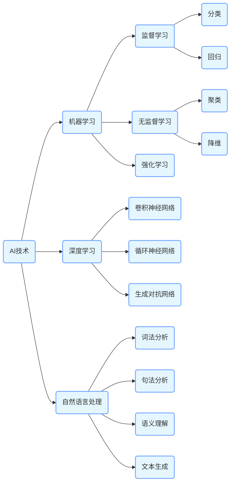

# AI技术在实际问题解决中的适用性分析

> 关键词：AI技术、实际问题解决、适用性分析、机器学习、深度学习

> 摘要：本文旨在深入分析AI技术在实际问题解决中的适用性。首先介绍了研究的背景、目的、预期读者等信息，详细阐述了AI相关的核心概念及其联系，通过Python代码讲解了核心算法原理和具体操作步骤，运用数学模型和公式进一步剖析，给出项目实战案例并进行代码解读，探讨了AI技术的实际应用场景，推荐了相关的学习资源、开发工具框架和论文著作，最后总结了AI技术未来发展趋势与挑战，并对常见问题进行解答。

## 1. 背景介绍 
### 1.1 目的和范围
随着科技的飞速发展，AI技术已经广泛应用于各个领域。本研究的目的在于系统地分析AI技术在不同实际问题解决中的适用性，明确其优势和局限性。研究范围涵盖了常见的AI技术，如机器学习、深度学习、自然语言处理等，以及多个实际应用领域，如医疗、金融、交通等。

### 1.2 预期读者
本文预期读者包括对AI技术感兴趣的技术爱好者、从事相关领域研究的科研人员、企业中考虑应用AI技术解决实际问题的决策者以及正在学习AI相关知识的学生。

### 1.3 文档结构概述
本文首先介绍背景信息，接着阐述AI的核心概念与联系，然后讲解核心算法原理和具体操作步骤，通过数学模型和公式深入分析，给出项目实战案例，探讨实际应用场景，推荐相关工具和资源，最后总结未来发展趋势与挑战，并解答常见问题。

### 1.4 术语表
#### 1.4.1 核心术语定义
- **AI（Artificial Intelligence）**：人工智能，是一门研究如何使计算机能够模拟人类智能的学科，包括学习、推理、感知等能力。
- **机器学习（Machine Learning）**：是AI的一个分支，让计算机通过数据和经验来自动改进性能，而无需明确编程。
- **深度学习（Deep Learning）**：基于人工神经网络的机器学习方法，通过构建多层神经网络来学习数据的复杂模式。
- **自然语言处理（Natural Language Processing）**：使计算机能够理解、处理和生成人类语言的技术。

#### 1.4.2 相关概念解释
- **模型（Model）**：在机器学习和深度学习中，模型是对数据模式的数学表示，通过训练数据来学习参数。
- **训练（Training）**：使用大量数据来调整模型参数，使其能够更好地预测或分类。
- **预测（Prediction）**：模型根据输入数据输出预测结果的过程。

#### 1.4.3 缩略词列表
- **AI**：Artificial Intelligence
- **ML**：Machine Learning
- **DL**：Deep Learning
- **NLP**：Natural Language Processing

## 2. 核心概念与联系 
### 核心概念原理
#### 机器学习
机器学习的核心原理是通过对大量数据的学习，找到数据中的模式和规律，从而对未知数据进行预测或分类。常见的机器学习算法包括决策树、支持向量机、朴素贝叶斯等。

#### 深度学习
深度学习基于人工神经网络，通过构建多层神经网络，自动从数据中学习复杂的特征表示。深度学习在图像识别、语音识别等领域取得了巨大的成功。

#### 自然语言处理
自然语言处理旨在让计算机理解和处理人类语言。它涉及到词法分析、句法分析、语义理解等多个方面，常用的技术包括词嵌入、循环神经网络等。

### 架构的文本示意图
```plaintext
AI技术
├── 机器学习
│   ├── 监督学习
│   │   ├── 分类
│   │   │   ├── 决策树分类
│   │   │   ├── 支持向量机分类
│   │   │   └── 朴素贝叶斯分类
│   │   └── 回归
│   │       ├── 线性回归
│   │       └── 逻辑回归
│   ├── 无监督学习
│   │   ├── 聚类
│   │   │   ├── K-Means聚类
│   │   │   └── 层次聚类
│   │   └── 降维
│   │       ├── 主成分分析
│   │       └── 线性判别分析
│   └── 强化学习
│       ├── Q学习
│       └── 深度强化学习
├── 深度学习
│   ├── 卷积神经网络
│   ├── 循环神经网络
│   │   ├── 长短期记忆网络
│   │   └── 门控循环单元
│   └── 生成对抗网络
└── 自然语言处理
    ├── 词法分析
    ├── 句法分析
    ├── 语义理解
    └── 文本生成
```

### Mermaid流程图


## 3. 核心算法原理 & 具体操作步骤 
### 机器学习 - 决策树算法原理
决策树是一种基于树结构进行决策的机器学习算法。它通过对数据的特征进行划分，构建一棵决策树，每个内部节点表示一个特征上的测试，每个分支表示一个测试输出，每个叶节点表示一个类别或值。

### Python代码实现决策树分类
```python
from sklearn.datasets import load_iris
from sklearn.model_selection import train_test_split
from sklearn.tree import DecisionTreeClassifier
from sklearn.metrics import accuracy_score

# 加载鸢尾花数据集
iris = load_iris()
X = iris.data
y = iris.target

# 划分训练集和测试集
X_train, X_test, y_train, y_test = train_test_split(X, y, test_size=0.3, random_state=42)

# 创建决策树分类器
clf = DecisionTreeClassifier()

# 训练模型
clf.fit(X_train, y_train)

# 预测
y_pred = clf.predict(X_test)

# 计算准确率
accuracy = accuracy_score(y_test, y_pred)
print(f"Accuracy: {accuracy}")
```

### 代码解释
1. **数据加载**：使用`load_iris`函数加载鸢尾花数据集。
2. **数据划分**：使用`train_test_split`函数将数据集划分为训练集和测试集。
3. **模型创建**：创建一个`DecisionTreeClassifier`对象。
4. **模型训练**：使用`fit`方法对模型进行训练。
5. **预测**：使用`predict`方法对测试集进行预测。
6. **准确率计算**：使用`accuracy_score`函数计算预测结果的准确率。

## 4. 数学模型和公式 & 详细讲解 & 举例说明 
### 线性回归数学模型
线性回归是一种用于预测连续数值的机器学习算法，其数学模型可以表示为：
$$
y = \theta_0 + \theta_1x_1 + \theta_2x_2 + \cdots + \theta_nx_n + \epsilon
$$
其中，$y$ 是预测值，$x_1, x_2, \cdots, x_n$ 是特征值，$\theta_0, \theta_1, \cdots, \theta_n$ 是模型的参数，$\epsilon$ 是误差项。

### 最小二乘法求解参数
线性回归的目标是找到一组参数 $\theta$，使得预测值与真实值之间的误差平方和最小。误差平方和可以表示为：
$$
J(\theta) = \frac{1}{2m}\sum_{i=1}^{m}(h_{\theta}(x^{(i)}) - y^{(i)})^2
$$
其中，$m$ 是样本数量，$h_{\theta}(x^{(i)})$ 是第 $i$ 个样本的预测值，$y^{(i)}$ 是第 $i$ 个样本的真实值。

最小二乘法通过对 $J(\theta)$ 求偏导数并令其等于零，得到参数 $\theta$ 的最优解：
$$
\theta = (X^TX)^{-1}X^Ty
$$
其中，$X$ 是特征矩阵，$y$ 是真实值向量。

### 举例说明
假设我们有一个简单的线性回归问题，数据集包含两个特征 $x_1$ 和 $x_2$，以及一个目标值 $y$。我们可以使用上述公式求解模型的参数。

```python
import numpy as np

# 生成示例数据
X = np.array([[1, 2], [2, 3], [3, 4], [4, 5]])
y = np.array([3, 5, 7, 9])

# 添加偏置项
X_b = np.c_[np.ones((X.shape[0], 1)), X]

# 求解参数
theta = np.linalg.inv(X_b.T.dot(X_b)).dot(X_b.T).dot(y)
print(f"Parameters: {theta}")
```

### 代码解释
1. **数据生成**：生成一个包含两个特征的数据集。
2. **添加偏置项**：在特征矩阵 $X$ 中添加一列全为 1 的向量，用于表示偏置项。
3. **求解参数**：使用最小二乘法公式求解模型的参数。

## 5. 项目实战：代码实际案例和详细解释说明 
### 5.1  开发环境搭建
#### 安装Python
首先，需要安装Python环境。可以从Python官方网站（https://www.python.org/downloads/）下载适合自己操作系统的Python版本，并按照安装向导进行安装。

#### 安装必要的库
使用`pip`命令安装必要的Python库，如`numpy`、`pandas`、`scikit-learn`、`tensorflow`等。
```sh
pip install numpy pandas scikit-learn tensorflow
```

### 5.2  源代码详细实现和代码解读
#### 手写数字识别项目
```python
import tensorflow as tf
from tensorflow.keras.datasets import mnist
from tensorflow.keras.models import Sequential
from tensorflow.keras.layers import Dense, Flatten
from tensorflow.keras.utils import to_categorical

# 加载MNIST数据集
(train_images, train_labels), (test_images, test_labels) = mnist.load_data()

# 数据预处理
train_images = train_images / 255.0
test_images = test_images / 255.0

train_labels = to_categorical(train_labels)
test_labels = to_categorical(test_labels)

# 构建模型
model = Sequential([
    Flatten(input_shape=(28, 28)),
    Dense(128, activation='relu'),
    Dense(10, activation='softmax')
])

# 编译模型
model.compile(optimizer='adam',
              loss='categorical_crossentropy',
              metrics=['accuracy'])

# 训练模型
model.fit(train_images, train_labels, epochs=5, batch_size=32)

# 评估模型
test_loss, test_acc = model.evaluate(test_images, test_labels)
print(f"Test accuracy: {test_acc}")
```

### 代码解读与分析
1. **数据加载**：使用`mnist.load_data()`函数加载MNIST手写数字数据集。
2. **数据预处理**：将图像像素值归一化到 0 到 1 之间，并将标签进行one-hot编码。
3. **模型构建**：使用`Sequential`模型构建一个简单的神经网络，包含一个Flatten层、一个全连接层和一个输出层。
4. **模型编译**：使用`adam`优化器、`categorical_crossentropy`损失函数和`accuracy`指标编译模型。
5. **模型训练**：使用`fit`方法对模型进行训练，指定训练轮数和批次大小。
6. **模型评估**：使用`evaluate`方法对模型在测试集上的性能进行评估。

## 6. 实际应用场景 
### 医疗领域
AI技术在医疗领域有广泛的应用，如疾病诊断、医学影像分析、药物研发等。例如，通过深度学习算法可以对医学影像（如X光、CT等）进行分析，辅助医生进行疾病诊断。

### 金融领域
在金融领域，AI技术可以用于风险评估、欺诈检测、投资决策等。例如，使用机器学习算法对客户的信用数据进行分析，评估客户的信用风险。

### 交通领域
AI技术在交通领域的应用包括自动驾驶、智能交通系统等。例如，自动驾驶汽车通过传感器收集数据，使用深度学习算法进行环境感知和决策。

### 教育领域
在教育领域，AI技术可以用于个性化学习、智能辅导等。例如，通过分析学生的学习数据，为学生提供个性化的学习建议。

## 7. 工具和资源推荐
### 7.1 学习资源推荐
#### 7.1.1 书籍推荐
- 《机器学习》（周志华）：介绍了机器学习的基本概念、算法和应用。
- 《深度学习》（Ian Goodfellow等）：深度学习领域的经典著作，深入讲解了深度学习的原理和方法。
- 《Python机器学习实战》（Sebastian Raschka）：通过实际案例介绍了如何使用Python进行机器学习。

#### 7.1.2 在线课程
- Coursera上的“机器学习”课程（Andrew Ng）：经典的机器学习课程，由斯坦福大学教授Andrew Ng授课。
- edX上的“深度学习微硕士项目”：涵盖了深度学习的多个方面，包括卷积神经网络、循环神经网络等。

#### 7.1.3 技术博客和网站
- Medium：有许多AI领域的优秀博客文章，涵盖了最新的研究成果和应用案例。
- arXiv：提供了大量的AI相关的预印本论文。

### 7.2 开发工具框架推荐
#### 7.2.1 IDE和编辑器
- PyCharm：功能强大的Python集成开发环境，适合开发大型项目。
- Jupyter Notebook：交互式的开发环境，适合进行数据探索和模型实验。

#### 7.2.2 调试和性能分析工具
- TensorBoard：TensorFlow的可视化工具，可用于监控模型训练过程和分析模型性能。
- Py-Spy：用于分析Python程序的性能瓶颈。

#### 7.2.3 相关框架和库
- TensorFlow：Google开发的开源深度学习框架，功能强大，应用广泛。
- PyTorch：Facebook开发的深度学习框架，具有动态图的特点，易于使用和调试。
- Scikit-learn：用于机器学习的Python库，提供了丰富的机器学习算法和工具。

### 7.3 相关论文著作推荐
#### 7.3.1 经典论文
- “Gradient-Based Learning Applied to Document Recognition”（Yann LeCun等）：介绍了卷积神经网络的经典论文。
- “Attention Is All You Need”（Ashish Vaswani等）：提出了Transformer模型，在自然语言处理领域取得了巨大的成功。

#### 7.3.2 最新研究成果
- 可以关注顶级学术会议（如NeurIPS、ICML、CVPR等）上的最新研究成果。

#### 7.3.3 应用案例分析
- 《AI未来进行式》（李开复、王咏刚）：介绍了AI技术在多个领域的应用案例。

## 8. 总结：未来发展趋势与挑战
### 未来发展趋势
- **多模态融合**：将图像、语音、文本等多种模态的数据进行融合，以实现更强大的AI系统。
- **边缘计算**：将AI模型部署到边缘设备上，实现实时、高效的处理。
- **可解释性AI**：提高AI模型的可解释性，使人们能够更好地理解模型的决策过程。

### 挑战
- **数据隐私和安全**：AI系统需要大量的数据进行训练，如何保护数据的隐私和安全是一个重要的挑战。
- **算法偏见**：AI模型可能会存在算法偏见，导致不公平的决策。
- **人才短缺**：AI领域的快速发展导致对专业人才的需求增加，人才短缺是一个亟待解决的问题。

## 9. 附录：常见问题与解答
### 问题1：AI技术是否能完全替代人类解决问题？
解答：目前AI技术虽然在许多领域取得了显著的成果，但还不能完全替代人类解决问题。AI技术在处理重复性、规律性的任务时具有优势，但在创造性、情感理解等方面还存在不足。

### 问题2：如何选择适合的AI算法？
解答：选择适合的AI算法需要考虑问题的类型（如分类、回归、聚类等）、数据的特点（如数据量、特征维度等）以及算法的性能和复杂度等因素。可以通过实验和比较不同算法的性能来选择最合适的算法。

### 问题3：AI技术的应用是否会导致大量失业？
解答：AI技术的应用可能会导致一些传统岗位的减少，但同时也会创造新的岗位。例如，AI系统的开发、维护和管理需要专业的人才。此外，AI技术还可以提高生产效率，促进经济发展，从而创造更多的就业机会。

## 10. 扩展阅读 & 参考资料
- 《人工智能：现代方法》（Stuart Russell等）
- 《人工智能时代》（李开复）
- https://www.tensorflow.org/
- https://pytorch.org/
- https://scikit-learn.org/

作者：AI天才研究院/AI Genius Institute & 禅与计算机程序设计艺术 /Zen And The Art of Computer Programming