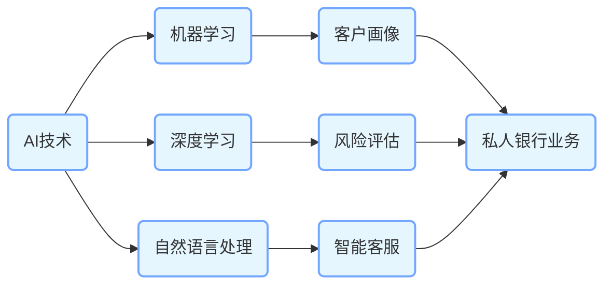

# AI技术在私人银行业务中的应用前景分析

> 关键词：AI技术、私人银行业务、应用前景、数据分析、客户服务

> 摘要：本文旨在深入分析AI技术在私人银行业务中的应用前景。首先介绍了文章的背景信息，包括目的、预期读者、文档结构和相关术语。接着阐述了AI技术和私人银行业务的核心概念及其联系，并给出了相应的示意图和流程图。详细讲解了核心算法原理，通过Python代码进行示例说明，同时介绍了相关的数学模型和公式。通过项目实战展示了AI技术在私人银行业务中的具体应用，包括开发环境搭建、源代码实现和代码解读。探讨了AI技术在私人银行业务中的实际应用场景，推荐了相关的学习资源、开发工具框架和论文著作。最后总结了未来发展趋势与挑战，提供了常见问题解答和扩展阅读参考资料。

## 1. 背景介绍 
### 1.1 目的和范围
本文章的目的是全面且深入地分析AI技术在私人银行业务领域的应用前景。范围涵盖了AI技术的主要类型及其在私人银行客户服务、风险管理、投资决策等核心业务环节的应用方式、优势和潜在挑战。通过对当前行业现状的研究以及对未来发展趋势的预测，为私人银行从业者、金融科技研究者和相关投资者提供有价值的参考。

### 1.2 预期读者
本文预期读者主要包括私人银行的管理人员、业务人员，他们可以从文中了解如何利用AI技术提升服务质量和业务效率；金融科技领域的研究者，能够从中获取关于AI技术在金融业务中应用的前沿信息和研究思路；以及对金融科技投资感兴趣的投资者，帮助他们评估相关投资机会和风险。

### 1.3 文档结构概述
本文首先介绍背景信息，为读者理解后续内容奠定基础。接着阐述核心概念与联系，使读者对AI技术和私人银行业务有清晰的认识。详细讲解核心算法原理和数学模型，通过Python代码示例和具体公式加深读者理解。然后通过项目实战展示AI技术在私人银行业务中的实际应用过程。分析实际应用场景，让读者了解AI技术的具体应用方向。推荐相关的学习资源、开发工具框架和论文著作，为读者进一步学习和研究提供便利。最后总结未来发展趋势与挑战，解答常见问题，并提供扩展阅读参考资料。

### 1.4 术语表
#### 1.4.1 核心术语定义
- **AI技术（Artificial Intelligence Technology）**：是指让计算机模拟人类智能的一系列技术，包括机器学习、深度学习、自然语言处理、计算机视觉等，旨在使计算机能够像人类一样感知、理解、学习和决策。
- **私人银行业务（Private Banking Business）**：是面向高净值客户提供的个性化、专业化金融服务，涵盖财富管理、投资咨询、税务规划、遗产规划等多个领域，以满足客户复杂的金融需求。
- **机器学习（Machine Learning）**：是AI的一个分支，通过让计算机从数据中自动学习模式和规律，从而进行预测和决策，而无需明确的编程指令。
- **深度学习（Deep Learning）**：是机器学习的一种特殊形式，基于多层神经网络模型，能够自动从大量数据中学习复杂的特征和模式，在图像识别、语音识别等领域取得了显著成果。
- **自然语言处理（Natural Language Processing）**：是AI的一个重要领域，研究如何让计算机理解、处理和生成人类语言，包括文本分类、情感分析、机器翻译等应用。

#### 1.4.2 相关概念解释
- **客户画像（Customer Profile）**：是根据客户的基本信息、交易行为、偏好等数据构建的客户模型，用于深入了解客户需求和特征，为个性化服务提供依据。
- **风险评估（Risk Assessment）**：是对金融业务中可能面临的风险进行识别、分析和评估的过程，通过建立风险模型和指标体系，为风险管理决策提供支持。
- **投资组合优化（Portfolio Optimization）**：是根据投资者的风险偏好和投资目标，通过数学模型和算法对投资组合进行优化配置，以实现收益最大化和风险最小化。

#### 1.4.3 缩略词列表
- **AI**：Artificial Intelligence（人工智能）
- **ML**：Machine Learning（机器学习）
- **DL**：Deep Learning（深度学习）
- **NLP**：Natural Language Processing（自然语言处理）
- **API**：Application Programming Interface（应用程序编程接口）

## 2. 核心概念与联系 
### 核心概念原理
#### AI技术原理
AI技术的核心原理是模拟人类智能的认知过程，包括感知、学习、推理和决策。机器学习是AI的重要实现方式，其基本原理是通过对大量数据的学习，构建模型来预测和决策。例如，在分类问题中，机器学习算法会根据训练数据学习不同类别之间的特征差异，从而对新的数据进行分类。深度学习则是在机器学习的基础上，通过构建多层神经网络来自动学习数据的复杂特征，提高模型的性能。自然语言处理技术则是通过对文本数据的处理和分析，实现计算机对人类语言的理解和生成。

#### 私人银行业务原理
私人银行业务的核心是为高净值客户提供个性化的金融服务。其原理是基于对客户需求的深入了解，通过专业的金融知识和资源，为客户制定定制化的财富管理方案。私人银行需要综合考虑客户的资产状况、风险偏好、投资目标等因素，提供包括投资咨询、资产配置、税务规划等在内的全方位服务。

### 架构的文本示意图
```plaintext
              AI技术
             /   |   \
机器学习  深度学习  自然语言处理
     |        |        |
客户画像  风险评估  智能客服
     |        |        |
私人银行业务
```
该示意图展示了AI技术的主要类型与私人银行业务中几个关键应用环节的关系。机器学习可用于构建客户画像，深度学习可用于风险评估，自然语言处理可用于智能客服，这些应用共同服务于私人银行业务。

### Mermaid流程图

此流程图清晰地展示了AI技术的不同类型如何分别应用于私人银行业务的各个具体环节，最终汇聚到私人银行业务这个整体中。

## 3. 核心算法原理 & 具体操作步骤 
### 机器学习中的线性回归算法原理
线性回归是一种简单而常用的机器学习算法，用于建立自变量和因变量之间的线性关系。其基本原理是通过最小化预测值与真实值之间的误差平方和，来确定最佳的回归系数。

### Python代码示例
```python
import numpy as np
from sklearn.linear_model import LinearRegression
import matplotlib.pyplot as plt

# 生成示例数据
X = np.array([1, 2, 3, 4, 5]).reshape(-1, 1)
y = np.array([2, 4, 6, 8, 10])

# 创建线性回归模型
model = LinearRegression()

# 训练模型
model.fit(X, y)

# 进行预测
new_X = np.array([6]).reshape(-1, 1)
prediction = model.predict(new_X)

print(f"预测值: {prediction[0]}")

# 可视化结果
plt.scatter(X, y, color='blue', label='实际数据')
plt.plot(X, model.predict(X), color='red', linewidth=2, label='回归直线')
plt.scatter(new_X, prediction, color='green', label='预测点')
plt.xlabel('自变量')
plt.ylabel('因变量')
plt.title('线性回归示例')
plt.legend()
plt.show()
```
### 具体操作步骤
1. **数据准备**：收集和整理相关数据，将自变量和因变量分别存储在合适的数据结构中。在上述代码中，我们使用`numpy`数组来存储数据。
2. **模型创建**：实例化一个线性回归模型对象。在代码中，使用`LinearRegression()`创建模型。
3. **模型训练**：使用训练数据对模型进行训练，让模型学习自变量和因变量之间的关系。通过调用`fit()`方法完成训练。
4. **预测**：使用训练好的模型对新的数据进行预测。调用`predict()`方法得到预测结果。
5. **结果可视化**：使用`matplotlib`库将实际数据、回归直线和预测点可视化，帮助我们直观地理解模型的效果。

## 4. 数学模型和公式 & 详细讲解 & 举例说明 
### 线性回归的数学模型和公式
线性回归的数学模型可以表示为：
$$y = \beta_0 + \beta_1x_1 + \beta_2x_2 + \cdots + \beta_nx_n + \epsilon$$
其中，$y$ 是因变量，$x_1, x_2, \cdots, x_n$ 是自变量，$\beta_0, \beta_1, \cdots, \beta_n$ 是回归系数，$\epsilon$ 是误差项。

在简单线性回归中，只有一个自变量，模型可以简化为：
$$y = \beta_0 + \beta_1x + \epsilon$$

为了确定回归系数 $\beta_0$ 和 $\beta_1$，我们通常使用最小二乘法。最小二乘法的目标是最小化误差平方和：
$$S(\beta_0, \beta_1) = \sum_{i=1}^{m}(y_i - (\beta_0 + \beta_1x_i))^2$$
其中，$m$ 是样本数量，$y_i$ 是第 $i$ 个样本的实际值，$x_i$ 是第 $i$ 个样本的自变量值。

通过对 $S(\beta_0, \beta_1)$ 分别求关于 $\beta_0$ 和 $\beta_1$ 的偏导数，并令偏导数为 0，可以得到回归系数的计算公式：
$$\beta_1 = \frac{\sum_{i=1}^{m}(x_i - \bar{x})(y_i - \bar{y})}{\sum_{i=1}^{m}(x_i - \bar{x})^2}$$
$$\beta_0 = \bar{y} - \beta_1\bar{x}$$
其中，$\bar{x}$ 和 $\bar{y}$ 分别是自变量和因变量的均值。

### 详细讲解
线性回归的核心思想是找到一条直线，使得所有数据点到这条直线的垂直距离的平方和最小。回归系数 $\beta_0$ 表示直线在 $y$ 轴上的截距，$\beta_1$ 表示直线的斜率。通过最小二乘法计算得到的回归系数可以使模型在训练数据上的预测误差最小。

### 举例说明
假设我们有一组关于房屋面积和房价的数据，房屋面积作为自变量 $x$，房价作为因变量 $y$。我们可以使用线性回归模型来预测不同面积房屋的价格。

| 房屋面积 ($x$) | 房价 ($y$) |
| -------------- | ---------- |
| 50             | 100        |
| 60             | 120        |
| 70             | 140        |
| 80             | 160        |
| 90             | 180        |

首先，计算自变量和因变量的均值：
$$\bar{x} = \frac{50 + 60 + 70 + 80 + 90}{5} = 70$$
$$\bar{y} = \frac{100 + 120 + 140 + 160 + 180}{5} = 140$$

然后，计算 $\beta_1$：
$$\sum_{i=1}^{5}(x_i - \bar{x})(y_i - \bar{y}) = (50 - 70)(100 - 140) + (60 - 70)(120 - 140) + (70 - 70)(140 - 140) + (80 - 70)(160 - 140) + (90 - 70)(180 - 140) = 2000$$
$$\sum_{i=1}^{5}(x_i - \bar{x})^2 = (50 - 70)^2 + (60 - 70)^2 + (70 - 70)^2 + (80 - 70)^2 + (90 - 70)^2 = 1000$$
$$\beta_1 = \frac{2000}{1000} = 2$$

最后，计算 $\beta_0$：
$$\beta_0 = \bar{y} - \beta_1\bar{x} = 140 - 2 \times 70 = 0$$

所以，线性回归模型为 $y = 2x$。如果我们想预测面积为 100 的房屋价格，将 $x = 100$ 代入模型，得到 $y = 2 \times 100 = 200$。

## 5. 项目实战：代码实际案例和详细解释说明 
### 5.1  开发环境搭建
#### 安装Python
首先，从Python官方网站（https://www.python.org/downloads/）下载并安装适合你操作系统的Python版本。建议安装Python 3.7及以上版本。

#### 安装必要的库
使用`pip`命令安装以下必要的Python库：
```bash
pip install numpy pandas scikit-learn matplotlib
```
- `numpy`：用于数值计算和数组操作。
- `pandas`：用于数据处理和分析。
- `scikit-learn`：提供了丰富的机器学习算法和工具。
- `matplotlib`：用于数据可视化。

### 5.2  源代码详细实现和代码解读
以下是一个使用机器学习算法进行客户信用风险评估的示例代码：
```python
import pandas as pd
from sklearn.model_selection import train_test_split
from sklearn.ensemble import RandomForestClassifier
from sklearn.metrics import accuracy_score

# 加载数据集
data = pd.read_csv('credit_data.csv')

# 分离特征和标签
X = data.drop('default', axis=1)
y = data['default']

# 划分训练集和测试集
X_train, X_test, y_train, y_test = train_test_split(X, y, test_size=0.2, random_state=42)

# 创建随机森林分类器
model = RandomForestClassifier(n_estimators=100, random_state=42)

# 训练模型
model.fit(X_train, y_train)

# 进行预测
y_pred = model.predict(X_test)

# 计算准确率
accuracy = accuracy_score(y_test, y_pred)
print(f"模型准确率: {accuracy}")
```
### 代码解读
1. **数据加载**：使用`pandas`库的`read_csv()`函数加载存储在`credit_data.csv`文件中的客户信用数据集。
2. **特征和标签分离**：将数据集中除`default`列以外的所有列作为特征，存储在`X`中；将`default`列作为标签，存储在`y`中。
3. **数据集划分**：使用`train_test_split()`函数将数据集划分为训练集和测试集，其中测试集占总数据的20%。
4. **模型创建**：实例化一个随机森林分类器对象，设置`n_estimators`参数为100，表示使用100棵决策树进行集成。
5. **模型训练**：使用训练集数据对模型进行训练，调用`fit()`方法。
6. **预测**：使用训练好的模型对测试集数据进行预测，调用`predict()`方法得到预测结果。
7. **准确率计算**：使用`accuracy_score()`函数计算模型在测试集上的准确率，并打印结果。

### 5.3  代码解读与分析
随机森林是一种集成学习算法，它通过组合多个决策树来提高模型的性能和稳定性。在这个示例中，我们使用随机森林分类器对客户的信用风险进行评估，判断客户是否会违约。

通过将数据集划分为训练集和测试集，我们可以评估模型在未见过的数据上的性能。准确率是一个常用的评估指标，它表示模型预测正确的样本数占总样本数的比例。在实际应用中，我们还可以使用其他评估指标，如精确率、召回率、F1值等，来更全面地评估模型的性能。

## 6. 实际应用场景 
### 客户服务
- **智能客服**：AI技术可以实现智能客服系统，通过自然语言处理技术理解客户的问题，并提供准确的回答和解决方案。智能客服可以24小时不间断服务，提高客户服务效率和响应速度，同时降低人力成本。
- **个性化推荐**：基于客户画像和历史交易数据，使用机器学习算法为客户提供个性化的产品和服务推荐。例如，根据客户的投资偏好和风险承受能力，推荐适合的理财产品。

### 风险管理
- **信用风险评估**：利用机器学习算法对客户的信用风险进行评估，预测客户违约的可能性。通过分析客户的个人信息、信用记录、财务状况等多维度数据，提高信用风险评估的准确性和效率。
- **市场风险监测**：使用AI技术对市场数据进行实时监测和分析，预测市场趋势和风险。例如，通过对股票价格、利率、汇率等数据的分析，及时发现市场风险并采取相应的措施。

### 投资决策
- **投资组合优化**：基于客户的投资目标和风险偏好，使用数学模型和算法对投资组合进行优化配置。AI技术可以快速处理大量的市场数据和历史数据，找到最优的投资组合方案，提高投资收益和降低风险。
- **投资策略生成**：通过对市场数据和行业动态的分析，使用机器学习算法生成投资策略。例如，根据宏观经济数据、公司财务报表等信息，预测股票的涨跌趋势，为投资者提供投资建议。

## 7. 工具和资源推荐
### 7.1 学习资源推荐
#### 7.1.1 书籍推荐
- 《人工智能：一种现代的方法》：全面介绍了人工智能的基本概念、算法和应用，是人工智能领域的经典教材。
- 《Python机器学习》：详细讲解了使用Python进行机器学习的方法和技巧，适合初学者入门。
- 《深度学习》：由深度学习领域的三位顶尖专家撰写，深入介绍了深度学习的理论和实践。

#### 7.1.2 在线课程
- Coursera上的“机器学习”课程：由斯坦福大学教授Andrew Ng主讲，是机器学习领域最受欢迎的在线课程之一。
- edX上的“人工智能基础”课程：提供了人工智能的基础知识和实践项目，帮助学习者快速入门。
- 阿里云天池的“AI实战营”：提供了丰富的AI实战项目和案例，适合有一定基础的学习者提升实践能力。

#### 7.1.3 技术博客和网站
- Medium：有许多AI领域的专家和从业者分享他们的经验和见解，是获取最新技术信息的好地方。
- Towards Data Science：专注于数据科学和机器学习领域，提供了大量的技术文章和教程。
- AI科技评论：关注人工智能的前沿技术和应用，有很多深度的分析和报道。

### 7.2 开发工具框架推荐
#### 7.2.1 IDE和编辑器
- PyCharm：是一款专业的Python集成开发环境，提供了丰富的代码编辑、调试和项目管理功能。
- Jupyter Notebook：是一个交互式的开发环境，适合进行数据探索、模型训练和结果展示。
- Visual Studio Code：是一款轻量级的代码编辑器，支持多种编程语言和插件扩展，对Python开发也有很好的支持。

#### 7.2.2 调试和性能分析工具
- TensorBoard：是TensorFlow提供的可视化工具，可以帮助开发者监控模型训练过程、分析模型性能和可视化数据。
- Py-Spy：是一个轻量级的Python性能分析工具，可以实时监测Python程序的CPU使用率和函数调用情况。
- Scalene：是一个高性能的Python性能分析器，能够准确地分析Python代码的性能瓶颈。

#### 7.2.3 相关框架和库
- TensorFlow：是一个开源的深度学习框架，提供了丰富的工具和接口，支持多种深度学习模型的开发和训练。
- PyTorch：是另一个流行的深度学习框架，具有简洁易用的API和动态计算图的特点，适合快速开发和实验。
- Scikit-learn：是一个用于机器学习的Python库，提供了多种机器学习算法和工具，包括分类、回归、聚类等。

### 7.3 相关论文著作推荐
#### 7.3.1 经典论文
- “ImageNet Classification with Deep Convolutional Neural Networks”：介绍了AlexNet卷积神经网络，开启了深度学习在计算机视觉领域的革命。
- “Long Short-Term Memory”：提出了长短期记忆网络（LSTM），解决了传统循环神经网络的梯度消失问题，在自然语言处理和时间序列分析中得到了广泛应用。
- “Attention Is All You Need”：提出了Transformer模型，引入了注意力机制，在自然语言处理领域取得了巨大成功。

#### 7.3.2 最新研究成果
- 关注顶级学术会议如NeurIPS、ICML、CVPR等的最新论文，了解AI技术的前沿研究动态。
- 一些知名的研究机构如OpenAI、DeepMind等会发布他们的最新研究成果，可以通过他们的官方网站获取相关信息。

#### 7.3.3 应用案例分析
- 《金融科技：框架与实践》：介绍了金融科技在各个领域的应用案例，包括AI技术在私人银行业务中的应用。
- 一些金融科技公司的官方博客和报告，会分享他们在实际项目中的经验和成果，可以从中学习到AI技术在私人银行业务中的具体应用方法。

## 8. 总结：未来发展趋势与挑战
### 未来发展趋势
- **更加智能化和个性化**：AI技术将不断发展，私人银行的服务将更加智能化和个性化。智能客服将具备更强的理解和交互能力，能够更好地满足客户的需求；个性化推荐将更加精准，为客户提供更符合其需求的产品和服务。
- **与区块链等技术融合**：AI技术将与区块链、物联网等其他新兴技术融合，为私人银行业务带来更多的创新和发展机会。例如，区块链技术可以提高数据的安全性和可信度，与AI技术结合可以实现更高效的风险管理和投资决策。
- **拓展服务领域**：AI技术将帮助私人银行拓展服务领域，不仅仅局限于传统的财富管理和投资咨询。例如，在税务规划、遗产规划等领域，AI技术可以提供更专业的建议和解决方案。

### 挑战
- **数据隐私和安全问题**：AI技术的应用需要大量的客户数据，如何保护客户数据的隐私和安全是一个重要的挑战。私人银行需要加强数据安全管理，采取有效的技术和管理措施，防止数据泄露和滥用。
- **算法可解释性问题**：一些复杂的AI算法，如深度学习模型，往往是黑盒模型，难以解释其决策过程和结果。在金融领域，算法的可解释性非常重要，因为它关系到客户的信任和监管的要求。如何提高AI算法的可解释性是一个亟待解决的问题。
- **人才短缺问题**：AI技术在私人银行业务中的应用需要既懂金融又懂AI技术的复合型人才。目前，这类人才相对短缺，私人银行需要加强人才培养和引进，提高员工的技术水平和创新能力。

## 9. 附录：常见问题与解答
### 问题1：AI技术在私人银行业务中的应用是否会取代人类员工？
解答：不会。虽然AI技术可以提高效率和准确性，但在私人银行业务中，人类员工的专业知识、经验和人际交往能力仍然是不可或缺的。AI技术主要用于辅助人类员工，帮助他们更好地完成工作，例如提供数据分析和决策支持等。

### 问题2：AI技术在私人银行业务中的应用是否存在风险？
解答：存在一定风险。例如，数据隐私和安全风险、算法偏见风险、模型误判风险等。私人银行需要采取相应的措施来管理和控制这些风险，如加强数据安全保护、进行算法审计和模型评估等。

### 问题3：如何评估AI技术在私人银行业务中的应用效果？
解答：可以从多个方面进行评估，如客户满意度、业务效率提升、风险管理效果、投资收益等。同时，可以使用一些量化指标，如准确率、召回率、F1值等，来评估模型的性能。

### 问题4：私人银行在应用AI技术时需要注意哪些法律和监管问题？
解答：需要遵守相关的法律法规，如数据保护法、金融监管规定等。确保数据的合法收集、使用和存储，保护客户的隐私和权益。同时，要确保AI算法的公平性和透明度，避免算法歧视和不正当竞争。

## 10. 扩展阅读 & 参考资料
### 扩展阅读
- 《金融科技时代的银行转型》：深入探讨了金融科技对银行业的影响和银行转型的策略。
- 《AI未来进行式》：介绍了AI技术的发展趋势和未来应用场景，对理解AI技术在私人银行业务中的应用有一定的帮助。

### 参考资料
- 《人工智能发展报告》：提供了人工智能领域的最新发展动态和研究成果。
- 各大金融机构和研究机构发布的关于金融科技和私人银行业务的报告和研究论文。

作者：AI天才研究院/AI Genius Institute & 禅与计算机程序设计艺术 /Zen And The Art of Computer Programming