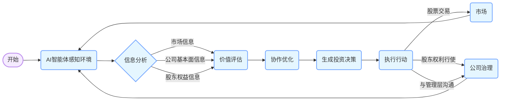

# AI智能体协作优化价值投资的股东积极主义策略

> 关键词：AI智能体、价值投资、股东积极主义策略、协作优化、金融投资

> 摘要：本文聚焦于利用AI智能体协作来优化价值投资中的股东积极主义策略。首先介绍了相关背景知识，包括目的范围、预期读者等。接着阐述了核心概念，如AI智能体、价值投资和股东积极主义策略及其相互联系。详细讲解了核心算法原理，并用Python代码进行说明。通过数学模型和公式进一步剖析策略的理论基础。给出项目实战案例，从开发环境搭建到代码实现与解读。探讨了实际应用场景，推荐了学习、开发相关的工具和资源，最后总结未来发展趋势与挑战，还包含常见问题解答和扩展阅读参考资料，旨在为投资者和研究者提供全面深入的技术指导和理论支持。

## 1. 背景介绍 
### 1.1 目的和范围
本研究的目的在于探索如何借助AI智能体的协作能力来提升价值投资中股东积极主义策略的效果。价值投资强调寻找被低估的资产并长期持有，而股东积极主义策略则是股东通过积极参与公司治理等方式来增加自身权益。随着金融市场的日益复杂和数据量的爆炸式增长，传统的投资策略面临着诸多挑战。AI智能体具有强大的数据处理和决策能力，通过多个智能体之间的协作，可以更全面地分析市场信息，优化投资决策。

本研究的范围涵盖了AI智能体的设计与协作机制、价值投资的理论和方法、股东积极主义策略的实施和评估等方面。同时，通过实际案例分析，验证AI智能体协作在优化股东积极主义策略中的有效性。

### 1.2 预期读者
本文的预期读者包括金融投资者、投资机构的研究人员、金融科技领域的开发者以及对人工智能在金融领域应用感兴趣的学者。对于投资者来说，本文可以提供新的投资思路和方法；对于研究人员和开发者，本文则可以作为技术研究和开发的参考。

### 1.3 文档结构概述
本文共分为十个部分。第一部分是背景介绍，阐述研究的目的、范围、预期读者和文档结构。第二部分介绍核心概念与联系，包括AI智能体、价值投资和股东积极主义策略的定义和相互关系，并给出示意图和流程图。第三部分讲解核心算法原理和具体操作步骤，用Python代码详细说明。第四部分介绍数学模型和公式，并进行详细讲解和举例说明。第五部分是项目实战，包括开发环境搭建、源代码实现和代码解读。第六部分探讨实际应用场景。第七部分推荐相关的学习资源、开发工具和论文著作。第八部分总结未来发展趋势与挑战。第九部分是附录，解答常见问题。第十部分提供扩展阅读和参考资料。

### 1.4 术语表
#### 1.4.1 核心术语定义
- **AI智能体（AI Agent）**：是一种能够感知环境、进行决策并采取行动的人工智能实体。它可以根据预设的规则或学习到的知识，自主地与环境进行交互。
- **价值投资（Value Investing）**：是一种投资策略，投资者通过分析公司的基本面，寻找被市场低估的股票，并长期持有，以获取资本增值。
- **股东积极主义策略（Shareholder Activism Strategy）**：指股东通过行使股东权利，如投票、提出议案、与管理层沟通等方式，积极参与公司治理，以提升公司价值和股东权益。

#### 1.4.2 相关概念解释
- **协作优化（Collaborative Optimization）**：多个AI智能体通过信息共享和协同工作，共同优化投资决策，以实现整体利益的最大化。
- **基本面分析（Fundamental Analysis）**：通过研究公司的财务报表、行业前景、管理层能力等基本面因素，评估公司的内在价值。
- **市场效率（Market Efficiency）**：指市场价格反映所有可用信息的程度。在有效市场中，资产价格能够及时准确地反映其内在价值。

#### 1.4.3 缩略词列表
- **AI：Artificial Intelligence（人工智能）**
- **ML：Machine Learning（机器学习）**
- **RL：Reinforcement Learning（强化学习）**
- **ROE：Return on Equity（净资产收益率）**
- **P/E：Price-to-Earnings Ratio（市盈率）**

## 2. 核心概念与联系 
### 核心概念原理
#### AI智能体
AI智能体是人工智能领域的一个重要概念，它可以看作是一个具有自主决策能力的实体。AI智能体通常由感知模块、决策模块和行动模块组成。感知模块负责收集环境信息，决策模块根据感知到的信息进行分析和决策，行动模块则根据决策结果采取相应的行动。在价值投资的股东积极主义策略中，AI智能体可以感知市场信息、公司基本面信息等，通过分析这些信息做出投资决策，并采取相应的行动，如买入、卖出股票或参与公司治理。

#### 价值投资
价值投资的核心原理是寻找被市场低估的资产。投资者通过对公司的基本面进行分析，评估公司的内在价值。如果公司的内在价值高于其市场价格，那么该股票就被认为是被低估的，投资者可以买入该股票并长期持有，等待市场价格回归其内在价值。价值投资强调长期投资和基本面分析，注重公司的盈利能力、资产质量和现金流等因素。

#### 股东积极主义策略
股东积极主义策略是股东为了增加自身权益而采取的积极行动。股东可以通过行使股东权利，如投票选举董事会成员、提出议案、与管理层沟通等方式，参与公司治理。股东积极主义者认为，通过积极参与公司治理，可以改善公司的经营管理，提升公司价值，从而增加股东权益。

### 架构的文本示意图
```plaintext
AI智能体协作系统
├── 感知模块
│   ├── 市场信息收集
│   ├── 公司基本面信息收集
│   └── 股东权益信息收集
├── 决策模块
│   ├── 价值评估模型
│   ├── 协作优化算法
│   └── 投资决策生成
├── 行动模块
│   ├── 股票交易执行
│   ├── 股东权利行使
│   └── 与管理层沟通
```

### Mermaid流程图


这个流程图展示了AI智能体协作优化价值投资的股东积极主义策略的整个过程。AI智能体首先感知环境，收集市场信息、公司基本面信息和股东权益信息。然后对这些信息进行分析，进行价值评估。多个AI智能体通过协作优化算法共同生成投资决策。最后，AI智能体执行行动，包括股票交易、股东权利行使和与管理层沟通。行动的结果又会反馈到感知模块，形成一个闭环系统。

## 3. 核心算法原理 & 具体操作步骤 
### 核心算法原理
#### 价值评估算法
价值评估是价值投资的核心环节，常用的价值评估方法有现金流折现法（DCF）、市盈率法（P/E）和市净率法（P/B）等。这里我们以市盈率法为例，介绍价值评估算法的原理。

市盈率法的基本思想是通过比较公司的市盈率与行业平均市盈率，来判断公司股票是否被低估。市盈率（P/E）是指股票价格与每股收益（EPS）的比值，计算公式为：

$P/E = \frac{股价}{每股收益}$

如果公司的市盈率低于行业平均市盈率，那么该股票可能被低估，具有投资价值。

#### 协作优化算法
协作优化算法的目的是让多个AI智能体通过信息共享和协同工作，共同优化投资决策。常用的协作优化算法有粒子群优化算法（PSO）、蚁群算法（ACO）等。这里我们以粒子群优化算法为例，介绍协作优化算法的原理。

粒子群优化算法是一种基于群体智能的优化算法，它模拟了鸟群或鱼群的群体行为。在粒子群优化算法中，每个粒子代表一个可能的解，粒子在搜索空间中飞行，通过不断调整自己的位置来寻找最优解。每个粒子的位置由一个向量表示，向量的每个分量代表一个决策变量。粒子的速度表示粒子在搜索空间中移动的方向和速度。

粒子群优化算法的基本步骤如下：
1. 初始化粒子群，随机生成每个粒子的位置和速度。
2. 计算每个粒子的适应度值，适应度值表示粒子所代表的解的优劣程度。
3. 找到全局最优粒子和每个粒子的局部最优粒子。
4. 更新每个粒子的速度和位置。
5. 重复步骤2-4，直到满足终止条件。

### 具体操作步骤
#### 数据收集
AI智能体首先需要收集市场信息、公司基本面信息和股东权益信息。市场信息包括股票价格、成交量等；公司基本面信息包括财务报表、行业前景等；股东权益信息包括股东持股比例、投票权等。

#### 价值评估
AI智能体根据收集到的信息，使用价值评估算法对公司的股票进行价值评估。以市盈率法为例，AI智能体计算公司的市盈率，并与行业平均市盈率进行比较，判断股票是否被低估。

#### 协作优化
多个AI智能体通过信息共享和协同工作，使用协作优化算法共同优化投资决策。以粒子群优化算法为例，每个AI智能体代表一个粒子，通过不断调整自己的位置来寻找最优的投资组合。

#### 投资决策生成
根据协作优化的结果，AI智能体生成投资决策，包括买入、卖出股票的数量和时机，以及参与公司治理的具体行动。

#### 行动执行
AI智能体根据生成的投资决策，执行股票交易和股东权利行使等行动。

### Python源代码实现
```python
import numpy as np

# 价值评估算法：市盈率法
def pe_valuation(stock_price, eps, industry_pe):
    pe = stock_price / eps
    if pe < industry_pe:
        return True  # 股票被低估
    else:
        return False  # 股票未被低估

# 粒子群优化算法
class PSO:
    def __init__(self, num_particles, dim, max_iter, w=0.5, c1=1.5, c2=1.5):
        self.num_particles = num_particles
        self.dim = dim
        self.max_iter = max_iter
        self.w = w
        self.c1 = c1
        self.c2 = c2
        self.particles = np.random.uniform(-1, 1, (num_particles, dim))
        self.velocities = np.random.uniform(-0.1, 0.1, (num_particles, dim))
        self.pbest_positions = self.particles.copy()
        self.pbest_fitness = np.array([self.fitness(p) for p in self.particles])
        self.gbest_index = np.argmin(self.pbest_fitness)
        self.gbest_position = self.pbest_positions[self.gbest_index]

    def fitness(self, position):
        # 这里简单示例，实际应用中需要根据具体问题定义适应度函数
        return np.sum(position ** 2)

    def update(self):
        for i in range(self.num_particles):
            r1, r2 = np.random.rand(2)
            self.velocities[i] = (self.w * self.velocities[i] +
                                  self.c1 * r1 * (self.pbest_positions[i] - self.particles[i]) +
                                  self.c2 * r2 * (self.gbest_position - self.particles[i]))
            self.particles[i] += self.velocities[i]
            fitness = self.fitness(self.particles[i])
            if fitness < self.pbest_fitness[i]:
                self.pbest_fitness[i] = fitness
                self.pbest_positions[i] = self.particles[i]
                if fitness < self.pbest_fitness[self.gbest_index]:
                    self.gbest_index = i
                    self.gbest_position = self.particles[i]

    def optimize(self):
        for _ in range(self.max_iter):
            self.update()
        return self.gbest_position

# 示例使用
if __name__ == "__main__":
    # 价值评估示例
    stock_price = 20
    eps = 2
    industry_pe = 15
    is_undervalued = pe_valuation(stock_price, eps, industry_pe)
    print(f"股票是否被低估: {is_undervalued}")

    # 粒子群优化示例
    num_particles = 20
    dim = 5
    max_iter = 100
    pso = PSO(num_particles, dim, max_iter)
    best_position = pso.optimize()
    print(f"最优位置: {best_position}")
```

这段代码实现了价值评估算法（市盈率法）和协作优化算法（粒子群优化算法）。`pe_valuation` 函数用于判断股票是否被低估，`PSO` 类实现了粒子群优化算法。在示例使用部分，我们展示了如何使用这两个算法进行价值评估和协作优化。

## 4. 数学模型和公式 & 详细讲解 & 举例说明 
### 价值评估的数学模型和公式
#### 现金流折现法（DCF）
现金流折现法是一种常用的价值评估方法，它的基本思想是将公司未来的现金流折现到当前时刻，以评估公司的内在价值。其数学公式为：

$$V = \sum_{t=1}^{n} \frac{CF_t}{(1 + r)^t} + \frac{TV}{(1 + r)^n}$$

其中，$V$ 表示公司的内在价值，$CF_t$ 表示第 $t$ 期的现金流，$r$ 表示折现率，$n$ 表示预测期数，$TV$ 表示终值。

终值 $TV$ 通常使用永续增长模型来计算，公式为：

$$TV = \frac{CF_{n+1}}{r - g}$$

其中，$CF_{n+1}$ 表示预测期结束后下一期的现金流，$g$ 表示永续增长率。

#### 详细讲解
现金流折现法的核心是预测公司未来的现金流，并选择合适的折现率。现金流的预测需要考虑公司的业务模式、市场前景、竞争优势等因素。折现率的选择通常基于公司的风险水平，风险越高，折现率越高。

#### 举例说明
假设一家公司未来三年的现金流分别为 $100$ 万元、$120$ 万元和 $150$ 万元，预测期结束后现金流的永续增长率为 $3\%$，折现率为 $10\%$。则该公司的内在价值计算如下：

首先计算终值：

$CF_{4} = 150 \times (1 + 3\%) = 154.5$（万元）

$TV = \frac{154.5}{10\% - 3\%} = 2207.14$（万元）

然后计算内在价值：

$$V = \frac{100}{(1 + 10\%)^1} + \frac{120}{(1 + 10\%)^2} + \frac{150}{(1 + 10\%)^3} + \frac{2207.14}{(1 + 10\%)^3}$$

$$V = 90.91 + 99.17 + 112.70 + 1659.01 = 1961.79$$（万元）

### 协作优化的数学模型和公式
#### 粒子群优化算法（PSO）
粒子群优化算法的数学模型可以用以下公式表示：

粒子的速度更新公式：

$$v_{i,d}(t+1) = w \cdot v_{i,d}(t) + c_1 \cdot r_1 \cdot (p_{i,d}(t) - x_{i,d}(t)) + c_2 \cdot r_2 \cdot (p_{g,d}(t) - x_{i,d}(t))$$

粒子的位置更新公式：

$$x_{i,d}(t+1) = x_{i,d}(t) + v_{i,d}(t+1)$$

其中，$v_{i,d}(t)$ 表示第 $i$ 个粒子在第 $t$ 次迭代时第 $d$ 维的速度，$x_{i,d}(t)$ 表示第 $i$ 个粒子在第 $t$ 次迭代时第 $d$ 维的位置，$p_{i,d}(t)$ 表示第 $i$ 个粒子在第 $t$ 次迭代时第 $d$ 维的局部最优位置，$p_{g,d}(t)$ 表示全局最优粒子在第 $t$ 次迭代时第 $d$ 维的位置，$w$ 表示惯性权重，$c_1$ 和 $c_2$ 表示加速常数，$r_1$ 和 $r_2$ 是 $[0, 1]$ 之间的随机数。

#### 详细讲解
粒子群优化算法通过不断更新粒子的速度和位置，使得粒子向全局最优解的方向移动。惯性权重 $w$ 控制粒子的惯性，较大的 $w$ 有利于全局搜索，较小的 $w$ 有利于局部搜索。加速常数 $c_1$ 和 $c_2$ 分别控制粒子向局部最优解和全局最优解的移动速度。

#### 举例说明
假设我们要优化一个二维函数 $f(x, y) = x^2 + y^2$，寻找其最小值。我们使用粒子群优化算法，设置粒子数量为 $10$，迭代次数为 $50$，惯性权重 $w = 0.5$，加速常数 $c_1 = c_2 = 1.5$。

初始化粒子的位置和速度，然后按照上述公式不断更新粒子的速度和位置。在每次迭代中，计算每个粒子的适应度值（即函数值），更新局部最优位置和全局最优位置。最终，算法收敛到全局最优解 $(0, 0)$。

```python
import numpy as np

# 定义目标函数
def objective_function(x):
    return np.sum(x ** 2)

# 粒子群优化算法
class PSO:
    def __init__(self, num_particles, dim, max_iter, w=0.5, c1=1.5, c2=1.5):
        self.num_particles = num_particles
        self.dim = dim
        self.max_iter = max_iter
        self.w = w
        self.c1 = c1
        self.c2 = c2
        self.particles = np.random.uniform(-10, 10, (num_particles, dim))
        self.velocities = np.random.uniform(-1, 1, (num_particles, dim))
        self.pbest_positions = self.particles.copy()
        self.pbest_fitness = np.array([objective_function(p) for p in self.particles])
        self.gbest_index = np.argmin(self.pbest_fitness)
        self.gbest_position = self.pbest_positions[self.gbest_index]

    def update(self):
        for i in range(self.num_particles):
            r1, r2 = np.random.rand(2)
            self.velocities[i] = (self.w * self.velocities[i] +
                                  self.c1 * r1 * (self.pbest_positions[i] - self.particles[i]) +
                                  self.c2 * r2 * (self.gbest_position - self.particles[i]))
            self.particles[i] += self.velocities[i]
            fitness = objective_function(self.particles[i])
            if fitness < self.pbest_fitness[i]:
                self.pbest_fitness[i] = fitness
                self.pbest_positions[i] = self.particles[i]
                if fitness < self.pbest_fitness[self.gbest_index]:
                    self.gbest_index = i
                    self.gbest_position = self.particles[i]

    def optimize(self):
        for _ in range(self.max_iter):
            self.update()
        return self.gbest_position

# 示例使用
num_particles = 10
dim = 2
max_iter = 50
pso = PSO(num_particles, dim, max_iter)
best_position = pso.optimize()
print(f"最优位置: {best_position}")
print(f"最优值: {objective_function(best_position)}")
```

这段代码实现了粒子群优化算法来优化二维函数 $f(x, y) = x^2 + y^2$。最终输出的最优位置接近 $(0, 0)$，最优值接近 $0$。

## 5. 项目实战：代码实际案例和详细解释说明 
### 5.1  开发环境搭建
#### 操作系统
本项目可以在多种操作系统上进行开发，如Windows、Linux和macOS。这里我们以Windows 10为例进行说明。

#### Python环境
首先需要安装Python 3.x版本，建议使用Python 3.7及以上版本。可以从Python官方网站（https://www.python.org/downloads/）下载安装包，按照安装向导进行安装。

#### 第三方库安装
本项目需要使用一些第三方库，如`numpy`、`pandas`、`scikit-learn`等。可以使用`pip`命令进行安装：

```sh
pip install numpy pandas scikit-learn
```

#### 开发工具
推荐使用PyCharm作为开发工具，它是一款功能强大的Python集成开发环境（IDE）。可以从JetBrains官方网站（https://www.jetbrains.com/pycharm/）下载安装包，按照安装向导进行安装。

### 5.2  源代码详细实现和代码解读
以下是一个完整的项目实战代码示例，用于实现AI智能体协作优化价值投资的股东积极主义策略。

```python
import numpy as np
import pandas as pd
from sklearn.linear_model import LinearRegression

# 价值评估类
class ValueEvaluator:
    def __init__(self, data):
        self.data = data

    def pe_valuation(self, stock_symbol):
        """
        市盈率法价值评估
        """
        stock_data = self.data[self.data['Symbol'] == stock_symbol]
        stock_price = stock_data['Price'].values[0]
        eps = stock_data['EPS'].values[0]
        industry_pe = self.data['PE'].mean()
        pe = stock_price / eps
        if pe < industry_pe:
            return True  # 股票被低估
        else:
            return False  # 股票未被低估

    def dcf_valuation(self, stock_symbol, discount_rate=0.1, growth_rate=0.03):
        """
        现金流折现法价值评估
        """
        stock_data = self.data[self.data['Symbol'] == stock_symbol]
        cash_flows = stock_data[['CF1', 'CF2', 'CF3']].values[0]
        terminal_value = cash_flows[-1] * (1 + growth_rate) / (discount_rate - growth_rate)
        present_values = []
        for i, cf in enumerate(cash_flows):
            present_value = cf / (1 + discount_rate) ** (i + 1)
            present_values.append(present_value)
        present_values.append(terminal_value / (1 + discount_rate) ** len(cash_flows))
        intrinsic_value = sum(present_values)
        stock_price = stock_data['Price'].values[0]
        if intrinsic_value > stock_price:
            return True  # 股票被低估
        else:
            return False  # 股票未被低估

# 粒子群优化类
class PSO:
    def __init__(self, num_particles, dim, max_iter, w=0.5, c1=1.5, c2=1.5):
        self.num_particles = num_particles
        self.dim = dim
        self.max_iter = max_iter
        self.w = w
        self.c1 = c1
        self.c2 = c2
        self.particles = np.random.uniform(-1, 1, (num_particles, dim))
        self.velocities = np.random.uniform(-0.1, 0.1, (num_particles, dim))
        self.pbest_positions = self.particles.copy()
        self.pbest_fitness = np.array([self.fitness(p) for p in self.particles])
        self.gbest_index = np.argmin(self.pbest_fitness)
        self.gbest_position = self.pbest_positions[self.gbest_index]

    def fitness(self, position):
        # 这里简单示例，实际应用中需要根据具体问题定义适应度函数
        return np.sum(position ** 2)

    def update(self):
        for i in range(self.num_particles):
            r1, r2 = np.random.rand(2)
            self.velocities[i] = (self.w * self.velocities[i] +
                                  self.c1 * r1 * (self.pbest_positions[i] - self.particles[i]) +
                                  self.c2 * r2 * (self.gbest_position - self.particles[i]))
            self.particles[i] += self.velocities[i]
            fitness = self.fitness(self.particles[i])
            if fitness < self.pbest_fitness[i]:
                self.pbest_fitness[i] = fitness
                self.pbest_positions[i] = self.particles[i]
                if fitness < self.pbest_fitness[self.gbest_index]:
                    self.gbest_index = i
                    self.gbest_position = self.particles[i]

    def optimize(self):
        for _ in range(self.max_iter):
            self.update()
        return self.gbest_position

# 主函数
def main():
    # 模拟数据
    data = {
        'Symbol': ['A', 'B', 'C'],
        'Price': [20, 30, 40],
        'EPS': [2, 3, 4],
        'PE': [10, 12, 15],
        'CF1': [100, 120, 150],
        'CF2': [110, 130, 160],
        'CF3': [120, 140, 170]
    }
    df = pd.DataFrame(data)

    # 价值评估
    evaluator = ValueEvaluator(df)
    stock_symbol = 'A'
    is_undervalued_pe = evaluator.pe_valuation(stock_symbol)
    is_undervalued_dcf = evaluator.dcf_valuation(stock_symbol)
    print(f"市盈率法评估结果: {is_undervalued_pe}")
    print(f"现金流折现法评估结果: {is_undervalued_dcf}")

    # 粒子群优化
    num_particles = 20
    dim = 5
    max_iter = 100
    pso = PSO(num_particles, dim, max_iter)
    best_position = pso.optimize()
    print(f"最优位置: {best_position}")

if __name__ == "__main__":
    main()
```

### 5.3  代码解读与分析
#### 价值评估类（`ValueEvaluator`）
- `__init__` 方法：初始化类，接收一个包含股票数据的DataFrame。
- `pe_valuation` 方法：使用市盈率法对指定股票进行价值评估。计算股票的市盈率，并与行业平均市盈率进行比较，判断股票是否被低估。
- `dcf_valuation` 方法：使用现金流折现法对指定股票进行价值评估。计算股票的内在价值，并与股票价格进行比较，判断股票是否被低估。

#### 粒子群优化类（`PSO`）
- `__init__` 方法：初始化粒子群，包括粒子的位置、速度、局部最优位置和全局最优位置。
- `fitness` 方法：定义适应度函数，用于评估粒子的优劣程度。这里简单示例为计算粒子位置的平方和。
- `update` 方法：更新粒子的速度和位置，并更新局部最优位置和全局最优位置。
- `optimize` 方法：进行迭代优化，直到达到最大迭代次数。

#### 主函数（`main`）
- 模拟股票数据，创建DataFrame对象。
- 创建`ValueEvaluator`对象，对指定股票进行价值评估，并输出评估结果。
- 创建`PSO`对象，进行粒子群优化，并输出最优位置。

通过这个项目实战，我们可以看到如何使用Python实现AI智能体协作优化价值投资的股东积极主义策略。首先进行价值评估，判断股票是否被低估，然后使用粒子群优化算法进行投资决策的优化。

## 6. 实际应用场景 
### 投资机构的资产配置
投资机构可以使用AI智能体协作优化价值投资的股东积极主义策略来进行资产配置。通过多个AI智能体的协作，全面分析市场信息和公司基本面信息，筛选出被低估的股票，并根据股东积极主义策略参与公司治理，提升公司价值。例如，投资机构可以利用AI智能体的价值评估算法，评估不同行业和公司的股票价值，选择具有投资价值的股票进行投资。同时，通过股东积极主义策略，与公司管理层沟通，提出改进建议，推动公司改善经营管理，从而实现资产的增值。

### 个人投资者的投资决策
个人投资者也可以借助AI智能体协作优化价值投资的股东积极主义策略来做出投资决策。个人投资者可以使用AI智能体提供的价值评估工具，评估自己感兴趣的股票是否被低估。如果股票被低估，个人投资者可以考虑买入该股票，并根据股东积极主义策略，行使股东权利，参与公司治理。例如，个人投资者可以通过投票选举董事会成员，影响公司的决策方向，从而增加自己的投资收益。

### 公司治理中的股东参与
在公司治理中，股东可以使用AI智能体协作优化价值投资的股东积极主义策略来积极参与公司治理。股东可以利用AI智能体的数据分析能力，了解公司的经营状况和发展前景，提出合理的建议和议案。例如，股东可以通过AI智能体分析公司的财务报表，发现公司存在的问题，并向管理层提出改进建议。同时，股东可以联合其他股东，通过投票等方式，推动公司进行改革，提升公司的治理水平和价值。

### 金融监管机构的市场监测
金融监管机构可以使用AI智能体协作优化价值投资的股东积极主义策略来监测金融市场。通过多个AI智能体的协作，实时收集和分析市场信息，及时发现市场异常情况和潜在风险。例如，金融监管机构可以利用AI智能体的价值评估算法，监测股票市场的估值水平，判断市场是否存在泡沫。同时，金融监管机构可以通过监测股东积极主义行为，了解股东对公司治理的参与程度，维护市场的稳定和公平。

## 7. 工具和资源推荐
### 7.1 学习资源推荐
#### 7.1.1 书籍推荐
- 《聪明的投资者》（The Intelligent Investor）：本杰明·格雷厄姆（Benjamin Graham）著，价值投资领域的经典著作，介绍了价值投资的基本原理和方法。
- 《证券分析》（Security Analysis）：本杰明·格雷厄姆和大卫·多德（David Dodd）著，详细阐述了证券分析的理论和实践，是价值投资的重要参考书籍。
- 《人工智能：一种现代的方法》（Artificial Intelligence: A Modern Approach）：斯图尔特·罗素（Stuart Russell）和彼得·诺维格（Peter Norvig）著，全面介绍了人工智能的基本概念、算法和应用。
- 《机器学习》（Machine Learning）：汤姆·米切尔（Tom Mitchell）著，是机器学习领域的经典教材，系统介绍了机器学习的基本算法和理论。

#### 7.1.2 在线课程
- Coursera上的“机器学习”课程：由斯坦福大学教授吴恩达（Andrew Ng）授课，是机器学习领域最受欢迎的在线课程之一。
- edX上的“人工智能基础”课程：由伯克利大学教授帕特里克·温斯顿（Patrick Winston）授课，介绍了人工智能的基本概念和算法。
- Udemy上的“Python金融分析实战”课程：介绍了如何使用Python进行金融数据分析和投资决策。

#### 7.1.3 技术博客和网站
- Medium：一个知名的技术博客平台，上面有很多关于人工智能、金融科技等领域的优质文章。
- Towards Data Science：专注于数据科学和机器学习领域的博客，提供了很多实用的技术教程和案例分析。
- Seeking Alpha：一个金融投资领域的网站，提供了大量的股票分析、投资策略和市场评论。

### 7.2 开发工具框架推荐
#### 7.2.1 IDE和编辑器
- PyCharm：一款功能强大的Python集成开发环境，提供了代码编辑、调试、版本控制等功能。
- Jupyter Notebook：一个交互式的开发环境，适合进行数据分析和机器学习实验。
- Visual Studio Code：一款轻量级的代码编辑器，支持多种编程语言，并且有丰富的插件扩展。

#### 7.2.2 调试和性能分析工具
- PDB：Python自带的调试器，可以帮助开发者定位和解决代码中的问题。
- cProfile：Python自带的性能分析工具，可以分析代码的运行时间和资源消耗情况。
- Py-Spy：一个轻量级的Python性能分析工具，可以实时监测Python程序的运行状态。

#### 7.2.3 相关框架和库
- NumPy：一个用于科学计算的Python库，提供了高效的多维数组对象和数学函数。
- Pandas：一个用于数据分析的Python库，提供了数据结构和数据处理工具。
- Scikit-learn：一个用于机器学习的Python库，提供了各种机器学习算法和工具。
- TensorFlow：一个开源的机器学习框架，由Google开发，广泛应用于深度学习领域。

### 7.3 相关论文著作推荐
#### 7.3.1 经典论文
- “The Capital Asset Pricing Model: Theory and Evidence”：由威廉·夏普（William Sharpe）等学者撰写，介绍了资本资产定价模型的理论和实证研究。
- “Efficient Capital Markets: A Review of Theory and Empirical Work”：由尤金·法玛（Eugene F. Fama）撰写，是有效市场假说的经典论文。
- “Machine Learning for Asset Managers”：由洛朗·吉拉尔（Lopez de Prado）撰写，介绍了机器学习在资产管理中的应用。

#### 7.3.2 最新研究成果
- 可以关注顶级金融和人工智能学术期刊，如《Journal of Finance》、《Journal of Financial Economics》、《Artificial Intelligence》等，了解最新的研究成果。
- 参加相关的学术会议，如神经信息处理系统大会（NeurIPS）、国际机器学习会议（ICML）等，与领域内的专家学者交流最新的研究进展。

#### 7.3.3 应用案例分析
- 可以参考一些知名投资机构的研究报告和案例分析，了解他们如何应用AI智能体协作优化价值投资的股东积极主义策略。
- 关注金融科技公司的实践案例，如量化投资公司、智能投顾平台等，学习他们在实际应用中的经验和教训。

## 8. 总结：未来发展趋势与挑战
### 未来发展趋势
#### 智能化程度不断提高
随着人工智能技术的不断发展，AI智能体的智能化程度将不断提高。未来的AI智能体将具备更强的感知能力、学习能力和决策能力，能够更准确地分析市场信息和公司基本面信息，做出更优化的投资决策。

#### 多智能体协作更加复杂和高效
多个AI智能体之间的协作将更加复杂和高效。未来的AI智能体将能够通过更复杂的通信和协调机制，实现更深入的信息共享和协同工作，从而更好地优化价值投资的股东积极主义策略。

#### 与区块链技术的融合
区块链技术具有去中心化、不可篡改等特点，与AI智能体协作优化价值投资的股东积极主义策略相结合，可以提高信息的安全性和透明度，降低交易成本。未来，两者的融合将成为一个重要的发展趋势。

#### 应用场景不断拓展
AI智能体协作优化价值投资的股东积极主义策略的应用场景将不断拓展。除了投资机构、个人投资者和公司治理等领域，还将应用于金融监管、风险管理等领域，为金融市场的稳定和发展提供支持。

### 挑战
#### 数据质量和隐私问题
AI智能体的决策依赖于大量的数据，数据的质量和隐私问题是一个重要的挑战。低质量的数据可能导致AI智能体做出错误的决策，而数据隐私问题则可能导致投资者的信息泄露。因此，需要加强数据质量管理和隐私保护。

#### 算法的可解释性
AI智能体的决策过程往往是复杂的，算法的可解释性是一个重要的问题。投资者需要了解AI智能体的决策依据，以便做出合理的投资决策。因此，需要开发具有可解释性的算法，提高AI智能体决策的透明度。

#### 市场的不确定性
金融市场具有高度的不确定性，AI智能体难以准确预测市场的变化。市场的不确定性可能导致AI智能体的决策失效，从而影响投资收益。因此，需要不断优化AI智能体的算法，提高其应对市场不确定性的能力。

#### 法律法规和监管问题
AI智能体协作优化价值投资的股东积极主义策略涉及到法律法规和监管问题。目前，相关的法律法规和监管政策还不完善，需要加强立法和监管，规范AI智能体在金融领域的应用。

## 9. 附录：常见问题与解答
### 1. AI智能体协作优化价值投资的股东积极主义策略的准确性如何保证？
答：保证AI智能体协作优化价值投资的股东积极主义策略的准确性需要从多个方面入手。首先，要确保数据的质量，使用准确、完整、及时的数据进行分析和决策。其次，选择合适的算法和模型，并进行充分的训练和优化。此外，还可以通过多智能体协作和信息共享，提高决策的准确性。同时，要不断对策略进行评估和调整，根据市场变化及时优化策略。

### 2. AI智能体是否能够完全替代人类投资者？
答：目前来看，AI智能体还不能完全替代人类投资者。虽然AI智能体具有强大的数据处理和决策能力，但金融市场具有高度的不确定性和复杂性，人类投资者的经验、直觉和判断力在某些情况下仍然是不可或缺的。AI智能体可以作为人类投资者的辅助工具，帮助投资者做出更优化的决策。

### 3. 如何选择合适的AI智能体协作优化算法？
答：选择合适的AI智能体协作优化算法需要考虑多个因素。首先，要根据具体的问题和目标选择合适的算法类型，如粒子群优化算法、蚁群算法等。其次，要考虑算法的复杂度和效率，选择能够在合理时间内得到最优解的算法。此外，还可以通过实验和比较不同算法的性能，选择最适合的算法。

### 4. AI智能体协作优化价值投资的股东积极主义策略是否适用于所有市场？
答：AI智能体协作优化价值投资的股东积极主义策略并不适用于所有市场。不同的市场具有不同的特点和规则，如新兴市场和成熟市场的市场效率、信息透明度等方面存在差异。因此，在应用该策略时，需要根据具体的市场情况进行调整和优化，以确保策略的有效性。

## 10. 扩展阅读 & 参考资料
### 扩展阅读
- 《量化投资：策略与技术》：介绍了量化投资的基本概念、策略和技术，为进一步了解价值投资的量化方法提供参考。
- 《深度学习》：由伊恩·古德费洛（Ian Goodfellow）等学者撰写，深入介绍了深度学习的理论和应用，对于理解AI智能体的技术原理有帮助。
- 《金融科技前沿：技术驱动的金融创新》：探讨了金融科技的发展趋势和应用场景，为AI智能体在金融领域的应用提供了更广阔的视野。

### 参考资料
- 金融数据提供商：如雅虎财经、东方财富等，提供了丰富的金融市场数据。
- 学术数据库：如IEEE Xplore、ACM Digital Library等，提供了大量的学术论文和研究报告。
- 开源代码库：如GitHub，上面有很多关于人工智能和金融科技的开源项目，可以参考和学习。

作者：AI天才研究院/AI Genius Institute & 禅与计算机程序设计艺术 /Zen And The Art of Computer Programming