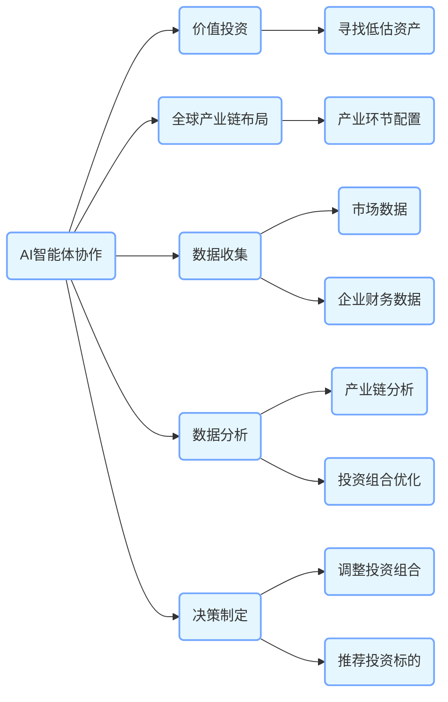

# AI智能体协作：优化价值投资的全球产业链布局策略

> 关键词：AI智能体协作、价值投资、全球产业链布局、优化策略、数据分析

> 摘要：本文聚焦于AI智能体协作在优化价值投资的全球产业链布局策略中的应用。通过深入探讨AI智能体协作的核心概念、算法原理、数学模型等内容，详细阐述如何利用其提升价值投资在全球产业链布局上的精准性和有效性。结合实际项目案例，分析其在不同场景下的应用，同时推荐相关的学习资源、开发工具和论文著作，最后对未来发展趋势与挑战进行总结，并解答常见问题。旨在为投资者和相关从业者提供全面且深入的技术与策略指导。

## 1. 背景介绍 
### 1.1 目的和范围
随着全球经济一体化的加速，价值投资面临着更为复杂和多元化的全球产业链环境。如何在众多的产业和地区中进行合理的布局，以实现投资价值的最大化，成为了投资者亟待解决的问题。本文的目的在于探讨如何利用AI智能体协作技术来优化价值投资的全球产业链布局策略。具体范围涵盖了AI智能体协作的基本概念、核心算法、数学模型，以及其在实际投资项目中的应用，并对相关的工具和资源进行推荐。

### 1.2 预期读者
本文预期读者主要包括从事价值投资的专业人士，如投资经理、分析师等；对AI技术在金融领域应用感兴趣的技术人员；以及相关高校和研究机构中从事金融工程、人工智能等专业研究的师生。

### 1.3 文档结构概述
本文将按照以下结构进行阐述：首先介绍AI智能体协作和价值投资全球产业链布局的核心概念及其联系；接着详细讲解核心算法原理和具体操作步骤，并给出Python源代码示例；然后介绍相关的数学模型和公式，并通过举例进行说明；之后通过项目实战案例展示代码的实际应用和详细解释；再探讨其在实际应用场景中的表现；随后推荐相关的工具和资源；最后总结未来发展趋势与挑战，解答常见问题，并提供扩展阅读和参考资料。

### 1.4 术语表
#### 1.4.1 核心术语定义
- **AI智能体（AI Agent）**：是一种能够感知环境、自主决策并采取行动以实现特定目标的人工智能实体。在本文中，AI智能体可以收集全球产业链相关的数据，分析市场信息，并根据预设的投资策略进行决策。
- **价值投资（Value Investing）**：一种投资策略，强调通过分析资产的内在价值，寻找被低估的投资标的，以长期持有获得收益。
- **全球产业链布局（Global Industrial Chain Layout）**：指企业或投资者在全球范围内对产业链的各个环节进行合理配置，以实现资源的最优利用和经济效益的最大化。
- **AI智能体协作（AI Agent Collaboration）**：多个AI智能体之间通过信息共享、协同决策等方式，共同完成一个或多个任务的过程。

#### 1.4.2 相关概念解释
- **产业链分析**：对产业链的各个环节，包括原材料供应、生产制造、销售和售后服务等进行全面的研究和评估，以了解产业链的结构、竞争态势和发展趋势。
- **投资组合优化**：通过合理选择投资标的和分配资金比例，在风险和收益之间找到平衡，以实现投资组合的最优绩效。
- **数据驱动决策**：基于大量的数据进行分析和建模，为决策提供科学依据，减少主观判断的影响。

#### 1.4.3 缩略词列表
- **AI**：Artificial Intelligence（人工智能）
- **ML**：Machine Learning（机器学习）
- **DL**：Deep Learning（深度学习）

## 2. 核心概念与联系 
### 2.1 AI智能体的基本原理
AI智能体是一种具有自主决策能力的人工智能实体，其基本原理可以概括为感知、决策和行动三个阶段。感知阶段，智能体通过各种传感器或数据接口收集环境信息，例如全球产业链中的市场数据、企业财务报表等。决策阶段，智能体利用内置的算法和模型对感知到的信息进行分析和处理，生成决策方案。行动阶段，智能体根据决策结果采取相应的行动，如调整投资组合、推荐投资标的等。

### 2.2 价值投资与全球产业链布局的关系
价值投资的核心是寻找被低估的资产，而全球产业链布局则为价值投资提供了更广阔的视野和更多的投资机会。通过对全球产业链的分析，投资者可以发现不同地区和产业的发展潜力和价值，从而选择具有长期投资价值的标的。例如，在新兴产业崛起的地区，可能存在一些具有创新能力和成长潜力的企业，这些企业在产业链中处于关键环节，具有较高的投资价值。

### 2.3 AI智能体协作与价值投资全球产业链布局的联系
AI智能体协作可以为价值投资的全球产业链布局提供更强大的分析和决策支持。多个AI智能体可以分别负责不同的任务，如数据收集、数据分析、风险评估等，通过协作和信息共享，提高决策的准确性和效率。例如，一个智能体负责收集全球产业链中的市场数据，另一个智能体负责分析企业的财务状况，然后将分析结果共享给其他智能体，共同制定投资策略。

### 2.4 核心概念的架构示意图


## 3. 核心算法原理 & 具体操作步骤 
### 3.1 多智能体强化学习算法原理
多智能体强化学习是AI智能体协作中常用的算法之一。其基本思想是每个智能体通过与环境进行交互，不断学习最优的行动策略，以最大化自身的累积奖励。在价值投资的全球产业链布局中，每个智能体可以代表一个投资策略或一个投资领域，通过协作和竞争，共同实现投资收益的最大化。

以下是一个简单的多智能体强化学习的Python代码示例：
```python
import numpy as np

# 定义智能体类
class Agent:
    def __init__(self, num_actions, learning_rate=0.1, discount_factor=0.9):
        self.num_actions = num_actions
        self.learning_rate = learning_rate
        self.discount_factor = discount_factor
        self.q_table = np.zeros((1, num_actions))

    def choose_action(self, state):
        if np.random.uniform(0, 1) < 0.1:
            action = np.random.choice(self.num_actions)
        else:
            action = np.argmax(self.q_table[state, :])
        return action

    def learn(self, state, action, reward, next_state):
        predict = self.q_table[state, action]
        target = reward + self.discount_factor * np.max(self.q_table[next_state, :])
        self.q_table[state, action] += self.learning_rate * (target - predict)

# 定义环境类
class Environment:
    def __init__(self):
        self.state = 0
        self.num_actions = 2

    def step(self, action):
        if action == 0:
            reward = 1
            next_state = 0
        else:
            reward = -1
            next_state = 0
        return next_state, reward

# 初始化智能体和环境
agent = Agent(num_actions=2)
env = Environment()

# 训练过程
for episode in range(100):
    state = env.state
    action = agent.choose_action(state)
    next_state, reward = env.step(action)
    agent.learn(state, action, reward, next_state)
    print(f"Episode {episode}: Action {action}, Reward {reward}")
```
### 3.2 具体操作步骤
1. **数据收集**：多个AI智能体分别从不同的数据源收集全球产业链相关的数据，包括市场数据、企业财务数据、政策法规等。
2. **数据预处理**：对收集到的数据进行清洗、转换和归一化等处理，以提高数据的质量和可用性。
3. **特征提取**：从预处理后的数据中提取有价值的特征，例如企业的盈利能力、市场份额、技术创新能力等。
4. **模型训练**：使用多智能体强化学习等算法对提取的特征进行训练，得到每个智能体的最优策略。
5. **协作决策**：各个智能体根据训练得到的策略进行协作和决策，共同制定价值投资的全球产业链布局策略。
6. **策略评估和优化**：定期对制定的策略进行评估和优化，根据市场变化和投资效果调整智能体的策略。

## 4. 数学模型和公式 & 详细讲解 & 举例说明 
### 4.1 多智能体强化学习的数学模型
多智能体强化学习的数学模型可以用马尔可夫决策过程（MDP）的扩展——分散式部分可观察马尔可夫决策过程（Decentralized Partially Observable Markov Decision Process, DEC-POMDP）来描述。

#### 定义
一个DEC-POMDP可以表示为一个元组 $(S, A_1, \cdots, A_n, O_1, \cdots, O_n, T, Z_1, \cdots, Z_n, R_1, \cdots, R_n, \gamma)$，其中：
- $S$ 是环境的状态集合；
- $A_i$ 是智能体 $i$ 的动作集合，$i = 1, \cdots, n$；
- $O_i$ 是智能体 $i$ 的观察集合；
- $T: S \times A_1 \times \cdots \times A_n \times S \to [0, 1]$ 是状态转移函数，表示在状态 $s$ 下，所有智能体采取动作 $(a_1, \cdots, a_n)$ 后转移到状态 $s'$ 的概率；
- $Z_i: S \times A_1 \times \cdots \times A_n \times O_i \to [0, 1]$ 是观察函数，表示在状态 $s$ 下，所有智能体采取动作 $(a_1, \cdots, a_n)$ 后，智能体 $i$ 观察到 $o_i$ 的概率；
- $R_i: S \times A_1 \times \cdots \times A_n \to \mathbb{R}$ 是智能体 $i$ 的奖励函数；
- $\gamma \in [0, 1)$ 是折扣因子。

#### 价值函数
每个智能体的价值函数可以表示为：
$$V_i^{\pi}(s) = \mathbb{E}\left[\sum_{t=0}^{\infty} \gamma^t R_i(s_t, a_{1,t}, \cdots, a_{n,t}) \mid s_0 = s, \pi\right]$$
其中，$\pi = (\pi_1, \cdots, \pi_n)$ 是所有智能体的策略组合，$s_t$ 是时刻 $t$ 的状态，$a_{i,t}$ 是智能体 $i$ 在时刻 $t$ 采取的动作。

### 4.2 举例说明
假设有两个智能体 $A$ 和 $B$，在一个简单的投资环境中进行决策。环境的状态集合 $S = \{s_1, s_2\}$，每个智能体的动作集合 $A = \{a_1, a_2\}$。状态转移函数 $T$ 如下：
| $s$ | $a_A$ | $a_B$ | $s'$ | $T(s, a_A, a_B, s')$ |
| --- | --- | --- | --- | --- |
| $s_1$ | $a_1$ | $a_1$ | $s_1$ | 0.8 |
| $s_1$ | $a_1$ | $a_1$ | $s_2$ | 0.2 |
| $\cdots$ | $\cdots$ | $\cdots$ | $\cdots$ | $\cdots$ |

观察函数 $Z_A$ 和 $Z_B$ 分别表示智能体 $A$ 和 $B$ 的观察概率。奖励函数 $R_A$ 和 $R_B$ 表示每个智能体在不同状态和动作下获得的奖励。

假设初始状态 $s_0 = s_1$，折扣因子 $\gamma = 0.9$。智能体 $A$ 和 $B$ 通过不断与环境交互，学习最优的策略，以最大化自己的累积奖励。

## 5. 项目实战：代码实际案例和详细解释说明 
### 5.1  开发环境搭建
#### 安装Python
首先，确保你已经安装了Python 3.x版本。可以从Python官方网站（https://www.python.org/downloads/）下载并安装。

#### 安装必要的库
在项目中，我们需要使用一些Python库，如NumPy、Pandas、Scikit-learn等。可以使用以下命令进行安装：
```sh
pip install numpy pandas scikit-learn
```

### 5.2  源代码详细实现和代码解读
以下是一个基于多智能体协作的价值投资全球产业链布局的Python代码示例：
```python
import numpy as np
import pandas as pd
from sklearn.preprocessing import StandardScaler
from sklearn.model_selection import train_test_split
from sklearn.linear_model import LogisticRegression

# 模拟全球产业链数据
def generate_data():
    num_samples = 1000
    num_features = 10
    X = np.random.randn(num_samples, num_features)
    y = np.random.randint(0, 2, num_samples)
    return X, y

# 数据预处理
def preprocess_data(X, y):
    scaler = StandardScaler()
    X = scaler.fit_transform(X)
    X_train, X_test, y_train, y_test = train_test_split(X, y, test_size=0.2, random_state=42)
    return X_train, X_test, y_train, y_test

# 定义智能体类
class InvestmentAgent:
    def __init__(self):
        self.model = LogisticRegression()

    def train(self, X_train, y_train):
        self.model.fit(X_train, y_train)

    def predict(self, X_test):
        return self.model.predict(X_test)

# 多智能体协作
def multi_agent_collaboration(X_train, X_test, y_train):
    num_agents = 3
    agents = [InvestmentAgent() for _ in range(num_agents)]

    for agent in agents:
        agent.train(X_train, y_train)

    predictions = []
    for agent in agents:
        pred = agent.predict(X_test)
        predictions.append(pred)

    final_prediction = np.mean(predictions, axis=0) > 0.5
    return final_prediction

# 主函数
def main():
    X, y = generate_data()
    X_train, X_test, y_train, y_test = preprocess_data(X, y)
    final_prediction = multi_agent_collaboration(X_train, X_test, y_train)

    accuracy = np.mean(final_prediction == y_test)
    print(f"Accuracy: {accuracy}")

if __name__ == "__main__":
    main()
```
### 5.3  代码解读与分析
1. **数据生成**：`generate_data` 函数模拟生成全球产业链相关的数据，包括特征矩阵 $X$ 和标签向量 $y$。
2. **数据预处理**：`preprocess_data` 函数对生成的数据进行标准化处理，并将其划分为训练集和测试集。
3. **智能体类定义**：`InvestmentAgent` 类表示一个投资智能体，使用逻辑回归模型进行训练和预测。
4. **多智能体协作**：`multi_agent_collaboration` 函数创建多个投资智能体，分别对训练数据进行训练，并对测试数据进行预测。最后，通过取平均值的方式得到最终的预测结果。
5. **主函数**：`main` 函数调用上述函数，完成数据生成、预处理、多智能体协作和结果评估的整个流程，并输出预测的准确率。

## 6. 实际应用场景 
### 6.1 新兴产业投资
在新兴产业崛起的过程中，AI智能体协作可以帮助投资者快速准确地识别具有潜力的企业和领域。例如，在人工智能、新能源、生物医药等新兴产业中，通过分析大量的技术专利、市场需求、企业研发投入等数据，AI智能体可以发现那些处于产业链关键环节、具有创新能力和成长潜力的企业，为投资者提供投资建议。

### 6.2 跨国企业并购
在跨国企业并购过程中，AI智能体协作可以对目标企业进行全面的评估。通过收集目标企业所在国家的政治、经济、法律环境，以及其在全球产业链中的地位、市场份额、财务状况等信息，AI智能体可以帮助投资者评估并购的风险和收益，制定合理的并购策略。

### 6.3 全球产业链重构
随着全球经济形势的变化和贸易政策的调整，全球产业链正在经历重构。AI智能体协作可以帮助企业和投资者及时了解产业链的动态变化，调整投资布局。例如，当某个国家或地区的劳动力成本上升、贸易壁垒增加时，AI智能体可以分析其他地区的产业优势和发展潜力，为企业和投资者提供产业链转移和布局调整的建议。

## 7. 工具和资源推荐
### 7.1 学习资源推荐
#### 7.1.1 书籍推荐
- 《人工智能：一种现代的方法》（Artificial Intelligence: A Modern Approach）：这是一本经典的人工智能教材，全面介绍了人工智能的基本概念、算法和应用。
- 《机器学习》（Machine Learning）：由周志华教授编写，系统地介绍了机器学习的基本理论和算法，适合初学者和有一定基础的读者。
- 《强化学习：原理与Python实现》（Reinforcement Learning: An Introduction）：详细介绍了强化学习的基本原理和算法，并提供了Python代码示例，对于理解多智能体强化学习有很大帮助。

#### 7.1.2 在线课程
- Coursera上的“人工智能基础”（Foundations of Artificial Intelligence）课程：由知名教授授课，涵盖了人工智能的基本概念、算法和应用。
- edX上的“机器学习导论”（Introduction to Machine Learning）课程：提供了机器学习的基础知识和实践经验。
- Udemy上的“强化学习实战”（Reinforcement Learning in Action）课程：通过实际项目案例，介绍了强化学习的应用和实现。

#### 7.1.3 技术博客和网站
- Medium上的AI相关博客：有很多人工智能领域的专家和从业者分享最新的技术和研究成果。
- arXiv.org：一个开放获取的预印本平台，提供了大量的人工智能和机器学习领域的研究论文。
- Towards Data Science：专注于数据科学和人工智能领域的技术博客，有很多实用的教程和案例分析。

### 7.2 开发工具框架推荐
#### 7.2.1 IDE和编辑器
- PyCharm：一款专业的Python集成开发环境，提供了丰富的代码编辑、调试和分析功能。
- Jupyter Notebook：一个交互式的开发环境，适合进行数据探索、模型训练和可视化等工作。
- Visual Studio Code：一款轻量级的代码编辑器，支持多种编程语言和插件扩展，可用于Python开发。

#### 7.2.2 调试和性能分析工具
- PDB：Python自带的调试工具，可以帮助开发者定位和解决代码中的问题。
- cProfile：Python的性能分析工具，可以分析代码的运行时间和函数调用情况。
- TensorBoard：一个用于可视化深度学习模型训练过程的工具，可以帮助开发者监控模型的性能和训练进度。

#### 7.2.3 相关框架和库
- TensorFlow：一个开源的深度学习框架，提供了丰富的工具和库，可用于构建和训练各种深度学习模型。
- PyTorch：另一个流行的深度学习框架，具有简洁易用的接口和高效的计算性能。
- Stable Baselines3：一个基于PyTorch的强化学习库，提供了多种强化学习算法的实现和预训练模型。

### 7.3 相关论文著作推荐
#### 7.3.1 经典论文
- “Multi-Agent Reinforcement Learning: A Selective Survey”：对多智能体强化学习的研究进行了全面的综述，介绍了各种算法和应用场景。
- “Value Investing: The Use of Historical Financial Statement Information to Separate Winners from Losers”：阐述了价值投资的基本原理和方法，以及如何利用财务报表信息进行投资决策。
- “Global Value Chains: Investment and Trade for Development”：分析了全球产业链的发展趋势和影响因素，为投资者提供了宏观层面的参考。

#### 7.3.2 最新研究成果
- 关注顶级学术会议如NeurIPS（神经信息处理系统大会）、ICML（国际机器学习会议）等发表的关于多智能体强化学习和金融科技的研究论文。
- 查阅知名学术期刊如Journal of Financial Economics、Review of Financial Studies等上的最新研究成果。

#### 7.3.3 应用案例分析
- 一些知名投资机构和企业发布的关于利用AI技术进行价值投资和产业链布局的案例分析报告，可以从它们的官方网站或行业研究平台获取。

## 8. 总结：未来发展趋势与挑战
### 8.1 未来发展趋势
- **更深入的跨学科融合**：AI智能体协作在价值投资的全球产业链布局中将与经济学、管理学、社会学等学科进行更深入的融合，以提供更全面、更准确的决策支持。
- **强化学习算法的创新**：随着强化学习理论的不断发展，将出现更多适合多智能体协作的强化学习算法，提高决策的效率和质量。
- **与区块链技术的结合**：区块链技术的去中心化、不可篡改等特点可以为AI智能体协作提供更安全、可靠的数据共享和协作环境，促进价值投资的全球产业链布局的创新发展。

### 8.2 挑战
- **数据质量和隐私问题**：AI智能体协作需要大量的数据支持，但数据的质量和隐私问题是一个挑战。如何保证数据的准确性、完整性和安全性，以及如何在数据共享过程中保护用户的隐私，是需要解决的问题。
- **智能体之间的协作协调**：多个智能体之间的协作协调是一个复杂的问题，需要解决智能体之间的通信、冲突解决、利益分配等问题，以实现整体的最优决策。
- **模型的可解释性**：AI模型的可解释性是金融领域应用的一个重要问题。投资者需要了解模型的决策过程和依据，以便做出合理的投资决策。如何提高AI模型的可解释性，是当前研究的热点之一。

## 9. 附录：常见问题与解答
### 9.1 AI智能体协作在价值投资中的效果如何评估？
可以通过多种指标来评估AI智能体协作在价值投资中的效果，如投资回报率、夏普比率、最大回撤等。同时，还可以与传统的投资策略进行对比，评估其相对优势。

### 9.2 如何选择适合的AI智能体协作算法？
选择适合的AI智能体协作算法需要考虑多个因素，如问题的复杂度、数据的规模、智能体的数量等。可以根据具体的应用场景和需求，选择合适的算法，如多智能体强化学习、博弈论等。

### 9.3 AI智能体协作在全球产业链布局中面临哪些风险？
AI智能体协作在全球产业链布局中面临的风险包括市场风险、政策风险、技术风险等。市场风险可能导致投资标的的价值波动，政策风险可能影响产业链的布局和发展，技术风险可能导致AI模型的性能下降。

## 10. 扩展阅读 & 参考资料
- 《金融科技前沿：人工智能与区块链》
- 《AI驱动的投资决策》
- https://www.kaggle.com/：一个数据科学和机器学习的竞赛平台，提供了大量的数据集和案例。
- https://www.investopedia.com/：一个金融投资领域的知识平台，提供了丰富的投资知识和分析工具。

作者：AI天才研究院/AI Genius Institute & 禅与计算机程序设计艺术 /Zen And The Art of Computer Programming