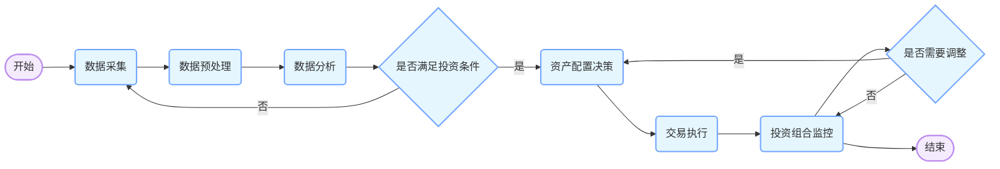

# AI智能体协作：优化价值投资的全球资产配置策略

> 关键词：AI智能体协作、价值投资、全球资产配置、优化策略、金融科技

> 摘要：本文聚焦于利用AI智能体协作来优化价值投资的全球资产配置策略。首先介绍了相关背景，包括目的、预期读者、文档结构等。接着阐述了核心概念，如AI智能体、价值投资和全球资产配置及其联系。详细讲解了核心算法原理和具体操作步骤，并给出了Python代码示例。通过数学模型和公式进一步分析策略的原理，结合项目实战案例进行代码实现和解读。探讨了该策略在实际金融场景中的应用，推荐了相关的学习资源、开发工具和论文著作。最后总结了未来发展趋势与挑战，并对常见问题进行解答，提供了扩展阅读和参考资料。旨在为投资者和金融从业者提供全面的技术和策略指导，以更好地利用AI技术优化全球资产配置。

## 1. 背景介绍 
### 1.1 目的和范围
在全球金融市场日益复杂和多元化的背景下，价值投资的全球资产配置面临着诸多挑战。传统的资产配置方法往往难以应对海量的数据和快速变化的市场环境。本研究的目的在于探索如何利用AI智能体协作来优化价值投资的全球资产配置策略，提高投资组合的收益和降低风险。研究范围涵盖了各类金融资产，包括股票、债券、大宗商品、外汇等，以及全球主要金融市场，如美国、欧洲、亚洲等。

### 1.2 预期读者
本文的预期读者包括金融投资者、金融分析师、量化投资从业者、金融科技研究人员以及对AI在金融领域应用感兴趣的技术爱好者。对于投资者来说，本文可以提供新的投资思路和方法；对于金融科技研究人员，有助于深入了解AI智能体在金融资产配置中的应用原理和技术实现。

### 1.3 文档结构概述
本文首先介绍相关背景信息，让读者了解研究的目的和范围。接着阐述核心概念，包括AI智能体、价值投资和全球资产配置，并说明它们之间的联系。然后详细讲解核心算法原理和具体操作步骤，同时给出Python代码示例。通过数学模型和公式进一步分析策略的原理，并举例说明。结合项目实战案例，进行开发环境搭建、源代码实现和代码解读。探讨该策略在实际金融场景中的应用，推荐相关的学习资源、开发工具和论文著作。最后总结未来发展趋势与挑战，解答常见问题，并提供扩展阅读和参考资料。

### 1.4 术语表
#### 1.4.1 核心术语定义
- **AI智能体**：一种能够感知环境、自主决策并采取行动以实现特定目标的人工智能实体。在金融领域，AI智能体可以根据市场数据和预设规则进行资产配置决策。
- **价值投资**：一种基于对资产内在价值的评估进行投资的策略，投资者通过分析公司的基本面、财务状况等因素，寻找被低估的资产进行投资。
- **全球资产配置**：将投资资金分散到不同国家和地区的各类金融资产中，以降低单一市场风险，实现投资组合的多元化和优化。

#### 1.4.2 相关概念解释
- **资产组合理论**：由哈里·马科维茨提出，该理论认为投资者可以通过选择不同资产的组合来平衡风险和收益。通过计算资产之间的相关性和协方差，构建最优的投资组合。
- **智能合约**：一种基于区块链技术的自动执行合约，合约中的条款以代码形式编写，当满足预设条件时，合约自动执行。在金融领域，智能合约可以用于实现资产交易和资金结算等功能。

#### 1.4.3 缩略词列表
- **AI**：Artificial Intelligence，人工智能
- **ETF**：Exchange-Traded Fund，交易型开放式指数基金
- **VAR**：Value at Risk，风险价值

## 2. 核心概念与联系 
### 核心概念原理
#### AI智能体
AI智能体是人工智能领域的核心概念之一，它具有感知、决策和行动的能力。在金融资产配置中，AI智能体可以通过各种数据接口获取市场信息，如资产价格、交易量、宏观经济数据等。然后，利用机器学习、深度学习等算法对这些数据进行分析和处理，预测资产的未来走势。最后，根据预设的投资目标和风险偏好，做出资产配置决策，如买入、卖出或持有某种资产。

#### 价值投资
价值投资的核心思想是寻找被市场低估的资产，即资产的市场价格低于其内在价值。投资者通过对公司的基本面进行分析，包括财务报表、行业竞争力、管理团队等方面，评估公司的内在价值。当发现某一资产的市场价格低于其内在价值时，投资者认为该资产具有投资价值，从而进行买入操作。随着市场对该资产价值的重新认识，其价格可能会上涨，投资者可以从中获得收益。

#### 全球资产配置
全球资产配置的原理是通过将投资资金分散到不同国家和地区的各类金融资产中，降低单一市场风险。不同国家和地区的经济周期、政治环境、货币政策等因素存在差异，这些因素会影响各类金融资产的表现。通过合理配置不同资产，可以使投资组合在不同市场环境下都能保持相对稳定的收益。例如，当某个国家的股票市场表现不佳时，其他国家的股票市场或债券市场可能表现较好，从而弥补损失。

### 架构的文本示意图
```plaintext
             AI智能体协作系统
            /            |           \
  数据采集模块      数据分析模块      决策执行模块
  /         \        /       \        /       \
市场数据   宏观数据  机器学习  深度学习  资产配置  交易执行
```

### Mermaid流程图


## 3. 核心算法原理 & 具体操作步骤 
### 核心算法原理
本策略的核心算法主要包括数据预处理、资产收益率预测和资产配置优化三个部分。

#### 数据预处理
在实际应用中，获取的市场数据可能存在缺失值、异常值等问题，需要进行预处理。常用的方法包括缺失值填充和异常值处理。对于缺失值，可以使用均值、中位数或插值法进行填充；对于异常值，可以使用基于统计的方法（如Z-score）进行识别和处理。

#### 资产收益率预测
使用机器学习和深度学习算法对资产的收益率进行预测。常见的算法包括线性回归、决策树、随机森林、长短期记忆网络（LSTM）等。以LSTM为例，它是一种特殊的循环神经网络，能够处理序列数据，适合用于时间序列数据的预测。

#### 资产配置优化
根据资产收益率预测结果，使用优化算法确定最优的资产配置比例。常用的优化算法包括马科维茨均值 - 方差模型、风险平价模型等。马科维茨均值 - 方差模型通过最大化投资组合的预期收益率，同时最小化投资组合的方差来确定最优配置比例。

### 具体操作步骤
#### 步骤1：数据采集
使用金融数据接口（如雅虎财经、Tushare等）获取全球各类金融资产的历史价格数据、宏观经济数据等。

#### 步骤2：数据预处理
对采集到的数据进行清洗和预处理，包括缺失值填充、异常值处理、数据标准化等。

#### 步骤3：特征工程
从预处理后的数据中提取有用的特征，如收益率、波动率、相关性等。

#### 步骤4：模型训练
使用历史数据对机器学习或深度学习模型进行训练，以预测资产的收益率。

#### 步骤5：资产配置优化
根据资产收益率预测结果，使用优化算法确定最优的资产配置比例。

#### 步骤6：交易执行
根据最优资产配置比例，执行买入、卖出或持有操作。

#### 步骤7：投资组合监控
实时监控投资组合的表现，根据市场变化及时调整资产配置。

### Python源代码示例
```python
import pandas as pd
import numpy as np
from sklearn.preprocessing import StandardScaler
from sklearn.model_selection import train_test_split
from sklearn.linear_model import LinearRegression
from scipy.optimize import minimize

# 步骤1：数据采集（假设已经有了数据）
data = pd.read_csv('asset_prices.csv')

# 步骤2：数据预处理
data = data.dropna()  # 去除缺失值
scaler = StandardScaler()
scaled_data = scaler.fit_transform(data)

# 步骤3：特征工程
returns = np.log(data / data.shift(1)).dropna()  # 计算对数收益率

# 步骤4：模型训练
X = returns.iloc[:, :-1]
y = returns.iloc[:, -1]
X_train, X_test, y_train, y_test = train_test_split(X, y, test_size=0.2, random_state=42)
model = LinearRegression()
model.fit(X_train, y_train)

# 步骤5：资产配置优化
def portfolio_returns(weights, returns):
    return np.dot(weights, returns.mean())

def portfolio_variance(weights, cov_matrix):
    return np.dot(weights.T, np.dot(cov_matrix, weights))

def objective_function(weights, returns, cov_matrix, risk_aversion):
    port_return = portfolio_returns(weights, returns)
    port_var = portfolio_variance(weights, cov_matrix)
    return -port_return + risk_aversion * port_var

# 约束条件：权重之和为1
constraints = ({'type': 'eq', 'fun': lambda x: np.sum(x) - 1})
# 权重范围：0到1
bounds = [(0, 1) for _ in range(len(returns.columns))]

risk_aversion = 0.5
cov_matrix = returns.cov()
initial_weights = np.ones(len(returns.columns)) / len(returns.columns)

result = minimize(objective_function, initial_weights, args=(returns, cov_matrix, risk_aversion),
                  method='SLSQP', constraints=constraints, bounds=bounds)

optimal_weights = result.x

# 步骤6：交易执行（这里只是简单打印）
print("最优资产配置比例:", optimal_weights)

# 步骤7：投资组合监控（这里省略具体实现）
```

## 4. 数学模型和公式 & 详细讲解 & 举例说明 
### 马科维茨均值 - 方差模型
#### 数学公式
马科维茨均值 - 方差模型的目标是在给定预期收益率的情况下，最小化投资组合的方差；或者在给定方差的情况下，最大化投资组合的预期收益率。

设投资组合中包含 $n$ 种资产，第 $i$ 种资产的权重为 $w_i$，预期收益率为 $\mu_i$，投资组合的预期收益率为 $\mu_p$，方差为 $\sigma_p^2$，资产之间的协方差矩阵为 $\Sigma$。

投资组合的预期收益率公式为：
$$\mu_p = \sum_{i=1}^{n} w_i \mu_i$$

投资组合的方差公式为：
$$\sigma_p^2 = \sum_{i=1}^{n} \sum_{j=1}^{n} w_i w_j \sigma_{ij} = \mathbf{w}^T \Sigma \mathbf{w}$$
其中，$\mathbf{w} = [w_1, w_2, \cdots, w_n]^T$ 是权重向量，$\sigma_{ij}$ 是资产 $i$ 和资产 $j$ 之间的协方差。

#### 详细讲解
马科维茨均值 - 方差模型的核心思想是通过合理分配资产的权重，在风险和收益之间找到一个平衡点。投资者可以根据自己的风险偏好选择不同的投资组合。在实际应用中，需要先估计每种资产的预期收益率和资产之间的协方差矩阵，然后使用优化算法求解最优的权重向量。

#### 举例说明
假设投资组合包含三种资产：股票A、股票B和债券C。它们的预期收益率分别为 $\mu_A = 0.1$，$\mu_B = 0.15$，$\mu_C = 0.05$，协方差矩阵为：
$$\Sigma = \begin{bmatrix}
0.04 & 0.02 & 0.01 \\
0.02 & 0.09 & 0.03 \\
0.01 & 0.03 & 0.01
\end{bmatrix}$$

设投资者希望投资组合的预期收益率达到 $\mu_p = 0.12$，则可以建立以下优化问题：

最小化：$\sigma_p^2 = \mathbf{w}^T \Sigma \mathbf{w}$

约束条件：
$$\sum_{i=1}^{3} w_i \mu_i = 0.12$$
$$\sum_{i=1}^{3} w_i = 1$$
$$0 \leq w_i \leq 1, i = 1, 2, 3$$

使用Python的 `scipy.optimize` 库可以求解该优化问题：
```python
import numpy as np
from scipy.optimize import minimize

# 预期收益率
mu = np.array([0.1, 0.15, 0.05])
# 协方差矩阵
Sigma = np.array([[0.04, 0.02, 0.01],
                  [0.02, 0.09, 0.03],
                  [0.01, 0.03, 0.01]])
# 目标预期收益率
target_return = 0.12

# 约束条件
constraints = [{'type': 'eq', 'fun': lambda w: np.dot(w, mu) - target_return},
               {'type': 'eq', 'fun': lambda w: np.sum(w) - 1}]
# 权重范围
bounds = [(0, 1) for _ in range(len(mu))]

# 初始权重
initial_weights = np.ones(len(mu)) / len(mu)

# 定义目标函数
def objective_function(w, Sigma):
    return np.dot(w.T, np.dot(Sigma, w))

# 求解优化问题
result = minimize(objective_function, initial_weights, args=(Sigma,),
                  method='SLSQP', constraints=constraints, bounds=bounds)

optimal_weights = result.x
print("最优资产配置比例:", optimal_weights)
```

### 风险平价模型
#### 数学公式
风险平价模型的目标是使每种资产对投资组合风险的贡献相等。设投资组合中第 $i$ 种资产的权重为 $w_i$，资产之间的协方差矩阵为 $\Sigma$，第 $i$ 种资产对投资组合风险的贡献为 $RC_i$。

$$RC_i = w_i \frac{\partial \sigma_p}{\partial w_i}$$

风险平价模型的优化目标是：
$$\min \sum_{i=1}^{n} \sum_{j=1}^{n} (RC_i - RC_j)^2$$

约束条件：
$$\sum_{i=1}^{n} w_i = 1$$
$$0 \leq w_i \leq 1, i = 1, 2, \cdots, n$$

#### 详细讲解
风险平价模型的核心思想是不依赖于资产的预期收益率，而是通过平衡每种资产对投资组合风险的贡献来实现资产配置的优化。该模型可以降低投资组合对单一资产的风险暴露，提高投资组合的稳定性。

#### 举例说明
假设投资组合包含两种资产：股票和债券。它们的协方差矩阵为：
$$\Sigma = \begin{bmatrix}
0.04 & 0.01 \\
0.01 & 0.01
\end{bmatrix}$$

使用Python实现风险平价模型：
```python
import numpy as np
from scipy.optimize import minimize

# 协方差矩阵
Sigma = np.array([[0.04, 0.01],
                  [0.01, 0.01]])

# 约束条件
constraints = [{'type': 'eq', 'fun': lambda w: np.sum(w) - 1}]
# 权重范围
bounds = [(0, 1) for _ in range(Sigma.shape[0])]

# 初始权重
initial_weights = np.ones(Sigma.shape[0]) / Sigma.shape[0]

# 定义目标函数
def risk_contribution(w, Sigma):
    port_var = np.dot(w.T, np.dot(Sigma, w))
    marginal_risk = np.dot(Sigma, w)
    return w * marginal_risk / np.sqrt(port_var)

def objective_function(w, Sigma):
    rc = risk_contribution(w, Sigma)
    return np.sum((rc - rc.mean())**2)

# 求解优化问题
result = minimize(objective_function, initial_weights, args=(Sigma,),
                  method='SLSQP', constraints=constraints, bounds=bounds)

optimal_weights = result.x
print("最优资产配置比例:", optimal_weights)
```

## 5. 项目实战：代码实际案例和详细解释说明 
### 5.1  开发环境搭建
#### 安装Python
首先，需要安装Python环境。可以从Python官方网站（https://www.python.org/downloads/）下载适合自己操作系统的Python版本。建议安装Python 3.7及以上版本。

#### 安装必要的库
使用以下命令安装必要的Python库：
```sh
pip install pandas numpy scikit-learn scipy yfinance
```
- `pandas`：用于数据处理和分析。
- `numpy`：用于数值计算。
- `scikit-learn`：用于机器学习算法实现。
- `scipy`：用于科学计算和优化算法。
- `yfinance`：用于获取金融市场数据。

### 5.2  源代码详细实现和代码解读
```python
import yfinance as yf
import pandas as pd
import numpy as np
from sklearn.preprocessing import StandardScaler
from sklearn.model_selection import train_test_split
from sklearn.linear_model import LinearRegression
from scipy.optimize import minimize

# 步骤1：数据采集
tickers = ['AAPL', 'MSFT', 'GOOG', 'AMZN', 'JPM']  # 选择要分析的股票
start_date = '2020-01-01'
end_date = '2023-01-01'
data = yf.download(tickers, start=start_date, end=end_date)['AdjClose']

# 步骤2：数据预处理
data = data.dropna()  # 去除缺失值
scaler = StandardScaler()
scaled_data = scaler.fit_transform(data)

# 步骤3：特征工程
returns = np.log(data / data.shift(1)).dropna()  # 计算对数收益率

# 步骤4：模型训练
X = returns.iloc[:, :-1]
y = returns.iloc[:, -1]
X_train, X_test, y_train, y_test = train_test_split(X, y, test_size=0.2, random_state=42)
model = LinearRegression()
model.fit(X_train, y_train)

# 步骤5：资产配置优化
def portfolio_returns(weights, returns):
    return np.dot(weights, returns.mean())

def portfolio_variance(weights, cov_matrix):
    return np.dot(weights.T, np.dot(cov_matrix, weights))

def objective_function(weights, returns, cov_matrix, risk_aversion):
    port_return = portfolio_returns(weights, returns)
    port_var = portfolio_variance(weights, cov_matrix)
    return -port_return + risk_aversion * port_var

# 约束条件：权重之和为1
constraints = ({'type': 'eq', 'fun': lambda x: np.sum(x) - 1})
# 权重范围：0到1
bounds = [(0, 1) for _ in range(len(returns.columns))]

risk_aversion = 0.5
cov_matrix = returns.cov()
initial_weights = np.ones(len(returns.columns)) / len(returns.columns)

result = minimize(objective_function, initial_weights, args=(returns, cov_matrix, risk_aversion),
                  method='SLSQP', constraints=constraints, bounds=bounds)

optimal_weights = result.x

# 步骤6：交易执行（这里只是简单打印）
print("最优资产配置比例:", optimal_weights)

# 步骤7：投资组合监控（这里省略具体实现）
```

### 代码解读与分析
#### 数据采集
使用 `yfinance` 库从雅虎财经获取指定股票的历史调整收盘价数据。可以根据需要选择不同的股票和时间范围。

#### 数据预处理
使用 `dropna()` 方法去除数据中的缺失值，然后使用 `StandardScaler` 对数据进行标准化处理，使数据具有零均值和单位方差。

#### 特征工程
计算股票的对数收益率，对数收益率可以更好地反映资产价格的变化情况，并且具有可加性。

#### 模型训练
使用线性回归模型对股票的收益率进行预测。将数据分为训练集和测试集，使用训练集数据对模型进行训练，然后使用测试集数据评估模型的性能。

#### 资产配置优化
定义了投资组合的预期收益率、方差和目标函数。使用 `scipy.optimize.minimize` 函数求解最优的资产配置比例，目标是在给定风险厌恶系数的情况下，最大化投资组合的预期收益率并最小化方差。

#### 交易执行
打印出最优的资产配置比例。在实际应用中，可以根据这些比例进行股票的买入和卖出操作。

#### 投资组合监控
在代码中省略了投资组合监控的具体实现。在实际应用中，需要实时监控投资组合的表现，根据市场变化及时调整资产配置。

## 6. 实际应用场景 
### 个人投资者
对于个人投资者来说，AI智能体协作的全球资产配置策略可以帮助他们更好地管理投资组合。个人投资者通常缺乏专业的金融知识和时间进行深入的市场分析，使用该策略可以自动根据市场情况进行资产配置调整，降低投资风险。例如，一位上班族可以将自己的投资资金交给基于该策略的投资平台，平台会根据市场变化自动调整资产配置，无需投资者手动操作。

### 金融机构
金融机构，如银行、基金公司等，可以利用该策略为客户提供更加个性化的投资服务。银行可以根据客户的风险偏好和投资目标，使用AI智能体协作的资产配置策略为客户构建定制化的投资组合。基金公司可以使用该策略优化基金的资产配置，提高基金的收益和竞争力。

### 量化投资团队
量化投资团队可以将该策略作为核心算法，开发量化投资模型。通过不断优化AI智能体的算法和策略，量化投资团队可以在全球金融市场中获取超额收益。例如，量化投资团队可以使用机器学习和深度学习算法对市场数据进行实时分析，根据分析结果及时调整投资组合。

## 7. 工具和资源推荐
### 7.1 学习资源推荐
#### 7.1.1 书籍推荐
- 《智能时代》：吴军著，介绍了人工智能在各个领域的应用，包括金融领域，帮助读者了解人工智能的发展趋势和应用场景。
- 《机器学习》：周志华著，系统介绍了机器学习的基本概念、算法和应用，是学习机器学习的经典教材。
- 《金融科技：框架与实践》：介绍了金融科技的各个方面，包括AI在金融领域的应用，对理解AI智能体在金融资产配置中的应用有很大帮助。

#### 7.1.2 在线课程
- Coursera上的“机器学习”课程：由斯坦福大学教授吴恩达讲授，是学习机器学习的经典在线课程，内容涵盖了机器学习的基本算法和应用。
- edX上的“金融科技：创新与应用”课程：介绍了金融科技的最新发展和应用，包括AI在金融领域的应用案例。
- 中国大学MOOC上的“人工智能基础”课程：由国内高校教授讲授，系统介绍了人工智能的基本概念、算法和应用，适合初学者学习。

#### 7.1.3 技术博客和网站
- Medium：上面有很多关于AI和金融科技的技术博客文章，作者来自全球各地的专业人士，可以了解到最新的技术动态和应用案例。
- Towards Data Science：专注于数据科学和机器学习领域的技术博客，有很多关于金融数据处理和资产配置的文章。
- 金融界网站：提供了丰富的金融市场数据和资讯，同时也有一些关于金融科技的文章和研究报告。

### 7.2 开发工具框架推荐
#### 7.2.1 IDE和编辑器
- PyCharm：是一款专业的Python集成开发环境，具有强大的代码编辑、调试和项目管理功能，适合Python开发。
- Jupyter Notebook：是一个交互式的开发环境，可以在浏览器中编写和运行代码，同时可以添加文本说明和可视化图表，非常适合数据分析和机器学习项目的开发。
- Visual Studio Code：是一款轻量级的代码编辑器，支持多种编程语言和插件扩展，具有丰富的代码编辑和调试功能。

#### 7.2.2 调试和性能分析工具
- Py-Spy：是一个Python性能分析工具，可以实时分析Python程序的性能瓶颈，帮助开发者优化代码。
- PDB：是Python自带的调试器，可以在代码中设置断点，逐步执行代码，查看变量的值和程序的执行流程。
- TensorBoard：是TensorFlow提供的可视化工具，可以用于可视化深度学习模型的训练过程和性能指标。

#### 7.2.3 相关框架和库
- TensorFlow：是一个开源的深度学习框架，提供了丰富的深度学习模型和工具，适合开发复杂的AI智能体模型。
- PyTorch：是另一个流行的深度学习框架，具有动态图和易于使用的特点，受到很多研究人员和开发者的喜爱。
- Statsmodels：是一个Python库，提供了各种统计模型和工具，适合进行金融数据的统计分析和建模。

### 7.3 相关论文著作推荐
#### 7.3.1 经典论文
- Markowitz, H. M. (1952). Portfolio selection. The journal of finance, 7(1), 77-91. 这篇论文提出了马科维茨均值 - 方差模型，是现代投资组合理论的奠基之作。
- Sharpe, W. F. (1964). Capital asset prices: A theory of market equilibrium under conditions of risk. The journal of finance, 19(3), 425-442. 这篇论文提出了资本资产定价模型（CAPM），对金融资产的定价和风险评估具有重要意义。

#### 7.3.2 最新研究成果
- 通过搜索引擎和学术数据库（如IEEE Xplore、ACM Digital Library等）可以查找关于AI智能体在金融资产配置中应用的最新研究论文。这些论文通常会介绍最新的算法和技术，以及在实际应用中的效果和经验。

#### 7.3.3 应用案例分析
- 一些金融科技公司和研究机构会发布关于AI智能体在金融资产配置中应用的案例分析报告。这些报告可以帮助读者了解该策略在实际应用中的具体操作和效果，以及遇到的问题和解决方案。

## 8. 总结：未来发展趋势与挑战
### 未来发展趋势
#### 多智能体协作的深化
未来，AI智能体之间的协作将更加深入和复杂。不同类型的智能体可以分别负责数据采集、分析、决策等不同任务，通过协作实现更高效的资产配置。例如，一个智能体专门负责宏观经济数据的分析，另一个智能体负责股票市场的微观分析，它们之间通过信息共享和协同决策，提高投资组合的绩效。

#### 与区块链技术的融合
区块链技术具有去中心化、不可篡改、智能合约等特点，与AI智能体协作的全球资产配置策略相结合，可以提高资产交易的透明度和安全性。例如，使用智能合约实现资产交易的自动执行，减少人为干预和交易风险。

#### 个性化投资服务的普及
随着人工智能技术的不断发展，基于AI智能体协作的全球资产配置策略可以为投资者提供更加个性化的投资服务。根据投资者的风险偏好、投资目标、财务状况等因素，为投资者量身定制投资组合，满足不同投资者的需求。

### 挑战
#### 数据质量和安全问题
AI智能体协作的全球资产配置策略依赖于大量的金融市场数据和宏观经济数据。数据的质量和安全性直接影响到策略的有效性和可靠性。数据可能存在缺失值、异常值、错误等问题，需要进行有效的预处理和清洗。同时，数据的安全问题也不容忽视，需要采取加密、访问控制等措施保护数据的安全。

#### 模型的可解释性和可靠性
机器学习和深度学习模型通常是黑盒模型，其决策过程和结果难以解释。在金融领域，模型的可解释性非常重要，投资者需要了解模型的决策依据和风险。因此，需要开发具有可解释性的AI模型，提高模型的可靠性和可信度。

#### 法律法规和监管问题
AI智能体协作的全球资产配置策略在金融领域的应用涉及到法律法规和监管问题。例如，如何确保投资决策符合相关法律法规和监管要求，如何保护投资者的权益等。需要建立健全相关的法律法规和监管机制，规范AI智能体在金融领域的应用。

## 9. 附录：常见问题与解答
### 问题1：AI智能体协作的全球资产配置策略适合所有投资者吗？
解答：不是所有投资者都适合该策略。该策略更适合具有一定风险承受能力和投资经验的投资者。对于风险偏好较低、追求稳健收益的投资者来说，可能更适合传统的投资方式。同时，投资者需要了解该策略的原理和风险，根据自己的实际情况进行选择。

### 问题2：如何评估AI智能体协作的全球资产配置策略的性能？
解答：可以从多个方面评估该策略的性能，包括投资组合的收益率、波动率、夏普比率等。收益率反映了投资组合的盈利情况，波动率反映了投资组合的风险水平，夏普比率反映了投资组合在承担单位风险时的超额收益。此外，还可以通过回测和模拟等方法评估策略在历史数据和不同市场环境下的表现。

### 问题3：AI智能体协作的全球资产配置策略需要多长时间才能看到效果？
解答：该策略的效果受到多种因素的影响，如市场环境、资产配置比例、模型的准确性等。一般来说，需要一定的时间才能看到明显的效果。在实际应用中，建议投资者长期持有投资组合，避免频繁调整资产配置，以充分发挥该策略的优势。

### 问题4：使用该策略进行投资是否存在风险？
解答：任何投资都存在风险，使用AI智能体协作的全球资产配置策略也不例外。市场环境是复杂多变的，模型的预测结果可能存在误差，因此投资组合的实际表现可能与预期不符。投资者需要了解并承担相应的风险，同时可以通过合理的资产配置和风险控制措施降低风险。

## 10. 扩展阅读 & 参考资料
### 扩展阅读
- 《金融炼金术》：乔治·索罗斯著，介绍了索罗斯的投资哲学和方法，对理解金融市场的运行机制和投资策略有很大帮助。
- 《漫步华尔街》：伯顿·马尔基尔著，是一本经典的投资书籍，介绍了各种投资策略和方法，适合投资者阅读。

### 参考资料
- 雅虎财经（https://finance.yahoo.com/）：提供了丰富的金融市场数据和资讯。
- Tushare（https://tushare.pro/）：一个免费、开源的python财经数据接口包，提供了大量的金融数据。
- IEEE Xplore（https://ieeexplore.ieee.org/）：一个学术数据库，包含了大量关于人工智能和金融科技的研究论文。

作者：AI天才研究院/AI Genius Institute & 禅与计算机程序设计艺术 /Zen And The Art of Computer Programming