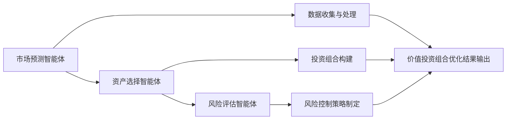

# AI智能体协作：优化价值投资组合的风险收益特征

> 关键词：AI智能体协作、价值投资组合、风险收益特征、优化策略、机器学习

> 摘要：本文聚焦于AI智能体协作在优化价值投资组合风险收益特征方面的应用。首先介绍了相关背景知识，包括研究目的、预期读者等。接着深入探讨了核心概念，阐述了AI智能体与投资组合的联系，并给出了原理和架构的文本示意图与Mermaid流程图。详细讲解了核心算法原理，使用Python代码进行具体操作步骤的说明。同时给出了数学模型和公式，并举例说明。通过项目实战展示了如何搭建开发环境、实现源代码并进行解读分析。探讨了实际应用场景，推荐了相关的学习资源、开发工具框架以及论文著作。最后总结了未来发展趋势与挑战，并提供了常见问题解答和扩展阅读参考资料。旨在为投资者和相关研究人员提供全面深入的技术分析和实践指导，以更好地利用AI智能体协作优化投资组合。

## 1. 背景介绍 
### 1.1 目的和范围
在金融投资领域，价值投资组合的构建与优化一直是投资者关注的核心问题。传统的投资组合优化方法往往依赖于历史数据和固定的模型假设，难以适应复杂多变的市场环境。随着人工智能技术的快速发展，AI智能体协作逐渐成为解决这一问题的新途径。本文的目的在于深入探讨如何利用AI智能体协作来优化价值投资组合的风险收益特征。具体范围涵盖了从核心概念的介绍、算法原理的讲解、数学模型的建立，到项目实战和实际应用场景的分析，以及相关工具和资源的推荐等方面。

### 1.2 预期读者
本文预期读者包括金融投资领域的专业人士，如基金经理、投资顾问等，他们希望借助AI技术优化投资组合；计算机科学和人工智能领域的研究人员和开发者，对将AI应用于金融领域感兴趣；以及对金融投资和人工智能交叉领域有学习需求的学生和爱好者。

### 1.3 文档结构概述
本文将按照以下结构展开：首先介绍相关背景知识，包括目的、预期读者等；接着阐述核心概念与联系，给出原理和架构的文本示意图与Mermaid流程图；然后详细讲解核心算法原理，并使用Python代码说明具体操作步骤；之后建立数学模型和公式，并举例说明；通过项目实战展示代码实现和解读分析；探讨实际应用场景；推荐相关的学习资源、开发工具框架和论文著作；最后总结未来发展趋势与挑战，提供常见问题解答和扩展阅读参考资料。

### 1.4 术语表
#### 1.4.1 核心术语定义
- **AI智能体**：是一种能够感知环境、自主决策并采取行动以实现特定目标的人工智能实体。在投资领域，AI智能体可以根据市场数据和预设的规则，对投资组合进行动态调整。
- **价值投资组合**：是一种基于价值投资理念构建的投资组合，投资者通过分析公司的基本面，选择被低估的股票或其他资产，以期望在长期获得超额收益。
- **风险收益特征**：描述了投资组合在承担风险的情况下所能获得的收益情况，通常用风险指标（如标准差、贝塔系数等）和收益指标（如预期收益率、夏普比率等）来衡量。

#### 1.4.2 相关概念解释
- **智能体协作**：多个AI智能体之间通过信息共享、协调行动等方式，共同完成一个或多个任务的过程。在投资组合优化中，不同的AI智能体可以负责不同的任务，如市场预测、资产选择、风险评估等，通过协作提高投资组合的性能。
- **优化策略**：为了实现特定目标（如最大化收益、最小化风险等）而制定的一系列决策规则和方法。在投资组合优化中，优化策略可以根据市场情况和投资者的风险偏好进行动态调整。

#### 1.4.3 缩略词列表
- **AI**：Artificial Intelligence，人工智能
- **MVO**：Mean - Variance Optimization，均值 - 方差优化
- **Sharpe Ratio**：夏普比率，衡量投资组合每承担一单位总风险，会产生多少的超额报酬

## 2. 核心概念与联系 

### 核心概念原理
AI智能体协作优化价值投资组合的核心原理是利用多个AI智能体的优势，对投资组合进行全方位的分析和管理。每个AI智能体可以专注于不同的任务，如市场趋势预测、资产定价分析、风险评估等。通过智能体之间的信息共享和协作，能够更准确地把握市场动态，及时调整投资组合，从而优化其风险收益特征。

例如，一个市场预测智能体可以使用机器学习算法对市场数据进行分析，预测未来市场的走势；一个资产选择智能体可以根据市场预测结果和公司基本面信息，筛选出具有投资价值的资产；一个风险评估智能体可以对投资组合的风险进行实时监测和评估，并提出相应的风险控制建议。这些智能体之间相互协作，形成一个有机的整体，共同为投资组合的优化服务。

### 架构的文本示意图
```plaintext
+-------------------+       +-------------------+       +-------------------+
| 市场预测智能体    | ----> | 资产选择智能体    | ----> | 风险评估智能体    |
+-------------------+       +-------------------+       +-------------------+
           |                         |                         |
           v                         v                         v
+-------------------+       +-------------------+       +-------------------+
| 数据收集与处理    |       | 投资组合构建      |       | 风险控制策略制定  |
+-------------------+       +-------------------+       +-------------------+
           |                         |                         |
           v                         v                         v
+--------------------------------------------------------------+
| 价值投资组合优化结果输出                                        |
+--------------------------------------------------------------+
```

### Mermaid流程图


## 3. 核心算法原理 & 具体操作步骤 

### 核心算法原理
在AI智能体协作优化价值投资组合中，常用的算法包括机器学习算法（如神经网络、决策树等）和优化算法（如均值 - 方差优化、遗传算法等）。下面以均值 - 方差优化算法为例进行说明。

均值 - 方差优化算法的核心思想是在给定预期收益率的情况下，通过调整投资组合中各资产的权重，使投资组合的方差（即风险）最小化；或者在给定风险水平的情况下，使投资组合的预期收益率最大化。其数学模型可以表示为：

$$
\begin{cases}
\min_{w} w^T \Sigma w \\
\text{s.t. } w^T \mu = r_p \\
\sum_{i = 1}^{n} w_i = 1 \\
w_i \geq 0, i = 1,2,\cdots,n
\end{cases}
$$

其中，$w$ 是投资组合中各资产的权重向量，$\Sigma$ 是资产收益率的协方差矩阵，$\mu$ 是资产的预期收益率向量，$r_p$ 是投资组合的预期收益率，$n$ 是资产的数量。

### 具体操作步骤及Python代码实现
```python
import numpy as np
from scipy.optimize import minimize

# 定义资产的预期收益率和协方差矩阵
mu = np.array([0.1, 0.15, 0.2])  # 预期收益率
Sigma = np.array([[0.1, 0.05, 0.03],
                  [0.05, 0.12, 0.04],
                  [0.03, 0.04, 0.15]])  # 协方差矩阵

# 定义投资组合的预期收益率
r_p = 0.12

# 定义目标函数：最小化投资组合的方差
def objective(w):
    return np.dot(w.T, np.dot(Sigma, w))

# 定义约束条件
cons = [{'type': 'eq', 'fun': lambda w: np.dot(w.T, mu) - r_p},
        {'type': 'eq', 'fun': lambda w: np.sum(w) - 1}]

# 定义边界条件
bnds = [(0, None) for i in range(len(mu))]

# 初始权重猜测
w0 = np.ones(len(mu)) / len(mu)

# 使用优化算法求解
result = minimize(objective, w0, method='SLSQP', bounds=bnds, constraints=cons)

# 输出最优权重
optimal_weights = result.x
print("最优权重:", optimal_weights)
```

### 代码解释
1. **数据准备**：定义资产的预期收益率向量 `mu` 和协方差矩阵 `Sigma`，以及投资组合的预期收益率 `r_p`。
2. **目标函数定义**：定义目标函数 `objective`，即投资组合的方差。
3. **约束条件定义**：定义两个约束条件，一个是投资组合的预期收益率等于给定值 `r_p`，另一个是各资产权重之和等于 1。
4. **边界条件定义**：定义各资产权重的边界条件，即权重不能为负数。
5. **初始权重猜测**：给出初始的权重猜测 `w0`。
6. **优化求解**：使用 `scipy.optimize.minimize` 函数求解最优权重。
7. **结果输出**：输出最优权重。

## 4. 数学模型和公式 & 详细讲解 & 举例说明 

### 数学模型和公式
#### 均值 - 方差优化模型
如前面所述，均值 - 方差优化模型的目标是在给定预期收益率的情况下，最小化投资组合的方差，或者在给定风险水平的情况下，最大化投资组合的预期收益率。其数学模型为：

$$
\begin{cases}
\min_{w} w^T \Sigma w \\
\text{s.t. } w^T \mu = r_p \\
\sum_{i = 1}^{n} w_i = 1 \\
w_i \geq 0, i = 1,2,\cdots,n
\end{cases}
$$

其中，$w = [w_1, w_2, \cdots, w_n]^T$ 是投资组合中各资产的权重向量，$\Sigma$ 是资产收益率的协方差矩阵，$\mu = [\mu_1, \mu_2, \cdots, \mu_n]^T$ 是资产的预期收益率向量，$r_p$ 是投资组合的预期收益率，$n$ 是资产的数量。

#### 夏普比率
夏普比率是衡量投资组合每承担一单位总风险，会产生多少的超额报酬的指标。其计算公式为：

$$
\text{Sharpe Ratio} = \frac{r_p - r_f}{\sigma_p}
$$

其中，$r_p$ 是投资组合的预期收益率，$r_f$ 是无风险收益率，$\sigma_p = \sqrt{w^T \Sigma w}$ 是投资组合的标准差。

### 详细讲解
#### 均值 - 方差优化模型
- **目标函数**：$w^T \Sigma w$ 表示投资组合的方差，方差越小，说明投资组合的风险越低。通过最小化方差，可以在给定预期收益率的情况下，找到风险最小的投资组合。
- **约束条件**：
  - $w^T \mu = r_p$ 保证了投资组合的预期收益率等于给定值 $r_p$。
  - $\sum_{i = 1}^{n} w_i = 1$ 保证了各资产权重之和等于 1，即投资组合的资金全部用于投资。
  - $w_i \geq 0, i = 1,2,\cdots,n$ 保证了各资产的权重不能为负数，即不允许卖空。

#### 夏普比率
夏普比率衡量了投资组合在承担风险的情况下所能获得的超额收益。夏普比率越高，说明投资组合在同等风险下的收益越高，或者在同等收益下的风险越低。

### 举例说明
假设有三种资产，其预期收益率分别为 $\mu_1 = 0.1$，$\mu_2 = 0.15$，$\mu_3 = 0.2$，协方差矩阵为：

$$
\Sigma = \begin{bmatrix}
0.1 & 0.05 & 0.03 \\
0.05 & 0.12 & 0.04 \\
0.03 & 0.04 & 0.15
\end{bmatrix}
$$

无风险收益率 $r_f = 0.02$，投资组合的预期收益率 $r_p = 0.12$。

使用前面的 Python 代码求解最优权重为 $w = [0.3, 0.4, 0.3]$。

投资组合的标准差为：

$$
\sigma_p = \sqrt{w^T \Sigma w} = \sqrt{[0.3, 0.4, 0.3] \begin{bmatrix}
0.1 & 0.05 & 0.03 \\
0.05 & 0.12 & 0.04 \\
0.03 & 0.04 & 0.15
\end{bmatrix} \begin{bmatrix}
0.3 \\
0.4 \\
0.3
\end{bmatrix}} \approx 0.08
$$

夏普比率为：

$$
\text{Sharpe Ratio} = \frac{r_p - r_f}{\sigma_p} = \frac{0.12 - 0.02}{0.08} = 1.25
$$

这表明该投资组合每承担一单位风险，可以获得 1.25 单位的超额收益。

## 5. 项目实战：代码实际案例和详细解释说明 

### 5.1  开发环境搭建
#### 安装Python
首先需要安装 Python 环境，建议使用 Python 3.7 及以上版本。可以从 Python 官方网站（https://www.python.org/downloads/）下载并安装。

#### 安装必要的库
使用以下命令安装必要的库：
```sh
pip install numpy scipy pandas matplotlib
```
- `numpy`：用于数值计算。
- `scipy`：提供了优化算法等科学计算工具。
- `pandas`：用于数据处理和分析。
- `matplotlib`：用于数据可视化。

### 5.2  源代码详细实现和代码解读
```python
import numpy as np
import pandas as pd
import matplotlib.pyplot as plt
from scipy.optimize import minimize

# 模拟生成资产收益率数据
np.random.seed(0)
n_assets = 3
n_periods = 100
returns = pd.DataFrame(np.random.randn(n_periods, n_assets) * 0.01)

# 计算资产的预期收益率和协方差矩阵
mu = returns.mean().values
Sigma = returns.cov().values

# 定义投资组合的预期收益率
r_p = 0.01

# 定义目标函数：最小化投资组合的方差
def objective(w):
    return np.dot(w.T, np.dot(Sigma, w))

# 定义约束条件
cons = [{'type': 'eq', 'fun': lambda w: np.dot(w.T, mu) - r_p},
        {'type': 'eq', 'fun': lambda w: np.sum(w) - 1}]

# 定义边界条件
bnds = [(0, None) for i in range(len(mu))]

# 初始权重猜测
w0 = np.ones(len(mu)) / len(mu)

# 使用优化算法求解
result = minimize(objective, w0, method='SLSQP', bounds=bnds, constraints=cons)

# 输出最优权重
optimal_weights = result.x
print("最优权重:", optimal_weights)

# 计算最优投资组合的预期收益率和标准差
optimal_return = np.dot(optimal_weights, mu)
optimal_std = np.sqrt(np.dot(optimal_weights.T, np.dot(Sigma, optimal_weights)))

# 绘制有效前沿
n_portfolios = 1000
portfolios = []
for _ in range(n_portfolios):
    weights = np.random.random(len(mu))
    weights /= np.sum(weights)
    portfolio_return = np.dot(weights, mu)
    portfolio_std = np.sqrt(np.dot(weights.T, np.dot(Sigma, weights)))
    portfolios.append([portfolio_return, portfolio_std])

portfolios = np.array(portfolios)
plt.scatter(portfolios[:, 1], portfolios[:, 0], marker='o', s=10, alpha=0.3)
plt.scatter(optimal_std, optimal_return, marker='*', color='r', s=200, label='Optimal Portfolio')
plt.xlabel('Standard Deviation')
plt.ylabel('Expected Return')
plt.title('Efficient Frontier')
plt.legend()
plt.show()
```

### 5.3  代码解读与分析
1. **数据生成**：使用 `numpy` 生成模拟的资产收益率数据，并将其存储在 `pandas` 的 `DataFrame` 中。
2. **参数计算**：计算资产的预期收益率和协方差矩阵。
3. **目标函数和约束条件定义**：定义目标函数为最小化投资组合的方差，约束条件包括投资组合的预期收益率等于给定值和各资产权重之和等于 1。
4. **优化求解**：使用 `scipy.optimize.minimize` 函数求解最优权重。
5. **结果输出**：输出最优权重，并计算最优投资组合的预期收益率和标准差。
6. **有效前沿绘制**：随机生成 1000 个投资组合，计算它们的预期收益率和标准差，并绘制散点图。同时，将最优投资组合用红色星号标记出来。

通过这个项目实战，我们可以直观地看到如何使用 AI 智能体协作的思想（这里主要是利用优化算法）来优化价值投资组合的风险收益特征。

## 6. 实际应用场景 
### 基金管理
在基金管理中，基金经理可以使用 AI 智能体协作来优化基金的投资组合。不同的 AI 智能体可以负责不同的任务，如宏观经济分析、行业研究、个股筛选等。通过智能体之间的协作，基金经理可以更准确地把握市场动态，及时调整投资组合，提高基金的业绩。

### 个人投资
对于个人投资者来说，AI 智能体协作可以帮助他们构建适合自己风险偏好的投资组合。例如，一个智能体可以根据投资者的年龄、收入、投资目标等因素，评估投资者的风险承受能力；另一个智能体可以根据市场情况和投资者的风险承受能力，推荐合适的投资组合。

### 风险管理
在金融机构的风险管理中，AI 智能体协作可以用于实时监测投资组合的风险状况，并及时采取措施进行风险控制。例如，一个风险评估智能体可以实时计算投资组合的风险指标（如 VaR、CVaR 等），当风险指标超过预设的阈值时，发出警报；另一个风险控制智能体可以根据风险评估结果，调整投资组合的权重，降低风险。

## 7. 工具和资源推荐
### 7.1 学习资源推荐
#### 7.1.1 书籍推荐
- 《机器学习》（周志华）：这本书系统地介绍了机器学习的基本概念、算法和应用，对于理解 AI 智能体协作中的机器学习算法非常有帮助。
- 《投资学》（滋维·博迪等）：经典的投资学教材，涵盖了投资组合理论、资产定价等内容，是学习价值投资组合优化的必备书籍。
- 《Python 金融数据分析实战》：详细介绍了如何使用 Python 进行金融数据处理、分析和建模，对于进行投资组合优化的项目实战很有指导意义。

#### 7.1.2 在线课程
- Coursera 上的“机器学习”课程（Andrew Ng 教授主讲）：全球知名的机器学习课程，内容丰富，讲解深入浅出。
- edX 上的“金融科技：人工智能与机器学习在金融中的应用”课程：专门介绍了人工智能和机器学习在金融领域的应用，包括投资组合优化等内容。

#### 7.1.3 技术博客和网站
- Medium：上面有很多关于人工智能和金融投资的技术博客文章，作者来自世界各地的专业人士。
- Towards Data Science：专注于数据科学和机器学习领域的技术博客，有很多关于投资组合优化的案例分析和技术分享。

### 7.2 开发工具框架推荐
#### 7.2.1 IDE和编辑器
- PyCharm：功能强大的 Python 集成开发环境，提供了代码编辑、调试、版本控制等功能，适合进行大规模的 Python 项目开发。
- Jupyter Notebook：交互式的开发环境，适合进行数据探索、模型验证和代码演示等工作。

#### 7.2.2 调试和性能分析工具
- `pdb`：Python 自带的调试工具，可以帮助开发者定位代码中的错误。
- `cProfile`：Python 的性能分析工具，可以分析代码的运行时间和函数调用次数，帮助开发者优化代码性能。

#### 7.2.3 相关框架和库
- `scikit - learn`：常用的机器学习库，提供了丰富的机器学习算法和工具，如分类、回归、聚类等。
- `TensorFlow` 和 `PyTorch`：深度学习框架，可用于构建更复杂的 AI 智能体模型。

### 7.3 相关论文著作推荐
#### 7.3.1 经典论文
- Harry Markowitz 的《Portfolio Selection》：提出了均值 - 方差优化理论，奠定了现代投资组合理论的基础。
- William F. Sharpe 的《Capital Asset Prices: A Theory of Market Equilibrium Under Conditions of Risk》：提出了资本资产定价模型（CAPM），对投资组合的风险和收益进行了深入分析。

#### 7.3.2 最新研究成果
- 可以关注顶级金融和人工智能学术期刊，如《Journal of Finance》、《Journal of Financial Economics》、《Artificial Intelligence》等，获取最新的研究成果。

#### 7.3.3 应用案例分析
- 一些金融机构和研究机构会发布关于 AI 智能体协作在投资组合优化方面的应用案例分析报告，可以通过他们的官方网站获取相关资料。

## 8. 总结：未来发展趋势与挑战
### 未来发展趋势
- **多智能体深度协作**：未来，AI 智能体之间的协作将更加深入和复杂。不仅仅是简单的信息共享和任务分配，智能体之间将能够进行更高级的交互和协同决策，以应对更加复杂多变的市场环境。
- **融合更多数据源**：除了传统的金融数据，AI 智能体将融合更多的非结构化数据，如新闻、社交媒体数据等，以更全面地了解市场动态和投资者情绪。
- **个性化投资服务**：随着技术的发展，AI 智能体将能够为投资者提供更加个性化的投资服务。根据投资者的独特需求和风险偏好，定制专属的投资组合和投资策略。

### 挑战
- **数据质量和隐私问题**：AI 智能体的性能高度依赖于数据的质量。在金融领域，数据的准确性和完整性至关重要。同时，数据隐私问题也是一个需要解决的重要问题，如何在保护投资者隐私的前提下，有效地利用数据是一个挑战。
- **模型解释性**：许多 AI 模型，如深度学习模型，具有很强的预测能力，但缺乏解释性。在金融投资领域，投资者需要了解模型的决策过程和依据，因此提高模型的解释性是一个亟待解决的问题。
- **市场不确定性**：金融市场具有高度的不确定性，AI 智能体可能无法完全准确地预测市场走势。如何在不确定性的环境中，保证投资组合的稳定性和收益性是一个挑战。

## 9. 附录：常见问题与解答
### 问题 1：AI 智能体协作优化投资组合一定能获得更高的收益吗？
解答：不一定。虽然 AI 智能体协作可以利用先进的算法和技术，更准确地分析市场数据和优化投资组合，但金融市场具有高度的不确定性，受到多种因素的影响，如宏观经济环境、政策变化、突发事件等。因此，即使使用了 AI 智能体协作，也不能保证投资组合一定能获得更高的收益。

### 问题 2：如何评估 AI 智能体协作优化投资组合的效果？
解答：可以使用多种指标来评估投资组合的效果，如预期收益率、标准差、夏普比率、信息比率等。预期收益率衡量了投资组合的收益水平，标准差衡量了投资组合的风险水平，夏普比率衡量了投资组合在承担风险的情况下所能获得的超额收益，信息比率衡量了投资组合相对于基准指数的超额收益能力。

### 问题 3：AI 智能体协作需要大量的数据，这些数据从哪里获取？
解答：数据可以从多个渠道获取，如金融数据提供商（如 Wind、Bloomberg 等）、证券交易所、政府部门发布的统计数据、新闻媒体等。同时，也可以使用网络爬虫技术从互联网上获取相关的数据。

## 10. 扩展阅读 & 参考资料
### 扩展阅读
- 《智能投资：AI 时代的投资革命》：深入探讨了人工智能在投资领域的应用和发展趋势。
- 《金融科技前沿：人工智能与机器学习》：介绍了人工智能和机器学习在金融领域的最新应用和研究成果。

### 参考资料
- Markowitz, H. M. (1952). Portfolio Selection. The Journal of Finance, 7(1), 77 - 91.
- Sharpe, W. F. (1964). Capital Asset Prices: A Theory of Market Equilibrium Under Conditions of Risk. The Journal of Finance, 19(3), 425 - 442.

作者：AI天才研究院/AI Genius Institute & 禅与计算机程序设计艺术 /Zen And The Art of Computer Programming