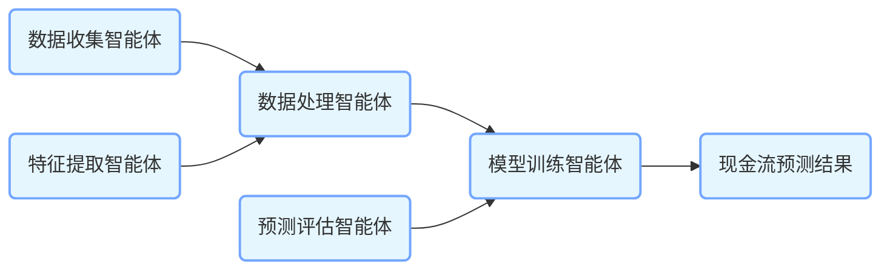

# AI智能体协作：提升对公司未来现金流稳定性的预测

> 关键词：AI智能体协作、公司未来现金流稳定性、预测模型、数据融合、决策优化

> 摘要：本文聚焦于利用AI智能体协作来提升对公司未来现金流稳定性的预测能力。首先介绍了研究的背景、目的和范围，明确预期读者和文档结构。接着阐述了AI智能体协作及公司现金流预测的核心概念与联系，包括原理和架构。详细讲解了核心算法原理，并给出Python代码示例。通过数学模型和公式深入剖析预测机制，结合具体例子进行说明。在项目实战部分，介绍了开发环境搭建、源代码实现与解读。探讨了该技术在实际中的应用场景，推荐了相关学习资源、开发工具框架和论文著作。最后总结未来发展趋势与挑战，提供常见问题解答和扩展阅读参考资料，旨在为相关领域的研究和实践提供全面且深入的指导。

## 1. 背景介绍 
### 1.1 目的和范围
公司未来现金流稳定性的预测对于企业的生存和发展至关重要。准确的预测可以帮助企业管理者做出合理的战略决策，如投资规划、融资安排等；对于投资者来说，能为其投资决策提供重要依据。然而，传统的现金流预测方法往往存在局限性，如难以处理复杂多变的市场环境和大量的非结构化数据。

本研究的目的是探索如何利用AI智能体协作来提升对公司未来现金流稳定性的预测精度和可靠性。研究范围涵盖了AI智能体的协作机制、现金流预测模型的构建、数据的收集与处理，以及模型的验证和应用等方面。

### 1.2 预期读者
本文的预期读者包括企业管理者、财务分析师、投资者、人工智能研究人员和相关领域的学生。对于企业管理者和财务分析师，本文提供了一种新的预测方法和决策支持工具；对于投资者，有助于其更准确地评估投资风险和回报；对于人工智能研究人员，为AI在金融领域的应用提供了新的研究思路；对于学生，可作为学习相关知识的参考资料。

### 1.3 文档结构概述
本文将按照以下结构进行阐述：首先介绍核心概念与联系，包括AI智能体协作和公司现金流预测的原理和架构；接着讲解核心算法原理和具体操作步骤，并给出Python代码示例；然后介绍数学模型和公式，结合实际例子进行详细说明；在项目实战部分，介绍开发环境搭建、源代码实现和代码解读；探讨实际应用场景；推荐相关的工具和资源；最后总结未来发展趋势与挑战，提供常见问题解答和扩展阅读参考资料。

### 1.4 术语表
#### 1.4.1 核心术语定义
- **AI智能体**：是一种能够感知环境、自主决策并采取行动以实现特定目标的软件实体。在本文中，AI智能体用于收集、分析和处理与公司现金流相关的数据。
- **AI智能体协作**：指多个AI智能体通过交互和合作，共同完成一个复杂的任务，如公司未来现金流稳定性的预测。
- **公司未来现金流稳定性**：指公司在未来一段时间内，现金流入和流出的相对稳定程度，反映了公司的财务健康状况和可持续发展能力。
- **预测模型**：是一种基于历史数据和相关信息，对未来事件或趋势进行预测的数学模型。在本文中，用于预测公司未来现金流的稳定性。

#### 1.4.2 相关概念解释
- **数据融合**：将来自不同数据源的数据进行整合和处理，以获取更全面、准确的信息。在AI智能体协作中，数据融合是实现有效预测的关键步骤。
- **决策优化**：通过对各种决策方案进行评估和比较，选择最优方案以实现特定目标。在公司现金流预测中，决策优化可以帮助企业管理者做出更合理的决策。
- **机器学习算法**：是一类让计算机自动从数据中学习模式和规律的算法。在本文中，机器学习算法用于构建现金流预测模型。

#### 1.4.3 缩略词列表
- **AI**：Artificial Intelligence，人工智能
- **ML**：Machine Learning，机器学习
- **RNN**：Recurrent Neural Network，循环神经网络
- **LSTM**：Long Short-Term Memory，长短期记忆网络

## 2. 核心概念与联系 
### 2.1 AI智能体协作原理
AI智能体协作的基本原理是多个智能体通过通信和协调，共享信息和资源，共同完成一个复杂的任务。每个智能体具有自己的感知、决策和行动能力，它们可以根据环境的变化和其他智能体的反馈，动态调整自己的行为。

在公司未来现金流稳定性预测中，不同的AI智能体可以负责不同的任务，如数据收集、特征提取、模型训练和预测等。通过协作，这些智能体可以充分发挥各自的优势，提高预测的准确性和效率。

### 2.2 公司现金流预测原理
公司现金流预测的基本原理是基于历史数据和相关信息，构建预测模型，对未来的现金流入和流出进行预测。常用的预测方法包括时间序列分析、回归分析、机器学习等。

时间序列分析是通过对历史现金流数据的分析，找出数据的变化规律，然后根据这些规律对未来现金流进行预测。回归分析是通过建立现金流与其他相关因素之间的回归模型，利用这些因素的变化来预测现金流的变化。机器学习方法则是通过对大量历史数据的学习，自动发现数据中的模式和规律，从而实现对未来现金流的预测。

### 2.3 核心概念架构示意图


该架构图展示了AI智能体协作进行公司现金流预测的主要流程。数据收集智能体负责收集与公司现金流相关的数据，数据处理智能体对收集到的数据进行清洗和预处理，特征提取智能体从处理后的数据中提取有用的特征，模型训练智能体利用提取的特征和历史数据训练预测模型，预测评估智能体对训练好的模型进行评估和优化，最后得到现金流预测结果。

## 3. 核心算法原理 & 具体操作步骤 
### 3.1 核心算法原理
在公司未来现金流稳定性预测中，我们可以使用长短期记忆网络（LSTM）作为核心算法。LSTM是一种特殊的循环神经网络（RNN），它能够有效地处理序列数据中的长期依赖关系，非常适合用于现金流预测。

LSTM的核心结构包括输入门、遗忘门和输出门。输入门决定了当前输入信息中有多少可以进入细胞状态；遗忘门决定了上一时刻的细胞状态中有多少需要被遗忘；输出门决定了当前细胞状态中有多少可以作为输出。

### 3.2 具体操作步骤
#### 步骤1：数据收集
收集与公司现金流相关的数据，包括历史现金流数据、财务报表数据、市场数据等。这些数据可以从公司内部的财务系统、证券交易所网站、财经数据库等渠道获取。

#### 步骤2：数据预处理
对收集到的数据进行清洗和预处理，包括去除缺失值、异常值，对数据进行归一化处理等。数据预处理的目的是提高数据的质量，为后续的模型训练提供可靠的输入。

#### 步骤3：特征提取
从预处理后的数据中提取有用的特征，如现金流增长率、利润率、市场份额等。特征提取的目的是减少数据的维度，提高模型的训练效率和预测准确性。

#### 步骤4：模型训练
使用提取的特征和历史数据训练LSTM模型。在训练过程中，需要选择合适的超参数，如学习率、批次大小、训练轮数等，以优化模型的性能。

#### 步骤5：模型评估
使用测试数据对训练好的模型进行评估，计算模型的预测误差，如均方误差（MSE）、平均绝对误差（MAE）等。根据评估结果，对模型进行调整和优化。

#### 步骤6：现金流预测
使用优化后的模型对公司未来的现金流进行预测，得到预测结果。

### 3.3 Python代码示例
```python
import numpy as np
import pandas as pd
from sklearn.preprocessing import MinMaxScaler
from tensorflow.keras.models import Sequential
from tensorflow.keras.layers import LSTM, Dense

# 步骤1：数据收集
# 假设已经收集到了历史现金流数据，存储在一个CSV文件中
data = pd.read_csv('cash_flow_data.csv')
cash_flow = data['cash_flow'].values.reshape(-1, 1)

# 步骤2：数据预处理
scaler = MinMaxScaler(feature_range=(0, 1))
scaled_cash_flow = scaler.fit_transform(cash_flow)

# 步骤3：特征提取
# 这里简单地将前n个时间步的数据作为特征
n_steps = 10
X = []
y = []
for i in range(n_steps, len(scaled_cash_flow)):
    X.append(scaled_cash_flow[i - n_steps:i, 0])
    y.append(scaled_cash_flow[i, 0])
X, y = np.array(X), np.array(y)
X = np.reshape(X, (X.shape[0], X.shape[1], 1))

# 步骤4：模型训练
model = Sequential()
model.add(LSTM(50, return_sequences=True, input_shape=(n_steps, 1)))
model.add(LSTM(50, return_sequences=False))
model.add(Dense(25))
model.add(Dense(1))

model.compile(optimizer='adam', loss='mean_squared_error')
model.fit(X, y, batch_size=32, epochs=100)

# 步骤5：模型评估
# 这里简单地使用训练数据进行评估，实际应用中应使用测试数据
predictions = model.predict(X)
predictions = scaler.inverse_transform(predictions)
actual_values = scaler.inverse_transform(y.reshape(-1, 1))
mse = np.mean((predictions - actual_values) ** 2)
print(f"均方误差: {mse}")

# 步骤6：现金流预测
last_n_steps = scaled_cash_flow[-n_steps:]
last_n_steps = last_n_steps.reshape(1, n_steps, 1)
next_cash_flow = model.predict(last_n_steps)
next_cash_flow = scaler.inverse_transform(next_cash_flow)
print(f"预测的下一期现金流: {next_cash_flow[0][0]}")
```

## 4. 数学模型和公式 & 详细讲解 & 举例说明 
### 4.1 LSTM数学模型和公式
LSTM的数学模型主要由输入门、遗忘门和输出门组成，具体公式如下：

#### 遗忘门
$$
f_t = \sigma(W_f[h_{t-1}, x_t] + b_f)
$$

其中，$f_t$ 是遗忘门的输出，$\sigma$ 是 sigmoid 函数，$W_f$ 是遗忘门的权重矩阵，$h_{t-1}$ 是上一时刻的隐藏状态，$x_t$ 是当前时刻的输入，$b_f$ 是遗忘门的偏置向量。

#### 输入门
$$
i_t = \sigma(W_i[h_{t-1}, x_t] + b_i)
$$
$$
\tilde{C}_t = \tanh(W_C[h_{t-1}, x_t] + b_C)
$$

其中，$i_t$ 是输入门的输出，$\tilde{C}_t$ 是候选细胞状态，$W_i$ 和 $W_C$ 分别是输入门和候选细胞状态的权重矩阵，$b_i$ 和 $b_C$ 分别是输入门和候选细胞状态的偏置向量。

#### 细胞状态更新
$$
C_t = f_t \odot C_{t-1} + i_t \odot \tilde{C}_t
$$

其中，$C_t$ 是当前时刻的细胞状态，$\odot$ 表示逐元素相乘。

#### 输出门
$$
o_t = \sigma(W_o[h_{t-1}, x_t] + b_o)
$$
$$
h_t = o_t \odot \tanh(C_t)
$$

其中，$o_t$ 是输出门的输出，$h_t$ 是当前时刻的隐藏状态，$W_o$ 是输出门的权重矩阵，$b_o$ 是输出门的偏置向量。

### 4.2 详细讲解
遗忘门的作用是决定上一时刻的细胞状态中有多少信息需要被遗忘。通过 sigmoid 函数，遗忘门的输出值在 0 到 1 之间，0 表示完全遗忘，1 表示完全保留。

输入门的作用是决定当前输入信息中有多少可以进入细胞状态。输入门的输出 $i_t$ 和候选细胞状态 $\tilde{C}_t$ 相乘，得到需要更新到细胞状态中的信息。

细胞状态更新公式将遗忘门的输出和上一时刻的细胞状态相乘，再加上输入门的输出和候选细胞状态的乘积，得到当前时刻的细胞状态。

输出门的作用是决定当前细胞状态中有多少可以作为输出。输出门的输出 $o_t$ 和经过 tanh 函数处理后的细胞状态相乘，得到当前时刻的隐藏状态。

### 4.3 举例说明
假设我们有一个简单的时间序列数据，每个时间步的输入 $x_t$ 是一个一维向量，上一时刻的隐藏状态 $h_{t-1}$ 也是一个一维向量。遗忘门的权重矩阵 $W_f$ 是一个 $2 \times 1$ 的矩阵，偏置向量 $b_f$ 是一个标量。

当 $W_f = [0.5, 0.3]$，$b_f = 0.1$，$h_{t-1} = 0.2$，$x_t = 0.4$ 时，遗忘门的输入为：

$$
W_f[h_{t-1}, x_t] + b_f = [0.5, 0.3] \cdot [0.2, 0.4]^T + 0.1 = 0.5 \times 0.2 + 0.3 \times 0.4 + 0.1 = 0.22
$$

遗忘门的输出为：

$$
f_t = \sigma(0.22) = \frac{1}{1 + e^{-0.22}} \approx 0.55
$$

这意味着上一时刻的细胞状态中有约 55% 的信息会被保留。

## 5. 项目实战：代码实际案例和详细解释说明 
### 5.1  开发环境搭建
#### 操作系统
可以选择 Windows、Linux 或 macOS 操作系统。建议使用 Linux 系统，因为它在数据处理和机器学习方面具有更好的性能和稳定性。

#### 编程语言和环境
使用 Python 作为开发语言，版本建议为 3.7 及以上。可以使用 Anaconda 来管理 Python 环境，它包含了许多常用的科学计算和机器学习库。

#### 安装必要的库
在 Anaconda 环境中，使用以下命令安装必要的库：
```sh
pip install numpy pandas scikit-learn tensorflow
```

### 5.2  源代码详细实现和代码解读
```python
import numpy as np
import pandas as pd
from sklearn.preprocessing import MinMaxScaler
from tensorflow.keras.models import Sequential
from tensorflow.keras.layers import LSTM, Dense

# 步骤1：数据收集
# 假设已经收集到了历史现金流数据，存储在一个CSV文件中
data = pd.read_csv('cash_flow_data.csv')
cash_flow = data['cash_flow'].values.reshape(-1, 1)

# 代码解读：使用 pandas 库读取 CSV 文件，将现金流数据提取出来并转换为二维数组。

# 步骤2：数据预处理
scaler = MinMaxScaler(feature_range=(0, 1))
scaled_cash_flow = scaler.fit_transform(cash_flow)

# 代码解读：使用 MinMaxScaler 对现金流数据进行归一化处理，将数据缩放到 0 到 1 的范围内。

# 步骤3：特征提取
# 这里简单地将前n个时间步的数据作为特征
n_steps = 10
X = []
y = []
for i in range(n_steps, len(scaled_cash_flow)):
    X.append(scaled_cash_flow[i - n_steps:i, 0])
    y.append(scaled_cash_flow[i, 0])
X, y = np.array(X), np.array(y)
X = np.reshape(X, (X.shape[0], X.shape[1], 1))

# 代码解读：将前 n_steps 个时间步的数据作为特征，当前时间步的数据作为标签。将特征和标签转换为 numpy 数组，并将特征数组的形状调整为适合 LSTM 输入的形状。

# 步骤4：模型训练
model = Sequential()
model.add(LSTM(50, return_sequences=True, input_shape=(n_steps, 1)))
model.add(LSTM(50, return_sequences=False))
model.add(Dense(25))
model.add(Dense(1))

model.compile(optimizer='adam', loss='mean_squared_error')
model.fit(X, y, batch_size=32, epochs=100)

# 代码解读：使用 Sequential 模型构建 LSTM 模型，添加两个 LSTM 层和两个全连接层。使用 adam 优化器和均方误差损失函数进行编译。使用训练数据对模型进行训练，设置批次大小为 32，训练轮数为 100。

# 步骤5：模型评估
# 这里简单地使用训练数据进行评估，实际应用中应使用测试数据
predictions = model.predict(X)
predictions = scaler.inverse_transform(predictions)
actual_values = scaler.inverse_transform(y.reshape(-1, 1))
mse = np.mean((predictions - actual_values) ** 2)
print(f"均方误差: {mse}")

# 代码解读：使用训练好的模型对训练数据进行预测，将预测结果和实际值进行反归一化处理，计算均方误差。

# 步骤6：现金流预测
last_n_steps = scaled_cash_flow[-n_steps:]
last_n_steps = last_n_steps.reshape(1, n_steps, 1)
next_cash_flow = model.predict(last_n_steps)
next_cash_flow = scaler.inverse_transform(next_cash_flow)
print(f"预测的下一期现金流: {next_cash_flow[0][0]}")

# 代码解读：取最后 n_steps 个时间步的数据作为输入，使用训练好的模型进行预测，将预测结果进行反归一化处理，得到预测的下一期现金流。
```

### 5.3  代码解读与分析
#### 数据处理部分
数据收集部分使用 pandas 库读取 CSV 文件，将现金流数据提取出来并转换为二维数组。数据预处理部分使用 MinMaxScaler 对数据进行归一化处理，这有助于提高模型的训练效率和稳定性。特征提取部分将前 n_steps 个时间步的数据作为特征，当前时间步的数据作为标签，将特征和标签转换为适合 LSTM 输入的形状。

#### 模型构建部分
使用 Sequential 模型构建 LSTM 模型，添加两个 LSTM 层和两个全连接层。第一个 LSTM 层的 return_sequences 参数设置为 True，表示返回每个时间步的隐藏状态；第二个 LSTM 层的 return_sequences 参数设置为 False，表示只返回最后一个时间步的隐藏状态。

#### 模型训练部分
使用 adam 优化器和均方误差损失函数对模型进行编译。adam 优化器是一种自适应学习率的优化算法，能够自动调整学习率，提高模型的训练效率。均方误差损失函数用于衡量模型的预测结果和实际值之间的误差。

#### 模型评估部分
使用训练数据对模型进行评估，计算均方误差。在实际应用中，应使用测试数据进行评估，以更准确地评估模型的泛化能力。

#### 现金流预测部分
取最后 n_steps 个时间步的数据作为输入，使用训练好的模型进行预测，将预测结果进行反归一化处理，得到预测的下一期现金流。

## 6. 实际应用场景 
### 6.1 企业财务管理
企业管理者可以利用AI智能体协作预测公司未来现金流的稳定性，从而做出合理的财务决策。例如，根据预测结果合理安排资金的使用，优化投资计划，避免资金短缺或闲置。

### 6.2 投资决策
投资者可以根据公司未来现金流的预测结果，评估公司的投资价值和风险。如果预测结果显示公司未来现金流稳定，且有增长趋势，投资者可以考虑增加对该公司的投资；反之，如果预测结果显示公司未来现金流不稳定，投资者可以减少或避免对该公司的投资。

### 6.3 银行信贷审批
银行在进行信贷审批时，可以参考公司未来现金流的预测结果，评估公司的还款能力。如果预测结果显示公司未来现金流稳定，银行可以更放心地为该公司提供贷款；反之，如果预测结果显示公司未来现金流不稳定，银行可能会谨慎考虑是否为该公司提供贷款。

### 6.4 供应链管理
在供应链管理中，供应商可以根据下游企业未来现金流的预测结果，合理安排生产和库存。如果预测结果显示下游企业未来现金流稳定，供应商可以增加生产和库存；反之，如果预测结果显示下游企业未来现金流不稳定，供应商可以减少生产和库存，降低风险。

## 7. 工具和资源推荐
### 7.1 学习资源推荐
#### 7.1.1 书籍推荐
- 《Python机器学习》：介绍了Python在机器学习中的应用，包括数据处理、模型训练和评估等方面的知识。
- 《深度学习》：由深度学习领域的三位权威专家编写，系统地介绍了深度学习的基本原理、算法和应用。
- 《金融时间序列分析》：介绍了金融时间序列的分析方法和模型，包括ARIMA、GARCH等模型，对于理解现金流预测有很大帮助。

#### 7.1.2 在线课程
- Coursera上的“机器学习”课程：由斯坦福大学的Andrew Ng教授主讲，是机器学习领域的经典课程，涵盖了机器学习的基本概念、算法和应用。
- edX上的“深度学习基础”课程：介绍了深度学习的基本原理和算法，包括神经网络、卷积神经网络、循环神经网络等。
- Kaggle上的“金融数据分析”课程：提供了丰富的金融数据分析案例和实践项目，帮助学习者掌握金融数据分析的方法和技巧。

#### 7.1.3 技术博客和网站
- Medium：是一个技术博客平台，上面有许多关于人工智能、机器学习和金融科技的文章和教程。
- Towards Data Science：专注于数据科学和机器学习领域的技术博客，提供了许多实用的技术文章和案例分析。
- 金融界网站：提供了丰富的金融数据和资讯，对于研究公司现金流和金融市场有很大帮助。

### 7.2 开发工具框架推荐
#### 7.2.1 IDE和编辑器
- PyCharm：是一款专业的Python集成开发环境，提供了丰富的代码编辑、调试和分析功能，适合Python开发者使用。
- Jupyter Notebook：是一个交互式的开发环境，支持Python、R等多种编程语言，适合数据科学家和机器学习工程师进行数据探索和模型开发。
- Visual Studio Code：是一款轻量级的代码编辑器，支持多种编程语言和插件扩展，具有良好的开发体验。

#### 7.2.2 调试和性能分析工具
- TensorBoard：是TensorFlow提供的一个可视化工具，用于监控模型的训练过程、可视化模型的结构和性能指标等。
- Py-Spy：是一个Python性能分析工具，可以实时监控Python程序的CPU使用率、内存使用率等性能指标，帮助开发者找出性能瓶颈。
- Scikit-learn的交叉验证工具：可以帮助开发者评估模型的性能和稳定性，选择最优的模型和超参数。

#### 7.2.3 相关框架和库
- TensorFlow：是一个开源的机器学习框架，提供了丰富的深度学习模型和工具，支持分布式训练和部署。
- PyTorch：是另一个开源的机器学习框架，具有动态图和易于使用的特点，适合快速开发和实验。
- Scikit-learn：是一个用于机器学习的Python库，提供了许多常用的机器学习算法和工具，如分类、回归、聚类等。

### 7.3 相关论文著作推荐
#### 7.3.1 经典论文
- Hochreiter, S., & Schmidhuber, J. (1997). Long short-term memory. Neural computation, 9(8), 1735-1780.：介绍了长短期记忆网络（LSTM）的基本原理和算法，是深度学习领域的经典论文。
- Brownlee, J. (2017). Deep learning for time series forecasting: Predict the future with deep neural networks. Machine Learning Mastery.：介绍了深度学习在时间序列预测中的应用，包括LSTM、GRU等模型。
- Campbell, J. Y., & Shiller, R. J. (1988). The dividend-price ratio and expectations of future dividends and discount factors. The Review of Financial Studies, 1(3), 195-228.：研究了股息价格比与未来股息和贴现因子之间的关系，对于理解公司现金流和股票价格的关系有重要意义。

#### 7.3.2 最新研究成果
- 在IEEE Transactions on Neural Networks and Learning Systems、Journal of Financial Economics等学术期刊上，可以找到关于AI智能体协作和公司现金流预测的最新研究成果。
- 每年的NeurIPS、ICML等机器学习领域的顶级会议上，也会有相关的研究论文发表。

#### 7.3.3 应用案例分析
- 一些知名金融机构和企业的官方网站上，会发布关于AI智能体协作在金融领域应用的案例分析，如高盛、摩根大通等。
- Kaggle上也有许多关于金融数据分析和预测的竞赛和案例，学习者可以从中学习到实际应用中的技巧和方法。

## 8. 总结：未来发展趋势与挑战
### 8.1 未来发展趋势
#### 多智能体协作的深化
未来，AI智能体之间的协作将更加深入和复杂。不同类型的智能体可以协同工作，实现更高效的数据处理、模型训练和决策优化。例如，除了数据收集、特征提取和模型训练智能体，还可以引入知识推理智能体和决策辅助智能体，为企业管理者提供更全面的决策支持。

#### 与其他技术的融合
AI智能体协作将与区块链、物联网等技术进行更深度的融合。区块链技术可以提供更安全、可信的数据共享和存储环境，物联网技术可以实时收集企业的生产、销售等数据，为现金流预测提供更丰富、准确的信息。

#### 个性化预测服务
随着技术的发展，AI智能体协作可以为不同的企业和用户提供个性化的现金流预测服务。根据企业的行业特点、规模、发展阶段等因素，定制适合的预测模型和方法，提高预测的准确性和针对性。

### 8.2 挑战
#### 数据质量和隐私问题
准确的现金流预测需要大量高质量的数据，但数据的收集、清洗和预处理过程中可能存在数据质量不高、数据缺失、数据错误等问题。此外，企业的财务数据涉及到商业机密和隐私，如何在保证数据安全和隐私的前提下，实现数据的有效共享和利用，是一个亟待解决的问题。

#### 模型解释性和可信赖性
深度学习模型，如LSTM，通常是黑盒模型，难以解释其预测结果的原因。在实际应用中，企业管理者和投资者需要了解模型的决策依据，以便做出合理的决策。因此，提高模型的解释性和可信赖性是一个重要的挑战。

#### 技术人才短缺
AI智能体协作和现金流预测需要具备人工智能、机器学习、金融等多领域知识的技术人才。目前，这类复合型人才相对短缺，限制了该技术的推广和应用。

## 9. 附录：常见问题与解答
### 问题1：AI智能体协作一定能提高现金流预测的准确性吗？
解答：AI智能体协作不一定能绝对提高现金流预测的准确性。虽然AI智能体协作可以整合多个智能体的优势，处理更复杂的数据和任务，但预测的准确性还受到数据质量、模型选择和超参数调整等多种因素的影响。如果数据质量不高，或者模型选择不合适，即使使用AI智能体协作，预测结果也可能不准确。

### 问题2：如何选择合适的AI智能体协作架构？
解答：选择合适的AI智能体协作架构需要考虑多个因素，如任务的复杂度、数据的分布和特征、智能体的能力和资源等。对于简单的任务，可以选择集中式协作架构，由一个中心智能体负责协调和管理其他智能体的工作；对于复杂的任务，可以选择分布式协作架构，智能体之间通过通信和协商共同完成任务。此外，还可以根据数据的分布和特征，选择合适的协作模式，如数据并行、模型并行等。

### 问题3：如何评估AI智能体协作模型的性能？
解答：评估AI智能体协作模型的性能可以从多个方面进行，如预测准确性、模型的稳定性、计算效率等。常用的评估指标包括均方误差（MSE）、平均绝对误差（MAE）、决定系数（$R^2$）等。此外，还可以使用交叉验证、留出法等方法，将数据集分为训练集和测试集，用测试集评估模型的泛化能力。

### 问题4：AI智能体协作在实际应用中面临哪些法律和道德问题？
解答：AI智能体协作在实际应用中可能面临一些法律和道德问题。例如，数据的使用和共享可能涉及到隐私保护和数据安全问题，需要遵守相关的法律法规；模型的决策结果可能对企业和个人产生重大影响，需要保证决策的公平性和透明度；智能体的行为和决策可能存在一定的不确定性，需要建立相应的责任机制。

## 10. 扩展阅读 & 参考资料
- 《人工智能：现代方法》：全面介绍了人工智能的基本概念、算法和应用，是人工智能领域的经典教材。
- 《Python数据分析实战》：通过实际案例介绍了Python在数据分析中的应用，包括数据处理、可视化和机器学习等方面的知识。
- Kaggle官方网站：提供了丰富的数据分析和机器学习竞赛和案例，是学习和实践的好平台。
- IEEE Xplore、ACM Digital Library等学术数据库：可以查找关于AI智能体协作和金融预测的最新研究论文。

作者：AI天才研究院/AI Genius Institute & 禅与计算机程序设计艺术 /Zen And The Art of Computer Programming