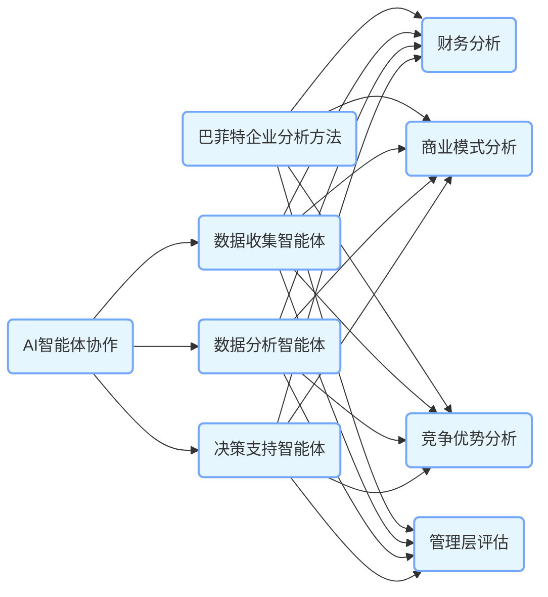

# AI智能体协作：提升巴菲特的企业分析方法

> 关键词：AI智能体协作、巴菲特企业分析方法、财务分析、市场趋势、企业竞争力

> 摘要：本文旨在探讨如何利用AI智能体协作来提升巴菲特的企业分析方法。通过深入研究巴菲特的价值投资理念和企业分析框架，结合AI智能体的强大数据处理和分析能力，阐述了如何从多个维度对企业进行更全面、深入的评估。文章详细介绍了核心概念、算法原理、数学模型，并通过项目实战展示了具体应用。同时，分析了该方法在实际场景中的应用，推荐了相关的工具和资源，最后对未来发展趋势与挑战进行了总结。

## 1. 背景介绍 
### 1.1 目的和范围
巴菲特的价值投资理念在投资界有着深远的影响，其核心在于通过对企业的深入分析，找到具有长期投资价值的公司。然而，传统的企业分析方法面临着数据处理量大、分析维度有限等挑战。本研究的目的是引入AI智能体协作技术，提升巴菲特企业分析方法的效率和准确性，拓展分析的维度和深度。研究范围涵盖了财务分析、市场趋势预测、企业竞争力评估等多个方面。

### 1.2 预期读者
本文预期读者包括投资领域的专业人士，如基金经理、分析师等；对价值投资和AI技术感兴趣的个人投资者；以及从事人工智能和金融科技研究的学者和研究人员。

### 1.3 文档结构概述
本文将首先介绍相关的核心概念和它们之间的联系，包括巴菲特的企业分析方法和AI智能体协作的原理。接着详细阐述核心算法原理和具体操作步骤，通过Python代码进行说明。然后介绍数学模型和公式，并结合实际例子进行讲解。在项目实战部分，展示如何搭建开发环境、实现源代码并进行代码解读。之后分析该方法在实际应用场景中的应用，推荐相关的工具和资源。最后总结未来发展趋势与挑战，并提供常见问题的解答和扩展阅读的参考资料。

### 1.4 术语表
#### 1.4.1 核心术语定义
- **巴菲特企业分析方法**：基于价值投资理念，通过对企业的财务状况、商业模式、竞争优势等方面进行分析，评估企业的内在价值和投资潜力。
- **AI智能体协作**：多个AI智能体通过通信和协作，共同完成复杂的任务，在企业分析中可实现数据处理、模型训练和决策支持等功能。
- **企业内在价值**：企业未来预期现金流的现值，是巴菲特投资决策的重要依据。
- **财务比率分析**：通过计算和分析企业的各种财务比率，如毛利率、净利率、资产负债率等，评估企业的财务健康状况和经营效率。

#### 1.4.2 相关概念解释
- **价值投资**：一种投资策略，强调通过分析企业的基本面，寻找被低估的股票，长期持有以获取投资回报。
- **人工智能**：计算机科学的一个分支，旨在使机器具有智能行为，如学习、推理、决策等。
- **机器学习**：人工智能的一个重要领域，通过让机器从数据中学习模式和规律，实现预测和决策等功能。

#### 1.4.3 缩略词列表
- **AI**：Artificial Intelligence（人工智能）
- **ML**：Machine Learning（机器学习）
- **DCF**：Discounted Cash Flow（现金流折现法）

## 2. 核心概念与联系 

### 2.1 巴菲特的企业分析方法
巴菲特的企业分析方法主要基于以下几个方面：
- **财务分析**：通过分析企业的财务报表，评估企业的盈利能力、偿债能力、运营能力等。常用的财务指标包括净利润、毛利率、净资产收益率等。
- **商业模式分析**：研究企业的业务模式，了解企业如何创造价值和盈利。例如，企业的客户群体、产品或服务特点、收入来源等。
- **竞争优势分析**：评估企业在市场中的竞争地位和优势，如品牌优势、技术优势、成本优势等。具有强大竞争优势的企业往往能够在长期内保持良好的业绩。
- **管理层评估**：考察企业管理层的能力和诚信度，优秀的管理层能够带领企业实现持续发展。

### 2.2 AI智能体协作原理
AI智能体是具有自主决策和行动能力的软件实体。在企业分析中，多个AI智能体可以分工协作，完成不同的任务。例如，一个智能体负责收集和整理财务数据，另一个智能体负责进行数据挖掘和分析，还有一个智能体负责根据分析结果进行决策支持。

AI智能体之间通过通信机制进行信息交换和协作，共同完成复杂的企业分析任务。它们可以根据任务的需求动态调整协作方式，提高分析效率和准确性。

### 2.3 核心概念的联系
AI智能体协作可以为巴菲特的企业分析方法提供强大的支持。通过AI智能体的协作，可以快速、准确地收集和处理大量的企业数据，包括财务数据、市场数据、行业数据等。同时，AI智能体可以利用机器学习和数据分析技术，挖掘数据中的潜在信息，为企业分析提供更深入的见解。

例如，在财务分析方面，AI智能体可以自动计算各种财务比率，并进行趋势分析和比较分析，帮助投资者更好地了解企业的财务状况。在市场趋势预测方面，AI智能体可以分析市场数据和新闻信息，预测市场的走势和企业的未来业绩。

### 2.4 文本示意图
```plaintext
巴菲特企业分析方法
|-- 财务分析
|   |-- 盈利能力评估
|   |-- 偿债能力评估
|   |-- 运营能力评估
|-- 商业模式分析
|   |-- 客户群体分析
|   |-- 产品或服务特点
|   |-- 收入来源分析
|-- 竞争优势分析
|   |-- 品牌优势
|   |-- 技术优势
|   |-- 成本优势
|-- 管理层评估
|   |-- 能力评估
|   |-- 诚信度评估

AI智能体协作
|-- 数据收集智能体
|-- 数据分析智能体
|-- 决策支持智能体

联系：AI智能体协作为巴菲特企业分析方法提供数据处理、分析和决策支持
```

### 2.5 Mermaid流程图


## 3. 核心算法原理 & 具体操作步骤 

### 3.1 数据收集与预处理算法
在企业分析中，首先需要收集大量的相关数据，包括财务报表数据、市场数据、行业数据等。数据收集可以通过网络爬虫、API接口等方式进行。

以下是一个使用Python的`requests`库进行网页数据爬取的示例代码：
```python
import requests
from bs4 import BeautifulSoup

def get_web_data(url):
    try:
        response = requests.get(url)
        response.raise_for_status()
        soup = BeautifulSoup(response.text, 'html.parser')
        return soup
    except requests.RequestException as e:
        print(f"Error fetching data: {e}")
        return None

# 示例URL
url = 'https://example.com/financial-data'
data = get_web_data(url)
if data:
    print(data.prettify())
```
数据预处理是对收集到的数据进行清洗、转换和归一化等操作，以提高数据的质量和可用性。以下是一个简单的数据清洗示例：
```python
import pandas as pd

def clean_data(data):
    # 去除缺失值
    data = data.dropna()
    # 去除重复值
    data = data.drop_duplicates()
    return data

# 示例数据
data = pd.DataFrame({'col1': [1, 2, None, 4], 'col2': [5, 6, 7, 8]})
cleaned_data = clean_data(data)
print(cleaned_data)
```

### 3.2 财务比率分析算法
财务比率分析是巴菲特企业分析方法的重要组成部分。常见的财务比率包括毛利率、净利率、资产负债率等。以下是计算这些财务比率的Python代码示例：
```python
def calculate_gross_margin(revenue, cost_of_goods_sold):
    return (revenue - cost_of_goods_sold) / revenue

def calculate_net_profit_margin(net_income, revenue):
    return net_income / revenue

def calculate_debt_ratio(total_debt, total_assets):
    return total_debt / total_assets

# 示例数据
revenue = 1000
cost_of_goods_sold = 600
net_income = 200
total_debt = 300
total_assets = 800

gross_margin = calculate_gross_margin(revenue, cost_of_goods_sold)
net_profit_margin = calculate_net_profit_margin(net_income, revenue)
debt_ratio = calculate_debt_ratio(total_debt, total_assets)

print(f"Gross Margin: {gross_margin:.2%}")
print(f"Net Profit Margin: {net_profit_margin:.2%}")
print(f"Debt Ratio: {debt_ratio:.2%}")
```

### 3.3 市场趋势预测算法
市场趋势预测可以使用机器学习算法，如线性回归、决策树、神经网络等。以下是一个使用线性回归进行简单市场趋势预测的示例代码：
```python
import numpy as np
from sklearn.linear_model import LinearRegression

# 示例数据
X = np.array([[1], [2], [3], [4], [5]])
y = np.array([2, 4, 6, 8, 10])

# 创建线性回归模型
model = LinearRegression()
# 训练模型
model.fit(X, y)

# 预测未来值
future_X = np.array([[6]])
prediction = model.predict(future_X)
print(f"Predicted value: {prediction[0]}")
```

### 3.4 具体操作步骤
1. **数据收集**：使用网络爬虫或API接口收集企业的财务数据、市场数据和行业数据。
2. **数据预处理**：对收集到的数据进行清洗、转换和归一化等操作。
3. **财务比率分析**：计算各种财务比率，评估企业的财务状况。
4. **市场趋势预测**：使用机器学习算法对市场趋势进行预测。
5. **综合分析与决策**：结合财务分析和市场趋势预测结果，对企业进行综合评估，做出投资决策。

## 4. 数学模型和公式 & 详细讲解 & 举例说明 

### 4.1 现金流折现法（DCF）
现金流折现法是巴菲特评估企业内在价值的重要方法之一。其基本原理是将企业未来预期的现金流折现到当前，以计算企业的内在价值。

#### 4.1.1 数学公式
$$V = \sum_{t=1}^{n} \frac{CF_t}{(1 + r)^t}$$
其中，$V$ 表示企业的内在价值，$CF_t$ 表示第 $t$ 期的现金流，$r$ 表示折现率，$n$ 表示预测期数。

#### 4.1.2 详细讲解
现金流折现法的关键在于准确预测企业未来的现金流和选择合适的折现率。未来现金流的预测需要考虑企业的业务模式、市场竞争、行业发展等因素。折现率反映了资金的时间价值和投资的风险，通常可以使用企业的加权平均资本成本（WACC）作为折现率。

#### 4.1.3 举例说明
假设某企业未来三年的预期现金流分别为 $100$ 万元、$120$ 万元和 $150$ 万元，折现率为 $10\%$。则该企业的内在价值计算如下：
$$V = \frac{100}{(1 + 0.1)^1} + \frac{120}{(1 + 0.1)^2} + \frac{150}{(1 + 0.1)^3}$$
```python
import numpy as np

cash_flows = [100, 120, 150]
discount_rate = 0.1

present_values = []
for t, cf in enumerate(cash_flows, start=1):
    pv = cf / (1 + discount_rate) ** t
    present_values.append(pv)

intrinsic_value = np.sum(present_values)
print(f"Intrinsic value: {intrinsic_value:.2f}")
```

### 4.2 杜邦分析体系
杜邦分析体系是一种综合分析企业盈利能力的方法，通过将净资产收益率（ROE）分解为多个因素，揭示企业盈利能力的驱动因素。

#### 4.2.1 数学公式
$$ROE = \frac{净利润}{净资产} = \frac{净利润}{营业收入} \times \frac{营业收入}{总资产} \times \frac{总资产}{净资产}$$
即：
$$ROE = 销售净利率 \times 总资产周转率 \times 权益乘数$$

#### 4.2.2 详细讲解
销售净利率反映了企业的盈利能力，总资产周转率反映了企业的运营效率，权益乘数反映了企业的财务杠杆水平。通过杜邦分析体系，可以深入了解企业的盈利能力是由哪些因素驱动的，从而有针对性地进行分析和改进。

#### 4.2.3 举例说明
假设某企业的净利润为 $200$ 万元，营业收入为 $1000$ 万元，总资产为 $500$ 万元，净资产为 $300$ 万元。则该企业的ROE计算如下：
$$销售净利率 = \frac{200}{1000} = 0.2$$
$$总资产周转率 = \frac{1000}{500} = 2$$
$$权益乘数 = \frac{500}{300} \approx 1.67$$
$$ROE = 0.2 \times 2 \times 1.67 \approx 0.67$$
```python
net_income = 200
revenue = 1000
total_assets = 500
total_equity = 300

net_profit_margin = net_income / revenue
asset_turnover = revenue / total_assets
equity_multiplier = total_assets / total_equity

roe = net_profit_margin * asset_turnover * equity_multiplier
print(f"ROE: {roe:.2%}")
```

## 5. 项目实战：代码实际案例和详细解释说明 

### 5.1  开发环境搭建
#### 5.1.1 安装Python
首先需要安装Python，建议使用Python 3.7及以上版本。可以从Python官方网站（https://www.python.org/downloads/）下载安装包，按照安装向导进行安装。

#### 5.1.2 安装必要的库
在命令行中使用`pip`工具安装必要的库，如`pandas`、`numpy`、`scikit-learn`、`requests`、`beautifulsoup4`等。
```sh
pip install pandas numpy scikit-learn requests beautifulsoup4
```

### 5.2  源代码详细实现和代码解读
以下是一个完整的企业分析项目示例代码，包括数据收集、财务比率分析和市场趋势预测：
```python
import requests
from bs4 import BeautifulSoup
import pandas as pd
import numpy as np
from sklearn.linear_model import LinearRegression

# 数据收集函数
def get_web_data(url):
    try:
        response = requests.get(url)
        response.raise_for_status()
        soup = BeautifulSoup(response.text, 'html.parser')
        return soup
    except requests.RequestException as e:
        print(f"Error fetching data: {e}")
        return None

# 数据清洗函数
def clean_data(data):
    data = data.dropna()
    data = data.drop_duplicates()
    return data

# 财务比率分析函数
def calculate_gross_margin(revenue, cost_of_goods_sold):
    return (revenue - cost_of_goods_sold) / revenue

def calculate_net_profit_margin(net_income, revenue):
    return net_income / revenue

def calculate_debt_ratio(total_debt, total_assets):
    return total_debt / total_assets

# 市场趋势预测函数
def predict_market_trend(X, y, future_X):
    model = LinearRegression()
    model.fit(X, y)
    prediction = model.predict(future_X)
    return prediction

# 主函数
def main():
    # 示例URL
    url = 'https://example.com/financial-data'
    data = get_web_data(url)
    if data:
        # 假设数据可以转换为DataFrame
        df = pd.DataFrame({'revenue': [1000, 1200, 1500],
                           'cost_of_goods_sold': [600, 700, 800],
                           'net_income': [200, 250, 300],
                           'total_debt': [300, 350, 400],
                           'total_assets': [800, 900, 1000]})
        
        # 数据清洗
        cleaned_df = clean_data(df)
        
        # 财务比率分析
        revenue = cleaned_df['revenue'].values
        cost_of_goods_sold = cleaned_df['cost_of_goods_sold'].values
        net_income = cleaned_df['net_income'].values
        total_debt = cleaned_df['total_debt'].values
        total_assets = cleaned_df['total_assets'].values
        
        gross_margin = calculate_gross_margin(revenue, cost_of_goods_sold)
        net_profit_margin = calculate_net_profit_margin(net_income, revenue)
        debt_ratio = calculate_debt_ratio(total_debt, total_assets)
        
        print(f"Gross Margin: {gross_margin}")
        print(f"Net Profit Margin: {net_profit_margin}")
        print(f"Debt Ratio: {debt_ratio}")
        
        # 市场趋势预测
        X = np.array([[1], [2], [3]])
        y = revenue
        future_X = np.array([[4]])
        prediction = predict_market_trend(X, y, future_X)
        print(f"Predicted revenue: {prediction[0]}")

if __name__ == "__main__":
    main()
```

### 5.3  代码解读与分析
- **数据收集部分**：`get_web_data`函数使用`requests`库发送HTTP请求获取网页数据，并使用`BeautifulSoup`库解析HTML内容。
- **数据清洗部分**：`clean_data`函数使用`pandas`库的`dropna`和`drop_duplicates`方法去除缺失值和重复值。
- **财务比率分析部分**：`calculate_gross_margin`、`calculate_net_profit_margin`和`calculate_debt_ratio`函数分别计算毛利率、净利率和资产负债率。
- **市场趋势预测部分**：`predict_market_trend`函数使用`scikit-learn`库的`LinearRegression`模型进行线性回归预测。
- **主函数部分**：调用上述函数完成数据收集、清洗、财务比率分析和市场趋势预测，并输出结果。

## 6. 实际应用场景 
### 6.1 投资决策
投资者可以使用AI智能体协作提升的巴菲特企业分析方法，对潜在的投资标的进行全面、深入的分析。通过财务分析、市场趋势预测和企业竞争力评估等，筛选出具有投资价值的企业，制定合理的投资策略。

### 6.2 企业战略规划
企业管理者可以利用该方法对自身企业和竞争对手进行分析，了解企业的优势和劣势，制定针对性的战略规划。例如，通过财务比率分析发现企业的运营效率问题，通过市场趋势预测调整产品研发和市场推广策略。

### 6.3 金融机构风险评估
金融机构在进行信贷审批、投资评级等业务时，可以使用该方法评估企业的信用风险和投资价值。通过对企业的财务状况、市场前景等进行综合分析，降低金融机构的风险。

## 7. 工具和资源推荐
### 7.1 学习资源推荐
#### 7.1.1 书籍推荐
- 《聪明的投资者》（The Intelligent Investor）：本杰明·格雷厄姆著，价值投资领域的经典著作，介绍了价值投资的基本理念和方法。
- 《巴菲特致股东的信：股份公司教程》（The Essays of Warren Buffett: Lessons for Corporate America）：沃伦·巴菲特著，收录了巴菲特历年致股东的信，包含了他的投资哲学和企业分析方法。
- 《机器学习》（Machine Learning）：周志华著，系统介绍了机器学习的基本概念、算法和应用，适合初学者和进阶学习者。

#### 7.1.2 在线课程
- Coursera上的“机器学习”课程：由斯坦福大学教授吴恩达讲授，是机器学习领域的经典课程，涵盖了机器学习的基本算法和应用。
- edX上的“人工智能基础”课程：介绍了人工智能的基本概念、技术和应用，帮助学习者建立人工智能的基础知识体系。

#### 7.1.3 技术博客和网站
- Medium：一个技术博客平台，有很多关于人工智能、金融科技等领域的优质文章。
- Towards Data Science：专注于数据科学和机器学习领域的博客，提供了很多实用的技术教程和案例分析。

### 7.2 开发工具框架推荐
#### 7.2.1 IDE和编辑器
- PyCharm：一款专业的Python集成开发环境，提供了丰富的代码编辑、调试和项目管理功能。
- Jupyter Notebook：一个交互式的开发环境，适合进行数据分析和机器学习实验，支持Python、R等多种编程语言。

#### 7.2.2 调试和性能分析工具
- pdb：Python自带的调试工具，可以帮助开发者定位和解决代码中的问题。
- cProfile：Python的性能分析工具，可以分析代码的运行时间和资源消耗情况。

#### 7.2.3 相关框架和库
- pandas：一个强大的数据处理和分析库，提供了丰富的数据结构和数据操作方法。
- numpy：Python的数值计算库，提供了高效的数组和矩阵运算功能。
- scikit-learn：一个常用的机器学习库，提供了多种机器学习算法和工具。

### 7.3 相关论文著作推荐
#### 7.3.1 经典论文
- Fama, E. F., & French, K. R. (1992). The cross-section of expected stock returns. Journal of Finance, 47(2), 427-465. 该论文提出了著名的Fama-French三因子模型，用于解释股票收益率的差异。
- Sharpe, W. F. (1964). Capital asset prices: A theory of market equilibrium under conditions of risk. The Journal of Finance, 19(3), 425-442. 该论文提出了资本资产定价模型（CAPM），是现代金融理论的重要基础。

#### 7.3.2 最新研究成果
- 关注顶级学术期刊，如Journal of Financial Economics、Review of Financial Studies等，了解金融领域的最新研究动态。
- 参加学术会议，如美国金融协会年会（AFA）、西部金融协会年会（WFA）等，与领域内的专家学者交流最新研究成果。

#### 7.3.3 应用案例分析
- 研究一些知名投资机构的投资案例，了解他们如何运用企业分析方法进行投资决策。
- 分析一些成功企业的发展历程，了解企业在不同阶段的战略规划和市场竞争策略。

## 8. 总结：未来发展趋势与挑战
### 8.1 未来发展趋势
- **多智能体协作的深化**：随着AI技术的发展，AI智能体之间的协作将更加紧密和高效。不同类型的智能体可以在不同的分析任务中发挥各自的优势，实现更复杂的企业分析。
- **融合更多数据源**：除了传统的财务数据和市场数据，未来将融合更多的非结构化数据，如社交媒体数据、新闻数据、卫星图像数据等，以获取更全面的企业信息。
- **与区块链技术结合**：区块链技术的去中心化、不可篡改等特点可以提高企业数据的安全性和可信度，与AI智能体协作相结合，可以为企业分析提供更可靠的数据基础。

### 8.2 挑战
- **数据质量和隐私问题**：大量的数据收集和使用可能会面临数据质量参差不齐和隐私泄露的问题。如何保证数据的准确性、完整性和安全性是需要解决的重要问题。
- **算法可解释性**：一些复杂的机器学习算法，如深度学习算法，具有较高的预测准确率，但缺乏可解释性。在企业分析中，投资者和决策者需要了解算法的决策依据，因此提高算法的可解释性是一个挑战。
- **技术人才短缺**：AI智能体协作和企业分析需要具备跨领域知识的技术人才，包括人工智能、金融、统计学等方面的知识。目前这类人才相对短缺，需要加强培养和引进。

## 9. 附录：常见问题与解答
### 9.1 AI智能体协作是否可以完全替代人工分析？
AI智能体协作可以提供强大的数据处理和分析能力，但不能完全替代人工分析。人工分析在理解企业的商业模式、评估管理层的能力和诚信度等方面具有独特的优势。AI智能体协作可以作为人工分析的辅助工具，提高分析的效率和准确性。

### 9.2 如何选择合适的折现率进行现金流折现法计算？
折现率的选择需要考虑多个因素，如企业的风险水平、市场利率、行业平均回报率等。通常可以使用企业的加权平均资本成本（WACC）作为折现率。WACC的计算需要考虑企业的股权成本和债务成本，可以通过资本资产定价模型（CAPM）等方法进行估算。

### 9.3 如何评估AI智能体协作的分析结果的可靠性？
可以通过以下方法评估AI智能体协作的分析结果的可靠性：
- **交叉验证**：使用不同的数据集对模型进行训练和测试，评估模型的泛化能力。
- **与其他分析方法对比**：将AI智能体协作的分析结果与传统的分析方法进行对比，验证结果的一致性。
- **实际应用验证**：将分析结果应用到实际投资或决策中，观察实际效果。

## 10. 扩展阅读 & 参考资料
### 10.1 扩展阅读
- 《金融炼金术》（The Alchemy of Finance）：乔治·索罗斯著，介绍了索罗斯的投资哲学和反射理论。
- 《大数据时代：生活、工作与思维的大变革》（Big Data: A Revolution That Will Transform How We Live, Work, and Think）：维克托·迈尔-舍恩伯格、肯尼斯·库克耶著，探讨了大数据对社会和经济的影响。

### 10.2 参考资料
- 各企业的财务报表和年度报告。
- 金融数据提供商，如Wind、Bloomberg等提供的数据。
- 相关学术期刊和会议论文。

作者：AI天才研究院/AI Genius Institute & 禅与计算机程序设计艺术 /Zen And The Art of Computer Programming