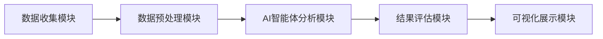

# AI智能体在分析公司高管言行不一致性中的应用

> 关键词：AI智能体、公司高管、言行不一致性、文本分析、数据挖掘

> 摘要：本文围绕AI智能体在分析公司高管言行不一致性中的应用展开。随着企业管理和公众监督的加强，对公司高管言行一致性的评估变得尤为重要。AI智能体凭借其强大的数据处理和分析能力，能够高效准确地检测和分析高管言行之间的差异。文章首先介绍了相关背景，包括目的、预期读者、文档结构和术语表；接着阐述了核心概念与联系，给出了原理和架构的文本示意图及Mermaid流程图；详细讲解了核心算法原理和具体操作步骤，并使用Python源代码进行说明；还介绍了相关数学模型和公式，并举例说明；通过项目实战展示了代码实际案例及详细解释；探讨了实际应用场景；推荐了学习资源、开发工具框架和相关论文著作；最后总结了未来发展趋势与挑战，并给出常见问题与解答以及扩展阅读和参考资料。

## 1. 背景介绍 
### 1.1 目的和范围
在当今商业环境中，公司高管的言行对企业形象、市场信心和利益相关者的决策有着重大影响。然而，高管可能会出现言行不一致的情况，这种不一致可能会损害公司声誉、导致投资者信任下降等问题。本研究的目的是探讨如何利用AI智能体来分析公司高管言行不一致性，为企业管理、投资者决策和公众监督提供有力支持。

本研究的范围涵盖了从高管言论（如公开演讲、采访等）和行为数据（如公司决策、财务报告等）的收集、处理，到利用AI智能体进行分析和评估的整个过程。

### 1.2 预期读者
本文的预期读者包括企业管理者、投资者、监管机构人员、数据科学家和对AI技术在商业领域应用感兴趣的人士。企业管理者可以通过了解如何分析高管言行不一致性来加强企业内部管理和形象塑造；投资者可以利用分析结果做出更明智的投资决策；监管机构人员可以借助相关技术加强对企业的监管；数据科学家可以从技术实现的角度获取启发；而对AI商业应用感兴趣的人士可以了解该领域的最新动态。

### 1.3 文档结构概述
本文共分为十个部分。第一部分为背景介绍，阐述了研究的目的、范围、预期读者和文档结构；第二部分介绍核心概念与联系，包括AI智能体、高管言行不一致性等概念的原理和架构；第三部分讲解核心算法原理和具体操作步骤，并给出Python源代码；第四部分介绍相关数学模型和公式，并举例说明；第五部分通过项目实战展示代码实际案例和详细解释；第六部分探讨实际应用场景；第七部分推荐学习资源、开发工具框架和相关论文著作；第八部分总结未来发展趋势与挑战；第九部分为附录，给出常见问题与解答；第十部分提供扩展阅读和参考资料。

### 1.4 术语表
#### 1.4.1 核心术语定义
- **AI智能体**：是一种能够感知环境、自主决策并采取行动以实现特定目标的人工智能实体。在本文中，AI智能体用于分析公司高管的言行数据。
- **公司高管**：指公司中担任高级管理职务的人员，如首席执行官（CEO）、首席财务官（CFO）等，他们的决策和言论对公司的运营和发展具有重要影响。
- **言行不一致性**：指公司高管的言论（如承诺、观点等）与实际行为（如决策、行动结果等）之间存在差异或矛盾的情况。

#### 1.4.2 相关概念解释
- **文本挖掘**：是从大量文本数据中提取有价值信息和知识的过程。在分析高管言论时，需要运用文本挖掘技术对言论内容进行处理和分析。
- **数据融合**：将来自不同数据源的数据进行整合和处理，以获得更全面、准确的信息。在分析高管言行不一致性时，需要将言论数据和行为数据进行融合。

#### 1.4.3 缩略词列表
- **CEO**：Chief Executive Officer，首席执行官
- **CFO**：Chief Financial Officer，首席财务官
- **NLP**：Natural Language Processing，自然语言处理

## 2. 核心概念与联系 

### 核心概念原理
#### AI智能体原理
AI智能体基于人工智能技术，包括机器学习、自然语言处理等。它通过感知环境中的数据（如高管的言论和行为数据），利用内部的算法和模型进行分析和决策。例如，使用自然语言处理技术对高管的言论进行语义分析，提取关键信息和情感倾向；使用机器学习算法对行为数据进行建模和预测，以评估言行之间的一致性。

#### 高管言行不一致性原理
高管言行不一致性的产生可能有多种原因，如战略调整、信息不对称、个人利益驱动等。通过对高管言论和行为数据的分析，可以发现其中的差异和矛盾。例如，高管在公开场合承诺提高产品质量，但公司的产品质量指标却持续下降，这就体现了言行不一致性。

### 架构的文本示意图
```plaintext
           +-------------------+
           |  数据收集模块     |
           | (言论和行为数据) |
           +-------------------+
                    |
                    v
           +-------------------+
           |  数据预处理模块   |
           | (清洗、标注等)    |
           +-------------------+
                    |
                    v
           +-------------------+
           |  AI智能体分析模块 |
           | (NLP、机器学习)   |
           +-------------------+
                    |
                    v
           +-------------------+
           |  结果评估模块     |
           | (一致性评估)      |
           +-------------------+
                    |
                    v
           +-------------------+
           |  可视化展示模块   |
           | (报表、图表等)    |
           +-------------------+
```

### Mermaid流程图


## 3. 核心算法原理 & 具体操作步骤 

### 核心算法原理
#### 自然语言处理（NLP）算法
在分析高管言论时，常用的NLP算法包括词法分析、句法分析和语义分析。词法分析用于将文本拆分为单词或词组；句法分析用于分析句子的结构；语义分析用于理解文本的含义和情感倾向。例如，使用情感分析算法可以判断高管言论的积极、消极或中性情感。

#### 机器学习算法
在分析高管行为数据和评估言行一致性时，常用的机器学习算法包括分类算法和聚类算法。分类算法可以将言行数据分为一致和不一致两类；聚类算法可以将相似的言行数据归为一类，以便发现潜在的模式和规律。

### 具体操作步骤
#### 步骤1：数据收集
收集高管的言论数据，如公开演讲、采访记录等；同时收集高管的行为数据，如公司的财务报告、决策文件等。可以通过网络爬虫、数据库查询等方式获取数据。

#### 步骤2：数据预处理
对收集到的数据进行清洗，去除噪声和无用信息；对文本数据进行分词、词性标注等处理；对行为数据进行归一化、标准化等处理。

#### 步骤3：特征提取
从预处理后的数据中提取特征。对于言论数据，可以提取关键词、情感倾向等特征；对于行为数据，可以提取财务指标、决策频率等特征。

#### 步骤4：模型训练
使用提取的特征和标注好的样本数据对机器学习模型进行训练。可以选择合适的分类算法或聚类算法，如支持向量机（SVM）、决策树等。

#### 步骤5：言行一致性评估
使用训练好的模型对新的高管言行数据进行分析和评估，判断言行是否一致。

### Python源代码示例
```python
import nltk
from nltk.corpus import stopwords
from sklearn.feature_extraction.text import TfidfVectorizer
from sklearn.svm import SVC
from sklearn.model_selection import train_test_split
from sklearn.metrics import accuracy_score

# 步骤1：数据收集（这里假设已经有言论数据和标签）
speeches = ["We will increase investment in R & D this year.", "We are committed to improving product quality."]
labels = [1, 0]  # 1表示一致，0表示不一致

# 步骤2：数据预处理
nltk.download('stopwords')
stop_words = set(stopwords.words('english'))

def preprocess_text(text):
    tokens = nltk.word_tokenize(text.lower())
    filtered_tokens = [token for token in tokens if token.isalpha() and token not in stop_words]
    return " ".join(filtered_tokens)

preprocessed_speeches = [preprocess_text(speech) for speech in speeches]

# 步骤3：特征提取
vectorizer = TfidfVectorizer()
features = vectorizer.fit_transform(preprocessed_speeches)

# 步骤4：模型训练
X_train, X_test, y_train, y_test = train_test_split(features, labels, test_size=0.2, random_state=42)
model = SVC()
model.fit(X_train, y_train)

# 步骤5：言行一致性评估
y_pred = model.predict(X_test)
accuracy = accuracy_score(y_test, y_pred)
print(f"Accuracy: {accuracy}")
```

## 4. 数学模型和公式 & 详细讲解 & 举例说明 

### 自然语言处理中的数学模型
#### TF-IDF模型
TF-IDF（Term Frequency-Inverse Document Frequency）是一种常用的文本特征提取方法。它通过计算词项在文档中的频率（TF）和在整个文档集合中的逆文档频率（IDF）来衡量词项的重要性。

TF的计算公式为：
$$TF(t,d)=\frac{count(t,d)}{|d|}$$
其中，$count(t,d)$ 表示词项 $t$ 在文档 $d$ 中出现的次数，$|d|$ 表示文档 $d$ 的总词数。

IDF的计算公式为：
$$IDF(t,D)=\log\frac{|D|}{|d\in D:t\in d|}$$
其中，$|D|$ 表示文档集合的总文档数，$|d\in D:t\in d|$ 表示包含词项 $t$ 的文档数。

TF-IDF的计算公式为：
$$TF - IDF(t,d,D)=TF(t,d)\times IDF(t,D)$$

举例说明：假设有一个文档集合 $D$ 包含三个文档 $d_1$、$d_2$ 和 $d_3$，词项 $t$ 在 $d_1$ 中出现了 2 次，$d_1$ 的总词数为 10；在整个文档集合中，包含词项 $t$ 的文档数为 2，文档集合的总文档数为 3。则：
$$TF(t,d_1)=\frac{2}{10}=0.2$$
$$IDF(t,D)=\log\frac{3}{2}\approx0.176$$
$$TF - IDF(t,d_1,D)=0.2\times0.176 = 0.0352$$

### 机器学习中的数学模型
#### 支持向量机（SVM）模型
支持向量机是一种二分类模型，其目标是找到一个最优的超平面，将不同类别的样本分开。对于线性可分的情况，SVM的目标函数可以表示为：
$$\min_{w,b}\frac{1}{2}\|w\|^2$$
$$s.t. y_i(w^T x_i + b)\geq1, i = 1,2,\cdots,n$$
其中，$w$ 是超平面的法向量，$b$ 是偏置，$x_i$ 是样本向量，$y_i$ 是样本的标签（$y_i\in\{-1,1\}$）。

对于线性不可分的情况，可以引入松弛变量 $\xi_i$，目标函数变为：
$$\min_{w,b,\xi}\frac{1}{2}\|w\|^2 + C\sum_{i = 1}^{n}\xi_i$$
$$s.t. y_i(w^T x_i + b)\geq1 - \xi_i, \xi_i\geq0, i = 1,2,\cdots,n$$
其中，$C$ 是惩罚参数，用于控制分类误差和模型复杂度之间的平衡。

举例说明：假设有两个类别 $A$ 和 $B$ 的样本点，我们使用SVM模型来找到一个超平面将它们分开。通过求解上述目标函数，可以得到最优的 $w$ 和 $b$，从而确定超平面的位置。

## 5. 项目实战：代码实际案例和详细解释说明 

### 5.1  开发环境搭建
#### 安装Python
首先需要安装Python环境，建议使用Python 3.7及以上版本。可以从Python官方网站（https://www.python.org/downloads/）下载安装包进行安装。

#### 安装必要的库
使用pip命令安装所需的库，包括nltk、scikit-learn等。
```bash
pip install nltk scikit-learn
```

#### 下载NLTK数据
在Python中运行以下代码下载NLTK所需的数据：
```python
import nltk
nltk.download('punkt')
nltk.download('stopwords')
```

### 5.2  源代码详细实现和代码解读
```python
import nltk
from nltk.corpus import stopwords
from sklearn.feature_extraction.text import TfidfVectorizer
from sklearn.svm import SVC
from sklearn.model_selection import train_test_split
from sklearn.metrics import accuracy_score

# 步骤1：数据收集（这里假设已经有言论数据和标签）
speeches = ["We will increase investment in R & D this year.", "We are committed to improving product quality."]
labels = [1, 0]  # 1表示一致，0表示不一致

# 步骤2：数据预处理
nltk.download('stopwords')
stop_words = set(stopwords.words('english'))

def preprocess_text(text):
    tokens = nltk.word_tokenize(text.lower())
    filtered_tokens = [token for token in tokens if token.isalpha() and token not in stop_words]
    return " ".join(filtered_tokens)

preprocessed_speeches = [preprocess_text(speech) for speech in speeches]

# 步骤3：特征提取
vectorizer = TfidfVectorizer()
features = vectorizer.fit_transform(preprocessed_speeches)

# 步骤4：模型训练
X_train, X_test, y_train, y_test = train_test_split(features, labels, test_size=0.2, random_state=42)
model = SVC()
model.fit(X_train, y_train)

# 步骤5：言行一致性评估
y_pred = model.predict(X_test)
accuracy = accuracy_score(y_test, y_pred)
print(f"Accuracy: {accuracy}")
```

#### 代码解读
- **数据收集**：定义了一个言论列表 `speeches` 和对应的标签列表 `labels`，模拟了实际的数据收集过程。
- **数据预处理**：定义了 `preprocess_text` 函数，用于对文本进行分词、去除停用词等处理。通过循环对所有言论进行预处理。
- **特征提取**：使用 `TfidfVectorizer` 类将预处理后的文本转换为TF-IDF特征向量。
- **模型训练**：使用 `train_test_split` 函数将特征向量和标签分为训练集和测试集，然后使用 `SVC` 类创建一个支持向量机模型，并使用训练集进行训练。
- **言行一致性评估**：使用训练好的模型对测试集进行预测，计算预测结果的准确率并输出。

### 5.3  代码解读与分析
#### 优点
- **简单易用**：代码使用了常见的Python库，如nltk和scikit-learn，实现了从数据预处理到模型训练和评估的整个流程，易于理解和修改。
- **可扩展性**：可以根据实际需求对代码进行扩展，如使用更复杂的NLP算法或机器学习模型，增加更多的特征等。

#### 缺点
- **数据量小**：示例代码中使用的数据量较小，可能无法准确反映实际情况。在实际应用中，需要收集大量的言论和行为数据进行训练。
- **特征单一**：仅使用了TF-IDF特征，可能无法充分表达文本的语义信息。可以考虑使用更高级的特征提取方法，如词向量、句向量等。

## 6. 实际应用场景 
### 企业内部管理
企业可以利用AI智能体分析高管言行不一致性，及时发现高管决策和言论中的问题，加强内部沟通和协调，提高企业管理效率。例如，通过分析高管在战略规划会议上的言论和后续的决策执行情况，评估战略的一致性和有效性。

### 投资者决策
投资者可以借助AI智能体的分析结果，判断公司高管的可信度和公司的发展前景。如果发现高管言行不一致，投资者可能会重新评估投资风险，调整投资策略。例如，当投资者发现高管承诺的业绩增长与实际财务报告不符时，可能会减少对该公司的投资。

### 公众监督
公众和媒体可以利用AI智能体对公司高管的言行进行监督，揭露企业的不良行为，维护公众利益。例如，媒体可以通过分析高管的言论和公司的环保措施，曝光企业在环保方面的言行不一致问题。

### 监管机构监管
监管机构可以利用AI智能体加强对企业的监管，及时发现企业高管的违规行为，保障市场的公平和稳定。例如，证券监管机构可以分析上市公司高管的言论和公司的财务信息，查处信息披露不实等问题。

## 7. 工具和资源推荐
### 7.1 学习资源推荐
#### 7.1.1 书籍推荐
- 《自然语言处理入门》：介绍了自然语言处理的基本概念、算法和应用，适合初学者入门。
- 《机器学习》：全面介绍了机器学习的各种算法和模型，是机器学习领域的经典教材。
- 《Python数据分析实战》：讲解了如何使用Python进行数据分析，包括数据处理、可视化等内容。

#### 7.1.2 在线课程
- Coursera上的“Natural Language Processing Specialization”：由斯坦福大学教授授课，系统介绍了自然语言处理的理论和实践。
- edX上的“Machine Learning Fundamentals”：讲解了机器学习的基本原理和算法，适合初学者学习。
- 中国大学MOOC上的“Python语言程序设计”：帮助学习者掌握Python编程基础，为后续的数据分析和机器学习学习打下基础。

#### 7.1.3 技术博客和网站
- 博客园：有许多技术博主分享自然语言处理、机器学习等方面的经验和教程。
- 开源中国：提供了丰富的开源项目和技术文章，涵盖了人工智能的各个领域。
- Kaggle：是一个数据科学竞赛平台，上面有很多关于自然语言处理和机器学习的数据集和优秀代码。

### 7.2 开发工具框架推荐
#### 7.2.1 IDE和编辑器
- PyCharm：是一款专业的Python集成开发环境，具有代码编辑、调试、自动补全、版本控制等功能，适合开发Python项目。
- Jupyter Notebook：是一个交互式的开发环境，支持Python、R等多种编程语言，方便进行数据探索和模型实验。
- Visual Studio Code：是一款轻量级的代码编辑器，支持多种编程语言和插件扩展，可用于快速开发和调试Python代码。

#### 7.2.2 调试和性能分析工具
- pdb：是Python自带的调试工具，可以帮助开发者定位代码中的错误和问题。
- cProfile：是Python的性能分析工具，可以分析代码的运行时间和函数调用情况，帮助优化代码性能。
- TensorBoard：是TensorFlow的可视化工具，可以用于可视化模型训练过程中的各种指标，如损失函数、准确率等。

#### 7.2.3 相关框架和库
- NLTK：是Python中最常用的自然语言处理库，提供了丰富的文本处理工具和数据集，如分词、词性标注、情感分析等。
- scikit-learn：是Python中常用的机器学习库，提供了各种机器学习算法和模型，如分类、回归、聚类等。
- PyTorch：是一个深度学习框架，具有动态图机制，易于使用和调试，广泛应用于自然语言处理、计算机视觉等领域。

### 7.3 相关论文著作推荐
#### 7.3.1 经典论文
- 《A Mathematical Theory of Communication》：香农的经典论文，奠定了信息论的基础，对自然语言处理中的信息度量和编码有重要影响。
- 《Support-Vector Networks》：介绍了支持向量机的基本原理和算法，是机器学习领域的经典论文。
- 《Efficient Estimation of Word Representations in Vector Space》：提出了Word2Vec算法，是词向量表示的经典方法。

#### 7.3.2 最新研究成果
- 《BERT: Pre-training of Deep Bidirectional Transformers for Language Understanding》：提出了BERT模型，在自然语言处理的多个任务上取得了优异的成绩。
- 《Attention Is All You Need》：提出了Transformer模型，是目前自然语言处理领域最流行的模型架构之一。
- 《Generative Adversarial Nets》：提出了生成对抗网络（GAN），在图像生成、文本生成等领域有广泛应用。

#### 7.3.3 应用案例分析
- 《Using AI to Detect Inconsistencies in Corporate Communication》：介绍了如何使用AI技术检测企业沟通中的不一致性，对本文的研究有一定的参考价值。
- 《Analyzing Executive Speech and Behavior with Machine Learning》：探讨了如何使用机器学习技术分析高管的言论和行为，为实际应用提供了案例和方法。

## 8. 总结：未来发展趋势与挑战
### 未来发展趋势
#### 多模态数据融合
未来的AI智能体将不仅分析文本数据，还会融合图像、音频、视频等多模态数据，更全面地分析公司高管的言行。例如，通过分析高管的面部表情、语音语调等信息，更准确地判断其言论的真实性和一致性。

#### 实时监测与预警
随着技术的发展，AI智能体将能够实现对高管言行的实时监测和预警。一旦发现言行不一致的情况，能够及时通知相关人员，采取相应的措施。

#### 个性化分析
针对不同的企业和行业特点，AI智能体将提供个性化的分析服务。考虑到不同行业的业务模式、文化背景等因素，为企业提供更精准的言行一致性评估。

### 挑战
#### 数据质量和隐私问题
数据的质量和隐私是分析高管言行不一致性的关键挑战。需要确保收集到的数据准确、完整，同时保护数据的隐私和安全。例如，在收集高管的言论和行为数据时，需要遵守相关的法律法规，避免侵犯个人隐私。

#### 语义理解的局限性
虽然自然语言处理技术取得了很大的进展，但在语义理解方面仍然存在局限性。对于一些复杂的言论和隐喻，AI智能体可能无法准确理解其含义，从而影响言行一致性的评估结果。

#### 模型可解释性
机器学习和深度学习模型通常是黑盒模型，其决策过程难以解释。在分析高管言行不一致性时，需要提高模型的可解释性，以便用户能够理解分析结果的依据。

## 9. 附录：常见问题与解答
### 问题1：如何收集高管的言论和行为数据？
可以通过网络爬虫从公司官网、新闻媒体、社交媒体等渠道收集高管的言论数据；从公司的财务报告、公告、决策文件等获取高管的行为数据。同时，也可以与企业合作，获取内部数据。

### 问题2：如果数据量较小，如何提高模型的性能？
可以采用数据增强的方法，如对文本数据进行同义词替换、句子重组等；选择更简单、更适合小数据集的模型；或者使用迁移学习的方法，利用预训练模型的知识来提高模型的性能。

### 问题3：如何评估模型的准确性？
可以使用交叉验证、混淆矩阵、准确率、召回率等指标来评估模型的准确性。同时，还可以通过实际应用场景中的反馈来不断优化模型。

### 问题4：AI智能体分析结果的可靠性如何保证？
可以通过多模型融合、数据验证、专家评估等方式来保证AI智能体分析结果的可靠性。同时，不断优化模型和算法，提高分析的准确性和稳定性。

## 10. 扩展阅读 & 参考资料
### 扩展阅读
- 《人工智能时代的企业管理变革》：探讨了人工智能技术对企业管理的影响和挑战，为企业如何应用AI智能体提供了更广阔的视角。
- 《大数据与商业决策》：介绍了大数据在商业决策中的应用，与本文中利用数据进行高管言行分析有一定的关联。

### 参考资料
- 相关的学术论文、研究报告和行业标准，如《自然语言处理学报》、《机器学习研究杂志》等。
- 相关的开源项目和代码库，如GitHub上的自然语言处理和机器学习项目。

作者：AI天才研究院/AI Genius Institute & 禅与计算机程序设计艺术 /Zen And The Art of Computer Programming