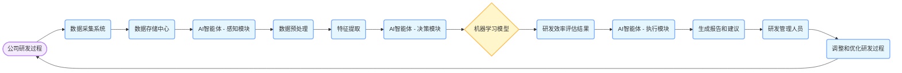

# AI智能体在评估公司研发效率中的作用

> 关键词：AI智能体、公司研发效率、评估、数据驱动、自动化

> 摘要：本文深入探讨了AI智能体在评估公司研发效率中的作用。首先介绍了相关背景知识，包括目的、预期读者、文档结构和术语表。接着阐述了核心概念及联系，通过文本示意图和Mermaid流程图进行说明。详细讲解了核心算法原理，结合Python源代码展示具体操作步骤，并给出数学模型和公式及相应举例。通过项目实战呈现代码实际案例及详细解释，分析了实际应用场景。推荐了相关的工具和资源，包括学习资源、开发工具框架和论文著作。最后总结了未来发展趋势与挑战，还包含常见问题解答和扩展阅读参考资料。旨在全面展现AI智能体在评估公司研发效率方面的重要性和应用方法。

## 1. 背景介绍 
### 1.1 目的和范围
在当今竞争激烈的商业环境中，公司的研发效率直接关系到其创新能力和市场竞争力。评估公司研发效率对于优化资源分配、提高创新产出具有重要意义。然而，传统的研发效率评估方法往往依赖于人工统计和主观判断，存在效率低、准确性差等问题。本文的目的是探讨AI智能体在评估公司研发效率中的作用，通过引入先进的人工智能技术，实现研发效率评估的自动化、精准化和智能化。

本文的范围涵盖了AI智能体的基本概念、核心算法原理、数学模型，以及在实际项目中的应用案例。同时，还将介绍相关的工具和资源，为读者提供全面的参考。

### 1.2 预期读者
本文预期读者包括公司的研发管理人员、技术专家、数据分析师、人工智能研究人员，以及对公司研发效率评估和AI智能体应用感兴趣的相关人士。

### 1.3 文档结构概述
本文共分为十个部分。第一部分为背景介绍，阐述了研究的目的、范围、预期读者和文档结构。第二部分介绍核心概念与联系，通过文本示意图和Mermaid流程图展示AI智能体与公司研发效率评估的关系。第三部分讲解核心算法原理和具体操作步骤，使用Python源代码进行详细阐述。第四部分给出数学模型和公式，并进行详细讲解和举例说明。第五部分是项目实战，包括开发环境搭建、源代码实现和代码解读。第六部分分析实际应用场景。第七部分推荐相关的工具和资源。第八部分总结未来发展趋势与挑战。第九部分为附录，包含常见问题与解答。第十部分提供扩展阅读和参考资料。

### 1.4 术语表
#### 1.4.1 核心术语定义
- **AI智能体（AI Agent）**：是一种能够感知环境、根据内部状态和目标进行决策，并执行相应动作的人工智能实体。它可以自主地或在人类的指导下完成各种任务。
- **公司研发效率**：指公司在研发过程中投入的资源（如人力、物力、财力）与产出（如新产品、新技术、专利等）之间的比率，反映了公司研发活动的有效性和效益。
- **评估**：对事物的价值、性能、质量等进行判断和评价的过程。在本文中，指对公司研发效率进行量化和分析的过程。

#### 1.4.2 相关概念解释
- **数据驱动**：指基于大量的数据进行分析和决策的方法。在AI智能体评估公司研发效率中，通过收集和分析研发过程中的各种数据，为评估提供依据。
- **自动化**：指利用计算机技术和控制系统，使生产、管理等过程自动进行，减少人工干预。在研发效率评估中，AI智能体可以自动收集、处理和分析数据，实现评估过程的自动化。

#### 1.4.3 缩略词列表
- **AI**：Artificial Intelligence，人工智能
- **ML**：Machine Learning，机器学习
- **DL**：Deep Learning，深度学习

## 2. 核心概念与联系 
### 核心概念原理
AI智能体是基于人工智能技术构建的智能实体，它由感知模块、决策模块和执行模块组成。感知模块负责收集环境信息，决策模块根据感知到的信息和内部状态进行决策，执行模块根据决策结果执行相应的动作。

在评估公司研发效率中，AI智能体的感知模块可以收集研发过程中的各种数据，如项目进度、人员投入、资源消耗、技术创新成果等。决策模块利用机器学习和数据分析算法对这些数据进行处理和分析，评估研发效率的高低，并找出影响研发效率的因素。执行模块可以根据评估结果提供相应的建议和措施，帮助公司优化研发流程，提高研发效率。

### 架构的文本示意图
AI智能体评估公司研发效率的架构可以描述如下：

公司研发过程产生各种数据，这些数据通过数据采集系统收集到数据存储中心。AI智能体的感知模块从数据存储中心获取数据，对数据进行预处理和特征提取。决策模块利用机器学习模型对处理后的数据进行分析和评估，得出研发效率的评估结果。执行模块根据评估结果生成报告和建议，并将其反馈给公司的研发管理人员和相关人员。研发管理人员根据反馈信息对研发过程进行调整和优化，从而提高研发效率。

### Mermaid流程图


## 3. 核心算法原理 & 具体操作步骤 
### 核心算法原理
在AI智能体评估公司研发效率中，常用的算法包括机器学习算法和数据分析算法。其中，机器学习算法主要用于构建评估模型，数据分析算法用于数据预处理和特征提取。

#### 机器学习算法
- **线性回归**：用于建立研发效率与影响因素之间的线性关系。线性回归模型的基本形式为：
$y = \beta_0 + \beta_1x_1 + \beta_2x_2 + \cdots + \beta_nx_n + \epsilon$
其中，$y$ 表示研发效率，$x_1, x_2, \cdots, x_n$ 表示影响研发效率的因素，$\beta_0, \beta_1, \cdots, \beta_n$ 是模型的参数，$\epsilon$ 是误差项。

- **决策树**：是一种基于树结构进行决策的算法。决策树通过对数据进行划分，构建决策规则，从而对研发效率进行分类和预测。

- **神经网络**：是一种模仿人类神经系统的计算模型。神经网络可以自动学习数据中的复杂模式和关系，适用于处理高维、非线性的数据。

#### 数据分析算法
- **数据清洗**：用于去除数据中的噪声、缺失值和异常值，提高数据的质量。
- **特征选择**：从大量的特征中选择出对研发效率影响较大的特征，减少数据的维度，提高模型的性能。
- **归一化**：将数据的取值范围映射到一个固定的区间，如 $[0, 1]$ 或 $[-1, 1]$，以消除不同特征之间的量纲差异。

### 具体操作步骤
#### 步骤1：数据收集
收集公司研发过程中的各种数据，包括项目信息、人员信息、资源信息、技术创新成果等。数据可以从公司的信息系统、项目管理工具、数据库等来源获取。

#### 步骤2：数据预处理
对收集到的数据进行清洗、特征选择和归一化处理。以下是使用Python进行数据预处理的示例代码：
```python
import pandas as pd
from sklearn.preprocessing import MinMaxScaler
from sklearn.feature_selection import SelectKBest
from sklearn.feature_selection import f_regression

# 读取数据
data = pd.read_csv('research_data.csv')

# 处理缺失值
data = data.dropna()

# 特征选择
X = data.drop('efficiency', axis=1)
y = data['efficiency']
selector = SelectKBest(score_func=f_regression, k=5)
X_selected = selector.fit_transform(X, y)

# 归一化处理
scaler = MinMaxScaler()
X_normalized = scaler.fit_transform(X_selected)
```

#### 步骤3：模型训练
选择合适的机器学习算法，如线性回归、决策树或神经网络，对预处理后的数据进行训练。以下是使用线性回归模型进行训练的示例代码：
```python
from sklearn.linear_model import LinearRegression
from sklearn.model_selection import train_test_split

# 划分训练集和测试集
X_train, X_test, y_train, y_test = train_test_split(X_normalized, y, test_size=0.2, random_state=42)

# 训练线性回归模型
model = LinearRegression()
model.fit(X_train, y_train)
```

#### 步骤4：模型评估
使用测试集对训练好的模型进行评估，计算模型的性能指标，如均方误差（MSE）、决定系数（$R^2$）等。以下是评估模型的示例代码：
```python
from sklearn.metrics import mean_squared_error, r2_score

# 预测
y_pred = model.predict(X_test)

# 计算性能指标
mse = mean_squared_error(y_test, y_pred)
r2 = r2_score(y_test, y_pred)

print(f"均方误差: {mse}")
print(f"决定系数: {r2}")
```

#### 步骤5：结果分析和反馈
根据模型的评估结果，分析研发效率的高低和影响因素，并提供相应的建议和措施。将分析结果反馈给公司的研发管理人员和相关人员，帮助他们优化研发过程。

## 4. 数学模型和公式 & 详细讲解 & 举例说明 
### 线性回归模型
线性回归模型是一种简单而常用的机器学习模型，用于建立自变量和因变量之间的线性关系。其数学公式为：
$$y = \beta_0 + \beta_1x_1 + \beta_2x_2 + \cdots + \beta_nx_n + \epsilon$$
其中，$y$ 是因变量（在本文中表示研发效率），$x_1, x_2, \cdots, x_n$ 是自变量（表示影响研发效率的因素），$\beta_0, \beta_1, \cdots, \beta_n$ 是模型的参数，$\epsilon$ 是误差项，服从均值为 0、方差为 $\sigma^2$ 的正态分布。

线性回归模型的目标是找到一组最优的参数 $\beta_0, \beta_1, \cdots, \beta_n$，使得预测值 $\hat{y}$ 与真实值 $y$ 之间的误差最小。常用的误差度量方法是均方误差（MSE）：
$$MSE = \frac{1}{m}\sum_{i=1}^{m}(y_i - \hat{y}_i)^2$$
其中，$m$ 是样本数量，$y_i$ 是第 $i$ 个样本的真实值，$\hat{y}_i$ 是第 $i$ 个样本的预测值。

为了找到最优的参数，可以使用最小二乘法。最小二乘法的基本思想是通过最小化均方误差来求解参数。对于线性回归模型，最小二乘法的解可以通过以下公式得到：
$$\hat{\beta} = (X^TX)^{-1}X^Ty$$
其中，$X$ 是自变量矩阵，$y$ 是因变量向量，$\hat{\beta}$ 是参数向量的估计值。

### 举例说明
假设我们要评估公司研发效率与研发人员数量、研发资金投入和研发时间的关系。我们收集了 10 个项目的数据，如下表所示：

| 项目编号 | 研发人员数量 ($x_1$) | 研发资金投入 ($x_2$)（万元） | 研发时间 ($x_3$)（月） | 研发效率 ($y$) |
| ---- | ---- | ---- | ---- | ---- |
| 1 | 5 | 100 | 6 | 0.8 |
| 2 | 6 | 120 | 7 | 0.85 |
| 3 | 7 | 130 | 8 | 0.9 |
| 4 | 8 | 150 | 9 | 0.92 |
| 5 | 9 | 160 | 10 | 0.95 |
| 6 | 10 | 180 | 11 | 0.98 |
| 7 | 11 | 200 | 12 | 1.0 |
| 8 | 12 | 220 | 13 | 1.02 |
| 9 | 13 | 240 | 14 | 1.05 |
| 10 | 14 | 260 | 15 | 1.08 |

我们可以使用线性回归模型来建立研发效率与研发人员数量、研发资金投入和研发时间之间的关系。以下是使用Python实现的代码：
```python
import numpy as np
from sklearn.linear_model import LinearRegression

# 自变量矩阵
X = np.array([[5, 100, 6], [6, 120, 7], [7, 130, 8], [8, 150, 9], [9, 160, 10],
              [10, 180, 11], [11, 200, 12], [12, 220, 13], [13, 240, 14], [14, 260, 15]])

# 因变量向量
y = np.array([0.8, 0.85, 0.9, 0.92, 0.95, 0.98, 1.0, 1.02, 1.05, 1.08])

# 训练线性回归模型
model = LinearRegression()
model.fit(X, y)

# 输出模型参数
print(f"截距: {model.intercept_}")
print(f"系数: {model.coef_}")
```

运行上述代码，我们可以得到模型的截距和系数。根据这些参数，我们可以得到线性回归方程：
$$y = \beta_0 + \beta_1x_1 + \beta_2x_2 + \beta_3x_3$$
其中，$\beta_0$ 是截距，$\beta_1, \beta_2, \beta_3$ 是系数。通过这个方程，我们可以预测不同研发人员数量、研发资金投入和研发时间下的研发效率。

## 5. 项目实战：代码实际案例和详细解释说明 
### 5.1  开发环境搭建
#### 操作系统
可以选择Windows、Linux或macOS等操作系统。本文以Windows 10为例进行说明。

#### 编程语言和开发工具
- **Python**：版本 3.7 及以上。可以从Python官方网站（https://www.python.org/downloads/） 下载并安装。
- **Anaconda**：是一个开源的Python发行版本，包含了Python解释器、常用的科学计算库和开发工具。可以从Anaconda官方网站（https://www.anaconda.com/products/individual） 下载并安装。
- **PyCharm**：是一款专业的Python集成开发环境（IDE）。可以从JetBrains官方网站（https://www.jetbrains.com/pycharm/download/） 下载并安装。

#### 安装必要的库
在Anaconda的命令提示符中，使用以下命令安装必要的库：
```sh
pip install pandas numpy scikit-learn matplotlib
```

### 5.2  源代码详细实现和代码解读
#### 数据收集和预处理
```python
import pandas as pd
from sklearn.preprocessing import MinMaxScaler
from sklearn.feature_selection import SelectKBest
from sklearn.feature_selection import f_regression

# 读取数据
data = pd.read_csv('research_data.csv')

# 处理缺失值
data = data.dropna()

# 特征选择
X = data.drop('efficiency', axis=1)
y = data['efficiency']
selector = SelectKBest(score_func=f_regression, k=5)
X_selected = selector.fit_transform(X, y)

# 归一化处理
scaler = MinMaxScaler()
X_normalized = scaler.fit_transform(X_selected)
```
**代码解读**：
- `pd.read_csv('research_data.csv')`：读取存储在CSV文件中的研发数据。
- `data.dropna()`：删除包含缺失值的行。
- `SelectKBest(score_func=f_regression, k=5)`：使用F回归进行特征选择，选择对研发效率影响最大的 5 个特征。
- `MinMaxScaler()`：对特征数据进行归一化处理，将数据的取值范围映射到 $[0, 1]$ 区间。

#### 模型训练和评估
```python
from sklearn.linear_model import LinearRegression
from sklearn.model_selection import train_test_split
from sklearn.metrics import mean_squared_error, r2_score

# 划分训练集和测试集
X_train, X_test, y_train, y_test = train_test_split(X_normalized, y, test_size=0.2, random_state=42)

# 训练线性回归模型
model = LinearRegression()
model.fit(X_train, y_train)

# 预测
y_pred = model.predict(X_test)

# 计算性能指标
mse = mean_squared_error(y_test, y_pred)
r2 = r2_score(y_test, y_pred)

print(f"均方误差: {mse}")
print(f"决定系数: {r2}")
```
**代码解读**：
- `train_test_split(X_normalized, y, test_size=0.2, random_state=42)`：将数据集划分为训练集和测试集，其中测试集占 20%。
- `LinearRegression()`：创建线性回归模型。
- `model.fit(X_train, y_train)`：使用训练集数据对模型进行训练。
- `model.predict(X_test)`：使用训练好的模型对测试集数据进行预测。
- `mean_squared_error(y_test, y_pred)`：计算预测值与真实值之间的均方误差。
- `r2_score(y_test, y_pred)`：计算模型的决定系数，评估模型的拟合优度。

### 5.3  代码解读与分析
通过上述代码，我们实现了一个简单的AI智能体评估公司研发效率的项目。首先，我们对收集到的研发数据进行预处理，包括处理缺失值、特征选择和归一化处理。然后，使用线性回归模型对预处理后的数据进行训练和评估。

均方误差（MSE）反映了预测值与真实值之间的平均误差，MSE越小，模型的预测精度越高。决定系数（$R^2$）表示模型对数据的拟合程度，$R^2$ 越接近 1，模型的拟合效果越好。

在实际应用中，我们可以根据评估结果对模型进行优化，如选择更合适的特征、调整模型参数、使用更复杂的模型等。同时，我们还可以将评估结果反馈给公司的研发管理人员，帮助他们优化研发过程，提高研发效率。

## 6. 实际应用场景 
### 资源分配优化
AI智能体可以通过评估公司研发效率，分析不同项目、不同团队的研发效率差异，帮助公司合理分配研发资源。例如，对于研发效率高的项目和团队，可以适当增加资源投入，以加快项目进度和提高创新产出；对于研发效率低的项目和团队，可以进行深入分析，找出问题所在，并采取相应的措施进行改进。

### 项目进度监控
AI智能体可以实时收集和分析项目进度数据，预测项目的完成时间和风险。当项目进度出现偏差时，AI智能体可以及时发出预警，并提供相应的建议和措施，帮助项目团队调整计划，确保项目按时完成。

### 人才评估和培养
AI智能体可以通过分析研发人员的工作表现和成果，评估研发人员的能力和潜力。对于能力强、潜力大的研发人员，可以给予更多的培训和晋升机会；对于能力不足的研发人员，可以提供有针对性的培训和指导，帮助他们提高研发能力。

### 技术创新评估
AI智能体可以对公司的技术创新成果进行评估，分析技术创新的方向和趋势。通过与竞争对手的技术创新进行比较，AI智能体可以帮助公司发现自身的优势和不足，制定合理的技术创新策略，提高公司的技术创新能力。

## 7. 工具和资源推荐
### 7.1 学习资源推荐
#### 7.1.1 书籍推荐
- 《Python机器学习》（Sebastian Raschka著）：介绍了Python在机器学习中的应用，包括各种机器学习算法的原理和实现。
- 《深度学习》（Ian Goodfellow、Yoshua Bengio和Aaron Courville著）：深度学习领域的经典著作，全面介绍了深度学习的理论和实践。
- 《人工智能：一种现代的方法》（Stuart Russell和Peter Norvig著）：人工智能领域的权威教材，涵盖了人工智能的各个方面。

#### 7.1.2 在线课程
- Coursera上的“机器学习”课程（Andrew Ng教授授课）：经典的机器学习入门课程，介绍了机器学习的基本概念、算法和应用。
- edX上的“深度学习微硕士项目”：系统地介绍了深度学习的理论和实践，包括卷积神经网络、循环神经网络等。
- 中国大学MOOC上的“人工智能基础”课程：适合初学者学习人工智能的基本概念和方法。

#### 7.1.3 技术博客和网站
- Medium：有许多关于人工智能、机器学习和数据分析的优秀博客文章。
- Towards Data Science：专注于数据科学和机器学习领域的技术文章和案例分享。
- Kaggle：一个数据科学竞赛平台，提供了大量的数据集、代码和技术文章。

### 7.2 开发工具框架推荐
#### 7.2.1 IDE和编辑器
- PyCharm：专业的Python集成开发环境，具有强大的代码编辑、调试和项目管理功能。
- Jupyter Notebook：交互式的编程环境，适合进行数据探索和模型开发。
- Visual Studio Code：轻量级的代码编辑器，支持多种编程语言和插件扩展。

#### 7.2.2 调试和性能分析工具
- Py-Spy：用于分析Python代码的性能瓶颈，找出耗时的函数和代码段。
- TensorBoard：TensorFlow的可视化工具，用于监控模型训练过程和分析模型性能。
- Scikit-learn的`cross_val_score`：用于对机器学习模型进行交叉验证，评估模型的性能和稳定性。

#### 7.2.3 相关框架和库
- Scikit-learn：Python中常用的机器学习库，提供了各种机器学习算法和工具。
- TensorFlow：开源的深度学习框架，广泛应用于图像识别、自然语言处理等领域。
- PyTorch：另一个流行的深度学习框架，具有动态计算图和易于使用的特点。

### 7.3 相关论文著作推荐
#### 7.3.1 经典论文
- “Gradient-Based Learning Applied to Document Recognition”（Yann LeCun、Léon Bottou、Yoshua Bengio和Patrick Haffner著）：介绍了卷积神经网络（CNN）在手写数字识别中的应用，是深度学习领域的经典论文。
- “Long Short-Term Memory”（Sepp Hochreiter和Jürgen Schmidhuber著）：提出了长短期记忆网络（LSTM），解决了循环神经网络（RNN）中的梯度消失问题。
- “Attention Is All You Need”（Ashish Vaswani等人著）：提出了Transformer模型，是自然语言处理领域的重要突破。

#### 7.3.2 最新研究成果
- 可以关注顶级学术会议如NeurIPS（神经信息处理系统大会）、ICML（国际机器学习会议）、CVPR（计算机视觉与模式识别会议）等的最新研究成果。
- 还可以关注知名学术期刊如Journal of Artificial Intelligence Research（JAIR）、Artificial Intelligence等的最新论文。

#### 7.3.3 应用案例分析
- 许多科技公司和研究机构会发布AI智能体在不同领域的应用案例，如Google、Microsoft、IBM等公司的官方博客和研究报告。
- 一些行业报告和白皮书也会介绍AI智能体在特定行业的应用实践和效果。

## 8. 总结：未来发展趋势与挑战
### 未来发展趋势
- **智能化程度不断提高**：随着人工智能技术的不断发展，AI智能体将具备更强的感知、决策和执行能力，能够更加准确地评估公司研发效率，并提供更加智能化的建议和措施。
- **与其他技术融合**：AI智能体将与大数据、物联网、区块链等技术深度融合，实现研发过程的全面数字化和智能化。例如，通过物联网设备实时收集研发过程中的数据，利用区块链技术保证数据的安全性和可信度。
- **应用领域不断拓展**：AI智能体在评估公司研发效率中的应用将不仅仅局限于传统的制造业和科技行业，还将拓展到金融、医疗、教育等更多领域，为不同行业的研发创新提供支持。

### 挑战
- **数据质量和安全问题**：AI智能体的评估结果依赖于大量的研发数据，数据的质量和安全直接影响评估的准确性和可靠性。因此，需要解决数据收集、存储、传输和使用过程中的质量和安全问题。
- **模型解释性问题**：一些复杂的机器学习模型，如神经网络，往往是黑盒模型，难以解释其决策过程和结果。在评估公司研发效率时，需要提高模型的解释性，以便研发管理人员能够理解和信任评估结果。
- **人才短缺问题**：AI智能体的开发和应用需要具备人工智能、机器学习、数据分析等多方面知识和技能的专业人才。目前，相关领域的人才短缺是制约AI智能体发展的重要因素之一。

## 9. 附录：常见问题与解答
### 问题1：AI智能体评估公司研发效率的准确性如何保证？
答：为了保证AI智能体评估公司研发效率的准确性，需要从以下几个方面入手：
- 确保数据的质量，包括数据的完整性、准确性和一致性。
- 选择合适的机器学习算法和模型，并进行充分的训练和优化。
- 对模型进行评估和验证，使用多种性能指标来评估模型的准确性和可靠性。
- 不断更新和完善数据和模型，以适应研发过程的变化。

### 问题2：AI智能体能否完全替代人工评估公司研发效率？
答：虽然AI智能体可以自动化地收集、处理和分析数据，提高评估的效率和准确性，但目前还不能完全替代人工评估。人工评估可以考虑到一些难以量化的因素，如研发人员的创造力、团队协作精神等。因此，在实际应用中，通常采用AI智能体与人工评估相结合的方式，以充分发挥两者的优势。

### 问题3：如何选择适合的机器学习算法来评估公司研发效率？
答：选择适合的机器学习算法需要考虑以下几个因素：
- 数据的特点，如数据的类型、规模、分布等。
- 问题的性质，如回归问题、分类问题等。
- 模型的复杂度和可解释性。
- 计算资源和时间成本。

一般来说，可以先尝试一些简单的算法，如线性回归、决策树等，然后根据评估结果和实际需求选择更复杂的算法，如神经网络、支持向量机等。

## 10. 扩展阅读 & 参考资料
### 扩展阅读
- 《AI未来进行式》（李开复、王咏刚著）：介绍了人工智能的发展趋势和应用前景。
- 《大数据时代》（维克托·迈尔 - 舍恩伯格、肯尼斯·库克耶著）：探讨了大数据对社会、经济和生活的影响。
- 《第四次工业革命》（克劳斯·施瓦布著）：分析了第四次工业革命的特点和趋势。

### 参考资料
- 相关学术论文和研究报告
- 人工智能、机器学习和数据分析领域的专业书籍和教材
- 各大科技公司和研究机构的官方网站和博客

作者：AI天才研究院/AI Genius Institute & 禅与计算机程序设计艺术 /Zen And The Art of Computer Programming