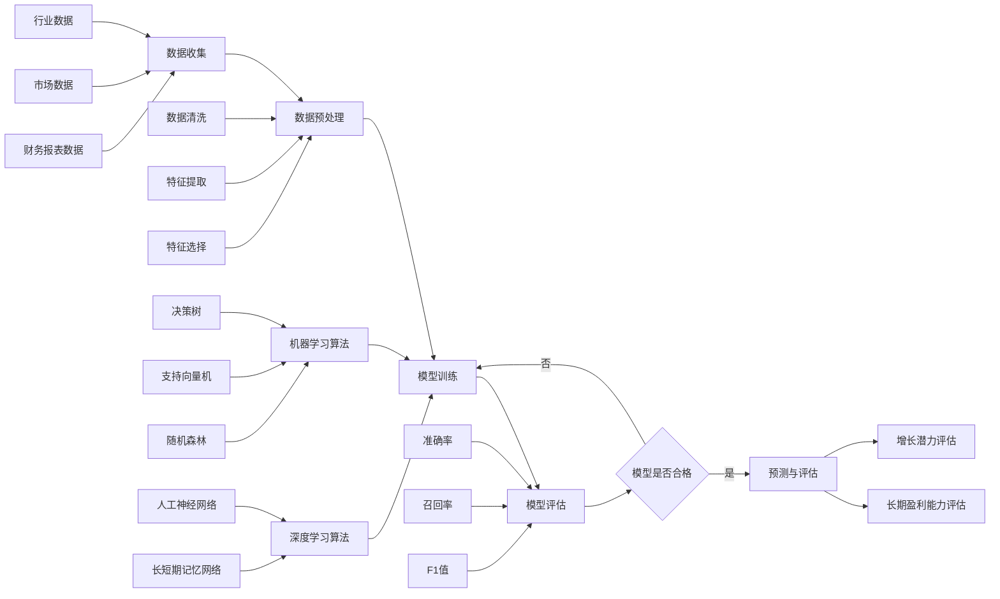

# AI智能体在评估公司长期盈利能力和增长潜力中的应用

> 关键词：AI智能体、公司评估、长期盈利能力、增长潜力、金融分析

> 摘要：本文深入探讨了AI智能体在评估公司长期盈利能力和增长潜力方面的应用。首先介绍了相关背景，包括目的、预期读者、文档结构和术语表。接着阐述了核心概念及联系，通过文本示意图和Mermaid流程图进行清晰展示。详细讲解了核心算法原理和具体操作步骤，并给出Python源代码示例。对涉及的数学模型和公式进行了详细讲解与举例说明。通过项目实战，展示了代码的实际应用和解读。分析了AI智能体在该领域的实际应用场景，推荐了学习资源、开发工具框架以及相关论文著作。最后总结了未来发展趋势与挑战，提供了常见问题解答和扩展阅读参考资料。

## 1. 背景介绍 
### 1.1 目的和范围
在当今复杂多变的商业环境中，准确评估公司的长期盈利能力和增长潜力对于投资者、分析师以及企业管理者来说至关重要。传统的评估方法往往依赖于人工分析和经验判断，存在主观性强、效率低、难以处理海量数据等问题。AI智能体的出现为解决这些问题提供了新的途径。本文旨在探讨AI智能体在评估公司长期盈利能力和增长潜力方面的应用，详细介绍相关技术原理、算法实现、实际案例以及未来发展趋势。

### 1.2 预期读者
本文的预期读者包括金融分析师、投资者、企业管理者、数据科学家、人工智能研究者以及对该领域感兴趣的技术爱好者。通过阅读本文，读者可以深入了解AI智能体在公司评估中的应用原理和方法，为实际工作和研究提供参考。

### 1.3 文档结构概述
本文共分为十个部分。第一部分为背景介绍，阐述了文章的目的、预期读者和文档结构。第二部分介绍核心概念与联系，通过文本示意图和Mermaid流程图展示相关概念的原理和架构。第三部分详细讲解核心算法原理和具体操作步骤，并给出Python源代码示例。第四部分介绍数学模型和公式，进行详细讲解并举例说明。第五部分通过项目实战，展示代码的实际应用和解读。第六部分分析AI智能体在该领域的实际应用场景。第七部分推荐学习资源、开发工具框架以及相关论文著作。第八部分总结未来发展趋势与挑战。第九部分提供常见问题解答。第十部分列出扩展阅读和参考资料。

### 1.4 术语表
#### 1.4.1 核心术语定义
- **AI智能体**：一种能够感知环境、自主决策并采取行动以实现特定目标的人工智能系统。
- **长期盈利能力**：指公司在较长时间内持续获得利润的能力。
- **增长潜力**：指公司在未来一段时间内实现业务增长的可能性和能力。
- **金融分析**：对公司的财务状况、经营业绩、市场竞争力等进行分析和评估的过程。

#### 1.4.2 相关概念解释
- **机器学习**：是一门多领域交叉学科，涉及概率论、统计学、逼近论、凸分析、算法复杂度理论等多门学科。它专门研究计算机怎样模拟或实现人类的学习行为，以获取新的知识或技能，重新组织已有的知识结构使之不断改善自身的性能。
- **深度学习**：是机器学习的一个分支领域，它是一种基于对数据进行表征学习的方法。深度学习通过构建具有很多层的神经网络模型，自动从大量数据中学习特征和模式。

#### 1.4.3 缩略词列表
- **AI**：Artificial Intelligence，人工智能
- **ML**：Machine Learning，机器学习
- **DL**：Deep Learning，深度学习
- **ANN**：Artificial Neural Network，人工神经网络
- **LSTM**：Long Short-Term Memory，长短期记忆网络

## 2. 核心概念与联系 

### 核心概念原理
AI智能体在评估公司长期盈利能力和增长潜力中，主要基于机器学习和深度学习技术。通过收集和分析公司的各种数据，包括财务报表数据、市场数据、行业数据等，构建模型来预测公司的未来盈利能力和增长趋势。

具体来说，AI智能体首先对数据进行预处理，包括数据清洗、特征提取和特征选择等步骤。然后，选择合适的机器学习或深度学习算法进行模型训练，如决策树、支持向量机、神经网络等。训练好的模型可以对新的数据进行预测，从而评估公司的长期盈利能力和增长潜力。

### 架构的文本示意图
```plaintext
数据收集
|
|-- 财务报表数据
|-- 市场数据
|-- 行业数据
|
数据预处理
|
|-- 数据清洗
|-- 特征提取
|-- 特征选择
|
模型训练
|
|-- 机器学习算法
|   |-- 决策树
|   |-- 支持向量机
|   |-- 随机森林
|-- 深度学习算法
|   |-- 人工神经网络
|   |-- 长短期记忆网络
|
模型评估
|
|-- 准确率
|-- 召回率
|-- F1值
|
预测与评估
|
|-- 长期盈利能力评估
|-- 增长潜力评估
```

### Mermaid流程图


## 3. 核心算法原理 & 具体操作步骤 

### 核心算法原理
在评估公司长期盈利能力和增长潜力中，常用的算法包括决策树、支持向量机和长短期记忆网络。

#### 决策树
决策树是一种基于树结构进行决策的机器学习算法。它通过对数据的特征进行划分，构建一个树状模型，每个内部节点表示一个特征上的测试，每个分支表示一个测试输出，每个叶节点表示一个类别或值。决策树的优点是易于理解和解释，能够处理多分类问题。

#### 支持向量机
支持向量机是一种有监督的机器学习算法，用于分类和回归分析。它的基本思想是在特征空间中找到一个最优的超平面，使得不同类别的数据点能够被最大程度地分开。支持向量机在处理高维数据和小样本数据时具有较好的性能。

#### 长短期记忆网络
长短期记忆网络是一种特殊的循环神经网络，能够处理序列数据中的长期依赖关系。在评估公司长期盈利能力和增长潜力中，公司的财务数据和市场数据通常是时间序列数据，LSTM可以很好地捕捉这些数据中的时间信息和趋势。

### 具体操作步骤

#### 数据收集
收集公司的财务报表数据、市场数据和行业数据。财务报表数据包括资产负债表、利润表和现金流量表等；市场数据包括股票价格、成交量等；行业数据包括行业增长率、市场份额等。

#### 数据预处理
- **数据清洗**：去除数据中的噪声、缺失值和异常值。
- **特征提取**：从原始数据中提取有价值的特征，如财务比率、增长率等。
- **特征选择**：选择对模型预测结果影响较大的特征，减少特征维度。

#### 模型训练
- 划分训练集和测试集，将数据按照一定比例划分为训练集和测试集。
- 选择合适的算法进行模型训练，如决策树、支持向量机或LSTM。
- 调整模型参数，使用交叉验证等方法选择最优的模型参数。

#### 模型评估
使用测试集对训练好的模型进行评估，计算准确率、召回率、F1值等评估指标。

#### 预测与评估
使用训练好的模型对新的数据进行预测，评估公司的长期盈利能力和增长潜力。

### Python源代码示例
```python
import pandas as pd
from sklearn.model_selection import train_test_split
from sklearn.tree import DecisionTreeClassifier
from sklearn.svm import SVC
from sklearn.metrics import accuracy_score

# 数据收集和预处理
data = pd.read_csv('company_data.csv')
X = data.drop('target', axis=1)
y = data['target']

# 划分训练集和测试集
X_train, X_test, y_train, y_test = train_test_split(X, y, test_size=0.2, random_state=42)

# 决策树模型训练
dt_model = DecisionTreeClassifier()
dt_model.fit(X_train, y_train)
dt_pred = dt_model.predict(X_test)
dt_accuracy = accuracy_score(y_test, dt_pred)
print(f"决策树模型准确率: {dt_accuracy}")

# 支持向量机模型训练
svm_model = SVC()
svm_model.fit(X_train, y_train)
svm_pred = svm_model.predict(X_test)
svm_accuracy = accuracy_score(y_test, svm_pred)
print(f"支持向量机模型准确率: {svm_accuracy}")
```

## 4. 数学模型和公式 & 详细讲解 & 举例说明 

### 决策树
决策树的核心是信息增益，用于选择最优的划分特征。信息增益的计算公式为：
$$IG(D, A) = H(D) - H(D|A)$$
其中，$IG(D, A)$ 表示特征 $A$ 对数据集 $D$ 的信息增益，$H(D)$ 表示数据集 $D$ 的信息熵，$H(D|A)$ 表示在特征 $A$ 给定的条件下数据集 $D$ 的条件熵。

信息熵的计算公式为：
$$H(D) = -\sum_{i=1}^{n}p_i\log_2p_i$$
其中，$p_i$ 表示数据集 $D$ 中第 $i$ 类样本的比例。

条件熵的计算公式为：
$$H(D|A) = \sum_{j=1}^{m}\frac{|D_j|}{|D|}H(D_j)$$
其中，$D_j$ 表示根据特征 $A$ 的取值将数据集 $D$ 划分成的第 $j$ 个子集，$|D_j|$ 表示子集 $D_j$ 的样本数量，$|D|$ 表示数据集 $D$ 的样本数量。

举例说明：假设有一个数据集 $D$ 包含 10 个样本，其中正类样本有 6 个，负类样本有 4 个。特征 $A$ 有两个取值 $A_1$ 和 $A_2$，根据特征 $A$ 的取值将数据集 $D$ 划分成两个子集 $D_1$ 和 $D_2$，其中 $D_1$ 包含 4 个正类样本和 1 个负类样本，$D_2$ 包含 2 个正类样本和 3 个负类样本。

首先计算数据集 $D$ 的信息熵：
$$H(D) = -\frac{6}{10}\log_2\frac{6}{10} - \frac{4}{10}\log_2\frac{4}{10} \approx 0.971$$

然后计算子集 $D_1$ 和 $D_2$ 的信息熵：
$$H(D_1) = -\frac{4}{5}\log_2\frac{4}{5} - \frac{1}{5}\log_2\frac{1}{5} \approx 0.722$$
$$H(D_2) = -\frac{2}{5}\log_2\frac{2}{5} - \frac{3}{5}\log_2\frac{3}{5} \approx 0.971$$

接着计算条件熵：
$$H(D|A) = \frac{5}{10}H(D_1) + \frac{5}{10}H(D_2) = \frac{5}{10} \times 0.722 + \frac{5}{10} \times 0.971 \approx 0.847$$

最后计算信息增益：
$$IG(D, A) = H(D) - H(D|A) = 0.971 - 0.847 = 0.124$$

### 支持向量机
支持向量机的目标是找到一个最优的超平面 $w^T x + b = 0$，使得不同类别的数据点能够被最大程度地分开。这个问题可以转化为一个二次规划问题：
$$\min_{w, b, \xi} \frac{1}{2}w^T w + C\sum_{i=1}^{n}\xi_i$$
$$s.t. \quad y_i(w^T x_i + b) \geq 1 - \xi_i, \quad \xi_i \geq 0, \quad i = 1, 2, \cdots, n$$
其中，$w$ 是超平面的法向量，$b$ 是偏置项，$\xi_i$ 是松弛变量，$C$ 是惩罚参数。

通过引入拉格朗日乘子 $\alpha_i$ 和 $\mu_i$，可以将上述二次规划问题转化为对偶问题：
$$\max_{\alpha} \sum_{i=1}^{n}\alpha_i - \frac{1}{2}\sum_{i=1}^{n}\sum_{j=1}^{n}\alpha_i\alpha_j y_i y_j K(x_i, x_j)$$
$$s.t. \quad \sum_{i=1}^{n}\alpha_i y_i = 0, \quad 0 \leq \alpha_i \leq C, \quad i = 1, 2, \cdots, n$$
其中，$K(x_i, x_j)$ 是核函数，常用的核函数包括线性核、多项式核和高斯核等。

举例说明：假设有一个二维数据集，包含两个类别，正类样本为 $(1, 1)$ 和 $(2, 2)$，负类样本为 $(-1, -1)$ 和 $(-2, -2)$。使用线性核函数，即 $K(x_i, x_j) = x_i^T x_j$，可以求解上述对偶问题得到最优的拉格朗日乘子 $\alpha$，进而得到最优的超平面。

### 长短期记忆网络
LSTM的核心是门控机制，包括输入门 $i_t$、遗忘门 $f_t$ 和输出门 $o_t$。其计算公式如下：
$$f_t = \sigma(W_f[h_{t-1}, x_t] + b_f)$$
$$i_t = \sigma(W_i[h_{t-1}, x_t] + b_i)$$
$$\tilde{C}_t = \tanh(W_C[h_{t-1}, x_t] + b_C)$$
$$C_t = f_t \odot C_{t-1} + i_t \odot \tilde{C}_t$$
$$o_t = \sigma(W_o[h_{t-1}, x_t] + b_o)$$
$$h_t = o_t \odot \tanh(C_t)$$
其中，$\sigma$ 是 sigmoid 函数，$\tanh$ 是双曲正切函数，$W$ 是权重矩阵，$b$ 是偏置向量，$\odot$ 表示元素级乘法。

举例说明：假设有一个时间序列数据，每个时间步的输入为一个二维向量 $x_t$，LSTM的隐藏层维度为 3。在每个时间步，首先计算遗忘门 $f_t$、输入门 $i_t$ 和候选细胞状态 $\tilde{C}_t$，然后更新细胞状态 $C_t$，最后计算输出门 $o_t$ 和隐藏状态 $h_t$。

## 5. 项目实战：代码实际案例和详细解释说明 

### 5.1  开发环境搭建
- **操作系统**：推荐使用 Linux 或 macOS 系统，也可以使用 Windows 系统。
- **Python 版本**：建议使用 Python 3.7 及以上版本。
- **开发工具**：可以使用 PyCharm、Jupyter Notebook 等开发工具。
- **依赖库**：需要安装 pandas、numpy、scikit-learn、tensorflow 等库，可以使用以下命令进行安装：
```sh
pip install pandas numpy scikit-learn tensorflow
```

### 5.2  源代码详细实现和代码解读
```python
import pandas as pd
import numpy as np
from sklearn.model_selection import train_test_split
from sklearn.preprocessing import StandardScaler
from tensorflow.keras.models import Sequential
from tensorflow.keras.layers import LSTM, Dense

# 数据收集和预处理
data = pd.read_csv('company_financial_data.csv')
# 假设数据集中包含多个特征列和一个目标列
X = data.drop('target', axis=1).values
y = data['target'].values

# 数据标准化
scaler = StandardScaler()
X = scaler.fit_transform(X)

# 调整数据形状以适应LSTM输入要求
X = np.reshape(X, (X.shape[0], 1, X.shape[1]))

# 划分训练集和测试集
X_train, X_test, y_train, y_test = train_test_split(X, y, test_size=0.2, random_state=42)

# 构建LSTM模型
model = Sequential()
model.add(LSTM(50, input_shape=(1, X_train.shape[2])))
model.add(Dense(1, activation='sigmoid'))

# 编译模型
model.compile(loss='binary_crossentropy', optimizer='adam', metrics=['accuracy'])

# 训练模型
model.fit(X_train, y_train, epochs=50, batch_size=32, validation_data=(X_test, y_test))

# 模型评估
loss, accuracy = model.evaluate(X_test, y_test)
print(f"模型损失: {loss}, 模型准确率: {accuracy}")
```

### 代码解读与分析
1. **数据收集和预处理**：使用 `pandas` 库读取 CSV 文件中的公司财务数据，将特征数据和目标数据分别存储在 `X` 和 `y` 中。
2. **数据标准化**：使用 `StandardScaler` 对特征数据进行标准化处理，使得数据具有零均值和单位方差，有助于提高模型的训练效果。
3. **调整数据形状**：由于 LSTM 模型的输入要求是三维数据，因此需要将二维的特征数据调整为三维形状 `(样本数量, 时间步长, 特征数量)`。
4. **划分训练集和测试集**：使用 `train_test_split` 函数将数据按照 80:20 的比例划分为训练集和测试集。
5. **构建 LSTM 模型**：使用 `Sequential` 模型构建一个简单的 LSTM 模型，包含一个 LSTM 层和一个全连接层。
6. **编译模型**：使用 `binary_crossentropy` 作为损失函数，`adam` 作为优化器，`accuracy` 作为评估指标。
7. **训练模型**：使用 `fit` 方法对模型进行训练，指定训练的轮数、批次大小和验证数据。
8. **模型评估**：使用 `evaluate` 方法对训练好的模型进行评估，计算模型的损失和准确率。

## 6. 实际应用场景 
### 投资者决策
投资者可以使用 AI 智能体评估公司的长期盈利能力和增长潜力，帮助他们做出投资决策。通过分析公司的财务数据、市场数据和行业数据，AI 智能体可以预测公司的未来业绩，为投资者提供参考。

### 金融机构风险评估
金融机构在进行贷款审批、信用评级等业务时，需要评估公司的还款能力和风险水平。AI 智能体可以通过对公司的多方面数据进行分析，准确评估公司的长期盈利能力和增长潜力，从而降低金融机构的风险。

### 企业战略规划
企业管理者可以利用 AI 智能体评估公司的长期盈利能力和增长潜力，制定合理的战略规划。通过了解公司的优势和劣势，以及市场的发展趋势，企业可以调整业务方向，提高竞争力。

### 行业研究和分析
研究机构和分析师可以使用 AI 智能体对整个行业的公司进行评估和分析，了解行业的发展趋势和竞争格局。这有助于他们撰写研究报告，为投资者和企业提供有价值的信息。

## 7. 工具和资源推荐
### 7.1 学习资源推荐
#### 7.1.1 书籍推荐
- 《机器学习》（周志华著）：全面介绍了机器学习的基本概念、算法和应用，是机器学习领域的经典教材。
- 《深度学习》（Ian Goodfellow、Yoshua Bengio 和 Aaron Courville 著）：深度学习领域的权威著作，详细介绍了深度学习的理论和实践。
- 《Python 机器学习》（Sebastian Raschka 著）：结合 Python 语言介绍了机器学习的算法和实现，适合初学者学习。

#### 7.1.2 在线课程
- Coursera 上的“机器学习”课程（Andrew Ng 教授主讲）：经典的机器学习课程，系统地介绍了机器学习的基本概念和算法。
- edX 上的“深度学习专项课程”（由深度学习领域的知名学者授课）：深入介绍了深度学习的理论和应用。
- 中国大学 MOOC 上的“人工智能基础”课程：涵盖了人工智能的多个领域，包括机器学习、深度学习等。

#### 7.1.3 技术博客和网站
- Medium 上的 Towards Data Science：汇集了大量的数据科学和机器学习相关的文章，包括最新的研究成果和实践经验。
- Kaggle：全球最大的数据科学竞赛平台，上面有很多关于机器学习和数据分析的案例和教程。
- 博客园：国内知名的技术博客平台，有很多关于人工智能和机器学习的技术文章。

### 7.2 开发工具框架推荐
#### 7.2.1 IDE和编辑器
- PyCharm：功能强大的 Python 集成开发环境，提供了代码编辑、调试、版本控制等功能。
- Jupyter Notebook：交互式的开发环境，适合进行数据探索和模型实验。
- Visual Studio Code：轻量级的代码编辑器，支持多种编程语言，有丰富的插件扩展。

#### 7.2.2 调试和性能分析工具
- TensorBoard：TensorFlow 提供的可视化工具，可以帮助用户监控模型的训练过程和性能指标。
- Py-Spy：用于分析 Python 程序性能的工具，可以找出程序中的性能瓶颈。
- cProfile：Python 内置的性能分析模块，可以统计函数的调用次数和执行时间。

#### 7.2.3 相关框架和库
- TensorFlow：开源的深度学习框架，由 Google 开发，提供了丰富的深度学习模型和工具。
- PyTorch：另一个流行的深度学习框架，具有动态图和易于使用的特点，受到很多研究者的喜爱。
- Scikit-learn：简单易用的机器学习库，提供了各种机器学习算法和工具，适合初学者和快速实验。

### 7.3 相关论文著作推荐
#### 7.3.1 经典论文
- “Gradient-based learning applied to document recognition”（Yann LeCun 等著）：介绍了卷积神经网络（CNN）的经典论文，为图像识别领域奠定了基础。
- “Long Short-Term Memory”（Sepp Hochreiter 和 Jürgen Schmidhuber 著）：提出了长短期记忆网络（LSTM）的论文，解决了循环神经网络中的长期依赖问题。
- “Support-Vector Networks”（Corinna Cortes 和 Vladimir Vapnik 著）：介绍了支持向量机（SVM）的经典论文，提出了 SVM 的基本思想和算法。

#### 7.3.2 最新研究成果
- 通过 Google Scholar 搜索相关领域的最新研究论文，关注顶级学术会议如 NeurIPS、ICML、CVPR 等的论文发表情况。
- 关注知名研究机构和学者的研究动态，如斯坦福大学、麻省理工学院、李开复等的研究成果。

#### 7.3.3 应用案例分析
- 可以在 Kaggle 上查找关于公司评估和金融分析的实际案例，学习他人的分析思路和方法。
- 阅读金融机构和研究机构发布的研究报告，了解 AI 智能体在实际应用中的效果和经验。

## 8. 总结：未来发展趋势与挑战
### 未来发展趋势
- **多模态数据融合**：未来的 AI 智能体将不仅仅依赖于财务数据和市场数据，还会融合文本数据、图像数据、视频数据等多模态数据，以更全面地评估公司的长期盈利能力和增长潜力。
- **强化学习的应用**：强化学习可以让 AI 智能体在动态环境中不断学习和优化决策，未来可能会在公司评估中得到更广泛的应用，例如根据市场变化实时调整评估策略。
- **可解释性 AI**：随着 AI 技术在金融领域的广泛应用，对模型的可解释性要求越来越高。未来的 AI 智能体将更加注重模型的可解释性，以便用户能够理解模型的决策过程和依据。
- **与区块链技术结合**：区块链技术具有去中心化、不可篡改等特点，可以为 AI 智能体提供更可靠的数据来源。未来两者的结合可能会提高公司评估的准确性和可信度。

### 挑战
- **数据质量和隐私问题**：高质量的数据是 AI 智能体准确评估的基础，但数据的收集、清洗和标注过程中可能存在质量问题。同时，金融数据涉及用户隐私和商业机密，如何在保护数据隐私的前提下进行有效的分析是一个挑战。
- **模型复杂度和计算资源**：深度学习模型通常具有较高的复杂度，需要大量的计算资源进行训练和推理。如何在有限的计算资源下提高模型的性能和效率是一个亟待解决的问题。
- **行业知识和专家经验的融合**：公司评估需要结合行业知识和专家经验，但 AI 智能体目前在这方面的能力还比较有限。如何将行业知识和专家经验融入到模型中，提高评估的准确性和可靠性是一个挑战。
- **法律法规和监管要求**：AI 技术在金融领域的应用需要遵守相关的法律法规和监管要求。如何确保 AI 智能体的应用符合法规要求，避免潜在的法律风险是一个重要的问题。

## 9. 附录：常见问题与解答
### 问题 1：AI 智能体评估公司的结果一定准确吗？
答：AI 智能体评估公司的结果受到多种因素的影响，包括数据质量、模型选择和参数调整等。虽然 AI 智能体可以利用大量的数据和先进的算法进行分析，但它并不能完全预测未来，评估结果只能作为参考，不能保证绝对准确。

### 问题 2：如何选择合适的算法进行公司评估？
答：选择合适的算法需要考虑数据的特点、问题的类型和模型的性能等因素。如果数据是结构化的，且问题是分类问题，可以考虑使用决策树、支持向量机等算法；如果数据是时间序列数据，可以考虑使用 LSTM 等循环神经网络算法。同时，还可以通过交叉验证等方法选择最优的模型参数。

### 问题 3：AI 智能体在评估公司时需要哪些数据？
答：AI 智能体在评估公司时通常需要公司的财务报表数据、市场数据和行业数据。财务报表数据包括资产负债表、利润表和现金流量表等；市场数据包括股票价格、成交量等；行业数据包括行业增长率、市场份额等。此外，还可以考虑使用文本数据、社交媒体数据等其他类型的数据。

### 问题 4：如何提高 AI 智能体评估的准确性？
答：可以从以下几个方面提高 AI 智能体评估的准确性：
- 提高数据质量：收集更多、更准确的数据，并进行有效的数据清洗和预处理。
- 选择合适的模型和算法：根据数据的特点和问题的类型选择合适的模型和算法，并进行参数调整。
- 融合多种数据源：融合财务数据、市场数据、行业数据等多种数据源，以更全面地了解公司的情况。
- 引入行业知识和专家经验：将行业知识和专家经验融入到模型中，提高模型的解释性和准确性。

## 10. 扩展阅读 & 参考资料
### 扩展阅读
- 《智能金融：科技驱动金融创新与变革》
- 《人工智能时代的金融科技》
- 《金融科技：应用与监管》

### 参考资料
- 周志华. 机器学习. 清华大学出版社, 2016.
- Ian Goodfellow, Yoshua Bengio, Aaron Courville. 深度学习. 人民邮电出版社, 2017.
- Sebastian Raschka. Python 机器学习. 人民邮电出版社, 2017.

作者：AI天才研究院/AI Genius Institute & 禅与计算机程序设计艺术 /Zen And The Art of Computer Programming