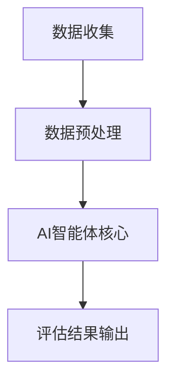

# AI智能体在评估品牌忠诚度中的作用

> 关键词：AI智能体、品牌忠诚度评估、机器学习、数据分析、客户行为分析

> 摘要：本文深入探讨了AI智能体在评估品牌忠诚度方面的重要作用。首先介绍了相关背景知识，包括研究目的、预期读者、文档结构和术语表。接着阐述了核心概念及它们之间的联系，并给出了原理和架构的文本示意图与Mermaid流程图。详细讲解了核心算法原理，使用Python源代码进行了说明，同时介绍了相关的数学模型和公式，并举例说明。通过项目实战，展示了如何搭建开发环境、实现源代码并进行解读分析。探讨了AI智能体在评估品牌忠诚度中的实际应用场景，推荐了学习资源、开发工具框架以及相关论文著作。最后总结了未来发展趋势与挑战，还提供了常见问题解答和扩展阅读参考资料。

## 1. 背景介绍 
### 1.1 目的和范围
在当今竞争激烈的市场环境中，品牌忠诚度是企业生存和发展的关键因素之一。准确评估品牌忠诚度有助于企业了解客户的行为和需求，制定更有效的营销策略，提高市场竞争力。本文章的目的在于深入探讨AI智能体在评估品牌忠诚度方面的作用，详细介绍相关的技术原理、算法和实际应用案例。文章的范围涵盖了从理论概念到实际操作的各个方面，旨在为读者提供全面、深入的了解。

### 1.2 预期读者
本文的预期读者包括市场营销人员、品牌管理人员、数据分析师、人工智能研究者以及对品牌忠诚度评估和AI技术应用感兴趣的相关人士。对于市场营销和品牌管理领域的人员，本文可以帮助他们了解如何利用AI智能体提升品牌忠诚度评估的准确性和效率；对于数据分析师和人工智能研究者，本文提供了相关的技术原理和算法实现细节，具有一定的参考价值。

### 1.3 文档结构概述
本文将按照以下结构进行组织：首先介绍背景知识，包括目的、读者、文档结构和术语表；接着阐述核心概念及联系，给出原理和架构的示意图；然后详细讲解核心算法原理和具体操作步骤，使用Python代码进行说明；再介绍相关的数学模型和公式，并举例说明；通过项目实战展示代码实现和分析；探讨实际应用场景；推荐学习资源、开发工具框架和相关论文著作；最后总结未来发展趋势与挑战，提供常见问题解答和扩展阅读参考资料。

### 1.4 术语表
#### 1.4.1 核心术语定义
- **AI智能体（AI Agent）**：是一种能够感知环境、进行决策并采取行动以实现特定目标的人工智能实体。它可以通过学习和适应不断优化自身的行为。
- **品牌忠诚度（Brand Loyalty）**：指消费者在长期内对某一品牌的产品或服务表现出的重复购买意愿和行为倾向，以及对该品牌的积极态度和情感依恋。
- **机器学习（Machine Learning）**：是一门多领域交叉学科，涉及概率论、统计学、逼近论、凸分析、算法复杂度理论等多门学科。它专门研究计算机怎样模拟或实现人类的学习行为，以获取新的知识或技能，重新组织已有的知识结构使之不断改善自身的性能。

#### 1.4.2 相关概念解释
- **客户细分（Customer Segmentation）**：根据客户的特征、行为、需求等因素将客户划分为不同的群体，以便企业能够针对不同群体制定个性化的营销策略。
- **情感分析（Sentiment Analysis）**：是自然语言处理的一个子领域，旨在确定文本中表达的情感倾向，如积极、消极或中性。在品牌忠诚度评估中，情感分析可以用于分析客户对品牌的评价和反馈。

#### 1.4.3 缩略词列表
- **AI**：Artificial Intelligence，人工智能
- **ML**：Machine Learning，机器学习
- **NLP**：Natural Language Processing，自然语言处理

## 2. 核心概念与联系 
### 核心概念原理
AI智能体在评估品牌忠诚度中主要基于机器学习和数据分析技术。AI智能体通过收集和分析大量的客户数据，包括购买行为、社交媒体反馈、客户评价等，来了解客户的需求和偏好，从而评估客户对品牌的忠诚度。

机器学习算法可以用于构建预测模型，根据客户的历史数据预测其未来的购买行为和品牌忠诚度。例如，使用分类算法可以将客户分为忠诚客户、潜在忠诚客户和非忠诚客户；使用聚类算法可以将客户划分为不同的群体，以便企业进行针对性的营销。

自然语言处理技术可以用于分析客户的文本数据，如社交媒体评论、客户评价等，以了解客户对品牌的情感倾向和态度。情感分析可以帮助企业及时发现客户的不满和需求，采取相应的措施提高客户满意度和品牌忠诚度。

### 架构的文本示意图
```plaintext
              +---------------------+
              |     数据收集层      |
              | （购买记录、评论等） |
              +---------------------+
                        |
                        v
              +---------------------+
              |     数据预处理层    |
              | （清洗、特征提取等） |
              +---------------------+
                        |
                        v
              +---------------------+
              |    AI智能体核心层   |
              | （机器学习模型）    |
              +---------------------+
                        |
                        v
              +---------------------+
              |    评估结果输出层   |
              | （品牌忠诚度得分等） |
              +---------------------+
```

### Mermaid流程图


## 3. 核心算法原理 & 具体操作步骤 
### 核心算法原理
在评估品牌忠诚度中，常用的机器学习算法包括逻辑回归、决策树、随机森林和支持向量机等。下面以逻辑回归算法为例进行详细讲解。

逻辑回归是一种广泛应用于分类问题的统计学习方法，它通过对输入特征进行线性组合，然后使用逻辑函数将线性组合的结果映射到[0, 1]区间，从而得到样本属于某一类别的概率。在品牌忠诚度评估中，我们可以将客户分为忠诚客户和非忠诚客户两类，逻辑回归模型可以根据客户的特征预测其属于忠诚客户的概率。

逻辑回归的数学模型可以表示为：

$$P(y=1|x)=\frac{1}{1 + e^{-(w_0 + w_1x_1 + w_2x_2 + \cdots + w_nx_n)}}$$

其中，$P(y=1|x)$ 表示在特征向量 $x=(x_1, x_2, \cdots, x_n)$ 下，样本属于正类（忠诚客户）的概率；$w_0, w_1, w_2, \cdots, w_n$ 是模型的参数；$e$ 是自然常数。

### 具体操作步骤
#### 步骤1：数据收集
收集客户的相关数据，包括购买记录、社交媒体反馈、客户评价等。数据可以来自企业的内部数据库、社交媒体平台、在线调查等渠道。

#### 步骤2：数据预处理
对收集到的数据进行清洗、转换和特征提取。清洗数据包括去除重复值、缺失值和异常值；转换数据包括对分类变量进行编码，对数值变量进行标准化处理；特征提取是从原始数据中提取有意义的特征，如购买频率、购买金额、客户评价的情感得分等。

#### 步骤3：模型训练
使用预处理后的数据对逻辑回归模型进行训练。训练过程的目标是找到最优的模型参数 $w_0, w_1, w_2, \cdots, w_n$，使得模型对训练数据的预测误差最小。常用的优化算法包括梯度下降法、随机梯度下降法等。

#### 步骤4：模型评估
使用测试数据对训练好的模型进行评估。常用的评估指标包括准确率、精确率、召回率和F1值等。评估指标可以帮助我们了解模型的性能，判断模型是否能够准确地预测客户的品牌忠诚度。

#### 步骤5：预测和应用
使用训练好的模型对新客户的品牌忠诚度进行预测。根据预测结果，企业可以制定相应的营销策略，如针对忠诚客户提供个性化的优惠和服务，针对非忠诚客户进行市场推广和客户挽回。

### Python源代码实现
```python
import numpy as np
from sklearn.linear_model import LogisticRegression
from sklearn.model_selection import train_test_split
from sklearn.metrics import accuracy_score

# 生成示例数据
np.random.seed(0)
X = np.random.randn(100, 2)
y = (X[:, 0] + X[:, 1] > 0).astype(int)

# 划分训练集和测试集
X_train, X_test, y_train, y_test = train_test_split(X, y, test_size=0.2, random_state=42)

# 创建逻辑回归模型
model = LogisticRegression()

# 训练模型
model.fit(X_train, y_train)

# 预测
y_pred = model.predict(X_test)

# 评估模型
accuracy = accuracy_score(y_test, y_pred)
print(f"模型准确率: {accuracy}")
```

## 4. 数学模型和公式 & 详细讲解 & 举例说明 
### 逻辑回归的数学模型和公式
逻辑回归的数学模型可以表示为：

$$P(y=1|x)=\frac{1}{1 + e^{-(w_0 + w_1x_1 + w_2x_2 + \cdots + w_nx_n)}}$$

其中，$P(y=1|x)$ 表示在特征向量 $x=(x_1, x_2, \cdots, x_n)$ 下，样本属于正类（忠诚客户）的概率；$w_0, w_1, w_2, \cdots, w_n$ 是模型的参数；$e$ 是自然常数。

逻辑回归的目标是找到最优的参数 $w_0, w_1, w_2, \cdots, w_n$，使得模型对训练数据的似然函数最大。似然函数可以表示为：

$$L(w)=\prod_{i=1}^{m}P(y^{(i)}=1|x^{(i)})^{y^{(i)}}(1 - P(y^{(i)}=1|x^{(i)}))^{1 - y^{(i)}}$$

其中，$m$ 是训练样本的数量；$x^{(i)}$ 和 $y^{(i)}$ 分别是第 $i$ 个训练样本的特征向量和标签。

为了方便计算，通常对似然函数取对数，得到对数似然函数：

$$\ell(w)=\sum_{i=1}^{m}[y^{(i)}\log P(y^{(i)}=1|x^{(i)})+(1 - y^{(i)})\log(1 - P(y^{(i)}=1|x^{(i)}))]$$

逻辑回归的训练过程就是通过优化算法（如梯度下降法）最大化对数似然函数 $\ell(w)$。

### 详细讲解
逻辑回归的核心思想是通过对输入特征进行线性组合，然后使用逻辑函数将线性组合的结果映射到[0, 1]区间，从而得到样本属于某一类别的概率。逻辑函数的形式为：

$$\sigma(z)=\frac{1}{1 + e^{-z}}$$

其中，$z$ 是线性组合的结果，即 $z = w_0 + w_1x_1 + w_2x_2 + \cdots + w_nx_n$。

逻辑函数的特点是将输入的实数 $z$ 映射到[0, 1]区间，当 $z$ 趋近于正无穷时，$\sigma(z)$ 趋近于 1；当 $z$ 趋近于负无穷时，$\sigma(z)$ 趋近于 0。因此，逻辑回归可以用于二分类问题，通过设定一个阈值（通常为 0.5），将概率大于阈值的样本预测为正类，将概率小于阈值的样本预测为负类。

### 举例说明
假设我们有一个简单的品牌忠诚度评估问题，我们使用两个特征：购买频率和购买金额。我们收集了 10 个客户的数据，如下表所示：

| 客户编号 | 购买频率（次/月） | 购买金额（元/月） | 品牌忠诚度（是=1，否=0） |
|----------|-------------------|-------------------|--------------------------|
| 1        | 2                 | 100               | 0                        |
| 2        | 3                 | 200               | 1                        |
| 3        | 1                 | 50                | 0                        |
| 4        | 4                 | 300               | 1                        |
| 5        | 2                 | 150               | 0                        |
| 6        | 3                 | 250               | 1                        |
| 7        | 1                 | 80                | 0                        |
| 8        | 4                 | 350               | 1                        |
| 9        | 2                 | 120               | 0                        |
| 10       | 3                 | 220               | 1                        |

我们可以使用逻辑回归模型对这些数据进行训练，然后预测新客户的品牌忠诚度。以下是使用Python实现的代码：

```python
import numpy as np
from sklearn.linear_model import LogisticRegression

# 特征矩阵
X = np.array([[2, 100], [3, 200], [1, 50], [4, 300], [2, 150], [3, 250], [1, 80], [4, 350], [2, 120], [3, 220]])
# 标签向量
y = np.array([0, 1, 0, 1, 0, 1, 0, 1, 0, 1])

# 创建逻辑回归模型
model = LogisticRegression()

# 训练模型
model.fit(X, y)

# 预测新客户的品牌忠诚度
new_customer = np.array([[3, 230]])
prediction = model.predict(new_customer)
print(f"新客户的品牌忠诚度预测结果: {prediction[0]}")
```

## 5. 项目实战：代码实际案例和详细解释说明 
### 5.1  开发环境搭建
#### 安装Python
首先，需要安装Python编程语言。可以从Python官方网站（https://www.python.org/downloads/）下载适合自己操作系统的Python安装包，并按照安装向导进行安装。

#### 安装必要的库
在评估品牌忠诚度的项目中，需要使用一些Python库，如NumPy、Pandas、Scikit-learn等。可以使用pip命令来安装这些库：

```sh
pip install numpy pandas scikit-learn
```

### 5.2  源代码详细实现和代码解读
以下是一个完整的项目实战代码示例，用于使用逻辑回归模型评估品牌忠诚度：

```python
import numpy as np
import pandas as pd
from sklearn.linear_model import LogisticRegression
from sklearn.model_selection import train_test_split
from sklearn.metrics import accuracy_score

# 读取数据
data = pd.read_csv('brand_loyalty_data.csv')

# 分离特征和标签
X = data.drop('loyalty', axis=1)
y = data['loyalty']

# 划分训练集和测试集
X_train, X_test, y_train, y_test = train_test_split(X, y, test_size=0.2, random_state=42)

# 创建逻辑回归模型
model = LogisticRegression()

# 训练模型
model.fit(X_train, y_train)

# 预测
y_pred = model.predict(X_test)

# 评估模型
accuracy = accuracy_score(y_test, y_pred)
print(f"模型准确率: {accuracy}")

# 预测新客户的品牌忠诚度
new_customer = pd.DataFrame({
    'purchase_frequency': [3],
    'purchase_amount': [230]
})
new_prediction = model.predict(new_customer)
print(f"新客户的品牌忠诚度预测结果: {new_prediction[0]}")
```

### 代码解读与分析
#### 读取数据
```python
data = pd.read_csv('brand_loyalty_data.csv')
```
使用Pandas库的`read_csv`函数读取存储在CSV文件中的客户数据。

#### 分离特征和标签
```python
X = data.drop('loyalty', axis=1)
y = data['loyalty']
```
将数据集中的特征（如购买频率、购买金额等）和标签（品牌忠诚度）分离。

#### 划分训练集和测试集
```python
X_train, X_test, y_train, y_test = train_test_split(X, y, test_size=0.2, random_state=42)
```
使用Scikit-learn库的`train_test_split`函数将数据集划分为训练集和测试集，其中测试集占总数据集的20%。

#### 创建和训练模型
```python
model = LogisticRegression()
model.fit(X_train, y_train)
```
创建逻辑回归模型，并使用训练集数据对模型进行训练。

#### 预测和评估
```python
y_pred = model.predict(X_test)
accuracy = accuracy_score(y_test, y_pred)
print(f"模型准确率: {accuracy}")
```
使用训练好的模型对测试集数据进行预测，并计算模型的准确率。

#### 预测新客户的品牌忠诚度
```python
new_customer = pd.DataFrame({
    'purchase_frequency': [3],
    'purchase_amount': [230]
})
new_prediction = model.predict(new_customer)
print(f"新客户的品牌忠诚度预测结果: {new_prediction[0]}")
```
创建一个新客户的特征数据，并使用训练好的模型对其品牌忠诚度进行预测。

## 6. 实际应用场景 
### 个性化营销
通过AI智能体评估客户的品牌忠诚度，企业可以将客户分为不同的群体，针对不同群体制定个性化的营销策略。对于忠诚客户，可以提供专属的优惠、礼品和服务，以增强他们的忠诚度；对于潜在忠诚客户，可以通过精准的营销活动引导他们增加购买频率和购买金额；对于非忠诚客户，可以了解他们的需求和不满，采取相应的措施进行客户挽回。

### 客户服务优化
AI智能体可以实时监测客户的反馈和评价，通过情感分析了解客户的满意度和忠诚度。当发现客户有不满情绪时，及时提醒企业的客户服务部门采取措施进行处理，提高客户满意度。同时，根据客户的历史购买行为和偏好，为客户提供个性化的服务建议，提升客户体验。

### 产品研发和改进
通过分析客户的购买行为和反馈，AI智能体可以了解客户对产品的需求和期望。企业可以根据这些信息进行产品研发和改进，推出更符合客户需求的产品，提高客户的品牌忠诚度。例如，根据客户对产品功能的反馈，增加或改进产品的功能；根据客户对产品包装的评价，优化产品的包装设计。

### 市场竞争分析
AI智能体可以收集和分析竞争对手的客户数据和市场动态，了解竞争对手的品牌忠诚度情况。通过对比分析，企业可以发现自身的优势和不足，制定相应的竞争策略。例如，如果发现竞争对手在某一客户群体中的品牌忠诚度较高，企业可以针对该群体制定差异化的营销策略，吸引更多的客户。

## 7. 工具和资源推荐
### 7.1 学习资源推荐
#### 7.1.1 书籍推荐
- 《机器学习》（周志华）：这本书是机器学习领域的经典教材，全面介绍了机器学习的基本概念、算法和应用。
- 《Python机器学习》（Sebastian Raschka）：本书详细介绍了如何使用Python进行机器学习，包括数据预处理、模型训练、评估和优化等方面的内容。
- 《自然语言处理入门》（何晗）：对于想要了解自然语言处理技术在品牌忠诚度评估中应用的读者，这本书是一个很好的入门选择。

#### 7.1.2 在线课程
- Coursera上的“机器学习”课程（Andrew Ng教授主讲）：这是一门非常经典的机器学习课程，通过视频讲解、编程作业和测验等方式，帮助学员系统地学习机器学习的知识和技能。
- edX上的“人工智能基础”课程：该课程涵盖了人工智能的基本概念、算法和应用，适合初学者学习。
- 阿里云大学的“人工智能实战”课程：提供了丰富的人工智能实践案例，帮助学员将理论知识应用到实际项目中。

#### 7.1.3 技术博客和网站
- 机器之心（https://www.alldatasheet.com/）：专注于人工智能领域的资讯和技术分享，提供了大量的前沿技术文章和案例分析。
- 开源中国（https://www.oschina.net/）：一个开源技术社区，包含了丰富的技术文章、代码示例和项目资源。
- Kaggle（https://www.kaggle.com/）：一个数据科学竞赛平台，提供了大量的数据集和竞赛项目，学员可以通过参与竞赛来提高自己的数据分析和机器学习能力。

### 7.2 开发工具框架推荐
#### 7.2.1 IDE和编辑器
- PyCharm：一款专门为Python开发设计的集成开发环境（IDE），提供了丰富的代码编辑、调试和项目管理功能。
- Jupyter Notebook：一个交互式的开发环境，适合进行数据分析和机器学习实验。用户可以在浏览器中编写和运行代码，同时可以插入文本、图片和公式等内容，方便记录和分享实验过程。
- Visual Studio Code：一款轻量级的代码编辑器，支持多种编程语言和插件扩展。通过安装Python相关的插件，用户可以使用Visual Studio Code进行Python开发。

#### 7.2.2 调试和性能分析工具
- PDB：Python自带的调试工具，可以帮助用户在代码中设置断点、单步执行代码和查看变量的值，方便进行代码调试。
- cProfile：Python的性能分析工具，可以统计代码中各个函数的执行时间和调用次数，帮助用户找出代码中的性能瓶颈。
- TensorBoard：一个用于可视化深度学习模型训练过程的工具，可以实时展示模型的训练损失、准确率等指标，方便用户监控模型的训练情况。

#### 7.2.3 相关框架和库
- NumPy：一个用于科学计算的Python库，提供了高效的多维数组对象和各种数学函数，是许多机器学习和数据分析库的基础。
- Pandas：一个用于数据处理和分析的Python库，提供了数据结构（如DataFrame）和数据操作方法，方便用户进行数据清洗、转换和分析。
- Scikit-learn：一个简单易用的机器学习库，提供了各种机器学习算法和工具，如分类、回归、聚类等，适合初学者和快速开发。
- TensorFlow和PyTorch：两个流行的深度学习框架，提供了丰富的深度学习模型和工具，适合开发复杂的人工智能应用。

### 7.3 相关论文著作推荐
#### 7.3.1 经典论文
- "The Elements of Statistical Learning: Data Mining, Inference, and Prediction"（Trevor Hastie, Robert Tibshirani, Jerome Friedman）：这本书是统计学习领域的经典著作，详细介绍了各种统计学习方法的原理和应用。
- "Machine Learning: A Probabilistic Perspective"（Kevin P. Murphy）：从概率的角度介绍了机器学习的基本概念和算法，对于理解机器学习的理论基础有很大帮助。
- "Deep Learning"（Ian Goodfellow, Yoshua Bengio, Aaron Courville）：深度学习领域的权威著作，全面介绍了深度学习的基本概念、算法和应用。

#### 7.3.2 最新研究成果
- 可以关注顶级学术会议（如NeurIPS、ICML、CVPR等）和学术期刊（如Journal of Machine Learning Research、Artificial Intelligence等）上发表的最新研究成果，了解AI智能体在评估品牌忠诚度方面的最新技术和方法。

#### 7.3.3 应用案例分析
- 可以参考一些商业杂志和行业报告，了解企业在实际应用中如何使用AI智能体评估品牌忠诚度，以及取得的效果和经验教训。例如，《哈佛商业评论》、《麦肯锡季刊》等杂志经常发表关于市场营销和人工智能应用的案例分析文章。

## 8. 总结：未来发展趋势与挑战
### 未来发展趋势
- **多模态数据融合**：未来，AI智能体将不仅依赖于传统的购买行为数据和文本数据，还将融合图像、语音、视频等多模态数据，以更全面地了解客户的需求和偏好，提高品牌忠诚度评估的准确性。
- **强化学习的应用**：强化学习可以让AI智能体在与环境的交互中不断学习和优化决策，未来在品牌忠诚度评估中，强化学习可以用于动态调整营销策略，根据客户的实时反馈和市场变化做出最优决策。
- **与区块链技术结合**：区块链技术可以提供数据的安全性和不可篡改性，将AI智能体与区块链技术结合，可以确保客户数据的隐私和安全，同时提高品牌忠诚度评估的可信度。
- **跨领域融合**：AI智能体在评估品牌忠诚度中将与其他领域（如心理学、社会学等）进行更深入的融合，从更全面的角度理解客户的行为和心理，为企业提供更有针对性的营销策略。

### 挑战
- **数据质量和隐私问题**：AI智能体的性能依赖于大量高质量的数据，但数据的收集、存储和使用过程中存在数据质量参差不齐和隐私泄露的风险。企业需要采取有效的措施来保证数据的质量和安全，遵守相关的法律法规。
- **算法解释性问题**：一些复杂的机器学习和深度学习算法（如神经网络）具有很强的预测能力，但缺乏解释性。在品牌忠诚度评估中，企业需要了解模型的决策依据，以便制定合理的营销策略。因此，提高算法的解释性是一个亟待解决的问题。
- **技术人才短缺**：AI智能体的开发和应用需要具备机器学习、数据分析、自然语言处理等多方面知识和技能的专业人才。目前，相关技术人才短缺，企业需要加大人才培养和引进的力度。
- **市场竞争加剧**：随着AI技术在品牌忠诚度评估中的应用越来越广泛，市场竞争也将加剧。企业需要不断创新和提高自身的技术水平，以在竞争中脱颖而出。

## 9. 附录：常见问题与解答
### 问题1：AI智能体评估品牌忠诚度的准确率如何保证？
答：为了保证AI智能体评估品牌忠诚度的准确率，需要从以下几个方面入手：首先，确保数据的质量，包括数据的准确性、完整性和一致性，对数据进行清洗和预处理，去除噪声和异常值；其次，选择合适的机器学习算法和模型，根据数据的特点和问题的需求进行模型选择和调优；最后，使用交叉验证等方法对模型进行评估和优化，不断提高模型的性能。

### 问题2：AI智能体评估品牌忠诚度需要哪些数据？
答：AI智能体评估品牌忠诚度需要收集多方面的数据，包括客户的购买行为数据（如购买频率、购买金额、购买时间等）、社交媒体反馈数据（如评论、点赞、分享等）、客户评价数据（如问卷调查、在线评价等）以及客户的基本信息（如年龄、性别、地域等）。这些数据可以帮助AI智能体更全面地了解客户的需求和偏好，从而准确评估客户的品牌忠诚度。

### 问题3：AI智能体评估品牌忠诚度的成本高吗？
答：AI智能体评估品牌忠诚度的成本主要包括数据收集和存储成本、算法开发和模型训练成本、计算资源成本等。对于一些小型企业来说，可能会觉得成本较高。但随着技术的发展和普及，相关的工具和平台越来越成熟，成本也在逐渐降低。同时，通过提高品牌忠诚度带来的收益可能会远远超过评估成本，因此从长远来看，使用AI智能体评估品牌忠诚度是具有较高性价比的。

### 问题4：AI智能体评估品牌忠诚度是否会取代人工分析？
答：AI智能体评估品牌忠诚度不会完全取代人工分析。虽然AI智能体可以处理大量的数据和复杂的算法，快速准确地评估品牌忠诚度，但它缺乏人类的主观判断和情感理解能力。在实际应用中，人工分析可以对AI智能体的评估结果进行解释和验证，结合行业经验和市场动态，做出更合理的决策。因此，AI智能体和人工分析应该相互补充，共同为企业的品牌忠诚度评估和营销决策提供支持。

## 10. 扩展阅读 & 参考资料
- 《市场营销管理》（菲利普·科特勒）
- 《数据挖掘：概念与技术》（Jiawei Han, Micheline Kamber, Jian Pei）
- "Customer Loyalty: Toward an Integrated Conceptual Framework"（Jacques B. Bloemer, Martin de Ruyter）
- "Using Machine Learning to Predict Customer Loyalty"（Journal of Marketing Analytics）
- 相关的行业报告和研究机构发布的白皮书

作者：AI天才研究院/AI Genius Institute & 禅与计算机程序设计艺术 /Zen And The Art of Computer Programming